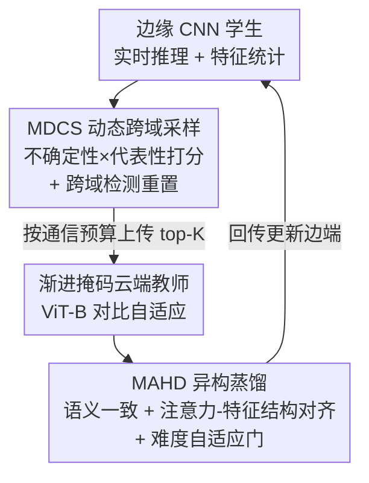

# Cross-Architecture Adaptation: Cloud-Edge Continual Test-Time Adaptation with Dynamic Sampling and Heterogeneous Distillation

**会议**: CVPR 2026  
**论文**: [CVF Open Access](https://openaccess.thecvf.com/content/CVPR2026/html/Xu_Cross-Architecture_Adaptation_Cloud-Edge_Continual_Test-Time_Adaptation_with_Dynamic_Sampling_and_CVPR_2026_paper.html)  
**代码**: 无  
**领域**: 模型压缩 / 云边协同 / 持续测试时自适应  
**关键词**: 持续测试时自适应, 云边协同, 异构知识蒸馏, 跨域检测, 动态采样

## 一句话总结
针对现有云边持续测试时自适应（CTTA）默认云端和边端同构 CNN 的限制，CAA 让云端跑大 ViT 教师、边端跑轻量 CNN 学生，靠一套「按通信预算挑样本上传 + 跨架构异构蒸馏」的机制完成异构协同自适应，在 ImageNet-C severity-5 上以 41.2% 平均准确率刷新 SOTA，同时上传样本数最少。

## 研究背景与动机
**领域现状**：CTTA 让模型在部署阶段只用流式到来的无标签测试样本持续自适应，应对昼夜、雨雪雾等不断漂移的分布。落到真实部署，主流做法是「云边协同」：边端设备做实时推理并监控分布漂移，把筛过的数据上传云端，云端用强模型通过知识蒸馏反过来更新边端模型。

**现有痛点**：现有云边 CTTA 几乎都假设云端与边端**同构**（都是 CNN，且共享同一架构）。但实际上边端受算力/显存约束只能跑 CNN（硬件优化成熟、易部署），云端却更适合用可扩展性强、大数据上表现好的 Transformer。强行让云边同构，要么云端被迫缩小成 tiny CNN 丢掉泛化力，要么 ViT 硬塞到边端跑不动。

**核心矛盾**：异构云边协同（Cloud-ViT / Edge-CNN）才是务实方案，但它把问题变难了——Transformer 教师和 CNN 学生的**归纳偏置、内部表征结构差异巨大**，让学生直接模仿教师的中间特征会产生跨层语义错位；已有异构蒸馏（如 HeteroAKD）只做静态 logit 对齐，扛不住 CTTA 里持续漂移的分布。

**本文目标**：作者把异构云边 CTTA 拆成三个互相纠缠的子问题——① 架构异构导致高保真蒸馏极难；② 通信带宽有严格预算，学生不能把所有数据都传；③ 持续域漂移会让历史统计量干扰当前推理、累积偏差，剧烈漂移时甚至退化成负迁移，连云端教师自身自适应都可能崩溃。

**切入角度**：与其让学生盲目模仿教师特征，不如（a）在边端只挑「信息量最大且类别均衡」的少量样本上传，并在检测到跨域切换时把历史状态清零；（b）在云端把蒸馏从单一 logit 对齐升级成「语义 + 结构」多层对齐，并用一个随样本难度变化的门控自适应调和两类目标。

**核心 idea**：用「动态跨域采样（管通信+漂移）+ 多层自适应异构蒸馏（跨架构传知识）」组成的 CAA 框架，把大 ViT 云端教师的知识高保真地灌进轻量 CNN 边端学生。

## 方法详解

### 整体框架
CAA 部署成一对异构云边模型：边端是轻量 CNN 学生 $g(\cdot)$（如 ResNet-18），负责实时推理、监控分布漂移、按预算挑样本上传；云端是大 Transformer 教师 $f(\cdot)$（如 ViT-B），用强容量自适应新数据并给出高质量指导。整条链路是一个闭环：边端学生对流式样本先推理 → 把特征与统计量喂给 **MDCS** 模块挑出最有信息量的 top-K 样本异步上传 → 云端 ViT 教师在上传样本上用**渐进式掩码**做对比自适应、产出可靠预测和中间表征 → **MAHD** 模块把教师知识跨架构蒸馏回边端学生 → 更新后的学生继续推理。三个贡献组件（MDCS、渐进掩码云教师、MAHD）正好对应下面框架图自上而下的流向。

### 关键设计

**1. 渐进式掩码云教师：防止教师在持续 OOD 流上自我崩溃**

云端教师虽强，但在 CTTA 里它自己也要无监督自适应，源源不断的 OOD/有偏样本可能让它灾难性崩溃，从而连带毁掉对学生的指导。CAA 给教师加了一个对比式自监督目标：对同一张图采两份掩码比例 $m_i < m_j$ 的版本 $x_i, x_j$，用 Shannon 熵 $S(\cdot)$ 衡量预测不确定性，强制「掩码更少的视图」预测更确信、且两视图预测一致：

$$L_{ViT} = \sum_{i<j}^{M_N} \max\big(0,\, S(f_t(x_i)) - \mathrm{sg}(S(f_t(x_j)))\big) + \theta \sum_{i<j}^{M_N} H\big(f_t(x_j), \mathrm{sg}(f_t(x_i))\big)$$

其中 $\mathrm{sg}(\cdot)$ 是停梯度算子、$H(\cdot,\cdot)$ 是两个预测间的交叉熵、$\theta$ 平衡「熵排序项」与「掩码一致项」。前一项让信息更全的视图熵更低（建立可信的难度排序），后一项把可信视图的知识蒸给被遮挡更多的视图。这样教师在无标签流上仍保持稳定、不退化，才能给学生提供可靠监督。

**2. MDCS 多准则动态跨域采样：在固定带宽下挑出最值钱的样本，并在域切换时清零状态**

通信预算严格，学生不能全量上传；而且持续漂移会让旧域统计干扰新域。MDCS 把「挑样本」和「检测漂移」统一起来解决。

挑样本用「不确定性×代表性」混合打分：$\text{Score}(x) = \alpha\cdot\text{Norm}(U(x)) + (1-\alpha)\cdot\text{Norm}(R(x))$，min–max 归一化避免某一项被离群值主导。不确定性 $U(x)$ 用轻量随机增强（TTAug）做两次前向 $g_t(\hat x), g_t(\bar x)$，取对称 KL：$U(x)=\tfrac12\big(\mathrm{KL}(g_t(\hat x)\|g_t(\bar x))+\mathrm{KL}(g_t(\bar x)\|g_t(\hat x))\big)$，预测越不稳越值得上传。代表性 $R(x)=\min_{c_m\in C}\|\text{AvgPool}(g_t^{(l^*)}(x))-c_m\|_2$ 借鉴 core-set，取学生第 $l^*{=}4$ 层（最贴近决策层的高层语义）特征到最近聚类中心的距离，$R(x)$ 越大说明样本落在欠覆盖区域，选它能让云端见到更多样、非冗余的例子；中心集 $C=\{c_1,\dots,c_M\}$ 由 mini-batch k-means 在线维护。边端用容量 $K_B$ 的最小堆缓冲，只有新样本得分严格超过堆内最小值才替换，异步批量上传后清空对应项——保证边端即便在弱/断连下也能不间断推理，连上后再吸收云端指导。

跨域检测做两路、取「与」触发：统计变化 $I^{stat}_t$ 监控 loss 的瞬时偏差 $z_t=|L_t-\mu_{tw}|/\sigma_{tw}$、相对偏差 $r_t$、以及 CUSUM 累积量 $A^{\pm}_t=\max(0, A^{\pm}_{t-1}\pm(L_t-\mu_{tw})-k)$ 捕捉持续漂移；特征-聚类漂移 $I^{cluster}_t$ 用样本到中心距离的滑窗标准差 $\sigma_{dt}$ 设尺度自适应阈值 $\kappa_d\sigma_{dt}$，统计离群样本占比 $\gamma_t$，当 $\gamma_t\ge\gamma^*$ 触发。只有两路都 fire（$I^{change}_t=I^{stat}_t\wedge I^{cluster}_t$）才判定跨域切换，随即**重置**优先级缓冲 $B$、与旧域耦合的统计量、以及中心集 $C$，让后续采样与蒸馏立即聚焦新域。值得注意的是聚类结果被「检测」和「打分」复用，省了一遍开销。

**3. MAHD 多层自适应异构蒸馏：跨架构同时传语义与结构，并按难度动态调和**

CNN 与 ViT 归纳偏置不同，强迫学生逐层模仿教师特征会语义错位。MAHD 不直接对齐特征数值，而是分两路、再用门控耦合。

语义一致对齐在一组层 $l\in L=\{1,2,4\}$ 上做加权交叉熵：$L^{(l)}_{clst}(x)=H\big((\text{Softmax}(f_t(x))+\hat y)^{\epsilon}-\hat y,\ P^{(l)}_{clst}(g^{(l)}_t(x))\big)$，其中 $\hat y$ 是教师硬预测的 one-hot 伪标签（应对难样本和教师错误），$P^{(l)}_{clst}$ 是可学习线性投影把学生特征映到 logit 空间，$\epsilon$ 控制对目标类的强调，最终对层集取平均。结构对齐在学生第 $l{=}3$ 层（空间分辨率与语义抽象的平衡点）做：把教师 patch token 和学生展平后的特征 token 各自投成多头 $Q,K,V$，**不对齐注意力输出**，而对齐相似度结构矩阵 $S_{qk}(h)=Q(h)K(h)^\top$ 与 $S_{vv}(h)=V(h)V(h)^\top$（教师矩阵双线性插值到学生分辨率）：

$$L^{(l)}_{attn_t}(x)=\big\|S_{qk}(f^{attn}_t)-S_{qk}(h^{(l)}_t)\big\|_F^2+\lambda_{vv}\big\|S_{vv}(f^{attn}_t)-S_{vv}(h^{(l)}_t)\big\|_F^2$$

另有特征对齐 $L^{(l)}_{feat_t}=\|f^{feat}_t-\hat h^{(l)}_t\|_F^2$，用分组线性投影 $P^{(l)}_{GL}$ 把学生表征映进教师特征空间后逐位置比对。前者约束全局上下文关系一致，后者强制位置级可比。

为避免分类目标和结构目标在持续自适应中互相打架、且静态权重很脆，MAHD 引入**难度自适应门** $\rho$：瞬时目标 $\rho^*=\Phi(L_{clst})$，$\Phi$ 是单调递减分段函数——当分类损失大（早期或难/OOD 样本）时压低 $\rho$，优先保类别一致；分类稳定后增大 $\rho$ 强化结构约束。再用 EMA 平滑 $\rho\leftarrow\beta\rho+(1-\beta)\rho^*$。最终目标：

$$L_t(x)=L_{clst}(x)+\rho\big(L_{attn_t}(x)+\lambda L_{feat_t}(x)\big),\quad x\in S_t$$

这样语义靠 $L_{clst}$ 传、结构靠 $L_{attn},L_{feat}$ 传、门控 $\rho$ 动态调和，减少异构蒸馏里的优化竞争与负迁移。

### 损失函数 / 训练策略
- 云教师：对比式渐进掩码损失 $L_{ViT}$（式 1）做无监督自适应。
- 边学生：MAHD 总损失 $L_t$（式 25），仅在上传子集 $S_t$ 上回传。
- 优化：SGD（momentum 0.9）；边端学习率 0.03，待交叉熵稳定后衰减到 0.00025 防过拟合当前域。MDCS 取 $\alpha{=}0.5$、边端缓冲 32 样本；云 ViT 输入 resize 到 224×224，边端 ResNet-18 用原分辨率省算力。

## 实验关键数据

### 主实验
ImageNet-C，severity level 5，15 种 corruption 顺序到来（lifelong 协议，参数跨域持续更新不重置）。云 ViT-B + 边 ResNet-18。

| 方法 | 平均准确率(%) | 说明 |
|------|------|------|
| ResNet-18 (edge only) | 14.7 | 边端下界 |
| Tent | 35.1 | 经典熵最小化 TTA |
| ETA | 36.8 | 可靠+多样样本加权 |
| CEMA | 38.1 | 此前层级云边 SOTA |
| CoLA | 38.6 | 双 ResNet-18 |
| **CAA (Ours)** | **41.2** | 较 CoLA 绝对 +2.6% |

通信开销（上传样本数，占整条测试流比例）：

| 方法 | Level 4 | Level 5 |
|------|---------|---------|
| CEMA | 426.3K (56.8%) | 369.0K (49.2%) |
| EATA | 389.6K (51.9%) | 344.2K (45.9%) |
| **Ours** | **375.5K (50.1%)** | **335.1K (44.7%)** |

CAA 在准确率最高的同时上传样本最少，验证 MDCS 确实在严守带宽预算。

### 消融实验
| 配置 | 平均准确率(%) | 说明 |
|------|---------|------|
| Full (CAA) | 41.2 | 完整模型 |
| w/o MAHD | 36.2 | 仅用师生输出软标签的标准 CE，掉 5.0% |
| w/o Reset | 40.3 | 关掉跨域检测+重置，掉 0.9% |

### 关键发现
- **MAHD 是贡献最大的组件**：去掉后从 41.2% 跌到 36.2%（−5.0%），说明跨异构架构时单纯 logit 蒸馏远不够，语义+结构多层对齐才是关键。
- **跨域检测-重置在域切换处最关键**：去掉后整体只掉 0.9%，但作者指出掉点主要发生在剧烈域切换处（如 noise→blur、weather→digital），因为旧域统计会干扰新域自适应——这是个「平均掉得少、局部掉得狠」的模块。
- **难度场景下优势更明显**：CAA 在绝大多数 corruption 类型上领先，尤其噪声类（Gauss. 32.8 vs CoLA 29.0）和天气/数字类，体现持续剧烈漂移下的鲁棒性。⚠️ severity-4、语义分割昼夜迁移、ImageNet-R 跨数据集、TinyViT/ResNet-50 等更多 backbone 的结果作者放在补充材料，正文未给，难以核对。

## 亮点与洞察
- **把「云边同构」这条隐含假设挑明并打破**：明确做 Cloud-ViT / Edge-CNN 异构协同，比单纯改蒸馏 loss 更贴近真实部署（边端要 CNN 好落地、云端要 Transformer 好扩展）。
- **采样与漂移检测共用一套聚类结果**：MDCS 里 mini-batch k-means 的中心既用于代表性打分、又用于特征漂移检测，一份计算两处用，对边端算力友好——这种「复用」思路可迁移到其他需要在线维护特征统计的边端任务。
- **对齐相似度结构而非注意力输出**：MAHD 不去匹配 $\text{softmax}(QK^\top)V$，而是匹配 $QK^\top$、$VV^\top$ 这两个 token 间相似度矩阵，绕开 CNN 与 ViT token 化不一致的问题（教师矩阵插值到学生分辨率即可），是跨架构蒸馏里很实用的 trick。
- **难度自适应门把「该信类别还是该信结构」交给损失自己决定**：用分类损失大小反向调结构对齐强度，避免静态权重在持续自适应中失衡，是个轻量但点到痛处的设计。

## 局限与展望
- **核心机制细节藏在补充材料**：自适应门 $\Phi$ 的精确分段函数、大量超参（$\tau_z,\tau_r,\tau_a,\kappa_d,\gamma^*,\theta,\lambda,\lambda_{vv},\epsilon,\beta$ 等）正文未给，门控和阈值很多，复现与敏感性分析门槛偏高。⚠️ 以原文/补充材料为准。
- **超参数偏多**：MDCS 的检测涉及 z/r/CUSUM/趋势/熵多重阈值并需「与」逻辑同时触发，阈值整定在新数据集上可能需要重调，论文未充分讨论跨数据集的鲁棒性。
- **只在分类（ImageNet-C/R、分割昼夜）上验证**：检测/目标级等更复杂任务、以及真实弱网/断连下的端到端时延，正文未实测，实际部署收益有待观察。
- **改进思路**：把阈值整定换成可学习/自校准的检测器，减少手调；或把渐进掩码教师换成更省算的云端自适应方式，进一步压低云端开销。

## 相关工作与启发
- **vs CEMA / CoLA（同构云边 CTTA）**：它们假设云边同构（CoLA 双 ResNet-18、CEMA 云 ResNet-101+边 ResNet-18），CAA 直接做 ViT 教师→CNN 学生的异构协同，既拿到更高精度（41.2% vs 38.6%/38.1%）又上传更少样本，区别在于显式跨架构蒸馏 + 通信感知采样。
- **vs HeteroAKD（静态异构蒸馏）**：HeteroAKD 主要靠静态 logit 级对齐桥接架构差，难扛持续漂移；CAA 的 MAHD 引入面向动态 CTTA 的注意力-特征结构对齐 + 难度自适应门，专门防负迁移和灾难性误差传播。
- **vs Tent / CoTTA / ETA（边端单模型 CTTA）**：这些方法受边端小模型容量限制泛化差；CAA 借云端大模型反哺，在严苛 severity-5 持续漂移下显著更稳。

## 评分
- 新颖性: ⭐⭐⭐⭐ 把云边 CTTA 从同构推进到异构（ViT 教师/CNN 学生），并配套通信感知采样 + 结构相似度蒸馏，问题设定务实且组合有新意。
- 实验充分度: ⭐⭐⭐ 主结果+通信+消融在 ImageNet-C 上扎实，但大量泛化实验和关键超参/门函数压进补充材料，正文可核对面偏窄。
- 写作质量: ⭐⭐⭐⭐ 三大挑战梳理清晰、公式完整，模块职责分明；门控等细节缺失略影响自洽。
- 价值: ⭐⭐⭐⭐ 异构云边协同贴近真实部署，「省带宽 + 高精度」对边缘 AI 落地有实际参考价值。

<!-- RELATED:START -->

## 相关论文

- [\[CVPR 2026\] FOZO: Forward-Only Zeroth-Order Prompt Optimization for Test-Time Adaptation](fozo_forward-only_zeroth-order_prompt_optimization_for_test-time_adaptation.md)
- [\[CVPR 2026\] Test-time Sparsity for Extreme Fast Action Diffusion](test-time_sparsity_for_extreme_fast_action_diffusion.md)
- [\[CVPR 2026\] Critical Patch-Aware Sparse Prompting with Decoupled Training for Continual Learning on the Edge](critical_patch-aware_sparse_prompting_with_decoupled_training_for_continual_lear.md)
- [\[ICML 2026\] Energy-Structured Low-Rank Adaptation for Continual Learning](../../ICML2026/model_compression/energy-structured_low-rank_adaptation_for_continual_learning.md)
- [\[CVPR 2026\] TALON: Test-time Adaptive Learning for On-the-Fly Category Discovery](talon_test-time_adaptive_learning_for_on-the-fly_category_discovery.md)

<!-- RELATED:END -->
