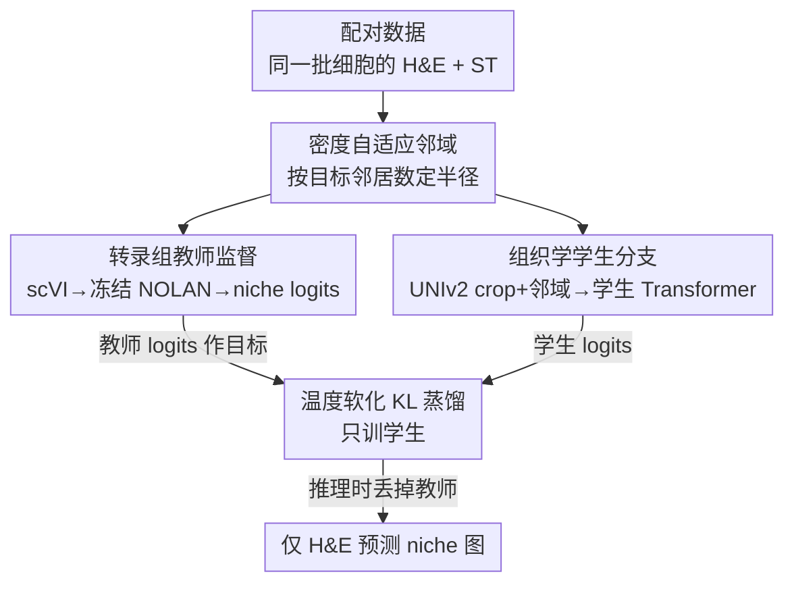

# Cross-Modal Knowledge Distillation from Spatial Transcriptomics to Histology

**会议**: CVPR 2026  
**arXiv**: [2604.09076](https://arxiv.org/abs/2604.09076)  
**代码**: https://cross-modal-distillation.github.io/ (项目主页)  
**领域**: 跨模态蒸馏 / 计算病理 / 医学图像  
**关键词**: 跨模态知识蒸馏, 空间转录组, H&E 组织学, 组织微环境 niche, 自监督

## 一句话总结
用一个冻结的空间转录组教师（NOLAN）在配对数据上监督一个 H&E 组织学学生，把分子层面定义的「组织 niche（微环境分区）」结构蒸馏进只看图像的学生网络，从而在推理时仅凭 H&E 切片就能预测出与转录组高度一致的 niche 分区。

## 研究背景与动机
**领域现状**：组织里很多关键现象（免疫浸润、间质重塑、肿瘤进展）不是单个细胞的属性，而来自多种细胞在空间上的组织方式。把组织切成「空间上连贯、局部细胞组成各异」的区域——即 niche 分割——是病理分析的核心目标。近年空间转录组（spatial transcriptomics, ST）能同时测出每个细胞的基因表达和空间坐标，催生了 BANKSY、SpaGCN、MENDER、NOLAN 等方法，可在分子特征空间里无监督地发现生物学上有意义的 niche。

**现有痛点**：ST 测序昂贵、稀缺，往往只对部分样本或部分组织区域可用，无法规模化。反过来，H&E 组织学切片极其廉价、海量（档案动辄百万张），但它只反映形态学（细胞长什么样），不直接测基因表达。于是单靠 H&E 形态特征——哪怕用 UNIv2 这类病理基础模型提特征——也未必能还原分子定义的组织结构，尤其在细胞形态差异微弱、niche 身份由微环境上下文而非形态决定的区域。

**核心矛盾**：海量但「分子信号弱」的 H&E，和稀缺但「分子信号丰富」的 ST 之间存在信息鸿沟。直接在 H&E 特征上跑无监督聚类（Leiden）或照搬 ST 上的无监督框架（NOLAN），都拿不到 ST 那种粒度的 niche。

**本文目标**：训练一个只需 H&E 输入的模型，让它在推理时不依赖任何转录组测量，就能预测出与 ST 教师高度一致、且生物学上有意义的 niche 分区。

**切入角度**：当同一批细胞有配对的 ST 和 H&E 时，ST 提供了比组织学更丰富的「细胞状态 + 邻域组成」视角。作者把这看成一个跨模态蒸馏问题——用 ST 端定义参考 niche 结构当老师，逼组织学端的学生从形态 + 空间上下文里学出能反映转录组 niche 的信号。相比逐基因表达预测，niche 结构是一个更可行的目标：它把分子噪声抽象成对组织组织方式的紧凑概括。

**核心 idea**：用「冻结的转录组教师产生 niche 软分配 logits、组织学学生用蒸馏损失去对齐」来把分子级 niche 结构搬进只看图像的模型，推理时丢掉转录组分支。

## 方法详解

### 整体框架
训练阶段是一个双分支的「教师—学生」结构，两个分支都以**细胞的空间邻域**为基本单位，共享同一套邻域构造规则。教师分支（ST 侧）：对每个细胞，先用冻结的 scVI 编码基因表达得到分子隐向量，构造空间邻域后送入冻结的预训练 NOLAN 教师，输出一个 $K$ 维的 niche 分配 logits 当作监督信号。学生分支（H&E 侧）：对每个细胞，从 H&E 切片裁出以细胞为中心的 crop，用冻结的 UNIv2 取 `[CLS]` token 作为细胞嵌入，构造同样的空间邻域、加上 NOLAN 用的相对位置编码，送进一个可训练的学生 Transformer，同样输出 $K$ 维 logits。训练时只优化学生 Transformer，上游所有编码器（scVI / NOLAN / UNIv2）全部冻结，用蒸馏损失把学生 logits 对齐到教师 logits。推理阶段只保留学生分支：仅凭 H&E 算 UNIv2 特征、构邻域、预测 logits，取最大 logit 的 niche 作为离散标签，再拼成组织级 niche 图。

### 关键设计

**1. 密度自适应的空间邻域：让「局部上下文」在不同组织间可比**

niche 是由局部空间上下文定义的，所以方法的基本单位不是单个细胞而是细胞邻域。痛点在于：不同数据集、不同测序平台的组织密度差异巨大，若用固定物理半径 $r$，稠密组织里一个半径包进几十个细胞、稀疏组织里只包几个，导致每个细胞拿到的上下文信息量极不一致。作者的做法是为每个数据集单独选 $r$——通过在切片上随机采样估计，使邻域内的期望邻居数大致等于一个固定目标值。于是稀疏组织里半径更大、稠密组织里更小，保证跨数据集的邻域携带可比的空间上下文量。教师和学生用同一套邻域规则，且训练阶段估出的 $r$ 在测试时原样复用，邻域只在各自的训练/测试细胞集合内构造

**2. 跨模态蒸馏：用 ST 的 niche 软分配当监督信号，而不是硬标签**

这是本文核心，针对「H&E 自身缺乏可靠 niche 标注、形态聚类又对不上分子结构」的痛点。作者不去预测逐基因表达，而是把 niche 软分配分布作为蒸馏目标。教师和学生都输出 $K$ 维 logits（学生记为 $a_i^{HIST}$），各自经温度缩放的 softmax 得到软化分布 $p_i^{ST}=\mathrm{softmax}(a_i^{ST}/\tau)$、$p_i^{HIST}=\mathrm{softmax}(a_i^{HIST}/\tau)$，再最小化标准蒸馏损失：

$$\mathcal{L}_{distill}=\tau^2\frac{1}{N}\sum_{i=1}^{N}\mathrm{KL}\!\left(p_i^{ST}\,\Vert\,p_i^{HIST}\right)$$

其中 $\mathrm{KL}(\cdot\Vert\cdot)$ 是 KL 散度，$\tau$ 是蒸馏温度。匹配软化的 logits 而非 argmax 硬标签，让学生学到的是教师编码的**相对 niche 相似性与结构**（一个细胞同时「有点像 niche A、更像 niche B」的关系），而不是被一个可能模糊、不可靠的离散标签带偏——这正契合「组织边界往往渐变、精确 niche 标签难定义」的生物学事实

**3. 把 ST 当「高信息参考」而非「任意划分」：冻结上游、只训学生**

为什么是蒸馏而非直接在 H&E 上做无监督？因为真值 niche 标签通常缺失或不可靠，作者用 ST 衍生的 niche 结构作为「信息量更高的参考」——它已被前作证明能识别出生物学上有意义、优于 BANKSY/CellCharter/MENDER 的 niche 边界。训练时 scVI、NOLAN、UNIv2 全部冻结，唯一可训练的是学生 Transformer，目标不是复刻某个「任意的教师划分」，而是把有生物学依据的分子信息迁移进纯组织学模型并量化跨模态一致性。这种「冻结基础模型 + 只训一个轻量对齐头」的设计，既复用了两端基础模型的表征能力，又把可学习参数压到最小

## 实验关键数据

数据集：16 个公开 Xenium 数据集，覆盖 12 种组织（人结肠/结直肠/肝/淋巴结/乳腺/卵巢/脑/宫颈/肾/胰腺/肺癌、小鼠结肠、全鼠），共 8,070,255 个细胞。每张切片用「片内空间留出」划分：把组织切成 4 条水平条带，取从上往下第二条当测试（避开边缘效应），其余三条训练，train/test 边界放半个 crop 宽（112 像素）的排除缓冲带防泄漏。约 70% 细胞训练、30% 测试、2% 被缓冲带丢弃。评测 $K\in\{10,20\}$ 两种 niche 数。

### 主实验：与转录组教师 niche 分配的一致性（ARI / NMI，均值±标准差，越高越好）

| 方法 | ARI (K=10) | NMI (K=10) | ARI (K=20) | NMI (K=20) |
|------|-----------|-----------|-----------|-----------|
| Histology NOLAN | 0.283 ± 0.12 | 0.383 ± 0.10 | 0.234 ± 0.08 | 0.403 ± 0.09 |
| Histology Leiden | 0.191 ± 0.12 | 0.288 ± 0.13 | 0.176 ± 0.08 | 0.327 ± 0.11 |
| **Ours（蒸馏学生）** | **0.615 ± 0.11** | **0.603 ± 0.10** | **0.500 ± 0.10** | **0.579 ± 0.08** |

蒸馏学生在两个 $K$、两个指标上全面、大幅超越两个用相同 H&E 特征的无监督基线——K=10 时 ARI 从 0.283 提到 0.615（翻倍多），说明跨模态监督比在组织学特征空间里直接聚类更忠实地搬运了教师的 niche 组织。

### 生物身份一致性：每个 niche 的细胞类型组成 JSD（越低越好）

| 数据集 | Ours | Histology NOLAN | Histology Leiden |
|--------|------|-----------------|------------------|
| 人卵巢 (K=10) | **0.0052** | 0.0557 | 0.0750 |
| 人胰腺 (K=10) | **0.0042** | 0.0626 | 0.1572 |
| 人乳腺 (K=10) | **0.0024** | 0.0323 | 0.0781 |
| 人卵巢 (K=20) | **0.0101** | 0.0958 | 0.0851 |
| 人胰腺 (K=20) | **0.0069** | 0.0622 | 0.1237 |
| 人乳腺 (K=20) | **0.0090** | 0.0244 | 0.0545 |

ARI/NMI 只衡量标签重叠、看不出两组 niche 是否生物身份相同；作者用每个 niche 的细胞类型组成分布算与教师的 Jensen–Shannon 散度（用公开 10x 注释、仅评测用、niche 间用最小化 JSD 的一一匹配对齐）。学生在全部三个标注数据集、两个 $K$ 上都拿到最低 JSD（如人乳腺 K=10 仅 0.0024，比 NOLAN 低一个量级），说明学生不只是标签对得上，连 niche 的细胞类型混合都贴近教师。对齐的非平凡性用 10,000 次随机配对验证：少于 0.02% 的随机配对能匹配上对齐 JSD。

### 病理标注探针（人卵巢癌，限 Tumor 1/2/3，用 SVM 从 niche 预测病理标签，Macro-F1）

| 方法 | K=10 | K=20 |
|------|------|------|
| Histology NOLAN | 0.297 | 0.361 |
| **Ours** | **0.543** | **0.401** |
| Teacher（NOLAN ST） | 0.489 | 0.388 |

### 关键发现
- 学生在病理探针上**反超了教师**（K=10：0.543 > 教师 0.489 > 基线 0.297），说明蒸馏出的组织学模型不仅与教师一致，还可能捕捉到与人工病理划分更对齐的结构——形态信息对某些临床区分有独立价值。
- 定性上，学生能还原 B 细胞滤泡、上皮分带、间质区室、浸润性癌巢等结构，粒度是两个无监督基线达不到的；Histology-NOLAN 只能粗略还原区室且空间噪声大，Histology-Leiden 把组织切成大块均匀色斑、丢掉细粒度异质性。
- 提升在 $K\in\{10,20\}$ 上都稳定，说明优势不是某个特定 niche 数下的偶然。

## 亮点与洞察
- **把「跨模态」用在了一个比基因预测更聪明的目标上**：不去硬啃逐基因回归（噪声大、难），而是蒸馏 niche 结构这个「把分子噪声抽象成组织组织方式」的紧凑中间量，既保住生物意义又显著更可学——这个「选对监督目标」的思路可迁移到任何「贵模态监督廉价模态」的场景。
- **软 logits 蒸馏正好对冲了 niche 标签的内禀模糊性**：组织边界本就渐变、硬标签不可靠，匹配温度软化分布让学生学到 niche 间的相对相似关系，是「方法设计契合数据本质」的范例。
- **密度自适应邻域是个简单却关键的工程点**：用「固定期望邻居数」而非「固定半径」抹平跨平台密度差异，让同一套模型能跨 12 种组织通用，这个 trick 在任何基于空间邻域的细胞建模里都值得复用。
- **学生反超教师**最让人「啊哈」：蒸馏通常以教师为上界，这里组织学形态在病理探针上反而带来教师没有的判别信号，提示形态与分子是互补而非单向包含。

## 局限与展望
- **强依赖配对数据训练**：方法只在有配对 ST+H&E 的细胞上才能训，虽然推理只需 H&E，但训练对配对数据的依赖限制了能覆盖的组织/疾病范围；公开 Xenium 很多只有单张配对切片，逼得只能做片内空间留出而非跨切片泛化评测。
- **评测以教师为「金标准」存在循环风险**：ARI/NMI/JSD 都在度量「与 NOLAN 教师的一致性」，若教师本身在某些组织有偏，学生会一并继承；病理探针是唯一外部锚点，但只在一个卵巢癌数据集上做。
- **niche 数 $K$ 需人工指定**，且不同 $K$ 下学生相对教师的差距（如 K=20 时 ARI 0.500 明显低于 K=10 的 0.615）说明更细粒度 niche 更难蒸馏，自适应确定 niche 数是开放问题。
- **改进思路**：引入半监督/无配对的跨模态对齐以减少对配对数据依赖；用多个 ST 教师集成降低单教师偏置；探索把病理探针上「学生>教师」的现象反哺回训练（如形态—分子互蒸馏）。

## 相关工作与启发
- **vs NOLAN（转录组教师本身）**：NOLAN 在基因表达空间做自监督 niche 发现，需要转录组输入；本文把它当冻结教师，训练一个推理时只需 H&E 的学生，等于把 NOLAN 的能力「下放」到廉价模态。区别在于本文解决的是部署侧的模态可得性，优势是规模化、劣势是受限于教师质量。
- **vs Histology-NOLAN（直接在 H&E 特征上跑 NOLAN）**：证明照搬 ST 上的无监督框架到组织学特征，拿不到同等粒度 niche（ARI 0.283 vs 本文 0.615），说明问题不在框架而在监督信号——必须有分子侧引导。
- **vs Histology-Leiden（H&E 特征直接聚类）**：朴素聚类只能切出大块均匀区域（ARI 0.191），无法捕捉细粒度异质性，凸显跨模态监督的必要性。
- **vs CLIP 式跨模态对齐**：CLIP 类工作追求全局对齐的统一嵌入空间，病理领域多数跨模态工作要么做逐基因表达预测、要么做全局多模态对齐；本文聚焦「邻域级 niche 结构」这一编码组织组织方式的中间粒度目标，更可行也更贴合空间上下文建模。

## 评分
- 新颖性: ⭐⭐⭐⭐ 把跨模态蒸馏从「基因预测/全局对齐」转向「niche 结构」这一中间目标，切入点新颖且选目标的洞察到位
- 实验充分度: ⭐⭐⭐⭐ 16 数据集 12 组织、三类评测（标签一致性/细胞组成/病理探针）+ 随机配对显著性检验，较充分；但跨切片泛化与多教师未覆盖
- 写作质量: ⭐⭐⭐⭐ 动机—方法—评测逻辑清晰，公式与冻结/可训分工交代明确
- 价值: ⭐⭐⭐⭐ 让海量 H&E 也能产出分子级 niche 图，在病理与空间生物学有实际落地潜力

<!-- RELATED:START -->

## 相关论文

- [\[ICML 2025\] A Cross Modal Knowledge Distillation & Data Augmentation Recipe for Improving Transcriptomics Representations through Morphological Features](../../ICML2025/model_compression/a_cross_modal_knowledge_distillation_data_augmentation_recipe_for_improving_tran.md)
- [\[AAAI 2026\] Distilling Cross-Modal Knowledge via Feature Disentanglement](../../AAAI2026/model_compression/distilling_cross-modal_knowledge_via_feature_disentanglement.md)
- [\[AAAI 2026\] Asymmetric Cross-Modal Knowledge Distillation: Bridging Modalities with Weak Semantic Consistency](../../AAAI2026/model_compression/asymmetric_cross-modal_knowledge_distillation_bridging_modalities_with_weak_sema.md)
- [\[CVPR 2026\] Streamlined Knowledge Distillation](streamlined_knowledge_distillation.md)
- [\[CVPR 2026\] SelecTKD: Selective Token-Weighted Knowledge Distillation for LLMs](selectkd_selective_token-weighted_knowledge_distillation_for_llms.md)

<!-- RELATED:END -->
