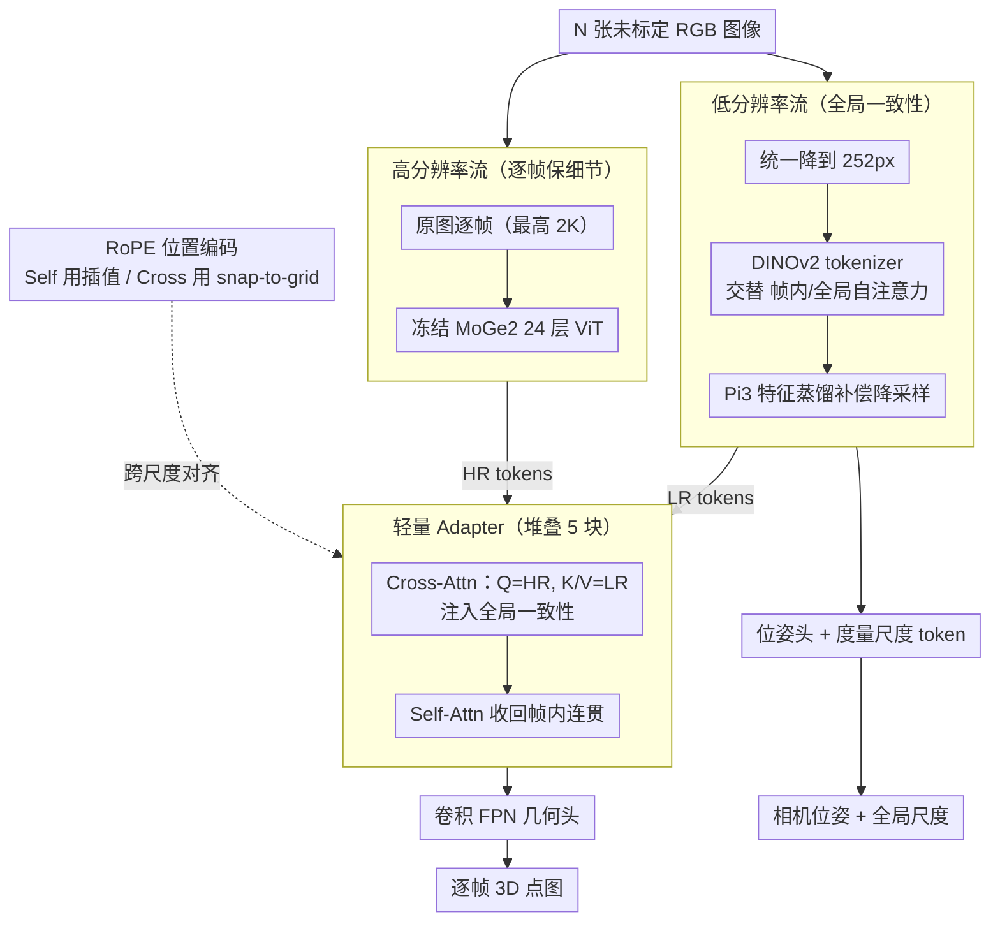

# DAGE: Dual-Stream Architecture for Efficient and Fine-Grained Geometry Estimation

**会议**: CVPR 2026  
**arXiv**: [2603.03744](https://arxiv.org/abs/2603.03744)  
**代码**: [https://github.com/dage-site](https://github.com/dage-site)  
**领域**: 模型压缩  
**关键词**: 多视图几何估计, 双流 Transformer, 深度估计, 知识蒸馏, 高分辨率推理

## 一句话总结

提出 DAGE 双流 Transformer 架构，将全局一致性建模（低分辨率流）与细粒度细节保持（高分辨率流）解耦，通过轻量 Cross-Attention Adapter 融合，实现 2K 分辨率和 1000 帧长序列上的高质量深度/点图估计和位姿预测，速度比 Pi3 快 2-28 倍，视频几何估计取得新 SOTA。

## 研究背景与动机

从多视图图像估计 3D 几何和相机位姿是计算机视觉基础问题。当前面临三个同时满足的挑战：(1) 全局跨视图一致性，(2) 高分辨率细粒度细节保持，(3) 长序列可扩展的计算效率。

- **前馈式多视图方法**（VGGT, Pi3）用全局 attention 实现跨视图一致性，但 $O(N^2)$ 复杂度限制分辨率和帧数，细节模糊
- **单视图方法**（DepthPro, MoGe2）可处理高分辨率但缺乏多视图一致性
- **视频扩散模型**（GeoCrafter）计算昂贵且通常无法估计位姿

核心矛盾：**全局 attention 对分辨率的二次复杂度 vs 高分辨率细节保持的需求**。DAGE 的切入：**将分辨率和序列长度解耦**。

## 方法详解

### 整体框架

给定 $N$ 张未标定 RGB 图像，DAGE 要同时吐出每帧的 3D 点图、相机位姿和一个全局度量尺度。它的核心想法是：跨视图一致性（决定位姿和全局结构）和细粒度细节（决定深度边缘是否锐利）这两件事，其实对分辨率的需求完全不同——前者在低分辨率下就够了，后者才需要原图。于是 DAGE 把这两个需求拆到两条并行的流里：一条**低分辨率流（LR Stream）**在 252px 上看遍所有帧、做全局 attention 拿到一致的位姿与粗结构；一条**高分辨率流（HR Stream）**在原始分辨率（最高 2K）上逐帧独立编码、保住细节；中间用一个**轻量 Adapter** 把 LR 的全局信息注入 HR，让每一帧的高分辨率细节又能对齐到统一的全局几何。这样全局 attention 的 $O(N^2)$ 成本被锁在低分辨率，而高分辨率部分的成本只随帧数线性增长。

### 关键设计

**1. 低分辨率流：用低分辨率换回全局 attention 的可行性**

前馈式多视图方法（VGGT、Pi3）靠全局 attention 拿到跨视图一致性，但全局 attention 对 token 数是二次复杂度，分辨率一高就爆。DAGE 的观察是：位姿和全局结构本就不依赖高频细节，没必要在原图上算全局 attention。所以 LR 流把所有帧统一降到 252px，再走 DINOv2 tokenizer 加交替的 Frame/Global Attention（帧内与跨帧轮流），全局一致性照拿，但 attention 的开销被压到可控范围。降分辨率必然丢信息，DAGE 用 Pi3 当教师做特征蒸馏来补偿——让 LR 流的特征去逼近 Pi3 在更高分辨率下学到的表征，等于把"高分辨率才有的信息"以蒸馏的形式塞进低分辨率流里。

**2. 高分辨率流：冻结预训练编码器，逐帧独立保细节**

细节保持需要原图，但在原图上做跨视图 attention 又会把成本拉回二次复杂度。HR 流的做法是干脆放弃跨视图交互：每帧在原始分辨率（可达 2K）上**独立**编码，计算量只随分辨率线性增长。关键在于它直接冻结 MoGe2 已经训好的 24 层 ViT 编码器，一个参数都不动。冻结的好处有两层：一是几何估计的训练数据集通常偏小，从头训或微调一个大编码器很容易过拟合；二是 MoGe2 本身有很强的零样本泛化能力，冻住它就把这份泛化原封不动继承下来，HR 流只负责"看清楚"，不负责"看一致"。

**3. 轻量 Adapter：用 Cross-Attention 跨越分辨率的 token 数鸿沟**

两条流各管一摊，但 HR 流逐帧独立、没有全局视野，必须把 LR 流的全局一致信息灌进去——难点是两条流的 token 数量天差地别（同一帧 252px 和 2K 的 token 数差几十倍），不能简单逐位置相加或拼接。Adapter 用 Cross-Attention 解决：让 HR 的 token 作 Query、LR 的 token 作 Key/Value，HR 的每个高分辨率位置主动去 LR 的全局特征里"查"自己该对齐到哪里，天然支持任意的 token 数量比。Cross-Attention 之后再接 Self-Attention 把帧内被打散的空间连贯性收回来，这样一个块堆叠 5 个，逐步把全局一致性融进高分辨率细节。消融里把 Cross-Attention 换成直接拼接，质量明显下降，正是因为拼接默认了一个固定的尺度对应关系，而真实的 token 比并不固定。

**4. RoPE 位置编码：让 attention 在训练分辨率之外不崩**

标准 RoPE 在超出训练分辨率时会严重退化，而 DAGE 偏偏要在远高于训练时的 2K 上推理，且 Cross-Attention 还要跨两个不同分辨率做匹配，位置编码必须特殊处理。对 HR 流内部的 Self-Attention，DAGE 用**插值 RoPE**：把位置频率谱按分辨率缩放插值，让高分辨率下的相对位置关系仍然落在训练时见过的频率范围内。对 Cross-Attention，它用 **snap-to-grid**：把每个 HR token 按空间位置吸附到最近的 LR 网格单元，再用该 LR 单元的位置去算相对编码——这样 HR 和 LR 即便分辨率不同，也能在同一套位置坐标系下对齐，跨尺度的 attention 才不会因为位置错位而失效。

### 损失函数 / 训练策略

- 点图 $\ell_1$ 损失（全局对齐，不用 confidence 加权）
- 相机位姿损失（旋转测地距离 + 平移 $\ell_1$）
- 梯度损失（多尺度 Scharr/Laplace 滤波对逆深度梯度监督，替代 multi-scale 对齐）
- 法线损失和蒸馏损失
- HR ViT 冻结，LR 流从 Pi3 初始化，18 个数据集训练

## 实验关键数据

### 主实验：视频点图估计（8 数据集平均排名）

| 方法 | 多视图 | 高分辨率 | 位姿 | 平均排名 |
|------|--------|----------|------|----------|
| VGGT | Yes | No | Yes | 3.4 |
| Pi3 | Yes | No | Yes | 3.3 |
| GeoCrafter | Yes | Partial | No | 3.9 |
| **DAGE** | **Yes** | **Yes** | **Yes** | **1.6** |

### 消融实验

| 配置 | 关键变化 | 说明 |
|------|----------|------|
| Adapter在中间层注入 | 一致性下降 | 需要完整全局处理 |
| 拼接替代CrossAttn | 质量下降 | 固定尺度比不足 |
| 无梯度损失 | 锐利度下降 | 梯度监督对细节至关重要 |
| MoGe multi-scale对齐 | 一致性下降 | 逐patch独立对齐破坏跨视图一致性 |

### 运行效率（A100, 100帧视频）

| 方法 | 540p FPS | 2K FPS | 540p显存 |
|------|----------|--------|----------|
| Pi3 | 32.7 | OOM | 37.3 GB |
| VGGT | 13.5 | OOM | 71.3 GB |
| **DAGE** | **65.4** | **5.6** | **12.4 GB** |

### 关键发现

- 平均排名 1.6 显著领先 Pi3（3.3）和 VGGT（3.4）
- 高分辨率场景优势明显：UrbanSyn Rel 误差比 Pi3 低 47%
- 540p 速度是 Pi3 的 2 倍，2K 下 Pi3/VGGT OOM 而 DAGE 仍可 5.6 FPS
- 252px 估计位姿精度 match Pi3/VGGT 在 518px 下的表现

## 亮点与洞察

- **"解耦分辨率与序列长度"是核心洞察**：全局一致性不需要高分辨率，细节保持不需要跨视图 attention
- **冻结 HR ViT + 轻量 adapter**：高效迁移范式
- **snap-to-grid RoPE**：跨尺度 attention 的优雅解决方案
- **梯度损失替代 multi-scale 对齐**：多视图下保持全局单一对齐更重要

## 局限与展望

- LR 流固定 252px，某些场景可能不足
- 依赖 MoGe2 和 Pi3 预训练权重
- 未测试动态场景（运动物体）
- 5 层 Adapter 在极长序列下仍有显存压力

## 相关工作与启发

- Pi3/VGGT 的交替 attention 是 LR 流基础，DAGE 贡献在于限制到低分辨率
- MoGe2 的 coarse-to-fine 损失被放弃（破坏多视图一致性），体现设计原则冲突
- 知识蒸馏从"模型压缩"变为"分辨率补偿"

## 评分

- 新颖性: ⭐⭐⭐⭐ 双流解耦设计和 snap-to-grid RoPE 是有洞察力的新贡献
- 实验充分度: ⭐⭐⭐⭐⭐ 8 数据集 + 4 任务 + 详细消融 + 速度对比
- 写作质量: ⭐⭐⭐⭐ 动机论证清晰，架构描述系统
- 价值: ⭐⭐⭐⭐⭐ 解决高分辨率多视图几何估计实际瓶颈，SOTA + 实用效率

<!-- RELATED:START -->

## 相关论文

- [\[CVPR 2026\] DiT-Distill: Open-Set Fine-Grained Retrieval via Generative Curriculum Knowledge](dit-distill_open-set_fine-grained_retrieval_via_generative_curriculum_knowledge.md)
- [\[CVPR 2026\] Dual-branch Distilled Transformer for Efficient Asymmetric UAV Tracking](dual-branch_distilled_transformer_for_efficient_asymmetric_uav_tracking.md)
- [\[CVPR 2026\] How to Choose Your Teacher for Fine Grained Image Recognition](how_to_choose_your_teacher_for_fine_grained_image_recognition.md)
- [\[ACL 2026\] Efficient Learned Data Compression via Dual-Stream Feature Decoupling](../../ACL2026/model_compression/efficient_learned_data_compression_via_dual-stream_feature_decoupling.md)
- [\[CVPR 2026\] Memory-Efficient Transfer Learning with Fading Side Networks via Masked Dual Path Distillation](memory_efficient_transfer_learning_with_fading_side_networks.md)

<!-- RELATED:END -->
