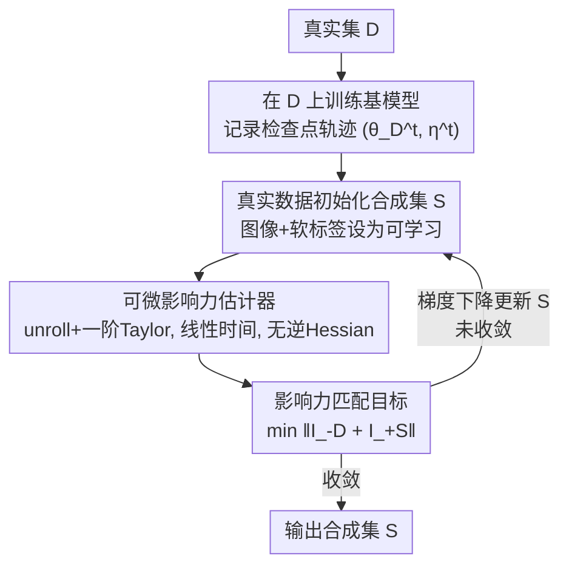

# Dataset Distillation by Influence Matching

**会议**: CVPR 2026  
**论文**: [CVF Open Access](https://openaccess.thecvf.com/content/CVPR2026/html/Tan_Dataset_Distillation_by_Influence_Matching_CVPR_2026_paper.html)  
**代码**: https://github.com/hrtan/infmatch (待发布)  
**领域**: 模型压缩 / 数据集蒸馏  
**关键词**: 数据集蒸馏, 影响力函数, 结果对齐, 可微影响力估计, 软标签

## 一句话总结
不再让合成数据去模仿真实数据的训练过程（梯度/轨迹），而是直接对齐"训练结果"——本文用一个线性时间、无需逆 Hessian 的可微影响力估计器，把数据集蒸馏重写成"合成集对参数的影响力 ≈ 真实集对参数的影响力"，在 CIFAR/Tiny-ImageNet/Flickr30K 上全面超过过程匹配 SOTA（Tiny-ImageNet IPC=10 上 31.5%，比 NCFM 高 4.7%）。

## 研究背景与动机

**领域现状**：数据集蒸馏的目标是合成一个极小的数据集 $S$，使得在 $S$ 上训练得到的模型逼近在完整数据集 $D$ 上训练的效果。它本质是一个双层优化问题（外层优化数据、内层训练网络），直接求解极其困难。因此主流方法都退而求其次去匹配某种"代理量"：**特征匹配**（DM/CAFE，对齐合成与真实数据的特征分布）和**过程匹配**（GM 对齐每步梯度、MTT/DATM 对齐训练轨迹），其中过程匹配性能更强、关注度更高。

**现有痛点**：这些代理目标匹配的都是**训练过程中的中间信号**（梯度、参数轨迹），而不是训练的**最终结果**。问题在于——合成数据完全可以把代理目标刷得很高（梯度对得很齐、轨迹贴得很近），却仍然在下游精度和泛化上落后。代理对齐 ≠ 结果对齐。

**核心矛盾**：蒸馏的终极目标不是"复现训练的每一步"，而是"复现完整数据集施加在最终模型上的那份影响"。在"计算可行性（靠过程对齐换来）"和"对真实目标的保真度（对齐最终结果）"之间存在一道**优化鸿沟（optimization gap）**。要跨过它，就需要一种能量化"单个样本/子集如何影响最终模型"的手段。

**为什么不直接用影响力函数**：影响力估计（influence function）本可以衡量样本对最终模型的作用，但经典估计器（Koh et al.）有两个致命问题：(i) 假设损失对参数是**凸的**，而深网根本不满足；(ii) 需要计算**逆 Hessian 与梯度的乘积**，计算开销巨大，无法 scale。

**核心 idea**：用一个**全可微、线性时间、不需逆 Hessian、不假设凸性**的样本影响力估计器，把蒸馏目标改写为"添加合成集 $S$ 的影响力 ≈ 抵消移除真实集 $D$ 的影响力"——直接做**结果对齐（outcome matching）**，而不是启发式的过程模仿。

## 方法详解

### 整体框架

Inf-Match（Influence Matching）把蒸馏从"过程对齐"挪到"结果对齐"：先在真实集 $D$ 上把一个基模型训练 $T$ 步，沿途记录参数与学习率的检查点轨迹 $\{(\theta_D^t,\eta^t)\}$；然后用真实图像按 IPC（每类图片数）初始化合成集 $S$，并把图像和标签都设为可学习变量。训练时，对每个 minibatch 用可微影响力估计器算出"加入 $S$ 的影响力"和"移除 $D$ 的影响力"，最小化两者的残差（即让 $S$ 的影响力抵消 $D$ 的影响力），用梯度下降同时更新合成图像和软标签。**关键之处**：合成数据训练出的模型参数不是真去重训得到的，而是由影响力估计器"估"出来的，因此整个外层优化无需嵌套内层重训。

### 关键设计

**1. 数据影响力的结果中心定义：把"训练结果差异"写成参数位移**

痛点是过程匹配只对齐中间信号、保证不了最终结果。作者直接给"影响力"下了一个结果中心的定义：移除一个样本/子集 $Z\subset D$ 的**移除影响力**定义为训练最终参数的差，$I_{-Z}=\theta^*_{D-Z}-\theta^*_{D}$；加入一个外部集 $Z$ 的**加入影响力**为 $I_{+Z}=\theta^*_{D+Z}-\theta^*_{D}$。它度量的就是"$Z$ 的存在/缺席"在最终模型状态上造成的确切偏移。这个定义把"蒸馏要对齐什么"从模糊的"训练动态"锚定到了一个明确的向量——最终参数的位移，为后面把蒸馏写成参数残差最小化打好基础。

**2. 可微影响力估计器：unroll 优化动态 + 一阶 Taylor，线性时间且无逆 Hessian**

按定义算影响力要做留一重训（LOO retraining），不可行；经典影响力函数又依赖凸性和逆 Hessian。作者的做法是沿着 $D$ 上 SGD 的真实训练轨迹**展开（unroll）**优化动态，对每步更新做一阶 Taylor 近似，得到（Theorem 1）：

$$I_{-Z}\approx-\sum_t \frac{\eta^t}{\sum_{k\ge t}\eta^k\,|D|}\Big(H_D^t G_Z^t + H_Z^t G_D^t\Big),\qquad I_{+Z}\approx+\sum_t \frac{\eta^t}{\sum_{k\ge t}\eta^k\,|D|}\Big(H_D^t G_Z^t + H_Z^t G_D^t\Big)$$

其中 $H^t=\nabla^2_\theta L$ 是 Hessian、$G^t=\nabla_\theta L$ 是梯度，都在轨迹检查点 $\theta_D^t$ 处取值。式子里虽然出现 Hessian-梯度乘积 $HG$，但**不需要显式构造 Hessian**——用经典有限差分近似 $HG\approx\lim_{\epsilon\to0}\big(\nabla_\theta L(\theta+\epsilon G)-\nabla_\theta L(\theta)\big)/\epsilon$，复杂度只有 $O(p)$（$p$ 为参数量），现成框架就能算。作者还给出误差上界（Theorem 2）$|\tilde I-I|\le 2T^3\ell(T+1)\eta_{\max}g+\frac{|Z|}{|D|}T^2g$，关键是它随训练步数 $T$ **多项式增长**，优于早期估计器的指数增长，这让"长训练轨迹下仍可靠"有了保证。⚠️ 公式中分母与系数细节以原文 Eq.(2)(3)(5) 为准。

**3. 影响力匹配目标：让"加 S"的影响力抵消"减 D"的影响力**

有了可微估计器，蒸馏就被改写成一个直接的结果对齐目标：

$$S^*=\arg\min_S \big\| I_{-D}+I_{+S} \big\|$$

直觉是——移除整个真实集 $D$ 会把参数推走，而加入合成集 $S$ 应当恰好把它推回来，两者的影响力相互抵消时残差最小。由影响力的可加性（Remark 1），$\|I_{-D}+I_{+S}\|$ 等价于 $\big\|(\theta^*_D+I_{-D}+I_{+S})-\theta^*_D\big\|$，也就是"先移除 $D$ 再加入 $S$ 后的参数"与"在 $D$ 上训练得到的参数 $\theta^*_D$"之间的位移。把 Eq.(2)(3) 的估计器代入后得到一个**完全可微**的目标 $J(S)$（原文 Eq.(7)），可直接对合成图像和标签求梯度。这正是和过程匹配的本质区别：它优化的是"最终模型一不一样"，而不是"训练途中一不一样"。实际计算时不在全量数据上算，而是采样 minibatch $B_D\subset D,\ B_S\subset S$ 来无偏估计，省显存又省时间。

### 损失函数 / 训练策略

训练目标即上面的 $J(S)$（结果残差范数，通常取 $L_2$）。算法（Alg. 1）每轮：采样 minibatch $B_S,B_D$ → 从轨迹采 $m$ 个检查点 → 用 Eq.(7) 算损失 → 梯度下降同时更新合成图像与软标签。三个关键训练技巧（也是消融对象）：

- **真实数据初始化**：用 $D$ 里的真实图像按 IPC 初始化 $S$，给优化一个好起点（消融里贡献最大，52.2→53.7）。
- **可学习软标签**：每张合成图初始软标签由最终模型 $\theta_D^T$ 给出，且标签也作为可学习变量；软标签允许类间信息共享，比 one-hot 表征效率更高。
- **渐进式时间步采样**：Eq.(7) 要对全部 $T$ 步求平均，太贵，故每次只采 $m$ 个检查点近似；并采用类 DATM 的调度——训练早期采早期检查点（学基础模式），后期采后期检查点（编码细粒度结构），实现"由易到难"的结构化学习。

实现细节：默认 ConvNet（Tiny-ImageNet 用 4 个 conv-block），SGD-M（momentum 0.9），batch size 50，合成图像学习率 50.0、软标签学习率 7.0，8×A100，每个实验独立重复 10 次。

## 实验关键数据

### 主实验（图像分类，Test Accuracy %）

| 数据集 | IPC | Inf-Match | NCFM | 提升 |
|--------|-----|-----------|------|------|
| CIFAR-10 | 1 | 49.9 | — | 新高 |
| CIFAR-10 | 10 | 72.5 | ~71.8 | +0.7 |
| CIFAR-10 | 50 | 78.1 | ~77.4 | +0.7 |
| CIFAR-100 | 10 | 49.3 | — | 领先 |
| CIFAR-100 | 50 | 57.4 | 54.7 | +2.7 |
| Tiny-ImageNet | 10 | 31.5 | 26.8 | +4.7 |
| Tiny-ImageNet | 50 | 33.8 | 29.6 | +4.2 |

提升幅度随数据集难度上升而放大（Tiny-ImageNet 最大），说明结果对齐在难任务上更占优。视觉-语言数据集 Flickr30K 上同样领先：200 样本时 I2T Recall@1 达 7.4%（比次优 DATM 高 1.3%），1000 样本时 T2I Recall@1 达 16.4%，200–1000 样本平均比 NCFM 高 2.5%。

### 消融实验（CIFAR-100, IPC=50）

| 配置 | Real-init | 可学习标签 | 采样调度 | 准确率 |
|------|-----------|-----------|---------|--------|
| 基线（全关） | ✗ | ✗ | ✗ | 52.2 |
| +真实初始化 | ✓ | ✗ | ✗ | 53.7 |
| +采样调度 | ✓ | ✗ | ✓ | 55.0 |
| +可学习标签 | ✓ | ✓ | ✗ | 54.6 |
| 完整模型 | ✓ | ✓ | ✓ | **57.4** |
| DATM（对比） | — | — | — | 55.0 |
| NCFM（对比） | — | — | — | 54.7 |

值得注意的是：**仅靠核心的影响力匹配目标 + 真实初始化（52.2/53.7）就已是强基线**，叠加三项技巧后到 57.4，反超 DATM(55.0) 和 NCFM(54.7)。这把"提升来自训练 trick 还是来自核心方法"区分得比较清楚——核心目标本身就有竞争力。

### 关键发现
- **影响力匹配是性能主因**：消融显示去掉三个 trick 后的纯目标（52.2）已逼近过程匹配 SOTA，trick 只是锦上添花，证明"结果对齐"这个新目标本身有效。
- **收敛慢但终点高**：可视化显示 Inf-Match 比 MTT 收敛更慢，但最终精度显著更高——直接优化原问题的代价是优化更难，但避开了代理目标的"假对齐"。
- **合成图保真度与性能不相关**：训练过程中合成图像会经历"先变真实、再叠加噪声"的转变，最终高性能的合成图反而带噪，说明蒸馏的信息不在视觉保真度里。
- **特征分布更均衡**：在 CIFAR-100 "Wolf" 类上，DM 的合成样本过度聚集在高密度区，Inf-Match 则同时覆盖高密度区和分布边缘的低密度区，表征更均衡。
- **跨架构泛化**：CIFAR-100 IPC=50 上跨 ConvNet/ResNet-18/VGG/AlexNet 全面优于 DATM（45.4%–57.4%）。

## 亮点与洞察
- **把"对齐什么"重新定义对了**：过去十年蒸馏一直在卷"怎么更好地匹配过程"，本文跳出来指出过程对齐 ≠ 结果对齐，并给出可优化的结果对齐目标——这是问题定义层面的创新，比刷点更有价值。
- **绕开逆 Hessian 的影响力估计器可复用**：用"unroll 训练轨迹 + 一阶 Taylor + 有限差分算 HG"把影响力估计降到 $O(p)$ 线性时间、还不假设凸性，这套估计器本身在数据选择、coreset、数据归因等任务上都能迁移。
- **影响力可加性的巧用**：用 $I_{-D}+I_{+S}$ 的范数等价刻画"先减 D 再加 S 后的参数与 $\theta^*_D$ 的距离"，把抽象的"结果对齐"落成一个可微范数，思路干净。

## 局限与展望
- **依赖真实训练轨迹**：估计器需要先在 $D$ 上完整训练一遍并存检查点，这部分开销没省，且轨迹质量会影响估计精度。
- **误差上界是 worst-case**：Theorem 2 的界随 $T$ 多项式增长，长训练时理论界仍会变大，作者靠经验观测（SGD 增量更新稳定）来论证实际可靠性——⚠️ 严格保证仍有 gap。
- **收敛更慢**：直接优化原问题导致优化更难、收敛更慢，大规模/高 IPC 下的训练成本值得关注。
- **一阶近似的适用边界**：一阶 Taylor 在剧烈非线性/大学习率下可能失真，论文未充分探讨估计器何时会崩。

## 相关工作与启发
- **vs 过程匹配（GM/MTT/DATM）**：它们对齐每步梯度或训练轨迹这类中间信号，存在"代理刷高但结果落后"的优化鸿沟；本文直接对齐最终参数影响力，从根上消除这道鸿沟，难数据集上优势尤其明显（Tiny-ImageNet +4.7%）。
- **vs 特征匹配（DM/CAFE/M3D）**：它们匹配特征分布，本文实验显示 DM 的合成样本会过度聚集高密度区；Inf-Match 的结果对齐让样本分布更均衡。
- **vs 经典影响力函数（Koh et al.）**：它们假设凸损失、需逆 Hessian，无法 scale 到深网；本文的估计器去掉凸性假设、线性时间、可微，使影响力第一次能直接驱动数据集蒸馏。

## 评分
- 新颖性: ⭐⭐⭐⭐⭐ 把蒸馏目标从过程对齐重定义为结果对齐，并给出可优化的可微影响力估计器，问题定义层面的创新。
- 实验充分度: ⭐⭐⭐⭐ 覆盖分类+视觉语言、跨架构、消融与可视化齐全，但与最新 SOTA 的部分差距偏小、缺大规模 ImageNet-1K 验证。
- 写作质量: ⭐⭐⭐⭐ 动机与三段论证清晰，定理给出误差界；个别公式排版与符号在 PDF 抽取下略乱。
- 价值: ⭐⭐⭐⭐⭐ 提供了一个可迁移的影响力估计器和结果对齐范式，对数据集蒸馏后续研究有方向性意义。

<!-- RELATED:START -->

## 相关论文

- [\[CVPR 2026\] Beyond Soft Label: Dataset Distillation via Orthogonal Gradient Matching](beyond_soft_label_dataset_distillation_via_orthogonal_gradient_matching.md)
- [\[CVPR 2026\] DMGD: Train-Free Dataset Distillation with Semantic-Distribution Matching in Diffusion Models](dmgd_train-free_dataset_distillation_with_semantic-distribution_matching_in_diff.md)
- [\[CVPR 2026\] Mitigating The Distribution Shift of Diffusion-based Dataset Distillation](mitigating_the_distribution_shift_of_diffusion-based_dataset_distillation.md)
- [\[CVPR 2026\] Phased DMD: Few-step Distribution Matching Distillation via Score Matching within Subintervals](phased_dmd_few-step_distribution_matching_distillation_via_score_matching_within.md)
- [\[CVPR 2026\] IMS3: Breaking Distributional Aggregation in Diffusion-Based Dataset Distillation](ims3_breaking_distributional_aggregation_in_diffusion-based_dataset_distillation.md)

<!-- RELATED:END -->
