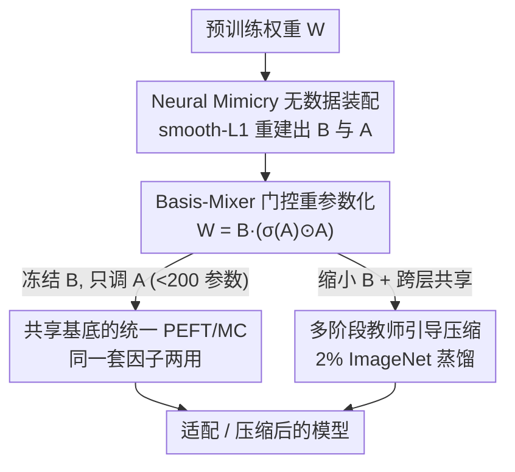

# Decompose, Mix, Adapt: A Unified Framework for Parameter-Efficient Neural Network Recombination and Compression

**会议**: CVPR 2026  
**论文**: [CVF Open Access](https://openaccess.thecvf.com/content/CVPR2026/html/Tasnim_Decompose_Mix_Adapt_A_Unified_Framework_for_Parameter-Efficient_Neural_Network_CVPR_2026_paper.html)  
**代码**: 未公开（论文未提供仓库链接）  
**领域**: 模型压缩 / 参数高效微调  
**关键词**: 参数高效微调, 模型压缩, 权重重组, 基底共享, 因子分解  

## 一句话总结
CRISP 把预训练权重因子分解为「跨层共享的冻结基底 B + 每层私有的可学习混合器 A」，缩小并共享 B 就实现模型压缩（MC）、冻结 B 只调 A 就实现参数高效微调（PEFT），从而用同一套因子结构统一了原本分开做的两件事，在 VTAB-1K PEFT 上以更少参数超 SOTA 1.5%、ViT 压缩超 SOTA 1.5%、PEFT+MC 组合超 1%。

## 研究背景与动机
**领域现状**：把大模型塞进边缘设备（机器人、手机）通常要做两件事——参数高效微调（PEFT，如 LoRA/DoRA）让模型用极少参数适配新任务，模型压缩（MC，如剪枝/低秩分解）把模型体积砍小。两者都属于「参数重组」（Parameter Recombination, PR）：给每层定义一个变换 $W_i = T(\theta_i)$，用少量可训练参数 $\theta_i$ 去生成或调整权重 $W_i \in \mathbb{R}^{d_{out}\times d_{in}}$。

**现有痛点**：PEFT 与 MC 几乎总是被孤立地研究，把它们简单串起来用会互相打架。论文给了一个扎心的例子：先用 MC 把 ViT-S/16 压掉 50% 参数，再在 VTAB-1K 上套 DoRA 做 PEFT，结果 DoRA 引入的几百万参数反而让压缩后的模型又**胀大 19%**，MC 省下来的好处被吃掉一大块。根因在于 PEFT 方法本质上是**给模型加参数**（如 LoRA 的 $T(B,A)=BA+W_p$ 必须保留原始权重 $W_p$），在压缩后的小模型里这些 adapter 占的比例会被放大。

**核心矛盾**：PEFT 想「加容量」、MC 想「减体积」，目标天然相反；而现有能同时支持两者的方法（如 RECAST）把混合系数 $a^r$ 限制成一个**向量**，表达力太弱——只有当任务参数极少（<200）时才有增益，参数预算一大就立刻饱和、不再涨点。

**本文目标**：设计一种参数化，使压缩和适配在**同一套因子结构**里共存——既不为了适配额外加 adapter，也能通过调节因子大小自由地在「省体积」和「加容量」之间滑动。

**核心 idea**：把权重写成 $W \approx B \times A$（基底×混合器），**共享并缩小 B 就是压缩、冻结 B 只调小小的 A 就是微调**；再把 RECAST 的向量混合系数升级成**矩阵**并加一个 SiLU 式门控，既扩大了表达力又自带正则、不引入新超参。

## 方法详解

### 整体框架
CRISP（Coefficient-gated weight Recombination by Interpolated Shared basis Projections）的核心是把每层权重 $W_i$ 重写成「一个跨层共享的冻结基底 $B'^r_i$」乘上「一个每层私有、可学习的混合器矩阵 $A'^{rs}_i$」。整条管线分两步走：先做一次**无数据的装配**（Neural Mimicry），把现成预训练模型重建成 CRISP 的因子形式；再根据应用需求**二选一**——要压缩就缩小并跨层共享基底（必要时用教师引导的多阶段压缩），要适配就冻住基底、只微调那个不到 200 个参数的混合器。因为压缩和微调操作的是**同一组因子**，所以两者可以叠加而不互相破坏。

### 关键设计

**1. Basis-Mixer 门控重参数化：把向量混合系数升级成带 SiLU 门控的矩阵**

这是全文技术新意所在，针对的是 RECAST「混合系数只能是向量、表达力被锁死」的痛点。CRISP 引入一个新超参 $s$ 来控制混合器矩阵的列数，令 $A'^{rs}_i \in \mathbb{R}^{r\times s}$；由于 $A$ 不再被钉死成向量，基底必须相应改成 $B'^r_i \in \mathbb{R}^{u\times r}$，其中 $u = \tfrac{d_{in}\cdot d_{out}}{s}$，保证乘出来的元素个数正好拼回 $d_{out}\times d_{in}$。最终的变换是

$$T_{\text{CRISP}}(B'^r_i, A'^{rs}_i) = B'^r_i\,\big(\sigma(A'^{rs}_i)\odot A'^{rs}_i\big)$$

其中 $\sigma$ 是 sigmoid、$\odot$ 是逐元素相乘，结果再 reshape 回权重形状。这个 $\sigma(A)\odot A$ 形式上等于 SiLU 激活，但作者强调它在这里**不是非线性层、而是对权重的一种软约束**——因为 $A$ 里全是逐层可调参数。为什么要这么设计：直接给输出权重 $W$ 加非线性（$T=\phi(W)$）等于硬性约束权重形状，会掉点；像 RECAST 前作那样强行让系数求和为 1、或用 ReLU，都会把大量权重压成 0、过度稀疏（消融里 ReLU 直接崩到 61.5）。而 SiLU 式平滑门控**只约束混合矩阵**，在不引入任何新正则超参（如 weight decay 的系数）的前提下天然抑制过拟合。单一超参 $s$ 就能调节「冻结基底 $B$」与「可调混合器 $A$」的相对大小，从而灵活贴合不同应用的需求。

**2. 共享基底的统一 PEFT/MC：同一套因子，缩 B 即压缩、调 A 即微调**

这一设计直接化解了「PEFT 加参数、MC 减参数」的核心矛盾。关键在于分工：基底 $B'^r_i$ 在**同一模块的连续层之间共享**（如 QKV 注意力或投影层组），混合器 $A'^{rs}_i$ 则**每层独立学习**。于是同一套因子结构天然支持两种操作——**压缩**靠两条杠杆：缩小基底秩 $r$、以及让更多层共享同一个 $B$（共享越多、存储越省）；**微调**则冻结 $B$、只更新混合器 $A$，而 $A$ 在某些实验里只有不到 200 个参数。与 LoRA 系方法相比，CRISP 生成权重时**不依赖原始权重 $W_p$**（对比 $T_{\text{LoRA}}=BA+W_p$ 必须留着 $W_p$），所以微调不会让模型体积反向膨胀；与 MC 方法 Basis Sharing 相比，后者的混合矩阵 $A$ 仍偏大、缩小它又会伤容量，导致冻 $B$ 调 $A$ 的微调收益易被低容量抵消，因而不适合 PEFT。CRISP 凭借更紧凑可调的 $A$，让压缩和适配在一个因子框架里真正共存、零冗余 adapter。

**3. Neural Mimicry 无数据装配：一分钟把现成模型改造成 CRISP 形式**

现成模型并不自带 $B$、$A$ 这两组矩阵，所以要先「retrofit」。CRISP 沿用 Neural Mimicry，用一个纯重建目标去拟合原始权重：

$$L_{\text{mimicry}} = \sum_{i=1}^{N} \ell_{\text{smL1}}\big(T_{\text{CRISP}}(B'^r_i, A'^{rs}_i) - W_{p_i}\big)$$

其中 $\ell_{\text{smL1}}$ 是 smooth-L1 损失。它的妙处在于**完全不需要任何数据集样本**——只是把预训练权重在数值上重新表达成因子形式，因此计算开销极低：ViT 上一分钟内、Llama 上 30 分钟内即可在单卡完成。论文也验证装配后模型在原预训练数据（ImageNet）上的精度几乎无损，说明因子分解忠实复刻了原模型。当 $s$、$r$ 较大（参数量接近原模型）时，单靠 Eq.(5) 装配就够用。

**4. 多阶段教师引导压缩：装配出的满参模型当老师，蒸馏出极限压缩的学生**

当目标是**激进压缩**（$r$、$s$ 很小）时，直接学 $A$、$B$ 会很难。作者借鉴「分阶段剪枝」的思路，但成本极低：先用 Eq.(5) 装配一个**满参数的教师** $M_{\text{teacher}}$（参数量与原模型相同），再用它启动学生 $M_{\text{student}}$——用教师 $A$、$B$ 矩阵的**前 $r$ 个特征向量**作为学生的强初始化；随后用教师指导学生训练，目标包含教师/学生最终预测之间的 **KL 散度 + MSE**，外加**逐层特征匹配的 MSE**。整个压缩阶段只用了 **2% 的 ImageNet**，远比那些要跑全量 ImageNet 做蒸馏/恢复的 MC 竞品（如 DGMR、RDHP、Isomorphic Pruning）省数据。论文发现「先造一个未压缩的分解模型当老师」比直接压缩更有效——这条多阶段流程是 ViT 上压缩超 SOTA 的关键。

### 损失函数 / 训练策略
- **装配阶段**：smooth-L1 重建损失 $L_{\text{mimicry}}$（Eq.5），无数据，ViT 跑到 1000 epoch（lr=0.01，Step 调度）。
- **压缩阶段**：教师→学生蒸馏，KL + 预测 MSE + 逐层特征 MSE，仅用 2% ImageNet。
- **微调阶段**：冻结 $B$、只更新 $A$，AdamW 跑 100 epoch + early stopping；对极端压缩比再叠加结构化二值掩码。

## 实验关键数据

### 主实验
**PEFT（VTAB-1K，ViT-S/16，19 个任务）**：CRISP 用比所有 baseline **少 28%** 的可训练参数（$5\times10^{-3}\%$ vs $7\times10^{-3}\%$）拿到最高总精度，尤其在需要几何/关系推理的 Structured 任务上领先明显。

| 方法 | Natural 均值 | Specialized 均值 | Structured 均值 | Overall |
|------|------|------|------|------|
| LoRA | 69.9 | 78.5 | 32.1 | 55.8 |
| RECAST | 68.5 | 79.0 | 32.0 | 55.3 |
| RoAD | 71.4 | 79.4 | 34.4 | 57.5 |
| SSF（前 SOTA） | 73.7 | 80.1 | 32.7 | 57.8 |
| **CRISP（本文）** | 73.0 | **80.4** | **36.4** | **59.2** |

**MC（ViT-B/16 压 50%，86M→44M）与 PEFT+MC 组合（6 个细粒度数据集均值）**：

| 设置 | 方法 | 平均精度 |
|------|------|------|
| 仅压缩 | DGMR（全量 ImageNet） | 81.9 |
| 仅压缩 | **CRISP（仅 2% ImageNet）** | **83.3** |
| 压缩+PEFT | DGMR + SSF（最佳组合） | 87.9 |
| 压缩+PEFT | RECAST + RECAST（同框架） | 83.7 |
| 压缩+PEFT | **CRISP（统一框架）** | **88.8** |

CRISP 仅压缩超 SOTA 1.5%、PEFT+MC 组合超最佳组合约 1%、超同框架的 RECAST 约 5%。在 LLaMA3.2-1B 压 30% 的 7 个常识推理基准上，CRISP 平均 **38.0** vs Basis-Sharing 33.1，领先约 **5%**，验证了跨架构泛化能力（许多 MC 方法如 Basis-Sharing 在 ViT 上甚至灾难性失败）。

### 消融实验
对混合器矩阵 $A$ 上的正则策略做消融（ViT-S/16，CUB/CIFAR-100/Aircraft 均值）：

| 正则策略 | 平均精度 | 说明 |
|------|------|------|
| 无正则 | 81.8 | 基线 |
| L2-Norm | 82.0 | 需额外超参 |
| Orthogonal | 82.3 | 需额外超参，略高 |
| Spectral Norm | 82.1 | 需额外超参 |
| ReLU | 61.5 | 崩溃：把负权重清零、过度稀疏 |
| GELU | 81.6 | 无超参 |
| **SiLU（本文 Eq.4）** | **82.2** | 无新超参，匹配/超过显式正则 |

### 关键发现
- **门控形式是命门**：ReLU 直接把精度从 81.8 砸到 61.5（零值权重太多），而平滑的 SiLU 门控在不加任何超参的情况下追平甚至超过 L2/正交/谱归一化——「平滑」比「硬约束」重要得多。
- **压缩质量决定适配上限**：PEFT+MC 组合实验里，压得更好的 backbone 当初始化、下游适配精度也更高，说明压缩与适配不该割裂，统一框架的收益正源于此。
- **数据效率显著**：仅用 2% ImageNet 就在压缩上超过用全量数据的竞品，装配阶段更是零数据。
- **跨架构鲁棒**：同一框架在 ViT 和 LLaMA 上都涨点，而 Basis-Sharing 等方法换到 ViT 就失效，泛化性是 CRISP 的突出优势。

## 亮点与洞察
- **一个 $s$ 调全局**：用单个超参 $s$ 控制「冻结基底」与「可调混合器」的相对尺寸，等于在同一旋钮上连续滑动 PEFT↔MC，工程上极简洁——这是把两类任务统一进一个公式的关键抓手。
- **SiLU 当「软约束」而非激活**：把 $\sigma(A)\odot A$ 用在混合矩阵上、而不是输出权重上，既加了表达力又免费获得正则，规避了「硬约束权重形状会掉点」的陷阱，这个视角可迁移到其他需要正则但怕引入超参的因子化方法。
- **无数据装配 + 满参教师**：先零成本重建一个满参分解模型当老师、再蒸馏出小学生，这套「先忠实复刻、再渐进压缩」的低成本多阶段流程值得借鉴到其他压缩任务。
- **统一框架不只是优雅**：它实证地比「先压缩再 PEFT」的朴素组合更强（+1%），说明压缩和适配显式协同设计有真实增益，而非只是省工程量。

## 局限与展望
- 论文未公开代码，复现门槛较高；装配阶段 ViT 上要跑到 1000 epoch，虽单轮便宜但总训练流程并不算短。
- ⚠️ Eq.(4) 中基底/混合器维度约束 $u=\tfrac{d_{in}d_{out}}{s}$ 隐含 $s$ 需整除 $d_{in}d_{out}$，论文未细讨论当不整除时如何处理，实际配置 $s$ 的自由度可能受限（以原文为准）。
- LLM 上只测到 LLaMA3.2-1B（30% 压缩），更大模型与更高压缩比下的表现、以及 LLM+PEFT 的完整结果都被放进了补充材料，正文证据偏向 ViT。
- 方法目前与剪枝、量化是「正交可叠加」关系（已验证可与 8-bit PTQ 组合），但把这些更激进的压缩手段**显式融进** CRISP 因子框架仍是未来工作。

## 相关工作与启发
- **vs RECAST**：RECAST 可看作 CRISP 的特例——把混合系数限制成**向量**。这使它只在任务参数极少（<200）时有效、参数预算一大就饱和不涨；CRISP 把系数升级成**矩阵**并加 SiLU 门控，在更宽的预算区间持续涨点，同样小预算下也不输 RECAST，整体超它 4–6%。
- **vs LoRA / DoRA**：LoRA 系 $T=BA+W_p$ 必须保留原始权重、本质是给模型**加参数**，压缩后会让小模型反而膨胀（DoRA 让压缩模型胀 19%）；CRISP 不依赖 $W_p$，压缩与微调共用因子、零冗余 adapter。
- **vs Basis Sharing**：同样用 SVD 式分解做 MC，但其混合矩阵偏大、缩小会伤容量，因而不适合 PEFT，且换到 ViT 架构上灾难性失败；CRISP 的紧凑可调混合器同时撑起 PEFT 与 MC，并跨 ViT/LLM 泛化。
- **vs WeCoLoRA**：基于 LoRA 看似能同时做 MC+PEFT，但其学到的分解对直接复用极敏感、拿去做 PEFT 会崩；CRISP 的压缩与适配是被显式设计成共存的，组合精度反超它 6.5%。

## 评分
- 新颖性: ⭐⭐⭐⭐ 把 PEFT 与 MC 统一进同一因子框架、并用 SiLU 门控矩阵替代向量系数，角度清晰且有效，但单层机制是 RECAST 的自然推广。
- 实验充分度: ⭐⭐⭐⭐ 覆盖 VTAB-1K/细粒度/LLM 常识推理三类设置，含 PEFT、MC、PEFT+MC 与量化叠加，正则消融到位；LLM 侧规模偏小、部分结果在补充材料。
- 写作质量: ⭐⭐⭐⭐ 把「为什么向量系数不够、为什么 SiLU 而非 ReLU」讲得透彻，图 1/图 2 把统一框架交代清楚。
- 价值: ⭐⭐⭐⭐ 边缘部署「又要小又要能适配」是真实刚需，统一框架既省参数又超组合 baseline，实用性强。

<!-- RELATED:START -->

## 相关论文

- [\[CVPR 2026\] Towards Unified Human Perception and Machine Understanding: Token Flow Guided Compression Framework](towards_unified_human_perception_and_machine_understanding_token_flow_guided_com.md)
- [\[CVPR 2026\] OneSparse: A Unified Framework for Sparse Activation Layers in Vision Models](onesparse_a_unified_framework_for_sparse_activation_layers_in_vision_models.md)
- [\[CVPR 2026\] Frequency Switching Mechanism for Parameter-Efficient Multi-Task Learning](frequency_switching_mechanism_for_parameter-ecient_multi-task_learning.md)
- [\[CVPR 2026\] Ultra-Fast Neural Video Compression](ultra-fast_neural_video_compression.md)
- [\[CVPR 2026\] ReFTA: Breaking the Weight Reconstruction Bottleneck in Tensorized Parameter-Efficient Fine-Tuning](refta_breaking_the_weight_reconstruction_bottleneck_in_tensorized_parameter-effi.md)

<!-- RELATED:END -->
