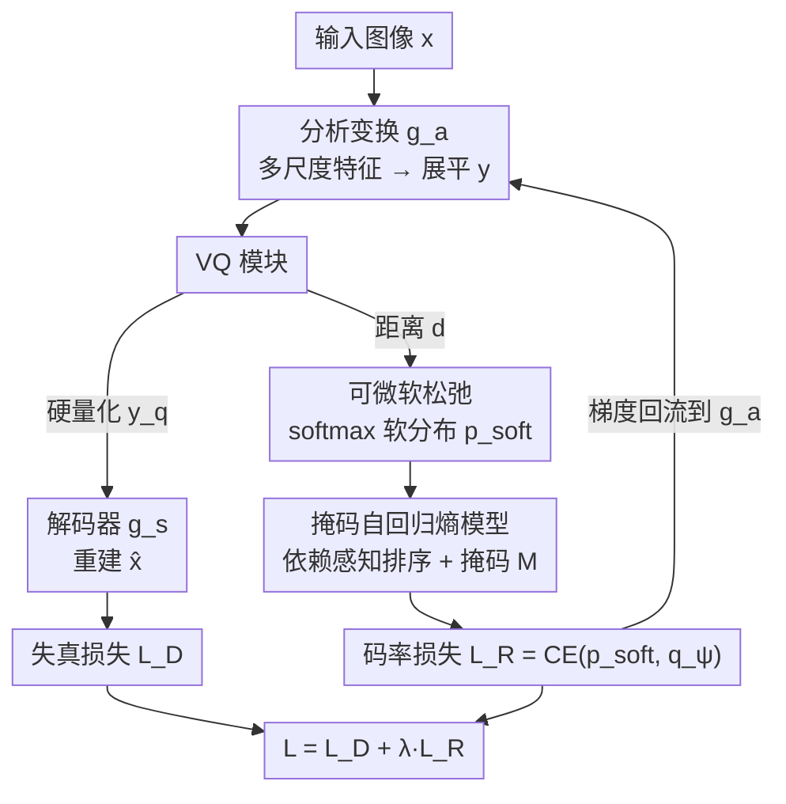

# Differentiable Vector Quantization for Rate-Distortion Optimization of Generative Image Compression

**会议**: CVPR 2026  
**论文**: [CVF Open Access](https://openaccess.thecvf.com/content/CVPR2026/html/Jiang_Differentiable_Vector_Quantization_for_Rate-Distortion_Optimization_of_Generative_Image_Compression_CVPR_2026_paper.html)  
**代码**: https://github.com/CVL-UESTC/RDVQ  
**领域**: 模型压缩 / 生成式图像压缩  
**关键词**: 向量量化, 率失真优化, 可微松弛, 熵模型, 极低码率压缩  

## 一句话总结
RDVQ 用一个"距离感知的软分布"代替向量量化里不可导的最近邻索引，让码率损失的梯度重新流回编码器，从而首次实现 VQ 压缩的端到端率失真联合优化；配合掩码自回归熵模型，在极低码率下用不到同类方法 20% 的参数量取得更优的感知质量（相比 RDEIC 在 DIV2K-val 上 DISTS 码率最多省 75.71%）。

## 研究背景与动机
**领域现状**：学习式图像压缩的标准范式是「变换自编码器 + 量化器 + 熵模型」三件套，通过最小化率失真（RD）拉格朗日量 $\mathcal{L}=\lambda R + D(x,\hat{x})$ 来端到端训练。极低码率下，为了让重建图像"看起来真实"而不是糊成一片，生成式图像压缩（GIC）会引入 GAN / 扩散等生成先验。量化器有两条路线：标量量化（SQ）逐元素取整，向量量化（VQ）把一组特征整体映射到码本里的离散原子。

**现有痛点**：SQ 的优势是天然可导——加噪声或直通估计器（STE）能让码率和失真两个目标的梯度都回传到编码器；但它逐元素量化、忽略通道间依赖，在激进压缩下容易出现结构性退化。VQ 反过来：码本原子能编码联合的结构与语义模式，感知保真度更好、更适合极低码率，但它的最近邻赋值 $y_{ind}(b,l)=\arg\min_k\|y_{b,l}-\mathcal{C}_k\|^2$ 是离散、不可导的。

**核心矛盾**：码率项 $R=\mathbb{E}_{\hat{y}}[-\log_2 q_\psi(\hat{y})]$ 定义在离散索引上，从编码器输出 $y$ 到 $R$ 的这条路径被最近邻的 $\arg\min$ 截断了梯度。于是编码器诱导出的隐变量分布（先验 $p$）几乎不受码率约束，熵模型 $q_\psi$ 只能被动地去拟合一个固定的分布，却无法反过来塑造它——表示学习和熵建模被彻底解耦，真正的端到端 RD 优化无从谈起。以往 VQ 方法只能靠间接启发式控码率：调码本大小、选择性传输、均匀编码，效果都不理想。

**核心 idea**：在训练时只把"算码率"那条支路上的硬赋值换成一个**可微的、距离感知的软分布**，重建和熵编码仍走标准硬 VQ。这样码率梯度就能直接流回编码器，让熵损失同时优化先验 $p$ 和熵模型 $q$，把传统上隐式/均匀的 VQ 先验变成一个可学习、熵感知的先验。

## 方法详解

### 整体框架
RDVQ 的核心设计是**把"重建/编码路径"和"率优化路径"在训练阶段解耦**：重建和熵编码照常用硬向量量化，只在估计码率时引入一个可微的软松弛分支。

具体流程：分析变换 $g_a$ 从输入图像提取多尺度隐特征，展平成统一序列 $y=g_a(x)$；VQ 模块一次产出三样东西 $y_q, y_{ind}, p_{\text{soft}}=\mathrm{VQ}(y,\mathcal{C})$——硬量化嵌入 $y_q$ 用于重建，离散索引 $y_{ind}$ 用于熵编码，松弛分布 $p_{\text{soft}}$ **只在训练时**用于率估计。解码器从 $y_q$ 重建 $\hat{x}=g_s(y_q)$；而码率损失算的是松弛分布 $p_{\text{soft}}$ 与熵模型预测 $q_\psi$ 之间的交叉熵，正是这条交叉熵让梯度能从码率损失回流到编码器 $g_a$。熵模型本身是一个掩码 Transformer，既做率估计/熵编码，又作为生成式预测器支持测试时的索引补全（rate control）。推理时松弛被移除，完全退化成标准硬 VQ，部署管线和普通 VQ 编解码器一致。

### 关键设计

**1. 可微软松弛：把截断的 rate→encoder 梯度通路接回来**

这是全文的命门。标准 VQ 用 $\arg\min$ 做硬赋值，梯度在这里断掉，码率损失再也回不到编码器。RDVQ 的做法是：先算编码器输出 $y\in\mathbb{R}^{B\times L\times C}$ 到码本 $\mathcal{C}\in\mathbb{R}^{K\times C}$ 每个原子的平方距离 $d_{b,l,k}=\|y_{b,l}-\mathcal{C}_k\|^2$，再把它转成一个温度可调的软后验分布：

$$p_{\text{soft}}(b,l,k)=\operatorname{softmax}_k\!\left(-\frac{d_{b,l,k}}{\tau}\right)$$

当 $\tau\to 0$ 时 $p_{\text{soft}}$ 收敛到 one-hot 的硬赋值，但对有限 $\tau$ 它始终可导。基于它定义训练用的代理码率（relaxed rate）：

$$R_{\text{soft}}=\mathbb{E}_{b,l}\!\left[-\sum_{k=1}^{K}p_{\text{soft}}(b,l,k)\,\log q_\psi(b,l,k)\right]$$

关键性质是 $\partial R_{\text{soft}}/\partial y\neq 0$——这条软交叉熵成了真实编码代价的可微代理，码率目标可以**直接塑造编码器表示**，鼓励编码器输出"在熵模型下更好预测、因而更可压缩"的特征。这与标准 VQ 把码率定义在离散索引上、给不出可用梯度形成本质区别。消融里去掉这个松弛（w/o Relaxation）后，码率损失只能间接经熵模型预测传回编码器，信号又弱又不稳，性能在更高码率下还大幅崩塌，直接证明可微索引分布是端到端 RD 优化的必要条件。

**2. 双路解耦：重建走硬量化、限速走软分布，训练-推理一致**

软松弛虽然好，但如果重建也用软分布，会破坏 VQ 离散化带来的结构保真，且和推理时的硬 VQ 不一致。RDVQ 的处理是把两条路彻底分开：重建**永远**用硬量化嵌入 $y_q$，熵编码用离散索引 $y_{ind}$，软分布 $p_{\text{soft}}$ **仅**参与训练时的率估计。这样松弛纯粹是一个"训练用的代理"，不改变部署管线——推理时直接拿掉软分支，索引选择和熵编码都回到标准硬 VQ。这个设计让 RDVQ 既拿到了可微优化的好处，又没有引入训练/推理 gap，是软松弛能落地的前提。

**3. 掩码自回归熵模型：依赖感知排序 + 双重角色**

要让 $R_{\text{soft}}$ 真正有效，必须有一个准确刻画码本索引条件分布的熵模型。编码器特征本身是多尺度的，既有尺度内的空间依赖，也有尺度间的层级依赖；虽然被展平成一维 token 序列，但这个结构定义了 token 之间天然的因果关系。RDVQ 据此构造一个**依赖感知的 token 顺序**：每个尺度内按空间排序（更细的尺度划分更细以反映更丰富的局部结构），尺度间按"粗到细"排列，使细尺度 token 以先行的粗尺度 token 为条件；各尺度的局部序拼接成统一顺序向量 $o$。

基于 $o$ 构造注意力掩码 $M=(o>o^\top)$，让每个 token 只能 attend 到它的合法前驱，再把量化 token 按 $o$ 重排对齐到预定义因果序——这样既能并行训练，又保持了对码本索引的自回归分解。预测概率 $q_\psi$ 身兼三职：训练时做率估计、推理时做熵编码、以及给定一段前缀时**自回归地补全剩余索引**。最后这一点让 RDVQ 支持测试时的有限范围码率调节（变前缀长度即可，无需重训）。相比 UIGC 等补全方法，这里的预测器直接耦合到 RD 优化中用到的索引分布，因此在支持范围内熵估计校准得更好。

### 损失函数 / 训练策略
总损失就是 RD 拉格朗日量 $\mathcal{L}=L_D+\lambda\cdot L_R$，其中 $L_D$ 用 GAN + LPIPS 等标准感知目标，$L_R=\mathrm{CE}(p_{\text{soft}},q_\psi)$。自编码器改自 LlamaGen 的 VQ-VAE（去掉注意力层、把特征分解扩展成多尺度），熵模型是带上述掩码机制的标准 Transformer。训练分三阶段：(i) 在 ImageNet 上用重建损失预训练自编码器和码本；(ii) 用码率目标预训练熵模型；(iii) 两个目标联合微调整个模型，再在 OpenImage / DF2K 上做高分辨率适配以支持多分辨率推理。值得注意的是 RDVQ **从零训练**，不依赖任何大型预训练骨干。

## 实验关键数据

### 主实验
评测在 Kodak（24 张 768×512）、CLIC2020-test（428 张 2K）、DIV2K-val（100 张 2K）三个标准集上，全分辨率推理；感知指标用 DISTS / LPIPS / FID（有参考）和 CLIPIQA（无参考），码率用 bpp。对比方法按量化策略分组：传统 VVC；SQ 类的 MS-ILLM / PerCO / ResULIC / StableCodec；VQ 类的 DDCM / OSCAR；混合 SQ-VQ 的 DLF / RDEIC。RD 曲线（Fig.4）显示 RDVQ 在所有数据集的 DISTS 和 CLIPIQA 上取得 SOTA，LPIPS / FID 也与依赖大规模预训练先验的方法相当或更优。

| 维度 | RDVQ | 同类基线 | 说明 |
|------|------|----------|------|
| 相比 RDEIC 省码率（DISTS, DIV2K-val） | 最多 −75.71% | RDEIC | 同等 DISTS 下码率大幅下降 |
| 相比 RDEIC 省码率（LPIPS, DIV2K-val） | 最多 −37.63% | RDEIC | 同上 |
| 参数量 | 251.9M | StableCodec / DLF 等 | < 多数基线的 20% |
| 2K 图推理速度 | 1.3 s（RTX 4090） | — | 兼顾轻量与速度 |
| 训练依赖 | 从零训练（GAN+LPIPS） | 多数依赖扩散/ViT 预训练 | 无大型预训练骨干 |

### 消融实验
Table 1 在 DIV2K-val 上对比（DISTS / LPIPS / FID 越低越好）：

| 配置 | bpp ↓ | DISTS ↓ | LPIPS ↓ | FID ↓ | 说明 |
|------|-------|---------|---------|-------|------|
| RDVQ (full) | 0.0247 | 0.1005 | 0.2321 | 19.96 | 完整模型 |
| w/o Relaxation | 0.0464 | 0.2147 | 0.5031 | 86.93 | 去掉可微松弛，码率更高反而全面崩塌 |
| K-means VQ | 0.0247 | 0.1253 | 0.2831 | 28.08 | 启发式靠码本大小调码率，同码率下感知质量明显更差 |

### 关键发现
- **可微松弛是命门**：去掉后即便码率从 0.0247 涨到 0.0464，DISTS/LPIPS/FID 仍全面恶化（FID 19.96 → 86.93），因为码率梯度只能经熵模型间接传回，信号弱且不稳。
- **联合 RD 优化 > 启发式调码率**：K-means VQ 在相同 bpp 下各项感知指标都差一截，说明靠码本大小做率控制并不能消除索引分布里的冗余。
- **R-D 优化重塑了表示与码本使用**：随码率下降，编码器特征（PCA 到 RGB）逐渐强调平滑低频结构、抑制高频细节；码本利用也越来越集中到少数最具代表性的原子上——模型主动学出更可预测、更紧凑的表示。
- **测试时码率调节稳定**：RDVQ-Adj 用前缀传输 + 自回归补全，在 0.02–0.32 bpp 范围内 RD 曲线平滑退化、紧贴完整传输的 RDVQ；而分开优化（AE-Entropy）和 Zero-padding 因隐空间缺乏可预测性，质量骤降且伪影明显。

## 亮点与洞察
- **"只在算码率那条支路松弛"是一个很干净的解法**：它绕开了 VQ 不可导这个老大难，却不碰重建和熵编码的硬量化，既补回梯度又零训练/推理 gap，思路上比 dual-branch（VQ+SQ 并联）或纯启发式调码本优雅得多。
- **熵模型一鱼三吃**：同一个掩码 Transformer 同时承担率估计、熵编码、前缀补全三件事，且因为预测器和 RD 优化用的索引分布是耦合的，补全时熵估计天然校准更好——这是它比 UIGC 式补全更稳的根因。
- **依赖感知排序值得迁移**：把多尺度结构显式编码进 $o$ 和注意力掩码 $M=(o>o^\top)$ 的做法，对任何"展平后仍想保留尺度/空间因果"的自回归 token 建模都有借鉴意义。
- **轻量 + 从零训练打过大模型基线**：251.9M 参数、不靠扩散/ViT 预训练，在 DISTS/CLIPIQA 上反超一众 foundation-model 方法，说明显式率建模本身的价值被低估了。

## 局限与展望
- 测试时码率调节只在**有限范围**（约 0.02–0.32 bpp）内平滑有效，超出这个 operating range 需要重训，不是任意码率连续可调。
- 软松弛只用于训练，$\tau$ 作为关键超参如何取、对最终硬量化的逼近误差有多大，正文未展开（细节在补充材料），⚠️ 具体取值以原文/附录为准。
- 评测集中在自然图像（Kodak/CLIC/DIV2K）的感知质量，对 PSNR/MS-SSIM 这类失真导向指标、以及非自然图像（文档、屏幕内容）的表现未充分讨论。
- 作者指出的延伸方向很有想象空间：现有大量"无熵约束训练"的 VQ 图像 tokenizer，或许能在本框架下被改造成压缩模型；反过来，给 tokenizer 加熵感知学习也可能提升其效率与结构——指向 image tokenization 与 compression 的统一视角。

## 相关工作与启发
- **vs SQ 类（MS-ILLM / StableCodec 等）**：SQ 天然可导、能端到端优化，但逐元素量化忽略通道间依赖、激进压缩下结构退化；RDVQ 保留 VQ 的联合结构编码优势，又通过软松弛补回 SQ 独有的可微率优化能力，相当于两者取长。
- **vs 混合 SQ-VQ（DLF / RDEIC）**：这类方法把 VQ 和 SQ 并联，借 SQ 分支引入熵率建模；RDVQ 不需要额外 SQ 分支，单纯在 VQ 内部做软松弛就拿到端到端 RD 优化，更轻量（相比 RDEIC 码率最多省 75.71% DISTS）。
- **vs 启发式 VQ 率控制（K-means VQ / UIGC）**：调码本大小、选择性传输、均匀编码等都没有把码率目标可微地接到编码器上，先验始终固定且次优；RDVQ 让先验变成可学习、熵感知的，消融里同码率下感知质量全面胜出。

## 评分
- 新颖性: ⭐⭐⭐⭐⭐ 用软松弛只改率估计支路，干净地解决 VQ 不可导导致的 RD 解耦，思路简洁且切中要害
- 实验充分度: ⭐⭐⭐⭐ 三数据集多指标 + 消融到位，但缺失真导向指标与部分超参敏感性分析（在附录）
- 写作质量: ⭐⭐⭐⭐⭐ 问题动机、梯度通路、双路解耦讲得清晰，图示与公式配合好
- 价值: ⭐⭐⭐⭐⭐ 轻量从零训练即超大模型基线，并指向 tokenization 与 compression 统一的更大图景

<!-- RELATED:START -->

## 相关论文

- [\[CVPR 2026\] RDVQ: Differentiable Vector Quantization for Rate-Distortion Optimization of Generative Image Compression](rdvq_differentiable_vq_image_compression.md)
- [\[CVPR 2026\] ProGIC: Progressive and Lightweight Generative Image Compression with Residual Vector Quantization](progic_progressive_and_lightweight_generative_image_compression_with_residual_ve.md)
- [\[CVPR 2026\] CADC: Content Adaptive Diffusion-Based Generative Image Compression](cadc_content_adaptive_diffusion-based_generative_image_compression.md)
- [\[CVPR 2026\] Parallax to Align Them All: An OmniParallax Attention Mechanism for Distributed Multi-View Image Compression](parallax_to_align_them_all_an_omniparallax_attention_mechanism_for_distributed_m.md)
- [\[AAAI 2026\] Reinforced Rate Control for Neural Video Compression via Inter-Frame Rate-Distortion Awareness](../../AAAI2026/model_compression/reinforced_rate_control_for_neural_video_compression_via_inter-frame_rate-distor.md)

<!-- RELATED:END -->
