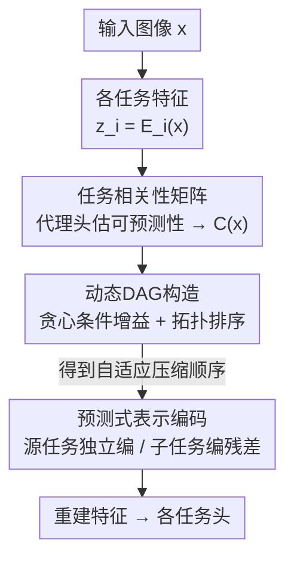

# Discovering Adaptive Task Dependencies for Efficient Multi-Task Representation Compression

**会议**: CVPR 2026  
**论文**: [CVF Open Access](https://openaccess.thecvf.com/content/CVPR2026/html/Huang_Discovering_Adaptive_Task_Dependencies_for_Efficient_Multi-Task_Representation_Compression_CVPR_2026_paper.html)  
**代码**: 无  
**领域**: 模型压缩  
**关键词**: 多任务表示压缩, 任务依赖DAG, 条件熵编码, 率失真优化, 机器视觉编码  

## 一句话总结
ATDC 把"按什么顺序压缩多个任务的特征"做成**逐图自适应**的：先用一个轻量代理头估计任务间的可预测性、拼成相关性矩阵，再贪心构造一张有向无环图（DAG）决定压缩顺序，让每个任务的特征都条件于它的"父任务"做残差编码，从而在 Taskonomy 上以更低码率换来更高的多任务精度。

## 研究背景与动机
**领域现状**：传统图像编解码（JPEG/VVC、以及端到端学习型 ELIC/MLIC++）都为"人眼看"服务，优化像素保真度和感知质量。但越来越多的图像是给机器看的——分割、深度、法向估计等下游任务，并不需要逐像素重建，只需要保留任务相关的语义信息。于是出现了"为机器编码"的思路：不压像素，而是直接压每个任务的中间特征表示（representation compression）。

**现有痛点**：多任务一起压时，不同任务的特征高度相关（深度和法向、分割和纹理在结构/纹理上大量重叠），如果每个任务各压各的（独立编码），这些共享信息被重复编码，码率浪费。已有的联合压缩方法（SSSIC 用预定义层级、OmniICM 学一个共享表示、TAMC 按梯度相似度聚类任务）虽然引入了任务间依赖，但这些依赖结构都是**静态**的——训练完一次就固定，对所有输入图像用同一套压缩顺序。

**核心矛盾**：任务之间谁更能预测谁，是**随图像内容变化**的。比如一张图里深度信息很丰富时，深度能很好地预测法向；换一张图可能正相反。用一套全局固定的依赖结构，必然在很多场景下分配冗余比特、率失真次优。

**本文目标**：让任务依赖结构（哪些任务先编、哪些任务条件于谁编）逐图自适应地推断出来，而不是写死。

**切入角度**：从信息论的可预测性出发——如果任务 $t_j$ 能强预测任务 $t_i$，那么给定 $Z_j$ 后 $Z_i$ 的条件熵更低（$H(Z_i\mid Z_j) < H(Z_i)$），就应该先编 $t_j$、再条件于它编 $t_i$ 的残差，这样总码长更短。问题是真实条件熵不可直接算（条件分布未知、不可微），需要一个可训练的代理。

**核心 idea**：用一个轻量代理头近似"任务间条件可预测性"，逐图算出相关性矩阵，再贪心地构造一张 DAG 决定自适应压缩顺序，用预测式残差编码消除任务间冗余。

## 方法详解

### 整体框架
ATDC 是一个"先估关系、再排顺序、最后按顺序预测式编码"的三段式 pipeline。给定一张图像，先用各任务自己的特征提取器 $E_i$ 抽出表示 $z_i = E_i(x)$；这些表示送进**任务相关性估计器**，得到任务两两之间的可预测性分数、拼成相关性矩阵 $C(x)$；矩阵经**动态 DAG 构造**变成一张有向无环图，对它做拓扑排序就得到这张图专属的压缩顺序；最后**预测式表示编码**沿着这个顺序逐任务编码——没有父任务的"源任务"独立编码，有父任务的任务则条件于已解码的父特征只编码残差。解码后的特征喂给各任务头做下游分析。

形式化地，已有方法在固定顺序下优化 $\min \mathbb{E}_{x}\big[\sum_i R_i(z_i\mid \hat z_{<i}) + \lambda_i L^{(i)}_{\text{task}}(\hat z_i, y_i)\big]$，其中 $\hat z_{<i}$ 是固定全局顺序里 $t_i$ 之前任务的重建特征；ATDC 把它换成自适应的前驱集合 $\pi(<i)$：

$$\min_{\{\theta_i,\phi_i\},\psi}\ \mathbb{E}_{x\sim D}\Big[\sum_{i=1}^{N} R_i\big(z_i\mid \hat z_{\pi(<i)};\theta_i,\phi_i\big) + \lambda_i L^{(i)}_{\text{task}}(\hat z_i, y_i)\Big]$$

关键差别就在 $\pi(<i)$——前驱集合由一个可学习的关系估计器 $g(x;\psi)$ 从输入图像内容里推断出来，逐图都不同。

### 关键设计

**1. 任务相关性矩阵：用代理头把"条件可预测性"变成可微分数**

痛点直接：要按可预测性排顺序，就得知道"给定任务 $t_j$，任务 $t_i$ 还剩多少不确定性"，也就是条件熵 $H(Z_i\mid Z_j)$；但真实条件分布 $p(Z_i\mid Z_j)$ 未知且不可微，没法塞进编解码器一起训。ATDC 的做法是引入一个轻量代理头 $q_\phi(Z_i\mid Z_j)$ 去近似这个条件分布，并假设每个任务表示服从高斯。训练目标是条件交叉熵，它正好是真实条件熵的上界：

$$\mathbb{E}_p[-\log q_\phi(Z_i\mid Z_j)] = H_p(Z_i\mid Z_j) + \mathrm{KL}\big(p(Z_i\mid Z_j)\,\|\,q_\phi(Z_i\mid Z_j)\big) \ge H_p(Z_i\mid Z_j)$$

当 $q_\phi$ 逼近真实 $p$，最小化代理损失就等价于逼近可达到的条件码率——按香农信源编码定理，模型 $q_\phi$ 下的期望码长就等于这个条件交叉熵，所以代理头的优化方向和真实熵编码一致。具体实现上，候选父特征先按通道归一化（让异构任务的特征尺度可比），拼接后过三层 $3\times3$ conv-BN-ReLU 融合，再用两个 $1\times1$ 头预测目标特征的高斯参数 $(\mu_i, \sigma_i^2)$，代理头用条件高斯负对数似然训练：

$$L_{\text{proxy}} = \frac{1}{2}\,\mathbb{E}\Big[\log\sigma_i^2 + \frac{\|z'_i - \mu_i\|^2}{\sigma_i^2}\Big]$$

代理损失越小说明 $t_i$ 越能被父任务预测。于是对每个有序对 $(j\to i)$ 定义可预测性分数 $s_{i,j}(x) = -L^{j\to i}_{\text{proxy}}(x)$（条件交叉熵越低、额外码率越低、分数越高），再指数化得到相关性矩阵元素 $C_{i,j}(x) = \exp(s_{i,j}(x))$。注意这个矩阵是**非对称**的——"深度预测法向"和"法向预测深度"的分数可以不同，这正是固定顺序方法抓不住的信息。

**2. 动态 DAG 构造：贪心条件增益挑边，逐图排出压缩顺序**

有了相关性矩阵还不够，直接两两连边会得到环、也无法保证稀疏可解释。ATDC 用一个基于**条件增益**的贪心算法（Algorithm 1）把矩阵变成一张 DAG。对候选父 $t_p$、子 $t_c$，在 $t_c$ 当前父集合 $S = \mathrm{Pa}(t_c)$ 下，加入 $t_p$ 带来的增量可预测性定义为：

$$g_{p\to c} = C_{c,\,S\cup\{t_p\}} - C_{c,\,S}$$

只有 $g_{p\to c} > \tau$ 的边才保留（阈值 $\tau$ 压掉噪声和弱相关），并把每个节点的入度上限卡在 $K_{\max}$ 以保持稀疏可解释。算法外层循环 $k=1\dots K_{\max}$，每轮先收集所有满足阈值的候选边、按增益降序排序，再依次加边——只在"不形成环且当前父数 $<k$"时才真正连上。这样既保证无环，又让每个节点的父集合逐步扩张，最终的图随可预测性分数自适应、能捕捉非对称依赖、允许逐图动态重排任务编码器。对这张 DAG 做拓扑排序就得到该图专属的压缩顺序。

**3. 预测式表示编码：源任务独立编、子任务编残差**

拿到 DAG 后沿因果顺序逐任务编码，分两种情况。**没有父任务的源任务**用标准的 factorized 自编码器：特征下采样、训练时均匀量化（推理时取整）、解码重建 $\hat z_i$，码率用可学习的 factorized 密度模型估计 $R_i = -\sum \log p_{\theta_i}(\hat z_i)$。**有父任务的任务**复用代理头那套结构当预测器：特征估计模块吃进已重建的父特征 $\hat z_{\mathrm{Pa}(t_i)}$ 和一个由任务 one-hot 得到的任务身份嵌入 $e_i$，输出条件高斯参数 $(\mu_i,\sigma_i^2)$ 和预测 $\tilde z_i = \mu_i$；然后只对残差 $r_i = z_i - \tilde z_i$ 下采样、量化、上采样得到 $\hat r_i$（残差用带超先验的高斯熵模型编码，以应对残差更高的统计复杂度），最终重建 $\hat z_i = \tilde z_i + \hat r_i$ 再做逆归一化恢复尺度。每个任务单独用率-性能损失优化：

$$L_i = R_i + \lambda_i\, L^{(i)}_{\text{task}}(\hat z_i, y_i)$$

这一步把第 1、2 步推断出的依赖真正变成比特节省——共享信息一旦被父任务编了，子任务就只为"减不掉的残差"花码率，这就是跨任务的预测式冗余消除和非对称信息共享。

### 损失函数 / 训练策略
代理头单独训 20 epoch（lr $1\times10^{-4}$、batch 8）以估相关性。压缩模块采用两阶段训练：先 5 epoch warm-up、只用 L1 特征重建损失稳住残差预测器，再用完整率-失真目标（码率 + 任务损失）训 20 epoch；学习率从 $1\times10^{-4}$ 指数衰减到 $1\times10^{-5}$。DAG 超参 $K_{\max}=2$、$\tau=0.2$。

## 实验关键数据

数据集为 Taskonomy（Tiny split，约 0.87M 训练 / 16K 验证测试），评测六个任务：语义分割、关键点 2D、边缘纹理、表面法向、深度 Z-buffer、以及面向人眼的图像压缩。骨干用 Xception，对比对象覆盖传统编解码（WebP、VTM-Intra）、学习型压缩（ELIC、MLIC++）、生成式压缩（VQGAN）和 SOTA 多任务压缩 TAMC。

### 主实验（率-性能与可扩展性）
| 评测维度 | ATDC 表现 | 对照 |
|---------|-----------|------|
| 五项下游任务率-性能 | 各码率下全面领先 | 优于传统 / 学习型编解码 |
| vs TAMC（边缘纹理、表面法向） | 精度明显更高 | 动态依赖更能保住几何/低层结构 |
| 极低码率区 | 任务性能稳定 | 图像编解码严重退化 |
| 可扩展多任务编码（累计效用 vs 累计码率） | 后期效用增速更快、最终全预算超过 TAMC | TAMC 初值高（前三任务共享表示）但后劲不足 |
| 像素级重建（PSNR/FID） | 与 TAMC 相当或略好；LPIPS/MS-SSIM 略低 | 自适应压缩没牺牲感知自然度 |

### 消融与分析
| 配置 / 分析 | 关键结果 | 说明 |
|------------|---------|------|
| 压缩顺序：adaptive（本文） | 各码率下损失最低 | DAG 自适应顺序最优 |
| 压缩顺序：fixed（$n\to s\to d\to k\to t\to a$） | 次优 | 用测试集最频繁拓扑序写死 |
| 压缩顺序：random（逐图随机洗牌） | 最差 | 依赖一致性被破坏 |
| 任务可扩展（Table 1，N=5 vs N=6） | s:0.1841/0.1840，n:0.2110/0.2112，k:0.2524/0.2526 | 新增任务 k 仅微调代理头即逼近满系统，不损已有任务 |
| 编码延迟（Table 2） | Fixed 41.3 ms → ATDC 44.8 ms（+8.9%） | DAG 推断仅占约 6% 运行时 |
| 复杂度 | $O(T^2)$，$T=6$ | 逐图构造 DAG，端到端编码延迟仅 +9% |

### 关键发现
- **自适应顺序确实重要**：random 顺序最差直接证明"按可预测性排序"不是噱头——破坏依赖一致性就掉点；fixed 虽不差但被 adaptive 全面压制，说明逐图自适应比全局静态序更优。
- **学到的 DAG 可解释且稳定**：top-10 DAG 模式覆盖 20%+ 样本，聚合后呈现一致层级 $n\to s\to d,k,t,a$（法向 $n$ 在 44.1% 的图里当根、$s$ 多由 $n$ 预测、$\{d,k,t,a\}$ 多源自 $s$），既有全局一致性又有逐场景的内容特异变化。
- **扩展性几乎零成本**：加新任务只需在涉及它的两两组合上微调轻量代理头、再训该任务的压缩模块，原四任务系统全冻结，N=5 与 N=6 数值贴近说明新任务能快速达到满系统水平且不拖累旧任务。
- **代价很小**：逐图构造 DAG 的全部开销只换来约 9% 的编码延迟，相对率-失真收益完全划算。

## 亮点与洞察
- **把"压缩顺序"当成可学习、逐图变化的结构变量**，是这篇最"啊哈"的地方：以往多任务压缩要么各编各的、要么写死一套层级，ATDC 让 DAG 随内容动起来，既消冗余又顺手产出可解释的任务层级图。
- **代理头一物两用**：先用它估相关性矩阵（决定顺序），再复用同一结构当条件预测器（实际编残差），设计上自洽且省参数。
- **条件交叉熵上界是真实条件熵**这个推导把"代理损失"和"真实码率"对齐，让"代理损失越小越该后编"有信息论依据，而不是拍脑袋的启发式。
- **非对称相关性矩阵**（$C_{i,j}\ne C_{j,i}$）这个细节是关键——它正是固定/对称聚类方法（如按梯度相似度聚类的 TAMC）表达不了的，"A 能预测 B 不代表 B 能预测 A"被显式建模成有向边。
- 思路可迁移：任何"多路/多分支表示要联合压缩或联合存储"的场景（多模态特征、多尺度特征、多视角），都可以借这套"代理头估可预测性 → DAG 定顺序 → 预测式残差编码"的范式来挤冗余。

## 局限与展望
- 作者明说本文只验证"自适应依赖建模"的有效性，**没优化编解码器本体**——压缩模块还是现成的学习型图像压缩架构，换更强的 codec 应能进一步提升，这也是作者点名的未来方向。
- ⚠️ 论文正文主要给的是率-性能曲线和少量小表，缺少跨方法的统一 BD-rate 量化数字（很多结论是"明显更高/略低"这类定性描述），想精确复现各任务的提升幅度需要看补充材料。
- 入度上限 $K_{\max}=2$、阈值 $\tau=0.2$ 是为可解释/稳定性折中选的；任务数 $N$ 更大时 $O(T^2)$ 的逐图 DAG 推断和稀疏约束是否还划算、层级会不会塌成近似固定序，正文没充分讨论。
- 评测只在 Taskonomy 室内场景，六个任务也偏几何/低层视觉；换到检测/跟踪这类任务多样性更高、任务相关性更弱的场景，自适应 DAG 的收益是否还在，存疑。

## 相关工作与启发
- **vs TAMC（固定依赖、梯度相似度聚类）**：TAMC 按梯度相似度把任务聚成固定组、用预定义层级编码；ATDC 逐图推断非对称 DAG。共享表示让 TAMC 在极低码率下初值更高，但后续任务效用增长慢，最终被 ATDC 在所有预算下反超。本文优势是内容自适应与可扩展，代价是 +9% 编码延迟。
- **vs SSSIC（预定义任务层级）/ OmniICM（统一共享表示）**：二者都把任务关系写死或塞进一个通用表示，无法逐图调整；ATDC 用"先估可预测性再排序"把依赖结构变成内容函数。
- **vs 端到端学习型图像压缩（ELIC/MLIC++）**：它们优化像素率-失真、为人眼服务，在极低码率下机器任务性能严重退化；ATDC 直接压任务特征、为机器服务，在极低码率仍稳。
- **vs 多任务学习（任务分组 / 梯度冲突缓解）**：MTL 证明任务相关性可学可用，但目的是共享表示提升泛化；ATDC 把"任务相关性可利用"这一观察搬进压缩框架，用它来做比特分配和跨任务去冗余。

## 评分
- 新颖性: ⭐⭐⭐⭐⭐ 把多任务压缩顺序做成逐图自适应的 DAG，并用条件交叉熵代理给出信息论依据，角度新颖。
- 实验充分度: ⭐⭐⭐⭐ Taskonomy 上六任务对比 + 顺序/扩展性/延迟消融较完整，但缺统一 BD-rate 数字、只在单一数据集。
- 写作质量: ⭐⭐⭐⭐ 动机—方法—实验链条清晰，公式与算法交代到位；部分关键数字推到补充材料略可惜。
- 价值: ⭐⭐⭐⭐ 为"机器视觉编码 / 多任务特征压缩"提供了可解释、可扩展的自适应依赖范式，且开销可控。

<!-- RELATED:START -->

## 相关论文

- [\[CVPR 2026\] Frequency Switching Mechanism for Parameter-Efficient Multi-Task Learning](frequency_switching_mechanism_for_parameter-ecient_multi-task_learning.md)
- [\[CVPR 2026\] TaskIT: Memory-Efficient Fine-Tuning of Multi-LoRA LLMs via Cross-Task Importance Transfer](taskit_memory-efficient_fine-tuning_of_multi-lora_llms_via_cross-task_importance.md)
- [\[CVPR 2025\] TADFormer: Task-Adaptive Dynamic Transformer for Efficient Multi-Task Learning](../../CVPR2025/model_compression/tadformer_task-adaptive_dynamic_transformer_for_efficient_multi-task_learning.md)
- [\[CVPR 2026\] Understanding and Enforcing Weight Disentanglement in Task Arithmetic](understanding_and_enforcing_weight_disentanglement_in_task_arithmetic.md)
- [\[CVPR 2026\] Generative Video Compression with One-Dimensional Latent Representation](generative_video_compression_with_one-dimensional_latent_representation.md)

<!-- RELATED:END -->
