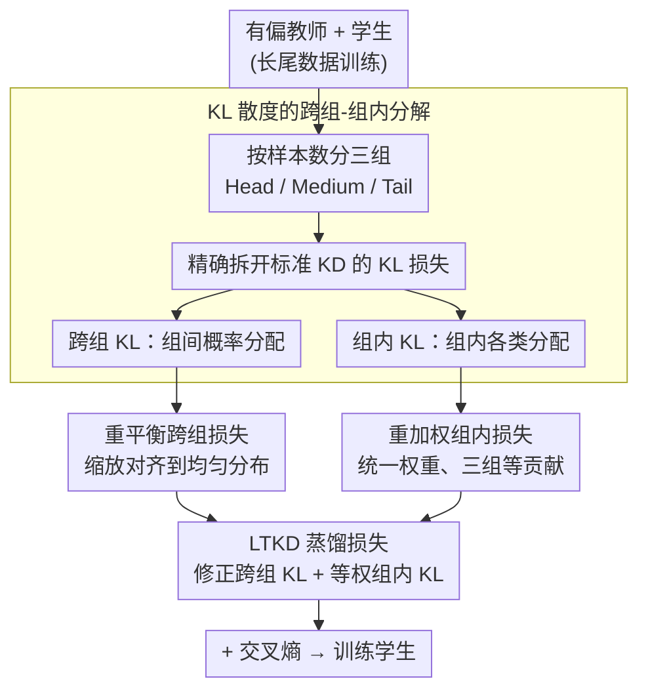

# Distilling Balanced Knowledge from a Biased Teacher

**会议**: CVPR 2026  
**arXiv**: [2506.18496](https://arxiv.org/abs/2506.18496)  
**代码**: 无  
**领域**: 模型压缩  
**关键词**: 知识蒸馏, 长尾分布, 模型压缩, KL 散度分解, 类不平衡

## 一句话总结

针对长尾分布下知识蒸馏中教师模型向头部类偏斜的问题，将传统 KL 散度损失分解为跨组损失和组内损失两个组件，通过重平衡跨组损失校准教师的组级预测、重加权组内损失保证各组等贡献，在 CIFAR-100-LT/TinyImageNet-LT/ImageNet-LT 上全面超越现有方法，甚至超过教师模型自身表现。

## 研究背景与动机

知识蒸馏（KD）是将大型教师模型的知识迁移到轻量学生模型的标准技术。传统 KD 方法都**隐含假设训练数据是类别均衡的**。

然而现实世界数据通常服从**长尾分布**：头部类样本充足、尾部类样本稀缺。在此分布下训练的教师模型存在严重头部类偏差。直接用标准 KD 让学生模仿有偏教师，不仅无效甚至有害：学生会继承偏差，在尾部类上表现更差。

关键问题：**能否从有偏的教师中蒸馏出平衡的知识？**

切入角度：将 KL 散度损失数学分解为跨组和组内两个组件，发现两者各自受到教师偏差的不同影响——跨组项导致高估头部概率，组内项的加权机制使头部组主导梯度。

核心 idea：**不修改教师模型，而是在蒸馏目标函数中矫正教师偏差的影响**。

## 方法详解

### 整体框架

这篇论文要解决的是：在长尾数据上训练出的教师本身偏向头部类，直接拿它做标准 KD，学生只会把这份偏差照单全收。LTKD 的做法不去动教师，而是把蒸馏目标函数拆开来修。它先按训练样本数把所有类别排成三组——Head、Medium、Tail（各占约 33%/34%/33%），再把标准的 KL 散度蒸馏损失精确拆成「跨组」和「组内」两个部分：前者管三个组之间的概率怎么分配，后者管一个组内部各类怎么分配。看清这两部分各自怎么被偏差污染之后，对跨组项做重平衡、对组内项做重加权，最后把修正后的跨组 KL 和等权的组内 KL 加起来作为新的蒸馏损失。

### 关键设计

**1. KL 散度的跨组-组内分解：先把偏差的两条传播路径拆开**

标准 KD 损失是教师和学生整体概率分布之间的一个 KL 散度，偏差混在里面看不出从哪条路径影响结果。这一步借一个恒等式把它拆开：定义某个组 $\mathcal{G}$ 的跨组概率 $p_\mathcal{G} = \sum_{i \in \mathcal{G}} p_i$（组内所有类概率之和），以及组内条件概率 $\tilde{p}_{\mathcal{G}_i} = p_i / p_\mathcal{G}$，于是任意类概率都能写成 $p_i = p_\mathcal{G} \cdot \tilde{p}_{\mathcal{G}_i}$。代回 KL 散度后，整个损失恰好分解为「跨组 KL」加上「以教师跨组概率 $p_\mathcal{G}^{T}$ 加权的各组组内 KL 之和」。因为是数学恒等式而非近似，分解本身不损失任何信息，但它把偏差的两种危害分了家：一是跨组项让教师高估头部组的整体概率，二是组内项的加权系数 $p_\mathcal{G}^{T}$ 天生偏大头部组，使头部组主导梯度。后面两个设计正是分别对着这两条路径下手。

**2. 重平衡跨组损失（Rebalanced Cross-Group Loss）：把偏斜的组级分布拉回均匀**

跨组项的毛病是教师高估了头部组的整体概率。论文给出的依据是：同一个有偏教师，喂均衡数据时三组的平均跨组概率近似均匀（约 [22.54, 20.76, 20.70]），一换成长尾数据就被拉歪成 [27.88, 19.28, 16.83] ⚠️ 以原文为准。既然偏斜是数据分布造成的系统性偏移，就在每个 batch 内统计教师三组的概率总和，算出一组缩放因子，把它们对齐到均匀分布，再把这个缩放施加到逐样本的概率上并重新归一化，保证修正后仍是合法的概率分布。这样学生学到的组级目标是「三组等价」的，而不是教师那份被头部撑大的版本，从源头上挡住了偏差经跨组项流向学生。

**3. 重加权组内损失（Reweighted Within-Group Loss）：让三组对总损失等量贡献**

组内项的问题出在加权系数上：分解里每组的组内 KL 被乘上了教师的跨组概率 $p_\mathcal{G}^{T}$，而这个系数对头部组天生偏大，于是头部组的组内损失主导了整个梯度，尾部组的组内监督被压得几乎可以忽略。修法很直接——把这个不等的权重替换成一个统一常数，让三组的组内 KL 等权相加。这样每组拿到的监督信号强度相同，尾部组内部各类之间的细粒度区分（教师 dark knowledge 里真正有用的那部分）才不会被头部组淹没。

### 损失函数 / 训练策略

- 总损失：交叉熵 + 温度缩放的 LTKD 损失，后者用超参数 $\alpha$、$\beta$ 平衡跨组项与组内项 ⚠️ 以原文为准
- 类别划分：按训练样本数排序，top 33% 归 Head、next 34% 归 Medium、bottom 33% 归 Tail
- 不平衡因子：CIFAR-100-LT 和 TinyImageNet-LT 用 {10, 20, 100}，ImageNet-LT 用 {5, 10, 20}
- 测试集保持均衡，避免评估本身被长尾扭曲

## 实验关键数据

### 主实验：CIFAR-100-LT（gamma=100, 最极端不平衡）

| Teacher to Student | 方法 | Tail 准确率 (%) | Overall 准确率 (%) |
|-------------------|------|-----------------|---------------------|
| ResNet32x4 to ResNet8x4 | DKD | 13.25 | 46.11 |
| | ReviewKD | 15.09 | 45.91 |
| | **LTKD** | **27.21** | **51.08** |
| | Delta | **+12.12** | **+4.97** |
| ResNet50 to MobileNetV2 | DKD | 12.45 | 39.21 |
| | **LTKD** | **21.04** | **42.45** |
| | Delta | **+8.59** | **+3.24** |

### 消融实验

| 配置 | Tail (%) | All (%) | 说明 |
|------|----------|---------|------|
| 标准 KD | 13.38 | 42.48 | 继承教师偏差 |
| 仅跨组重平衡 | ~20 | ~48 | 校准组级分布有效 |
| 仅组内重加权 | ~18 | ~47 | 均衡组内梯度有效 |
| LTKD（两者结合） | 27.21 | 51.08 | 协同效果显著 |

### 关键发现

- **LTKD 几乎所有设置中超越教师自身**：gamma=100 时教师 Tail 仅 15.28%，学生达 27.21%
- 在异构架构对（WRN-40-2 to ShuffleNetV1、ResNet50 to MobileNetV2）上同样有效
- 不平衡程度越极端优势越大：gamma=100 时 Tail 提升 +12.12%，gamma=10 时 +6.58%
- DKD 的 target/non-target 分解在长尾场景下改善有限

## 亮点与洞察

- **数学分解驱动的方法设计**：先通过精确数学恒等式揭示问题本质，再设计针对性修正
- **"学生超越教师"的反直觉结果**：教师的 dark knowledge 中包含被偏差掩盖的有用信息
- **极简设计但效果显著**：只修改损失函数，不改架构、不加模块、不加数据增强

## 局限与展望

- 三组划分固定（各 33%），自适应分组可能更优
- 仅在 CNN 架构上验证，未测试 ViT 或更大规模模型
- 重平衡因子基于 batch 统计量，小 batch 下可能不稳定
- 未与 logit adjustment 等长尾去偏策略做组合对比

## 相关工作与启发

- DKD 的 target/non-target 分解是灵感来源之一，但分解维度不同
- logit adjustment 在推理时校准，LTKD 在训练时校准教师分布，可能互补
- 分组+重加权思路可推广到任何教师存在系统性偏差的场景

## 评分

- 新颖性: ⭐⭐⭐⭐ KL 分解视角新颖，损失修正策略虽简单但有数学支撑
- 实验充分度: ⭐⭐⭐⭐ 3 数据集 x 3 不平衡度 x 4 架构对
- 写作质量: ⭐⭐⭐⭐⭐ 逻辑链完整，数学推导清晰
- 价值: ⭐⭐⭐⭐ 解决 KD 在真实不平衡场景痛点，方法简洁可直接应用

<!-- RELATED:START -->

## 相关论文

- [\[ICCV 2025\] A Good Teacher Adapts Their Knowledge for Distillation](../../ICCV2025/model_compression/a_good_teacher_adapts_their_knowledge_for_distillation.md)
- [\[AAAI 2026\] Distilling Cross-Modal Knowledge via Feature Disentanglement](../../AAAI2026/model_compression/distilling_cross-modal_knowledge_via_feature_disentanglement.md)
- [\[ICML 2025\] Distilling Tool Knowledge into Language Models via Back-Translated Traces](../../ICML2025/model_compression/distilling_tool_knowledge_into_language_models_via_back-translated_traces.md)
- [\[NeurIPS 2025\] Single-Teacher View Augmentation: Boosting Knowledge Distillation via Angular Diversity](../../NeurIPS2025/model_compression/single-teacher_view_augmentation_boosting_knowledge_distillation_via_angular_div.md)
- [\[ACL 2026\] Find Your Optimal Teacher: Personalized Data Synthesis via Router-Guided Multi-Teacher Distillation](../../ACL2026/model_compression/find_your_optimal_teacher_personalized_data_synthesis_via_router-guided_multi-te.md)

<!-- RELATED:END -->
