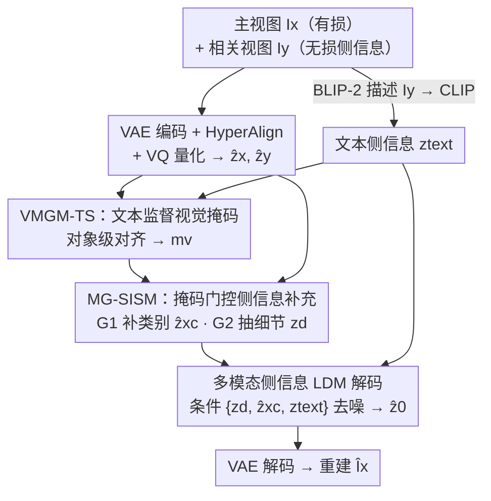

# Distributed Image Compression with Multimodal Side Information at Extremely Low Bitrates

**会议**: CVPR 2026  
**论文**: [CVF Open Access](https://openaccess.thecvf.com/content/CVPR2026/html/Xu_Distributed_Image_Compression_with_Multimodal_Side_Information_at_Extremely_Low_CVPR_2026_paper.html)  
**代码**: 无（论文未公开）  
**领域**: 模型压缩 / 图像压缩 / 扩散模型  
**关键词**: 分布式图像压缩, 侧信息, 潜在扩散模型, 多模态对齐, 极低码率  

## 一句话总结
针对多视图分布式图像压缩在极低码率（<0.1 bpp）下重建模糊、细节丢失的问题，本文提出 MDIC：首次把侧信息以「文本 + 视觉」多模态形式喂进预训练文本到图像扩散模型，用一个文本监督的视觉掩码门控地补回量化时丢掉的类别信息与对象级细节，在 KITTI Stereo / Cityscapes 上取得 SOTA 感知质量。

## 研究背景与动机
**领域现状**：分布式图像压缩（Distributed Image Compression, DIC）把一路视图无损传输、当作「侧信息」（side information）去辅助另一路被有损压缩视图的解码端重建。它不需要编码端设备之间互相通信，理论上（Slepian-Wolf / Wyner-Ziv）能逼近联合编码的效率，特别适合多摄像头监控、3D 场景重建这类带宽受限场景，因此目标码率通常压到极低的 <0.1 bpp。

**现有痛点**：现有 DIC 几乎都建立在 VAE 框架上，用全局 cross-attention 把侧信息和压缩特征做交互。但在极低码率下，被传输的主图特征已经被严重降质、携带的信息远少于侧信息，注意力机制只能盯住与「残存的少量主图内容」相关的信号，根本捞不回压缩时丢掉的对象级细节。更糟的是这类方法只优化像素级保真（PSNR/MS-SSIM），缺细节时就靠「平均相关线索」来填，结果是过度平滑、局部发糊。

**核心矛盾**：极低码率下，主图信息量 ≪ 侧信息量，二者高度不对称；而侧信息里既有「该用的对象级细节」也有「会干扰重建的多视图差异/冗余」，把这两类信息分离开本身就很难——不同区域、不同对象的细粒度信息重要性还各不相同，注意力无从均衡。纯像素保真的目标又让模型放弃了分布一致性，这正是发糊的根源。

**切入角度**：扩散式压缩器（Perco/DiffEIC/RDEIC）已经证明，预训练文本到图像扩散模型即使在极低码率也能从有限信息恢复出丰富的全局语义、保持分布一致。作者由此想到：扩散模型天然适合把侧信息里的「全局语义」和「细粒度细节」拆开来用——文本侧信息管全局分布，视觉侧信息管局部细节。

**核心 idea**：首次把 DIC 的侧信息以多模态形式（从相关视图抽出的文本描述 + 视觉特征）注入预训练 LDM 解码器，并用一个「文本监督训练出来的视觉掩码」当信息闸门，门控地补回量化丢失的类别信息和对象细节。

## 方法详解

### 整体框架
MDIC 是一条「编码端压缩 + 解码端多模态扩散重建」的非对称管线。**编码端**：主视图 $I_x$ 走有损压缩，相关视图 $I_y$ 无损传输（仅解码端可见）。两路都先用冻结的预训练 VAE 编码到潜空间得 $z_{Lx}, z_{Ly}$，经一个卷积 + 线性注意力的 HyperAlign 模块细化为 $z_x, z_y$，再用 VQ-VAE 量化为 $\hat z_x, \hat z_y$；其中 VQ 量化既压缩信息、又把特征聚类到结构化潜空间。一个 Transformer 自回归熵模型估计 $\hat z_x$ 的码率 $\text{bpp}_x$。同时用 BLIP-2 对 $I_y$ 生成文本描述，经 CLIP 文本编码器得文本侧信息 $z_{text}$。算术编码把 $\hat z_x, \hat z_y, z_y, z_{text}$ 打成码流。

**解码端**做三件事：① VMGM-TS 在文本监督下生成视觉掩码 $m_v$；② MG-SISM 用 $m_v$ 门控地处理视觉侧信息——一路补回类别特征 $\hat z_{xc}$，一路抽取细粒度细节 $z_d$；③ 以多模态条件 $Z_{cond}=\{z_d, \hat z_{xc}, z_{text}\}$ 引导 LDM 去噪，得潜变量 $\hat z_0$，再过 VAE 解码器还原为 $\hat I_x$。文本侧信息引导全局语义、视觉侧信息专注局部细节，两者合力实现语义一致的重建。

### 关键设计

**1. 多模态侧信息 LDM 解码：让侧信息分工管全局与局部**

这一设计针对「极低码率下 cross-attention 捞不回细节、且只优化像素保真导致发糊」的痛点。MDIC 不再用单一视觉 cross-attention，而是把侧信息拆成两种模态喂进预训练 LDM：从相关视图 $I_y$ 用 BLIP-2 生成文本、CLIP 编码为 $z_{text}$，负责传递多视图间共享的**全局分布/语义**；视觉侧信息则负责**局部细节**。去噪在多模态条件 $Z_{cond}=\{z_d, \hat z_{xc}, z_{text}\}$ 下进行，前向加噪与反向去噪为

$$z_t=\sqrt{\hat\alpha_t}\,z_{Lx}+\sqrt{1-\hat\alpha_t}\,\varepsilon,\qquad p_\theta(z_{t-1}\mid z_t)=\mathcal N\!\big(z_{t-1};\,\mu_\theta(z_t,Z_{cond},t),\,\beta_t I\big)$$

其中 $z_0$ 由主图潜表示 $z_{Lx}$ 初始化（不是从纯噪声起步，借残存主图加速收敛），去噪网络 $\mu_\theta$ 用 U-Net 实现。之所以有效：扩散模型靠大规模预训练能在信息极度匮乏时生成分布一致的内容，避免了 VAE 那种「缺细节就平均」的像素抹平；而文本/视觉分工又恰好对上了「全局 vs 局部」这对侧信息内部的天然分层。

**2. VMGM-TS：用对象级文本预测任务监督出一张「会挑细节」的视觉掩码**

这一设计解决「侧信息里有用细节与干扰冗余难分离、且各区域重要性不均」的核心难题。直接学一张掩码没有语义抓手，作者于是把掩码生成绑到一个**对象级多模态对齐辅助任务**上：先从数据集统计出最高频的 $N$ 个对象名词建词表（实验里 $N{=}14$），训练时把图像描述里的对象词替换成 mask token 形成 object-masked text，再用掩码后的视觉特征去预测这些被遮的词——掩码必须「圈对对象区域」才能预测对，于是它被逼着学会按对象级语义重要性去挑细粒度线索。

掩码本身从主、侧两路量化特征的差异与相似线索生成：$F_{diff}=|\hat z_x-\hat z_y|$、$F_{prod}=\hat z_x\odot\hat z_y$，拼接后过三层卷积得 logits，再用 Gumbel–Sigmoid 做可微的近似二值采样

$$m=\sigma\!\Big(\tfrac{\text{logits}+g}{\tau}\Big),\qquad m_v=\mathbb I(m>\theta)+\mathrm{sg}\big(m-\mathbb I(m>\theta)\big)$$

其中 $g$ 是 Gumbel 噪声、$\tau$ 控制平滑度、$\theta$ 是硬采样阈值（推理时设 0.2），$\mathrm{sg}$ 是停梯度——这样前向得到硬二值掩码、反向仍能传梯度。对齐任务的监督用预测词与真值词的交叉熵 $L_{mask}=\frac1n\sum_i \mathrm{CE}(P_i,T_i)$。⚠️ 公式以原文为准。

**3. MG-SISM：掩码门控地把类别与细节分别补回去**

VQ 量化在压缩主图时会丢掉类别信息和对象级细节，这一设计就是专门补这两样。MG-SISM 用掩码 $m_v$ 开两个门：

$$\hat z_{xc}=G_1(\hat z_x,\ \hat z_y\odot m_v),\qquad z_d=z_y+G_2(z_y)\odot F_m(m_v)$$

门 $G_1$ 把掩码作用在**量化后**的侧信息 $\hat z_y$ 上、聚焦类别相关区域，再与主图量化潜表示经视觉 Transformer 交互，产出语义增强的**类别特征** $\hat z_{xc}$——VQ 量化把特征聚类成结构化潜空间，正好方便这里恢复极压下丢失的类别。门 $G_2$ 则作用在**无损未量化**的侧信息 $z_y$ 上，让关键对象区域的**细粒度细节** $z_d$ 拿到最大注意力、同时压制冗余与多视图差异，从而约束重建图与原内容语义一致。两路输出连同 $z_{text}$ 一起成为扩散去噪的条件。

### 损失函数 / 训练策略
总损失由三部分组成：$L=L_{VQ}+\lambda_{mask}\cdot L_{mask}+L_{RD}$。其中 $L_{VQ}$ 是标准 VQ-VAE 的码本承诺项 + 嵌入项；$L_{mask}$ 是掩码生成的对象级交叉熵监督（$\lambda_{mask}{=}0.1$）；率失真损失 $L_{RD}=\mathbb E_{I_x}[\lambda\cdot\mathbb E[-\log_2 p(\hat z_x)]+L_{diff}]$ 平衡码率与重建质量，失真项采用扩散噪声预测目标 $L_{diff}=\mathbb E\big[\lVert\varepsilon-\varepsilon_\theta(z_t,t,Z_{cond})\rVert_2^2\big]$。训练用 4×L40、batch 8、AdamW，学习率 10000 步 warmup 到 $8\times10^{-5}$ 后恒定，平均每个数据点训 200 epoch；推理扩散步数仅 10 步，$\lambda\in\{0.1,10\}$。

## 实验关键数据

### 主实验
数据集为 KITTI Stereo（1576 训练 / 790 测试对）与 Cityscapes（2975 / 1525 对），图像统一到 128×256。对比涵盖 DIC（NDIC/LDMIC/ATN）、联合编码 SIC（SASIC/ECSIC/CAMSIC/BiSIC）、扩散式 LIC（Perco/DiffEIC/RDEIC）。感知指标 LPIPS/FID/DISTS/KID/NIQE，失真指标 PSNR/MS-SSIM/mIoU。结论：MDIC 在两数据集**全部感知指标**上 SOTA，明显超越既有 DIC，连联合编码的 SIC 也被它在感知质量上拉开；MS-SSIM、mIoU 在 KITTI 上最高，PSNR 虽低于纯失真方法，但 mIoU 与最佳失真方法相当——说明它在保住对象级细节上更强（作者也强调极低码率下 PSNR 这类失真指标意义有限）。

下表取自 Fig.8 的可视化样本（每方法一张代表图，⚠️ 为单图样本、非数据集平均，仅作直观对照）：

| 方法 | Bpp ↓ | PSNR ↑ | LPIPS ↓ |
|------|-------|--------|---------|
| ATN（DIC） | 0.0316 | 23.99 | 0.4287 |
| BiSIC（联合 SIC） | 0.0288 | 23.61 | 0.4373 |
| RDEIC（扩散 LIC） | 0.0212 | 12.61 | 0.5660 |
| **MDIC（Ours）** | **0.0107** | 22.56 | **0.2524** |

可见 MDIC 用更低的 bpp 拿到了显著更低的 LPIPS（感知更好），PSNR 与 DIC 方法相当——印证「感知质量大幅领先、像素保真不落下风」。

### 消融实验

**两类视觉侧信息（$\hat z_{xc}$ 类别特征 / $z_d$ 细粒度细节）**，BD-Quality 为相同码率下相对完整 MDIC 的平均质量变化（越高越好）：

| 配置 | LPIPS | DISTS | PSNR | MS-SSIM | 说明 |
|------|-------|-------|------|---------|------|
| w/o ($z_d+\hat z_{xc}$) | −0.3550 | −0.1826 | −8.6358 | −6.5115 | 两类全删，全面崩 |
| w/o $z_d$ | −0.1179 | −0.0489 | −2.8161 | −3.1127 | 缺细节，颜色/轮廓与原图不一致、像素保真掉得明显 |
| **MDIC（Full）** | 0 | 0 | 0 | 0 | 完整模型 |

**MG-SISM 的两个门 $G_1/G_2$**：

| 配置 | LPIPS | DISTS | PSNR | MS-SSIM | 说明 |
|------|-------|-------|------|---------|------|
| w/o ($G_1+G_2$) | −0.0437 | −0.0050 | −0.5979 | −0.4491 | 无掩码门控，冗余/不一致多视图特征干扰重建 |
| w/o $G_2$ | −0.0106 | −0.0045 | −0.2864 | −0.2595 | 仅去细节门 $G_2$ |
| **MDIC（Full）** | 0 | 0 | 0 | 0 | 完整模型 |

### 关键发现
- **类别特征 $\hat z_{xc}$ 是命门**：同时去掉 $z_d+\hat z_{xc}$ 时 PSNR 暴跌 8.64、MS-SSIM 跌 6.51；而只去 $z_d$ 只掉 2.82/3.11——说明缺了类别信息后扩散模型只能从极有限类别里生成内容，全局和局部质量同时崩，类别补偿比细节补偿更关键。
- **细节门 $z_d$ 偏保真**：去掉 $z_d$ 主要伤像素保真（颜色/轮廓不一致），对感知一致性影响相对小，印证「视觉侧信息管局部细节」的分工。
- **掩码门控有效但增益较小**：$G_1/G_2$ 的 BD-Quality 变化量级（0.04 级）远小于侧信息本身（0.35 级），说明门控是锦上添花的精修，可视化上主要体现在对象边界更准、类别与细粒度语义更一致。

## 亮点与洞察
- **把「侧信息内部的全局 vs 局部分层」对上「文本 vs 视觉模态分工」**：这是全文最巧的一步——不是简单加个文本条件，而是用文本撑全局分布一致、用带掩码的视觉撑局部细节，正好化解了 DIC 在极低码率下两类信息难分离的核心矛盾。
- **用「对象级完形填空」逼出一张语义掩码**：把掩码学习绑到「遮词预测」的多模态对齐任务上，掩码圈不准对象就预测不对词，这个自监督信号比直接监督掩码更省标注、也更有语义抓手，思路可迁移到任何「想学区域级注意力又缺像素级标签」的任务。
- **量化既是压缩也是聚类**：VQ-VAE 在这里一举两用——压缩码率的同时把特征聚成结构化潜空间，让 $G_1$ 能顺势补回类别，是个值得复用的设计观察。
- **从主图潜表示初始化扩散**（$z_0\leftarrow z_{Lx}$）+ 仅 10 步去噪，在极低码率下兼顾了速度与保真。

## 局限与展望
- **依赖外部大模型**：BLIP-2 captioning + CLIP + 预训练 LDM 全堆上，推理成本与显存不低，论文把复杂度分析放到了补充材料，正文未给端到端时延/参数量，落地代价存疑（⚠️）。
- **PSNR 偏低**：作者承认 MDIC 的 PSNR 低于纯失真方法，扩散生成天然牺牲逐像素保真，对需要像素级精确的场景（如测量、取证）未必合适。
- **文本侧信息质量受限于 captioner**：全局语义全押在 BLIP-2 生成的一句话描述上，描述若漏掉关键对象，文本引导就会偏，作者也把「多模态侧信息的作用」分析留到了补充材料。
- **作者展望**：研究更强的多视图相关性建模与统一预训练解码器。
- **自己看**：词表只取 14 个高频名词，长尾对象类别可能根本进不了掩码监督，跨数据集泛化与开放词表场景值得验证。

## 相关工作与启发
- **vs LDMIC / BiSIC（注意力式 DIC/SIC）**：它们靠 cross-attention / 3D 卷积融合侧信息、只优化像素保真，极低码率下注意力被残存主图内容卡死、细节捞不回，结果发糊；MDIC 改用多模态条件 + 扩散生成，避免像素平均、出图更锐，感知指标全面领先（代价是 PSNR 略低）。
- **vs Perco / DiffEIC / RDEIC（扩散式 LIC）**：这些方法有强生成力但**没有专门的侧信息建模**，在分布式多视图场景下细粒度对齐缺失，常生成与原图局部不一致的语义；MDIC 用 VMGM-TS + MG-SISM 显式把侧信息细粒度对齐进来，解决了「好看但细节对不上原图」的问题。

## 评分
- 新颖性: ⭐⭐⭐⭐⭐ 首次把多模态侧信息引入 DIC，文本/视觉分工 + 文本监督掩码的组合切口新颖
- 实验充分度: ⭐⭐⭐⭐ 两数据集多指标全面对比、消融清晰，但主结果以曲线图呈现、复杂度分析放补充材料，正文表格略少
- 写作质量: ⭐⭐⭐⭐ 动机—方法—消融逻辑顺畅，公式记号偏密、部分细节需查补充材料
- 价值: ⭐⭐⭐⭐ 为极低码率分布式压缩给出感知质量新 SOTA，思路对多视图传输有实用前景，但依赖多个大模型、PSNR 偏低限制部分场景

<!-- RELATED:START -->

## 相关论文

- [\[CVPR 2026\] Parallax to Align Them All: An OmniParallax Attention Mechanism for Distributed Multi-View Image Compression](parallax_to_align_them_all_an_omniparallax_attention_mechanism_for_distributed_m.md)
- [\[CVPR 2026\] Ultra-Low Bitrate Perceptual Image Compression with Shallow Encoder](ultra-low_bitrate_perceptual_image_compression_with_shallow_encoder.md)
- [\[AAAI 2026\] HCF: Hierarchical Cascade Framework for Distributed Multi-Stage Image Compression](../../AAAI2026/model_compression/hcf_hierarchical_cascade_framework_for_distributed_multi-stage_image_compression.md)
- [\[CVPR 2026\] On the Robustness of Diffusion-Based Image Compression to Bit-Flip Errors](on_the_robustness_of_diffusion-based_image_compression_to_bit-flip_errors.md)
- [\[CVPR 2026\] Block-based Learned Image Compression without Blocking Artifacts](block-based_learned_image_compression_without_blocking_artifacts.md)

<!-- RELATED:END -->
