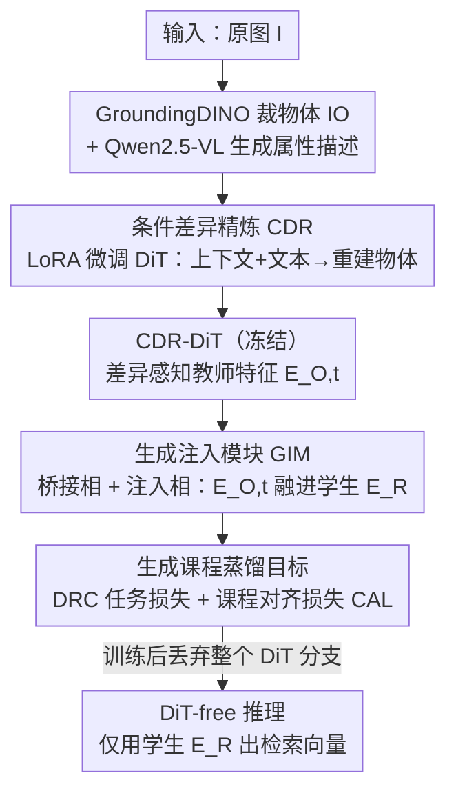

# DiT-Distill: Open-Set Fine-Grained Retrieval via Generative Curriculum Knowledge

**会议**: CVPR 2026  
**论文**: [CVF Open Access](https://openaccess.thecvf.com/content/CVPR2026/html/Jiang_DiT-Distill_Open-Set_Fine-Grained_Retrieval_via_Generative_Curriculum_Knowledge_CVPR_2026_paper.html)  
**代码**: 无  
**领域**: 模型压缩  
**关键词**: 知识蒸馏, 开集细粒度检索, 扩散Transformer, 课程蒸馏, 属性中心表示  

## 一句话总结
把预训练文生图扩散 Transformer（DiT）在去噪过程中编码的"由粗到细的生成课程知识"先精炼、再蒸馏进一个轻量 ViT 检索骨干，让小模型在推理时完全甩掉 DiT，却能在开集细粒度检索（OSFR）上把 R@1 大幅刷高（CUB 上 +9.8%、Stanford Cars 上 +18.6%）。

## 研究背景与动机
**领域现状**：开集细粒度检索（OSFR）要求模型检索训练时**没见过**的子类别（如新的鸟种、新的车型）。主流做法分两类——度量学习（拉近同类、推远异类的 embedding）和定位增强（让编码器去抓最有判别力的局部部件）。

**现有痛点**：这两类方法都在**闭集**假设下训练，训练类别预先定义好。结果是学到的表示与"类别语义"深度耦合：模型记住的是"这是第 37 号鸟种"，而不是"白头、灰翅、黄喙"这些可迁移的属性。一旦遇到训练集里没有的子类别，泛化就崩。

**核心矛盾**：判别式骨干天然倾向于把特征绑死在预定义的类别边界上，而 OSFR 真正需要的是**与标签无关、刻画内在视觉属性**的表示。两者直接冲突。

**切入角度**：作者注意到，文生图 DiT（如 FLUX）在 web 级图文对上训练，能按文本提示合成各种类别的相似实例，**不受特定标签约束**——这说明 DiT 内部存了一套属性中心的知识库。更妙的是，DiT 的去噪过程是**由粗到细**的：早期 timestep 抓全局结构、后期 timestep 精修局部细节，这条"由粗到细的课程"恰好对应人类做细粒度识别时"先看轮廓再抠细节"的过程。作者把这套知识命名为**生成课程知识（Generative Curriculum Knowledge, GCK）**。

**两个拦路问题**：(Q1) 原始 DiT 建模的是**整体外观**（含背景），不强调区分相似物体的细微差异，怎么逼它聚焦细粒度差异？(Q2) DiT 高达 120 亿参数，直接部署不现实，怎么把这套课程知识转移进一个高效判别模型、做到推理时不依赖 DiT？

**核心 idea**：用"先精炼、再蒸馏"两阶段框架——先用条件差异精炼（CDR）把 DiT 的生成知识"磨锋利"，再用生成课程蒸馏（GCD）把这套分层知识灌进轻量骨干，最终丢掉 DiT 实现 **DiT-free 推理**。

## 方法详解

### 整体框架
DiT-Distill 是一个"师生"架构：**教师**是文生图 DiT（FLUX），**学生**是轻量 ViT-B/16 检索骨干。整套流程分两个串行阶段。**阶段 I（CDR）**：用 LoRA 微调 DiT，让它做"给定完整上下文图 + 属性描述，去重建物体中心视图"的任务，逼它把注意力从背景转移到物体差异上，产出一个"差异敏感"的 CDR-DiT。**阶段 II（GCD）**：冻结 CDR-DiT 当固定知识源，通过一个生成注入模块（GIM）把 DiT 多个去噪 timestep 的分层特征桥接进学生骨干，再用课程对齐损失逼学生自身的 embedding $E_R$ 把这些知识"内化"。训练完整个 DiT 分支被丢弃，测试时只用学生骨干 $E_R = E_R(I)$ 出检索向量。

### 关键设计

**1. 条件差异精炼 CDR：逼 DiT 从"看整张图"切到"抠物体差异"**

这一步针对 Q1——原始 DiT 建模整体外观、含背景噪声，对细粒度差异不敏感。作者先用多模态基础模型造训练数据：开放词表检测器 GroundingDINO 用超类名（如 "bird"）从原图 $I$ 里裁出物体中心视图 $I_O$（抑制背景、丢掉低质量裁剪），再喂给 Qwen2.5-VL-7B，用"一句话描述图中 [cls] 的特征、**不要输出类别名**"的指令，生成属性中心文本 $T_{text}$（如"尖而黑的喙、白色腹部、黑色尾羽"）。这样得到一批"上下文图→物体图 + 属性描述"三元组。

随后用 LoRA 微调 DiT，让它在**同时看到完整上下文 latent $X_I$ 和属性文本 $T_{text}$** 的条件下，去重建加噪的物体 latent $X_{O,t} = t\,\mathcal{E}(I_O) + (1-t)\epsilon$，优化目标是直接的重建损失 $L_{CDR} = \mathbb{E}_{t,X_O,\epsilon}\big[\|(X_O-\epsilon) - E_{O,t}\|^2\big]$。这个任务设计得很巧：模型要从噪声里恢复物体、同时又被喂了整张含背景的上下文，它必须学会**隐式地"减掉"上下文特征**、只保留由文本指引的物体属性特征。精炼后 CDR-DiT 的内部表示 $E_{O,t}$ 不再是整体特征，而是真正的差异感知特征，成为下一阶段的高质量"教师知识"。

**2. 生成注入模块 GIM：在生成特征空间和判别特征空间之间架一座桥**

要蒸馏，得先有一条让信息从教师（DiT）流向学生（ViT）的通路——但两者特征空间根本不兼容，这就是 GIM 要解决的问题。它分两相工作。**桥接相（Bridging）**：引入 $k$ 个可学习查询 embedding $E_Q \in \mathbb{R}^{k\times C}$，用一个 $n$ 层交叉注意力的桥接编码器 $E_b$ 去"审问"冻结的 CDR-DiT 特征，$\hat{E}_{Q,t} = E_b(E_Q, E_{O,t})$，把某个 timestep $t$ 的生成属性线索抽出来。**注入相（Infusion）**：把抽出的生成线索 $\hat{E}_{Q,t}$ 和学生骨干的检索 embedding $E_R$ 一起喂进注入编码器 $E_f$，用自注意力融成一个增强表示 $E_{D,t}, \hat{E}'_{Q,t} = E_f(E_R, \hat{E}_{Q,t})$。得到的 $E_{D,t}$ 同时"懂"学生的判别知识和教师的生成知识，是后续算训练目标的载体。消融显示 $k=32$、$n=3$ 是最优配置（$n=0$ 退化成 MLP 直接掉到 85.1%，证明这座桥不能省）。

**3. 生成课程蒸馏目标：按"由粗到细"的 timestep 课程把分层知识灌进学生**

光有桥还不够，得有损失函数规定怎么传知识，且要把 DiT 的"课程"性质用上。作者先选定采样调度的总步数 $T=28$（FLUX 调度器上的高效选择），再挑出一组课程 timestep $P=\{10,16,22,28\}$（$p=1$ 最噪、$p=T$ 最清晰），训练总目标为 $L = L_{TASK} + \alpha L_{ALIGN}$，逼学生同时学会"检索什么"和"怎么想"。

**任务项 $L_{TASK}$**：为防止过拟合闭集标签，用基于代理（proxy）的检索损失——差异表示约束 DRC，让每个课程阶段的增强 embedding $E_{D,t_p}$ 向可学习类别代理 $P_m$ 聚拢：

$$L_{DRC} = -\log\frac{\exp(d(E_{D,t_p}, P_m)/\tau)}{\sum_{m'\in M}\exp(d(E_{D,t_p}, P_{m'})/\tau)}$$

其中 $d(\cdot,\cdot)$ 是余弦相似度、$\tau$ 是温度，$L_{TASK} = \mathbb{E}_{p\in P}[L_{DRC}(E_{D,t_p}, P_m)]$ 在所有课程阶段上取期望。

**对齐项 $L_{ALIGN}$（课程对齐损失 CAL）**：这是把知识"内化"进学生的关键。它强制学生自身、测试时用的表示 $E_R$ 去逼近融合后的增强表示 $E_{D,t_p}$：

$$L_{ALIGN} = L_{CAL} = \mathbb{E}_{p\in P}\big[\|E_R - E_{D,t_p}\|_F^2\big]$$

$\|\cdot\|_F$ 是 Frobenius 范数。关键在于这个 loss 的梯度会**同时回流到学生骨干和 GIM**（两者都参与产生 $E_{D,t_p}$，学生还单独产生 $E_R$），形成"对称拉拽"，逼学生和 GIM 互相对齐。由于课程从粗（早 timestep）到细（晚 timestep）逐级对齐，学生骨干被迫把 DiT 的分层细粒度推理能力吸收进 $E_R$——而这正是测试时唯一会用到的东西，于是 DiT 可以彻底丢弃。

### 损失函数 / 训练策略
两阶段顺序训练。**阶段 I**：LoRA rank=16 微调 FLUX，Adam、学习率 $1\times10^{-4}$、batch=1、训练 30,000 步，只用 $L_{CDR}$。**阶段 II**：冻结 CDR-DiT，用 $L = L_{TASK} + \alpha L_{ALIGN}$ 训练学生骨干 + GIM，Adam + cosine 退火、初始学习率 $1\times10^{-3}$、batch=32，CUB/Cars/Dogs 训 30 epoch、NABirds 训 15 epoch，单张 A800。骨干用 ImageNet-21K 预训练的 ViT-B/16，图像 resize 到 256×256 再中心裁到 224×224。⚠️ 实现细节里课程取 $P=\{10,16,22,28\}$，而消融结论默认用 t2–t4（即 $\{16,22,28\}$，加回最噪的 t1=10 无额外收益），两处略有出入，以原文为准。

## 实验关键数据

### 主实验
四个细粒度数据集上的开集检索对比（Recall@K，%）。最关键的对照是同骨干的 ViT-B/16 baseline，量化框架净增益：

| 数据集 | 指标 | ViT-B/16 baseline | 之前最强(DVA/Hyp-ViT) | DiT-Distill | 提升 |
|--------|------|------|------|------|------|
| CUB-200-2011 | R@1 | 77.4 | 84.9 (DVA) | **87.2** | +9.8 (vs baseline) |
| Stanford Cars | R@1 | 72.8 | 91.1 (FRPT) | **91.4** | +18.6 (vs baseline) |
| Stanford Dogs | R@1 | 82.9 | 87.8 (Hyp-ViT) | **89.4** | +6.5 (vs baseline) |
| NABirds | R@1 | 72.0 | 79.2 (Hyp-ViT) | **83.7** | +11.7 (vs baseline) |

同一个轻量骨干、不改架构，仅靠蒸馏就在四个集上全面登顶，Cars 上 +18.6% 的跳变直接证明 GCK 蒸馏机制的有效性。

### 消融实验
组件逐项拆解（CUB，R@1 + 推理耗时）：

| 配置 | $L_{CDR}$ | GIM | $L_{CAL}$ | R@1 | 耗时 |
|------|------|------|------|------|------|
| ① ViT 学生（baseline） | | | | 77.4% | 2.6ms |
| ② 教师辅助(原始DiT) | | ✓ | | 85.3% | 33.5ms |
| ③ 教师辅助(精炼DiT) | ✓ | ✓ | | 86.5% | 33.5ms |
| ④ DiT-Distill(完整) | ✓ | ✓ | ✓ | **87.2%** | **2.6ms** |

GIM 超参与课程阶段消融（CUB，R@1）：

| 维度 | 取值 → R@1 | 最优 |
|------|-----------|------|
| 查询数 $k$ | 4→86.5 / 16→86.9 / 32→**87.2** / 64→87.0 | k=32 |
| 桥接层数 $n$ | 0→85.1 / 1→86.3 / 3→**87.2** / 6→86.7 | n=3 |
| 课程阶段 | t4→86.7 / t3-t4→87.0 / t2-t4→**87.2** / t1-t4→87.2 | t2–t4 |

### 关键发现
- **$L_{CAL}$ 是"既快又准"的命门**：配置②→③加精炼教师只涨 1.2%，但都卡在 33.5ms（推理还得跑 DiT）；加上 $L_{CAL}$（④）才把推理拉回 2.6ms（快 13×）**且**还涨到 87.2%——蒸馏不是性能换速度，而是两者双赢。
- **"由粗到细"的课程假设被验证**：只蒸馏最清晰的 t4 最差（86.7%），逐步加回更粗、更噪的早期 timestep 才涨到 87.2%，说明早期粗粒度知识对学鲁棒表示至关重要；但纯噪声的 t1 加回去无增益。
- **对检测框噪声极鲁棒**：用人工真值框（Oracle）训 CDR 得 87.4%，用自动检测器（有噪声）训得 87.2%，几乎无差——证明整条 CDR→GCD 管线可以"野外部署"，不依赖人工标注。

## 亮点与洞察
- **把"扩散去噪的时间维度"重解释成"课程"**：早 timestep=粗结构、晚 timestep=细节，这条隐含课程被显式拿来当蒸馏的对齐目标序列，是很漂亮的视角迁移——可推广到任何想从扩散模型蒸馏分层知识的判别任务。
- **CDR 的"减背景"设计很巧**：不直接监督"哪里是物体"，而是让模型在"已知完整上下文"的条件下重建物体，逼它自己学会减去上下文。这种用重建任务隐式诱导差异敏感性的思路，可迁移到任何需要"聚焦前景属性"的表示学习。
- **DiT-free 推理是落地关键**：教师再大都只在训练期存在，部署的就是 2.6ms 的纯 ViT，彻底回避了扩散模型部署不现实的问题——这是蒸馏类工作里最有商业价值的一类。

## 局限与展望
- **重度依赖外部基础模型造数据**：CDR 阶段要 GroundingDINO + Qwen2.5-VL 才能造出"上下文→物体 + 属性描述"三元组，整条管线对这些 off-the-shelf 模型的质量有依赖（虽然作者证明对检测框噪声鲁棒，但描述质量的影响未充分消融）。
- **训练成本高**：阶段 I 要 LoRA 微调 12B 的 FLUX 三万步，虽然推理高效，但训练侧门槛不低，复现需要 A800 级算力。
- **只验证了 OSFR 检索任务**：GCK 蒸馏框架理论上能用于分类/检测等其他判别任务，但论文没做跨任务验证；⚠️ 课程 timestep 的两处取值出入（实现 $\{10,16,22,28\}$ vs 消融默认 t2–t4）也建议复现时以代码为准。

## 相关工作与启发
- **vs FRPT / DVA（定位增强类 SOTA）**：它们适配冻结预训练模型去抓"类别特异"的差异，本质仍把表示绑在预定义子类别上；DiT-Distill 学的是**标签无关**的属性中心知识，所以在类别高度多样的 Cars/NABirds 上领先更明显。
- **vs DIFT / VPD（用扩散 U-Net 当判别特征提取器）**：它们直接拿扩散模型当 backbone，推理仍背着大模型且在高语义任务上弱于判别模型；DiT-Distill 不直接用 DiT 推理，而是**蒸馏后丢弃**，既拿到生成知识又保住判别效率。
- **vs 常规知识蒸馏**：传统 KD 师生在同一判别范式内对齐 logits/特征；本文的"教师"是生成模型、"知识"是去噪过程的分层时间课程，跨生成-判别范式的桥接（GIM）和课程对齐（CAL）是新增的核心机制。

## 评分
- 新颖性: ⭐⭐⭐⭐⭐ 首个把文生图 DiT 的"生成课程知识"蒸馏进判别检索模型，视角和机制都新。
- 实验充分度: ⭐⭐⭐⭐ 四数据集 SOTA + 组件/超参/课程/鲁棒性消融齐全，但缺跨任务与描述质量消融。
- 写作质量: ⭐⭐⭐⭐ Q1/Q2 牵引清晰，两阶段对应明确；课程 timestep 取值两处小出入略影响严谨。
- 价值: ⭐⭐⭐⭐⭐ DiT-free 推理兼顾精度与 2.6ms 速度，落地价值高，思路可迁移到其他判别任务。

<!-- RELATED:START -->

## 相关论文

- [\[CVPR 2026\] DAGE: Dual-Stream Architecture for Efficient and Fine-Grained Geometry Estimation](dage_dual-stream_architecture_for_efficient_and_fine-grained_geometry_estimation.md)
- [\[CVPR 2026\] How to Choose Your Teacher for Fine Grained Image Recognition](how_to_choose_your_teacher_for_fine_grained_image_recognition.md)
- [\[CVPR 2026\] HierAmp: Coarse-to-Fine Autoregressive Amplification for Generative Dataset Distillation](hieramp_coarse-to-fine_autoregressive_amplification_for_generative_dataset_disti.md)
- [\[ACL 2026\] When Reviews Disagree: Fine-Grained Contradiction Analysis in Scientific Peer Reviews](../../ACL2026/model_compression/when_reviews_disagree_fine-grained_contradiction_analysis_in_scientific_peer_rev.md)
- [\[CVPR 2026\] Distilling Balanced Knowledge from a Biased Teacher](distilling_balanced_knowledge_from_a_biased_teacher.md)

<!-- RELATED:END -->
