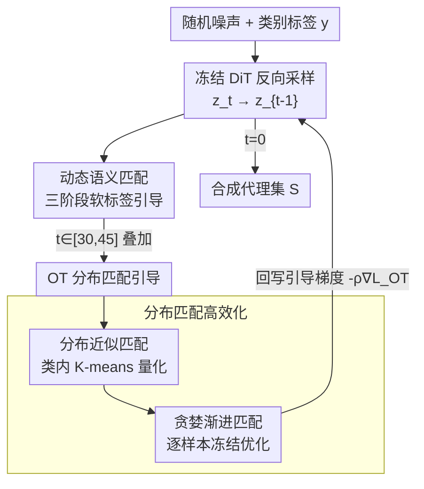

# DMGD: Train-Free Dataset Distillation with Semantic-Distribution Matching in Diffusion Models

**会议**: CVPR 2026  
**论文**: [CVF Open Access](https://openaccess.thecvf.com/content/CVPR2026/html/Wang_DMGD_Train-Free_Dataset_Distillation_with_Semantic-Distribution_Matching_in_Diffusion_Models_CVPR_2026_paper.html)  
**代码**: 无（论文未公布）  
**领域**: 模型压缩 / 数据集蒸馏  
**关键词**: 数据集蒸馏, 扩散模型, 无训练引导, 最优传输, 动态软标签

## 一句话总结
DMGD 把"扩散模型做数据集蒸馏"这件事拆成语义匹配和分布匹配两个解耦目标，全程只在**采样阶段**注入无训练（train-free）引导，用动态软标签提升合成样本多样性、用最优传输（OT）损失对齐目标分布结构，在 ImageNet-Woof/Nette/1K 上比需要额外微调的 SOTA 平均高 2.1%/5.4%/2.4%。

## 研究背景与动机

**领域现状**：数据集蒸馏（dataset distillation）想把一个超大数据集 $T$ 压成一个极小的合成代理集 $S$（$N_T \gg N_S$），使得只在 $S$ 上训练出来的模型在原测试集上的表现接近在全量 $T$ 上训练。近年扩散模型成了主流生成器——直接用预训练扩散模型采样、或在目标数据集上微调扩散模型（如 Minimax）来合成代理集。

**现有痛点**：扩散类方法有两个共性缺陷。其一，**几乎都要额外微调**：Minimax 要在目标数据集上微调扩散模型，IGD 要额外训分类器轨迹，这都把"省算力"的初衷打了折扣。其二，**引导机制粗糙**：D4M、MGD3 靠聚类找到的"模式中心点（mode points）"来控制生成，但聚类中心可能过度强调无效模式（相邻簇心、离群点），破坏分布结构对齐，而且把每个样本孤立生成、忽略样本间关系，导致多样性不足。

**核心矛盾**：用硬标签做条件似然优化能保证语义对齐，但会把扩散输出**挤到条件分布的高密度区**，牺牲多样性；而想对齐分布结构又绕不开昂贵的最优传输计算。语义对齐和分布多样性、对齐精度和计算开销，是两组同时存在的张力。

**本文目标**：在**不做任何额外训练**的前提下，设计采样期的引导目标，让扩散模型既保持语义对齐又对齐目标分布的完整结构。

**切入角度**：作者证明了一条理论（Theorem 1）——在类别语义对齐的前提下，代理集与目标集之间的**最优传输距离是二者风险差的上界**：$|R_T(\theta_T^\*) - R_T(\theta_S^\*)| \le 2L \cdot W(P_T, P_S)$。这条不等式天然把蒸馏目标拆成两块：先保证语义对齐（类别不串），再去压最优传输距离（对齐分布）。

**核心 idea**：把数据集蒸馏解耦成"语义匹配 + 分布匹配"两个独立引导目标，全部作为 train-free guidance 注入扩散采样过程——语义匹配用动态软标签换多样性，分布匹配用 OT 损失对齐结构，并配两个近似策略把 OT 算得起。

## 方法详解

### 整体框架

DMGD（Dual Matching Guided Diffusion）的输入是随机噪声 + 类别标签，输出是每类若干张的合成代理集；它不改动扩散模型权重，只在预训练 DiT 的**反向采样**每一步 $z_t \to z_{t-1}$ 上叠加引导梯度。一次带引导的单步采样写成 $z_{t-1} = D_\theta(z_t, t, y) - \rho_t \nabla_{z_t} E(z_t, c)$，其中 $D_\theta$ 是冻结的扩散去噪器，$E$ 是可微的引导能量。DMGD 往这个框架里塞了两路引导：**语义匹配**贯穿全程，保证生成的图属于正确类别且足够多样；**分布匹配**只在 $t \in [30, 45]$ 这个时间窗口介入，把整个合成集往目标分布结构上拽。

### 关键设计

**1. 动态语义匹配：用时变软标签把"语义对齐"和"多样性"同时拿下**

直接对样本维度做引导会被冗余信息淹没、蒸不出代表性语义；作者的洞察是扩散模型本身就是个零样本分类器，可以借**无分类器引导（CFG）**直接逼近条件对数似然的梯度——由 Lemma 1，$\nabla_{z_t} \log p(y|z_t) \approx \omega\big(\epsilon_\theta(z_t, t, \varnothing) - \epsilon_\theta(z_t, t, y)\big)$，于是不用额外训分类器就能做语义对齐。但硬标签 CFG 会把输出锁死在高密度区、损害多样性。为此作者把静态引导改成**按采样阶段切换的动态引导**，按时间步分三段：随机探索（$t \ge 45$）、动态软标签引导（$t \in [25, 45]$）、语义精修（$t \le 25$）。

动态的核心是一个**标签扩散过程**构造的软标签向量：

$$\tilde f_Y(y) = \sqrt{\sigma_t}\, f_Y(y) + (1 - \sqrt{\sigma_t})\big(\beta_s f_Y(y^\star) + \beta_n n\big)$$

其中 $f_Y$ 是标签编码器，$y^\star$ 是**随机选取的另一类标签**（把样本往类别边界推，生成更有信息量的难样本），$n$ 是各向异性高斯噪声（帮采样跳出局部模式、更充分地探索分布），$\sigma_t$ 是时变调度，$\beta_s/\beta_n$ 是调制系数。Proposition 1 给了理论支撑：把标签从 $y$ 改成 $\hat y_t = y + \delta_t$，单步采样近似多出一个位移项 $z_{t-1} \approx z_{t-1}^{(0)} + \Lambda_t(\delta_t)$，所以"扰动标签"等价于"在采样动力学里注入可控位移"，从而扩大数据模式覆盖、提升多样性。最后用软标签替换进 CFG 公式 $\hat\epsilon_\theta(z_t, t, \tilde y_t) = (1+\omega)\epsilon_\theta(z_t, t, \tilde y_t) - \omega\epsilon_\theta(z_t, t, \varnothing)$ 完成引导。

**2. OT 分布匹配引导：用最优传输损失对齐分布结构，而不是只对齐均值**

传统分布匹配（如 mean matching）只对齐特征均值，忽略样本间关系和分布结构，这正是 MGD3 那类"孤立模式中心"方法的软肋。DMGD 直接以最优传输距离作为对齐目标 $\arg\min_S W(P_T, P_S) = \arg\min_S \min_{\gamma} \sum_{i,j} \gamma_{ij} C_{ij}$，在扩散潜空间 + 超球投影上算欧氏代价 $C_{ij}$，并用 **Sinkhorn 算法**求熵正则化 OT（$\varepsilon=0.1$，5 次迭代），得到引导损失 $L_{OT}(P_S^t, P_T) = W_\varepsilon(P_S^t, P_T) = \langle \gamma^\*, C\rangle$。再用 train-free guidance 技巧把它的梯度塞进采样：$z_{t-1}^i = D_\theta(z_t^i) - \rho_t \nabla_{z_t^i}\sum_j \gamma_{ij}^\* C_{ij}$。直观上，这个梯度推动每个合成样本朝目标分布里"还没被覆盖到的最近区域"移动，从而对齐完整的分布结构而非塌到均值。

**3. 分布近似匹配：用类内 K-means 量化把 OT 算得起，且比均值匹配更紧**

大规模目标数据集上直接算 OT，迭代的时间和内存复杂度都吃不消。作者由 Theorem 1 推出 Corollary 1：只要找一个近似分布 $\tilde P_T$ 满足 $W(\tilde P_T, P_T) \le \epsilon$，风险差就被 $2L(W(P_S, \tilde P_T) + W(P_T, \tilde P_T))$ 控住，于是可以把对全量 $P_T$ 的 OT 换成对小得多的 $\tilde P_T$ 的 OT。怎么求 $\tilde P_T$？这就是**最优量化问题**：找一组支撑点 $\{x_i\}$ 和质量系数 $\{m_i\}$ 使 $W(P_T, \tilde P_T)$ 最小。作者用**类内 K-means**实现——对某一类的子集做聚类，取簇心 $k_i$ 当支撑点、簇大小占比当质量系数：

$$\tilde P_T = \sum_{i=1}^{K} m_i \delta_{k_i}, \quad m_i = \frac{c_i}{\sum_{j} c_j}$$

Proposition 2 还证明了它**严格优于均值匹配**：$W(P_T, \tilde P^{(2)}_T) \le W(P_T, \tilde P^{(1)}_T)$（均值匹配是 $K=1$ 的退化特例）。聚类能挖出簇内细粒度模式当支撑点，配上质量系数后比一个均值点对齐得更准，计算上每类只要 0.03 秒。

**4. 贪婪渐进匹配：逐样本冻结优化，绕开扩散模型多样本联合优化的内存墙**

高 IPC（每类样本数）设置下，端到端联合优化所有合成样本的内存撑不住，而且扩散模型本来就不擅长多样本同时优化。作者用**贪婪渐进**框架：优化第 $i$ 个样本 $z^i$ 时，**冻结所有 $j<i$ 的样本**，把目标改写成对部分已优化分布 $P_{S_t[i]}$ 的对齐 $z_{t-1}^i = D_\theta(z_t^i) - \rho_t \nabla_{z_t^i} L_{OT}(P_{S_t[i]}, P_T)$。这样每步只优化一个样本，引导项会把当前样本往"前面样本还没对齐到的目标区域"推；同时冻结早期样本，避免所有合成样本一起往目标均值塌缩，反而把多样性又提了一截。

### 损失函数 / 训练策略

DMGD **不训练任何模块**，所有"损失"都是采样期的引导能量，通过梯度 $-\rho_t \nabla_{z_t}(\cdot)$ 注入冻结的 DiT。关键超参：CFG 尺度 $1+\omega=4$，软标签系数 $\beta_n=0.06$、$\beta_s=0.01$；分布匹配支撑点数 $K=10$，引导系数 $\rho=0.05$（Woof）/ $0.5$（Nette），只在 $t\in[30,45]$ 应用；Sinkhorn $\varepsilon=0.1$、5 次迭代。全部实验单卡 RTX 4090。

## 实验关键数据

### 主实验

ImageNet 子集（hard-label 协议，ResNet10-AP Top-1 acc）。DMGD 是即插即用引导，挂在 DiT 或 Minimax 上都能涨：

| 数据集 | IPC | DiT 基线 | MGD3 (前SOTA) | DiT+Ours | Minimax+Ours |
|--------|-----|---------|--------------|----------|--------------|
| ImageNet-Woof | 10 | 34.7 | 40.4 | 40.8 | **42.4** |
| ImageNet-Woof | 50 | 49.3 | 56.5 | 60.1 | **60.8** |
| ImageNet-Nette | 10 | 59.1 | 66.4 | 68.4 | **68.7** |
| ImageNet-Nette | 50 | 73.3 | 79.5 | 80.6 | **80.7** |

挂在 DiT 上对基线最高 +10.8%（Woof IPC-50），对 MGD3 在高 IPC 上优势越发明显。ImageNet-1K（soft-label 协议）同样领先：IPC-10 上 ResNet-18 达 46.3%（比 RDED +4.3%、比 Minimax +2.0%），ResNet-101 达 50.6%。

### 消融实验

逐组件消融（ResNet10-AP Top-1，SM=动态语义匹配，DM=OT 分布匹配）：

| SM | DM | Woof IPC-10 | Woof IPC-50 | Nette IPC-10 | Nette IPC-50 |
|----|----|------------|------------|-------------|-------------|
| - | - | 34.7 | 49.3 | 59.1 | 73.3 |
| ✓ | - | 38.9 | 59.3 | 67.1 | 79.7 |
| - | ✓ | 41.6 | 56.8 | 66.8 | 76.7 |
| ✓ | ✓ | 40.8 | **60.1** | 68.4 | **80.6** |

表现/多样性指标（ImageNet-Woof，每类 100 张）：

| 方法 | Coverage↑ | OTDD↓ | Diversity↑ | FID↓ |
|------|-----------|-------|-----------|------|
| DiT | 25.4 | 142.2 | 70.1 | 48.6 |
| Minimax | 28.5 | 88.5 | 72.9 | 49.2 |
| Ours | **30.7** | **66.4** | **74.4** | 48.8 |

### 关键发现

- **两路引导分工互补、且随 IPC 切换主次**：高 IPC 下动态语义匹配（SM）贡献多样性、涨点更猛（Woof IPC-50 单 SM 就到 59.3）；低 IPC 下 OT 分布匹配（DM）更重要（Woof IPC-10 单 DM 到 41.6，比单 SM 高），因为样本少时"对齐关键分布"比"扩多样性"更值。
- ⚠️ 一个值得注意的细节：在 Woof IPC-10 上，完整模型（40.8）反而略低于只开 DM（41.6）——说明两路引导在某些极低 IPC 设置下会轻微互扰，但在绝大多数设置（尤其高 IPC）下联合最优。
- **超参敏感性**：引导系数 $\rho$ 在低 IPC 下取太大会掉点、高 IPC 下较稳；支撑点数 $K$ 太小近似过粗会掉点，太大则 OT 开销上升，$K=10$ 是性能/效率的折中点。
- **几乎零额外开销**：分布近似每类仅 0.03 秒，IPC-50 下每张图 1.65 秒（基线 DiT 1.49 秒），整套 Woof IPC-50 代理集 0.26 小时跑完；而 Minimax 光微调就要近 0.7 小时——train-free 的效率优势很实。

## 亮点与洞察

- **用一条 OT 上界把"蒸馏"理论上拆成两件事**：Theorem 1 证明"语义对齐前提下，OT 距离 = 风险差上界"，这给"语义匹配 + 分布匹配"的解耦提供了硬理由，而不是拍脑袋分模块——这是全文最漂亮的地方。
- **把扩散模型当零样本分类器**：借 CFG 用 $\epsilon_\theta(\cdot,\varnothing)-\epsilon_\theta(\cdot,y)$ 直接拿到条件似然梯度，省掉了别人要额外训的分类器，这个"免训练语义信号"的 trick 可迁移到任何需要类别引导的扩散采样任务。
- **软标签 = 采样动力学里的可控位移**：Proposition 1 把"扰动标签"严格等价成位移算子 $\Lambda_t(\delta_t)$，于是多样性增强从"加噪声碰运气"变成"可设计的方向位移"（往随机类边界推），思路很有启发。
- **贪婪渐进 + 冻结**：用最朴素的"逐个优化、冻结前面"绕开扩散多样本联合优化的内存墙，还顺手防止塌缩到均值——简单但有效。

## 局限与展望

- **方法对采样窗口/阶段切分依赖经验阈值**：三阶段语义引导的 $t\ge45 / [25,45] / \le25$、分布匹配只在 $[30,45]$，这些时间窗都是手调常数，换扩散模型骨干或调度可能要重调。
- **极低 IPC 下两路引导互扰**：如上 Woof IPC-10 完整模型反而略逊单 DM，说明语义和分布引导的权衡还没完全自适应。
- ⚠️ **未公布代码**，且大量证明（Theorem 1、Proposition 1/2、Corollary 1）和实现细节都放在附录，正文给的是结论形式，复现需对照附录。
- 只在 256×256 ImageNet 子集/1K 上验证，更高分辨率或非自然图像（医学、遥感）域上 OT 潜空间代价的有效性待验证。

## 相关工作与启发

- **vs Minimax**：Minimax 在目标数据集上**微调扩散模型**来对齐，DMGD 完全不训练、只在采样期加引导；DMGD 既能独立用（挂 DiT），也能叠在 Minimax 上再涨点（说明二者正交）。
- **vs MGD3 / D4M**：它们用聚类得到的**模式中心点孤立引导**每个样本，忽略分布结构和样本间关系，易过度强调无效模式；DMGD 用 OT 对齐**整个合成分布**而非单点，并用质量系数刻画分布结构，多样性和对齐都更好。
- **vs mean matching（DM[82]）**：均值匹配只对齐一阶矩，是 DMGD 分布近似在 $K=1$ 时的退化特例；Proposition 2 证明类内 K-means 近似严格更紧。

## 评分
- 新颖性: ⭐⭐⭐⭐⭐ 用 OT 上界把数据集蒸馏理论解耦成语义+分布匹配，并做到全程 train-free，思路和理论都新。
- 实验充分度: ⭐⭐⭐⭐ 三个 ImageNet 规模 + 多架构 + 表现/多样性/开销多维评估，但代码未放、关键证明在附录。
- 写作质量: ⭐⭐⭐⭐ 理论与方法衔接清晰，动机推导有力；阶段阈值等工程常数解释偏简。
- 价值: ⭐⭐⭐⭐⭐ train-free + 即插即用 + SOTA，对算力受限的数据集蒸馏很实用。

<!-- RELATED:START -->

## 相关论文

- [\[CVPR 2026\] Mitigating The Distribution Shift of Diffusion-based Dataset Distillation](mitigating_the_distribution_shift_of_diffusion-based_dataset_distillation.md)
- [\[CVPR 2026\] Dataset Distillation by Influence Matching](dataset_distillation_by_influence_matching.md)
- [\[CVPR 2026\] IMS3: Breaking Distributional Aggregation in Diffusion-Based Dataset Distillation](ims3_breaking_distributional_aggregation_in_diffusion-based_dataset_distillation.md)
- [\[CVPR 2026\] Beyond Soft Label: Dataset Distillation via Orthogonal Gradient Matching](beyond_soft_label_dataset_distillation_via_orthogonal_gradient_matching.md)
- [\[CVPR 2026\] Balanced Dataset Distillation via Modeling Multiple Visual Pattern Distribution](balanced_dataset_distillation_via_modeling_multiple_visual_pattern_distribution.md)

<!-- RELATED:END -->
