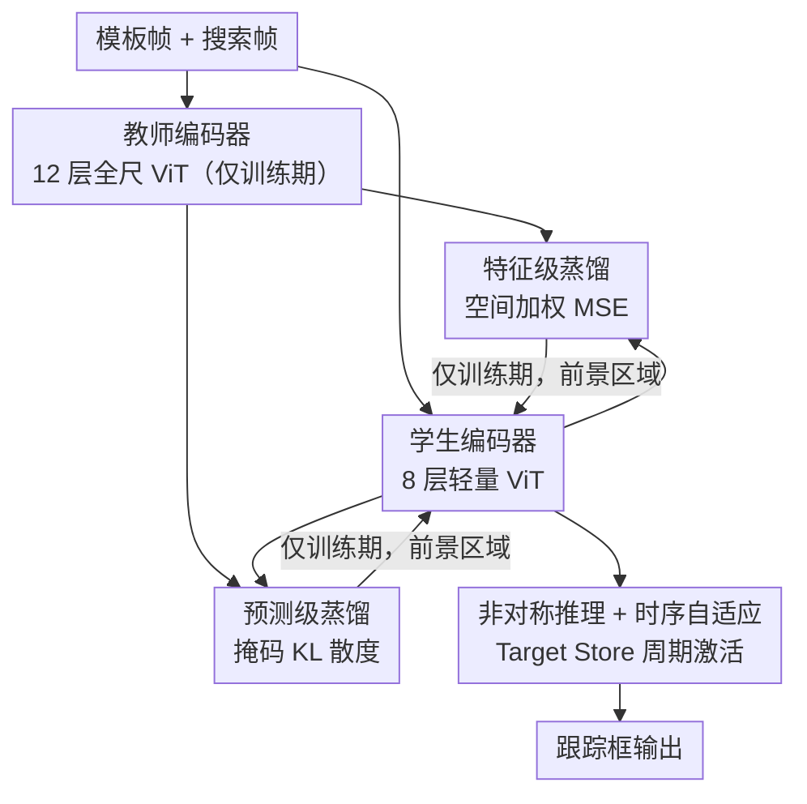

# Dual-branch Distilled Transformer for Efficient Asymmetric UAV Tracking

**会议**: CVPR 2026  
**论文**: [CVF Open Access](https://openaccess.thecvf.com/content/CVPR2026/html/Yang_Dual-branch_Distilled_Transformer_for_Efficient_Asymmetric_UAV_Tracking_CVPR_2026_paper.html)  
**代码**: 未公开  
**领域**: 模型压缩 / 知识蒸馏 / 视觉跟踪  
**关键词**: 无人机跟踪, 知识蒸馏, 轻量Transformer, 非对称推理, 实时跟踪  

## 一句话总结
EATrack 用一个全尺 12 层 ViT 教师，通过「特征级 + 预测级」双分支、且只聚焦目标区域的蒸馏，把目标表征和定位能力灌进一个 8 层轻量学生，配合非对称推理与时序自适应，在五个无人机基准上比上一代 SOTA 平均成功率高 1.2%，同时跑到 241.9 FPS。

## 研究背景与动机
**领域现状**：无人机（UAV）跟踪要在机载算力极其有限、且场景充满快速运动、频繁遮挡、视角变化、小目标的条件下实时跑。主流轻量化路线是把 ViT backbone「砍小」——Aba-ViTrack 丢背景 token、AVTrack 按输入复杂度有条件激活模块、SGLATrack 按层间相似度剪冗余块。

**现有痛点**：这些「结构化简化」确实降了 FLOPs，但简化同时削弱了特征在层间的传播，导致目标表征变弱、在复杂动态场景里定位精度明显掉。作者在 Fig.1 的对照实验里直接量化了这点：非蒸馏学生与教师的逐层特征余弦相似度在被剪掉监督的层上骤降（如某层从 90%+ 掉到 49%），跟踪时目标会逐渐漂走。

**核心矛盾**：轻量化（砍层数）与判别力（强目标表征 + 精确定位）之间存在 trade-off——单纯压结构必然伤表征。

**本文目标**：让一个结构上已经被剪薄的 ViT 学生，在**不增加任何推理开销**的前提下，恢复接近全尺教师的目标表征与定位能力。

**切入角度**：既然简化伤的是「表征质量」，那就用知识蒸馏在训练期把教师的强表征「补」回来；但关键观察是——无人机场景背景杂乱，全局蒸馏（如 ORTrack 的自适应特征蒸馏 AFKD）会把背景噪声一起灌给容量有限的学生，反而分散注意力。所以监督必须**只聚焦目标区域**。

**核心 idea**：用「目标感知的双分支蒸馏」——空间加权特征蒸馏补表征、掩码预测蒸馏补定位，两路互补且都只在前景区域施加监督，全部仅训练期生效、推理零成本。

## 方法详解

### 整体框架
EATrack 把训练和推理拆成两套结构，体现在它名字里的「非对称（asymmetric）」：**训练期**，一个 12 层全尺 ViT 教师与一个 8 层轻量学生并排前向，教师通过两条蒸馏支路（特征级、预测级）把知识灌给学生，教师只参与训练、训完即弃；**推理期**，只剩学生独立工作，且模板分支与搜索分支被拆成 Stage 1（独立编码）和 Stage 2（联合建模），再叠加一个超低成本的时序自适应模块（Target Store + 周期激活）。两条蒸馏支路在推理时完全消失，所以「补表征」不带来任何额外计算。

教师与学生共享同样的 patch embedding 与 tokenization，只是层数不同（$L=12$ vs $L'=8$），这种逐层对应关系让二者特征空间可直接对齐，是蒸馏能施加的前提。

### 关键设计

**1. 特征级蒸馏：用空间加权 MSE 只把教师的「前景表征」灌给学生**

针对「轻量学生在杂乱背景下区分不出目标」这个痛点，作者不做全图特征对齐，而是对每个训练样本按 ground-truth 框算一张空间权重掩码 $M_i$——目标区域被激活、背景被抑制，然后把这张掩码同时乘到教师和学生特征上，逼蒸馏损失只盯前景 token：

$$L_{feat} = \frac{1}{KB}\sum_{k=1}^{K}\sum_{i=1}^{B}\left\| M_i \cdot x_i^k - M_i \cdot y_i^k \right\|_2^2$$

其中 $x_i$、$y_i$ 分别是学生、教师的特征，$K$ 是参与蒸馏的层数，$B$ 是 batch size。这样做的好处是把学生有限的表征容量集中在「真正重要的目标区域」，不被背景噪声稀释——这正是它区别于 ORTrack 全局 AFKD 的地方：后者按样本难度调蒸馏强度但忽略了空间先验，前景背景一视同仁。值得注意的是，由于教师与剪薄学生的结构非对称，特征级蒸馏只施加在 Stage 2（模板与搜索联合建模那一段），以保证结构兼容、对齐有效。

**2. 预测级蒸馏：用掩码 KL 散度对齐目标区域的置信分布**

特征级蒸馏补的是「表征保真度」，但精确跟踪还需要「定位能力」。作者再加一条预测级支路：把学生和教师的预测置信图经温度缩放 softmax 转成概率分布，然后用 ground-truth 框导出的二值掩码 $m_{i,j}\in\{0,1\}$，**只在目标区域内**算 KL 散度：

$$L_{pred} = \frac{1}{B}\sum_{i=1}^{B}\frac{\sum_j m_{i,j}\cdot \mathrm{KL}(p_{s,i,j}\,\|\,p_{t,i,j})}{\sum_j m_{i,j}}$$

其中 $p_{s,i,j}$、$p_{t,i,j}$ 是学生、教师在位置 $j$ 的预测概率。它逼学生在「真正要紧的区域」复刻教师的定位行为（置信分布与边界一致性），而不是盲目模仿教师全图输出。两条支路是互补的：特征级强化「表征基础」、预测级精修「空间精度」，联合优化让被剪薄的学生既保住结构紧凑，又拿到接近教师的判别力和定位力。

**3. 非对称推理 + 时序自适应：Target Store 周期激活，用极低成本捕捉目标随时间的变化**

蒸馏只解决了「静态表征强不强」，但无人机场景里目标外观随时间剧烈变化。推理期作者引入非对称设计：模板帧和搜索帧先各自过 Stage 1 特征提取，再拼接送进 Stage 2 联合建模、过预测头出结果。关键的省算技巧是——**Stage 1 的模板编码只在初始化和周期更新时跑**，平时不动。时序自适应靠一个 Target Store：当预测框置信度超过阈值时，把对应目标特征存进去；每隔固定间隔，从 Store 里采样代表性 embedding 与原始模板表征融合，通过「周期激活」刷新模型对目标的理解。这套机制让结构剪枝过的 transformer 既能跟上目标动态，又把时序建模的开销压到几乎可忽略——消融显示它在动态/杂乱场景（DTB70、VisDrone）增益最大，而在相对静态的 UAV123 上不掉点。

### 损失函数 / 训练策略
总损失把标准跟踪目标和两个蒸馏项拼在一起：分类用 focal loss，框回归用 L1 + GIoU，再加上两个蒸馏项：

$$L = L_{cls} + \lambda_1 L_1 + \lambda_2 L_{GIoU} + \lambda_3 L_{feat} + \lambda_4 L_{pred}$$

系数取 $\lambda_1=5,\ \lambda_2=2,\ \lambda_3=1,\ \lambda_4=1$。训练用 GOT-10k / LaSOT / COCO / TrackingNet 组合，每个样本是「两模板帧 + 一搜索帧」三元组，4×A800、总 batch 128、AdamW、300 epoch（240 后学习率降 10 倍）。教师采用 OSTrack 实现的 distilled DeiT-tiny，离线训一次即可，不参与在线推理。

## 实验关键数据

### 主实验
五个无人机基准上，EATrack-DeiT 在 precision 和 success 两个指标上全部拿第一（节选平均列与代表数据集）：

| 方法 | 来源 | UAV123 Succ. | UAV123@10fps Succ. | VisDrone Succ. | 平均 Prec. | 平均 Succ. |
|------|------|------|------|------|------|------|
| AVTrack-DeiT | ICML 24 | 66.8 | 65.8 | 65.3 | 84.1 | 64.4 |
| ORTrack-D-DeiT | CVPR 25 | 66.1 | 63.7 | 63.9 | 83.7 | 63.7 |
| SGLATrack-DeiT | CVPR 25 | 66.9 | 65.5 | 61.3 | 82.8 | 63.7 |
| EATrack-ViT | Ours | 66.9 | 66.7 | 65.0 | 85.1 | 64.9 |
| **EATrack-DeiT** | Ours | **68.1** | **67.4** | **65.6** | **85.5** | **65.6** |

平均成功率比上一代 SOTA 高约 1.2%；UAV123 上比 Aba-ViTrack 的 precision 高出 2.6%。速度/复杂度对比（同硬件 A100）：

| 方法 | UAV123 Succ. | GPU FPS | CPU FPS | TX2 FPS | Params(M) | FLOPs(G) |
|------|------|------|------|------|------|------|
| ORTrack | 66.4 | 211.8 | 80.3 | 26.7 | 7.97 | 2.39 |
| SGLATrack | 66.9 | 222.8 | 87.6 | 29.2 | 5.81 | 1.68 |
| **EATrack** | **68.1** | **241.9** | **97.4** | **33.6** | 6.20 | 1.87 |

EATrack 在精度领先的同时速度最快，且在嵌入式 Jetson TX2 上无需 TensorRT 即可跑 33.6 FPS。

### 消融实验

蒸馏支路（UAV123，Tab.3）：

| 配置 | 特征级 | 预测级 | Prec. | Succ. |
|------|------|------|------|------|
| #1 无蒸馏 | ✗ | ✗ | 86.9 | 66.1 |
| #2 | ✓ | ✗ | 87.6 (+0.7) | 67.0 (+0.9) |
| #3 完整 | ✓ | ✓ | 89.0 (+1.4) | 68.1 (+1.1) |

时序线索（Tab.5，按数据集看 Succ.）：

| 配置 | DTB70 | UAVDT | VisDrone | UAV123 |
|------|------|------|------|------|
| 无时序 | 63.3 | 56.6 | 59.8 | 68.1 |
| 有时序 | 66.5 (+3.2) | 60.2 (+3.6) | 65.6 (+5.8) | 68.1 (+0.0) |

层深 trade-off（Tab.4）：Stage1/Stage2 层数 $L_1=6,L_2=2$（配置 #3）被选为最终设置——增大 $L_1$ 收益递减但算力线性涨；$L_2$ 加一层（#4→#3）虽涨精度但 Stage 2 算力更重，掉速更明显，故 #3 在精度/效率间最平衡。

### 关键发现
- **预测级蒸馏是关键增量**：单加特征级只 +0.7/+0.9，再叠预测级一举到 +1.4/+1.1，说明「补定位」比「补表征」对最终成绩更直接，两路确实互补而非冗余。
- **时序线索专治动态场景**：在 VisDrone（密集遮挡）上 +5.8%、DTB70（快运动）+3.2%，而静态的 UAV123 完全不掉点（68.1→68.1），证明这个模块是「无害的增益」——只在需要时起作用。
- **教师并非天花板**：教师平均 Succ. 63.0，反而低于学生 EATrack 的部分结果，作者归因为教师缺时序自适应；这说明蒸馏 + 时序的组合能让学生在动态场景超过静态教师。
- **属性级**：在低分辨率场景上比次优 SGLATrack 高 2.5%，快运动/相机运动/光照变化下也明显领先。

## 亮点与洞察
- **「只蒸馏前景」是核心洞察**：把空间掩码同时乘进教师/学生特征和预测，强制监督集中在目标区域——这一招直击无人机场景背景杂乱、轻量学生容量有限的痛点，比 ORTrack 的全局自适应蒸馏更对症。
- **训练补、推理省的非对称设计很优雅**：双分支蒸馏全部仅训练期生效，推理时教师和蒸馏分支彻底消失，所以「涨精度」和「保速度」不矛盾——这是蒸馏类方法里最干净的解耦方式，可直接迁移到其他「轻量学生 + 全尺教师」的实时任务。
- **Target Store 周期激活是低成本时序方案**：靠置信度阈值筛可靠特征入库、固定间隔融合，Stage 1 模板编码平时不跑，几乎零额外开销就拿到时序鲁棒性，思路可复用到其他需要在线模板更新的跟踪器。

## 局限与展望
- **依赖一个训好的全尺教师**：方法本质是「教师→学生」蒸馏，需要先离线训一个强教师，教师本身的质量上限会影响学生；论文也承认 feature-level 蒸馏因结构非对称只能施加在 Stage 2。
- **掩码全靠 ground-truth 框**：空间权重掩码 $M_i$ 和预测掩码 $m_{i,j}$ 都由 GT 框导出，训练期可行，但这意味着监督质量与标注框精度强绑定，框不准时前景定义会偏。
- **时序模块的阈值/间隔是固定超参**：Target Store 的置信阈值和周期激活间隔似乎是手工设定，论文未给敏感性分析，自适应地调这两个参数可能进一步提升动态场景表现。
- **代码未公开**：截至笔记撰写未见开源，复现细节（如掩码具体构造、温度系数）需以原文为准。⚠️

## 相关工作与启发
- **vs ORTrack（CVPR 25）**：ORTrack 用自适应特征蒸馏 AFKD，按样本难度调蒸馏强度，但只在全局层面操作、忽略空间先验；本文用空间加权掩码把监督锁进前景区域，且额外加了预测级蒸馏补定位，双分支互补，在 UAV123 上 Succ. 68.1 vs 66.4。
- **vs SGLATrack / AVTrack / Aba-ViTrack（结构剪枝路线）**：这些方法靠丢 token / 条件激活 / 剪冗余层来提速，但简化直接削弱目标表征；本文不改「砍结构」这件事，而是用蒸馏在训练期把表征补回来，于是同样轻量却精度更高、速度反而最快（241.9 FPS）。
- **vs 经典 KD（Hinton 软标签 / 注意力对齐 / 关系蒸馏）**：通用 KD 多为分类/检测设计的全图对齐；本文把 KD 专门化到跟踪——特征级用空间加权 MSE、预测级用掩码 KL，都围绕「目标区域」这个跟踪特有的先验展开。

## 评分
- 新颖性: ⭐⭐⭐⭐ 双分支 + 目标感知掩码蒸馏的组合在 UAV 跟踪里是有针对性的创新，但单个组件（特征/预测蒸馏、Target Store）多有前身。
- 实验充分度: ⭐⭐⭐⭐⭐ 五个基准 + 速度/复杂度 + 多硬件（GPU/CPU/TX2）+ 蒸馏/层深/时序/教师四组消融 + 属性级与可视化，相当扎实。
- 写作质量: ⭐⭐⭐⭐ 动机用对照实验讲清、公式与消融对得上；个别符号（如掩码构造细节）略简。
- 价值: ⭐⭐⭐⭐ 训练补、推理零开销的思路实用，TX2 实测 33.6 FPS 有真实部署意义。

<!-- RELATED:START -->

## 相关论文

- [\[CVPR 2026\] DAGE: Dual-Stream Architecture for Efficient and Fine-Grained Geometry Estimation](dage_dual-stream_architecture_for_efficient_and_fine-grained_geometry_estimation.md)
- [\[CVPR 2026\] Memory-Efficient Transfer Learning with Fading Side Networks via Masked Dual Path Distillation](memory_efficient_transfer_learning_with_fading_side_networks.md)
- [\[CVPR 2026\] Adaptive Depth Lightweight RGB-T Tracking with Holistic Token Routing](adaptive_depth_lightweight_rgb-t_tracking_with_holistic_token_routing.md)
- [\[CVPR 2026\] LoPrune: Efficient Data Pruning for LoRA-Based Fine-Tuning of Vision Transformer](loprune_efficient_data_pruning_for_lora-based_fine-tuning_of_vision_transformer.md)
- [\[CVPR 2026\] ThinkingViT: Matryoshka Thinking Vision Transformer for Elastic Inference](thinkingvit_matryoshka_thinking_vision_transformer_for_elastic_inference.md)

<!-- RELATED:END -->
