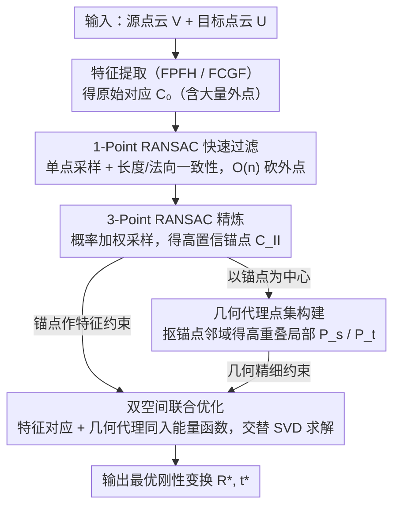

# DualReg: Dual-Space Filtering and Reinforcement for Rigid Registration

**会议**: CVPR 2026  
**arXiv**: [2508.17034](https://arxiv.org/abs/2508.17034)  
**代码**: [https://ustc3dv.github.io/DualReg/](https://ustc3dv.github.io/DualReg/) (有项目页)  
**领域**: 模型压缩  
**关键词**: 刚性配准, 双空间优化, RANSAC, 点云对应, 几何代理

## 一句话总结

DualReg提出双空间配准范式，先用轻量级1-point RANSAC + 3-point RANSAC渐进过滤特征空间对应点，再基于过滤后的锚点构建几何代理点集进行双空间联合优化，在3DMatch上实现SOTA精度的同时比MAC快32倍。

## 研究背景与动机

刚性配准旨在估计源点云到目标点云的刚性变换（旋转+平移），广泛应用于SLAM、机器人、三维重建和AR/VR。由于点云通常只有部分重叠且包含噪声和外点，鲁棒精确配准一直是难题。

**两类对应建立方法各有短板**：
- **特征空间对应**（FPFH、FCGF等）：基于描述符相似度全局匹配，能处理大变换差异，但对应精度有限，无法实现精细对齐
- **局部几何空间对应**（ICP及其变体）：基于欧氏空间最近点搜索，能实现高精度局部对齐，但严重依赖初始变换，大变换差异下容易陷入局部最优

**直觉上的组合方案**——先用特征匹配获得粗变换、再用ICP精炼——在低重叠场景下也不理想，因为ICP基于空间邻近性搜索会引入大量错误最近点。

**现有外点去除方法的代价问题**：MAC通过最大团搜索大幅提升配准精度，但计算量巨大。TCF提出1-point RANSAC加速但精度下降。需要一种既快又准的方案。

**核心idea**：不是先粗配准后精炼的串行模式，而是构建一个**双空间联合优化框架**——将过滤后的特征空间对应和动态建立的局部几何空间对应**同时纳入同一个目标函数**，让两类信息互补协同。

## 方法详解

### 整体框架

DualReg 要解决的核心矛盾是：特征空间对应能扛大变换但精度不够，几何空间对应精度高却依赖好的初值，传统的"先粗配准、后 ICP 精炼"串行管线在低重叠下两头不讨好。它的做法是把两类对应塞进同一个目标函数里联合优化，让全局约束和局部精度互相补位。整条流水线分两段走：先对特征提取（FPFH/FCGF）得到的原始对应 $\mathcal{C}_0$ 做两级 RANSAC 过滤——1-point RANSAC 快速砍掉大量外点、3-point RANSAC 再精炼，得到一批高置信锚点 $\mathcal{C}_{II}$；然后以这些锚点为中心从原始点云里抠出局部邻域当"几何代理点集"，最后把特征对应和几何代理一起放进双空间能量函数中交替求解，输出最优刚性变换 $(R^*, t^*)$。

### 关键设计

**1. 轻量级 1-Point RANSAC 快速过滤：用单点采样把外点剔除的复杂度从 $\mathcal{O}(n^3)$ 压到 $\mathcal{O}(n)$**

外点去除是配准的瓶颈——MAC 那类最大团搜索精度高但慢得离谱，原始对应里又混了大量错配。DualReg 的第一刀只拿**单个对应点**当采样单元（而不是经典 RANSAC 的 3 点），采样复杂度直接从 $\mathcal{O}(n^3)$ 降到 $\mathcal{O}(n)$。对每个采样对应 $\mathbf{c}_j$，它定义一个一致性集合，把和 $\mathbf{c}_j$ 在几何上兼容的对应都收进来：

$$\mathcal{I}(\mathbf{c}_j) = \{\mathbf{c}_i \in \mathcal{C}_0 \mid D_L(\mathbf{c}_i, \mathbf{c}_j) < \tau \;\text{and}\; D_N(\mathbf{c}_i, \mathbf{c}_j) < \nu \}$$

其中 $D_L$ 是长度一致性（两对对应点之间距离的差异），$D_N$ 是法向一致性（切向距离差异）。迭代过程中为每个对应维护一个累积置信度分数，最后选总分最高的一致集作为内点。光有长度和法向约束还不够：当源点和目标点关于某个平面对称时，一致性约束会被满足，但 3D 空间里其实不存在对应的刚性变换，所以还要用 SVD 检测出这种反射变换并过滤掉。相比同样用 1-point RANSAC 的 TCF，本文在一致集定义（多了法向一致性）、子集选择（累积置信度评分而非简单计数）和对称检测三处都做了加强，因此既快又不掉精度。

**2. 概率加权 3-Point RANSAC 精炼：用更严格的三点变换一致性把残留外点清干净**

1-point RANSAC 只看长度和法向约束，仍可能放过一些"局部兼容但全局不一致"的外点。第二级换成 3-point RANSAC，用三点能唯一确定一个刚性变换的特性做更严格的一致性检验。它不再随机采样，而是给每个对应估一个内点概率、用动态贝叶斯网络逐步更新这个概率，再按概率加权去采样——把采样预算集中到更可能是内点的对应上，相比经典 RANSAC 大幅减少了无效迭代。两级过滤下来，留下的 $\mathcal{C}_{II}$ 是一批可信度很高的锚点。

**3. 几何代理点集构建：把锚点邻域抠出来当高重叠的局部"代理"，绕开 ICP 的致命短板**

ICP 在低重叠场景下会失效，根源是它在两片整体重叠率很低的点云上做最近点搜索，必然搜出一堆错误最近点。DualReg 换了个思路：不在整片点云上做几何匹配，而是只在锚点附近做。对每个锚点对应 $\mathbf{c}_j = (\mathbf{v}_j, \mathbf{u}_j) \in \mathcal{C}_{II}$，从源点云里取半径 $\beta$ 内的邻域点构成代理点集：

$$\mathcal{P}^s_{\mathbf{c}_j} = \{\mathbf{v}_i \in \mathcal{V} \mid \|\mathbf{v}_i - \mathbf{v}_j\|_2 < \beta\}$$

由于锚点本身已是可信对应，它周围这块局部区域在源、目标两片点云里**重叠率显著更高**，相当于把"整体低重叠"问题换成了一堆"局部高重叠"的小问题，几何对齐这才有了可靠的最近点可用。这一步是连接特征匹配和几何精细化的桥梁。

**4. 双空间联合优化：把特征对应和几何代理放进同一个能量函数，让全局约束和局部精度同时生效**

前面三步的产物——可信特征对应 $\mathcal{C}_{II}$ 和高重叠的几何代理 $\mathcal{P}^s$——不是串行使用，而是一起写进一个联合能量：

$$E(\mathbf{R}, \mathbf{t}) = \frac{\lambda}{|\mathcal{C}_{II}|} \sum_{\mathbf{c}_j \in \mathcal{C}_{II}} w_j \|\mathbf{R}\mathbf{v}_j + \mathbf{t} - \mathbf{u}_j\|^2 + \frac{1}{|\mathcal{P}^s|} \sum_{\tilde{\mathbf{v}}_i \in \mathcal{P}^s} \tilde{w}_i \|\mathbf{R}\tilde{\mathbf{v}}_i + \mathbf{t} - \tilde{\mathbf{u}}_{\rho_i}\|^2$$

第一项是特征空间对应的对齐误差，提供全局约束、把解拉住不让它掉进局部最优；第二项是几何代理点集上的最近点对齐误差，负责精细对齐。两项里的权重 $w_j, \tilde{w}_i$ 都用高斯函数 $\exp(-\|e\|^2 / 2\sigma^2)$ 做鲁棒化，误差大的对应自动降权。正因为两类信息在同一目标函数里被同时优化，特征对应的"扛大变换"和几何对应的"高精度"才得以互补，而不是粗-精串行那样前一步的误差被后一步放大。消融里去掉这一联合优化后 KITTI 的 RMSE 从 12.26cm 飙到 28.22cm，正说明它是精度的命门。

### 损失函数 / 训练策略

本文为非学习方法，采用交替优化求解器：
1. 固定变换，用最近点搜索更新几何对应 $\{\rho_i\}$
2. 固定对应和变换，用高斯权重函数计算鲁棒权重
3. 固定对应和权重，通过SVD闭式求解最优刚性变换
- 收敛条件：$\|\mathbf{T}^{(k)} - \mathbf{T}^{(k-1)}\|_F < 0.001$ 或最多200次迭代

## 实验关键数据

### 主实验

| 数据集 | 指标 | DualReg (FPFH) | MAC (FPFH) | MAC++ (FPFH) | 提升 |
|--------|------|----------------|------------|--------------|------|
| 3DMatch | RR ↑ | 84.41% | 83.92% | 83.73% | +0.5% |
| 3DMatch | RMSE ↓ | 4.55cm | 4.94cm | 4.78cm | 精度最优 |
| 3DMatch | RE ↓ | 1.75° | 2.11° | 2.11° | -17% |
| 3DMatch | 时间 ↓ | 0.14s | 2.10s | 4.28s | **15-30x加速** |
| 3DLoMatch | RMSE ↓ | 7.98cm | 9.18cm | 9.54cm | -13% |
| KITTI | RR ↑ | 98.20% | 97.48% | 98.02% | SOTA |
| KITTI | RMSE ↓ | 12.26cm | 15.57cm | 25.25cm | -21% |

### 消融实验

| 配置 | 3DLoMatch RR/RMSE/Time | KITTI RR/RMSE/Time | 说明 |
|------|------------------------|---------------------|------|
| 完整方法 | 41.7/7.98/0.11 | 98.2/12.26/0.12 | 最优平衡 |
| w/o 快速过滤 | 29.1/7.31/0.68 | 84.0/12.81/0.78 | RR大幅下降，时间增6x |
| w/o 精炼 | 41.3/8.76/0.11 | 97.7/13.51/0.12 | 精度下降但速度保持 |
| w/o 双空间优化 | 32.1/12.04/0.07 | 98.2/28.22/0.12 | RMSE剧增，精度严重退化 |
| w/o 锚点 | 41.6/7.99/0.13 | 98.0/19.16/0.13 | 缺少特征约束精度下降 |
| w/o 几何代理 | 37.0/9.51/0.11 | 98.2/16.36/0.13 | 缺少几何精细化 |

对应过滤模块消融（过滤后内点率）：

| 变体 | 3DLoMatch FPFH | KITTI FPFH | 说明 |
|------|-----------------|------------|------|
| 仅 $D_L$ | 33.00% | 45.65% | 基础长度一致性 |
| + $D_N$ | 33.55% | 46.17% | 法向一致性贡献有限但稳定 |
| + 对称检测 | 36.00% | 46.13% | 消除对称歧义 |
| + 加权采样(ours) | 37.22% | 85.52% | KITTI上提升显著 |

### 关键发现

- **双空间协同是精度关键**：去除双空间优化后RMSE从12.26cm退化到28.22cm（KITTI），说明仅靠过滤后的特征对应无法达到高精度
- **速度-精度最优权衡**：DualReg在CPU上0.14s完成3DMatch配准，比MAC快15倍，比MAC++快30倍，同时精度更优
- **低重叠场景表现稳健**：3DLoMatch（10%-30%重叠）上RMSE 7.98cm，优于所有比较方法

## 亮点与洞察

1. **问题建模精准**：识别到特征空间和几何空间对应的互补性，将其形式化为统一优化目标，而非简单的粗-精串行管线
2. **1-point RANSAC的巧妙改进**：引入法向一致性、累积置信度评分和对称检测，使简化的采样策略在速度极快的同时保持高质量过滤
3. **几何代理点集的设计**：锚点邻域提取是连接特征匹配和几何对齐的桥梁，简洁有效地解决了ICP在低重叠下的核心问题
4. **纯CPU实现达到GPU方法水平**：C++实现的DualReg在CPU上的速度和精度可与需要GPU的学习方法竞争

## 局限与展望

- 对特征描述符质量有一定依赖——如果初始描述符极差，过滤后可能保留不到足够内点
- 几何代理的邻域半径 $\beta$ 需要根据点云密度调整
- 当前仅支持刚性配准，扩展到非刚性场景需要额外考虑
- 未与最新的基于Transformer的端到端配准方法（如GeoTransformer）做联合使用的对比

## 相关工作与启发

- **MAC** [54]：通过兼容性图的最大团搜索提升配准精度，但计算成本高；DualReg在保持精度的同时显著降低计算量
- **TCF** [38]：首次在配准中引入1-point RANSAC，但配准质量下降；DualReg通过改进的一致集定义和双空间优化弥补了精度损失
- **FRICP** [51]：使用Welsch函数的鲁棒ICP，但仍受限于初始变换质量；DualReg的几何代理机制提供了更好的初始条件
- 启发：特征空间与几何空间的双空间联合优化思路可推广到其他需要全局-局部协同的任务，如场景流估计、非刚性配准

## 评分

- 新颖性: ⭐⭐⭐⭐ 双空间联合优化框架和改进的1-point RANSAC是有价值的贡献，但各组件相对独立
- 实验充分度: ⭐⭐⭐⭐⭐ 覆盖室内/室外数据集、多种特征描述符、详尽的消融实验和运行时间对比
- 写作质量: ⭐⭐⭐⭐ 方法描述清晰，实验设置公平详尽
- 价值: ⭐⭐⭐⭐ 速度和精度兼顾，对实际SLAM和三维重建系统有直接价值

<!-- RELATED:START -->

## 相关论文

- [\[ACL 2026\] CBRS: Cognitive Blood Request System with Bilingual Dataset and Dual-Layer Filtering](../../ACL2026/model_compression/cbrs_cognitive_blood_request_system_with_bilingual_dataset_and_dual-layer_filter.md)
- [\[ICLR 2026\] Null-Space Filtering for Data-Free Continual Model Merging: Preserving Stability, Promoting Plasticity](../../ICLR2026/model_compression/null-space_filtering_for_data-free_continual_model_merging_preserving_stability_.md)
- [\[CVPR 2026\] Dual-branch Distilled Transformer for Efficient Asymmetric UAV Tracking](dual-branch_distilled_transformer_for_efficient_asymmetric_uav_tracking.md)
- [\[CVPR 2026\] DAGE: Dual-Stream Architecture for Efficient and Fine-Grained Geometry Estimation](dage_dual-stream_architecture_for_efficient_and_fine-grained_geometry_estimation.md)
- [\[CVPR 2026\] Memory-Efficient Transfer Learning with Fading Side Networks via Masked Dual Path Distillation](memory_efficient_transfer_learning_with_fading_side_networks.md)

<!-- RELATED:END -->
