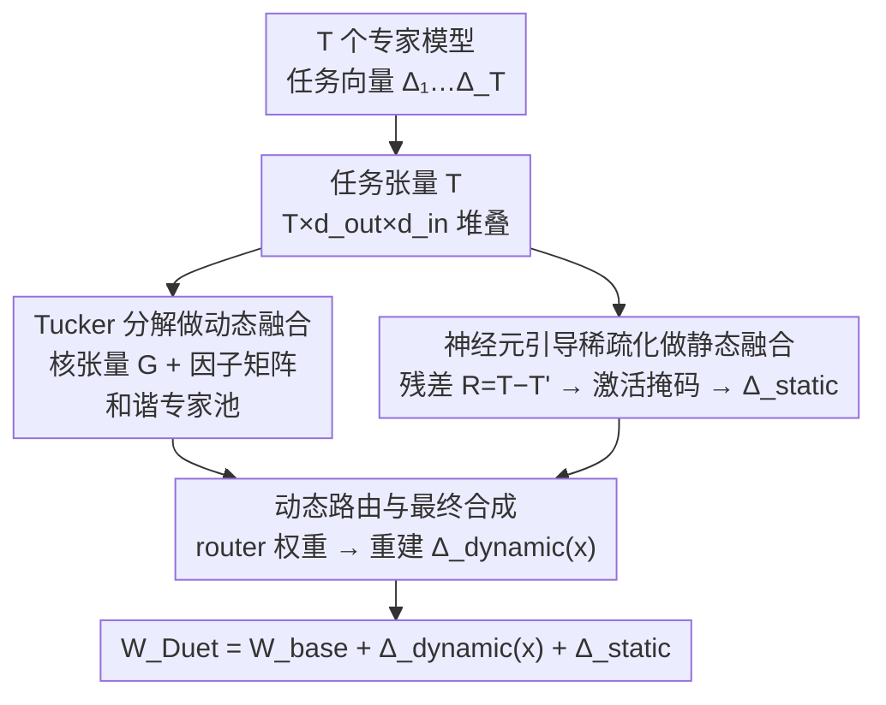

# DuetMerging: Synergizing Dynamic and Static Strategies for Mitigating Task Interference in Model Merging

**会议**: CVPR 2026  
**论文**: [CVF Open Access](https://openaccess.thecvf.com/content/CVPR2026/html/Li_DuetMerging_Synergizing_Dynamic_and_Static_Strategies_for_Mitigating_Task_Interference_CVPR_2026_paper.html)  
**代码**: 无  
**领域**: 模型压缩 / 模型融合  
**关键词**: 模型融合, 任务干扰, Tucker 分解, 神经元稀疏化, MoE 路由

## 一句话总结
DuetMerging 把多个专家模型的任务向量堆成 3D 张量做 Tucker 分解，得到一个"共享核张量"驱动的动态专家池来抑制任务冲突，再用神经元激活引导的稀疏化从分解残差里"外科手术式"抢救任务专属知识做静态修正，两路一动一静合奏，在 8 个图像分类任务的模型融合上刷到 SOTA（ViT-B/32 归一化精度 99.2%）。

## 研究背景与动机
**领域现状**：Model merging（模型融合）想把多个各自微调好的专家模型，在不碰原始训练数据、不重新训练的前提下合并成一个多任务模型。主流做法围绕"任务向量" $\tau_t = \Theta_t - \Theta_0$（微调权重减预训练权重）展开：早期的 Task Arithmetic 直接把任务向量加起来，TIES-Merging、DARE 加上剪枝和符号冲突消解，更近期的结构化方法（TSV-M、Iso-CTS、WUDI）用 SVD / 子空间投影在代数结构上解耦共享与任务专属信息，再后来的动态方法（WEMoE、Twin-Merging）借鉴 MoE，用一个轻量 router 在推理时按输入动态加权组合各专家。

**现有痛点**：核心难题始终是 **task interference（任务干扰）**——不同任务的参数更新互相冲突，合并后性能远不如单独的专家。两类方法各有死穴：① 静态结构化方法最终塌缩成一个固定参数的模型，缺乏对不同任务数据的输入自适应能力；② 动态 MoE 类方法虽然能自适应，但有个共同的设计硬伤——**每个专家都是孤立构造的**（把单个任务向量当专家，或对单个任务矩阵独立做 SVD）。

**核心矛盾**：孤立构造专家，意味着用同一套代数工具同时处理"任务间共享能力"和"任务间冲突参数"，根本没去显式区分共性与差异。结果是正向知识迁移的潜力被浪费，负向干扰仍隐式地编码在各个孤立专家模块里。

**本文目标**：既要保留动态路由的输入自适应，又要在"构造专家池"这一步就显式建模跨任务的高阶共享结构，同时不丢掉低秩近似必然损失掉的任务专属信息。

**切入角度**：作者把视角从"2D 任务矩阵 + SVD"抬高到"3D 任务张量 + Tucker 分解"——把所有任务矩阵沿任务维堆叠，用张量分解抽出一个**共享核张量**，让所有专家都从这个共同地基重建出来，从而在源头结构性地增强协同、压制冲突。另一路则观察到预训练模型的 FFN 层存在**稀疏激活 + 功能特化**（不同任务依赖的高激活神经元集合 Jaccard 重叠 <20%），于是用神经元激活当信号来精修分解残差。

**核心 idea**：动态侧用 Tucker 分解造"和谐专家池"，静态侧用神经元激活掩码从残差里抢救任务专属知识，两路合奏（duet）同时从动态与静态两个视角缓解任务干扰。

## 方法详解

### 整体框架
DuetMerging 只针对 transformer 的 **FFN 层**做这套精细处理（多头注意力等模块仍用普通 Task Arithmetic 合并，因为 FFN 才是知识局部化存储的地方）。对 FFN 里的每个线性层，最终合并权重由三部分相加构成：

$$W_{\text{Duet}}(x) = W_{\text{base}} + \Delta_{\text{dynamic}}(x) + \Delta_{\text{static}}$$

其中 $W_{\text{base}}$ 是预训练基座权重；$\Delta_{\text{dynamic}}(x)$ 是推理时由 router 按输入 $x$ 动态生成的任务矩阵；$\Delta_{\text{static}}$ 是离线预计算好的固定静态修正矩阵，用来补偿低秩分解的信息损失。整条流水线分两段：**离线构造**（把 $T$ 个任务矩阵堆成张量 → Tucker 分解出共享核 + 因子矩阵，得到动态侧组件；同时算分解残差 → 神经元掩码稀疏化 → 池化得到静态修正矩阵）；**在线推理**（router 出任务权重 → 用核张量重建输入自适应的动态矩阵 → 三项相加得到本样本专属的合并权重）。

### 关键设计

**1. Tucker 分解做动态融合：用共享核张量造"和谐专家池"，从源头压冲突**

针对动态 MoE 方法"孤立造专家"的硬伤。作者先把某一层所有任务的任务矩阵 $\{\Delta_1,\dots,\Delta_T\}$（每个 $\Delta_t \in \mathbb{R}^{d_{out}\times d_{in}}$）沿新增的任务维堆成三阶张量 $\mathcal{T} \in \mathbb{R}^{T\times d_{out}\times d_{in}}$，这一步完整保留了所有任务的信息，而不是像 $\Delta_{TA}=\sum_t \Delta_t$ 那样先求和（求和是有损过程，会抹掉各任务的独特贡献和高阶交互）。然后对张量做 Tucker 分解：

$$\mathcal{T}' = \mathcal{G} \times_1 U_{\text{task}} \times_2 U_{\text{out}} \times_3 U_{\text{in}}$$

核张量 $\mathcal{G}\in\mathbb{R}^{r_t\times r_o\times r_i}$ 建模任务/输出/输入三个模态主成分之间的潜在交互，三个正交因子矩阵 $U_{\text{task}},U_{\text{out}},U_{\text{in}}$ 充当共享基。关键在于：每个任务的更新都被迫从这个**共同的低秩地基**重建出来——SVD 只能逐个任务分解，而 Tucker 能显式分解出一个所有任务共享的潜在子空间。作者认为这个核张量比"矩阵求和再 SVD"得到的近似更纯净、更鲁棒，因为协同被结构性增强、冲突被内在压制，专家池天然"和谐"。$\mathcal{G},U_{\text{out}},U_{\text{in}}$ 离线算好，供推理时重建用。

**2. 神经元引导稀疏化做静态融合：从分解残差里外科手术式抢救任务专属知识**

针对低秩 Tucker 分解必然有损这一痛点。分解会丢掉高频、往往是任务专属的信息，这部分沉淀在残差张量 $\mathcal{R} = \mathcal{T} - \mathcal{T}'$ 里。残差不是噪声，而是任务专属知识的仓库——直接丢会损失专长，直接加回又会把刚消掉的任务干扰重新引入。作者的解法基于两个实测观察：① 预训练 ViT 的 FFN 中间层是**稀疏激活**的，喂特定域输入时只有约 10% 神经元显著激活；② 不同任务的高激活神经元集合**功能特化**，两两 Jaccard 相似度大多 <20%，几乎不重叠。于是对每个任务 $t$，用无标注的域内数据过一遍对应专家，记录 FFN 中间层每个神经元的平均激活幅度，按 top-k% 阈值生成二值掩码 $M_t$（高激活神经元置 1，其余置 0），只保留残差里连到"该任务关键神经元"的权重：

$$R'_t = R_t \odot M_t$$

$\odot$ 是逐元素乘。这一步精准保留任务专属关键信息、把功能无关或潜在冲突的参数清零。最后按掩码比例缩放再对所有任务求平均，得到单个固定的静态修正矩阵 $\Delta_{\text{static}} = \text{Avg}(\text{Scale}(R'_t))$，作为无冲突信息的静态偏置补回去。这个稀疏化模块还被验证可即插即用到别的融合方法上（见实验 5.5）。

**3. 动态路由与最终合成：用核张量按输入重建自适应任务矩阵**

负责把离线组件在推理时按样本动态组装。沿用 WEMoE 思路，一个轻量 router $R(\cdot)$ 吃输入表征、输出任务权重向量 $w(x)\in\mathbb{R}^T$，router 参数可在小规模无标注数据上用多任务熵损失高效学到。先算输入自适应的任务表示 $u_{\text{task}}(x) = U_{\text{task}}^\top w(x)$（任务模因子矩阵基向量的加权组合），再用预计算的核张量和另两个因子矩阵重建动态任务矩阵：

$$\Delta_{\text{dynamic}}(x) = \sum_{j,k,l}\big(\mathcal{G}_{jkl}\cdot u_{\text{task}}(x)_j\big)\cdot (U_{\text{out}})_k \cdot (U_{\text{in}})_l^\top$$

这就是当前样本定制的输入自适应更新。最后按整体框架的 $W_{\text{Duet}}(x) = W_{\text{base}} + \Delta_{\text{dynamic}}(x) + \Delta_{\text{static}}$ 三项相加，得到本样本的最终合并权重。

### 损失函数 / 训练策略
整套方法基本免训练：Tucker 分解和神经元掩码都是离线对已有专家权重 / 激活做的代数操作，唯一需要"学"的只有轻量 router——在小规模无标注数据上用多任务熵损失（multi-task entropy loss）优化。掩码阈值 top-k%、Tucker 秩 $(r_t,r_o,r_i)$ 是主要超参，其中分解秩直接控制合并模型的总参数量。

## 实验关键数据

### 主实验
8 个图像分类数据集（SUN397 / Cars / RESISC45 / EuroSAT / SVHN / GTSRB / MNIST / DTD），两种规模 ViT-B/32 与 ViT-L/14。指标为平均精度 Acc. 和平均归一化精度 N. Acc.（合并模型精度 ÷ 单任务专家精度再平均，衡量离"理想专家"上限多近）。

| 模型 / 方法 | ViT-B/32 Acc. | ViT-B/32 N.Acc. | ViT-L/14 Acc. | ViT-L/14 N.Acc. |
|------|------|------|------|------|
| Individual（专家上限） | 90.5 | 100 | 94.1 | 100 |
| Task Arithmetic | 69.0 | 75.6 | 84.4 | 89.4 |
| TIES-Merging | 72.8 | 80.3 | 84.5 | 89.6 |
| Iso-Merging | 83.1 | 91.7 | 92.7 | 98.5 |
| WUDI-merging | 85.2 | 93.9 | 92.6 | 98.3 |
| SMILE | 89.3 | 98.6 | 93.6 | 99.5 |
| WEMoE（最强动态基线） | 89.4 | 98.7 | 93.6 | 99.5 |
| **DuetMerging（本文）** | **89.8** | **99.2** | **93.8** | **99.7** |

ViT-B/32 上 DuetMerging 的归一化精度 99.2% 不仅超过最强动态基线 WEMoE（98.7%），甚至超过全监督的 Multi-Task 模型（98.3%）；ViT-L/14 上 99.7%，几乎闭合了与单任务专家的差距。在 Cars、DTD 这类其他方法容易翻车的难数据集上优势尤其明显。

### 消融实验
逐个移除核心组件，并通过控制参数量保证公平比较（Table 3）。

| 配置 | ViT-B/32 | ViT-L/14 | 说明 |
|------|---------|---------|------|
| Static + Dynamic（完整） | 89.8 | 93.8 | 完整模型 |
| 仅 Dynamic（去静态修正） | 89.2 (−0.6) | 93.3 (−0.5) | 证实 Tucker 低秩分解有损，静态修正能补回 |
| 都去掉（动态换成孤立 SVD） | 87.7 (−2.1) | 92.1 (−1.7) | 把 Tucker 换成逐任务独立 SVD 后大跌 |

神经元稀疏化的即插即用泛化性（Table 4）：

| 方法 | Acc. | + 神经元稀疏化 |
|------|------|------|
| Task Arithmetic | 69.0 | 75.5 (+6.5) |
| TIES-Merging | 72.8 | 75.1 (+2.3) |
| Adamerging | 80.1 | 80.5 (+0.4) |

### 关键发现
- **动态 Tucker 分解是头号功臣**：去掉它（换成孤立 SVD）掉 2.1%，远大于去静态修正的 0.6%。这直接验证了作者的中心假设——显式建模任务集合的高阶共享结构，比逐任务独立处理有效得多。
- **静态修正是有价值的精修**：0.5–0.6% 的回升说明 Tucker 低秩近似确实丢了东西，神经元引导的稀疏化能从残差里把任务专属知识抢救回来。
- **神经元稀疏化可独立复用**：贴到 Task Arithmetic 上直接 +6.5%，说明它是个通用的"外科手术式去冲突"模块，对原本无视参数冲突的方法增益最大。
- **参数效率高**：调低 Tucker 秩即可降参数量，即便在极低参数预算下精度依旧坚挺，相比 WEMoE（用完整任务向量当专家、参数开销大）和 SMILE 都有更优的性能/参数权衡。
- **OOD 鲁棒**：在 ImageNet-C 的 Motion Blur、Contrast、JPEG Compression 等损坏上拿到最高或次高精度，动态自适应 + 静态修正的合奏设计在分布漂移下也稳。

## 亮点与洞察
- **把 SVD 抬到 Tucker 是最漂亮的一招**：2D 矩阵的 SVD 天生只能逐任务看，而 3D 张量的 Tucker 能显式 factor 出一个所有任务共享的潜在子空间——"在造专家池这一步就建模跨任务共性"，正好戳中所有 MoE-merging 方法的孤立构造死穴。
- **"残差不是噪声而是知识仓库"的视角**：低秩分解的残差通常被当成误差丢掉，本文反过来论证它装的是高频任务专属信息，再用神经元激活当信号精准筛选——这个"先观察 FFN 稀疏激活 + 功能特化，再据此设计掩码"的数据驱动闭环很有说服力。
- **一动一静的互补结构可迁移**：动态侧管"共享与自适应"、静态侧管"补回被低秩抹掉的专属信息"，这种"低秩主干 + 残差精修"的拆法对任何带有损压缩的合并/蒸馏场景都有借鉴价值。
- **神经元稀疏化即插即用**：作为独立模块贴到老方法上就有可观增益，工程上立刻能用。

## 局限与展望
- 实验全在 8 个图像分类 + ViT 骨干上做，**没有覆盖 LLM、检测/分割等异构任务或更大规模专家**，跨模态/跨架构的可迁移性待验证。
- 神经元激活掩码需要**每个任务的无标注域内数据**来 profiling，纯无数据（data-free）场景下这一静态侧能力会受限。⚠️ 原文未给"无任何数据"时的退化方案。
- Tucker 的秩 $(r_t,r_o,r_i)$ 和掩码 top-k% 是关键超参，论文给了参数效率曲线但**未系统报告对秩选择的敏感性 / 自动选秩策略**，实际部署需调参。
- 只处理 FFN、注意力仍用 Task Arithmetic，是否对注意力也做同样的张量化处理能再涨点，作者没探。

## 相关工作与启发
- **vs Twin-Merging / TSV-M（结构化 SVD）**：它们对单个任务矩阵独立做 SVD，DuetMerging 把所有任务堆成张量做 Tucker，显式抽共享核张量——区别在"逐任务" vs "全任务联合"，本文在源头建模高阶交互，消融显示这是最大增益来源。
- **vs WEMoE / SMILE（动态 MoE merging）**：同样用 router 做输入自适应，但 WEMoE 用完整任务向量当专家（参数开销大）、SMILE 也压缩但孤立处理；DuetMerging 的专家全部从共享核重建，既更和谐又更省参，B/32 上归一化精度 99.2% > WEMoE 98.7%。
- **vs TIES-Merging / DARE（参数级启发式去冲突）**：它们用参数幅度当重要性启发式剪枝，本文改用**神经元激活**这个更直接的功能信号生成掩码，且把它用在"分解残差"而非原任务向量上，定位更精准；贴到 TIES 上还能再 +2.3%。

## 评分
- 新颖性: ⭐⭐⭐⭐⭐ 把模型融合从矩阵 SVD 抬到张量 Tucker，并用神经元激活精修残差，两个视角都有原创性
- 实验充分度: ⭐⭐⭐⭐ 两规模 + 主表/消融/效率/泛化/OOD 五类实验扎实，但任务域偏窄（仅图像分类 ViT）
- 写作质量: ⭐⭐⭐⭐⭐ 动机推导清晰，公式与图示对应到位，duet 的一动一静叙事干净
- 价值: ⭐⭐⭐⭐ 在模型融合任务上刷新 SOTA 且参数高效，神经元稀疏化模块可即插即用复用

<!-- RELATED:START -->

## 相关论文

- [\[CVPR 2025\] Task Singular Vectors: Reducing Task Interference in Model Merging](../../CVPR2025/model_compression/task_singular_vectors_reducing_task_interference_in_model_merging.md)
- [\[ICML 2026\] Decomposing the Basic Abilities of Large Language Models: Mitigating Cross-Task Interference in Multi-Task Instruct-Tuning](../../ICML2026/model_compression/decomposing_the_basic_abilities_of_large_language_models_mitigating_cross-task_i.md)
- [\[CVPR 2026\] Model Merging on Loss Landscape: A Geometry Perspective](model_merging_on_loss_landscape_a_geometry_perspective.md)
- [\[CVPR 2026\] Bridging Domains through Subspace-Aware Model Merging](bridging_domains_through_subspace-aware_model_merging.md)
- [\[CVPR 2026\] Discovering Adaptive Task Dependencies for Efficient Multi-Task Representation Compression](discovering_adaptive_task_dependencies_for_efficient_multi-task_representation_c.md)

<!-- RELATED:END -->
