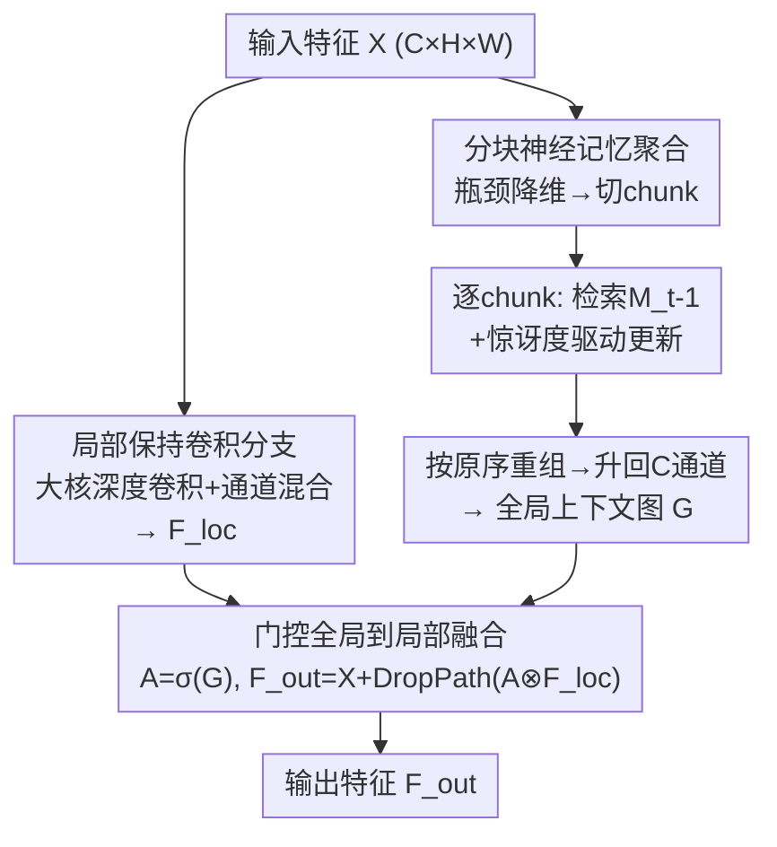

# Efficiency Follows Global-Local Decoupling

**会议**: CVPR 2026  
**论文**: [CVF Open Access](https://openaccess.thecvf.com/content/CVPR2026/html/Yang_Efficiency_Follows_Global-Local_Decoupling_CVPR_2026_paper.html)  
**代码**: https://github.com/NUST-Machine-Intelligence-Laboratory/ConvNeur  
**领域**: 模型压缩 / 高效视觉骨干网络  
**关键词**: 全局-局部解耦, 神经记忆, 分块聚合, 门控调制, 高效骨干

## 一句话总结
ConvNeur 把"看全局"和"留细节"两件事拆到两条独立分支：一条卷积分支专心保留局部纹理细节，一条压缩后的"神经记忆"分支用分块（chunk）方式以次二次复杂度聚合图像级上下文，再用一个学出来的门控让全局信号去**调制**而不是覆盖局部特征；在 ImageNet/COCO/ADE20K 上以更少 FLOPs 和参数取得了更好的精度-效率折中。

## 研究背景与动机
**领域现状**：现代视觉骨干网络被同时要求做两件事——在整张图上做全局推理（识别、检测都依赖场景布局、共现、长程形状线索），又要保住像素/patch 级的边缘、纹理、细结构。主流做法是 Transformer 全局自注意力，或其窗口化/稀疏化变体，以及近来的 Mamba/RWKV 这类线性/状态空间骨干。

**现有痛点**：全注意力的代价随分辨率近似二次增长，高分辨率或密集预测场景太贵；窗口化/稀疏化把代价压下来，却又重新引入局部性、看不到整图；纯卷积高效且保留平移友好的归纳偏置，但全局上下文要么受限、要么"来得太晚"；CoAtNet 这类混合设计虽然兼顾两者，**全局与局部计算却挤在同一个特征空间、同一个分辨率上做**，于是两种角色仍然耦合，模型相当于为两者都付了一遍钱。

**核心矛盾**：作者的观察是——代价膨胀的真正根源不是"做全局建模"本身，而是**全局推理和局部表征被纠缠在同一条通路里**。一旦让同一股特征流既要看全图、又要保细节、还要卡在紧 FLOP 预算内，宽度、空间分辨率、交互范围就开始互相争抢，谁都达不到最优。

**核心 idea**：与其继续逼近注意力，不如**把全局和局部分开学，再让全局路去调制（modulate）局部路、而不是替换它**。一条只负责"引导"的全局路完全可以在压缩、分块的 token 上运行，从而把复杂度压到次二次；而局部路得以保留让卷积有效的归纳先验。一句话——**efficiency follows global-local decoupling（效率源于全局-局部解耦）**。

## 方法详解

### 整体框架
给定中间特征图 $X \in \mathbb{R}^{C\times H\times W}$，ConvNeur 把它送进**两条并行分支**：① 局部保持卷积分支，只管边缘、纹理、小物体，保留 CNN 归纳偏置，不去碰全局推理；② 压缩全局记忆分支，先把通道投影到更低维的记忆空间，把空间图摊平成序列、切成定长 chunk，逐 chunk 做"检索-更新-重组"循环，以次二次代价聚合图像级上下文，最终重组回空间布局并升回原通道，得到一张全局上下文图 $G$。两条分支不是简单相加或拼接，而是把 $G$ 过 sigmoid 变成一张空间门 $A$，逐位置去**调制**局部特征。因为两种角色在结构上解耦，全局分支的预算和压缩率可以独立于局部分支单独设定——这正是高分辨率视觉最需要的。

### 关键设计

**1. 全局-局部解耦：两条分支各管一摊，不抢宽度/分辨率/交互范围**

这一条直接回应"全局与局部纠缠在单一通路"的根本痛点。局部保持卷积分支沿用现代卷积范式（ConvNeXt 风格）：一层相对大核的深度卷积聚合邻域上下文，后接轻量通道混合与归一化，输出记为 $F_{loc}$；因为全局推理交给另一条分支处理，它**不需要扩大交互范围**，于是绕开了"宽度-分辨率-上下文"三者互抢的困局。全局分支则被允许在压缩、分块的 token 上独立运行。两者结构上分离，意味着可以**单独给全局分支定预算、单独压缩**——这是相比 CoAtNet 等"两路挤在同一特征空间"混合模型的本质区别：它们为全局和局部都付一遍全分辨率的钱，ConvNeur 只在压缩路上付全局的钱。

**2. 分块神经记忆聚合：用次二次代价拿到图像级上下文**

全局分支借鉴了 Titans 的神经记忆与"惊讶度驱动更新"思路，但把它放进一个**空间解耦**的视觉框架里。流程分四步：(i) **瓶颈 tokenization**——逐点卷积把 $X$ 投到低维记忆空间 $X_{mem}\in\mathbb{R}^{C_m\times H\times W}$（$C_m<C$），读写记忆更便宜，同时保留空间布局以便后续重组；(ii) **分块**——把 $X_{mem}$ 沿空间摊平成 $S\in\mathbb{R}^{(HW)\times C_m}$，切成定长 $L$ 的 chunk $\{S_t\}_{t=1}^T$，每步记忆只接收一小撮 token，避免一次性对全部 token 操作；(iii) **检索与更新**——每个 chunk 线性投影出 $q_t=W_qS_t,\ k_t=W_kS_t,\ v_t=W_vS_t$，先用 $q_t$ 从当前记忆态 $M_{t-1}$ 读出 chunk 级全局上下文 $\hat y_t=M_{t-1}(q_t)$，再定义重构目标

$$\mathcal{L}_t = \lVert M_{t-1}(k_t) - v_t \rVert_2^2,$$

一组可学习的"更新生成器"把这个 loss 转成自适应步长、动量系数和衰减因子，得到下一记忆态 $M_t = U(M_{t-1}, \nabla_M \mathcal{L}_t)$。越难重构的 chunk 产生越大的更新，这就是"惊讶度驱动"；(iv) **重组**——把各 chunk 的 $\hat y_t$ 按原 token 序拼回长度 $HW$ 的序列、reshape 回空间得到 $O_{mem}$，再用逐点卷积升回 $C$ 通道得到全局图 $G$。整条全局分支的代价约为 $O(CC_mHW)+O(T\cdot \text{mem}(L,C_m))$，由于 $C_m$ 和 $L$ 都小且固定，**代价随空间位置数近似线性增长**。

**3. 门控全局到局部融合：全局做引导而非覆盖**

拿到全局图 $G$ 后，过 sigmoid 得到空间门 $A=\sigma(G)$，逐位置调制局部特征并残差回流：

$$F_{out} = X + \text{DropPath}(A \otimes F_{loc}).$$

作者把它理解为"摊销式条件化"：全局分支先推断出一张针对当前图像的上下文，再转成一张掩码告诉局部分支该强调/抑制什么。和 SE/CBAM/Non-local "聚合一次全局信息再广播回去"不同，这里的门来自**在空间 chunk 上在线更新的记忆**，因此反映的是全局分支的当前状态。乘性门控保住了残差局部通路、按位置按通道选择性放大或抑制特征；而消融显示，简单相加会把全局激活直接注入残差流、当全局响应强时容易抹掉细结构（移动特征统计量），拼接则要额外算一遍降维、瓶颈也留不出多少提升空间——这解释了门控为何虽小但稳定地更优。

### 模型变体与缩放
所有变体共享同一模板：四个带下采样的 stage、每个 block 都有局部保持分支、全局记忆分支插在每个 stage 起始处（per-stage）。通过加宽 stage 通道并按比例提升记忆维度来缩放，chunk size 固定（分类设为 196），让记忆代价在各变体间可预测。M1→M4 参数 4.3M→18.1M、FLOPs 0.71G→3.06G。检测时因 COCO 输入分辨率更高，chunk size 增大到 4096 让每次更新聚合更多 token、稳住惊讶度更新，并把内循环步长从 1 降到 1e-3，抑制稀疏框/掩码监督下过于频繁的记忆写入。

## 实验关键数据

### 主实验（ImageNet-1K 分类）
统一在 224×224、300 epoch、AdamW、DeiT 风格增广下训练。ConvNeur 在各预算段都推进了精度-效率前沿：

| 变体 | 参数(M) | FLOPs(G) | Top-1(%) | 对照 |
|------|---------|----------|----------|------|
| ConvNeur-M1 | 4.3 | 0.7 | **75.4** | PVT-T 75.1@1.9G（不到一半算力） |
| ConvNeur-M2 | 6.1 | 1.0 | **77.6** | SpectFormer-T 76.9@1.8G |
| ConvNeur-M3 | 10.6 | 1.8 | **80.0** | DeiT-S 79.9@4.6G、PVT-S 79.8@3.8G |
| ConvNeur-M4 | 18.1 | 3.1 | **81.5** | CrossViT-S 81.0@5.6G、PVT-M 81.2@6.7G |

下游同样涨点：COCO（Cascade Mask R-CNN，1×）上 M2 检测 41.2 AP / 分割 36.4 AP（ResNet-50 仅 38.0/34.4），M3 检测 42.4 AP 超过 ResNeXt101-32×4d 41.9；ADE20K（S-FPN）M2 拿 39.17 mIoU@106G 而 ResNet-50 只有 36.59@183G，M4（UperNet）45.72 mIoU@908G 超 Swin-T 44.51@945G。普遍现象是 **AP75 在相近 AP50 下更高**，说明是定位质量提升而非单纯召回提升。

### 消融实验（ConvNeur-M3 @ ImageNet-1K）

| 维度 | 配置 | FLOPs(G) | Top-1(%) | 说明 |
|------|------|----------|----------|------|
| 全局记忆 | Local-only | 1.4 | 78.2 | 纯局部基线 |
| | **Per-stage（默认）** | 1.8 | **80.0** | 仅 +0.4G 提 1.8 个点 |
| | Per-layer | 2.3 | 80.4 | 多花算力只多 0.4 点 |
| 全局分支类型 | CBAM | 1.5 | 78.4 | 仅重加权，给不了持久全局上下文 |
| | Non-local | 3.0 | 79.1 | 全空间稠密亲和，二次代价 |
| | Self-Attention | 1.8 | 79.8 | 激活/注意力图随 token 二次膨胀 |
| | IR-RWKV | 2.0 | 77.6 | 递归强加扫描序、破坏 2D 各向同性 |
| | Titans | 3.1 | 79.6 | 带分段注意力，代价高 |
| | **Ours（神经记忆）** | 1.8 | **80.0** | 比 Titans 省 >40% FLOPs 还略高 |
| 融合方式 | Addition | 1.8 | 79.6 | 直接注入残差流，易糊细节 |
| | Concatenate | 1.9 | 79.5 | 额外 +0.7M 参数算降维 |
| | **Gating（默认）** | 1.8 | **80.0** | 乘性校准，保住残差局部路 |
| 记忆维度 $C_m$ | 64 | 1.5 | 78.6 | |
| | **128（默认）** | 1.8 | **80.0** | 性价比最高 |
| | 256 | 2.7 | 80.3 | 收益递减 |

### 关键发现
- **解耦本身就值 1.8 个点**：在 local-only 上仅加 0.4 GFLOPs 的 per-stage 记忆就把 Top-1 从 78.2 提到 80.0，证明局部路保先验、记忆路补全局上下文，单一特征流在相近预算下拿不到这个增益。
- **per-stage 够用，per-layer 浪费**：相邻 block 间全局上下文变化慢、冗余高，门像个缓变的条件器；真正的大跳变发生在 stage 边界（下采样+宽度变化），所以每 stage 更新一次就拿到了大部分收益。
- **神经记忆是 matched-cost 下最好的全局化器**：在同一瓶颈脚手架下对比 CBAM/Non-local/Self-Attention/RWKV/Titans，神经记忆精度-代价折中最优；尤其相比 Titans 砍掉了分段注意力、省 >40% FLOPs 还略涨。
- **机制可视化**：浅层门做背景抑制、清晰边缘，细结构/小部件对比度增强、纹理杂乱淡出；深层变得以物体为中心、放大支持当前假设的证据、抑制同色同纹理干扰物——印证"全局引导、局部保真"的设计动机。

## 亮点与洞察
- **把"效率问题"重新定义为"耦合问题"**：最 "啊哈" 的一点是作者论证代价膨胀不来自全局建模本身，而来自全局/局部纠缠——于是解法不是再造一个更快的注意力，而是从架构上把两者拆开，全局路因此可以独立压缩、独立定预算。
- **神经记忆从时序搬到空间**：Titans 的"分块+惊讶度驱动+可学习记忆"原本面向序列/视频，本文把它**空间化**成一条压缩视觉分支，是把记忆增强思路迁到 2D 骨干的一个干净范例；可迁移到任何需要"廉价全局上下文"的密集预测任务。
- **门控调制 > 相加/拼接**：乘性门保住残差局部路、按位置/通道做校准，这个"全局做引导而非改写"的融合原则，对任何想注入全局线索又怕糊掉细节的设计都适用。

## 局限与展望
- 全局分支引入了 chunk size、记忆维度 $C_m$、内循环步长等额外超参，且检测/分割要手动调大 chunk、调小步长（如 4096 / 1e-3），说明对输入分辨率和监督稀疏度有一定敏感性，跨任务迁移需要重新调。
- ⚠️ 论文未给出实际推理延迟/吞吐的直接测量（主打 FLOPs/参数），"favorable latency trade-offs" 的论断更多基于算力代理指标，真实硬件上分块记忆的串行检索-更新是否同样高效有待验证。
- 神经记忆的检索-更新逐 chunk 串行，chunk 之间存在顺序依赖，可能限制大 batch / 高并行场景的加速；可探索 chunk 并行或更轻的更新规则。
- 缩放止于 18.1M（M4），更大模型（数十 M~百 M）上解耦原则是否依然占优、全局分支会不会需要更大预算，论文未覆盖。

## 相关工作与启发
- **vs 全注意力 ViT / Swin**：ViT 全局但二次代价，Swin 用窗口压代价却重新局部化、看不到整图；ConvNeur 不在全宽特征上做全局，而是把全局推理放到压缩分块路上、只用来调制局部，从结构上消除耦合而非逼近注意力。
- **vs Mamba/RWKV 等线性骨干**：它们用递归/SSM 把全局变便宜，但全局与局部仍在同一特征流里传播，且递归强加扫描序、破坏 2D 各向同性（消融里 IR-RWKV 仅 77.6）；本文是互补思路——全局放到独立压缩路、保留多组 fast weights、无固定顺序检索。
- **vs SE/CBAM/Non-local 记忆增强**：这些"先聚合一次全局再广播回去"的模块给不了持久全局上下文（CBAM 78.4、Non-local 79.1）；ConvNeur 的门来自在线更新的空间记忆，反映全局分支当前状态。
- **vs Titans**：直接继承其神经记忆与惊讶度更新，但去掉分段注意力、把记忆变成唯一全局机制并空间化，matched-cost 下省 >40% FLOPs 还略涨。

## 评分
- 新颖性: ⭐⭐⭐⭐ "解耦即效率"的框定清晰有力，神经记忆空间化是漂亮的迁移，但单个组件（神经记忆、门控调制）多有前作。
- 实验充分度: ⭐⭐⭐⭐ 分类/检测/分割三任务全覆盖、消融把全局分支类型/融合/超参逐一拆开，缺真实延迟测量。
- 写作质量: ⭐⭐⭐⭐⭐ 动机推导层层递进，"see the whole, keep the detail" 的主线贯穿全文，机制可视化到位。
- 价值: ⭐⭐⭐⭐ 一个可直接复用的高效骨干模板，解耦+门控调制的设计原则对密集预测任务有较强迁移价值。

<!-- RELATED:START -->

## 相关论文

- [\[ICCV 2025\] SAMO: A Lightweight Sharpness-Aware Approach for Multi-Task Optimization with Joint Global-Local Perturbation](../../ICCV2025/model_compression/samo_a_lightweight_sharpness-aware_approach_for_multi-task_optimization_with_joi.md)
- [\[ACL 2026\] Efficient Learned Data Compression via Dual-Stream Feature Decoupling](../../ACL2026/model_compression/efficient_learned_data_compression_via_dual-stream_feature_decoupling.md)
- [\[ICML 2026\] Global Convergence of Adaptive Sensing for Principal Eigenvector Estimation](../../ICML2026/model_compression/global_convergence_of_adaptive_sensing_for_principal_eigenvector_estimation.md)
- [\[ICML 2026\] Don't Ignore the Tail: Decoupling top-K Probabilities for Efficient Language Model Distillation](../../ICML2026/model_compression/dont_ignore_the_tail_decoupling_top-k_probabilities_for_efficient_language_model.md)
- [\[ACL 2026\] FastKV: Decoupling of Context Reduction and KV Cache Compression for Prefill-Decoding Acceleration](../../ACL2026/model_compression/fastkv_decoupling_of_context_reduction_and_kv_cache_compression_for_prefill-deco.md)

<!-- RELATED:END -->
