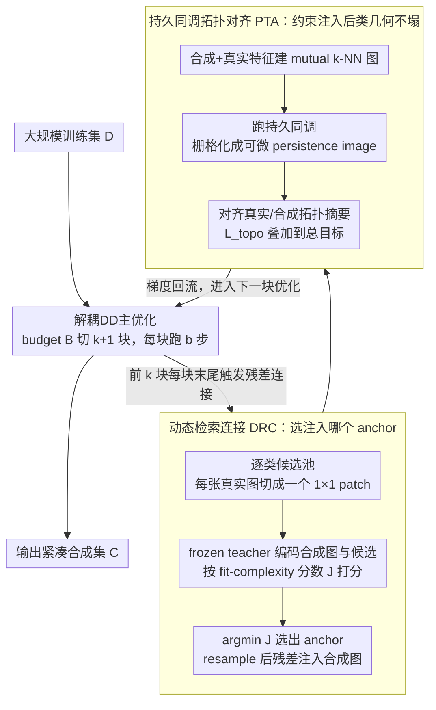

# Fixed Anchors Are Not Enough: Dynamic Retrieval and Persistent Homology for Dataset Distillation

**会议**: CVPR 2026  
**arXiv**: [2602.24144](https://arxiv.org/abs/2602.24144)  
**代码**: 待确认  
**领域**: 数据蒸馏 / 模型压缩  
**关键词**: dataset distillation, residual matching, persistent homology, topology alignment, dynamic retrieval

## 一句话总结
RETA解耦数据蒸馏中残差匹配的两个失败模式（fit-complexity gap和pull-to-anchor effect），通过动态检索连接（DRC）自适应选择real patch anchor并用持久同调拓扑对齐（PTA）保持类内多样性，在ImageNet-1K ResNet-18 IPC=50上达到64.3%（+3.1% vs FADRM）。

## 研究背景与动机

**领域现状**：数据集蒸馏（DD）旨在将大数据集压缩为少量合成图像，使在合成集上训练的模型性能接近全集训练。解耦DD（如SRe2L、EDC、FADRM）将监督目标和分布对齐解耦为两个优化流，实现了更好的稳定性和可扩展性。FADRM进一步引入残差匹配——周期性将real patch通过残差连接注入合成图像，防止纯像素更新导致的信息消失。

**现有痛点**：FADRM使用固定的、预选的real patch作为anchor，存在两个耦合的失败模式：
   - **(i) Fit-Complexity Gap**：固定patch可能与当前合成特征在teacher空间中不对齐（fit gap大），或者patch本身纹理复杂导致注入高频噪声（complexity膨胀），二者都损害泛化界
   - **(ii) Pull-to-Anchor Effect**：每次残差连接都将合成特征拉向teacher空间中最近的real样本，反复操作后类内合成特征距离收缩 $\|y_i' - y_j'\| \leq \alpha\|y_i - y_j\| + (1-\alpha)\|a_i - a_j\|$，导致distinct cluster过早合并，类内多样性丧失

**核心矛盾**：固定anchor既不能跨阶段自适应地最小化fit gap，也不能可靠地控制complexity——局部上anchor选择次优，全局上反复锚定破坏类拓扑结构。

**本文目标**
   - 如何自适应选择每阶段的residual anchor以同时控制fit gap和complexity？
   - 如何在反复残差注入过程中保持类内特征的多样性和拓扑结构？

**切入角度**：从泛化界分解出发（Theorem 4.1），将post-connection风险分解为fit项和complexity项，理论指导anchor选择策略；从拓扑数据分析（TDA）出发，用persistent homology量化类拓扑差异并构建可微正则化。

**核心 idea**：用动态检索替代固定anchor解决fit-complexity权衡，用持久同调拓扑对齐正则化对抗pull-to-anchor导致的类拓扑坍塌。

## 方法详解

### 整体框架
RETA要解决的是解耦数据蒸馏里"残差匹配该往合成图像里注入什么、注入后会破坏什么"的问题。它在解耦DD的基础上运行：输入大规模训练集 $\mathcal{D}$，输出紧凑合成集 $\tilde{\mathcal{C}}$，优化目标 $\min_{\tilde{\mathcal{C}}} \mathcal{L}_{sup}(f_\theta; \tilde{\mathcal{C}}) + \beta \mathcal{R}_{align}(\tilde{\mathcal{C}}; \mathcal{D}, \mathcal{T})$ 同时拟合监督信号和分布对齐。整个优化把总budget $B$ 切成 $k+1$ 块，每块跑 $b = \lfloor B/(k+1) \rfloor$ 步常规优化，前 $k$ 块的末尾各做一次残差连接——也就是把一个real patch按比例混进合成图像。RETA没有改动主优化流，而是在这几次残差连接的"接口"上插了两个模块：DRC负责决定**连接哪个anchor**，PTA负责约束**连接之后整个类的几何结构不能塌**。一个管局部的注入对象，一个管全局的拓扑保形；PTA的拓扑损失直接叠到总目标上，梯度回流后进入下一块优化，如此循环直到输出紧凑合成集。

### 关键设计

**1. Dynamic Retrieval Connection（DRC）：让anchor随阶段自适应，而不是一锤定终身**

FADRM的残差anchor是预先选好、全程不变的，这带来一对耦合的麻烦：固定patch可能在teacher空间里离当前合成特征越来越远（fit gap大），也可能本身纹理过于复杂、一注入就把高频噪声带进来（complexity膨胀）。DRC的做法是每个残差连接阶段都重新检索一次。它先为每个类 $c$ 建一个候选pool $p_c$（把每张真实图像切成 $1 \times 1$ patch），再用冻结的teacher $\phi(\cdot)$ 同时编码合成图像和所有候选patch，按一个把两种代价打包到一起的fit-complexity score 打分：

$$J(o|\tilde{x}_t) = (1-\lambda)\|q(\tilde{x}_t) - z(o)\|_2^2 + \lambda \cdot c(o)$$

其中 $q(\tilde{x}_t) = \text{Norm}(\phi(\tilde{x}_t))$、$z(o) = \text{Norm}(\phi(o))$。第一项就是fit gap——teacher空间里合成特征与候选patch的距离；第二项 $c(o) = \text{Var}_{u \in \Omega_{D_t}}(\|\nabla(G_\sigma * o)(u)\|_2^2)$ 是complexity score，即高斯平滑后梯度幅度的空间方差，值越大说明这个patch里残留的尖锐高频边缘越多。$\lambda$ 在两者之间调平衡。每个合成图像取 $o^* = \arg\min_{o \in p_c} J(o|\tilde{x}_t)$，resample到当前分辨率后做残差更新 $\tilde{x}_t \leftarrow \alpha \tilde{x}_t + (1-\alpha)\,\text{Resample}(o^*, D_t)$。

这套打分不是拍脑袋来的：Theorem 4.1把残差连接后的泛化界拆成了fit gap $\Delta$ 和complexity gap $\mathfrak{R}_n(H \circ O) - \mathfrak{R}_n(H \circ \tilde{\mathcal{C}}_{pre})$ 两项，而固定anchor没法同时压住这两项。DRC正好把 $J$ 的两项对上了界的两项——靠per-stage检索动态缩小 $\Delta$，同时用 $c(o)$ 把complexity压住，相当于把理论里的两个杠杆都变成了可操作的选择动作。

**2. Persistent Topology Alignment（PTA）：用持久同调拦住"反复锚定把一个类拉成一团"**

DRC解决了"注入谁"，但残差连接本身还有个副作用：每次把合成特征往最近的real样本拉，反复几轮后类内特征互相靠拢，$\|y_i' - y_j'\| \leq \alpha\|y_i - y_j\| + (1-\alpha)\|a_i - a_j\|$，原本分开的cluster过早合并，类内多样性丢失——这就是pull-to-anchor效应。PTA从拓扑层面盯住这件事。它对每个类 $c$ 取合成特征 $Z_c^{syn} = \{\phi(\tilde{x}_i)\}$ 和真实特征 $Z_c^{real} = \{\phi(x): x \in p_c\}$ 的并集，建一个class-balanced的mutual $k$-NN图，跑persistent homology得到persistence diagrams $\mathcal{D}_c^{(q)}$（$q=0$ 记连通分量、$q=1$ 记环）。持久图本身不可微，PTA把每张图栅格化成一张可微的persistence image：

$$I^{(q)}(Z_c)[m] = \sum_{(b_j, p_j) \in \mathcal{D}_c^{(q)}} w_q(p_j) \exp\left(-\frac{\|u_m - (b_j, p_j)\|_2^2}{2\sigma^2}\right)$$

再对齐合成与真实两侧的拓扑摘要：

$$\mathcal{L}_{topo} = \sum_c \left(\|I^{(0)}(Z_c^{syn}) - I^{(0)}(Z_c^{real})\|_2^2 + \gamma \|I^{(1)}(Z_c^{syn}) - I^{(1)}(Z_c^{real})\|_2^2\right)$$

pull-to-anchor在Betti曲线上的表现很具体：$\mathcal{B}_0^{syn}$ 左移意味着连通分量过早并掉，$\mathcal{B}_1^{syn}$ 被压低意味着环过早消失。把这两件事写进 $\mathcal{L}_{topo}$ 后，梯度能经由那个冻结但仍留在计算图里的 $\phi$ 回流到合成输入，逼着合成特征维持和真实数据一致的多尺度连通性与环结构，从拓扑上挡住类内坍塌。训练时PTA只是把这一项加到总目标上 $\mathcal{L} \leftarrow \mathcal{L} + \lambda_{topo} \mathcal{L}_{topo}$，和DRC的检索步互不干扰却互相补位——DRC在局部管"这一针打得准不准"、PTA在全局管"打了很多针之后这个类还成不成形"，这也解释了消融里两者联合提升超过各自单独之和的超加性。

### 训练策略
- 基于FADRM协议：Adam优化器，lr=0.25，$(\beta_1, \beta_2) = (0.5, 0.9)$
- 优化budget $B \in \{300, 2000\}$（取决于数据集），merge ratio $\alpha = 0.5$
- DRC的 $\lambda = 0.1$（fit-complexity权衡默认值）
- PTA的 $\lambda_{topo} = 0.5$，$k \approx 10\text{-}20$，$32 \times 32$ PI grid
- 特征cache定期刷新（每 $T$ 步），减少计算开销
- 单张RTX 4090即可运行

## 实验关键数据

### 主实验（ResNet-18, IPC=10/50）

| 数据集 | IPC | SRe2L | RDED | EDC | FADRM+ | **RETA** | **Δ** |
|--------|-----|-------|------|-----|--------|----------|-------|
| CIFAR-100 | 10 | 27.0 | 56.9 | 63.7 | 67.9 | **70.3** | +2.4 |
| CIFAR-100 | 50 | 50.2 | 66.8 | 68.6 | 67.9 | **70.3** | +1.7 |
| Tiny-ImageNet | 10 | 16.1 | 41.9 | 51.2 | 52.8 | **56.2** | +3.4 |
| ImageNette | 10 | 29.4 | 61.4 | - | 69.0 | **72.5** | +3.5 |
| ImageNet-1K | 10 | 21.3 | 42.0 | 48.6 | 50.9 | **53.2** | +2.3 |
| ImageNet-1K | 50 | 46.8 | 56.5 | 58.0 | 61.2 | **64.3** | +3.1 |

RETA在所有数据集×所有IPC×所有backbone（ResNet-18/50/101）上均取得最佳结果。

### 消融实验（ResNet-18, IPC=10）

| DRC | PTA | CIFAR-100 | Tiny-ImageNet | ImageNette | ImageNet-1K |
|-----|-----|-----------|---------------|------------|-------------|
| × | × | 67.9 | 52.8 | 69.0 | 50.9 |
| ✓ | × | 69.0 (+1.1) | 54.5 (+1.7) | 70.9 (+1.9) | 51.8 (+0.9) |
| × | ✓ | 68.5 (+0.6) | 53.7 (+0.9) | 69.8 (+0.8) | 51.6 (+0.7) |
| ✓ | ✓ | **70.3 (+2.4)** | **56.2 (+3.4)** | **72.5 (+3.5)** | **53.2 (+2.3)** |

### 关键发现

- **DRC贡献更大**：单独DRC较单独PTA在所有数据集上提升更多（1.1-1.9 vs 0.6-0.9），说明anchor选择是更关键的瓶颈
- **超加性互补**：DRC+PTA联合提升超过两者单独之和（如Tiny-ImageNet: 1.7+0.9=2.6, 实际+3.4），说明二者从不同层面解决耦合问题
- **跨架构泛化**：在EfficientNet/MobileNet/ShuffleNet/Swin-Tiny/DenseNet上均超FADRM+（+0.9~3.4），非架构特定
- **鲁棒性**：ImageNet-Subset-C（15种corruption×5种severity）上平均+3.2%，DRC过滤噪声anchor + PTA保持稳定拓扑结构共同贡献
- **计算开销适中**：相对FADRM+仅增加约20%时间（1.31s vs 1.09s/图）和22%内存（13.4GB vs 11.0GB），远低于G-VBSM/EDC等方法
- **$\lambda$ 敏感性**：$\lambda=0.1$ 最优（52.9%），$\lambda=0$ 时51.7%，$\lambda=1.0$ 时50.8%——需要少量complexity控制但不能过度
- **$\lambda_{topo}$ 敏感性**：$\lambda_{topo}=0.5$ 最优（52.5%），过小无法对抗pull-to-anchor，过大与feature-matching目标竞争

## 亮点与洞察

- **理论驱动的方法设计**：从Theorem 4.1的泛化界分解直接导出DRC的fit-complexity score，不是ad-hoc设计。持久同调量化类拓扑差异的思路也有清晰的数学基础——这种"理论→问题诊断→方法设计"的范式值得学习
- **TDA在数据蒸馏中的首次应用**：用persistent homology的persistence images作为可微拓扑正则化信号，巧妙解决了PH天然不可微的问题。这一思路可迁移到任何需要保持数据集拓扑结构的生成/压缩任务
- **Complexity score设计简洁有效**：$c(o) = \text{Var}(\|\nabla(G_\sigma * o)\|_2^2)$ 用高斯平滑后梯度方差捕捉"残余尖锐边缘"——简单、可解释、计算轻量

## 局限与展望

- **作者承认的局限**：依赖frozen teacher、per-class retrieval pool和多个拓扑超参数（$k$-NN构建、PI grid、$\lambda_{topo}$）。DRC的complexity proxy是手工设计的，PTA在蒸馏时有额外开销
- **Complexity proxy可学习化**：当前 $c(o)$ 基于梯度统计量，可以用一个小网络学习更好的complexity预测器
- **Layer-wise拓扑对齐**：当前仅在最后一层teacher空间计算PH，可探索多层特征的拓扑对齐——浅层保结构、深层保语义
- **在线Pool更新**：当前per-class pool是固定的，可以在蒸馏过程中动态更新pool（增删候选patch），进一步提升检索质量

## 相关工作与启发

- **vs FADRM**：FADRM识别了信息消失问题并引入固定残差连接，但anchor选择是随机的且全程不变。RETA直接解决了FADRM的两个系统性缺陷（fit-complexity gap + pull-to-anchor），在所有设置上+2-3.5%
- **vs RDED/EDC/SRe2L**：这些方法不使用残差连接机制，在大规模数据集上表现明显弱于FADRM/RETA。RETA的设计建立在残差匹配范式之上，不直接适用于non-residual方法
- **vs Trajectory Matching (MTT等)**：轨迹匹配方法需要大量内循环训练，计算开销大。RETA作为解耦方法保持了高效性（单GPU可运行），且在corruption鲁棒性上明显超越MTT

## 评分
- 新颖性: ⭐⭐⭐⭐ 问题诊断（两个失败模式）深入，持久同调在DD中是全新应用，理论和方法紧密结合
- 实验充分度: ⭐⭐⭐⭐⭐ 5个数据集×3个IPC×3个backbone+跨架构+corruption鲁棒性+消融+超参敏感性+持续学习应用+可视化，非常全面
- 写作质量: ⭐⭐⭐⭐ 结构清晰，理论→方法→实验的叙事完整，TDA部分可能对不熟悉的读者有一定阅读门槛
- 价值: ⭐⭐⭐⭐ 在数据蒸馏领域取得一致的SOTA，DRC和PTA的设计思路（自适应anchor选择+拓扑保持）有较好的通用性

<!-- RELATED:START -->

## 相关论文

- [\[CVPR 2026\] Dataset Distillation by Influence Matching](dataset_distillation_by_influence_matching.md)
- [\[CVPR 2026\] Mitigating The Distribution Shift of Diffusion-based Dataset Distillation](mitigating_the_distribution_shift_of_diffusion-based_dataset_distillation.md)
- [\[CVPR 2026\] IMS3: Breaking Distributional Aggregation in Diffusion-Based Dataset Distillation](ims3_breaking_distributional_aggregation_in_diffusion-based_dataset_distillation.md)
- [\[CVPR 2026\] Balanced Dataset Distillation via Modeling Multiple Visual Pattern Distribution](balanced_dataset_distillation_via_modeling_multiple_visual_pattern_distribution.md)
- [\[CVPR 2026\] Beyond Soft Label: Dataset Distillation via Orthogonal Gradient Matching](beyond_soft_label_dataset_distillation_via_orthogonal_gradient_matching.md)

<!-- RELATED:END -->
