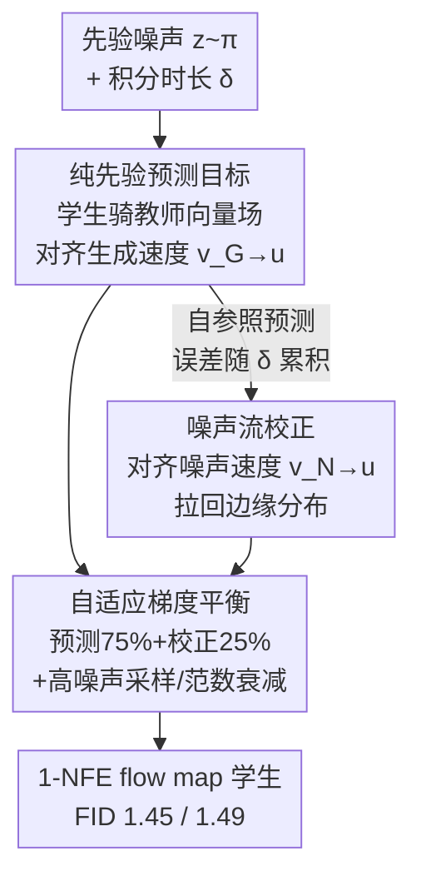

# Flow Map Distillation Without Data

**会议**: CVPR 2026  
**论文**: [CVF Open Access](https://openaccess.thecvf.com/content/CVPR2026/html/Tong_Flow_Map_Distillation_Without_Data_CVPR_2026_paper.html)  
**代码**: [data-free-flow-distill.github.io](https://data-free-flow-distill.github.io)（项目页）  
**领域**: 扩散模型 / 模型压缩  
**关键词**: 流图蒸馏, 数据无关蒸馏, 一步生成, 预测-校正, 扩散加速

## 一句话总结
把预训练 flow/扩散教师蒸馏成"一步出图"的 flow map，传统做法要从外部数据集采样，本文指出这会引入 **Teacher-Data Mismatch**（数据分布≠教师真实生成分布），改为**只从先验噪声采样**、用"预测+校正"双目标让学生骑在教师向量场上，在 ImageNet 256/512 上以 1-NFE 拿到 FID 1.45 / 1.49，超过所有用数据的蒸馏基线。

## 研究背景与动机

**领域现状**：扩散模型和 flow 模型生成质量极高，但采样要对一条 ODE 做几十上百步数值积分，慢。flow map（学习 ODE 的解算子，直接从噪声"一跳"到数据）是公认的加速路线，而其中最成功的做法是**从一个强大的预训练教师蒸馏**——这样能把教师身上的高级训练/后训练技巧（REPA、CFG、guidance interval、微调等）一并继承下来，比从头训 flow map 灵活得多。

**现有痛点**：主流蒸馏几乎都是 **data-based**——训练学生时要从外部数据集 $\tilde p$ 采样中间状态 $x_t \sim \tilde p_t$，然后在这些状态上对齐教师动力学。这隐含假设"数据加噪分布 $\tilde p_t$ 能代表教师采样轨迹经过的状态"。

**核心矛盾**：作者指出这个假设常常不成立，命名为 **Teacher-Data Mismatch**：教师真实生成分布记作 $\hat p_t$（沿教师 ODE 解轨迹的所有状态），而数据加噪分布是 $\tilde p_t$，二者 $\tilde p_t \neq \hat p_t$。一旦教师超出原训练集泛化、用了 CFG 外推、被后训练微调、或干脆训练数据不公开（只放权重），$\hat p_t$ 就会偏离 $\tilde p_t$。这时强迫学生在错配的数据上对齐教师，等于**在蒸馏一个错误的过程**——即使学生完美收敛，也复现不出教师的真实输出。论文用受控实验佐证：固定教师，加噪时叠加数据增强（人为制造错配），增强越强、学生 FID 退化越明显。

**切入角度**：虽然 $\hat p_t$ 和 $\tilde p_t$ 在 $t\in[0,1)$ 上发散，但二者在 $t=1$ 处**天然重合**——加噪过程终点是先验 $\pi$，教师生成过程起点也是 $\pi$。先验是唯一一个"保证落在教师生成分布上"的采样点。

**核心 idea**：既然只有先验绝对对齐，那就**只从先验采样**来蒸馏，从构造上彻底绕开 mismatch 风险。作者把这套 data-free 框架命名为 **FreeFlow**，用"预测（骑教师轨迹）+ 校正（拉回边缘分布）"两个目标保证一步生成的保真度。

## 方法详解

### 整体框架

FreeFlow 是一个**完全不碰外部数据集**的 flow map 蒸馏框架：输入只有先验噪声 $z\sim\pi$ 和一个积分时长 $\delta$，输出是学生 $f_\theta(z,\delta)$ 预测的"跳跃落点"。核心原理是让学生在轨迹某点上与教师瞬时速度场 $u$ 保持局部一致。

整套方法把"为什么 data-free 可行"和"data-free 怎么训得稳"两件事串起来：传统 data-based 蒸馏把起点 $x_t$ 从 $\tilde p_t$ 采、再扰动**起点**来加约束（这就是 MeanFlow 恒等式）；而 FreeFlow 把起点固定在先验（$t=1$、$x_t=z$），扰动起点已无意义，于是转而扰动**预测的终点**得到 data-free 的预测目标。但这种自参照式的预测像一个自主 ODE 解算器，会**误差累积**——学生用自己（可能略偏）的当前状态去查教师速度，偏差越滚越大。为此再加一个**校正目标**，用 VSD 思路把学生生成分布的边缘速度拉回教师。两个目标都只从先验采样，自适应融合后训练。

### 关键设计

**1. 纯先验预测目标：让学生"骑"在教师向量场上，从噪声一步步往外推**

针对的痛点是 data-based 蒸馏必须从数据集采中间状态、从而引入 mismatch。FreeFlow 把起点钉死在先验（$t=1$），定义积分时长 $\delta=1-s$，学生 $f_\theta(z,\delta)=z+\delta F_\theta(z,\delta)$ 用平均速度 $F_\theta$ 参数化来逼近真解 $\phi_u(z,1,1-\delta)$。最优条件是 $\delta F_{\theta^*}(z,\delta)=\int_1^{1-\delta}-u(x(\tau),\tau)\,d\tau$。因为起点不能扰动，作者对它关于 $\delta$ 求导，得到 data-free 版恒等式：

$$F_{\theta^*}(z,\delta)+\delta\,\partial_\delta F_{\theta^*}(z,\delta)=u\big(f_{\theta^*}(z,\delta),\,1-\delta\big)$$

它和 MeanFlow 的关键区别有二：这里是对 $\delta$ 的**偏导**（因为 $z$ 不依赖 $\delta$），且 $u$ 在**学生预测的状态** $f_\theta(z,\delta)$ 上求值。由此得损失 $\mathbb{E}_{z,\delta}\|F_\theta(z,\delta)-\mathrm{sg}(u_{\text{target}})\|^2$，其中 $u_{\text{target}}=u(f_\theta(z,\delta),1-\delta)-\delta\,\partial_\delta F_\theta(z,\delta)$，全程只采 $z\sim\pi$。

为什么有效：该损失等价于 $\mathbb{E}_{z,\delta}\|\partial_\delta f_\theta(z,\delta)-u(f_\theta(z,\delta),1-\delta)\|^2$，当且仅当学生的**生成速度** $v_G=\partial_\delta f_\theta$ 等于底层速度 $u$ 时为 0。直觉上学生就像一个自主数值解算器，用当前估计状态去查教师导数、再算下一步——从先验出发"骑"着教师向量场一路往数据端外推。$\partial_\delta F_\theta$ 可用前向自动微分的 JVP 高效算出，作者也给了有限差分的离散近似版以避开特殊算子限制。CFG 等高级采样可直接塞进 $u$（用 $u_\gamma=\gamma u(\cdot|c)+(1-\gamma)u(\cdot|\varnothing)$），还能在一段 $\gamma$ 上训练、推理时自由换引导强度。

**2. 噪声流校正：用 predictor-corrector 把累积误差拉回教师真实轨迹**

设计 1 是自参照的，学生预测有微小误差就会被后续步骤继承，随 $\delta$ 从 0→1 越滚越偏（图 4 实测学生轨迹与教师真实采样路径的相对误差随 $\delta$ 单调增大）。光靠预测目标，学生没有任何机制把自己拉回正轨。

作者借 Song 等人的 predictor-corrector 思路，加一个**校正边缘分布**的目标，且不能重新引入数据依赖（所以排除 GAN 这类靠外部数据集的目标）。具体改编 Variational Score Distillation：用 $q\equiv\int f_\theta(z,1)\,d\pi$ 记学生生成的干净样本边缘分布，最小化它与真实分布 $p$ 的 Integral-KL 散度 $D_{\text{IKL}}(q\,\|\,p)=\int_0^1\mathbb{E}_{x_r\sim q_r}[\log\frac{q_r(x_r)}{p_r(x_r)}]\,dr$，$q=p$ 当且仅当该散度为 0。利用 score 与边缘速度可互换，优化梯度可写成只采先验的形式（$z,n\sim\pi$）：

$$\nabla_\theta\,\mathbb{E}_{z,n,r}\Big[F_\theta(z,1)^\top\,\mathrm{sg}\big(\Delta_{v_N,u}(I_r(f_\theta(z,1),n),r)\big)\Big]$$

其中 $v_N$ 是学生生成分布经加噪后的**噪声速度**，$\Delta_{v_N,u}=v_N-u$。$v_N$ 未知，用一个在线网络 $g_\psi$（全参或 LoRA）以标准 flow-matching 损失 $\mathbb{E}\|g_\psi(I_r(f_\theta(z,1),n),r)+\partial_r I_r(\cdot)\|^2$ 在线逼近。

为什么有效：作者点出 Eq(9) 和 Eq(11) 两个梯度形式高度相似——**预测目标对齐生成速度 $v_G\to u$，校正目标对齐噪声速度 $v_N\to u$**，二者从"速度对齐"的统一视角解释了学生的最优性，而后者额外修正边缘分布，相当于给自主解算器配了个纠偏器，专治误差累积。⚠️ VSD/IKL 部分公式较密，细节以原文为准。

**3. 自适应梯度平衡 + 高噪声采样：让预测与校正两个信号和谐共训**

预测和校正单独用都不稳（消融见下：纯预测会因误差累积停在次优 FID，纯校正会渐进模式崩塌），必须融合，而融合的关键是别让两个梯度互相打架。作者的做法：① 按 75%/25% 拆 mini-batch 给预测/校正（校正算力略贵）；② 校正梯度乘一个自适应权重 $\lambda=\alpha\frac{\mathbb{E}\|\Delta_{v_G,u}\|}{\mathbb{E}\|\Delta_{v_N,u}\|+\epsilon}$ 再与预测梯度拼接，使两路量级自动对齐，且对 $\alpha$ 鲁棒（图 6 跨 $\alpha\in\{0.3,3\}$ 都稳）；③ 对 $\Delta_{v_G,u}$ 施加幂律衰减权重 $1/(\|\Delta_{v_G,u}\|^2/d+\varepsilon)^k$（先除 $\sqrt d$ 做维度不变），$k$ 越大衰减越强——联合训练时偏好**更强衰减**，因为两路信号未必处处一致，压住预测梯度能缓解冲突。

校正目标里 $r$ 的采样也有讲究：从连续性方程看 $p_1=q_1=\pi$，$p_0$ 与 $q_0$ 的差距是概率流差异沿时间的积分，所以应**更重高噪声段**（LogitNormal 偏向高 $r$、丢掉高噪声段会显著掉点）。CFG 处理上，$v_G$ 与 $v_N$ 在高噪声端行为不同，校正目标需要比采样时**更激进地**截断 guidance interval。

## 实验关键数据

数据集 ImageNet 256×256 / 512×512，指标 FID-50K。设计分析用 DiT-B/2 + SiT-B/2 教师，主结果用 SiT-XL/2 系列教师。

### 主实验（Table 2，全部 data-free）

| 教师 / 分辨率 | 方法 | NFE | FID ↓ | 备注 |
|---|---|---|---|---|
| SiT-XL/2+REPA / 256 | 教师本体 | 434 | 1.37 | 上界参考 |
| SiT-XL/2+REPA / 256 | π-Flow | 1 | 2.85 | data-based 蒸馏 |
| SiT-XL/2+REPA / 256 | FACM | 2 | 1.52 | data-based 蒸馏 |
| SiT-XL/2+REPA / 256 | **FreeFlow-XL/2** | **1** | **1.45** | **新 SOTA**（20 epoch 即达 1.84）|
| SiT-XL/2 / 256 | 教师本体 | 250×2 | 2.06 | — |
| SiT-XL/2 / 256 | **FreeFlow-XL/2** | **1** | **1.69** | 反超教师 |
| SiT-XL/2+REPA / 512 | 教师本体 | 460 | 1.37 | 上界参考 |
| SiT-XL/2+REPA / 512 | **FreeFlow-XL/2** | **1** | **1.49** | **新 SOTA** |

三个关键发现：(1) 以显著优势刷新 1-NFE SOTA；(2) 训练高效——100K 迭代（≈20 epoch）就超过许多强基线的最终结果；(3) 1-NFE 学生稳定保持在教师性能的 10% 以内，且全程不用一张外部数据样本（真实或合成都不用）。

### 消融实验（Table 1，DiT-B/2，FID ↓）

| 维度 | 配置 | FID | 结论 |
|---|---|---|---|
| 梯度权重 $k$（仅 Eq.9） | $k=0.0$ / $0.5$ / $1.0$ | 11.91 / 11.71 / 12.40 | 单预测目标对 $k$ 不敏感 |
| 梯度权重 $k$（Eq.9+11） | $k=0.0$ / $0.5$ / $1.0$ | 43.53 / 10.58 / **5.58** | 联合训练**强衰减**最好 |
| $r$ 范围（Eq.11） | $[0,0.6]$ … $[0,1.0]$ | 91.82 → **6.02** | 丢高噪声段崩坏，需覆盖到 1.0 |
| $r$ 采样（Eq.11） | LogitNormal 偏 $0.8$ | **5.63** | 偏重高噪声更优 |
| Guidance interval | $[0,0.6]$ / $[0,0.7]$ / $[0,1.0]$ | 5.72 / 5.63 / 8.65 | 校正目标需更激进截断 |

### 关键发现
- **预测与校正缺一不可**：纯预测（蓝线）受误差累积所限，停在次优 FID；纯校正（绿线）渐进模式崩塌、性能退化；二者结合后严格优于任一单项——预测构建生成路径，校正充当稳定器纠正累积误差（图 7）。
- **梯度衰减是联合训练的关键开关**：单用预测时 $k$ 几乎无所谓，但两目标联合时 $k=0\to1.0$ 让 FID 从 43.53 暴跌到 5.58，因为压住 $\Delta_{v_G,u}$ 能化解两路信号的冲突。
- **推理时扩展的妙用**：把教师蒸馏成快速一致的 proxy 后，可用一步学生跑 Best-of-N 噪声搜索、只把最优噪声转交教师生成。仅 80 NFE 总预算就超过教师 128 NFE 的标准 CFG 采样（图 8）；且预测目标因保证轨迹一致，比纯校正模型更擅长找到可迁移的噪声候选。

## 亮点与洞察
- **把"该不该用数据"上升成一个被长期默认、却没人质疑的问题**：Teacher-Data Mismatch 这个命名很有冲击力——它点破了蒸馏社区"数据集能代表教师"的隐含假设，并用数据增强受控实验把"错配→掉点"做实，立论扎实。
- **"先验是唯一保证对齐的点"这个观察是整篇文章的支点**：从这一句几何直觉，自然推出"只从先验采样"的合法性，再顺势把起点扰动换成终点扰动得到 data-free 恒等式，逻辑一气呵成。
- **速度对齐的统一视角**：预测对齐 $v_G$、校正对齐 $v_N$，两个看似不同来源（轨迹一致 vs. 分布匹配）的目标被统一到"和教师速度场对齐"，这套语言让后续设计选择（$r$ 采样、guidance 截断、梯度平衡）都有了可解释的依据，可迁移到其他一致性/蒸馏方法。
- **可直接继承教师训练秘方**：因为只需要教师权重，REPA、guidance interval 这类复杂训练/采样配方都能"白嫖"，对工程落地很友好。

## 局限与展望
- **校正只修了终点、没修整条轨迹**：作者坦言完整的校正应修正学生预测的整条轨迹（而非 Eq.10 只考虑 $t=0$ 终样本），但在本文实验设置里没发现这么做有帮助——⚠️ 这意味着在更难/更高维条件任务上结论可能变化。
- **依赖教师质量**：整套"骑教师向量场"建立在"教师近乎完美"的假设上（原文脚注亦承认教师并不完美），教师本身的偏差会被学生忠实继承，data-free 并不能纠正教师错误。
- **额外在线网络 $g_\psi$ 的开销**：校正目标要在线训练一个网络逼近 $v_N$，虽然只占 25% batch，但相比纯预测仍增加算力与实现复杂度；JVP 也可能需要定制算子。
- **验证范围有限**：只在 ImageNet 类条件生成上验证，文本到图像、视频等更复杂条件分布下 data-free 范式是否同样占优仍待检验。

## 相关工作与启发
- **vs MeanFlow**：MeanFlow 从数据加噪分布采起点、扰动**起点**得到恒等式（Eq.4），本质 data-based；FreeFlow 起点钉在先验、改扰动**终点**得到 data-free 恒等式（Eq.7），并把 $u$ 求值点放在学生预测状态上，从源头规避 mismatch。
- **vs data-based 蒸馏（π-Flow / FACM / sCD 等）**：它们都要外部样本（真实或合成）来覆盖中间状态，受 Teacher-Data Mismatch 制约；FreeFlow 完全不用数据，FID 反而更低（256 上 1.45 vs π-Flow 2.85）。
- **vs Variational Score Distillation (VSD)**：FreeFlow 校正目标改编自 VSD 的 IKL 最小化，但把它纳入 data-free 框架、与预测目标联合，并从"噪声速度对齐"角度重新诠释，给出 $r$ 采样偏高噪声、guidance 更激进截断等新设计。
- **vs 从头训 flow map（Shortcut / IMM / DMF 等）**：从头训需要复刻教师的复杂训练配方；FreeFlow 走蒸馏路线，直接继承教师成品的所有训练/采样技巧。

## 评分
- 新颖性: ⭐⭐⭐⭐⭐ 提出并实证 Teacher-Data Mismatch，给出完全 data-free 的预测-校正蒸馏范式，视角新。
- 实验充分度: ⭐⭐⭐⭐⭐ 256/512 双分辨率刷 SOTA，设计选择逐项消融，含推理时扩展，证据链完整。
- 写作质量: ⭐⭐⭐⭐⭐ 从动机到机制层层递进，速度对齐的统一叙事清晰，图示到位。
- 价值: ⭐⭐⭐⭐⭐ 1-NFE FID 1.45/1.49 且零数据依赖，对加速大模型生成有直接落地意义。

<!-- RELATED:START -->

## 相关论文

- [\[ICLR 2026\] π-Flow: Policy-Based Few-Step Generation via Imitation Distillation](../../ICLR2026/model_compression/pi-flow_policy-based_few-step_generation_via_imitation_distillation.md)
- [\[CVPR 2026\] Block-based Learned Image Compression without Blocking Artifacts](block-based_learned_image_compression_without_blocking_artifacts.md)
- [\[CVPR 2026\] Towards Unified Human Perception and Machine Understanding: Token Flow Guided Compression Framework](towards_unified_human_perception_and_machine_understanding_token_flow_guided_com.md)
- [\[CVPR 2026\] IF-Prune: Information-Flow Guided Token Pruning for Efficient Vision-Language Models](if-prune_information-flow_guided_token_pruning_for_efficient_vision-language_mod.md)
- [\[CVPR 2026\] TWEO: Transformers Without Extreme Outliers Enables FP8 Training And Quantization For Dummies](tweo_transformers_without_extreme_outliers_enables_fp8_training_and_quantization.md)

<!-- RELATED:END -->
