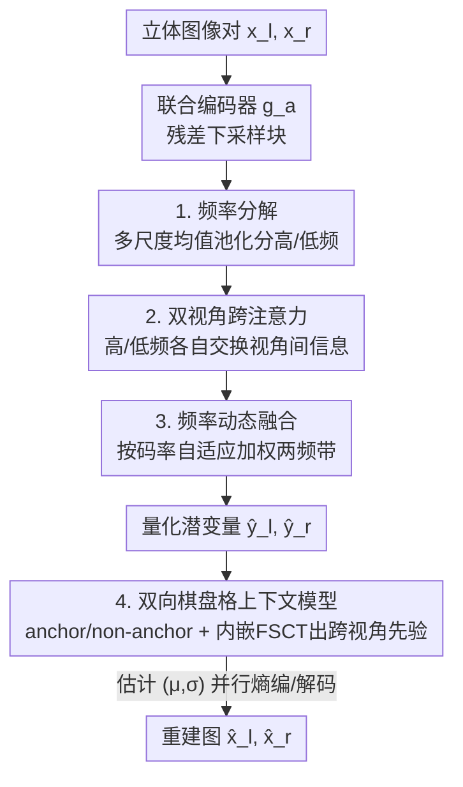

# FreqSIC: Frequency-aware Stereo Image Compression with Bi-directional Checkerboard Context Model

**会议**: CVPR 2026  
**论文**: [CVF Open Access](https://openaccess.thecvf.com/content/CVPR2026/html/Qin_FreqSIC_Frequency-aware_Stereo_Image_Compression_with_Bi-directional_Checkerboard_Context_Model_CVPR_2026_paper.html)  
**代码**: 无  
**领域**: 模型压缩 / 图像压缩 / 立体视觉  
**关键词**: 立体图像压缩, 频域分解, 跨视角注意力, 棋盘格上下文, 熵编码  

## 一句话总结
针对学习式立体图像压缩"高频细节丢失 + 自回归熵模型太慢"两个痛点，FreqSIC 用频域立体上下文迁移（FSCT）模块在高/低频分量上分别建模左右视角冗余并自适应加权，再把笨重的空间自回归熵模型换成内嵌 FSCT 的双向棋盘格上下文模型，在 InStereo2K / Cityscapes 上取得 SOTA 率失真性能的同时把编解码延迟压到 1.62s（比 BiSIC 的 78.6s 快约 48 倍）。

## 研究背景与动机

**领域现状**：立体图像压缩（Stereo Image Compression, SIC）的目标是联合压缩同一场景两个视角的图像对，利用视角间冗余（inter-view redundancy）获得比逐视角独立压缩更高的编码效率。随着自动驾驶、AR/VR 对双目数据的需求增长，学习式 SIC 成为主流——近期工作（BiSIC、BCSIC、LDMIC）普遍采用**双向编码框架 + 交叉注意力**在空间域消除视角间冗余，并用**空间自回归熵模型**做精确的概率估计。

**现有痛点**：作者指出这套范式有两个硬伤。第一，在空间域做立体迁移会把细粒度高频纹理和粗粒度图像结构**纠缠在一起**，网络难以保住细节。论文用频谱分析（Figure 1）直接证明：BiSIC 的互注意力（mutual attention）模块作用后，二维频谱中心的低频被强化、边缘的高频被压制，导致重建图细节丢失。第二，空间自回归熵模型逐元素串行解码，计算开销巨大——BiSIC 编解码一对图要 78.6s，根本无法实际部署。

**核心矛盾**：率失真性能（要靠精确的视角间建模 + 强熵模型）和推理效率（自回归太慢、空间域迁移又伤高频）之间无法兼得；而高频信息一旦在迁移阶段被抹平，后面再精确的熵编码也救不回细节。

**本文目标**：(1) 在做视角间上下文迁移时显式保住高频；(2) 用非自回归的快速熵模型，同时还要利用视角间先验保证概率估计精度。

**切入角度**：既然问题出在"空间域迁移混淆了不同频率成分"，那就**换到频域**——把特征显式拆成高/低频两路分别迁移，再根据当前码率动态决定两路各占多少权重。熵模型这边，借鉴单图压缩里成熟的棋盘格（checkerboard）并行范式取代自回归，但要把它从"只能用视角内先验"扩展到"能用视角间先验"。

**核心 idea**：用频域立体上下文迁移（FSCT）模块替代空间域迁移模块来保住高频，并把同一个 FSCT 模块塞进双向棋盘格熵模型里提供跨视角先验，从而同时拿到高保真和低延迟。

## 方法详解

### 整体框架
FreqSIC 由两大部分组成：**联合编解码器（joint codec）**和**双向棋盘格上下文模型（context model）**。给定一对立体图 $x_l, x_r \in \mathbb{R}^{3\times H\times W}$，联合编码器 $g_a$ 抽取潜变量 $y_l, y_r \in \mathbb{R}^{M\times \frac{H}{16}\times \frac{W}{16}}$，量化为 $\{\hat y_l, \hat y_r\}$；解码端共享合成变换 $g_s$ 重建 $\{\hat x_l, \hat x_r\}$。关键在于：编码器/解码器的残差块之间**穿插了多个 FSCT 模块**来捕捉视角间依赖（取代以往的空间注意力），熵编码侧则用棋盘格上下文模型估计每个潜变量元素的高斯分布参数 $(\mu, \sigma)$。

FSCT 模块内部是三段流水线：先**频率分解**把左右视特征各拆成高/低频，再用**双视角跨注意力**在两个频带上分别交换信息，最后用**频率动态融合**按当前码率自适应加权合并两路。同一个 FSCT 模块在熵模型里被复用，把视角内先验加工成视角间先验。

### 关键设计

**1. 频率分解：用多尺度均值池化做可学习、内容自适应的高/低频拆分**

视角间迁移之所以伤高频，是因为它在空间域把高低频混着处理。FSCT 第一步就把左右视特征 $\{f_l, f_r\}$ 显式拆成低频 $\{f_l^L, f_r^L\}$ 和高频 $\{f_l^H, f_r^H\}$。作者刻意**不用傅里叶变换也不用小波**：傅里叶用正余弦基把信号拆成不同频率成分，但会彻底丢掉空间信息、对网络不可学习；小波依赖预设固定基函数，频域划分是"手工"的、无法对当前特征状态自适应，且四个子带要独立计算、复杂度高。FreqSIC 的做法很轻：利用"均值即低通滤波器"这一事实，用 $3\times3$、$5\times5$、$7\times7$ 多尺度均值池化提取低频，再经线性投影融合多尺度结果；高频则直接由原特征减去低频得到 $f^H = f - f^L$，从而隔离细粒度变化。最后把原始特征与各频带分量拼接，进一步增强频率特定的表示。这样得到的频率划分既保留空间结构、又随特征内容自适应。

**2. 双视角跨注意力：高低频分开做高效跨视角信息迁移**

考虑到高频和低频承载的信息层级不同，FSCT 对两个频带**各用一套独立的多头交叉注意力**捕捉视角间依赖。注意力前先过残差块，再用 $1\times1$ 卷积把特征投到低维 query/key $Q,K\in\mathbb{R}^{B\times N\times d_1}$ 和 value $V\in\mathbb{R}^{B\times N\times d_2}$（$N=H\times W$）。为压住大分辨率下注意力的显存/算力开销，作者采用 efficient attention：把 key 重解释为 $d_1$ 个单通道特征图而非 $N$ 维向量，使注意力图缩到 $d_1\times d_2$。跨注意力用一个视角的 key/value、另一个视角的 query 来抽取互补信息：

$$f_{l\to r}^{L} = \sigma(Q_l^{L}) \times \big(\sigma(K_r^{L})^{T} \times V_r^{L}\big), \quad f_{r\to l}^{L} = \sigma(Q_r^{L}) \times \big(\sigma(K_l^{L})^{T} \times V_l^{L}\big)$$

高频路 $f_{l\to r}^{H}, f_{r\to l}^{H}$ 同理，$\sigma(\cdot)$ 为 softmax。这些就是"从另一视角推断出的、当前视角所需的补充信息"。拿到跨视信息后再用残差块把注意力输出和初始分量融合，得到更具信息量的 $\{\hat f_l^L, \hat f_r^L\}$ 与 $\{\hat f_l^H, \hat f_r^H\}$。和 BiSIC 的互注意力相比，区别在于这里是在**已分离的频带上**分别迁移，避免高频被低频淹没。

**3. 频率动态融合：按目标码率自适应决定高/低频谁说了算**

图像压缩里高低频内容的占比与目标码率强相关：低码率时通常丢掉高频换压缩率（牺牲视觉保真），高码率时才舍得给细节分配比特。固定权重合并两频带显然不合适。频率动态融合（FDF）先聚合 $\{\hat f_l^L, \hat f_r^L\}$ 和 $\{\hat f_l^H, \hat f_r^H\}$，做全局最大池化得到通道级描述子 $\{s_l, s_r\}$，再过 MLP + softmax 生成自适应权重 $\{\alpha^L, \alpha^H\}$，以左视为例：

$$\big(\alpha_l^{L}, \alpha_l^{H}\big) = \sigma\big(w_{\text{mlp1}}(s_l),\, w_{\text{mlp2}}(s_l)\big)$$

最终输出由权重调制两频带后经线性层 $w$ 恢复通道维：$\hat f_l = w(\alpha_l^{L}\cdot \hat f_l^{L} + \alpha_l^{H}\cdot \hat f_l^{H})$。实验（Figure 7）证实：随拉格朗日乘子 $\lambda$ 增大（码率预算变大），学到的高频权重 $\alpha^H$ 上升、低频权重 $\alpha^L$ 下降——模型确实在码率充裕时主动强调高频细节，码率紧张时优先保结构。

**4. 双向棋盘格上下文模型：把 FSCT 塞进棋盘格熵模型，既并行又用上跨视角先验**

熵模型的精度直接决定编码效率，但自回归逐元素串行太慢。单图压缩里棋盘格能并行解码，可它只能用视角内（intra-view）先验，怎么引入视角间先验是开放问题。FreqSIC 把量化潜变量在空间上划分为 anchor $\{\hat y^a\}$ 和 non-anchor $\{\hat y^{na}\}$（棋盘格），沿通道再切成多个 slice（通道级自回归）。每个区域的概率建模为高斯 $p(\hat y^a_{l,i}\mid \Phi^{a,\text{tra}}_{l,i}, \Phi^{a,\text{ter}}_{l,i})\sim \mathcal{N}(\mu, \sigma^2)$。关键是先用视角内先验估计网络 $G$ 从超先验 $\hat z$ 和已解码 slice 得到 $\Phi^{\text{tra}}$，再用 **FSCT 模块** $F$ 把左右视的视角内先验加工成视角间先验：

$$\Phi^{a,\text{ter}}_{l,i}, \Phi^{a,\text{ter}}_{r,i} = F_i^{a}\big(e_i^{a}(\Phi^{a,\text{tra}}_{l,i}),\, e_i^{a}(\Phi^{a,\text{tra}}_{r,i})\big)$$

non-anchor 区域类似，但额外条件在同 slice 已重建的 anchor 内容 $\hat y^a_{l,i}$ 和上一 slice $\hat y^{i-1}_l$ 上。最后用视角内 + 视角间两类先验共同提升概率估计精度。整个过程是双向的、与输入顺序无关；棋盘格划分保证并行（低延迟），FSCT 提供的跨视先验保证精度——这正是它能同时拿到 SOTA RD 和最低延迟的原因。

### 损失函数 / 训练策略
率失真联合优化，anchor 与 non-anchor 的码率独立计算：

$$L = \sum_{l,r} \Big(\lambda \cdot D(x_i, \hat x_i) + \big(R(\hat y_i^{a}) + R(\hat y_i^{na}) + R(\hat z_i)\big)\Big)$$

$\lambda$ 控制率失真权衡，失真 $D$ 取 MSE 或 MS-SSIM。训练用 Minnen & Singh 的混合量化（加性均匀噪声估码率 + 取整重建 + 直通估计回传梯度）。通道 $N=128$、$M=320$，Adam，batch 12；学习率 $10^{-4}$ 跑 800 epoch、降到 $10^{-5}$ 跑 200 epoch、再降 $10^{-6}$ 跑 100 epoch；MSE 与 MS-SSIM 各用一组 $\lambda$，在 NVIDIA 3090 上训练。

## 实验关键数据

### 主实验
数据集：InStereo2K、Cityscapes。以 BPG 为 anchor 报告 BD-PSNR / BD-MSSSIM / BD-Rate（BD-Rate 越负越好）。

| 数据集 | 方法 | BD-PSNR | BD-Rate (PSNR) | BD-MSSSIM | BD-Rate (MSSSIM) |
|--------|------|---------|----------------|-----------|------------------|
| InStereo2K | VVC | 0.84dB | -35.31% | 0.92dB | -31.05% |
| InStereo2K | BiSIC（前SOTA） | 1.63dB | -48.07% | 2.95dB | -61.13% |
| InStereo2K | **FreqSIC（本文）** | **1.78dB** | **-52.43%** | **2.97dB** | **-62.48%** |
| Cityscapes | VVC | 2.98dB | -56.25% | 1.92dB | -44.04% |
| Cityscapes | BiSIC（前SOTA） | 3.34dB | -57.49% | 4.21dB | -67.98% |
| Cityscapes | **FreqSIC（本文）** | **3.57dB** | **-60.23%** | **4.38dB** | **-69.85%** |

FreqSIC 在两个数据集、两种失真指标上全面超越所有 baseline：InStereo2K 上 BD-Rate 比 VVC 还低 17.12%（PSNR）/ 31.43%（MS-SSIM），比前 SOTA 的 BiSIC 再多省 2.74%–4.36% BD-Rate。

延迟对比（InStereo2K，RTX 3090，含熵编码器执行时间）：

| 方法 | 上下文模型类型 | 编码(s) | 解码(s) | 总计(s)↓ |
|------|----------------|---------|---------|----------|
| BiSIC | 自回归 | 32.82 | 45.78 | 78.60 |
| LDMIC | 自回归 | 11.38 | 27.84 | 39.23 |
| CAMSIC | Hyper | 0.93 | 0.81 | 1.75 |
| **FreqSIC（本文）** | 棋盘格 | **0.63** | **0.98** | **1.62** |

比自回归方法快几个数量级（对 BiSIC 约 48×），也比基于 hyperprior 的单向方法更快且更准。

### 消融实验
以完整模型为 anchor 衡量 BD-PSNR 损失（数值越负代表该变体越差）。

| 变体 | InStereo2K | Cityscapes | 说明 |
|------|-----------|-----------|------|
| Ours（完整） | 0 | 0 | — |
| (V1) 用 SCA 替 FSCT | -0.251dB | -0.219dB | 去掉频域分解，只剩跨注意力 |
| (V2) 去掉 FDF 动态融合 | -0.178dB | -0.114dB | 高低频直接相加不加权 |
| (V3) 换 Haar 小波分解 | -0.906dB | -0.993dB | 频率分解换成固定小波，掉点最多 |
| (V5) 换 BiSIC 互注意力 | -0.147dB | -0.203dB | 迁移模块换成 BiSIC 的 |
| (V6) 去掉视角间先验 | -0.648dB | -0.731dB | 熵模型只用视角内先验 |
| (V7) 换 BCSIC 上下文模型 | -0.557dB | -0.648dB | 整个熵模型替换 |

### 关键发现
- **频率分解方式是最敏感的一环**：把可学习的多尺度均值池化分解换成固定 Haar 小波（V3）掉点最多（InStereo2K -0.906dB / Cityscapes -0.993dB），印证了作者"小波是手工固定基、无法自适应当前特征"的论断。
- **跨视角先验对熵模型贡献巨大**：去掉视角间先验（V6）掉 -0.648dB / -0.731dB，且 bit allocation map（Figure 8）显示有跨视先验时同一位置分配的比特更少（更暗），说明先验确实让熵编码更紧凑。
- **FSCT 真能增强高频**：频谱对比（Figure 6）显示过 FSCT 后高频区幅值升高（边缘变亮）、低频区幅值持平或下降，直接验证了它针对"高频丢失"痛点的有效性。
- **动态融合权重随码率自适应**：$\lambda$ 越大、码率越高，学到的高频权重 $\alpha^H$ 越大，符合"码率足够才舍得保细节"的直觉。

## 亮点与洞察
- **把"频域分解"和"熵模型加速"两件事用同一个模块串起来**：FSCT 既是编解码器里保高频的迁移模块，又被复用进熵模型生成跨视角先验——一模块两用，设计很经济。
- **频率分解的工程取舍很务实**：不用傅里叶（丢空间信息、不可学）、不用小波（固定基、四子带高复杂度），而是"均值池化 = 低通"这个朴素事实 + 减法得高频，既轻量又自适应，是可直接迁移到其他需要频域分解任务（去噪、超分）的 trick。
- **把单图压缩的棋盘格并行范式成功搬到立体场景**：以往棋盘格只能用视角内先验，本文用 FSCT 补上跨视角先验这一块，等于把"快"和"准"两个原本对立的优点合到一起，延迟从几十秒级压到 1.6s 级。

## 局限与展望
- 论文没开源代码（截至笔记时未见仓库），FSCT 内部的多尺度池化核大小、efficient attention 的 $d_1/d_2$ 选取等细节复现成本较高。
- 评测只在 InStereo2K 和 Cityscapes 两个数据集，且都是规整的双目立体对；对基线宽度差异大、遮挡严重或多于两视角的多视图场景（MVC 真正的战场）泛化性未验证。⚠️ 论文未给这方面实验。
- 频率分解用固定的 $3/5/7$ 三档池化核近似低通，本质仍是一种"软先验"；若能让池化核或频带划分点也随码率/内容端到端可学，可能进一步提升。
- 延迟虽已是最低，但 1.62s 对实时双目视频流（自动驾驶/AR）仍偏高，距离逐帧实时还有差距。

## 相关工作与启发
- **vs BiSIC**：BiSIC 用空间域互注意力做双向迁移 + 空间自回归熵模型，本文指出其互注意力会压制高频、自回归太慢；FreqSIC 在频带上分开迁移（消融 V5 证明 FSCT 优于 BiSIC 互注意力）并换棋盘格熵模型，RD 更优、延迟从 78.6s 降到 1.62s。
- **vs BCSIC / LDMIC**：同样是自回归熵模型路线，延迟 39–43s 量级；FreqSIC 用棋盘格并行 + FSCT 跨视先验，在精度（消融 V7 替换 BCSIC 上下文掉 -0.557dB）和速度上都更好。
- **vs 频域 LIC（FTIC / WeConvene / HiLo / WTConv）**：这些是单图频域分解方法，把多头注意力或卷积拆成高低频路；FreqSIC 的差异在于面向**立体场景的视角间冗余**建模，并加入随码率自适应的动态融合，而非只做单图的频带处理。

## 评分
- 新颖性: ⭐⭐⭐⭐ 频域立体上下文迁移 + 把棋盘格扩展到含跨视角先验，两个点都切中 SIC 真实痛点，组合新颖但单个组件多有前作影子。
- 实验充分度: ⭐⭐⭐⭐ 两数据集 × 两失真指标 + 延迟对比 + 10 个消融变体 + 频谱/权重/bit map 可视化，证据链完整；仅缺多视角/遮挡场景验证。
- 写作质量: ⭐⭐⭐⭐ 动机用频谱分析直接量化、方法分块清晰、消融命名规整；部分先验估计网络细节挪到附录略影响自洽阅读。
- 价值: ⭐⭐⭐⭐ SOTA RD + 最低延迟，对自动驾驶/AR 等双目压缩部署有直接工程价值，FSCT 的轻量频域分解也可迁移到其他任务。

<!-- RELATED:START -->

## 相关论文

- [\[CVPR 2026\] MambaSIC: Mamba-based Stereo Image Compression with Bi-directional Multi-reference Entropy Model](mambasic_mamba-based_stereo_image_compression_with_bi-directional_multi-referenc.md)
- [\[CVPR 2026\] On the Robustness of Diffusion-Based Image Compression to Bit-Flip Errors](on_the_robustness_of_diffusion-based_image_compression_to_bit-flip_errors.md)
- [\[CVPR 2026\] Block-based Learned Image Compression without Blocking Artifacts](block-based_learned_image_compression_without_blocking_artifacts.md)
- [\[CVPR 2026\] CADC: Content Adaptive Diffusion-Based Generative Image Compression](cadc_content_adaptive_diffusion-based_generative_image_compression.md)
- [\[CVPR 2026\] Bridging Domains through Subspace-Aware Model Merging](bridging_domains_through_subspace-aware_model_merging.md)

<!-- RELATED:END -->
