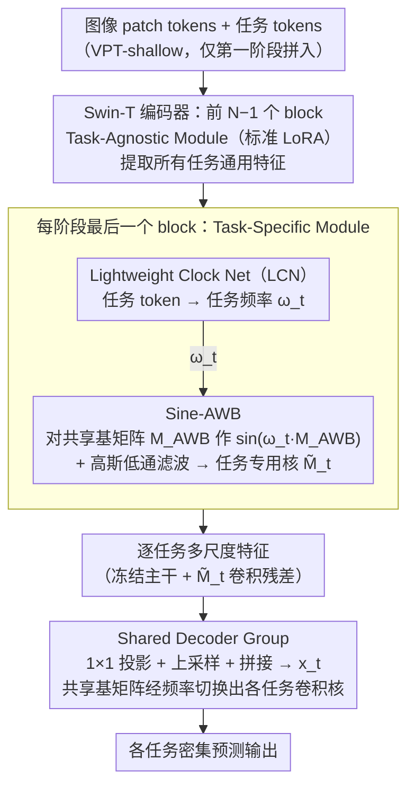

# Frequency Switching Mechanism for Parameter-Efficient Multi-Task Learning

**会议**: CVPR 2026  
**arXiv**: [2603.21111](https://arxiv.org/abs/2603.21111)  
**代码**: [https://casperliuliuliu.github.io/projects/Free-Sinewich](https://casperliuliuliu.github.io/projects/Free-Sinewich)  
**领域**: 多任务学习 / 参数高效微调  
**关键词**: 参数高效微调, 多任务学习, 频率切换, 正弦变换, LoRA

## 一句话总结
Free Sinewich 提出基于频率切换的参数高效多任务学习框架，通过对共享低秩基矩阵施加不同任务特定频率的正弦变换 $M_t = \sin(\omega_t \cdot M_{AWB})$，以接近零成本实现真正的参数复用和任务特化，在密集预测基准上以最少可训练参数达到SOTA。

## 研究背景与动机

1. **领域现状**：多任务学习(MTL)要求单一模型同时处理多个任务。参数高效微调(PEFT)如LoRA已在单任务适配中取得成功。近期PEFT-MTL方法如MTLoRA、DiTASK、TADFormer通过任务无关/任务特定适配器组合、SVD变换或动态任务滤波器来平衡共享和特化。
2. **现有痛点**：现有PEFT-MTL方法虽然宣称参数共享，但实质上是通过辅助适配器将信息路由到不同路径，形成的是"伪共享"——每个任务仍有独立参数集。缺乏真正的参数复用意味着模型无法充分利用跨任务共同知识，导致冗余计算和泛化不足。
3. **核心矛盾**：如何在保持参数效率的同时，让同一组共享权重针对不同任务表现出不同行为？
4. **本文目标** 实现真正意义上的同一参数集跨多任务复用，而非为每个任务分配独立参数。
5. **切入角度**：受神经科学启发——丘脑-皮层系统通过振荡多路复用(oscillatory multiplexing)实现选择性通信，同一神经群体通过切换振荡频率执行不同功能，实际"硬件"被复用。类比到深度网络：能否通过切换同一权重的频率响应来实现任务特定功能？
6. **核心 idea**：用任务特定频率 $\omega_t$ 对共享低秩基矩阵施加正弦变换，同一参数在不同频率下产生不同的任务特化权重。

## 方法详解

### 整体框架
这篇论文想做的是让同一组共享权重在面对不同任务时表现出不同行为，从而摆脱以往 PEFT-MTL 里"每个任务一套独立适配器"的伪共享。整体管线建在 Swin Transformer Tiny 编码器上：图像 patch tokens 前面拼上一组可学习的任务 tokens，编码器每个阶段前 N-1 个 block 走 Task-Agnostic Module（标准 LoRA）提取所有任务通用的特征，最后一个 block 换成带频率切换的 Task-Specific Module 抽任务特定特征。转换的关键发生在这个特定模块里——一个轻量 Clock Net 先从任务 token 算出一个任务专属频率 $\omega_t$，再由 Sine-AWB 用这个频率去调制一份**所有任务共享**的基矩阵，调制出来的权重才是该任务专用的。解码端同理，也用频率切换让多任务共用一份解码器基矩阵。

### 关键设计

**1. Lightweight Clock Net（LCN）：把任务 token 翻译成一个有界的调制频率**

整条管线的"开关"是任务频率 $\omega_t$——只有先有了它，后面的 Sine-AWB 才知道要把共享基矩阵"调"到哪个任务上。但正弦调制要稳，频率就不能乱飘，所以需要一个专门生成 $\omega_t$ 的小模块。LCN 就是一层 MLP，把任务 token $\boldsymbol{p}_t \in \mathbb{R}^C$ 映射成一个标量频率：

$$\omega_t = s \cdot \big(\tanh(W_q\,\text{ReLU}(\boldsymbol{p}_t)) + c\big)$$

其中 $s,c$ 是可学习的缩放与偏移。$\tanh$ 把输出限制在有界区间，正是为了稳住正弦调制的训练，避免频率过大导致映射剧烈震荡。LCN 的参数跨任务共享，真正驱动频率分化的是各任务 token 在训练中学到的差异——LCN 本身并不是性能增益的主力，它的价值在于"管住频率"这件稳定训练的脏活。

**2. Sine-AWB：用任务频率给共享基矩阵"调相"，让一份权重变出多份**

拿到 $\omega_t$ 之后，真正"变出"任务专用权重的就是 Sine-AWB，它也是全文性能增益的主力。PEFT-MTL 的老问题是想省参数就只能让任务共用一条路径、想特化就得各自加适配器，两者难兼得。Sine-AWB 的做法是先把 LoRA 的两个因子 $A,B$ 和中间卷积核 $W$ 融合成单一等效卷积核 $M_{AWB} = AWB^\top$，再对这份融合后的矩阵施加任务特定频率的正弦变换：

$$M_t = \sin(\omega_t \cdot M_{AWB})$$

由于 Sine-LoRA 已证明正弦映射能显著抬高低秩矩阵的有效秩，不同的 $\omega_t$ 对应不同的正弦波、给出不同的非线性映射 $\mathcal{F}_{\omega_t}$，于是同一份 $M_{AWB}$ 被映射到各任务各自的权重空间里，真正实现了参数复用而非复制。这里有个容易踩坑的数学细节决定了"先融合再正弦"的顺序：因为 $\sin(AWB) \neq \sin(A)\sin(W)\sin(B)$，正弦并不满足乘法同态，只有在融合成单一矩阵后再施加，才能保住有效秩的扩展。最后再用一个高斯低通滤波器（$K=7,\ \sigma=1$）平滑 $M_t$ 得到 $\widetilde{M}_t$，压掉正弦引入的高频噪声，这个 $\widetilde{M}_t$ 再以逐通道卷积的形式加到冻结主干的输出上（$\boldsymbol{f}_{i+1}^t = \Phi_i(\boldsymbol{f}_i^t) + \widetilde{M}_t * \boldsymbol{f}_i^t$，形式同 LoRA）；而中间那层卷积核 $W$ 则为密集预测任务注入了必要的空间先验。

**3. Shared Decoder Group：把频率切换搬到解码端，省掉成倍增长的解码器**

传统多任务做法给每个任务 $t$ 配一个独立解码器 $\phi_t$，参数量随任务数线性膨胀——光 HRNet 解码器的第一层卷积就超过百万参数，T 个任务就是 T 倍开销。这里把同一套频率切换搬过来：共享一份 $M_{AWB}$，靠任务频率调制出各自的卷积核去做解码，

$$\boldsymbol{h}_t = \widetilde{M}_t * \boldsymbol{x}_t + \boldsymbol{b}_t$$

只为每个任务保留一个特定偏置 $\boldsymbol{b}_t$ 和后续的 BN-ReLU-Conv。这样多任务解码器从"T 套完整卷积"压成"一组基矩阵 + T 个频率标量 + T 个偏置"，开销几乎与任务数无关。

### 损失函数 / 训练策略
训练用标准多任务加权目标 $\mathcal{L}_{MTL} = \sum_t w_t \mathcal{L}_t$，任务权重和各任务损失沿用先前工作的设定。只有 TA-Module（LoRA）和 TS-Module（Sine-AWB + LCN）可训练，编码器主体保持冻结；任务 tokens 只在第一个 Transformer 阶段引入（VPT-shallow 策略）。

## 实验关键数据

### 主实验 (PASCAL-Context, Swin-T ImageNet-1K)

| 方法 | SemSeg↑ | Human Parts↑ | Saliency↑ | Normals(rmse)↓ | Δm(%)↑ | 参数(M) |
|------|---------|-------------|-----------|----------------|--------|---------|
| Single Task | 67.21 | 61.93 | 62.35 | 17.97 | 0 | 112.62 |
| MTLoRA (r=64) | 67.90 | 59.84 | 65.40 | 16.60 | +2.55 | 8.34 |
| TADFormer (r=64) | 70.82 | 60.45 | 65.88 | 16.48 | +4.24 | 7.38 |
| **Free Sinewich (r=64)** | **71.25** | **61.38** | **66.24** | **16.14** | **+5.39** | **6.53** |
| **Free Sinewich (r=32)** | **71.02** | **60.75** | **65.94** | **16.44** | **+4.51** | **4.04** |

### 消融实验

| 配置 | SemSeg↑ | Human Parts↑ | Saliency↑ | Normals↓ | Δm(%)↑ | 参数(M) |
|------|---------|-------------|-----------|----------|--------|---------|
| Free Sinewich (完整) | 71.25 | 61.38 | 66.24 | 16.14 | +5.39 | 6.53 |
| w/o LCN | 70.83 | 61.37 | 66.09 | 16.17 | +5.12 | 6.51 |
| w/o Low-pass filter | 70.95 | 61.33 | 65.44 | 16.22 | +4.82 | 6.53 |
| w/o Sine | 69.68 | 60.69 | 64.91 | 16.37 | +3.67 | 6.53 |
| Shared Base | 71.25 | 61.38 | 66.24 | 16.14 | +5.39 | 6.53 |
| Independent Base | 70.81 | 61.56 | 65.42 | 16.09 | +5.03 | 10.22 |
| Independent Decoder | 70.91 | 61.57 | 66.03 | 16.10 | +5.31 | 7.41 |

### 关键发现
- **Sine变换是核心驱动力**：移除后Δm从+5.39降至+3.67，下降最大(-1.72)，证明频率切换机制是性能增益的主要来源
- **共享基矩阵优于独立基矩阵**：Shared Base（+5.39, 6.53M）vs Independent Base（+5.03, 10.22M），参数更少性能更好，证实真正的参数复用带来了正则化效果
- **r=32的Free Sinewich(+4.51)已超越r=64的TADFormer(+4.24)**，参数仅4.04M vs 7.38M，频率调制弥补了秩降低
- LCN和低通滤波器贡献较小但有稳定作用
- 共享解码器(HRNet)配置下，Free Sinewich的解码器参数仅1.07M(TADFormer需1.94M)
- NYUDv2上r=64达到-0.52 Δm，几乎匹配全量微调效果

## 亮点与洞察
- **脑科学启发的频率复用思路**：将振荡多路复用的神经科学原理迁移到参数共享设计中，同一参数在不同频率下"振荡"出不同功能，概念优雅且直觉清晰
- **"先融合再正弦"的数学洞察**：正弦函数非乘法同态这一数学性质决定了必须在融合AWB后才能正确提升有效秩，这一细节处理非常关键
- **真正的参数复用验证**：通过Shared vs Independent Base消融实验，清楚地证明了共享效果 > 独立效果，打破了"独立参数更灵活"的直觉

## 局限与展望
- 当前频率 $\omega_t$ 为全局标量，对所有层和空间位置一致。作者提到学习空间/时间变化的频率是未来方向
- 在NYUDv2上性能略低于单任务基线(Δm=-0.52)，说明对包含深度和边缘等异构任务的场景仍有提升空间
- 正弦变换引入的非线性可能在某些任务组合下导致优化困难
- 仅在Swin Transformer上验证，ViT和CNN backbone的效果有待探索

## 相关工作与启发
- **vs MTLoRA**: MTLoRA将LoRA分为任务无关和任务特定分支，每个任务仍有独立参数；Free Sinewich通过频率切换实现同一参数集的真正复用
- **vs TADFormer**: TADFormer用动态任务滤波器条件化卷积层，需要更多参数(7.38M vs 6.53M)且"伪共享"；Free Sinewich参数更少性能更好
- **vs Sine-LoRA**: Sine-LoRA用正弦提升单任务LoRA的有效秩；Free Sinewich将正弦的频率参数化，使同一基矩阵服务于多任务
- **vs DiTASK**: DiTASK通过SVD奇异值的可微变换实现任务适配；Free Sinewich在输出空间直接施加正弦调制，更简洁

## 评分
- 新颖性: ⭐⭐⭐⭐⭐ 频率切换实现参数复用的思路具有原创性，脑科学类比虽然是辅助性的但增加了直觉吸引力
- 实验充分度: ⭐⭐⭐⭐ 两个基准、多种消融(组件/共享方式/解码器/秩)、与大量基线对比，但NYUDv2上仍为负Δm
- 写作质量: ⭐⭐⭐⭐ 方法动机链清晰，数学公式推导完整，消融设计有针对性
- 价值: ⭐⭐⭐⭐ 对PEFT-MTL领域贡献显著，"真正参数复用"的论证有启发性，可推广到其他多任务场景

<!-- RELATED:START -->

## 相关论文

- [\[CVPR 2025\] TADFormer: Task-Adaptive Dynamic Transformer for Efficient Multi-Task Learning](../../CVPR2025/model_compression/tadformer_task-adaptive_dynamic_transformer_for_efficient_multi-task_learning.md)
- [\[CVPR 2026\] Parallax to Align Them All: An OmniParallax Attention Mechanism for Distributed Multi-View Image Compression](parallax_to_align_them_all_an_omniparallax_attention_mechanism_for_distributed_m.md)
- [\[CVPR 2025\] Expert Pyramid Tuning: Efficient Parameter Fine-Tuning for Expertise-Driven Task Allocation](../../CVPR2025/model_compression/expert_pyramid_tuning_efficient_parameter_fine-tuning_for_expertise-driven_task_.md)
- [\[ACL 2026\] SAMoRA: Semantic-Aware Mixture of LoRA Experts for Task-Adaptive Learning](../../ACL2026/model_compression/samora_semantic-aware_mixture_of_lora_experts_for_task-adaptive_learning.md)
- [\[ACL 2025\] C3A: Parameter-Efficient Fine-Tuning via Circular Convolution](../../ACL2025/model_compression/parameter-efficient_fine-tuning_via_circular_convolution.md)

<!-- RELATED:END -->
