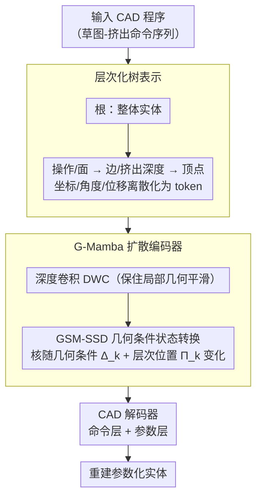

# GeoFusion-CAD: Structure-Aware Diffusion with Geometric State Space for Parametric 3D Design

**会议**: CVPR 2026  
**arXiv**: [2603.21978](https://arxiv.org/abs/2603.21978)  
**代码**: [https://github.com/](https://github.com/) (待发布)  
**领域**: 模型压缩  
**关键词**: CAD生成, 扩散模型, 状态空间模型, Mamba, 层次化树表示

## 一句话总结

本文提出 GeoFusion-CAD，一个端到端的扩散框架，通过将 CAD 程序编码为层次化树结构并引入几何感知的 G-Mamba 块（线性时间复杂度）替代二次复杂度的 Transformer，实现了对长序列参数化 CAD 程序的可扩展和结构感知生成，在新构建的 DeepCAD-240（最长240步命令）基准上大幅超越 Transformer 方法。

## 研究背景与动机

1. **领域现状**：参数化 CAD 建模是现代3D设计的基础。当前主流方法将 CAD 程序视为结构化语言，使用 Transformer 编解码器进行自回归生成。Sketch-Extrusion（SE）范式通过顺序生成 2D 草图和挤出操作来构建 3D 实体，保持参数约束和设计意图。
2. **现有痛点**：Transformer 架构面临两个核心问题：(a) **二次复杂度** — $\mathcal{O}(L^2d)$ 的自注意力在 CAD 程序扩展到数百条命令时变得不可承受，多数方案只能将长序列切分为短片段或在潜在空间分阶段训练，破坏了端到端优化；(b) **缺乏层次感知** — 全局注意力平等对待所有 token，忽略了 CAD 数据的层次组织（草图、面、边、顶点之间存在严格的拓扑依赖），稀释了局部几何关系。
3. **核心矛盾**：CAD 程序本质上是层次化和结构化的——局部特征必须在全局设计上下文中保持一致。均匀的全局注意力无法平衡全局上下文建模与局部结构保真度，导致长结构化 CAD 序列中几何推理出现不连续性和一致性降低。
4. **本文目标** (a) 如何以线性时间复杂度建模 CAD 序列的长程依赖？(b) 如何在生成过程中保持几何和拓扑一致性？(c) 如何端到端处理长达 240 步的 CAD 程序？
5. **切入角度**：状态空间模型（如 Mamba）可以实现线性时间复杂度，但其刚性的顺序扫描限制了对层次化拓扑依赖的建模。作者观察到 CAD 数据具有天然的树状层次结构，可以将几何归纳偏置注入状态空间转换中。
6. **核心 idea**：设计几何条件化的状态空间转换（G-Mamba），将 CAD 的层次树结构嵌入到通过选择性状态转换驱动的扩散去噪过程中，以 $\mathcal{O}(Ld)$ 复杂度实现结构感知的 CAD 生成。

## 方法详解

### 整体框架

GeoFusion-CAD 将 CAD 程序表示为层次化树，根节点对应整体实体模型，子节点代表草图和挤出操作，从上到下经过三层——操作/面、边/挤出深度、顶点。输入 CAD 序列经过几何嵌入后，由 G-Mamba 扩散编码器进行层次化特征去噪，最后通过 CAD 解码器（命令层 + 参数层）重建参数化实体。整个流程端到端训练，无需分阶段优化。（第 3 个关键设计 DeepCAD-240 是配套的长序列评测基准，不在下面的数据流图里。）

### 关键设计

**1. 层次化树表示：把 CAD 程序的拓扑依赖编码成不重复的树，喂给扩散生成**

痛点在于全局注意力把所有 token 平等对待，CAD 数据本身却有严格的拓扑层级——草图里的曲线属于环路、环路围成面、面组成草图，这层结构一旦被拉平就丢了局部几何关系。GeoFusion-CAD 干脆把整个 CAD 程序组织成一棵树：根节点是整体实体，往下依次是操作/面、边/挤出深度、顶点三层。每个草图节点编码成一个特征向量，几何用离散 2D 坐标 $(p_x, p_y)$ 参数化，再用终止符号 $e_c, e_l, e_f, e_s$ 分别标记曲线、环路、面、草图的边界；挤出节点则带上方向角 $(\theta, \phi, \gamma)$、位移 $(\tau_x, \tau_y, \tau_z)$、缩放 $\sigma$、挤出距离 $(d_+, d_-)$ 和操作类型 $\beta$，全部离散化成 token 序列。和以往"复制节点来表示共享边"的做法不同，这棵树不靠重复就能保持连接性，完整保留了程序的设计历史，也让 Sketch-Extrusion 表示天然适配扩散式生成。

**2. G-Mamba 扩散编码器：把几何和层次条件注入状态空间转换，用线性复杂度换结构感知**

直接拿原始 Mamba 替换 Transformer 并不够——Mamba 的状态转换矩阵全局共享，对 CAD 这种异构几何、多层拓扑的模式不敏感，刚性的顺序扫描建不出树状依赖。G-Mamba 的做法是在选择性状态空间（SSD）层里塞进一个几何状态混合器（GSM），组成 GSM-SSD 模块。输入特征先过深度卷积（DWC）保住局部几何的平滑性，再进入几何条件化的状态转换：转换核不再是固定矩阵，而是由几何条件向量 $\Delta_k = g(s_k, d_k, r_k)$（编码局部尺度 $s_k$、CAD 树中的层次深度 $d_k$、局部曲率 $r_k$）和层次化位置嵌入 $\Pi_k = \text{PE}(p_k, \sigma_k, \tau_k)$（编码父类型、兄弟索引、拓扑角色）一起决定。状态按下式逐步推进：

$$h_{k+1} = \bar{A}_k h_k + \bar{B}_k Z_k^c, \qquad Z_{k+1}^c = C_k h_k + G_k Z_k^c$$

其中转换核 $\{\bar{A}_k, \bar{B}_k, C_k, G_k\}$ 都随当前节点的几何与层次条件变化。这样一来，状态空间的动力学就和 CAD 的多层拓扑对齐了，既守住 $\mathcal{O}(Ld)$ 的线性复杂度，又拿回了 Transformer 才有的结构感知能力。

**3. DeepCAD-240 扩展基准：把长序列 CAD 生成的测试场景拉到 240 步**

原始 DeepCAD 基准最长只有 60 步命令，而真实工程里的 CAD 程序常常远超这个长度，短基准根本测不出长序列生成的退化问题。作者在 DeepCAD 之上构建 DeepCAD-240，把最大命令长度从 60 扩到 240，同时保持原有的 Sketch-Extrusion 语义和分词协议，只是引入更丰富的层次依赖和更长的几何上下文。这个更硬的测试场景正好暴露 Transformer 方法在长序列上的崩塌，也是后面 G-Mamba 优势能被量化出来的前提。

### 损失函数 / 训练策略

联合训练目标：$\mathcal{L}_{total} = \underbrace{E_{t,Z_0,\epsilon_t}[\|\hat{\epsilon}_t - \epsilon_\theta(\cdot)\|^2]}_{\text{扩散噪声预测}} + \underbrace{\sum_{i=1}^N[CCE(\hat{c}_i, c_i) + \eta \sum_{j=1}^M ACE(\hat{a}_{i,j}, a_{i,j})]}_{\text{命令和参数监督}}$

第一项确保潜在几何特征的准确去噪，第二项在命令和参数两个层面约束程序生成的正确性。系数 $\eta$ 平衡参数监督相对于命令预测的权重。

## 实验关键数据

### 主实验

**DeepCAD 短序列（<60 命令）测试：**

| 方法 | ACC_cmd | ACC_param | COV↑ | MMD↓ | JSD↓ |
|------|---------|-----------|------|------|------|
| DeepCAD | 92.4 | 89.2 | 78.1 | 1.72 | 3.98 |
| HNC-CAD | 95.4 | 93.8 | 82.3 | 1.33 | 3.24 |
| **GeoFusion-CAD** | **99.3** | **97.6** | **85.6** | **0.95** | **2.51** |

**DeepCAD-240 长序列（40-240 命令）测试：**

| 方法 | ACC_cmd | ACC_param | COV↑ | MMD↓ | JSD↓ | Memory | FLOPs |
|------|---------|-----------|------|------|------|--------|-------|
| DeepCAD | 75.2 | 72.5 | 64.5 | 1.85 | 4.09 | 8197MiB | 52.8G |
| HNC-CAD | 82.8 | 78.5 | 71.2 | 1.71 | 3.81 | 10342MiB | 87.3G |
| **GeoFusion-CAD** | **91.2** | **89.3** | **73.9** | **1.12** | **2.97** | **5198MiB** | **34.6G** |

GeoFusion-CAD 在长序列上命令准确率超 HNC-CAD 8.4 个百分点，同时内存减半、FLOPs 减少 60%。

### 消融实验

| 配置 | ACC_cmd | ACC_param | COV↑ | MMD↓ | JSD↓ | 说明 |
|------|---------|-----------|------|------|------|------|
| Full model | 91.2 | 89.3 | 73.9 | 1.12 | 2.97 | 完整模型 |
| w/o Tree | 87.5 | 84.6 | 69.4 | 1.46 | 3.25 | 去掉层次编码，-3.7 cmd |
| MLP替代 | 75.3 | 72.1 | 67.8 | 1.73 | 3.81 | 性能严重下降 |
| Transformer替代 | 82.6 | 81.3 | 69.1 | 1.55 | 3.67 | 二次复杂度但精度更低 |
| Vanilla Mamba替代 | 89.2 | 87.6 | — | — | — | 无几何条件化，略差 |

### 关键发现

- **层次树表示至关重要**：去掉后 ACC_cmd 从 91.2 降至 87.5，COV 从 73.9 降至 69.4，说明层次结构对保持长程几何依赖和拓扑一致性不可或缺
- **G-Mamba 优于 Transformer 和 vanilla Mamba**：Transformer 替代版 MMD 从 1.12 升至 1.55，JSD 从 2.97 升至 3.67，说明几何状态空间扩散能更好地稳定长序列建模
- **计算效率优势显著**：仅需 5198MiB 内存和 34.6G FLOPs，分别是 HNC-CAD 的 50% 和 40%，实现了效率与精度的良好平衡
- Transformer 方法在长序列上性能退化明显（DeepCAD 从短序列的 92.4 降至长序列的 75.2），而 GeoFusion-CAD 退化幅度小得多

## 亮点与洞察

- **将 SSM 的线性效率与 CAD 的层次结构完美结合**：G-Mamba 不是简单地用 Mamba 替换 Transformer，而是通过几何条件化转换核将 CAD 的树状拓扑关系注入状态空间动力学中。这种设计既保持了 $\mathcal{O}(Ld)$ 复杂度，又获得了层次感知能力
- **端到端单阶段训练**：之前的方法需要分别训练命令和参数流，GeoFusion-CAD 将两者统一在一个扩散框架中，避免了分阶段训练导致的特征不对齐和信息损失
- **DeepCAD-240 基准的贡献**：为长序列 CAD 生成研究提供了标准化评测，将最大命令长度从 60 扩展到 240，更接近实际工程需求
- 几何条件向量（尺度+深度+曲率）和层次位置嵌入（父类型+兄弟索引+拓扑角色）的设计可迁移到其他具有层次结构的序列建模任务

## 局限与展望

- **仅限 Sketch-Extrusion 范式**：未支持 B-Rep（边界表示）等其他 CAD 建模范式，限制了几何表达能力
- **DeepCAD-240 数据集的代表性**：源自 ABC 数据集，可能无法完全代表工业级 CAD 设计的复杂度
- **条件生成未涉及**：当前仅支持无条件生成，缺乏基于文本描述或图像的条件化 CAD 生成
- **可视化结果中仍存在微小边界不规则**：尽管整体优于 baseline，复杂曲面的精细几何仍有改进空间
- 未来可探索将 G-Mamba 扩展到条件化 CAD 编辑和逆向工程任务

## 相关工作与启发

- **vs DeepCAD**：DeepCAD 使用 Transformer 编解码器，长序列性能急剧下降（ACC_cmd 从 92.4 降至 75.2）。GeoFusion-CAD 在长序列上保持 91.2 的命令准确率，同时内存更低
- **vs HNC-CAD**：HNC-CAD 是当前最强的 Transformer 方法，在短序列上 ACC_cmd 95.4。GeoFusion-CAD 在短序列上达到 99.3（+3.9），长序列上达到 91.2 vs 82.8（+8.4），优势随序列长度增加而扩大
- **vs BrepGen**：BrepGen 将扩散应用于 B-Rep 生成但仍受困于长程一致性。GeoFusion-CAD 通过层次树表示和 G-Mamba 解决了这一问题

## 评分

- 新颖性: ⭐⭐⭐⭐ G-Mamba的几何条件化设计有创新性，但层次树表示和扩散生成本身不算全新
- 实验充分度: ⭐⭐⭐⭐ 短长序列全面对比，消融完整，新建了240基准，但缺少条件生成评估
- 写作质量: ⭐⭐⭐⭐ 结构清晰，但部分细节留在补充材料影响了可读性
- 价值: ⭐⭐⭐⭐ 为长序列CAD生成提供了高效可扩展的方案，G-Mamba设计思路有参考价值

<!-- RELATED:START -->

## 相关论文

- [\[CVPR 2026\] PlanaReLoc: Camera Relocalization in 3D Planar Primitives via Region-Based Structure Matching](planareloc_camera_relocalization_in_3d_planar_primitives_via_region-based_struct.md)
- [\[ICML 2025\] Parameter-Efficient Fine-Tuning of State Space Models](../../ICML2025/model_compression/parameter-efficient_fine-tuning_of_state_space_models.md)
- [\[ACL 2025\] State-offset Tuning: State-based Parameter-Efficient Fine-Tuning for State Space Models](../../ACL2025/model_compression/state_offset_tuning_ssm_peft.md)
- [\[CVPR 2026\] On the Robustness of Diffusion-Based Image Compression to Bit-Flip Errors](on_the_robustness_of_diffusion-based_image_compression_to_bit-flip_errors.md)
- [\[CVPR 2025\] Mamba-Adaptor: State Space Model Adaptor for Visual Recognition](../../CVPR2025/model_compression/mamba-adaptor_state_space_model_adaptor_for_visual_recognition.md)

<!-- RELATED:END -->
