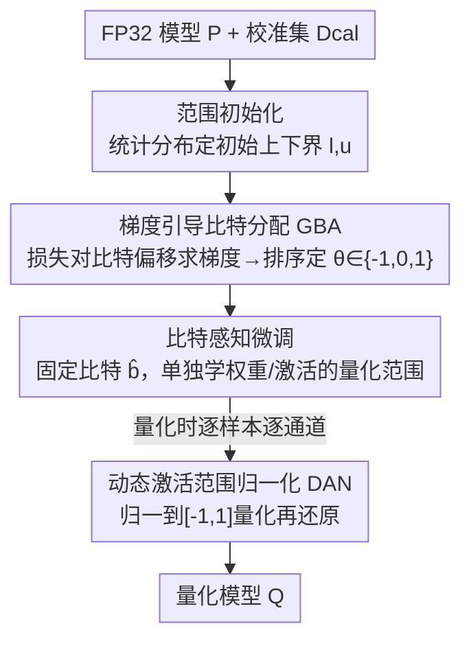

# Gradient Knows Best: Mixed-Precision Quantization via Gradient-Guided Bit Allocation for Super-Resolution

**会议**: CVPR 2026  
**论文**: [CVF Open Access](https://openaccess.thecvf.com/content/CVPR2026/html/Kim_Gradient_Knows_Best_Mixed-Precision_Quantization_via_Gradient-Guided_Bit_Allocation_for_CVPR_2026_paper.html)  
**代码**: 待确认  
**领域**: 模型压缩  
**关键词**: 超分辨率, 混合精度量化, 训练后量化, 梯度引导比特分配, 激活归一化  

## 一句话总结
针对超分（SR）模型的训练后混合精度量化，本文不再用激活标准差这种静态统计去估计逐层量化敏感度，而是直接拿"损失对比特宽度的梯度"来排序分配比特，再配一个非学习的动态激活归一化（DAN）解决 SR 去掉 BN 后激活范围漂移的问题，在 Urban100 上比此前 PTQ-MPQ 方法 PSNR 高 1.26 dB，3-bit EDSR×4 量化耗时还快了 1.9 倍。

## 研究背景与动机
**领域现状**：深度 SR 模型重建质量越来越好，但深度和通道数也越来越大，难以塞进手机、边缘设备这类算力/内存受限的平台。量化是主流的轻量化手段，把浮点权重和激活近似成定点整数。其中混合精度量化（MPQ）给不同层分配不同比特宽度，在算力和重建质量之间取平衡；训练后量化（PTQ）则只用一小撮校准集、不用全量重训，压缩速度快，是部署侧更实用的路线。

**现有痛点**：把 MPQ 和 PTQ 结合起来用在 SR 上时，此前最好的方法（AdaBM）有两个硬伤。其一，它用**激活的标准差**当量化敏感度的代理——假设标准差越大量化误差越大、就给越多比特。但激活函数会产生离群值和不对称分布，把标准差带偏；论文 Fig.2 直接用 SQNR（信号量化噪声比，越高量化损失越小）画了对照，发现标准差和真实量化误差**根本不成正相关**，这种静态统计既抓不住"改变比特宽度会让重建损失怎么变"，也忽略了层间依赖，分出来的比特不是全局最优。其二，SR 模型为了保高频细节通常**去掉 BN**，导致每一层的激活范围会随输入样本剧烈波动，而量化用的是固定范围，固定范围套在漂移的分布上会造成严重裁剪、掉点厉害。

**核心矛盾**：量化敏感度的真相是"比特宽度变化引起的重建损失变化 + 层间依赖"，但静态统计量（标准差）只能看单层的分布形状，看不到这个真相；而去掉 BN 换来的高频细节，又和固定量化范围天然冲突。

**本文目标与切入角度**：既然要的是"损失对比特的敏感度"，那就**直接对比特宽度求梯度**——梯度天生就携带"这一层多给/少给比特，损失会怎么动"以及跨层耦合的信息。范围漂移问题则不靠重新引入 BN（会毁 SR 质量），而是在量化时按样本、按通道临时把激活归一化进固定区间、量化完再还原。

**核心 idea**：用"损失对逐层比特宽度的梯度"取代"激活标准差"来分配比特，并用一个免训练的动态激活范围归一化（DAN）补上去 BN 带来的范围不稳。

## 方法详解

### 整体框架
方法是一条三阶段串行的 PTQ-MPQ 流水线，输入是预训练好的 FP32 模型 $\mathcal{P}$ 和一个 100 张 LR 图的校准集 $\mathcal{D}_{cal}$，输出是逐层比特已定、量化范围已调好的量化模型 $\mathcal{Q}$，全程**不需要 GT 监督**（用 $\mathcal{P}$ 自己的输出当老师）。

三个阶段是：① **范围初始化**——把校准集喂给 $\mathcal{P}$，统计每层权重/激活的分布，定下初始的量化上下界 $l_k^{(*)}, u_k^{(*)}$，并据此搭出初始量化模型 $\mathcal{Q}$；② **梯度引导比特分配（GBA）**——固定量化范围，给每层挂一个可学习的连续比特偏移 $s_k$，反传时累计损失对 $s_k$ 的梯度 $g_k$ 来度量该层敏感度，排序后把 $s_k$ 映成离散偏移 $\theta_k\in\{-1,0,1\}$，加到基准比特 $b_{base}$ 上得到每层最终比特 $\hat b_k$；③ **比特感知微调**——固定 $\hat b_k$，把量化上下界 $[l_k,u_k]$ 当可学习参数，对权重和激活分别优化范围，少量 epoch 收敛。其中第三阶段的量化过程里始终套着 **DAN** 来抵消激活范围的样本间漂移。

为了让量化操作可反传，全程用 **fake quantization**（伪量化）：前向时模拟量化损失、反向时保留梯度流，伪量化值为

$$\hat{x} = \Delta \cdot \mathrm{round}\Big(\frac{\mathrm{clip}(x, l, u) - l}{\Delta}\Big) + l, \quad \Delta = \frac{u - l}{2^{b} - 1}$$

### 关键设计

**1. 梯度引导比特分配（GBA）：用损失对比特的梯度排敏感度，而非激活标准差**

这一招直击"静态统计估不准敏感度"的痛点。核心是给每层 $k$ 引入一个**可学习的连续比特偏移** $s_k^{(*)}$（$*\in\{w,a\}$，区分权重和激活），它本身不真的改变量化用的比特，只当"敏感度探针"。优化目标用的是量化模型和 FP32 老师之间的重建+特征对齐损失：

$$\mathcal{L}_{grad} = \mathcal{L}_{rec} + \lambda_{feat}\,\mathcal{L}_{feat}$$

其中 $\mathcal{L}_{rec}$ 是两者输出的 $L_1$ 损失，$\mathcal{L}_{feat}$ 是逐块中间特征做 L2 归一后的 MSE 对齐损失。由于离散比特 $\theta_k$ 不可导，作者借 STE（直通估计器）让前向走 $\theta_k=\mathrm{round}(s_k)$、反向走 $\theta_k=\tanh(s_k)$ 保持梯度连续。每层的敏感度信号定义为跨 mini-batch 累计平均的梯度

$$g_k^{(*)} = \frac{1}{T}\sum_{t=1}^{T}\frac{\partial \mathcal{L}_{grad}}{\partial s_{k,t}^{(*)}}$$

直觉是：$g_k$ 越小，说明当前比特宽度**不足以**继续压低损失，这层就更需要高比特，反之亦然。于是把所有层的 $g_k$ 降序排出排名 $r_k\in\{0,\dots,K-1\}$，再线性映射回连续偏移

$$s_k^{(*)} = 2\cdot\frac{r_k}{K-1+\varepsilon} - 1 \in [-1, +1]$$

最后送进前向的 round 得到离散偏移 $\theta_k^{(*)}\in\{-1,0,1\}$，加到基准比特上：$\hat b_k^{(*)} = b_{base}^{(*)} + \theta_k^{(*)}$。这样 $g_k$ 最小（最缺比特）的层排名靠前、拿到 +1，最不敏感的层拿到 -1，比特就按真实的损失敏感度而非分布形状来分。相比标准差法，梯度天然包含了"改比特→损失怎么变"和层间耦合，因此分配更贴近全局最优，且因为只是排序+离散偏移、收敛很快。

**2. 比特感知微调：比特定死后，只学量化范围，权重激活各自调**

GBA 解决了"每层给几比特"，但初始的量化上下界还是靠分布统计粗定的，不一定最优。这一阶段**冻结**每层比特 $\hat b_k^{(*)}$，转而把量化范围 $[l_k^{(*)}, u_k^{(*)}]$ 当可学习参数，用与 GBA 同形的微调损失 $\mathcal{L}_{FT}=\mathcal{L}_{rec}+\lambda_{feat}\mathcal{L}_{feat}$ 去逼近老师的输出和中间特征。关键点是**权重和激活的范围分开优化**，让每层在它被分到的比特预算内取得尽可能好的量化表示，把量化误差压到最低。由于比特已固定、只剩范围这几个连续参数要调，所以只需很少的 epoch（实验里 2 个）就收敛，这也是它比需要全量重训的 QAT 快几千倍的原因之一。

**3. 动态激活范围归一化（DAN）：去 BN 后用免训练的逐样本逐通道归一抵消范围漂移**

这条专治第二个痛点——SR 去掉 BN 后激活范围随输入剧烈波动，固定量化范围会过度裁剪、丢细节。DAN 是一个**非学习**的预处理：量化前把激活临时归一化进 $[-1,1]$，量化后再精确还原回原尺度，相当于"按当前这张图、当前这个通道的真实动态范围来量化"，而不是用一刀切的固定范围。具体三步，对激活 $x^{n,c}$（$n$ 为样本、$c$ 为通道索引）用逐通道的最小/最大值归一：

$$\tilde{x}^{n,c} = \frac{2\big(x^{n,c} - x_{\min}^{n,c}\big)}{x_{\max}^{n,c} - x_{\min}^{n,c}} - 1$$

再量化 $\hat{x}^{n,c} = Q(\tilde{x}^{n,c})$，最后反归一化还原尺度：

$$x_q^{n,c} = \frac{\hat{x}^{n,c} + 1}{2}\cdot\big(x_{\max}^{n,c} - x_{\min}^{n,c}\big) + x_{\min}^{n,c}$$

它和 BN 的区别在于：BN 是带学习参数、会改变激活值统计（对 SR 是有害的），DAN 则是免训练、量化后能精确复原原尺度，所以"只帮量化、不伤重建"。额外好处是把每个通道先对齐到统一区间，避免了某些通道被过度裁剪、另一些通道又用不满精度的失衡情况。

### 损失函数 / 训练策略
全程无 GT，用 FP32 模型 $\mathcal{P}$ 的输出做自监督。GBA 与微调共用 $\mathcal{L}_{rec}+\lambda_{feat}\mathcal{L}_{feat}$（$\lambda_{feat}=10$）。三阶段（范围初始化 / GBA / 比特感知微调）的 batch size 分别为 16 / 2 / 2，epoch 为 1 / 2 / 2；GBA 学习率 0.1、微调学习率 0.01，均用 Adam。校准集为 DIV2K 训练集中随机采的 100 张 LR 图。候选比特偏移取 $\{-1,0,1\}$（附录 D 消融验证）。

## 实验关键数据

### 主实验
在 ×4 SR、4-bit/3-bit 设置下对比 PTQ 方法（W/A 为权重/激活比特，MP 表示是否混合精度）。本文 ⋆ 表示权重和激活都用 MP（AdaBM 默认只对激活用 MP，AdaBM⋆ 为公平起见补成两者都 MP）。

| 模型 / 设置 | 方法 | W/A | 耗时 | Urban100 PSNR | Set5 PSNR |
|------|------|-----|------|------|------|
| EDSR ×4 4-bit | AdaBM (CVPR'24) | 4/4MP | 50 s | 25.36 | 31.19 |
| EDSR ×4 4-bit | **本文⋆** | 4MP/4MP | **26 s** | **25.61** | **31.67** |
| EDSR ×4 3-bit | AdaBM | 3/3MP | 50 s | 23.63 | 29.14 |
| EDSR ×4 3-bit | **本文⋆** | 3MP/3MP | **26 s** | **24.79** | **30.68** |
| RDN ×4 4-bit | AdaBM | 4/4MP | 167 s | 23.44 | 28.76 |
| RDN ×4 4-bit | **本文⋆** | 4MP/4MP | 87 s | **25.87** | **31.83** |

RDN ×4 的 4-bit 上，本文比 AdaBM 在 Urban100 高 **2.43 dB**、BSD100 高 1.37 dB；3-bit EDSR 只需 26 秒（两个 epoch 微调）。Transformer 架构的 SwinIR 上（只量化注意力/MLP 里的 FC 与 linear 层，沿用 2DQuant 设置）：

| 方法 | W/A | 耗时 | Set5 PSNR | Urban100 PSNR |
|------|-----|------|------|------|
| 2DQuant (NeurIPS'24) | 4/4 | 2 hrs | 31.77 | 25.71 |
| AdaBM | 4/4MP | 133 s | 31.64 | 25.24 |
| **本文⋆** | 4MP/4MP | **73 s** | **32.15** | 25.73 |

本文在 Set5 上比 2DQuant 高 0.38 dB，且 73 秒 vs 2 小时，跨 CNN/Transformer 都成立。对比 QAT-MPQ（CADyQ/CABM 需 GT、16–30 小时）时，本文无 GT、20 秒完成，且低比特下优势更大（Test2K 上 4-bit 比 CABM 高 0.05 dB、3-bit 高 0.10 dB）。

### 消融实验
EDSR、4-bit ×4，逐项叠加 weight-GBA / activation-GBA / DAN（括号为相对全关基线的增减）：

| Weight GBA | Act GBA | DAN | Set5 PSNR | Urban100 PSNR |
|:--:|:--:|:--:|------|------|
| ✗ | ✗ | ✗ | 29.06 | 23.54 |
| ✓ | ✗ | ✗ | 29.54 (+0.48) | 24.35 (+0.81) |
| ✗ | ✓ | ✗ | 31.16 (+2.10) | 25.35 (+1.81) |
| ✗ | ✗ | ✓ | 31.21 (+2.15) | 25.36 (+1.82) |
| ✗ | ✓ | ✓ | 31.52 (+2.46) | 25.57 (+2.03) |
| ✓ | ✓ | ✓ | **31.67 (+2.61)** | **25.61 (+2.07)** |

### 关键发现
- **激活侧贡献远大于权重侧**：单开 activation-GBA 就给 Urban100 +1.81 dB，而单开 weight-GBA 只有 +0.81 dB。原因是激活动态范围更宽、又随输入分布变化，天生比权重更怕量化误差，所以把比特和范围这两件事在激活上做对收益最大。
- **DAN 与 GBA 互补**：单开 DAN 也能 +1.82 dB（说明范围漂移本身就是大头），叠在 activation-GBA 上还能再涨（25.35→25.57），weight-GBA 再补最后一截到 25.61。
- **速度优势来自 PTQ + 只调范围**：比特由排序一次性定死、微调只学少量范围参数，所以相对 AdaBM 同精度更快、相对 QAT 快几千倍，且低比特（3-bit）下与对手的差距进一步拉大。

## 亮点与洞察
- **"对比特宽度求梯度"这个视角很巧**：比特是离散的、本来不可导，作者用连续偏移 $s_k$ + STE（前向 round、反向 tanh）把它变成可反传的探针，让梯度去回答"这层该多给还是少给比特"，比拿标准差猜要直接得多——这套"把离散超参连续化当敏感度探针"的思路可迁移到剪枝率、通道数等其他离散资源分配上。
- **DAN 是个零训练成本的小补丁但收益不小**：它本质是"逐样本逐通道的 min-max 动态范围 + 量化后精确反归一"，专门补 SR 去 BN 的坑，单独就值 +1.82 dB，且不增加任何可学习参数，部署友好。
- **无 GT 的自蒸馏式 PTQ**：全程用 FP32 模型当老师做重建+特征对齐，省掉了 QAT 对全量带标注数据和长时训练的依赖，把混合精度量化压到秒级，是面向真实部署的实用性亮点。

## 局限与展望
- 方法和评测都绑定在 SR 这一低层视觉任务上（DAN 的动机就来自"SR 去 BN"），是否能迁到带 BN 的分类/检测网络、或对范围漂移没那么敏感的任务，论文没验证。
- ⚠️ GBA 用**排序 + 固定候选 $\{-1,0,1\}$** 来定比特偏移，等于把每层比特限制在 $b_{base}\pm1$ 的窄窗内，全局比特预算的灵活度其实有限；当某层确实需要远偏离基准比特时这套机制可能不够，论文也把候选集消融放到了附录。
- 比特分配基于排名的相对敏感度，依赖一次性梯度估计，对校准集（仅 100 张）的代表性可能敏感；不同校准采样下分配稳定性论文未充分讨论。
- 代码尚未确认开源，复现 GBA 中 STE/排序映射等细节会有一定门槛。

## 相关工作与启发
- **vs AdaBM（CVPR'24，最直接对手）**：AdaBM 用激活标准差估敏感度、且 MP 只用在激活；本文换成"损失对比特的梯度"做敏感度、权重激活都用 MP，并补 DAN 解决范围漂移。结果是同/更短耗时下 PSNR 大幅领先（RDN×4 4-bit Urban100 +2.43 dB）。
- **vs 2DQuant（NeurIPS'24，Transformer 专用 PTQ）**：2DQuant 靠两阶段 MSE 边界初始化+范围微调，单一精度、量化要 2 小时；本文是通用 MPQ 框架，SwinIR 上 73 秒且 Set5 高 0.38 dB，跨架构泛化更好。
- **vs CADyQ / CABM（QAT-MPQ for SR）**：它们靠图像梯度/边缘分数分配激活比特，但需要 QAT、GT 和 16–30 小时训练；本文是 PTQ、无 GT、20 秒完成，且低比特下重建质量反超，说明"梯度敏感度 + 范围归一"这条 PTQ 路线在 SR 上更划算。

## 评分
- 新颖性: ⭐⭐⭐⭐ 用"对比特宽度的梯度"取代静态标准差做 SR 的混合精度敏感度估计，视角新且针对性强。
- 实验充分度: ⭐⭐⭐⭐ 覆盖 CNN/Transformer 三种 SR 模型、3/4-bit、PTQ 与 QAT 双线对比 + 逐项消融；但任务局限在 SR、未跨任务验证。
- 写作质量: ⭐⭐⭐⭐ 动机（Fig.2 的 SQNR 对照）与三阶段流程交代清楚，公式完整。
- 价值: ⭐⭐⭐⭐ 秒级、无 GT 的混合精度量化对 SR 边缘部署很实用，GBA 的离散资源分配思路可迁移。

<!-- RELATED:START -->

## 相关论文

- [\[AAAI 2026\] KVmix: Gradient-Based Layer Importance-Aware Mixed-Precision Quantization for KV Cache](../../AAAI2026/model_compression/kvmix_gradient-based_layer_importance-aware_mixed-precision_.md)
- [\[AAAI 2026\] QuantVSR: Low-Bit Post-Training Quantization for Real-World Video Super-Resolution](../../AAAI2026/model_compression/quantvsr_low-bit_post-training_quantization_for_real-world_video_super-resolutio.md)
- [\[CVPR 2026\] Beyond Soft Label: Dataset Distillation via Orthogonal Gradient Matching](beyond_soft_label_dataset_distillation_via_orthogonal_gradient_matching.md)
- [\[ICML 2026\] GEMQ: Global Expert-Level Mixed-Precision Quantization for MoE LLMs](../../ICML2026/model_compression/gemq_global_expert-level_mixed-precision_quantization_for_moe_llms.md)
- [\[CVPR 2026\] LS-ViT: Least-Squares Hessian Based Block Reconstruction for Low-Bit Post-Training Quantization of Vision Transformers](ls-vit_least-squares_hessian_based_block_reconstruction_for_low-bit_post-trainin.md)

<!-- RELATED:END -->
