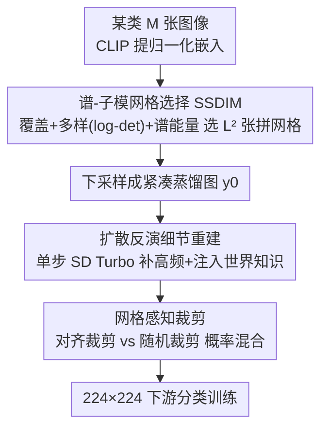

# Grid Distillation: Compositional Image Distillation via Structured Generative Grids

**会议**: CVPR 2026  
**论文**: [CVF Open Access](https://openaccess.thecvf.com/content/CVPR2026/html/Das_Grid_Distillation_Compositional_Image_Distillation_via_Structured_Generative_Grids_CVPR_2026_paper.html)  
**代码**: 待确认  
**领域**: 数据集蒸馏 / 模型压缩  
**关键词**: 数据集蒸馏, 子模优化, 谱分解, 扩散反演, 网格构图

## 一句话总结
Grid Distillation 把一整类图像压成"一张结构化网格图"：先用谱-子模优化（SSDIM）从 CLIP 嵌入里挑出既有覆盖度又多样、还贴合类流形几何的 $L^2$ 张代表图拼成网格并下采样，再用单步扩散反演（基于 SD Turbo）把下采样丢掉的高频细节补回来，最后用网格感知裁剪做训练增强——在 ImageWoof/ImageNette/ImageIDC/ImageNet-1K 上多个 IPC 设置全面超越现有数据集蒸馏方法，ImageWoof IPC=10 上 ResNet-18 达 65.5%（VLCP 仅 39.9%）。

## 研究背景与动机
**领域现状**：数据集蒸馏（DD）想把大规模数据集压成少量信息密集的合成样本，让在合成集上训练的模型逼近全量数据的性能，从而省存储、省算力，还利于隐私与版权友好的数据共享。早期方法是优化式的（元学习双层优化、梯度/特征分布匹配），近期则转向生成式——用扩散等强先验在隐空间合成逼真多样的样本（如 Minimax 的极小极大扩散目标、D4M 的聚类引导扩散）。

**现有痛点**：作者点出两类互补的缺陷。其一，**网格/patch 类**方法（如 RDED）效率高，但在**互不相交的裁剪 patch** 上操作，丢掉了全局空间布局和 patch 内的上下文关系，空间单元数受限、类内多样性覆盖不全。其二，**扩散原型类**方法（如 VLCP）能借扩散先验合成语义丰富的样本，但每张图**独立生成**，没有显式编码实例间或上下文依赖，缺乏结构化空间构图。结果两类方法都没能**同时**抓住构图结构和世界知识，蒸馏出的数据要么空间碎片化、要么语义浅薄。

**核心矛盾**：构图结构（compositional structure）与世界知识（world knowledge）在现有范式里是割裂的——优化式覆盖好但不会用先验、生成式有先验但构图散。而且优化式在高分辨率、大 IPC 下因逐像素迭代代价过高根本跑不动。

**本文目标**：设计一个统一框架，既用结构化选择保证类内多样性与构图完整，又用快速扩散先验注入世界知识、补回压缩丢掉的细节，且能扩展到高分辨率与大 IPC。

**切入角度**：与其逐张合成样本，不如**合成网格布局**——把一类的多样视觉模式压进一张 $L\times L$ 的网格图里，让"选哪些图、怎么排"成为一个有理论支撑的子模选择问题；再把下采样当成"超分的逆问题"，用单步扩散反演补细节。

**核心 idea**：用"谱-子模选择拼网格 + 单步扩散反演补细节 + 网格感知裁剪"三件套，把一类压成一张结构化生成网格图，兼顾覆盖、多样、构图与世界知识。

## 方法详解

### 整体框架
输入是某一类的 $M$ 张图像，输出是少量"蒸馏网格图"，可直接当作下游分类训练数据。流程分三步：① 谱-子模网格选择（SSDIM）从 CLIP 嵌入挑出 $L^2$ 张代表图拼成 $L\times L$ 网格并下采样成紧凑蒸馏图 $y_0$；② 训练时用单步扩散反演（SD Turbo）把下采样丢掉的高频细节补回、并借扩散先验注入世界知识，得到细节增强的网格图 $x_0$；③ 用网格感知裁剪把网格图喂进标准 224×224 的分类训练，既保留网格单元语义、又加入随机扰动。三步串行，前一步的网格结构是后两步的依托。

### 关键设计

**1. 谱-子模网格选择（SSDIM）：把一类的多样性压成一张覆盖完整的网格**

随机采样或聚类聚合会过度代表稠密外观模式、漏掉稀有但有信息的变化。作者把网格构建建模成**子模选择**问题：给定 $M$ 张图的归一化 CLIP 嵌入 $\{e_i\}$（$\|e_i\|_2=1$），构造亲和核 $K_{ij}=e_i^\top e_j$，再做谱分解 $K=U\Lambda U^\top$，定义每张图的**谱能量分数** $s_i=\sum_{k=1}^r \lambda_k u_{ik}^2$（衡量图 $i$ 对前 $r$ 个流形主模的贡献，越大越结构性地有信息）。目标函数同时最大化三项：$F(S)=\alpha\sum_{i\in U}\max_{j\in S}K_{ij}+\beta\log\det(K_{S,S}+\epsilon I)+\gamma\sum_{i\in S}s_i$，其中**覆盖项**（$\alpha$）保证每张候选图都被某个选中样本代表，**多样项**（$\beta$，log-det，类似 DPP）让选中嵌入张成大体积、避免冗余，**谱信息项**（$\gamma$）偏向高能量样本、对齐类流形主方向。直接组合优化在大数据集上不可解，于是提出 SSDIM 三阶段近似：Frank-Wolfe 式连续松弛把离散选择投到可微单纯形上做梯度优化、谱正则促进对主谱模的覆盖、贪心精修通过边际增益迭代换入换出（$\Delta_{x,y}=F((S\setminus\{y\})\cup\{x\})-F(S)>0$ 才换）保证单调改进。最终选出的 $L^2$ 张图拼成网格、下采样成蒸馏图。这一步替代了 RDED 的"互不相交 patch 裁剪"，让网格在覆盖、多样、流形一致三者间取得平衡。

**2. 扩散反演细节重建：单步把下采样丢的高频补回来并注入世界知识**

下采样把网格压紧的同时丢掉了高频纹理，直接用会损害判别性。作者把这步看成"超分的逆问题"，借鉴 InvSR 的扩散反演：训练一个噪声预测模型 $f_w$，以低分蒸馏图 $y_0$ 和从 CLIP 导出的文本/类嵌入 $p$ 为条件预测噪声，构造反演初始隐状态 $x_{\tau_S}=\sqrt{\bar\alpha_{\tau_S}}\,y_0+\sqrt{1-\bar\alpha_{\tau_S}}\,f_w(y_0,p,\tau_S)$，再用单步/少步反向扩散（SD Turbo）$x_0=g_\theta(x_{\tau_S},\tau_S)$ 重建出细节增强的网格图。和 InvSR 重建自然高分图不同，这里利用网格的构图结构和文本条件先验，做**网格一致的流形细化**——既补高频又以类感知方式注入世界知识，且保持单步效率。实测单步反演约 148ms，噪声预测模型（A6000）约 918ms 且每张图只算一次；整个增强相对训练只引入约 16.9% 的一次性开销（3m17s 增强 vs 16m05s 训练），摊到各 epoch 几乎不影响效率。

**3. 网格感知裁剪：用结构化裁剪保住网格语义、又不破坏测试兼容性**

为在训练时利用网格的构图结构，作者引入网格感知裁剪：网格图 $I\in\mathbb{R}^{H\times W}$ 由 $L^2$ 个 $h\times w$ 单元组成，裁剪算子按概率混合对齐与随机两种裁剪——$C(I;p_{\text{align}})=\mathrm{AlignedCrop}(I)$ 概率 $p_{\text{align}}$、$\mathrm{RandomCrop}(I)$ 概率 $1-p_{\text{align}}$。对齐裁剪从 $(h,w)$ 的整数倍位置起裁，保留网格的语义布局；随机裁剪取任意偏移，加入局部变化提升对"偏离网格"扰动的鲁棒性。两者混合让裁出的 patch 既保单元内语义连贯、又有泛化性，同时兼容标准 224×224 测试输入（默认 $p_{\text{align}}=0.6$）。

### 损失函数 / 训练策略
单 A6000（48GB）跑全部实验。子模权重 $\alpha=1.0,\beta=0.6,\gamma=0.3$；网格感知对齐概率 $p_{\text{align}}=0.6$；网格尺寸 $L=4$（即 4×4），谱模数 $r=32$，跨数据集保持不变以保公平。ImageNet-1K 子集分辨率 256×256（Minimax 协议），完整 ImageNet-1K 用 224×224（RDED 协议）。SSDIM 用 CLIP 批量提嵌入（batch 64），单类约 1300 图建核约 18 秒、每类生成 10 张增强网格约 57 秒。

## 实验关键数据

### 主实验
在 ImageWoof（10 类细粒度犬种，类间相似度高）、ImageNette、ImageIDC、ImageNet-1K 上跨多个 IPC（每类图像数）评测。下表为 ImageWoof 上的代表结果，Grid-Distil 在所有 IPC 与三种骨干上全面领先，低数据区（IPC=10）优势尤为夸张：

| 数据集/骨干 | IPC | Grid-Distil (本文) | VLCP (次优) | Minimax | RDED/Random |
|--------|------|------|------|------|------|
| ImageWoof / ResNet-18 | 10 | **65.5** | 39.9 | 35.7 | 27.7 (Rand) |
| ImageWoof / ResNet-18 | 50 | **84.3** | 58.9 | 48.3 | 47.9 (Rand) |
| ImageWoof / ResNetAP-10 | 20 | **73.7** | 44.5 | 43.3 | 32.7 (Rand) |
| ImageNette / ResNetAP-10 | 10 | **83.3** | 64.8 | 57.7 | 54.2 (Rand) |
| ImageIDC / ResNetAP-10 | 10 | **73.5** | 57.0 | 51.9 | 48.1 (Rand) |

> IPC（images-per-class）指每类保留的蒸馏图数量，越小压缩越狠。ImageWoof IPC=10 上本文比次优 VLCP 高出 15+ 个百分点。

第二张表是 ImageNet-1K（IPC=10，ResNet-18）上的可扩展性验证。本文细节增强版达 50.01%，明显超过 VLCP（46.7%）与 Minimax（44.3%）；即便不加扩散增强的双线性版（35.40%）也已和扩散类蒸馏器相当，说明网格化子模选择本身就很强：

| 方法 | 来源 | Mean | Std |
|------|------|------|------|
| RDED | CVPR'24 | 42.0 | 0.1 |
| Minimax | CVPR'24 | 44.3 | 0.5 |
| VLCP | ICCV'25 | 46.7 | 0.4 |
| **Ours (Bilinear)** | – | 35.40 | 0.25 |
| **Ours (Detail Enhancement)** | – | **50.01** | 0.29 |

### 消融实验
| 配置 | 关键指标 | 说明 |
|------|---------|------|
| Bilinear 上采样 | ImageNette IPC=50: 91.5 | 不加扩散增强 |
| 扩散细节增强（完整） | ImageNette IPC=50: 92.7 | 高内类变化数据集上稳定提升 |
| Bilinear (ImageIDC IPC=10) | 74.7 | 低频构图数据集上反而略高 |
| 扩散增强 (ImageIDC IPC=10) | 73.5 | 细节增益对低频数据有限 |

### 关键发现
- **细节增强的收益取决于数据频谱特性**：在高内类变化、细节关键的 ImageNette/ImageWoof/ImageNet-1K 上扩散增强稳定提升，但在低频构图的 ImageIDC 上双线性反而略优（74.7 vs 73.5），说明补高频并非万能、要看类判别是否依赖细粒度纹理。
- **子模选择本身就贡献巨大**：ImageNet-1K 上双线性版（无扩散）已达 35.40%、接近扩散类蒸馏器，证明 SSDIM 的覆盖+多样+谱信息组合是性能主力。
- **效率友好**：单步反演 148ms、噪声预测每图只算一次，整体仅约 16.9% 一次性开销，摊到各 epoch 后保持了蒸馏方法的高效特性。
- 子模三参数（$\alpha,\beta,\gamma$）对网格质量有可测影响，全零（随机）基线在真实 ImageWoof 网格 IPC=20 上为 74.6（⚠️ 完整敏感性表见原文）。

## 亮点与洞察
- **把"选哪些图拼网格"变成有理论支撑的子模问题**：覆盖项 + log-det 多样项（DPP 味）+ 谱能量项三管齐下，既保代表性又保流形一致，比随机/聚类聚合更可控，思路可迁移到任何核心集（coreset）选择任务。
- **把下采样当超分逆问题，用单步扩散反演补细节**：复用 InvSR 的反演框架但条件在类文本嵌入上，做"网格一致的流形细化"，既补高频又注入世界知识，且单步保持效率——这是把生成先验"恰到好处"地塞进蒸馏的巧法。
- **网格感知裁剪是低成本却关键的训练增强**：概率混合对齐/随机裁剪，既保住网格单元语义、又兼容标准 224×224 推理，几乎零成本提升判别性。
- "结构化选择 + 快速生成先验补细节"的组合范式可迁移到核心集构建、持续学习记忆回放、隐私友好数据合成等场景。

## 局限与展望
- 网格尺寸固定 $L=4$、谱模数 $r=32$ 跨数据集不变，虽利于公平但未必各数据集最优，自适应网格尺寸/谱模数有提升空间。
- 扩散细节增强对低频构图数据集（ImageIDC）增益有限甚至略降，何时该用扩散、何时该用双线性需要更明确的判据。
- SSDIM 仍含贪心精修与谱分解，超大候选池（单类上千图建核约 18 秒）的可扩展性需关注。
- 依赖 CLIP 嵌入与 SD Turbo 先验，蒸馏质量受这些预训练模型偏置影响，跨域（如医学/遥感）迁移时世界知识是否仍有效需验证。

## 相关工作与启发
- **vs RDED（网格/patch 类）**: RDED 在互不相交裁剪 patch 上做条件，丢全局布局、空间单元受限；本文用子模选择拼**完整网格**并保留构图结构，覆盖与多样性更好。
- **vs VLCP / D4M / Minimax（扩散原型类）**: 它们每张图独立生成、缺结构化构图；本文显式编码实例间空间依赖（网格）并只用单步扩散补细节，ImageNet-1K IPC=10 上 50.01 vs VLCP 46.7。
- **vs 优化式 DD（梯度/分布匹配、双层优化）**: 后者逐像素迭代在高分辨率大 IPC 下代价过高；本文以选择 + 一次性生成增强取代迭代优化，扩展性更好。

## 评分
- 新颖性: ⭐⭐⭐⭐⭐ 首次把谱-子模选择 + 扩散反演 + 网格构图统一进数据集蒸馏，构图结构与世界知识双补
- 实验充分度: ⭐⭐⭐⭐ 四数据集多 IPC 多骨干，含细节增强与子模参数消融，提升幅度大；超大规模仅 ImageNet-1K IPC=10
- 写作质量: ⭐⭐⭐⭐ 方法与动机清晰，公式与算法（SSDIM 伪码）完整
- 价值: ⭐⭐⭐⭐⭐ 大幅刷新蒸馏 SOTA 且效率友好，对省存储/隐私友好数据共享实用

<!-- RELATED:START -->

## 相关论文

- [\[CVPR 2026\] HierAmp: Coarse-to-Fine Autoregressive Amplification for Generative Dataset Distillation](hieramp_coarse-to-fine_autoregressive_amplification_for_generative_dataset_disti.md)
- [\[CVPR 2026\] CADC: Content Adaptive Diffusion-Based Generative Image Compression](cadc_content_adaptive_diffusion-based_generative_image_compression.md)
- [\[CVPR 2026\] ProGIC: Progressive and Lightweight Generative Image Compression with Residual Vector Quantization](progic_progressive_and_lightweight_generative_image_compression_with_residual_ve.md)
- [\[CVPR 2026\] Differentiable Vector Quantization for Rate-Distortion Optimization of Generative Image Compression](differentiable_vector_quantization_for_rate-distortion_optimization_of_generativ.md)
- [\[CVPR 2026\] Dataset Distillation by Influence Matching](dataset_distillation_by_influence_matching.md)

<!-- RELATED:END -->
