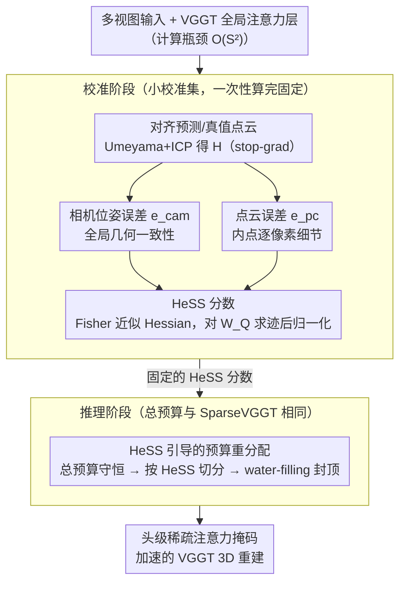

# HeSS: Head Sensitivity Score for Sparsity Redistribution in VGGT

**会议**: CVPR 2026  
**arXiv**: [2603.25336](https://arxiv.org/abs/2603.25336)  
**代码**: [https://github.com/libary753/HeSS](https://github.com/libary753/HeSS)  
**领域**: 模型压缩  
**关键词**: 注意力稀疏化, VGGT, 头部敏感性, Fisher信息矩阵, 3D重建加速

## 一句话总结

HeSS 提出 Head Sensitivity Score 来量化 VGGT 全局注意力层中每个注意力头对稀疏化的敏感程度，并基于此将注意力预算从不敏感的头重新分配到敏感头，在高稀疏度下显著优于均匀稀疏化方法 SparseVGGT，几乎不增加运行时开销。

## 研究背景与动机

1. **领域现状**：VGGT（Visual Geometry Grounded Transformer）是多视图 3D 重建的强大基础模型，通过交替堆叠的全局注意力（GA）层和帧注意力（FA）层统一了传统 SfM 和 MVS 任务。全局注意力层使所有帧 token 相互交互，对理解整体场景结构至关重要。

2. **现有痛点**：GA 层的自注意力计算量随输入视图数平方增长 $O(S^2)$，在大规模输入时 GPU 显存和计算成本急剧上升，限制了 VGGT 在实时和大规模场景中的应用。

3. **核心矛盾**：现有加速方法（如 SparseVGGT）对所有注意力头施加统一的稀疏模式（相同的 CDF 阈值 $\tau$ 和稀疏比 $\rho$），但实际上不同注意力头对稀疏化的敏感度差异很大——有些头被过度稀疏化后会导致性能急剧下降，而有些头即使大幅稀疏化也几乎不影响结果。

4. **本文目标** (1) 如何量化每个注意力头对稀疏化的敏感程度？(2) 如何根据敏感度差异自适应地分配注意力预算？(3) 如何在保持总计算量不变的前提下，通过预算重分配显著减少高稀疏度下的性能退化？

5. **切入角度**：作者假设性能退化的根本原因是注意力头的敏感度异质性——均匀稀疏化不可避免地过度压缩了关键头。通过 Fisher 信息矩阵近似 Hessian 来度量头部敏感度，将3D重建任务特有的两种误差（相机位姿和点云）结合起来计算敏感度分数。

6. **核心 idea**：用 Fisher 信息矩阵对相机位姿误差和点云误差的 Hessian 近似来量化每个注意力头的稀疏化敏感度，然后按敏感度比例重新分配总注意力预算，对敏感头保留更多注意力、对鲁棒头施加更强稀疏化。

## 方法详解

### 整体框架

VGGT 的全局注意力层让所有帧 token 互相交互，计算量随视图数平方膨胀，是加速的主要瓶颈。前作 SparseVGGT 用一套统一的稀疏阈值压所有注意力头，但 HeSS 的出发点是：不同头对稀疏化的耐受度天差地别，一刀切会把关键头压垮。于是 HeSS 把"该给哪个头留多少注意力"变成一个按敏感度分配预算的问题。

整条管线分两步走。**校准阶段**先在一个小校准集上算出每个 GA 层、每个头的 HeSS 敏感度分数，一次算完就固定下来；**推理阶段**则保持总预算与 SparseVGGT 完全相同，只是把这份固定预算按 HeSS 分数在头之间重新切分——敏感头多拿几个 attention block，鲁棒头少拿。整个过程不碰模型权重、不需要训练，纯粹是推理时的预算调度。下面的关键设计沿这条管线依次展开：先定义两个互补的误差信号（相机位姿误差、点云误差）来反映 3D 重建质量，再用 Fisher 信息近似 Hessian 把误差敏感度落到每个头上得到 HeSS 分数，最后把这份分数转成头级的预算分配。

### 关键设计

**1. 相机位姿误差 $e_{\text{cam}}$：用全局几何一致性当第一个敏感度信号**

要衡量一个头有多关键，先得有一个能反映"3D 重建质量"的误差量。相机位姿是整个 3D 预测的几何支架——位姿一歪，所有下游结果都跟着错，所以作者把它选为第一个误差信号。具体做法是先用 Umeyama + ICP 把预测点云对齐到真实点云，得到相似变换矩阵 $\mathbf{H}$，再算预测相机位置经 $\mathbf{H}$ 变换后与真值的 MSE：

$$e_{\text{cam}} = \frac{1}{2N}\sum_{i=1}^N \|\text{sg}(\mathbf{H})\hat{\mathbf{t}}_i - \mathbf{t}_i\|_2^2$$

关键的细节是对 $\mathbf{H}$ 施加 stop-gradient（式中的 $\text{sg}(\cdot)$）：对齐只是为了把两套坐标系摆到一起做比较，它本身是个辅助步骤，不应让梯度顺着它回流而污染敏感度估计。

**2. 点云误差 $e_{\text{pc}}$：补上 $e_{\text{cam}}$ 看不到的逐像素细节**

相机位姿只刻画整体几何对不对，但对每个像素回归到 3D 空间的精细位置并不敏感——一个头可能位姿估得很准、局部结构却糊成一团。$e_{\text{pc}}$ 就是来补这块的：先用置信度阈值 $\epsilon = 0.05$ 把预测点中真正可信的内点筛出来组成集合 $\mathcal{I}$（与真值点云最近距离小于 $\epsilon$），再对这些内点算它们到真实点云的平均最近点距离：

$$e_{\text{pc}} = \frac{1}{2|\mathcal{I}|}\sum_{j \in \mathcal{I}} \min_{\mathbf{p} \in P}\|\text{sg}(\mathbf{H})\hat{\mathbf{p}}_j - \mathbf{p}\|_2^2$$

它要求模型把每个像素精确投到 3D 空间，因此能捕捉局部几何细节。两个误差一全局一局部，构成互补的双信号，后面合成 HeSS 时正好各管一段稀疏度区间。

**3. HeSS 分数：用 Fisher 信息近似 Hessian，把误差敏感度落到每个头上**

有了两个误差，还要把"压这个头会让误差涨多少"量化出来。真正的敏感度对应误差关于头参数的二阶曲率（Hessian），但 Hessian 太贵，作者用 Fisher 信息矩阵（FIM）来近似——FIM 用一阶梯度的外积估计二阶信息，可算且无偏。对每个头 $h$，分别就相机误差和点云误差对该头的 Query 投影权重 $W_Q^h$ 算出 $\mathbf{F}_{\text{cam}}^h$、$\mathbf{F}_{\text{pc}}^h$，取迹后在同层所有头之间归一化，再加权合成：

$$\text{HeSS}_{\text{cam}}(h) = \frac{\text{tr}(\mathbf{F}_{\text{cam}}^h)}{\sum_h \text{tr}(\mathbf{F}_{\text{cam}}^h)}, \qquad \text{HeSS}(h) = \lambda\,\text{HeSS}_{\text{cam}}(h) + (1-\lambda)\,\text{HeSS}_{\text{pc}}(h)$$

默认 $\lambda = 0.5$。这里有两个有讲究的选择：一是只对 $W_Q^h$ 而非 $W_K^h$、$W_V^h$ 求 Hessian——消融显示 Query 投影给出的敏感度估计最可靠（用 Key/Value 性能都明显变差）；二是 $\lambda$ 把两个误差拼在一起，因为 $e_{\text{cam}}$ 在低稀疏度时更主导、$e_{\text{pc}}$ 在高稀疏度时更关键，单用任一个都会在另一端塌掉。

**4. HeSS 引导的预算重分配：water-filling 把预算搬给敏感头，且保证可行**

分数算完，最后一步是把总预算按敏感度重切。先把所有头的基线预算加起来得到总量 $C_{\text{total}} = \sum_n c_{h_n}$，再按归一化后的 HeSS 权重 $w_h = \text{HeSS}(h) / \sum_n \text{HeSS}(h_n)$ 给每个头算理想预算 $c_h' = C_{\text{total}} \cdot w_h$。问题在于纯按比例分可能给某个高敏感头分到超过它实际能用的最大 block 数 $C_{\max}$，物理上根本放不下。于是作者套了一个迭代 water-filling：哪个头的理想预算溢出 $C_{\max}$ 就把它钳到 $C_{\max}$，多出来的预算再按 HeSS 比例分给剩下没封顶的头，反复直到不再溢出。这样既把预算尽量倾斜给敏感头，又保证最终分配在结构上始终可行——消融里去掉这步迭代会让未用完的预算被浪费、性能掉下来。

### 损失函数 / 训练策略

HeSS 不引入任何训练损失，也不更新模型权重。校准用 CO3Dv2 dev split、每场景采样 20 个视图，一次性算出所有头的 HeSS 分数后固定，推理时不再随数据变化——整套方法是纯推理时的预算重分配。

## 实验关键数据

### 主实验

在 CO3Dv2（相机位姿估计）和 DTU（MVS 重建）上对比：

| 方法 | 稀疏度 | CO3Dv2 AUC@30↑ | DTU Chamfer↓ | 运行时间(s) |
|------|--------|---------------|-------------|-----------|
| VGGT (原始) | 0% | 基准 | 基准 | 10.35 |
| SparseVGGT | 43% | 下降明显 | 下降明显 | 8.42 |
| **HeSS (Ours)** | **43%** | **接近原始** | **接近原始** | **8.37** |
| SparseVGGT | 73% | 严重退化 | 严重退化 | 6.59 |
| **HeSS (Ours)** | **73%** | **显著优于SparseVGGT** | **显著优于SparseVGGT** | **6.58** |

### 消融实验

| 配置 | DTU Chamfer↓ | Acc.↓ | Comp.↓ | 说明 |
|------|-------------|-------|--------|------|
| Ours ($W_Q^h$) | **1.603** | **2.839** | **0.367** | 用 Query 投影的 Hessian |
| $W_K^h$ | 1.917 | 3.450 | 0.384 | 用 Key 投影，性能下降 |
| $W_V^h$ | 1.966 | 3.540 | 0.392 | 用 Value 投影，更差 |
| 无归一化 (Linear) | 1.840 | 3.272 | 0.408 | 不做 sum-normalization |
| 反转 HeSS | 灾难性失败 | — | — | 先剪敏感头验证正确性 |

### 关键发现

- HeSS 分布可视化（图 4）证实了头部敏感度的高度异质性——大多数头在两种误差上都呈现低敏感度，只有少数头极为关键（如 GA19 的 H5）
- 某些头表现出明显的任务偏好——GA13 的 H13 对相机位姿更敏感，GA19 的 H5 对点云更敏感
- $\lambda$ 的消融实验（图 11）表明两种误差互补：仅用 $e_{\text{cam}}$ 在高稀疏度下性能下降，仅用 $e_{\text{pc}}$ 在低稀疏度下下降，组合后在所有稀疏度水平上都保持稳定
- 去掉迭代 capping 导致明显性能退化（图 10），未用完的预算被浪费
- 方法可泛化到 $\pi^3$ 模型，但需要用不同的 $\lambda$（$\lambda = 0$ 最优）

## 亮点与洞察

- **零额外推理开销的性能提升**：HeSS 只改变预算分配方式，总计算量不变（甚至因重分配更高效的调度而略减），但在高稀疏度下性能提升显著。这是一种"免费午餐"式的改进
- **3D 任务特定的敏感度度量**：不同于通用 ViT 剪枝使用分类 loss 的 Hessian，HeSS 针对 3D 重建定义了相机位姿和点云两个互补的误差项，这种领域特定设计使敏感度度量更准确
- **反转 HeSS 的 sanity check**：反转排序后性能灾难性崩溃，这个简单但有力的验证证明了 HeSS 确实正确识别了关键头

## 局限与展望

- 作者承认 HeSS 目前对所有 GA 层统一处理，但不同层对稀疏化的敏感度也不同，且跨层的 FIM 尺度不可直接比较——层级可比的敏感度指标是重要后续方向
- 方法只考虑推理时稀疏化，未涉及训练时适应——如果模型在训练时就对稀疏化具有鲁棒性，可以进一步提升压缩比
- 通过 $\pi^3$ 实验发现不同模型需要不同的 $\lambda$，说明需要某种自动搜索机制
- 校准集的选择和大小可能影响 HeSS 的稳定性，文中未充分分析这一点

## 相关工作与启发

- **vs SparseVGGT**: SparseVGGT 提出了 block-sparse attention 机制但对所有头统一处理，HeSS 在其基础上增加了头级别的预算重分配，总预算相同但分配更智能
- **vs ViT 通用剪枝 (Michel et al.)**: 通用头部剪枝在 50% 以上稀疏度时急剧崩溃，因为它缺乏 3D 几何的归纳偏置；HeSS 保持空间 token 的结构完整性，即使在 75% 稀疏度下仍保持高保真度
- **HeSS 的思路可迁移**：这种"用任务特定误差的 Hessian 来指导注意力头级别的资源分配"思路可以推广到其他多头注意力模型的压缩（如 LLM 的 KV-cache 压缩）

## 评分

- 新颖性: ⭐⭐⭐⭐ 头部敏感度量化和自适应预算分配的思路虽不完全新颖，但在 3D 重建的 VGGT 上的应用设计精巧
- 实验充分度: ⭐⭐⭐⭐ 多数据集、多稀疏度、多消融、泛化实验齐全，sanity check 有说服力
- 写作质量: ⭐⭐⭐⭐ 结构清晰，公式推导详尽，图表直观
- 价值: ⭐⭐⭐⭐ 对 VGGT 实际部署有直接帮助，方法思路可迁移

<!-- RELATED:START -->

## 相关论文

- [\[CVPR 2026\] HTTM: Head-wise Temporal Token Merging for Faster VGGT](httm_head-wise_temporal_token_merging_for_faster_vggt.md)
- [\[CVPR 2026\] Batch Loss Score for Dynamic Data Pruning](batch_loss_score_for_dynamic_data_pruning.md)
- [\[CVPR 2026\] LiteVGGT: Boosting Vanilla VGGT via Geometry-aware Cached Token Merging](litevggt_boosting_vanilla_vggt_via_geometry-aware_cached_token_merging.md)
- [\[CVPR 2026\] Test-time Sparsity for Extreme Fast Action Diffusion](test-time_sparsity_for_extreme_fast_action_diffusion.md)
- [\[CVPR 2026\] SODA: Sensitivity-Oriented Dynamic Acceleration for Diffusion Transformer](soda_sensitivity-oriented_dynamic_acceleration_for_diffusion_transformer.md)

<!-- RELATED:END -->
