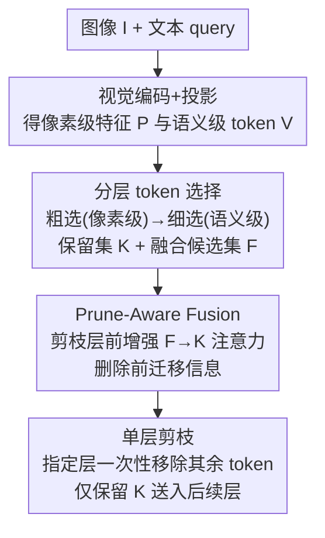

# Hi-Lo Prune: Look at What You'll Lose before Pruning with Hierarchical Token Selection

**会议**: CVPR 2026  
**论文**: [CVF Open Access](https://openaccess.thecvf.com/content/CVPR2026/html/Sun_Hi-Lo_Prune_Look_at_What_Youll_Lose_before_Pruning_with_CVPR_2026_paper.html)  
**代码**: https://github.com/sealost/Hi-Lo_Prune  
**领域**: 模型压缩 / 多模态VLM / 推理加速  
**关键词**: 视觉 token 剪枝, 免训练, 多模态大模型, 注意力融合, 推理加速

## 一句话总结
本文针对多模态大模型（MLLM）视觉 token 过多导致推理昂贵的问题，提出免训练剪枝方法 Hi-Lo Prune——核心理念"剪之前先看看你会丢什么"：先用粗到细的分层选择定出保留 token 集和"最值得保留的待剪 token"候选集，再用 Prune-Aware Fusion 在浅层把候选集的信息迁移进保留 token，最后在指定层一次性删除其余 token，在 Qwen2/2.5/3-VL 与 LLaVA 上即便剪掉 90% token 仍稳超现有剪枝方法。

## 研究背景与动机
**领域现状**：MLLM（Qwen-VL、LLaVA 等）把视觉编码器和大语言模型拼起来做图文理解，但高分辨率图/长视频会产生成千上万个视觉 token，Transformer 的二次复杂度让推理成本爆炸。免训练（training-free）的视觉 token 剪枝是当前主流加速手段——不需微调，直接在预训练模型上剪 50%–90% token 就能显著提速，且能跨数据集/架构泛化。

**现有痛点**：这些免训练方法几乎都在**浅层**剪 token，而浅层时模型还没充分处理视觉内容，被丢掉 token 的信息来不及被吸收进保留 token，于是高剪枝率下性能必然掉。现有两类思路各有短板：① 重要性派（FastV、SparseVLM、PyramidDrop）用文本-视觉注意力打分，但近期发现"注意力漂移"会从根上削弱这类打分；② 多样性派（DART、DivPrune、CDPruner）用聚类/语义距离保留互补 token，但纯靠 token 特征做剪枝决策，丢就是丢。即便像 SparseVLM 那样**剪完之后**再融合被剪 token，也只是事后补救，且往往保留更多 token、引入额外开销。

**核心矛盾**：要在浅层就激进剪枝（才能省下后续所有层的计算），又不能让被剪 token 的信息白白损失——"早剪省算力"和"信息别丢"之间存在直接冲突。

**本文目标**：① 在浅层做激进剪枝的同时把信息损失压到最小；② 全程免训练、即插即用、支持 FlashAttention。

**切入角度**：一个被忽视的简单原则——**look at what you will lose（剪之前先看看你会丢什么）**。与其直接删，不如先识别哪些 token 即将被丢、并在删除前让保留 token"吸收"它们的关键信息。

**核心 idea**：分层 token 选择定出"保留集"和"最该保留的待剪候选集 $\mathcal{F}$"，再用 Prune-Aware Fusion 在剪枝层之前把 $\mathcal{F}$ 的信息通过增强注意力迁移进保留集，然后才真正删除。

## 方法详解

### 整体框架
给定输入图像 $I$、文本 query 和目标剪枝率 $r$，Hi-Lo Prune 在 LLM 解码前分三个阶段工作：(1) **分层选择** 用粗到细两步定出最终保留 token 集 $\mathcal{K}$（大小 $K=(1-r)N$），同时产出一个约占全部视觉 token 30% 的**融合候选集** $\mathcal{F}$——它是"待剪 token 里最重要的一批"；(2) **Prune-Aware Fusion** 在剪枝层之前的浅层里增强注意力，把 $\mathcal{F}$ 的信息迁移进 $\mathcal{K}$；(3) **单层剪枝** 在指定 Transformer 层一次性删除除 $\mathcal{K}$ 外的所有 token，让后续层只在 $K$ 个 token 上算。剪枝目标形式化为在保持模型输出差异 $\mathcal{D}$ 最小的前提下选出 $\hat{V}\subseteq V,\ |\hat{V}|=K$。

### 关键设计

**1. 分层 token 选择：粗到细，并顺带凿出"待剪候选集" $\mathcal{F}$**

直接在单一特征上选 token 要么丢纹理细节、要么丢语义。受"浅层特征记纹理、深层特征记语义"启发，Hi-Lo Prune 用两级互补特征：把图像切成 $p\times p$ patch 得**像素级特征** $P\in\mathbb{R}^{N\times D_p}$，再过视觉编码器+投影得**语义级 token** $V=f_p(f_v(I))$。选择分两步（Algorithm 1）：粗选用像素级 $P$ 选出 $\alpha K$ 个候选（松弛因子 $\alpha>1$），过滤掉全局冗余 patch；细选用语义级 $V$ 把候选精炼到最终的 $K$ 个保留 token。两步都用同一个**贪心最大多样性**算法——每次迭代选与已选集合余弦距离最远的 token（$d(x_i,x_j)=1-\frac{x_i\cdot x_j}{\|x_i\|\|x_j\|}$），保证保留的 token 彼此互补、覆盖面广。

这一步最关键的副产物是融合候选集 $\mathcal{F}=\mathcal{S}_{coarse}\setminus\mathcal{S}$——即"粗选阶段被选中、却在细选阶段被淘汰"的那批 token，约占原始 token 的 30%。它们正是"即将被丢、但还算重要"的 token，是后续"look at what you'll lose"要抢救的对象。把 $\mathcal{F}$ 显式造出来，是本文区别于"一刀切丢弃"的前提。

**2. Prune-Aware Fusion（PA-Fusion）：删除前把候选信息搬进保留 token**

浅层剪枝信息来不及吸收，PA-Fusion 的做法是在剪枝层之前的前几层**改注意力**，让 $\mathcal{F}$ 的信息先流进 $\mathcal{K}$ 再删。具体地，设第 $\ell$ 层注意力 logits $A=QK^T\in\mathbb{R}^{q\times k}$，对每个"保留 token/文本 token 作 query（$i\notin\mathcal{F}$）、待剪 token 作 key（$j\in\mathcal{F}$）"的位置 $(i,j)$，自适应增强其注意力：

$$\tilde{A}_{ij} = A_{ij} + \lambda\cdot A_{ij}\cdot \mathbb{1}\big[\mathrm{softmax}(A)_{ij}>\tau \ \wedge\ j\in \text{Top-}k_i\big],$$

其中 $\lambda$ 是融合强度，$\tau$ 是自适应阈值，$\text{Top-}k_i$ 是 query $i$ 的前 $k$ 个 key。增强强度正比于原始注意力亲和度——只有"待剪 token 与某保留 token 本就高度相关（既超阈值 $\tau$、又在该 query 的 Top-$k$ 内）"时连接才被显著加强，无关 token 对保持原样、不破坏原注意力分布。增强后对 $\tilde{A}$ 做 softmax。由于融合只在 $\mathcal{F}$ 子集上算，可与 FlashAttention 加速的标准自注意力**并行**，几乎不增延迟。作者通过 logit 分布分析（把末层 logit PCA 到 2D）验证：90% 激进剪枝会把 logit 推离原点（预测偏移），而 PA-Fusion 能把它"拉回"原点附近（Tab.2：L2 距离降 4.09%–12.29%，余弦相似度升 0.18%–1.38%），说明它确实在恢复被剪信息。

### 一个例子：90% 剪枝下一次推理怎么走
以 Qwen2-VL-2B、保留 10% token 为例：图像编码得 $N$ 个视觉 token → 粗选用像素特征留下 $\alpha K$ 个（$\alpha>1$，比最终多留一截）→ 细选用语义特征精炼到 $K=0.1N$ 个保留 token，被细选刷掉的那约 30% token 组成融合候选集 $\mathcal{F}$ → 在第 1–2 层（剪枝层之前）跑 PA-Fusion，把 $\mathcal{F}$ 里与保留 token 高相关的信息通过增强注意力搬进保留 token → 在第 2 层一次性删除 $\mathcal{F}$ 及其余 token，只剩 10% token 进入后续所有层。结果是"红熊猫在哪"这类需要细节的问题，被剪掉的目标区域信息已提前融入保留 token，回答仍正确，而 FastV/DivPrune/CDPruner 在同样剪枝率下答错。

### 损失函数 / 训练策略
**完全免训练，无任何损失/微调**。所有操作（分层选择、PA-Fusion、单层剪枝）都是对预训练 MLLM 的即插即用前向改造。实现上：单层剪枝在第 2 层、多层剪枝在第 4/8/16 层；PA-Fusion 在前两个被剪层做信息迁移；剪枝率测试设到保留 10%/20%（即剪 80%/90%）。超参为融合强度 $\lambda$、阈值 $\tau$、松弛因子 $\alpha$。

## 实验关键数据

### 主实验
在 Qwen2-VL-2B / Qwen2.5-VL-7B / Qwen3-VL-8B 上做单层剪枝，8 个基准，报告归一化平均分（相对 Vanilla 全 token = 100%）。

| 模型 | 保留率 | FastV | DART | DivPrune | CDPruner | Hi-Lo Prune |
|------|------|------|------|----------|----------|-------------|
| Qwen2-VL-2B | 20% | 88.57 | 83.11 | 91.39 | 85.61 | **93.97** |
| Qwen2-VL-2B | 10% | 78.16 | 75.49 | 83.94 | 79.00 | **88.26** |
| Qwen2.5-VL-7B | 20% | 89.55 | 83.24 | 91.84 | 84.18 | **95.04** |
| Qwen2.5-VL-7B | 10% | 82.61 | 79.76 | 92.42 | 83.87 | **93.51** |
| Qwen3-VL-8B | 10% | 73.01 | 69.58 | 84.57 | 85.38 | **87.17** |

Hi-Lo Prune 在所有模型、两个剪枝率下都取最高平均分；剪枝越激进（保留 10%）领先越明显。在 LLaVA 1.5-7B 上同样最优（90% 剪枝下 93.88%，超次优 2.5%），证明跨架构泛化。对比多层剪枝基线（PyramidDrop、SparseVLM）也胜出（Qwen2-VL-2B 保留 10% 时 85.02% vs SparseVLM 83.41%），且无需 SparseVLM 那样的 token 恢复步骤。

### 消融实验
| 配置 | 关键指标 | 说明 |
|------|---------|------|
| Hi-Lo Prune（完整） | 见主表 | 分层选择 + PA-Fusion |
| 仅剪枝 vs +PA-Fusion（logit） | L2 降 4.09%–12.29% | PA-Fusion 把预测拉回全 token 分布 |
| CDPruner + PA-Fusion | ScienceQA +0.45% | PA-Fusion 可插进别的剪枝法 |
| DivPrune + PA-Fusion | MME +67.96 分 | 同上，普遍涨点 |
| Hi-Lo + PA-Fusion | ChartQA +1.28% | 本方法上 PA-Fusion 增益 |

### 关键发现
- **PA-Fusion 是可迁移的通用插件**：把它接到 CDPruner、DivPrune 等免训练剪枝法上，几乎全面涨点（DivPrune 在 MME 涨 67.96 分），说明"删前迁移信息"这一招独立于具体选 token 策略，验证了核心理念的普适性。
- **激进剪枝下优势放大**：90% 剪枝时各基线大幅掉点，而 Hi-Lo Prune 仍稳住，正是因为浅层把待剪信息提前融入保留 token，缓解了"浅层剪、信息来不及吸收"的根本问题。
- **效率与精度兼得**：在 Qwen3-VL-8B / MME 上剪 90% token，FLOPs 从 2.576T 降到 0.377T（-85.35%），总推理时间 -43.75%、prefill -49.79%，MME 仍达 2042.58（相对 vanilla 仅降 14.6%），是所有剪枝法里 MME 最高的。
- **ChartQA 增益最小**：因其复杂视觉推理需要更多视觉内容，激进剪枝本就更伤，PA-Fusion 的恢复幅度也相应有限。

## 亮点与洞察
- **"剪之前先看你会丢什么"把被剪 token 从负担变资产**：以往要么丢弃、要么剪后补救，本文在剪之前就显式造出待剪候选集 $\mathcal{F}$ 并把信息前向迁移，时机上抢在信息损失发生之前，这个"提前量"是最核心的"啊哈"点。
- **用细选淘汰集天然得到 $\mathcal{F}$**：不额外算一套重要性，直接复用"粗选留、细选删"的差集当融合候选，省事又语义自洽——这些恰是"够重要进了粗选、但不够独特被细选刷掉"的 token，正是该抢救的对象。
- **自适应注意力增强可并行**：PA-Fusion 只对 $\mathcal{F}$ 子集改注意力且按原始亲和度成比例增强，既保住原注意力模式、又能和 FlashAttention 并行，几乎零额外延迟——这个工程友好性让它能真正落地加速。
- **PA-Fusion 即插即用**：可作为通用模块嫁接到任意免训练剪枝法上普遍涨点，迁移性强。

## 局限与展望
- **剪枝层/率为固定超参**：单层剪在第 2 层、多层剪在 4/8/16 层都是手设，论文未给跨任务自适应选层策略，换模型/任务可能需重调。
- **复杂视觉推理增益有限**：ChartQA 这类高密度视觉内容任务上 PA-Fusion 恢复幅度小，说明对"信息本就高度依赖大量 token"的场景，激进剪枝的天花板仍在。
- **融合候选固定约 30%**：$\mathcal{F}$ 规模是经验值，是否随剪枝率/任务自适应调整更优，论文未充分探讨（⚠️ 以原文为准）。
- **改进方向**：自适应选剪枝层与 $\mathcal{F}$ 规模、把分层选择扩展到视频长序列、与 KV-cache 压缩联动进一步降显存。

## 相关工作与启发
- **vs FastV / SparseVLM / PyramidDrop（重要性派）**：它们用文本-视觉注意力打分剪 token，受"注意力漂移"困扰；本文用多样性贪心选 token、不依赖注意力打分定去留，并额外做删前信息迁移，高剪枝率下更稳。
- **vs DART / DivPrune / CDPruner（多样性派）**：同样靠特征多样性保留互补 token，但它们纯特征决策、丢即永久丢；Hi-Lo Prune 把"待剪 token"信息先融进保留集，且 PA-Fusion 还能反过来给这些方法涨点。
- **vs SparseVLM（剪后融合）**：SparseVLM 在剪除**之后**再融合被剪 token，往往保留更多 token、引入额外开销；本文在剪除**之前**就让待剪 token 起作用，无需 token 恢复步骤，更省。

## 评分
- 新颖性: ⭐⭐⭐⭐ "删前迁移信息"理念清晰且 PA-Fusion 可作通用插件，但分层选择与注意力增强各自有同类先例
- 实验充分度: ⭐⭐⭐⭐⭐ 覆盖 Qwen2/2.5/3-VL + LLaVA、单/多层剪枝、9 基准 + 效率分析 + logit 分析，很全面
- 写作质量: ⭐⭐⭐⭐ 三阶段流程与算法清晰，部分符号（$\mathcal{S}$/$\mathcal{F}$ 关系）需对照算法才好懂
- 价值: ⭐⭐⭐⭐⭐ 免训练即插即用、90% 剪枝下仍稳且大幅省 FLOPs/时延，对 MLLM 实际部署很实用

<!-- RELATED:START -->

## 相关论文

- [\[CVPR 2026\] IF-Prune: Information-Flow Guided Token Pruning for Efficient Vision-Language Models](if-prune_information-flow_guided_token_pruning_for_efficient_vision-language_mod.md)
- [\[CVPR 2026\] SCoRe: Salience-Coverage Reduction for Vision Token Pruning in Vision-Language Models](score_salience-coverage_reduction_for_vision_token_pruning_in_vision-language_mo.md)
- [\[CVPR 2026\] One Layer's Trash is Another Layer's Treasure: Adaptive Layer-wise Visual Token Selection in LVLMs](one_layers_trash_is_another_layers_treasure_adaptive_layer-wise_visual_token_sel.md)
- [\[CVPR 2026\] Accelerating Streaming Video Large Language Models via Hierarchical Token Compression](accelerating_streaming_video_large_language_models_via_hierarchical_token_compre.md)
- [\[ACL 2026\] Adaptive Layer Selection for Layer-Wise Token Pruning in LLM Inference](../../ACL2026/model_compression/adaptive_layer_selection_for_layer-wise_token_pruning_in_llm_inference.md)

<!-- RELATED:END -->
