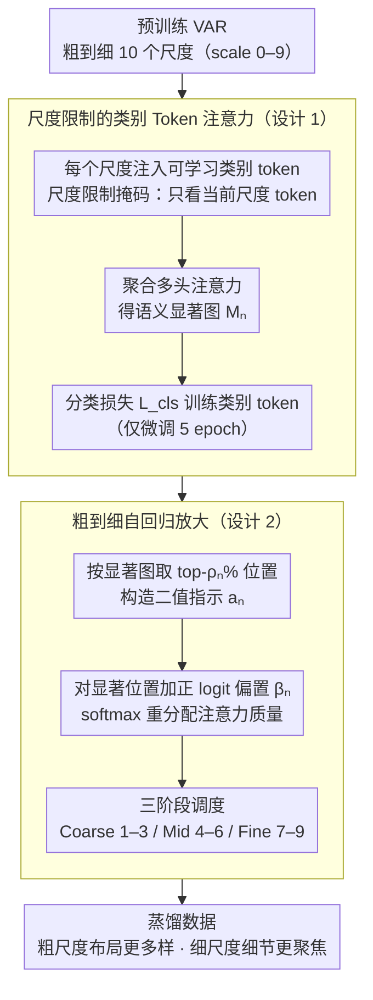

<!-- 由 src/gen_stubs.py 自动生成 -->
# HierAmp: Coarse-to-Fine Autoregressive Amplification for Generative Dataset Distillation

**会议**: CVPR2026  
**arXiv**: [2603.06932](https://arxiv.org/abs/2603.06932)  
**代码**: [Oshikaka/HIERAMP](https://github.com/Oshikaka/HIERAMP)  
**领域**: 模型压缩 / 数据集蒸馏  
**关键词**: 数据集蒸馏, 视觉自回归模型, 层次语义放大, 粗到细生成, codebook token 多样性

## 一句话总结

提出 HierAmp，在视觉自回归（VAR）模型的粗到细生成过程中，向每个尺度注入可学习的类别 token 识别语义显著区域，并通过正 logit 偏置放大这些区域的注意力，使蒸馏数据在粗尺度获得更丰富多样的布局、在细尺度聚焦于类别相关细节，在多个数据集蒸馏基准上达到 SOTA。

## 背景与动机

1. **数据集蒸馏的局限**：现有方法主要优化全局分布接近度（梯度匹配、轨迹匹配、分布匹配），但未直接关注下游分类所需的判别性语义信息
2. **层次语义被忽视**：物体语义天然具有层次结构——全局布局约束局部结构、局部结构约束纹理细节，但现有蒸馏方法在单一潜空间上建模，未考虑这种层次性
3. **传统方法视觉质量差**：基于优化的蒸馏方法生成的图像缺乏视觉保真度，看起来像特征抽象而非自然图像
4. **GAN 方法多样性不足**：早期 GAN 用于蒸馏虽提升了视觉质量，但生成多样性有限
5. **扩散模型成本高**：扩散模型质量好但去噪链条长、计算开销大
6. **VAR 的天然对齐**：视觉自回归模型的粗到细生成范式与物体语义的层次结构天然对齐——早期尺度生成整体结构，后续尺度补充细节，为层次语义放大提供了理想框架

## 方法详解

### 整体框架

HierAmp 想让数据集蒸馏直接服务于下游分类需要的判别性语义，而不是只追全局分布接近。它的切入点是视觉自回归（VAR）模型天然的粗到细生成——早期尺度定整体结构、后续尺度补细节，正好对应"全局布局→局部结构→纹理细节"的物体语义层次。方法基于预训练 VAR（10 个尺度，scale 0–9），在每个尺度注入一个可学习类别 token，先用分类目标训练它去捕获该尺度的语义，再借它的注意力图找出显著区域、放大那里的注意力，从而让蒸馏数据"粗尺度更多样、细尺度更聚焦"。

### 关键设计

**1. 尺度限制的类别 Token 注意力：让每个尺度长出自己的语义显著图**

要放大显著区域，先得知道每个尺度上"哪里语义重要"。HierAmp 在每个尺度 $n$ 拼一个可学习类别 token $[c]_n$，并用尺度限制注意力掩码约束它只看当前尺度的图像 token（屏蔽跨尺度连接），这样每个尺度的语义判断互不串扰。聚合多头注意力后得到该尺度的语义显著图 $\mathbf{M}_n \in \mathbb{R}^{h_n \times w_n}$，类别 token 由分类损失 $\mathcal{L}_{cls} = \frac{1}{N}\sum_{n=1}^{N}(-\log p_n(\mathbf{c}_n^e))$ 训练，确保显著图真的对应类别相关区域。

**2. 粗到细自回归放大：在生成时把注意力质量推向语义区**

有了显著图，就在自回归生成时直接放大那些位置的概率质量。从注意力图 $\mathbf{m}_n$ 取 top-$\rho_n\%$ 位置组成显著集合 $\mathcal{S}_n$，构造二值指示向量 $\mathbf{a}_n$，对显著位置加一个正 logit 偏置 $\beta_n$：

$$\tilde{\mathbf{L}}_n^{(h)} = \mathbf{L}_n^{(h)} + \beta_n \cdot \mathbf{1} \cdot \mathbf{a}_n^\top$$

改后的注意力 $\tilde{\boldsymbol{\alpha}}_n^{(h)} = \text{softmax}(\tilde{\mathbf{L}}_n^{(h)})$ 就把更多概率压到语义相关区域。放大按三阶段调度——Coarse（scale 1–3）、Mid（scale 4–6）、Fine（scale 7–9）各用独立的 $\rho$ 参数，于是粗尺度放大带来更丰富的布局多样性、细尺度放大带来对类别纹理的聚焦，形成一对互补效应。

### 损失函数

训练目标包含 VAR 原始的跨尺度交叉熵损失（teacher forcing）和类别 token 的分类损失 $\mathcal{L}_{cls}$。整个过程只需微调 5 个 epoch 就能训好类别 token，推理时额外开销极小。

## 实验关键数据

### 主实验：与 SOTA 方法对比（Table 1）

| 数据集 | IPC | ResNet-18 最佳 | 对比方法 |
|---|---|---|---|
| CIFAR-10 | 10 | **44.3%** | D3HR 41.3%, RDED 37.1% |
| CIFAR-100 | 10 | **52.0%** | D3HR 49.4%, RDED 42.6% |
| ImageNet-Woof | 10 | **45.8%** | CaO2 45.6%, RDED 38.5% |
| ImageNet-100 | 50 | **68.1%** | CaO2 68.0%, RDED 61.6% |
| ImageNet-1K | 10 | **47.6%** | CaO2 46.1%, D3HR 44.3% |
| ImageNet-1K | 50 | **60.8%** | CaO2 60.0%, D3HR 59.4% |
| ImageNet-1K | 100 | **62.7%** | D3HR 62.5% |

在几乎所有数据集和 IPC 设置下均达到最高准确率，尤其在 ImageNet-1K IPC=10 上领先次优 CaO2 达 1.5%。

### 跨架构泛化（Table 2，ImageNet-1K IPC=10）

| Teacher → Student | HierAmp | RDED | D3HR |
|---|---|---|---|
| MobileNet-V2 → ResNet-18 | **46.2%** | 34.4% | 43.4% |
| ResNet-18 → EfficientNet-B0 | **38.7%** | 36.6% | 38.3% |
| EfficientNet-B0 → EfficientNet-B0 | **28.7%** | 23.5% | 28.1% |

跨架构泛化能力一致优于 RDED 和 D3HR。

### 消融实验（Table 3，ImageNet-1K IPC=10）

- 无放大基线：45.6%
- 仅放大 Coarse（β=5, ρ=50%）：**47.6%**（提升最大）
- 仅放大 Mid：46.9%
- 仅放大 Fine：46.5%
- 全尺度放大：**47.6%**

**关键发现**：粗尺度放大贡献最大，因为它奠定了全局结构并影响后续尺度的语义丰富度。

### Token 分布分析

- **粗尺度放大** → token 熵和覆盖率增加（更多样的布局组合）
- **细尺度放大** → token 使用集中（聚焦于类别相关纹理细节）
- 这一对称效应解释了为何分层放大优于单一尺度放大

## 亮点

- **新颖视角**：首次从层次语义放大角度分析数据集蒸馏，揭示了粗尺度多样性 vs. 细尺度聚焦的对称效应
- **设计优雅**：仅需注入轻量类别 token + 正 logit 偏置，无需外部分割工具，推理额外开销极小
- **可解释性强**：通过 token 熵/覆盖率分析和注意力可视化，提供了清晰的机理解释
- **一致的 SOTA**：在 CIFAR-10/100、ImageNet-Woof/100/1K 上全面领先
- **跨架构泛化**：蒸馏数据在不同 teacher-student 架构组合中表现稳定

## 局限与展望

- 依赖预训练 VAR 模型，无法直接迁移到其他生成框架（扩散模型、GAN 等）
- $\rho$ 和 $\beta$ 的阶段调度需要手动设定，缺乏自适应机制
- 仅在分类任务上验证，未探索检测、分割等下游任务的蒸馏效果
- 类别 token 的训练需要额外的分类标签，不适用于无监督蒸馏场景
- Table 1 中部分 ResNet-101 结果（如 ImageNet-1K IPC=10）未超越 D3HR

## 相关工作对比

| 方法 | 基础模型 | 核心策略 | 局限 |
|---|---|---|---|
| RDED | 无生成模型 | 从真实图像裁剪信息性区域 | 受限于原始数据质量 |
| D3HR | DDIM | 反演+分布匹配 | 高分辨率计算消耗大 |
| CaO2 | Diffusion | 概率采样+潜码优化 | 推理链条长 |
| Minimax | Diffusion | 极大极小优化 | 可扩展性有限 |
| **HierAmp** | **VAR** | **层次语义放大** | **依赖 VAR 预训练** |

## 评分

- 新颖性: ⭐⭐⭐⭐ — 层次语义放大视角新颖，类别 token + logit bias 设计简洁
- 实验充分度: ⭐⭐⭐⭐ — 多数据集、多 IPC、跨架构、消融和分析全面
- 写作质量: ⭐⭐⭐⭐ — 结构清晰，分析部分（token 熵/覆盖率）提供了良好的可解释性
- 价值: ⭐⭐⭐⭐ — 为数据集蒸馏提供了新的层次语义理解视角，实用性强

<!-- RELATED:START -->

## 相关论文

- [\[CVPR 2025\] Curriculum Coarse-to-Fine Selection for High-IPC Dataset Distillation](../../CVPR2025/model_compression/curriculum_coarse-to-fine_selection_for_high-ipc_dataset_distillation.md)
- [\[CVPR 2026\] Grid Distillation: Compositional Image Distillation via Structured Generative Grids](grid_distillation_compositional_image_distillation_via_structured_generative_gri.md)
- [\[CVPR 2026\] Dataset Distillation by Influence Matching](dataset_distillation_by_influence_matching.md)
- [\[CVPR 2026\] Mitigating The Distribution Shift of Diffusion-based Dataset Distillation](mitigating_the_distribution_shift_of_diffusion-based_dataset_distillation.md)
- [\[CVPR 2026\] IMS3: Breaking Distributional Aggregation in Diffusion-Based Dataset Distillation](ims3_breaking_distributional_aggregation_in_diffusion-based_dataset_distillation.md)

<!-- RELATED:END -->
