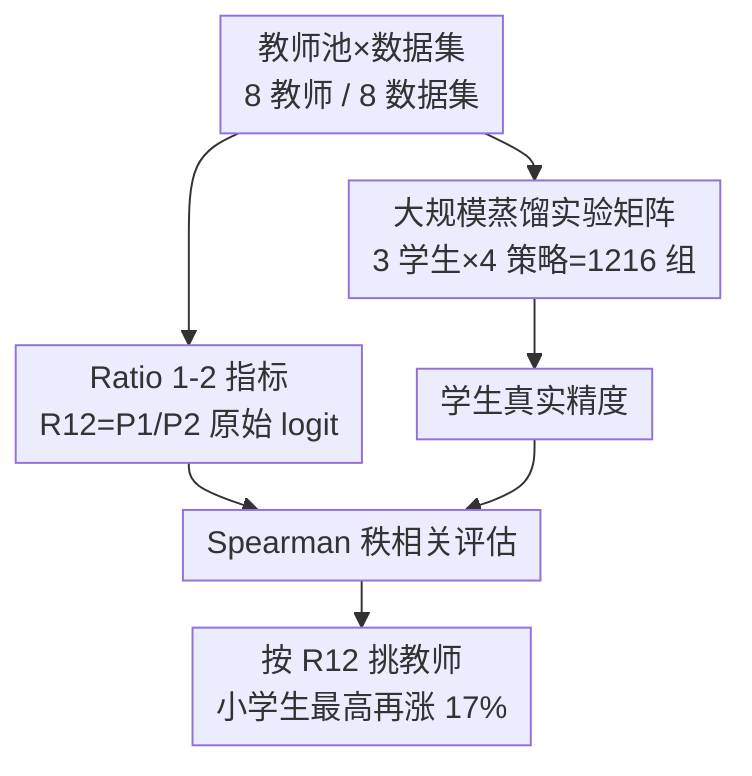

# How to Choose Your Teacher for Fine Grained Image Recognition

**会议**: CVPR 2026  
**arXiv**: [2605.15689](https://arxiv.org/abs/2605.15689)  
**代码**: https://github.com/arkel23/FGIR-KD-Teacher (有)  
**领域**: 模型压缩 / 知识蒸馏  
**关键词**: 知识蒸馏, 细粒度图像识别, 教师选择, logit 过自信, 实证研究

## 一句话总结
这是一篇围绕"细粒度识别的知识蒸馏里到底该选哪个教师"的大规模实证研究：作者跑了 1216 组实验，提出用教师 top-1/top-2 **原始 logit 比值** $R_{12}$ 作为教师选择指标，发现它比"教师准确率""次类概率方差"更能预测学生最终精度，据此挑教师可让小学生模型最高再涨 17%。

## 研究背景与动机
**领域现状**：细粒度图像识别（FGIR，如鸟种、车型）要区分超类内部高度相似的子类。大 backbone 精度高但太重，难以落地到受限设备；知识蒸馏（KD）把大教师的知识迁到小学生上是常见压缩手段。

**现有痛点**：学生精度 $Acc=f(D,T,S,L,H)$ 受数据集、教师、学生、训练策略/损失、超参共同影响。其中**教师如何选**长期被忽视。已有两个直觉性指标都不靠谱：教师准确率（TAC）——Cho & Hariharan 早已指出"教师越准学生未必越好"；次类软概率方差（SSP，Tan et al.）——它假设软标签里次高几类的概率分布越分散信息越多，但在 FGIR 里**类间差异本就细微、次类概率天然很小**，方差区分度差。

**核心矛盾**：大教师容量大、单独精度高，却往往**预测过自信**——softmax 几乎把全部质量压到 top-1，软标签退化成接近 hard label，学生学不到"这张图既像 A 又有点像 B"的细粒度类间关系。容量与"软标签信息量"之间存在 trade-off。

**本文目标**：找到一个能在蒸馏前、仅看教师自身预测就**预判学生表现**的指标，把教师选择从碰运气变成可量化。

**切入角度**：既然过自信是病根，就直接去量教师"有多自信"——而且要在**原始 logit**（未经 softmax 归一化）上量，因为 softmax 会抹掉细粒度场景里本就微弱的次高信号。

**核心 idea**：用 top-1 与 top-2 原始 logit 的比值 $R_{12}=P_1/P_2$ 当作"过自信探针"，比值越小说明教师认为多个类都有可能、软标签越富信息，越适合当教师。

## 方法详解

### 整体框架
本文不是提出一个新模型，而是一套"**教师选择指标的评测与验证流程**"。核心思路是：在固定数据集、学生、训练策略的前提下，逐一换教师跑蒸馏，得到每个教师对应的真实学生精度；同时为每个教师算出候选指标（TAC / SSP / $R_{12}$）；最后用 **Spearman 秩相关**衡量"指标排序"与"学生真实精度排序"有多吻合——相关性越高，说明这个指标越能在训练前帮你挑对教师。整张实验矩阵覆盖 8 数据集 × 3 学生 × 8 教师 × 4 训练策略（外加 4 种额外蒸馏损失），共 1216 组。

### 关键设计

**1. Ratio 1-2 指标：用原始 logit 比值量化教师过自信**

针对"FGIR 里 softmax 抹掉细微次类信号、SSP/TAC 失效"这个痛点，作者绕开归一化概率，直接在教师**原始 logit**上做文章。给定输入 $\mathbf{x}$、$N$ 类分类器 $F$，logit $\mathbf{y}=F(\mathbf{x})$ 降序排成 $\mathbf{P}=\text{sort}(\mathbf{y})$（$P_1\ge P_2\ge\cdots\ge P_N$），指标定义为

$$R_{12}=\frac{P_1}{P_2}$$

比值越大，教师把"票"几乎全投给一个类（过自信），软标签信息越贫乏；比值越小，说明教师认为 top-2 两类都很像、给出更细腻的判断，学生能从中学到子类间的微妙关系。单个教师的最终 $R_{12}$ 是把该比值在每个 batch 内所有样本、所有训练 epoch 上取平均。相比 SSP 看次高几类概率的标准差，$R_{12}$ 只盯 top-1 vs top-2 这一对、且用未归一化的 logit，恰好抓住细粒度场景"第一第二名拉得开不开"这一最关键的信号

**2. 与既有指标的对照：为什么 TAC 和 SSP 在 FGIR 里失灵**

TAC（教师准确率）默认"教师越准越好"，但大教师虽准却过自信，软标签退化；SSP 用次类概率（softmax 后）的标准差衡量信息量，可 FGIR 类间差异本就小、softmax 后次类概率普遍接近 0，方差信号被压没。$R_{12}$ 的区别在于：① 用 logit 而非概率，保留被 softmax 压缩掉的尺度信息；② 只看最关键的 top-1/top-2 对比，而不是混进一堆数值接近 0 的次类。实验里这三者用同一套相关性框架直接对打，是本文"提出指标 + 证明它更好"的论证主轴

**3. 核心发现：小教师反而是好教师，容量与可教性需平衡**

把 $R_{12}$ 套到具体教师上得到一个反直觉但可解释的规律：参数量最小的 VGG-19（约 23M）在 Aircraft、CUB、Dogs、Moe、Pets 等多数据集上都是**最低 $R_{12}$**（最不过自信）的教师；而容量最大的 ResNetV2-101x3-BiT（约 421M）则一致给出**最高 $R_{12}$**。即"小模型预测更含糊、软标签更富信息，因而更适合当教师"。这与 Cho & Hariharan 关于"学生学不动过大教师（容量错配）"的结论相互印证——大教师强归强，过自信会堵死知识传递，选教师要在容量和置信度之间取平衡

### 损失函数 / 训练策略
学生统一用 Hinton 的 vanilla KD 损失 $\mathcal{L}=\mathcal{L}_{\text{CE}}(y^{S},y_{gt})+\beta\mathcal{L}_{\text{KD}}(y^{S},y^{T})$（CE + KL 散度）。教师按专化程度分三档训练：冻结 backbone 接线性头（FZ）、全量微调（FT）、反事实注意力学习（CAL）。学生训练策略相应分四类：FZ / FT / CAL 教师，外加 SOTA 的 **TGDA**（Teacher-Guided Data Augmentation，让 CAL 教师生成数据感知增强，并对增强图额外加一项 $\mathcal{L}_{\text{KD}}(y^{S}_{aug},y^{T}_{aug})$）。这套设计是为了覆盖"教师特化程度"这一变量，验证指标在不同监督强度下是否稳健。

## 实验关键数据

### 主实验
相关性分组（占全部实验的百分比，Spearman 秩相关；Strong 越多越好）：

| 相关强度 | TAC | SSP | $R_{12}$ (本文) |
|--------|------|------|------|
| Weak (0–0.5) | 42.2% | 39.8% | **28.1%** |
| Modest (0.51–0.7) | 25.8% | 16.4% | 21.1% |
| Strong (0.71–1) | 32.0% | 43.8% | **50.8%** |

$R_{12}$ 把强相关比例拉到 50.8%，比第二名 SSP（43.8%）高约 7 个百分点；弱相关比例最低。按数据集看的绝对平均相关性：$R_{12}$ 在 8 个数据集中 5 个最高，总平均 **0.629** > SSP 0.559 > TAC 0.524。

LCNet-35 学生（从头训练，TGDA 策略）用不同指标选出的教师蒸馏后的精度：

| 数据集 | CE（无蒸馏） | TAC | SSP | $R_{12}$ |
|--------|------|------|------|------|
| Aircraft | 77.3 | 84.0 | 84.5 | **85.2** |
| Cars | 29.9 | 75.7 | 82.5 | 82.5 |
| CUB | 51.2 | 67.0 | 64.1 | **73.5** |
| Dogs | 43.9 | 55.2 | 68.0 | 68.0 |
| Flowers | 70.8 | 77.6 | 88.6 | 88.6 |
| Moe | 90.6 | 92.4 | 95.2 | 95.2 |
| NABirds | 22.9 | 62.4 | 62.4 | **67.8** |
| Pets | 61.3 | 78.6 | 79.1 | **80.2** |
| **平均** | 56.0 | 74.1 | 78.1 | **80.1** |

按 $R_{12}$ 选教师的学生平均 80.1%，比按已有指标选高最多约 6 个百分点；相对 CE 基线在 Cars 上猛涨 52.5%、NABirds 涨 44.9%。

### 消融实验
按监督强度（训练策略）拆分的相关性分组：

| 策略 | 相关强度 | TAC | SSP | $R_{12}$ |
|------|--------|------|------|------|
| CAL | Strong | 29.2% | 37.5% | **58.3%** |
| TGDA | Strong | 16.7% | 50.0% | **66.7%** |

教师越特化（CAL→TGDA），$R_{12}$ 优势越明显：CAL 下平均相关 0.674、强相关 58.3%；TGDA 下升到 0.753、强相关 66.7%。说明该指标对"高度特化的教师"尤其有效。

### 关键发现
- $R_{12}$ 的优势集中在**强相关比例**：它把更多实验设定的"指标—学生精度"关系推进到强相关区，而非小幅提升平均值，意味着实际选教师时更不容易翻车。
- **小教师更好教**：VGG-19（23M）反复成为最低 $R_{12}$、最适合的教师；ResNetV2-101x3-BiT（421M）反复最过自信。容量越大未必越会教。
- **架构无关**：LCNet-35 这种轻量 CNN 学生面对 CNN/Transformer 混合教师池时，$R_{12}$ 仍能稳定选出每个数据集的最优教师，说明该指标对师生架构错配不敏感。
- 教师选对了，低监督设定（如 CAL）有时能逼近高监督设定的精度——教师选择本身的杠杆不亚于换训练策略。

## 亮点与洞察
- **绕开 softmax 直接用 logit 比值**：FGIR 的核心难点是次类信号微弱，softmax 归一化恰恰把这点尺度信息压没了；只取 top-1/top-2 原始 logit 之比，既简单又精准抓住"过自信"，这是全文最妙的一招。
- **"小教师更会教"的可解释规律**：把一个反直觉现象（小模型当教师更好）用"过自信—软标签信息量"统一解释，并和经典的容量错配结论对上，提供了可迁移的选教师直觉。
- **方法论价值高于单一指标**：1216 组实验 + Spearman 秩相关的评测框架，本身就是研究"教师选择指标"的可复用范式，换个新指标进来直接能比。
- 指标**零额外训练成本**：$R_{12}$ 只需教师在目标集上前向一遍取 logit，蒸馏前就能算，工程上几乎免费。

## 局限与展望
- **只验证 vanilla KD + 固定超参**：为压缩设计空间，作者主要固定损失 $L$ 和超参 $H$，$R_{12}$ 在更复杂的特征蒸馏、关系蒸馏等损失下是否仍预测准确，没有充分覆盖。
- **指标仍非完美预测器**：即便最好，强相关也只有约 50%（全设定）/66.7%（TGDA），意味着仍有相当比例的设定下选教师会失手，距离"可靠预判"还有差距。
- **平均相关性优势有限**：总平均 0.629 仅比 SSP 0.559 高约 0.07，部分数据集（如 Cars 0.407 < TAC 0.479）上反而落后，结论的强弱依数据集而异，需谨慎外推。⚠️ 横向比不同数据集的相关数值时要注意各集难度不同，不可直接比大小。
- 全部聚焦 FGIR；在普通粗粒度分类（类间差异大、softmax 信号充分）上，$R_{12}$ 是否还优于 SSP 未验证。

## 相关工作与启发
- **vs TAC（教师准确率，Cho & Hariharan）**：TAC 假设"教师越准越好"，本文证明在 FGIR 里它最不可靠（弱相关比例最高 42.2%）；$R_{12}$ 改测"过自信"而非"准不准"，正是对 Cho & Hariharan"大教师未必好教"现象的量化落地。
- **vs SSP（次类软概率方差，Tan et al.）**：SSP 在 softmax 概率上量次类离散度，本文指出 FGIR 次类概率天然过小导致信号被压没；$R_{12}$ 改用未归一化 logit 且只看 top-1/top-2，在细粒度场景更敏感，强相关比例 50.8% vs 43.8%。
- **vs TGDA（Teacher-Guided Data Augmentation）**：TGDA 是 FGIR 蒸馏的 SOTA 训练策略（本文当作一种训练设定），二者正交——TGDA 解决"怎么蒸"，$R_{12}$ 解决"用谁蒸"，且在 TGDA 设定下 $R_{12}$ 的优势最大（强相关 66.7%）。

## 评分
- 新颖性: ⭐⭐⭐⭐ 教师选择指标本身是窄而具体的创新点，$R_{12}$ 简单但角度新；非新框架。
- 实验充分度: ⭐⭐⭐⭐⭐ 1216 组实验覆盖 8 数据集/3 学生/8 教师/4 策略，规模与诚实度都到位。
- 写作质量: ⭐⭐⭐⭐ 逻辑清晰、动机—指标—验证链条完整；部分结论的 caveat 可更显式。
- 价值: ⭐⭐⭐⭐ 给 FGIR 蒸馏落地提供了近零成本的选教师准则，工程实用性强。

<!-- RELATED:START -->

## 相关论文

- [\[CVPR 2026\] DAGE: Dual-Stream Architecture for Efficient and Fine-Grained Geometry Estimation](dage_dual-stream_architecture_for_efficient_and_fine-grained_geometry_estimation.md)
- [\[CVPR 2026\] DiT-Distill: Open-Set Fine-Grained Retrieval via Generative Curriculum Knowledge](dit-distill_open-set_fine-grained_retrieval_via_generative_curriculum_knowledge.md)
- [\[ACL 2026\] Find Your Optimal Teacher: Personalized Data Synthesis via Router-Guided Multi-Teacher Distillation](../../ACL2026/model_compression/find_your_optimal_teacher_personalized_data_synthesis_via_router-guided_multi-te.md)
- [\[CVPR 2026\] Distilling Balanced Knowledge from a Biased Teacher](distilling_balanced_knowledge_from_a_biased_teacher.md)
- [\[CVPR 2026\] Teacher-Guided Routing for Sparse Vision Mixture-of-Experts](teacher-guided_routing_for_sparse_vision_mixture-of-experts.md)

<!-- RELATED:END -->
