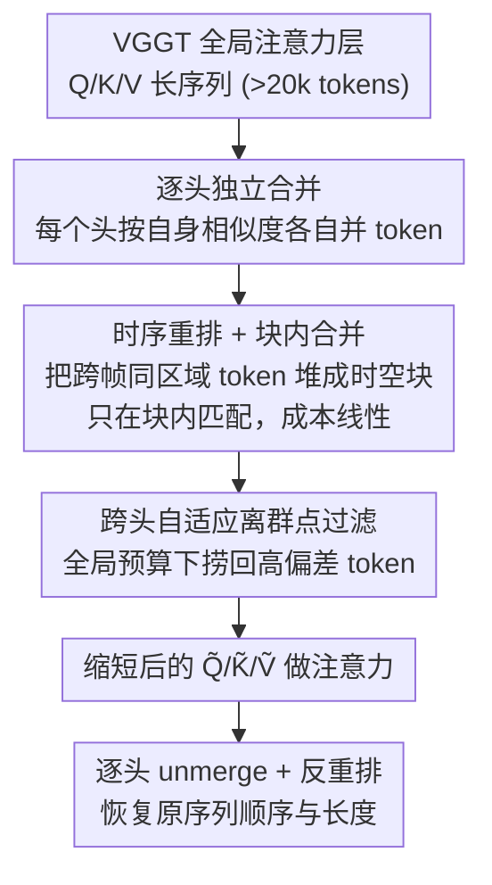

# HTTM: Head-wise Temporal Token Merging for Faster VGGT

**会议**: CVPR 2026  
**论文**: [CVF Open Access](https://openaccess.thecvf.com/content/CVPR2026/html/Wang_HTTM_Head-wise_Temporal_Token_Merging_for_Faster_VGGT_CVPR_2026_paper.html)  
**代码**: 未公开  
**领域**: 模型压缩 / 高效注意力 / 3D 重建加速  
**关键词**: token merging、VGGT、3D 重建、注意力加速、免训练

## 一句话总结
HTTM 是一种免训练的 token 合并方法，专为 VGGT 全局注意力层定制：通过「逐注意力头独立合并 + 时序重排的块内合并 + 跨头自适应离群点过滤」，在几乎不掉点的情况下把长序列 3D 重建推理加速最高 7×。

## 研究背景与动机

**领域现状**：VGGT（Visual Geometry Grounded Transformer）是 3D 重建领域的一次跃迁——它用一个前馈 Transformer 一次性联合推断相机位姿、深度、稠密几何，省去了传统多视图重建里昂贵的几何后处理。它的核心机制是「帧内注意力」与「全局注意力」交替：全局注意力层让所有视图的 token 做 all-to-all 交互，从而建立跨帧的 3D 对应关系。

**现有痛点**：正是这个全局注意力成了瓶颈。即使是小场景，token 序列也轻松超过 2 万；序列随视图数线性增长，而注意力是二次复杂度，于是大场景、长序列重建时延迟急剧上升。

**核心矛盾**：现成的长序列加速方法分两类，对 VGGT 都不灵。一类是 LLM/VLM 里流行的**稀疏注意力**，依赖「注意力分数集中在少数 token」的稀疏假设——但论文实测（Fig. 2）VGGT 的注意力分布比 Llama 平坦得多，稀疏度不够，省不了多少时延。另一类是 **ToMe 系**的相似度合并（如 FastVGGT 直接搬 ToMeSD），适配了 VGGT 较平的注意力分布，但它们对所有头用**统一的合并拓扑**，且在长序列上做全局相似度匹配，开销极大。

**切入角度**：作者系统分析了 VGGT token 的相似度结构，发现两条规律：(1) RoPE 在 VGGT 每一层都重新施加（不像 BERT/SD 只在输入端加一次），在帧内注意力层让不同帧的同一空间区域共享相近位置编码，从而诱导出**跨帧时序对应**；(2) 输入层面的视觉冗余会逐层传播，强化空间局部相似。两者叠加，让 token 在「空间局部」和「时序对应」两个维度上高度冗余——这正是可合并的结构。

**核心 idea**：在**注意力头粒度**上做合并（而非所有头统一），既保住拼接后特征的多样性，又能利用头级别观察到的空间局部性与时序对应，用「时序重排成块 + 块内合并」把匹配成本从二次降到线性，再用跨头离群点过滤兜底质量。

## 方法详解

### 整体框架
HTTM 嵌在 VGGT 的全局注意力层里：进入注意力核之前，对每个头的 Q/K/V token 独立做合并（缩短序列）；注意力算完之后再 unmerge 回原长度。要让「缩短序列」既便宜又不掉质量，HTTM 串起三个组件：先做**逐头独立合并**保住头间多样性，再用**时序重排 + 块内合并**把高相似 token 聚到同一个小块里、只在块内匹配从而把成本降为线性，最后用**跨头自适应离群点过滤**把那些被强行并进低相似块的「离群 token」捞出来单独保留。

### 关键设计

**1. 逐头独立 token 合并：保住拼接后特征的唯一性**

痛点很直接：ToMe/FastVGGT 对所有注意力头用同一套合并拓扑（哪些 token 并到一起对所有头都一样），这等于强制不同头以相同方式聚合 token，拼接（concat）之后各头输出趋同、出现「重复 token」，削弱了多头注意力本该有的表征多样性（Fig. 7）。HTTM 改成**每个头按自己的相似度模式独立合并**：对头 $i$，把 token 划成源集 $S^{(i)}$ 与目标集 $D^{(i)}$，算余弦相似度矩阵 $\text{Sim}^{(i)}=\text{RowNorm}(S^{(i)})\cdot\text{RowNorm}(D^{(i)})^\top$，每个源 token 只保留与最相似目标的匹配，取 top-$r$ 合并（合并 token 取被并 token 的均值）。Q、K 各自独立合并，V 跟随 K 的匹配以保证 key-value 一致；unmerge 时把合并 token 的输出直接拷回每个原始 token。这样不同头能以互补方式组合 token，concat 后表征更丰富——代价是开销随头数线性增长，这正是已有方法回避逐头合并的原因，需要下一个设计来摊薄。

**2. 时序重排 + 块内合并：把二次匹配成本压成线性**

逐头合并最贵的一步是算相似度矩阵 $\text{Sim}^{(i)}$：对 $N$ 个 token、按 25% 目标 / 75% 源划分，FLOPs 约 $0.19N^2 d_{\text{head}}$，随 token 数二次增长。HTTM 把整条序列切成固定大小 $n_b$ 的合并块、**只在块内做合并**，于是匹配成本随 $N$ 线性增长。但直接沿 $N$ 维切连续块只能抓住主对角线附近的空间相似（Fig. 8a），大量高相似的**跨帧匹配**落在块外被浪费。作者的解法是 **Temporal Reordering**：合并前先把 $n_t$ 个相邻帧里**同一空间区域**（大小 $n_s$）的 token 堆叠到一起，形成大小 $n_b=n_s\times n_t$ 的时空合并块，让空间局部 + 时序对应的高相似 token 都进到同一块里再做块内合并（Fig. 8b 显示重排后块内高相似匹配显著增多）。注意力算完先在块内 unmerge、再反重排让输出顺序对齐输入。这一步把 §3.1 观察到的时空冗余结构真正变现为「同样块大小下更高的合并质量」，也让设计 1 的逐头开销被块化摊薄。

**3. 跨头自适应离群点过滤：在全局预算下保护被错并的 token**

为了并行，块的空间大小、时序帧数、合并比例在所有块/所有头上都固定，但这并不总和真实相似度分布对齐：某些块内相似度低，强行按固定比例合并会把低相似 token 并进去，导致合并 token 与原 token 距离很大——这些就是**离群点**。HTTM 不逐块调比例，而是在**全局预算**下跨所有头统一过滤：先做一次初始合并，算每个原 query token 到其合并 token 的 L2 偏差（未被合并的偏差记 0），跨所有头取偏差最大的 top-$d\%$ 标为离群点（二值掩码 $M_o\in\{0,1\}^{h\times N}$），再把这些离群点从合并 token 中**减去贡献并恢复为独立 token**。这等于把过滤预算自适应地分给离群更密集的头，既保护了合并 token 的表征能力，又保住离群 token 的唯一性（仅作用于 query，并用自定义 CUDA kernel 块内并行实现）。消融显示这一步是质量的「保险丝」：去掉后即便 token 数相同，重建也会灾难性崩盘。

### 损失函数 / 训练策略
HTTM 是**完全免训练**的推理期方法，不改 VGGT 权重、无任何 loss。实验配置：时序重排用空间块 $n_s=128$、时序帧 $n_t=30$（块大小 $n_b=3840$）；query 合并 90% 并过滤 10% 离群点（最终 query 序列为原长 20%），key/value 合并 70%（保留 30%）。推理在 A100 上用 Bfloat16 + FlashAttention，baseline 为 FastVGGT 里显存高效的 VGGT*。

## 实验关键数据

评测指标：重建质量用 Chamfer distance 衡量的 **Acc.（重建点到 GT 的距离，越低越好）** 与 **Comp.（GT 到重建点的距离，即完整度，越低越好）**；**Q ratio / K/V ratio** 指合并后保留的序列长度比例（越小压得越狠）。

### 主实验
跨数据集（7Scenes、NRGBD 每 10 帧采关键帧，及弱重叠的 ETH3D）重建对比：

| 方法 | Q / K·V 比例 | NRGBD Acc.↓ | NRGBD Comp.↓ | NRGBD Time↓ | 7Scenes Time↓ |
|--------|------|------|------|------|------|
| VGGT*（baseline） | 1.00 / 1.00 | 0.010 | 0.010 | 13.9s | 9.1s |
| FastVGGT | 0.34 / 0.34 | 0.016 | 0.013 | 7.0s | 4.5s |
| **VGGT*+HTTM** | **0.20 / 0.30** | **0.012** | **0.010** | **6.8s** | **4.3s** |

HTTM 用更狠的合并比例（更短序列）在 NRGBD 上反超 FastVGGT、在 7Scenes 上与之持平，且质量贴近原始 VGGT。

长序列时延（Table 2，帧数越多优势越大）：

| 方法 | Q / K·V | 100 帧 | 300 帧 | 1000 帧 |
|--------|------|------|------|------|
| VGGT* | 1.00 / 1.00 | 9.1s | 60.7s | 724.6s |
| FastVGGT | 0.34 / 0.34 | 4.5s | 22.4s | 175.2s |
| **VGGT*+HTTM** | **0.20 / 0.30** | **4.3s** | **16.3s** | **102.8s** |

1000 帧时较原始 VGGT 加速约 **7×**。时延拆解（Table 3，1000 帧）显示关键差距在匹配成本：HTTM 匹配仅 0.12s vs FastVGGT 2.31s，聚合略高（0.41s vs 0.11s），综合带来 **4.58× 的合并成本下降**。

### 消融实验
自适应离群点过滤（NRGBD，三种配置保证合并后 token 数相同）：

| 配置 | Acc.↓ | Comp.↓ | 说明 |
|------|------|------|------|
| 不做离群点过滤（并 80% query） | 0.240 | 0.310 | 质量灾难性崩盘 |
| 5% 离群点过滤（并 85%） | 0.013 | 0.011 | 接近满血 |
| 10% 离群点过滤（并 90%，本文） | 0.012 | 0.010 | 最佳 |

### 关键发现
- **离群点过滤是质量保险丝**：在 token 数相同的前提下，去掉过滤会让 Acc./Comp. 从 0.012/0.010 暴跌到 0.240/0.310，说明块内固定比例合并必须配自适应离群点回收。
- **空间 vs 时序合并随场景而变**（§4.3 Pareto 前沿）：时序连续帧上沿时序维合并更优，稀疏视图帧上沿空间维更优；但当成本预算够大（$n_b\ge800$）时，掺入时序合并仍优于纯空间合并。
- **匹配成本而非注意力本身是瓶颈**：HTTM 与 FastVGGT 注意力核耗时几乎一样（2.95s vs 2.97s），差距全在匹配开销，印证了块化 + 时序重排的价值。

## 亮点与洞察
- **把「RoPE 每层重施」诊断成时序冗余的来源**，再把这个结构转化为「时序重排成块」的工程手段，是一条从机制观察直达加速设计的漂亮链路。
- **逐头独立合并**反直觉地解决了「合并后多头特征趋同」问题——它指出统一合并拓扑会毁掉多头多样性，这个洞察可迁移到任何对多头 Transformer 做 token 压缩的场景。
- **全局预算下的跨头离群点过滤**是一种「先粗暴合并、再精准回收」的思路：与其逐块精调比例，不如固定比例换并行、再用一个全局 top-$d\%$ 掩码兜底，工程上更易并行化。

## 局限与展望
- 方法**强绑定 VGGT 的时空相似度结构**（交替帧内/全局注意力 + 每层 RoPE）；换成不重复施加位置编码、或不具备明显时序对应的架构，时序重排的收益可能打折。
- 几个关键超参（$n_s=128$、$n_t=30$、90%/70% 合并比例、10% 过滤）是按数据集经验选的，论文未给跨域自适应选取策略，新场景可能需要重新调。
- 评测集中在室内/连续视图重建（7Scenes、NRGBD、ETH3D），对极端稀疏视图、动态场景的鲁棒性仍待更广验证（⚠️ 部分长序列结果作者放在附录，以原文为准）。
- 离群点过滤依赖**自定义 CUDA kernel**，可移植性与在非 A100/非 FlashAttention 环境下的实际收益需额外确认。

## 相关工作与启发
- **vs FastVGGT（ToMeSD 直搬）**：两者都做相似度合并，但 FastVGGT 用统一头拓扑 + 全局匹配，既损多头多样性又匹配昂贵；HTTM 逐头合并 + 块内时序重排，在更高合并比例下质量更好、匹配成本降 4.58×。
- **vs 稀疏注意力（BigBird / SparseVLM / SparseViT 等）**：它们依赖稀疏注意力假设，而 VGGT 注意力分布偏平、稀疏度不足，加速有限；HTTM 走相似度合并路线，正好契合 VGGT 的平缓分布。
- **vs 在线 3D 方法（CUT3R / TTT3R）**：在线法靠维护全局状态避开 all-to-all，但精度仍不及 VGGT 这类离线法；HTTM 直接加速离线 VGGT，保住其质量优势。

## 评分
- 新颖性: ⭐⭐⭐⭐ 「逐头合并 + 时序重排块化 + 跨头离群过滤」三件套针对 VGGT 结构定制，洞察扎实但部件多沿用 ToMe 系。
- 实验充分度: ⭐⭐⭐⭐ 多数据集 + 长序列时延 + 时延拆解 + 离群过滤消融齐全，部分长序列结果置于附录。
- 写作质量: ⭐⭐⭐⭐ 从相似度观察到设计推导清晰，图示有力，超参选择依据可再展开。
- 价值: ⭐⭐⭐⭐ 免训练即插即用、7× 加速、几乎不掉点，对大场景 VGGT 部署很实用。

<!-- RELATED:START -->

## 相关论文

- [\[CVPR 2026\] HeSS: Head Sensitivity Score for Sparsity Redistribution in VGGT](hess_head_sensitivity_score_for_sparsity_redistribution_in_vggt.md)
- [\[CVPR 2026\] LiteVGGT: Boosting Vanilla VGGT via Geometry-aware Cached Token Merging](litevggt_boosting_vanilla_vggt_via_geometry-aware_cached_token_merging.md)
- [\[CVPR 2026\] Saliency-Driven Token Merging for Vision Transformers](saliency-driven_token_merging_for_vision_transformers.md)
- [\[CVPR 2026\] One Layer's Trash is Another Layer's Treasure: Adaptive Layer-wise Visual Token Selection in LVLMs](one_layers_trash_is_another_layers_treasure_adaptive_layer-wise_visual_token_sel.md)
- [\[CVPR 2026\] MeToM: Metadata-Guided Token Merging for Efficient Video LLMs](metom_metadata-guided_token_merging_for_efficient_video_llms.md)

<!-- RELATED:END -->
