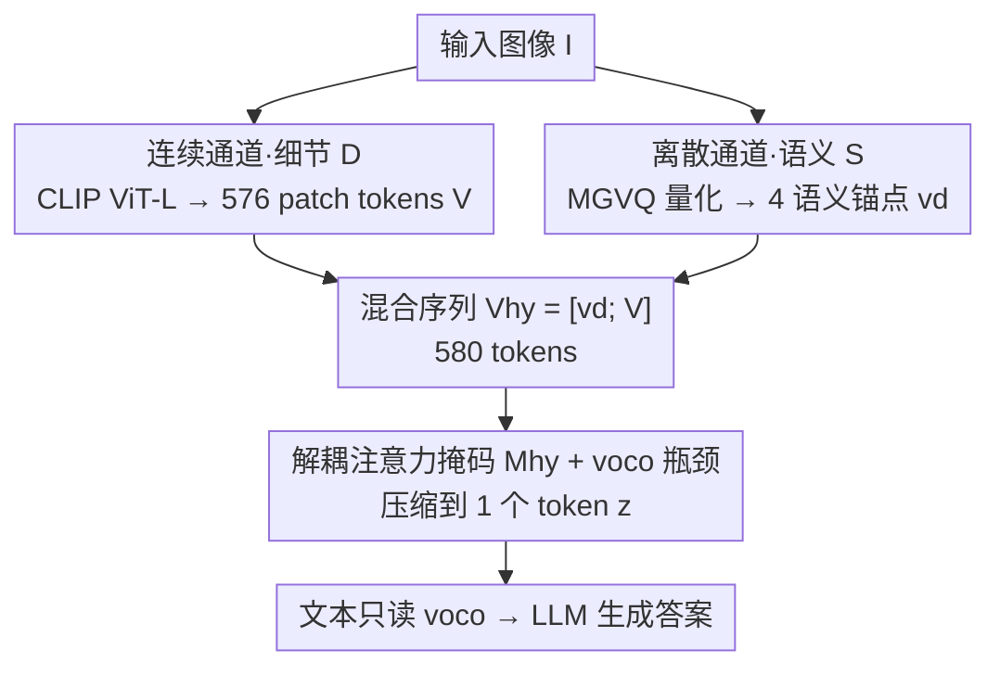

# Hybrid Token Compression for Vision-Language Models

**会议**: CVPR 2026  
**论文**: [CVF Open Access](https://openaccess.thecvf.com/content/CVPR2026/html/Zhang_Hybrid_Token_Compression_for_Vision-Language_Models_CVPR_2026_paper.html)  
**代码**: https://github.com/jushengzhang/HybridToken-VLM  
**领域**: 模型压缩 / 多模态VLM  
**关键词**: 视觉token压缩, VLM, 离散量化, 语义-外观解耦, 单token瓶颈

## 一句话总结
针对"把视觉 token 压到 1 个时，连续压缩丢语义、离散量化丢细节"的两难，HTC-VLM 用连续通道（ViT patch 保细节）+ 离散通道（MGVQ 量化出 4 个语义锚点）双路解耦，再经解耦注意力掩码与 `<voco>` 瓶颈把 580 个 token 压成 1 个，在 7 个基准上把性能保持率从 81.0% 提到 87.2%。

## 研究背景与动机
**领域现状**：现代 VLM（LLaVA、Qwen-VL 等）靠几百个 patch 级视觉 token（单张 ViT-L/14 图 N=576）给 LLM 喂感知信息。但 LLM 自注意力随序列长度二次增长 $O((N+L)^2)$，576 个 patch 让显存和上下文窗口迅速吃紧。于是人们想把视觉 token 压到极少甚至 1 个。

**现有痛点**：压缩有两条路，各有互补的失败模式。**连续压缩**（池化、注意力聚合、Q-Former、VoCo-LLaMA）把整张图投成一个稠密向量，延迟低，但把不同 patch 平均成单峰分布会"语义稀释"——例如把"狗"和"猫"的 patch 平均后，向量熵不足以区分物种，互信息 $I(v_c;S)$ 坍缩。**离散量化**（VQ-VAE、MGVQ 等码本）保住了类别语义、可解释，但量化噪声 $\epsilon=f(I)-c_k$ 抹掉了连续细节（纹理、姿态），出现"粒度鸿沟"——草地上的金毛和沙地上的贵宾可能映到同一个码 $k$，丢掉精细任务所需的线索。

**核心矛盾**：人们普遍把这当成"效率—保真"不可避免的权衡。作者从表征角度重审：把 576 个 ViT token 压成单个潜变量，会暴露一个结构性瓶颈——**一个连续单 token 没法同时编码离散语义 $S$ 和连续细节 $D$**。信息论上，要让压缩向量 $V_c$ 同时是 $S$ 与 $D$ 的充分统计量，需要满足马尔可夫条件 $S\perp D\mid V_c$，即在压缩前就把 $S$ 与 $D$ 解耦、最大化 $I(V_c;S)+I(V_c;D)$ 并减小冗余 $I(S;D\mid V_c)$。

**本文目标**：造一个超紧凑（压到 1 token）的视觉表征，既不语义稀释、也不粒度丢失。

**切入角度**：关键观察是——在瓶颈之前**插入极少量离散语义锚点**，就能恢复下游推理所需的高层语义"骨架"，而连续 token 继续保留互补的细粒度细节。两者解耦后再融合压缩，单 token 才可能同时表达 $S$ 和 $D$。

**核心 idea**：用"连续通道（细节）+ 离散通道（语义锚点）"双路解耦，融合成混合序列后再用解耦注意力掩码压成单个 `<voco>` token——即"压缩前先解耦，单 token 才有表达力"。

## 方法详解

### 整体框架
HTC-VLM 把视觉信息显式拆成两条正交通道再融合压缩。给定图像 $I$：**连续通道**用 CLIP ViT-L/14 + 可训练线性投影 $P_v$ 生成 $N=576$ 个 patch 嵌入 $V=\{v_i\}\in\mathbb{R}^{576\times4096}$，承载低层细节 $D$；**离散通道**用 MGVQ 把 $I$ 量化成特征向量 $q\in\mathbb{R}^{14112}$，再经两层 GELU MLP $P_d$ 投影成 4 个离散语义锚点 $v_d\in\mathbb{R}^{4\times4096}$，承载高层语义 $S$。把 $v_d$ 前置拼到 $V$ 前面得到 580-token 的混合序列 $V_{hy}=[v_d;V]$，后接一个可训练的 `<voco>` token，并施加**解耦注意力掩码** $M_{hy}$，最终把整个混合序列压成单个潜变量 $z$（即 `<voco>` 的输出），交给 LLM 与文本一起生成答案——实现 580→1 的压缩比。

### 关键设计

**1. 双通道语义-细节解耦：连续保细节、离散补语义**

针对"单连续 token 同时丢语义又留不住细节"的两难，HTC-VLM 不在一个通道里硬扛，而是把信息拆成两条互补通道。**连续通道**保留全部 576 个 ViT patch 嵌入 $V=P_v(E_v(I))$，捕获纹理梯度、姿态等细粒度细节，维持高熵 $H(V)\propto\log|M_D|$，对应保住 $I(V;D)$、对抗粒度鸿沟。**离散通道**则用 MGVQ（多组量化，8 组、码本 16384、16× 下采样）把图像量化成 $q$，再经 $v_d=\mathrm{GELU}(W_2\cdot\mathrm{GELU}(W_1\cdot q))$ 投成仅 4 个语义锚点。MGVQ 的量化把语义聚成离散模式（如"草地上的狗"），让 $v_d$ 成为低维但稳定的语义锚 $I(v_d;S)\approx H(S)$，对应恢复 $I(q;S)$、对抗语义稀释。为什么有效：之前的单通道方法（无论纯连续还是纯离散）都没法同时优化联合信息 $I(V_c;S,D)$ 且最小化冗余 $I(S;D\mid V_c)$；把两类信息分到正交通道、各管一摊，就为"压缩前解耦"打好了基础。作者也试过多种 VQ，MGVQ 因多组量化最能聚类多样语义模式而入选。

**2. 解耦注意力掩码与 `<voco>` 单 token 瓶颈：把两通道融进一个可解释的潜变量**

光有双通道还不够，得在压成 1 个 token 时让语义和细节都"挤进去"且不互相污染。作者把 $v_d$ 前置拼成混合序列 $V_{hy}=[v_d;V]\in\mathbb{R}^{580\times4096}$，再追加可训练的 `<voco>`，并在全输入 $X=[V_{hy};\texttt{<voco>};W]$（$W$ 为文本嵌入）上定义**解耦注意力掩码** $M_{hy}$：文本 $W$ 只能注意到 `<voco>`（$M=0$）、不能直接看 $V_{hy}$；混合序列内部各 token 之间相互屏蔽（$i\neq j$ 时 $M=-\infty$，禁止自注意），其余位置放开（$M=1$）。这样 `<voco>` 成了唯一的信息出口——它必须把 $V_{hy}$ 整合进自己的潜表征 $z$，而文本只通过 $z$ 读图。作者从变分推断角度论证：这个瓶颈近似一个 VAE，`<voco>` 是隐变量 $z$、其后验 $p(z\mid V_{hy})$，训练目标对应 ELBO $\log p(Y\mid T,I)\ge \mathbb{E}_{q(z\mid V_{hy})}[\log p(Y\mid z,T)]-\mathrm{KL}(q(z\mid V_{hy})\Vert p(z))$，其中 $v_d$ 作为语义先验锚点把 $z$ 偏向 $S$、$V$ 贡献 $D$，借 $M_{hy}$ 约束降低 $I(S;D\mid z)$。为什么有效：掩码把梯度"重新布线"，$\partial L/\partial v_d$ 强化语义聚类、$\partial L/\partial V$ 细化细节方差，使单个 $z$ 同时优化 $I(z;S)+I(z;D)$。注意力分析进一步显示压缩后的 token 会优先关注离散锚点，验证了 $v_d$ 确实充当可解释的语义载体。

### 损失函数 / 训练策略
训练目标是带掩码的自回归损失 $L_{HTC}=-\mathbb{E}\big[\sum_i\log p_\theta(y_i\mid y_{<i},\texttt{<voco>},T;M_{hy})\big]$，可分解为 ELBO 形式 $L_{HTC}\approx-\mathbb{E}_{q(z\mid V_{hy})}[\log p(Y\mid z,T)]+\mathrm{KL}(q(z\mid V_{hy})\Vert p(z))+\text{const}$：第一项是重建误差、第二项正则化 $z$，掩码 $M_{hy}$ 让 $q(z\mid V_{hy})$ 依赖 `<voco>`、$v_d$ 充当 $S$ 的先验锚。训练数据、骨干与评测协议严格对齐 VoCo-LLaMA。

## 实验关键数据

> 自定义指标 **Avg.（性能保持率）**：每个基准按 $(\text{结果}-\text{下界})/(\text{上界}-\text{下界})$ 归一，上界=无压缩原模型、下界=无专门训练直接压缩；再对各基准取平均。⚠️ 个别基准（如 SQAI）保持率可 >100%，以原文为准。

### 主实验
7 个理解基准、576→1 token：

| 模型 | Tokens | GQA | VQAv2 | MMBench | MMEP | POPE | SEED | SQAI | Avg.(%) |
|------|--------|-----|-------|---------|------|------|------|------|---------|
| Upper Bound | 576 | 61.1 | 77.7 | 64.0 | 1487.2 | 85.0 | 57.9 | 66.5 | 100 |
| Q-Former | 1 | 51.1 | 63.4 | 51.7 | 1079.7 | 77.3 | 47.2 | 62.7 | 57.2 |
| Avg. Pool | 1 | 52.9 | 65.0 | 55.5 | 1210.3 | 79.1 | 50.3 | 62.2 | 64.1 |
| VoCo-LLaMA | 1 | 57.4 | 71.8 | 57.9 | 1241.4 | 81.5 | 48.8 | 66.3 | 81.0 |
| **HTC-VLM(本文)** | **1(hybrid)** | **57.6** | **72.4** | **60.0** | **1265.2** | **82.8** | **49.8** | **67.7** | **87.2** |
| Lower Bound | 1 | 37.7 | 41.2 | 22.3 | 617.3 | 53.9 | 36.9 | 60.7 | 0 |

在同样 580→1 压缩比下，HTC-VLM 把平均保持率从 VoCo-LLaMA 的 81.0% 提到 87.2%，每个基准都不输甚至超过，印证"压缩前注入离散语义锚点"能找回连续压缩必然丢失的高层语义。

### 不同 token 预算 / 表征探针
| 配置 | 结论 |
|------|------|
| 192 / 128 / 64 tokens | HTC-VLM 与 ToMe/FastV/PDrop/SparseVLM 相当；在 64-token 下保持率 89.8%，超过全部对手 |
| 表征探针 $z_{voco}$ | 细节任务 30.70%、语义任务 26.67%，两类均最佳，证明单 token 同时留住语义与细节 |
| 表征探针 $v_d$ | 仅 4 token 信息量小于 $V^-$（576 token 聚合），闭集分类略弱属预期，但在语义/细节两端都稳定可解码 |

### 关键发现
- **离散锚点是补语义的关键**：把 4 个 MGVQ 语义 token 前置再压缩，让单 token 的语义保持率显著回升，是 87.2% vs 81.0% 差距的主因。
- **极限压缩更显优势**：token 预算越紧（64），HTC-VLM 相对其它方法的优势越明显（89.8%，超过所有对手），契合"双通道解耦在单/少 token 瓶颈下才最关键"的设计初衷。
- **注意力偏向锚点**：压缩后的 `<voco>` 优先注意离散锚点，验证 $v_d$ 充当可解释的语义载体。

## 亮点与洞察
- **把"两难"重述成"解耦问题"**：作者用信息论把"效率—保真权衡"翻译成"要让单 token 当 $S$、$D$ 的充分统计量，需满足 $S\perp D\mid V_c$"，从而把工程问题变成"压缩前先解耦"的清晰目标——这个视角本身就很有启发。
- **极少离散锚点撬动大收益**：只加 4 个 MGVQ 语义 token（占 580 中不到 1%）就能把语义骨架找回来，性价比极高，提示"语义可以靠稀疏离散锚点承载、细节交给连续通道"。
- **解耦注意力掩码当瓶颈**：用一个掩码强制"文本只读 `<voco>`、混合序列内部互屏蔽"，把多源信息逼进单个潜变量并避免互相污染，这种"用注意力结构而非额外模块实现信息瓶颈"的做法可迁移到其它多模态压缩场景。

## 局限与展望
- ELBO/VAE 那套推导更多是事后的理论框架，掩码近似 VAE、$I(z;S,D)$ 等论断的严格性有限，实际收益主要由经验验证支撑——理论与实现的对应关系应"以原文为准"。
- 离散通道依赖现成的 MGVQ 量化器，其码本质量、对分布外图像的语义聚类能力会直接影响上限；论文未深入分析换更弱/更强 VQ 的敏感性。
- 评测集中在 7-9 个理解类基准，未覆盖生成式、细粒度定位（如指代分割）等更依赖空间细节的任务，单 token 在这些任务上是否仍够用待验证。
- 在 192/128 token 的中等预算下并非总是最优，优势主要体现在极限（1 或 64）压缩。

## 相关工作与启发
- **vs VoCo-LLaMA**：同样把 576 patch 压成单个 `<voco>` token，但 VoCo 只压连续 token、易语义稀释；HTC-VLM 先补 4 个离散语义锚点再压，580→1 下保持率 81.0%→87.2%。
- **vs Q-Former / Avg. Pool**：都把 patch 聚合成少量/单个稠密向量（57.2% / 64.1%），属纯连续路线，语义稀释严重；本文用离散通道显式补语义。
- **vs 纯离散 VQ-VAE / MoVQ / MGVQ**：码本保住类别语义但量化抹掉连续细节（粒度鸿沟）；本文只借 MGVQ 做语义锚点、细节仍交给连续 ViT 通道，规避其短板。
- **vs token merging / patch dropping / 冗余选择（ToMe、FastV、PDrop、SparseVLM）**：这些都在连续特征空间里做删减，在 1-4 token 的极限压缩下连续特征坍缩、丢语义结构；HTC-VLM 在 64-token 下保持率 89.8% 超过全部。

## 评分
- 新颖性: ⭐⭐⭐⭐ "压缩前用稀疏离散锚点解耦语义与细节"角度新颖，把权衡重述为解耦问题
- 实验充分度: ⭐⭐⭐⭐ 7 基准主结果 + 多 token 预算 + 表征探针 + 注意力分析较全，但任务类型偏理解
- 写作质量: ⭐⭐⭐ 信息论/VAE 推导偏堆砌、部分论断严格性不足，工程主线清晰
- 价值: ⭐⭐⭐⭐ 极限单 token 压缩下显著提点，对 VLM 长上下文/显存友好，代码开源

<!-- RELATED:START -->

## 相关论文

- [\[CVPR 2026\] Rethinking Token Reduction for Large Vision-Language Models](rethinking_token_reduction_for_large_vision-language_models.md)
- [\[CVPR 2026\] SCoRe: Salience-Coverage Reduction for Vision Token Pruning in Vision-Language Models](score_salience-coverage_reduction_for_vision_token_pruning_in_vision-language_mo.md)
- [\[CVPR 2026\] Quant Experts: Token-aware Adaptive Error Reconstruction with Mixture of Experts for Large Vision-Language Models Quantization](quant_experts_token_aware_vlm_quantization.md)
- [\[CVPR 2026\] Accelerating Streaming Video Large Language Models via Hierarchical Token Compression](accelerating_streaming_video_large_language_models_via_hierarchical_token_compre.md)
- [\[CVPR 2026\] IF-Prune: Information-Flow Guided Token Pruning for Efficient Vision-Language Models](if-prune_information-flow_guided_token_pruning_for_efficient_vision-language_mod.md)

<!-- RELATED:END -->
