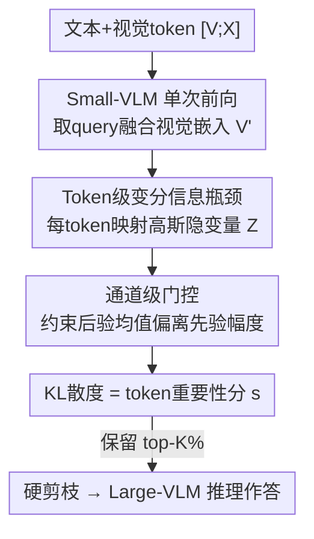

# IF-Prune: Information-Flow Guided Token Pruning for Efficient Vision-Language Models

**会议**: CVPR 2026  
**论文**: [CVF Open Access](https://openaccess.thecvf.com/content/CVPR2026/html/Sun_IF-Prune_Information-Flow_Guided_Token_Pruning_for_Efficient_Vision-Language_Models_CVPR_2026_paper.html)  
**代码**: https://github.com/snap-research/EVLM  
**领域**: 模型压缩  
**关键词**: 视觉 token 剪枝, VLM 推理加速, 变分信息瓶颈, 后验引导, 信息流

## 一句话总结
本文提出 IF-Prune，把视觉 token 重要性估计建模成摊销变分推断问题——用一个小 VLM 配上 token 级变分信息瓶颈，以每个视觉 token 隐变量后验与先验的 KL 散度作为重要性分来剪枝大 VLM，单次前向即可给出剪枝指导；仅保留 5% 视觉 token 时大模型仍维持 95% 原性能、较此前 SOTA 高出约 8%。

## 研究背景与动机
**领域现状**：采用动态分辨率视觉编码器的 VLM（LLaVA、QwenVL、InternVL）把高分图切成多块、每块过 ViT 产生定长 patch 序列，视觉表现强但视觉 token 数量巨大、序列拉得很长，推理成本高。视觉输入作为生成条件高度冗余稀疏，于是「token 剪枝」成了提效的主流路线。

**现有痛点**：现有剪枝多是**答案驱动**的注意力启发式。FastV 假设首个生成 token 的交叉注意力能可靠反映 token 重要性，实践中这个假设常崩、剪枝决策不稳；更新的 SGP 用一个小 VLM 聚合所有生成 token 的注意力权重构造重要性图来指导大 VLM 剪枝，在高剪枝比下有提升，但它**重度依赖小模型的先验知识**——当小 VLM 没有先验答不出某个 query 时，产出的重要性图就失效，留下噪声 token、损伤大 VLM 的推理能力。

**核心矛盾**：答案驱动的重要性估计把「token 重要不重要」绑死在「小模型答得对不对」上；对视觉依赖高的复杂指令，小模型答错→重要性图错→大模型被错误引导。问题本质是：用一个能力受限的小模型去**指认最重要的 token 并强迫大模型照做**，方向就错了。

**本文目标**：给出一个不依赖答案是否正确、对复杂指令也稳健、且推理开销低的视觉 token 重要性估计框架。

**切入角度**：反转范式——不让小模型去指认「最重要」的 token，而是训练它去逼近「非信息性 token」的分布；借鉴变分信息瓶颈，用信息流的视角衡量每个 token 贡献了多少超出先验的信息。

**核心 idea**：把 token 重要性估计建成 token 级变分信息瓶颈——每个视觉 token 视作随机隐变量，其后验与先验的 KL 散度即重要性分；偏离先验越远的 token 信息量越高、越该保留。

## 方法详解

### 整体框架
IF-Prune 的链路是：把文本＋视觉 token 拼成序列 $[V;X]$ 喂给一个小 VLM（S-VLM）做**单次前向**，从输出端取出已融合 query 信息的视觉嵌入 $V'$；再用一个轻量投影模块把每个 $V'_i$ 映射成一个高斯隐变量 $Z_i$，并配一个通道级门控约束后验均值偏离先验的幅度；以每个 token 后验与可学习先验的 KL 散度作为重要性分 $s\in\mathbb{R}^m$，保留 top-K% 后对其余 token 做硬剪枝，剩下的视觉 token（连同位置编码）再送入大 VLM（L-VLM）解码作答。整套估计只需小模型一次前向、不必把注意力权重显式输出，因而能配合 FlashAttention，且训练好的小模型可「一拖多」迁移到同架构的更大模型。

### 关键设计

**1. Token 级变分信息瓶颈：用偏离先验的信息量当重要性分**

针对「答案驱动重要性不稳」的根因，本文给小 VLM 加一个 token 级变分信息瓶颈，把每个视觉 token 当作随机隐变量。小 VLM 前向后得到融合了 query 的视觉嵌入 $V'_i$（因果注意力下 $V'$ 天然通过对 $X$ 的交叉注意力吸收了 query 信息），再映射成多元高斯后验 $Q_\theta(Z_i\mid V'_i)=\mathcal{N}(\mu_\theta(V'_i),\sigma^2_\theta(V'_i))$。先验取**可学习的、按通道共享**的 $P(z)=\mathcal{N}(\mu_p,\sigma^2_p)$，让某些隐维度承载更多信息、对不重要维度做冗余压缩。每个 token 的重要性分定义为其后验与先验的逐通道平均 KL 散度

$$s_i = \frac{1}{d}\sum_{j=1}^d \mathrm{KL}\!\left(Q_\theta(Z_i^{(j)}\mid V'^{(j)}_i)\,\Vert\,P(z^{(j)})\right)$$

直觉是：偏离先验越远的 token 携带越多任务相关信息，近先验的 token 贡献甚微。把 KL 罚项打在 **token 级而非序列级**，带来两个好处——粒度化重要性（每 token 的 KL 反映其边际效用，可做细粒度剪枝决策）与自适应压缩（可学习的逐通道先验自动保留高信息隐维度、抑制冗余）。相比 SGP 只盯着与答案直接挂钩的 token，KL 引导会把分数撒到**更广的潜在有用区域**，让指导「不那么确定但更具启发性」，从而保住大 VLM 的推理力。

**2. 通道级门控机制：给后验均值套上界，防止 KL 爆炸**

直接用投影层预测后验均值 $\mu_\theta(V'_i)$ 时，自由的均值投影会把它推到离先验任意远的地方，使 KL 项剧烈波动、训练不稳。作者引入通道级门控来增强后验均值表达力并稳住优化：

$$\mu_\theta(V'_i)=\sigma\!\big(I_\theta(V'_i)\big)\odot\big(V'_i-\mu_p\big)+\mu_p$$

其中 $I_\theta(V'_i)$ 是学到的逐通道重要性门、$\sigma(\cdot)$ 是 sigmoid、$\odot$ 是逐元素乘。由于 $0<\sigma(\cdot)<1$，这个门**给后验均值偏离先验的幅度设了上界**，直接封住 KL 爆炸、稳定训练，同时仍允许模型独立调节每个通道向后验贡献多少信息。

**3. 单次前向后验引导剪枝 ＋ 一拖多迁移：低开销且可跨规模复用**

推理端只需把 $XV$ 序列喂给小 VLM 一次，从输出 $(X'V')$ 取 $V'$，算出每 token 的 KL 重要性分，保留 top-K% 后对 $V$ 及预算好的位置编码做硬剪枝，剩余 token 保留原始空间信息。对比之下，FastV/SGP 等要在大 VLM 解码器内部算重要性、或要解码到 EOS 才出指导，开销大；IF-Prune 只用小模型一次前向，显著降低大模型 FLOPs 与显存，且因不必显式输出全部注意力权重而能用 FlashAttention。此外小 VLM 须与大 VLM **同架构**以保证视觉编码一致；实验证明用 InternVL2.5-1B 学到的摊销后验可直接迁移去剪 InternVL2-8B/26B，「一个小模型服务多个大模型」，省去逐模型重训。

### 损失函数 / 训练策略
训练目标把经典变分信息瓶颈扩展到 token 级，含两项：

$$\mathcal{L}=\underbrace{\mathbb{E}_{X,Y\sim\mathcal{D},Z}\big[\log\pi_\phi(Y\mid X,Z)\big]}_{\text{重建项}}-\frac{\beta}{m}\sum_{i=1}^m \underbrace{\mathrm{KL}\!\left(Q_\theta(Z_i\mid V'_i)\Vert P(z)\right)}_{\text{token级KL罚项}}$$

重建项保证隐变量 token 保留足够信息以准确预测答案 $Y$（用重参数化技巧 $Z_i=\mu_\theta(V'_i)+\sigma_\theta(V'_i)\cdot\epsilon$，$\epsilon\sim\mathcal{N}(0,I)$ 使梯度可导）；KL 罚项把每个 token 向先验压缩、惩罚冗余；$\beta$ 调二者权衡。实现上用 InternVL 系列，小 VLM 由 InternVL2.5-1B 初始化并冻结主体，只训一个两层 MLP 投影模块 $Q_\theta$ 与两个可学习先验嵌入（$\mu_p,\sigma^2_p$），用 LoRA 微调一个 epoch；为缓解 $\pi_\phi(Y\mid X,V)$ 与 $\pi_\phi(Y\mid X,Z)$ 的域偏移，训练数据沿用 InternVL 的单图指令混合数据（ShareGPT-4V、LLaVA、DVQA 等）。

## 实验关键数据

### 主实验
在 8 个基准（TextVQA、ChartQA、GQA、MMStar、MMBench、MM-Vet、MME、RealWorldQA）上，对 InternVL2-26B 在第 $L{=}9$ 层做硬剪枝，比较不同剪枝方法（score ratio = 剪枝后/满 token 的归一化总分，越接近 100% 越好）：

| 方法 | 保留比 K | TextVQA | ChartQA | MMStar | MMBench | MM-Vet | MME | Score ratio ↑ |
|------|---------|---------|---------|--------|---------|--------|-----|---------------|
| InternVL2-26B（满 token） | 100% | 82.45 | 84.92 | 60.08 | 83.46 | 64.00 | 2270 | 100.00% |
| FastV† | 20% | 75.62 | 71.68 | 53.01 | 78.31 | 45.00 | 2140 | 93.18% |
| SGP† | 20% | 81.97 | 81.68 | 56.77 | 80.76 | 62.34 | 2258 | 99.15% |
| **IF-Prune（ours）** | 20% | 81.48 | 82.60 | 57.46 | 80.58 | 61.01 | 2271 | **99.4%** |

（† 为作者复现结果。20% 保留下 IF-Prune 与 SGP 都接近满 token，差距在更激进剪枝下才拉开。）

### 性能-效率曲线（不同保留比）
| 保留比 K | IF-Prune（score ratio） | SGP | FastV |
|----------|------------------------|-----|-------|
| 20% | 99.4% | 98.82% | — |
| 5% | **95.4%** | 88.9% | 67.1% |

只保留 5% 视觉 token 时，IF-Prune 仍维持 95.4% 原性能，而 SGP/FastV 已跌到 88.9%/67.1%——越激进剪枝、IF-Prune 优势越大，对应约 40% 计算量削减、8 个基准上较前 SOTA 高约 7–8%。

### 一拖多迁移（One Can Serve Many）
复用为 InternVL2.5-1B 训好的同一个小 VLM 去剪 InternVL2-8B（$L{=}0$）：$K{=}20\%$ 时 SGP/IF-Prune 归一化分 98.29%/97.56% 接近满 token；激进的 $K{=}5\%$ 下 IF-Prune 94.03% 明显超 SGP 的 90.34%（+3.69），增益在 MMBench、MMStar 上最大。说明小模型学到的摊销后验能在 InternVL 家族内跨规模可靠迁移。

### 关键发现
- **保留信息性 token 比只留答案相关 token 更有效**：可视化显示 SGP 主要定位与预测答案直接挂钩的 token，IF-Prune 则识别更广的语义/问题相关线索，对视觉依赖高的复杂 query 优势明显。
- **越激进剪枝优势越大**：20% 保留下各法接近，5% 保留时 IF-Prune（95.4%）对 SGP（88.9%）拉开 6.5 个百分点。
- **通道级门控对稳定性关键**：没有它，自由均值投影会把 KL 推到任意大、训练发散。

## 亮点与洞察
- **范式反转**：从「让弱小模型指认最重要 token 并强迫大模型照办」反转为「用变分信息瓶颈估计每个 token 偏离先验的信息量」，把重要性估计从答案驱动启发式提升成有原则的概率框架，这是最核心的「啊哈」。
- **KL=重要性分**：用后验-先验 KL 散度当 token 重要性，天然给出可解释、可排序的信息量度，且打在 token 级带来细粒度剪枝——这个度量可迁移到任何需要按信息量取舍 token 的场景。
- **单次前向 ＋ FlashAttention 兼容**：不必显式吐注意力权重、不必解码到 EOS，工程上比 FastV/SGP 友好得多，是真正能落地的提效设计。
- **一拖多**：一个小模型剪多个同架构大模型，摊销了训练成本，实用性强。

## 局限与展望
- 小 VLM 必须与大 VLM **同架构**以保证视觉编码一致，跨架构（如 InternVL 的小模型去剪 Qwen-VL 大模型）能否迁移未验证。
- 主要在 InternVL 家族、单图任务上验证；多图、视频、长上下文等场景的效果与 $\beta$/$K$ 的鲁棒性有待考察。
- 仍需为每个架构训一个小 VLM（虽可一拖多但限于同架构），完全免训练的重要性估计仍是开放问题。
- 改进方向：把变分瓶颈推广到跨架构通用重要性度量、或与量化/KV-cache 压缩联合优化。

## 相关工作与启发
- **vs FastV**：FastV 用首个生成 token 的注意力当重要性信号，假设脆弱、决策不稳；IF-Prune 用概率化的 KL 信息量，且单次前向、兼容 FlashAttention。
- **vs SGP**：SGP 同样用小 VLM 指导剪枝，但聚合生成 token 注意力、答案驱动，依赖小模型先验、对复杂指令失效；IF-Prune 反转为估计非信息 token 分布，把分数撒向更广信息区，5% 保留下 95.4% vs 88.9% 大幅领先。
- **vs ToMe**：ToMe 只在视觉编码器内合并冗余 token，不考虑 query；IF-Prune 的 $V'$ 已融合 query，剪枝是 query-aware 的。

## 评分
- 新颖性: ⭐⭐⭐⭐⭐ 把视觉 token 剪枝建成摊销变分推断、用 KL 信息量替代答案驱动注意力，视角新颖且自洽
- 实验充分度: ⭐⭐⭐⭐ 8 基准 + 多规模 + 一拖多迁移充分，但主要限于 InternVL 单图场景
- 写作质量: ⭐⭐⭐⭐ 动机反转与信息瓶颈推导讲得清楚，公式与可视化到位
- 价值: ⭐⭐⭐⭐⭐ 5% token 保 95% 性能、单次前向且 FlashAttention 兼容，落地价值高

<!-- RELATED:START -->

## 相关论文

- [\[CVPR 2026\] SCoRe: Salience-Coverage Reduction for Vision Token Pruning in Vision-Language Models](score_salience-coverage_reduction_for_vision_token_pruning_in_vision-language_mo.md)
- [\[CVPR 2026\] Hi-Lo Prune: Look at What You'll Lose before Pruning with Hierarchical Token Selection](hi-lo_prune_look_at_what_youll_lose_before_pruning_with_hierarchical_token_selec.md)
- [\[CVPR 2026\] Hybrid Token Compression for Vision-Language Models](hybrid_token_compression_for_vision-language_models.md)
- [\[CVPR 2026\] Rethinking Token Reduction for Large Vision-Language Models](rethinking_token_reduction_for_large_vision-language_models.md)
- [\[CVPR 2026\] Collaborative Multi-Mode Pruning for Vision-Language Models](collaborative_multi-mode_pruning_for_vision-language_models.md)

<!-- RELATED:END -->
