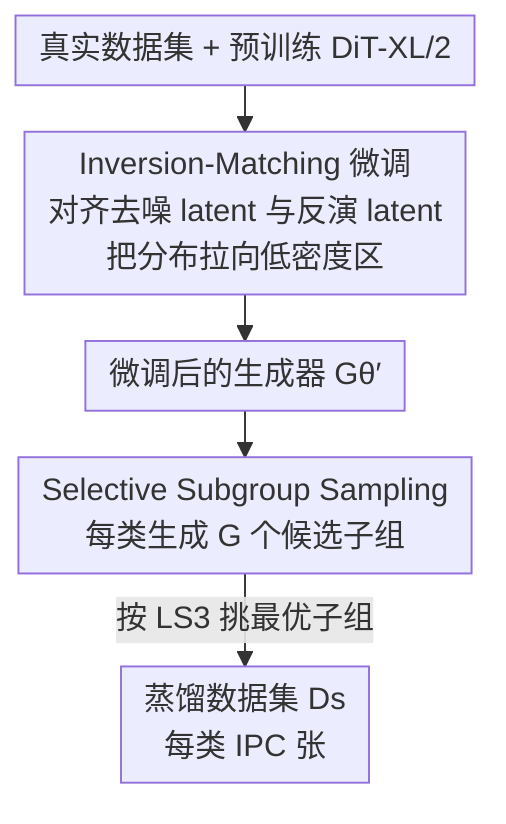

# IMS3: Breaking Distributional Aggregation in Diffusion-Based Dataset Distillation

**会议**: CVPR 2026  
**论文**: [CVF Open Access](https://openaccess.thecvf.com/content/CVPR2026/html/Wang_IMS3_Breaking_Distributional_Aggregation_in_Diffusion-Based_Dataset_Distillation_CVPR_2026_paper.html)  
**代码**: https://github.com/Westlake-AGI-Lab/IMS3  
**领域**: 模型压缩 / 数据集蒸馏 / 扩散模型  
**关键词**: 数据集蒸馏, 扩散模型, DDIM 反演, 子组采样, 分布覆盖

## 一句话总结
针对扩散式数据集蒸馏「样本过度聚集在高密度区、缺乏判别性边界样本」的痛点，IMS3 用 DDIM 反演的不稳定性做微调（IM）把生成分布往低密度区拉宽，再用免训练的子组采样（S3）按类心相似度挑出既贴近真实、又彼此可分的合成子集，在 ImageWoof / ImageNette / ImageIDC 上刷新扩散式蒸馏 SOTA。

## 研究背景与动机
**领域现状**：数据集蒸馏（Dataset Distillation）要把大规模真实数据压成一小撮合成样本，让模型在合成集上训练能逼近真实集的精度。早期是优化式（直接优化合成样本去匹配真实数据的梯度/统计量），近来扩散式方法靠预训练扩散模型的强生成能力，在高分辨率、大类别场景下展现出更好的保真度和可扩展性，通常分「微调 + 采样」两阶段。

**现有痛点**：扩散模型本质是**生成式**目标——最大化数据似然，天然把质量堆在数据流形的高密度区；而数据集蒸馏是**判别式**目标——真正有用的是决策边界附近那些低密度、难学的关键样本。两个目标错位，导致合成样本过度集中在高密度区、边界覆盖不足。作者把这种现象命名为 **distributional aggregation（分布聚集）**：t-SNE 可视化里 Minimax 等方法的样本明显挤在高密度团块，覆盖面窄、多样性差。

**核心矛盾**：生成似然（高密度集中）与判别效用（需要低密度边界覆盖 + 类间可分）之间的目标错位。标准扩散采样还逐类独立生成，完全不考虑类间关系，进一步削弱判别结构。

**本文目标**：拆成两个子问题——(1) 怎样在微调阶段把分布覆盖从高密度区拉宽到低密度区；(2) 怎样在采样阶段显式注入类间可分性。

**切入角度**：作者抓住扩散**反演（inversion）过程的一个反常性质**：反演轨迹由于逐步近似误差累积而**固有不稳定**，会偏离高密度流形、自然漂向低密度区域。这种在重建任务里被视为缺点的性质，恰好可以被「借用」来扩大低密度覆盖。

**核心 idea**：用「让去噪 latent 对齐其反演 latent」做微调来主动扩张低密度覆盖（IM），再用「按类心相似度挑子组」的免训练采样注入类间可分性（S3）。

## 方法详解

### 整体框架
IMS3 是一个两阶段框架：先在预训练 DiT-XL/2 上做 **Inversion-Matching (IM) 微调**，让生成分布往低密度区拉宽；再在采样时用 **Selective Subgroup Sampling (S3)** 逐类挑出最优合成子组，注入类间判别性。输入是真实数据集 $\mathcal{D}_r$ 和预训练扩散模型，输出是压缩后的蒸馏数据集 $\mathcal{D}_s$（每类只有 IPC 张图）。两阶段互补：IM 解决「覆盖不够」，S3 解决「类间不够分」。

### 关键设计

**1. Inversion-Matching 微调：借反演不稳定性把分布拉向低密度区**

扩散式蒸馏的微调若只用标准扩散损失，会继续强化高密度集中。IM 的做法是引入一个**时间对齐的反演匹配损失**：对真实样本，先用 DDIM 反演（Euler scheduler，见式 (3)）算出时间步 $t$ 的反演噪声 latent $z_t^{\text{inv}}$；为省算力，去噪 latent 不跑完整轨迹，而是直接采样 $z_t = \sqrt{\bar\alpha_t}\,z_0 + \sqrt{1-\bar\alpha_t}\,\epsilon$。然后在同一时间步对齐两者的余弦相似度：

$$\mathcal{L}_{\text{IM}} = 1 - \sigma(z_t^{\text{inv}}, z_t)$$

其中 $\sigma(\cdot,\cdot)$ 是余弦相似度。这里**不强制两个 latent 完全相等**，只让它们方向靠拢——因为反演轨迹本身就漂向低密度区，把生成 latent 往反演 latent 拉，等于把生成分布往欠表达的低密度边界区拉宽。为防止过度偏移损害保真度，再叠加标准扩散损失 $\mathcal{L}_{\text{Diff}} = \|\epsilon_\theta(z_t,c)-\epsilon\|_2^2$，总损失 $\mathcal{L} = \mathcal{L}_{\text{Diff}} + \lambda_{\text{IM}}\mathcal{L}_{\text{IM}}$（$\lambda_{\text{IM}}=0.002$）。微调用 PEFT（Difffit）只更新插入注意力/MLP 的轻量 adapter、冻结主干，省显存又稳。和旧方法的区别在于：它不是去硬造边界样本，而是**把扩散过程里现成的、被当成缺陷的反演漂移当成「往低密度走」的导航信号**。

**2. Selective Subgroup Sampling：免训练地挑出既代表性又可分的子组**

标准扩散采样逐类独立生成，不管类间关系，合成样本视觉合理却判别力弱。S3 是一个**免训练的推理期采样策略**：用一个冻结的特征编码器 $\phi$ 把图映到单位球上的 $\ell_2$ 归一化嵌入；对每类先用 $K_i$ 张真实样本算出真实类心 $r_i$（式 (8)）；再从生成器为该类抽 $G$ 个候选子组 $\{S_{i,g_i}\}$，每组算子组心 $c_{i,g_i}$（式 (9)）。然后按一个**兼顾代表性与类间分离**的目标逐类各选一个子组：

$$\mathcal{L}_{S^3}(\mathbf{g}) = \alpha \sum_{i} \log\big(1-\sigma(c_{i,g_i}, r_i)\big) - \frac{\beta}{C-1}\sum_{i}\sum_{j\neq i}\log\big(1-\sigma(c_{i,g_i}, c_{j,g_j})\big)$$

第一项把子组心拉向对应真实类心（保代表性、约束在真实分布内），第二项把不同类被选子组心之间的夹角拉大（保类间可分、抑制 mode collapse）；$\alpha,\beta$ 是权重。由于该目标只依赖预计算好的类心，最优索引 $\mathbf{g}^* = \arg\min_{\mathbf{g}}\mathcal{L}_{S^3}$ 用简单贪心搜索即可得到。它不需要任何额外训练，把「类感知」直接塞进采样环节——这正是它和「逐类独立采样」的本质差别。

### 损失函数 / 训练策略
微调阶段总损失为 $\mathcal{L} = \mathcal{L}_{\text{Diff}} + \lambda_{\text{IM}}\mathcal{L}_{\text{IM}}$，$\lambda_{\text{IM}}=0.002$；在 256×256 分辨率、DiT-XL/2 上用 Difffit PEFT 微调 8 个 epoch，batch 8，AdamW，学习率 $1\times10^{-3}$，单张 A100-40GB。采样阶段的 $G$、$\alpha$、$\beta$ 按数据集选取；$\alpha,\beta$ 取均衡值时效果最好（见消融）。

## 实验关键数据

### 主实验
在细粒度 ImageWoof（10 类高相似度犬种）上对比优化式与扩散式 SOTA（Top-1 准确率，%；同时报告 hard/soft label 中较高者）：

| 数据集/IPC | Backbone | DiT | Minimax | D4M | DDVLCP | ImS3 (本文) |
|---|---|---|---|---|---|---|
| ImageWoof / 10 | ResNetAP-10 | 34.7 | 35.7 | 33.2 | 39.5 | **41.8** |
| ImageWoof / 10 | ResNet-18 | 34.7 | 37.6 | 32.3 | 39.9 | **41.3** |
| ImageWoof / 50 | ResNet-18 | 50.1 | 53.9 | 53.7 | 58.9 | **60.1** |
| ImageNette / 50 | ResNetAP-10 | 73.3 | 83.7 | 77.7 | – | **84.2** |
| ImageIDC / 1 | ResNet-18 | 26.7 | 22.4 | – | – | **28.5** |

低 IPC 下增益最明显：ImageWoof IPC=10、ResNetAP-10 上从 Minimax 的 35.7% 提到 41.8%（+6.1%），比次优 DDVLCP 的 39.5% 还高 2.3%。

### 消融实验
IM 与 S3 的逐组件消融（ImageWoof 用 ResNetAP-10，ImageNette 用 ResNet-18）：

| 配置 | ImageWoof IPC=10 | ImageWoof IPC=50 | ImageNette IPC=10 | ImageNette IPC=50 |
|---|---|---|---|---|
| DiT 基线 | 34.7 | 49.3 | 58.9 | 82.9 |
| + IM | 37.3 | 53.5 | 60.0 | 81.5 |
| + S3 | 40.9 | 54.9 | 62.2 | 81.3 |
| + ImS3（IM+S3） | **41.8** | **61.0** | **62.9** | **84.2** |

### 关键发现
- **IM 与 S3 各自有效、组合更强**：单独 IM 扩覆盖、单独 S3 强类间分离，二者叠加在所有设置下增益最大；尤其 ImageWoof IPC=50，组合后从 49.3 跃到 61.0。
- **$\alpha$、$\beta$ 鲁棒**：在 [0.1, 0.9] 区间扫描，性能在大范围内稳定，均衡取值最佳——说明代表性与类间分离需要联合优化。
- **参考类心的真实样本数 $K_i$**：太少会引入噪声、降低子组选择质量；用适中数量算类心更稳，高 IPC 下收益尤其明显。

## 亮点与洞察
- **化缺陷为信号**：把扩散反演「轨迹不稳定、漂向低密度区」这个在重建任务里的缺点，反过来当成「往欠表达区域导航」的微调信号，视角很巧妙——不需要额外造边界样本，免费拿到覆盖扩张。
- **免训练采样即插即用**：S3 只依赖预计算类心 + 贪心搜索，零额外训练成本就把类间判别性注入采样，可迁移到任何扩散式蒸馏的采样阶段。
- **判别 vs 生成的目标错位**这个分析框架本身有启发性：很多「拿生成模型做判别下游」的任务都可能存在类似的高密度偏置，IM/S3 这套「拉宽覆盖 + 类感知挑选」思路可借鉴。

## 局限与展望
- 反演不稳定性「漂向低密度区」更多是经验/直觉论证，正文只给了余弦对齐损失，理论保证放在附录，严谨性有待进一步检验（⚠️ 以原文为准）。
- S3 的贪心搜索在类别数极大时的可扩展性、以及 $G$ 个候选子组的生成开销，正文未充分量化。
- 主实验集中在 ImageNet 子集（ImageWoof/ImageNette/ImageIDC）与 256×256，更大类别（ImageNet-1K）结果放在附录，正文未展开。
- 改进方向：把反演漂移的强度做成可控/可学习的导航场，而非固定的余弦对齐目标。

## 相关工作与启发
- **vs Minimax Diffusion**: 二者都微调预训练扩散模型做蒸馏，但 Minimax 用 minimax 准则提升代表性与多样性，仍存在分布聚集；IMS3 用反演匹配显式往低密度区拉，覆盖更宽，t-SNE 上分布更均匀。
- **vs D3HR**: D3HR 用 DDIM 反演把 VAE latent 映到更高斯的域 + 组采样对齐分布；IMS3 同样用反演，但着眼点是借**反演的不稳定性**扩低密度覆盖，并配合类感知子组选择，目标是判别性而非分布正态化。
- **vs D4M**: D4M 用原型学习聚类 latent、学类中心提升类内一致与保真；IMS3 的 S3 也用类心，但优化的是「贴近真实类心 + 远离他类心」的子组选择目标，强调类间可分。

## 评分
- 新颖性: ⭐⭐⭐⭐ 把反演不稳定性反用为低密度导航信号的视角新颖，S3 则是较直接的类心选择。
- 实验充分度: ⭐⭐⭐⭐ 多数据集多 backbone 多 IPC 系统对比 + 组件消融 + 超参分析，但大类别结果主要在附录。
- 写作质量: ⭐⭐⭐⭐ 动机—方法—实验逻辑清晰，distributional aggregation 命名贴切；部分理论依赖附录。
- 价值: ⭐⭐⭐⭐ 为扩散式数据集蒸馏提供了即插即用的覆盖扩张 + 类感知采样方案，实用性强。

<!-- RELATED:START -->

## 相关论文

- [\[CVPR 2026\] Mitigating The Distribution Shift of Diffusion-based Dataset Distillation](mitigating_the_distribution_shift_of_diffusion-based_dataset_distillation.md)
- [\[CVPR 2026\] DMGD: Train-Free Dataset Distillation with Semantic-Distribution Matching in Diffusion Models](dmgd_train-free_dataset_distillation_with_semantic-distribution_matching_in_diff.md)
- [\[NeurIPS 2025\] Optimizing Distributional Geometry Alignment with Optimal Transport for Generative Dataset Distillation](../../NeurIPS2025/model_compression/optimizing_distributional_geometry_alignment_with_optimal_transport_for_generati.md)
- [\[CVPR 2026\] Dataset Distillation by Influence Matching](dataset_distillation_by_influence_matching.md)
- [\[CVPR 2026\] Beyond Soft Label: Dataset Distillation via Orthogonal Gradient Matching](beyond_soft_label_dataset_distillation_via_orthogonal_gradient_matching.md)

<!-- RELATED:END -->
