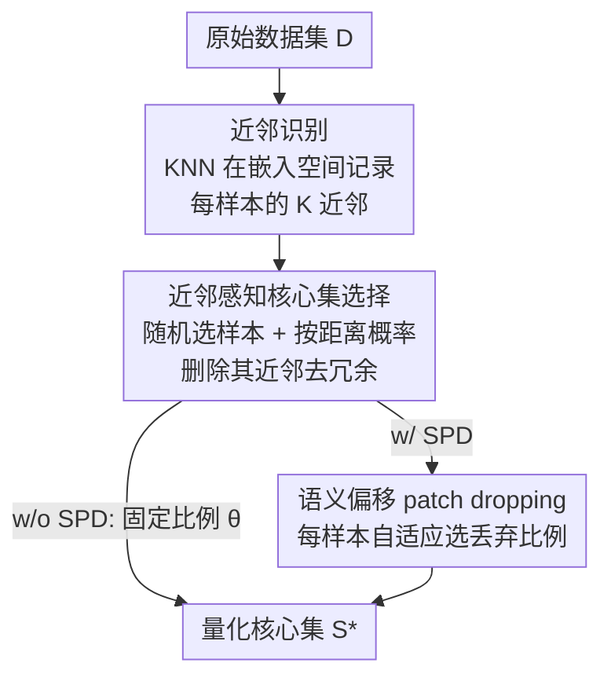

# Is Bin Generation Indispensable? A Bin-Generation-Free Dataset Quantization via Semantic Perspective

**会议**: CVPR 2026  
**论文**: [CVF Open Access](https://openaccess.thecvf.com/content/CVPR2026/html/Deng_Is_Bin_Generation_Indispensable_A_Bin-Generation-Free_Dataset_Quantization_via_Semantic_CVPR_2026_paper.html)  
**代码**: https://github.com/MaijieDeng/BGFDQ  
**领域**: 模型压缩 / 数据集量化 / 核心集选择  
**关键词**: 数据集量化, 核心集选择, KNN 近邻, 自适应 patch dropping, 可扩展性

## 一句话总结
针对数据集量化里「bin 生成」步骤随同类样本数立方增长、大规模数据集跑不动，以及固定 patch 丢弃比例无法适配样本冗余差异的两大痛点，BGFDQ 用轻量 KNN 近邻识别替代昂贵的 bin 生成、用近邻感知的核心集选择保覆盖去冗余、再用语义偏移自适应地为每张图选丢弃比例，把复杂度从 $O(CM^3)$ 降到 $O(CM^2)$，在四个分类基准上稳定超过 SOTA（CIFAR-100 最高 +5%），还能扩展到单类 20 万样本（bin 生成法直接 OOM）。

## 研究背景与动机
**领域现状**：数据集量化（Dataset Quantization, DQ）是介于数据集蒸馏与核心集选择之间的压缩范式，压缩率高、跨架构迁移性好。开山之作 DQ 把流程定为三步：**bin 生成**（用子模优化把同类样本递归切成若干互不重叠的 bin）→ **核心集选择**（从各 bin 均匀抽样）→ **patch dropping**（用 GradCAM++ 算 patch 重要性，按固定比例 $\theta$ 丢掉低分 patch，训练时用 MAE 重建）。后续 DQAS、ADQ 在选择环节上加了主动学习/bin 加权。

**现有痛点**：(1) **bin 生成贵**——每选一个样本要算它与同类所有样本的平方欧氏距离（$O(M^2)$），完整 bin 生成迭代 $O(CM)$ 轮，总复杂度高达 $O(CM^3)$。在 Fakeddit 这类某些类超 20 万样本的数据集上，选第一个样本就 OOM，即使内存够也要几小时。(2) **固定丢弃比例死板**——不同图像里「不重要 patch」的比例差异巨大（图 2 显示有的图丢 25% 不够、有的丢 25% 已经丢掉关键内容），一刀切的 $\theta$ 对大多数样本都不是最优，拉低压缩集质量。

**核心矛盾**：bin 生成本质上只是个「高成本的数据集分析器」，用来辅助核心集选择；而 patch dropping 的「均匀冗余」假设在真实数据上几乎不成立。两处都是「用一个昂贵/僵硬的全局操作去处理本该按样本自适应的问题」。

**本文目标**：(1) 找一个轻量、可扩展的机制替代 bin 生成又不丢语义分析能力；(2) 让 patch 丢弃比例按每张图的冗余程度自适应。

**切入角度**：作者的经验发现是——bin 生成只是在「捕捉同类样本间的语义关系」，那用标准 KNN 在嵌入空间记录近邻关系就够了，根本不必真的去切 bin。

**核心 idea**：从**语义视角**重构整条流水线——KNN 近邻识别替代 bin 生成、近邻感知核心集选择去局部冗余、语义偏移自适应决定每样本丢弃比例。

## 方法详解

### 整体框架
BGFDQ（Bin-Generation-Free Dataset Quantization）把传统 DQ 的「bin 生成 → 选择 → 固定 patch dropping」三步，换成「近邻识别 → 近邻感知核心集选择 → 语义偏移 patch dropping」三步。输入是原始数据集 $\mathcal{D}$，输出是量化后的核心集 $\mathcal{S}^*$。第一步用 KNN 在嵌入空间为每个样本记录近邻（廉价地拿到语义结构）；第二步用近邻信息按概率删除冗余近邻、保留覆盖；第三步为每个被选样本自适应挑丢弃比例。框架有两个版本：**BGFDQ (w/o SPD)** 末步仍用固定比例 patch dropping，**BGFDQ (w/ SPD)** 末步换成语义偏移自适应 dropping（完整版）。

### 关键设计

**1. 近邻识别：用 KNN 替代立方复杂度的 bin 生成**

bin 生成之所以贵，是因为它把「分析数据集语义结构」和「迭代构造互斥 bin」绑在一起，复杂度 $O(CM^3)$。作者发现 bin 生成实质上只起到「数据集分析器」的作用，于是用纯 KNN 做样本粒度的语义分析来替代：用预训练特征提取器 $f(\cdot)$ 把每个样本嵌入 $z_i = f(x_i)$，对同类样本算平方欧氏距离 $d_{ij} = \|z_i - z_j\|_2^2$，取最近的 $K$ 个作为近邻集 $\mathcal{N}_i = \text{TopK}_{j\neq i}(-d_{ij})$。$K$ 不是敏感超参（近邻信息只是记录、不用于决策），实现里直接设 $K=20$。这一步只记录局部语义结构，把分析成本从 $O(CM^3)$ 降量级，是整套方法能扩展到 20 万样本/类的根基。

**2. 近邻感知核心集选择：删近邻去冗余，理论上覆盖更高、冗余更低**

光有近邻还不够，关键是怎么用它选核心集。直觉是：语义上挨得近的样本往往信息冗余，应避免重复选。机制上从空核心集 $\mathcal{S}=\{\}$、全集 $\mathcal{D}$、目标占比 $\rho$ 出发，每轮随机从 $\mathcal{D}$ 选一个样本 $x_i$ 加入 $\mathcal{S}$，然后对它按距离排序的近邻 $x_i^k$ 以概率 $p_k = e^{-\rho\alpha k}$（$\alpha>0$）从 $\mathcal{D}$ 中删除——越近的近邻越可能被删，越小的 $\rho$ 删得越狠、逼后续选择转向语义上更不同的样本。作者还从**覆盖** $R(\mathcal{S})=\sup_{x\in\mathcal{D}}\min_{s\in\mathcal{S}} d(x,s)$（越小越好）和**冗余** $\Gamma(\mathcal{S})=\min_{s\neq s'} d(s,s')$（越大越好）两个量给出理论比较，证明近邻方案（NI+NCS）期望上覆盖更高、冗余更低：$\mathbb{E}[R_{\text{NI+NCS}}] < \mathbb{E}[R_{\text{BG+RS}}]$ 且 $\mathbb{E}[\Gamma_{\text{NI+NCS}}] > \mathbb{E}[\Gamma_{\text{BG+RS}}]$。原因是删近邻显式抑制了局部重复采样，把采样概率重新分配给未覆盖区域。

**3. 语义偏移 Patch Dropping (SPD)：按每张图的语义容忍度自适应选丢弃比例**

固定比例 $\theta$ 不管图像内容一刀切，对多数样本都次优。SPD 用「丢 patch 后语义偏移多大」来自动定每样本的最优丢弃比例。先为每类定一个**语义偏移阈值** $\lambda_C$：取同类样本两两距离里最小的若干个（实现中取最小的 50 个非零类内距离的均值，抗离群/噪声），$\lambda_C = \min\{d_{ij}\mid i,j\in C, i\neq j\}$（实际用均值近似），可视为语义空间里的「邻近边界」，且能直接复用近邻识别阶段算好的类内距离、零额外开销。然后对核心集里每个样本 $x$，用一系列候选比例 $\theta_i\in\{10\%,...,90\%\}$ 生成丢弃变体 $x_{\theta_i}$，算它与原图的语义偏移 $d_{xx'}$，**在不超过阈值 $\lambda_C$ 的前提下挑丢得最多的那个**：$x_{\theta^*} = \arg\max_{\theta_i}\{d_{xx'}\mid d_{xx'} < \lambda_C\}$。直觉是：偏移小说明丢得还不够、可以再激进；逼近阈值就停——在保语义完整的前提下尽量多丢。代价是这步要为每样本试多个比例、有额外算力，所以只在大规模（同类样本 $\sim10^5$ 量级）时整体 FLOPs 才反超固定 dropping。

### 损失函数 / 训练策略
本方法是核心集构造流程而非端到端训练目标，无独立损失函数。特征提取器统一用 ResNet-18；近邻 $K=20$；核心集选择删除概率衰减率 $\alpha$ 与目标占比 $\rho$ 控制激进程度；SPD 候选比例 $\{10\%,...,90\%\}$、类阈值 $\lambda_C$ 用最小 50 个类内距离均值。整体复杂度 $O(CM^2)$（w/ 和 w/o SPD 均是），相比 bin 生成的 $O(CM^3)$ 有量级优势；训练用合成图时沿用预训练 MAE 重建被丢 patch。

## 实验关键数据

### 主实验
在 CIFAR-10/100、ImageNet-1K、Fakeddit 上用 ResNet-18 同时做特征提取器与目标网络，不同核心集占比 $\rho$ 下验证准确率（%）：

| 数据集/ρ | Random | DQ | DQAS | ADQ | BGFDQ (w/o SPD) | BGFDQ (w/ SPD) |
|---|---|---|---|---|---|---|
| CIFAR-10 / 20% | 87.1 | 87.6 | 90.2 | 89.3 | 90.5 | **91.6** |
| CIFAR-100 / 20% | 60.5 | 60.4 | 61.0 | 59.1 | 62.8 | **66.0** |
| CIFAR-100 / 10% | 52.6 | 52.9 | 52.6 | 52.7 | 53.6 | **55.2** |
| ImageNet-1K / 20% | 48.7 | 49.1 | – | 49.2 | 49.4 | **49.5** |
| Fakeddit / 1% | 83.3 | OOM | OOM | OOM | 83.4 | **83.8** |

BGFDQ (w/o SPD) 平均比基线高约 1.0%，加 SPD 再涨约 1.3%；CIFAR-100 上最高 +5%。Fakeddit 上所有 bin 生成法 OOM，本文可正常运行——验证可扩展性。

### 消融实验
核心集选择策略对比（CIFAR-10，训练 ResNet-18，验证准确率 %）：

| 选择策略 | 5K | 10K | 15K |
|---|---|---|---|
| RS（纯随机） | 75.7 | 87.1 | 90.2 |
| BG+RS（bin 生成 + bin 内随机） | 75.9 | 87.0 | 90.1 |
| NI+NCS（本文近邻方案） | **76.4** | **87.6** | **90.5** |

运行时分解（CIFAR-10，ρ=20%，秒）：

| 方法 | bin 生成 | 近邻识别 | patch dropping | 总耗时 | 准确率 |
|---|---|---|---|---|---|
| DQ | 441 | / | 806 | 1248 | 87.6 |
| ADQ | 441 | / | 806 | 1640 | 89.3 |
| BGFDQ (w/o SPD) | / | 155 | 806 | 1052 | 90.5 |
| BGFDQ (w/ SPD) | / | 155 | 2219(SPD) | 2465 | 91.6 |

### 关键发现
- **bin 生成几乎没带来收益**：BG+RS 相比纯随机在 CIFAR-10/100 平均只提 0.1%，证明它「贵但无用」；近邻方案在所有规模上稳定增益——印证「bin 生成非必需」的核心论点。
- **NI 省时又涨点**：近邻识别（155s）远低于 bin 生成（441s），w/o SPD 总耗时还比 DQ 低、准确率反而更高（90.5 vs 87.6）。
- **SPD 用更高压缩换不掉点**：丢弃比例从 25% 提到平均 40%，固定 dropping 明显掉点，而 SPD 在多丢 15% patch 的同时仍维持与 PD(25%) 相当的准确率。
- **跨架构泛化**：用 ResNet-18 选的核心集训练 ResNet-50 / ViT，BGFDQ 在所有目标网络上均超基线（如 CIFAR-100/ViT 上 w/ SPD 达 35.7% vs ADQ 30.9%）。

## 亮点与洞察
- **「质疑一个被默认的步骤」本身就很有价值**：作者没有去改进 bin 生成，而是直接问「它是否必需」，并用理论 + 消融证明它可被廉价的 KNN 近邻替代——这种「拆掉昂贵默认组件」的思路可迁移到很多 pipeline 式方法。
- **自适应丢弃比例的判据很巧**：用「丢 patch 后的语义偏移是否超过类内邻近边界 $\lambda_C$」来定每样本的丢弃比例，且 $\lambda_C$ 直接复用近邻阶段算好的类内距离，零额外成本拿到自适应能力。
- **可扩展性是真·卖点**：把复杂度从 $O(CM^3)$ 降到 $O(CM^2)$，让数据集量化第一次能跑单类 20 万样本的 Fakeddit，打开了大规模落地的口子。

## 局限与展望
- SPD 的额外算力不小（CIFAR-10 上 SPD 那一步 2219s），只有当同类样本达 $\sim10^5$ 量级时整体 FLOPs 才反超固定 dropping；中小规模下 w/ SPD 的时间成本偏高。
- 语义偏移阈值 $\lambda_C$ 是启发式（取最小 50 个类内距离均值），作者自己也承认没有形式化理论保证（⚠️ 以原文为准）。
- 特征提取器固定为 ResNet-18，跨架构迁移虽好但仍有因 backbone 不匹配带来的退化；不同提取器对近邻质量的影响未充分探讨。
- 改进方向：把近邻删除概率 $p_k$ 和 SPD 候选比例做成可学习/数据驱动，而非固定的指数衰减与离散网格。

## 相关工作与启发
- **vs DQ（Dataset Quantization 开山作）**: DQ 用子模优化做 bin 生成 + bin 内均匀采样 + 固定 patch dropping，复杂度 $O(CM^3)$；BGFDQ 用 KNN 近邻 + 近邻感知选择 + 自适应 dropping，复杂度 $O(CM^2)$，去掉 bin 生成后既省时又涨点。
- **vs DQAS / ADQ**: 二者仍沿用 bin 生成流水线，分别在选择环节加主动学习、bin 加权；BGFDQ 从根上替换 bin 生成，因此在 Fakeddit 这类超大类别上能跑而它们 OOM。
- **vs 核心集选择（GradMatch 等）**: 传统核心集选择一次性选子集，极端压缩下覆盖不足；BGFDQ 的近邻感知删除显式优化覆盖与冗余，并叠加 patch 级量化，压缩率更高。
- **vs 数据集蒸馏（DM 等）**: 蒸馏靠嵌套优化合成样本、开销大且泛化受限；BGFDQ 是选择+量化真实样本，免合成、跨架构迁移更稳。

## 评分
- 新颖性: ⭐⭐⭐⭐ 「bin 生成非必需」的反问 + KNN 替代 + 自适应丢弃，重构了 DQ 流水线，视角新。
- 实验充分度: ⭐⭐⭐⭐ 四数据集 + 跨架构 + 运行时分解 + 组件消融 + 复杂度分析，覆盖全面。
- 写作质量: ⭐⭐⭐⭐ 痛点—方法—理论—实验对应清晰，组件缩写表友好；部分阈值为启发式。
- 价值: ⭐⭐⭐⭐⭐ 把数据集量化的复杂度降一个量级、首次扩展到 20 万样本/类，实用性与可扩展性突出。

<!-- RELATED:START -->

## 相关论文

- [\[CVPR 2026\] SG-LoRA: Semantic-guided LoRA Parameters Generation](sg-lora_semantic-guided_lora_parameters_generation.md)
- [\[CVPR 2026\] DMGD: Train-Free Dataset Distillation with Semantic-Distribution Matching in Diffusion Models](dmgd_train-free_dataset_distillation_with_semantic-distribution_matching_in_diff.md)
- [\[CVPR 2026\] Adaptive Video Distillation: Mitigating Oversaturation and Temporal Collapse in Few-Step Generation](adaptive_video_distillation_mitigating_oversaturation_and_temporal_collapse_in_f.md)
- [\[ICLR 2026\] PTQ4ARVG: Post-Training Quantization for AutoRegressive Visual Generation Models](../../ICLR2026/model_compression/ptq4arvg_post-training_quantization_for_autoregressive_visual_generation_models.md)
- [\[ACL 2025\] Predicting Through Generation: Why Generation Is Better for Prediction](../../ACL2025/model_compression/predicting_through_generation_why_generation_is_better_for_prediction.md)

<!-- RELATED:END -->
