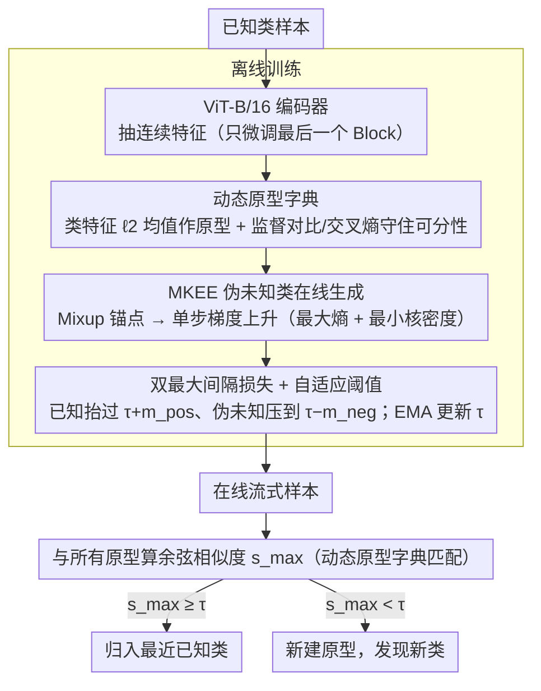

<!-- 由 src/gen_stubs.py 自动生成 -->
# Learning through Creation: A Hash-Free Framework for On-the-Fly Category Discovery

**会议**: CVPR 2026 Findings  
**arXiv**: [2603.13858](https://arxiv.org/abs/2603.13858)  
**代码**: [brandinzhang/LTC](https://github.com/brandinzhang/LTC)  
**领域**: 模型压缩  
**关键词**: On-the-Fly Category Discovery, 伪未知类生成, 无哈希框架, 动态原型字典, 最大间隔损失

## 一句话总结
提出 LTC 框架，通过在训练阶段利用 MKEE（最小化核能量+最大化熵）在线生成伪未知类样本，配合双最大间隔损失和自适应阈值，在7个数据集上实现1.5%–13.1%的全类精度提升，彻底摆脱了哈希编码对细粒度语义的损害。

## 背景与动机
1. **封闭世界假设的局限**：传统深学习模型假定类别固定，无法识别未见类，不适合动态真实环境
2. **NCD/GCD 的不足**：Novel Category Discovery 和 Generalized Category Discovery 需要在训练阶段同时访问已知和未知数据，且只支持离线推理，无法应对在线流式场景
3. **OCD 设定更实际**：On-the-Fly Category Discovery 仅在离线阶段用已知类训练，在线阶段逐样本处理流式数据，支持实时发现新类别
4. **哈希编码的信息损失**：现有 OCD 方法（SMILE、PHE）依赖哈希编码将特征离散化为二进制码，大量丢失细粒度语义信息
5. **优化目标不对齐**：已有方法在训练时只做表征学习，从未暴露"发现"任务，却期望模型在推理时突然具备发现能力——这是根本性的优化错位
6. **DiffGRE 的局限**：虽然尝试脱离哈希，但将特征压缩到12维空间，且依赖离线扩散模型预生成数据（生成128张图像需约284秒），本质仍是数据增强而非发现机制

## 方法详解

### 整体框架

LTC 想解决 OCD 里一个根本的优化错位：现有方法训练时只学表征、从没见过"发现"这件事，却指望模型推理时凭空具备发现新类的能力。它的做法是在训练阶段就用 MKEE 在线"创造"一批伪未知类样本，让模型提前在已知/未知的边界上练手；同时全程在连续特征空间用动态原型字典替代哈希码，避免离散化丢掉细粒度语义。整条流水线是：ViT 抽特征 → 维护原型字典 → MKEE 造伪未知样本 → 双最大间隔损失把已知/未知拉开 → 自适应阈值决定在线时要不要开新类。

### 关键设计

**1. 动态原型字典：在连续特征空间替掉哈希码**

SMILE、PHE 这类方法把特征压成二进制哈希码当类原型，量化过程把细粒度语义砸碎，正是细粒度数据集上精度上不去的根源。LTC 干脆不哈希：用 ViT-B/16（CLIP 或 DINO 预训练，只微调最后一个 Transformer Block）抽连续特征，每个已知类原型 $P_k$ 取该类特征的 $\ell_2$ 归一化均值。训练时联合监督对比损失 $\mathcal{L}_{\text{sup}}$ 守住类内细粒度结构、交叉熵损失 $\mathcal{L}_{\text{ce}}$ 拉开类间可分性；在线时测试样本与所有原型做余弦相似度匹配，最大相似度低于阈值 $\tau$ 就新建一个原型。连续空间保住了 CLIP 的语义先验，这是哈希码做不到的。

**2. MKEE 伪未知类在线生成：让模型训练时就见到"未知"**

光学表征不够，模型从没在训练里"发现"过新类。MKEE 在每个 batch 里临时造一批伪未知样本：先用 Mixup 在不同类别样本间插值得到流形上的锚点 $x_{\text{mix}} = \lambda x_i + (1-\lambda) x_j$；再沿联合目标 $\mathcal{J}(x) = -\sum_c p_c \log p_c - \lambda_\rho \cdot \rho(x)$ 做单步梯度上升 $x_{\text{pus}} = x_{\text{mix}} + \varepsilon \cdot \nabla_x \mathcal{J}(x) / \|\nabla_x \mathcal{J}(x)\|_2$——第一项最大化预测熵把样本推向不确定区，第二项用核密度估计 $\rho(x)$ 最小化与已知类的密度把样本推离已知类区域。密度用当前 batch 特征近似、带宽 $\sigma$ 按 median 距离自适应，避开 $\mathcal{O}(N^2)$ 开销；以概率 $p_{\text{gen}}=0.3$ 触发、每次只造 30-40 个样本，整批开销 <1s。相比 DiffGRE 靠离线扩散预生成（128 张约 284s），MKEE 是真正在训练循环里的轻量"发现演练"，快 280 倍以上。

**3. 双最大间隔损失 + 自适应阈值：把已知/未知在阈值两侧拉开**

有了伪未知样本，还需要一个损失把"已知该高、未知该低"明确写进优化目标。正间隔 $\mathcal{L}_{\text{pos}}$ 驱动已知类样本的最大相似度 $s_{\max}(x)$ 高于 $\tau + m_{\text{pos}}$，负间隔 $\mathcal{L}_{\text{neg}}$ 把伪未知样本的 $s_{\max}(x)$ 压到 $\tau - m_{\text{neg}}$ 以下，二者合成 $\mathcal{L}_{\text{mm}}$。阈值 $\tau$ 不写死：取已知类分数的上分位数 $u_{\text{pos}}$ 和伪未知类分数的下分位数 $u_{\text{neg}}$ 的中点为目标，用 EMA（$\beta=0.001$）平滑更新，对初值不敏感、部署更稳。总损失为 $\mathcal{L}_{\text{total}} = \mathcal{L}_{\text{ce}} + \alpha \mathcal{L}_{\text{sup}} + \gamma_{mm} \mathcal{L}_{\text{mm}}$（$\alpha=0.3$，$\gamma_{mm}=0.05$）。

## 实验关键数据

### 主实验（Greedy-Hungarian, All-class ACC）

| 数据集 | PHE-CLIP | LTC-CLIP | 提升 |
|--------|----------|----------|------|
| CIFAR-10 | 79.3% | **88.6%** | +9.3% |
| CIFAR-100 | 66.1% | **70.7%** | +4.6% |
| ImageNet-100 | 52.9% | **55.6%** | +2.7% |
| CUB-200 | 44.2% | **57.8%** | +13.6% |
| Stanford Cars | 46.4% | **56.6%** | +10.2% |
| Oxford Pets | 64.1% | **73.0%** | +8.9% |
| Food-101 | 47.8% | **54.7%** | +6.9% |

- 在细粒度数据集上平均提升 7.84%，粗粒度数据集提升空间有限
- 类别数估计误差显著降低：CUB 上 LTC 估计 210 类（真实 200），PHE-32bit 估计 474 类

### 消融实验（Oxford Pets, Greedy-Hungarian）

| 变体 | All | Old | New |
|------|-----|-----|-----|
| w/o $\mathcal{L}_{\text{ce}}$ | 71.2 | 94.0 | 59.2 |
| w/o $\mathcal{L}_{\text{sup}}$ | 67.6 | 89.5 | 56.2 |
| w/o $\mathcal{L}_{\text{mm}}$ | 68.5 | 94.4 | 54.9 |
| w/o MKEE | 68.8 | 95.4 | 54.8 |
| **LTC (full)** | **73.0** | 92.6 | **62.7** |

- 移除 MKEE 后 New-class 精度从 62.7% 降至 54.8%，证明伪未知类生成对发现新类至关重要
- MKEE 对比 Mixup 和 DiffGRE 分别提升 4.2% 和 5.7% 的 New-class ACC，且速度快 >280 倍

## 亮点
- **训练-推理对齐**：首次在 OCD 中明确指出优化目标错位问题，通过在训练阶段"创造"伪未知类直接优化发现能力
- **轻量在线生成**：MKEE 仅需单步梯度上升，无需外部生成模型，每 batch <1s，远优于扩散模型的 284s/128 samples
- **无哈希设计**：彻底去除二进制编码，保留连续特征空间中的细粒度语义，且更好地发挥 CLIP 的语义先验
- **自适应阈值**：基于 EMA 的分位数自适应机制对初始值不敏感，提升了实际部署的鲁棒性

## 局限与展望
1. 在 CIFAR-10 等低类别多样性数据集上，Strict-Hungarian 协议下已知类精度仅约 19%，存在新类别"吞噬"已知类的问题
2. 仅在图像分类场景验证，未扩展到检测、分割等下游任务
3. 伪未知类生成依赖 Mixup + 单步扰动，生成多样性可能有限，未探索多步或分层生成策略
4. 未讨论开放集/开放世界场景中连续类别出现的长时序稳定性
5. 自适应阈值的 EMA 系数 $\beta$ 和分位数超参仍需手工设置

## 与相关工作的对比

| 方法 | 编码方式 | 训练时是否生成未知类 | 生成开销 | 核心策略 |
|------|---------|-------------------|---------|---------|
| SMILE | 哈希码 | 否 | — | 哈希码符号匹配 |
| PHE | 多哈希原型 | 否 | — | 原型监督+哈希 |
| DiffGRE | 12维投影 | 是（离线扩散） | ~284s/128样本 | 扩散生成+匈牙利匹配 |
| **LTC** | **连续特征** | **是（在线 MKEE）** | **<1s/batch** | **伪未知创造+双间隔损失** |

## 评分
- 新颖性: ⭐⭐⭐⭐ — "训练时创造未知类"的思路清晰，MKEE 设计优雅轻量
- 实验充分度: ⭐⭐⭐⭐ — 7个数据集、多协议、多骨干、充分消融和生成方法对比
- 写作质量: ⭐⭐⭐⭐ — 问题动机论述有说服力，框架阐述清晰
- 价值: ⭐⭐⭐⭐ — OCD 方向的实质性推进，无哈希+在线生成的范式值得后续跟进

<!-- RELATED:START -->

## 相关论文

- [\[CVPR 2026\] TALON: Test-time Adaptive Learning for On-the-Fly Category Discovery](talon_test-time_adaptive_learning_for_on-the-fly_category_discovery.md)
- [\[ECCV 2024\] Category Adaptation Meets Projected Distillation in Generalized Continual Category Discovery](../../ECCV2024/model_compression/category_adaptation_meets_projected_distillation_in_generalized_continual_catego.md)
- [\[CVPR 2026\] Bridging Domains through Subspace-Aware Model Merging](bridging_domains_through_subspace-aware_model_merging.md)
- [\[CVPR 2026\] UniComp: Rethinking Video Compression Through Informational Uniqueness](unicomp_rethinking_video_compression_through_informational_uniqueness.md)
- [\[CVPR 2026\] OneSparse: A Unified Framework for Sparse Activation Layers in Vision Models](onesparse_a_unified_framework_for_sparse_activation_layers_in_vision_models.md)

<!-- RELATED:END -->
