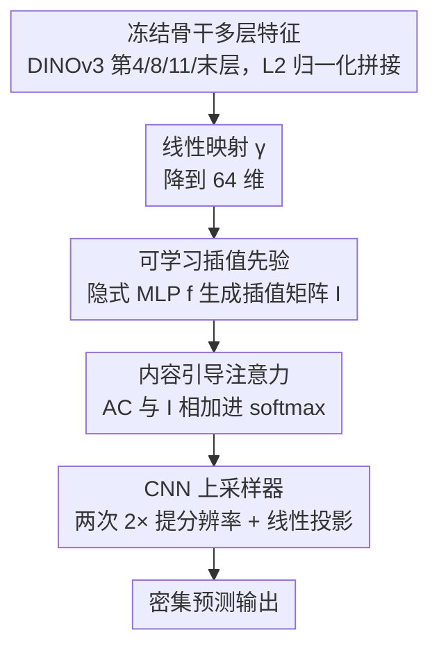

# LiDeRe: A Lightweight Readout for Fast and Data-Efficient Dense Prediction

**会议**: CVPR 2026  
**论文**: [CVF Open Access](https://openaccess.thecvf.com/content/CVPR2026/html/Luddecke_LiDeRe_A_Lightweight_Readout_for_Fast_and_Data-Efficient_Dense_Prediction_CVPR_2026_paper.html)  
**代码**: https://eckerlab.org/code/lidere  
**领域**: 模型压缩 / 参数高效迁移 / 密集预测  
**关键词**: 轻量 readout、参数高效微调、冻结骨干、可学习插值、密集预测

## 一句话总结
LiDeRe 主张：在小数据的密集预测任务上，与其用 LoRA 这类需要反传整个骨干的参数高效微调（PEFT），不如在**冻结骨干**之上挂一个精心设计的轻量 readout——它把"可学习插值先验"和"内容引导注意力"融进一个特征插值模块，常常用不到 40 万可训练参数，就能在语义分割、姿态估计、目标检测、轮廓分割上追平甚至超过 PEFT 方法，且训练更快、显存更省。

## 研究背景与动机
**领域现状**：大规模自监督预训练（DINOv2/DINOv3、SAM 等）让"用冻结骨干强特征 + 轻量适配"成为视觉新范式。在数据稀缺的密集预测（分割、检测、关键点）场景里，直接复用这些预训练特征尤其有吸引力，问题只剩"怎么把骨干特征适配到新任务"。

**现有痛点**：作者把当前做法摆成一个两难（论文 Figure 1）：
- **PEFT（如 LoRA）**虽然只训练少量参数，但反传仍要穿过骨干大部分层，训练显存和算力开销大；而且它要么只能用本身就为密集预测设计的骨干（如 SAM），要么得外挂参数沉重、又吃不到骨干预训练红利的任务头（UPerNet、SETR 等）。
- **线性 readout（linear probing）**训练快，但受限于骨干很低的空间分辨率，只能出粗糙的低分辨率预测，画不出细结构。
- SAM 系虽自带密集输出，但其特征语义预测力有限。

**核心矛盾**：理想的适配器应当"既能用任意强骨干、又能预测细结构、还要训练快省显存"，而现有方法总在"分辨率 / 参数量 / 训练开销 / 骨干通用性"几个维度里顾此失彼。

**本文目标**：设计一个挂在冻结骨干上的轻量 readout，既保留线性 readout 的训练速度和低显存，又能产出高分辨率、细粒度的密集预测。

**切入角度**：上采样不必硬编码成双线性插值——可以让网络**学**一个插值先验（纯几何、与内容无关），再叠一层**随内容变化**的注意力去修正它；既然骨干冻结，就无需反传穿过骨干，训练自然又快又省。

**核心 idea**：用"可学习插值先验 + 内容引导注意力"组成的特征插值模块，把冻结骨干的多层低分辨率特征高质量地上采样到密集预测，替代 PEFT。

## 方法详解

### 整体框架
LiDeRe 接在冻结骨干（默认 DINOv3 ViT-B，取第 4/8/11/末层特征，L2 归一化后拼接）之后，整条 readout 由三步串成：先用**线性映射**把高维拼接特征降到低维（默认 64 维）以保证参数效率；再过**特征插值模块**——它把内容无关的可学习插值先验和内容引导的注意力相加进同一个 softmax，把特征体上采样到目标分辨率；最后用一个小 **CNN 上采样器**进一步提分辨率并映射到任务输出（类别数 / 关键点 / 检测图）。因为骨干冻结、不需反传穿过它，整条流水线训练快、显存低。

### 关键设计

**1. 可学习特征插值先验：把"怎么上采样"从硬编码变成可学习的几何先验**

线性插值可写成 $X'=IX$，$I$ 是 $(H'W'\times HW)$ 的插值矩阵；常规做法是双线性等固定核。LiDeRe 不写死，而是用一个隐式神经网络 $f$ 生成插值矩阵：$I_{ij}=f(p^F_i,p^T_j)$，其中 $f$ 是个 MLP，输入是骨干特征体位置 $p^F\in\mathbb{R}^2$ 与目标位置 $p^T\in\mathbb{R}^2$ 之间的逐轴差与平方差（4 维向量）。直觉上 $f$ 只看坐标、不看内容，因此学到的是一个**内容无关的通用几何上采样先验**——某个特征位置应该给目标某像素贡献多少信息。它用 sine 激活，初始化时通过缩放权重让其聚焦相对距离；而且这个 $I$ 只在训练时算，测试时可缓存，进一步省时间。

**2. 内容引导注意力：让插值随样本内容自适应地聚焦相关区域**

光有几何先验还不够，不同样本该上采样的重点不同。LiDeRe 把插值矩阵当作注意力里的偏置项（mask），构成掩码注意力：

$$\text{softmax}\Big(\frac{A_C}{\sqrt{d}}+I\Big)V$$

其中值 $V=\psi_V(X)$，而内容注意力 $A_C=\phi(P)\psi_K(X)$，$\phi,\psi_K$ 都是线性投影，$\phi(P)$ 把 $H'W'\times HW$ 的坐标编码进来，可理解为"以特征体内位置为 query"的交叉注意力，最终 $A_C$ 形状 $H'W'\times HW$，正好能和 $I$ 相加。用 8 个注意力头，让不同子空间执行不同插值；输出再过一个隐藏维扩 4 倍的两层前馈 MLP。关键洞察是：由于 softmax 的存在，几何先验 $I$ 与内容项 $A_C$ 实际是**相乘**关系——先验给出"该往哪插"，内容注意力则按样本特征把这个先验调到相关区域上。可视化显示不同头会各自专注不同的特征尺度。

**3. 冻结骨干 + 线性降维 + CNN 上采样的参数高效流水线：把"快、省、通用"落到实处**

这是把方法做成 PEFT 替代品的工程支柱。骨干全程冻结，所以**不需要反传穿过骨干**，训练时间和显存与线性 readout 同级；线性映射 $X=\gamma([Z_l\mid l\in L])$ 把多层特征拼接后压到 64 维，是参数效率的关键一步；末端 CNN 上采样器由两个"卷积 + 转置卷积"块组成、各提 2× 分辨率，再线性投影到任务输出值。对姿态/检测这类大部分输出为零的任务，还会把 CNN 上采样器初始化成近似空图。整条 readout 常常不到 40 万可训练参数（随任务变化），却能吃到任意强骨干（CNN 或 ViT 皆可）的预训练红利。

### 损失函数 / 训练策略
用 AdamW（weight decay 0.01）优化，部分实验用余弦调度把学习率从 $10^{-3}$ 衰减到 0；单卡 A100 或 V100 训练，512px（DINOv2 为 518px）分辨率 + 自动混合精度。各任务按需调增广，检测用 CenterNet 框架（预测中心热图、尺寸图、类别嵌入图），姿态用关键点热图，轮廓用分块推理后拼接边界图。

## 实验关键数据

### 主实验
覆盖语义分割、姿态、轮廓、检测四类密集预测，统一在小数据上比，$P$ 为可训练参数量。

| 任务 / 数据集 | 方法 | 骨干 | $P$ | 关键指标 |
|------|------|------|------|------|
| 语义分割 / Pascal VOC | LoRA | SAM ViT-B | 4.1M | 79.5 mIoU |
| 语义分割 / Pascal VOC | **Ours** | DINOv3 ViT-L | 0.34M | **88.9 mIoU** |
| 语义分割 / Pascal VOC | **Ours + LoRA** | DINOv3 ViT-L | 0.73M | **90.5 mIoU** |
| 轮廓 / BSDS500 | UAED | - | 72M | 82.9 ODS |
| 轮廓 / BSDS500 | **Ours + LoRA** | DINOv3 ViT-L | 0.73M | **85.3 ODS** |
| 检测 / PlantDoc | Cascade-DN-Def-DETR | - | 48M | 49.1 mAP |
| 检测 / PlantDoc | **Ours** | DINOv3 ViT-L | 1.01M | **50.9 mAP** |
| 姿态 / iRodent | SuperAnimal | - | - | 73.0 mAP |
| 姿态 / iRodent | **Ours + LoRA** | DINOv3 ViT-L | - | **73.8 mAP** |

在 Pascal VOC 上以不到对手 1/10 的可训练参数超过所有 SAM 系 PEFT；在 BSDS500、PlantDoc 上甚至超过参数量大几十上百倍、且带任务专属预训练的专用模型；姿态上在没有任务专属预训练的前提下追平甚至超过用了相关姿态数据预训练的 SuperAnimal。

### 消融实验
逐个去掉特征插值模块的核心部件（Table 6），看各任务掉点。

| 配置 | 说明 | 影响 |
|------|------|------|
| Full | 完整插值先验 + 内容注意力 + 前馈 | 基准 |
| w/o 插值先验 $I$ | 换成固定双线性插值矩阵 | 检测掉 ~6.0 mAP（三次均值），定位类任务最受伤 |
| w/o 内容注意力 $A_C$ | 去掉内容分支，插值不再依赖内容 | 单去影响较小，但检测明显变差 |
| w/o 前馈 MLP | 用线性层替代扩维 MLP | 多数任务轻微下降 |
| 全去 / 线性评测 | 退化为线性 readout（含/不含转置卷积上采样） | 显著变差，预测粗糙、丢细节 |

### 关键发现
- **可学习插值先验对定位类任务贡献最大**：换成固定双线性后目标检测掉约 6.0 mAP，与"特征金字塔对检测至关重要"的经验一致——多尺度/可学习的上采样对定位特别关键。
- **内容注意力与前馈单独去掉影响小，但三者全去会大幅掉点**，说明几何先验、内容自适应、非线性变换是协同关系。
- **DINOv2/DINOv3 远胜 ImageNet/MAE/CLIP/SAM 骨干**，印证自监督密集特征更适合做密集预测的底座；ConvNeXt 这类 CNN 在姿态/检测上也表现不错。
- **训练极快**：1024px 输入下训练比 Conv-LoRA 快约 2.5×；512px 下训练/推理都快数倍，iRodent、Leaf 这种小数据集 5 分钟内就能训出有竞争力的结果。

## 亮点与洞察
- **"插值即注意力偏置"是个漂亮的统一**：把内容无关的几何上采样先验 $I$ 直接塞进 softmax 当 mask，与内容注意力 $A_C$ 因 softmax 而相乘——先验定"往哪插"、内容定"插到哪个区域"，既保留几何合理性又获得内容自适应。
- **隐式坐标网络学上采样核**：用只吃坐标差的 MLP $f$ 生成插值矩阵、测试时缓存，等于把"可学习的双线性"做成了即插即用、零额外推理代价的几何先验。
- **冻结骨干 = 不反传 = 又快又省**：核心工程红利来自"骨干不参与反传"，让一个 <40 万参数的 readout 在训练成本上对齐线性 probing，却拿到 PEFT 级精度——这个性价比对资源受限用户极友好。
- **方法论暗示**：自监督特征越强，越不需要复杂任务头和重微调，一个轻量 readout 就够——可迁移到更多密集预测任务。

## 局限与展望
- 检测上 mAP@50 涨得多（比前最佳 +7.1）但 mAP 相对弱，说明"能检到大多数物体、但精确定位偏弱"，框回归精度仍有提升空间。
- 方法假设骨干本身已是多任务可用的强骨干，对弱骨干（如 ImageNet 监督预训练）效果明显下滑，泛化依赖底座质量。
- 仍主要面向**小数据**场景验证；在大规模数据上轻量 readout 是否还能压过充分微调的 PEFT/任务头，论文未充分探讨。
- 部分任务（姿态/检测）需要对 CNN 上采样器做任务相关初始化与增广调参，并非完全开箱即用。

## 相关工作与启发
- **vs LoRA / Conv-LoRA 等 PEFT**：它们要反传穿过骨干、训练开销大，且常受限于 SAM 这类骨干或外挂重任务头；LiDeRe 冻结骨干不反传，用 <10% 的可训练参数追平甚至超过，并能用任意强骨干。
- **vs 线性 readout**：线性 readout 快但分辨率受限、预测粗糙；LiDeRe 用可学习插值 + 内容注意力 + CNN 上采样补上了细结构能力，定性对比里轮廓明显更精细。
- **vs SAM 系密集 PEFT**：SAM 自带密集输出但语义预测力有限；LiDeRe 论证 DINOv2/DINOv3 自监督特征在多数密集任务上更优，把底座从 SAM 换成自监督骨干。
- **vs 任务专属模型（EDTER、UAED、Cascade-DN-Def-DETR 等）**：这些模型参数量大几十上百倍且常带任务预训练，LiDeRe 用更少参数、更少样本就能匹敌或超过，体现"强自监督特征 + 轻 readout"的范式价值。

## 评分
- 新颖性: ⭐⭐⭐⭐ "可学习插值先验 + 内容注意力"的组合和"用冻结骨干 readout 替代 PEFT"的视角都比较新颖。
- 实验充分度: ⭐⭐⭐⭐⭐ 四类任务、多数据集、骨干对比、效率对比、部件消融都齐全。
- 写作质量: ⭐⭐⭐⭐ 动机清晰、图示到位，注意力与插值的数学表述略简。
- 价值: ⭐⭐⭐⭐ 小数据密集预测的实用、低成本方案，对资源受限场景很有吸引力。

<!-- RELATED:START -->

## 相关论文

- [\[CVPR 2026\] Rejection Mixing: Fast Semantic Propagation of Mask Tokens for Efficient DLLM Inference](rejection_mixing_fast_semantic_propagation_of_mask_tokens_for_efficient_dllm_inf.md)
- [\[CVPR 2026\] Ultra-Fast Neural Video Compression](ultra-fast_neural_video_compression.md)
- [\[CVPR 2026\] Test-time Sparsity for Extreme Fast Action Diffusion](test-time_sparsity_for_extreme_fast_action_diffusion.md)
- [\[CVPR 2026\] LoPrune: Efficient Data Pruning for LoRA-Based Fine-Tuning of Vision Transformer](loprune_efficient_data_pruning_for_lora-based_fine-tuning_of_vision_transformer.md)
- [\[CVPR 2026\] MEMO: Human-like Crisp Edge Detection Using Masked Edge Prediction](memo_human-like_crisp_edge_detection_using_masked_edge_prediction.md)

<!-- RELATED:END -->
