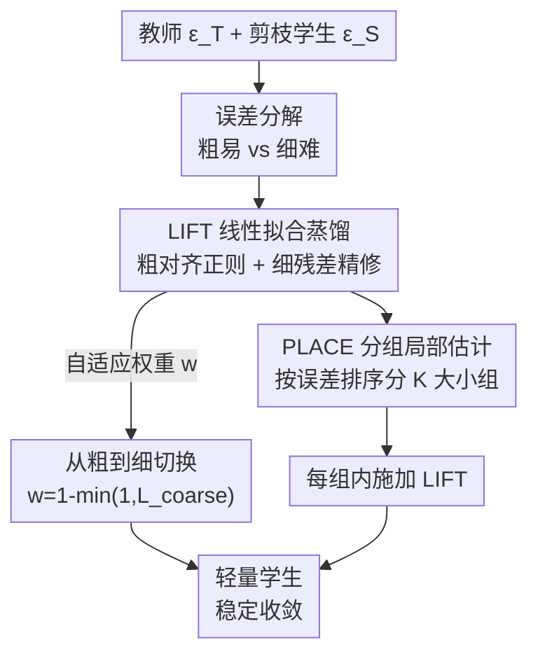

# LIFT and PLACE: A Simple, Stable, and Effective Knowledge Distillation Framework for Lightweight Diffusion Models

**会议**: CVPR 2026  
**arXiv**: [2605.19729](https://arxiv.org/abs/2605.19729)  
**代码**: 有（项目主页，论文未给出明确 GitHub 链接）  
**领域**: 模型压缩 / 扩散模型 / 知识蒸馏  
**关键词**: 扩散模型蒸馏, 容量鸿沟, 粗到细, 线性回归对齐, 局部自适应

## 一句话总结
针对"大教师蒸馏小扩散学生时训练不稳定"的痛点，本文用线性回归把蒸馏误差拆成"粗易（低阶矩失配）"和"细难（非线性残差）"两部分，提出 LIFT 先粗对齐再细精修、PLACE 按空间难度分组做局部自适应，在 90% 剪枝（学生仅占教师 1.6% 参数）的极端压缩下把 FID 从常规 KD 的 50–200+ 拉回到 15.73。

## 研究背景与动机
**领域现状**：扩散模型很强但太重，工业落地需要把大模型压缩成轻量学生。主流做法是先剪枝得到小学生，再用知识蒸馏（KD）让学生模仿教师——输出级 KD（OutKD，匹配两者预测噪声 $\epsilon$）和特征级 KD（FeatKD，匹配中间层特征）是两大套路。

**现有痛点**：作者通过实验（Fig.1）发现一个被忽视的现象——**教师越大，学生不仅效果越差，而且训练越不稳定**（多次运行的方差显著变大）。扩散模型的迭代去噪本质让学生要学一整套层级化的噪声预测行为，把"容量鸿沟（capacity gap）"问题放大得尤其严重。常见的妥协是故意用弱一点的教师，但这等于主动丢掉强教师的丰富知识。

**核心矛盾**：强教师的去噪过程过于复杂，轻量学生容量有限，**同时**逼它去拟合"容易的统计对齐"和"困难的非线性细节"会让 KD 失稳——尤其在大容量鸿沟下直接训练崩溃。

**切入角度**：作者做了一个诊断性探针实验（Alg.1）——在每个去噪时间步、对每个样本，独立用线性回归把学生输出仿射对齐到教师 $\epsilon^{\mathcal{T}}\approx\beta_0+\beta_1\cdot\epsilon^{\mathcal{S}}$。这只对齐了均值/方差等低阶矩，是非常"粗"的操作，但**即使学生权重冻结，仅做这一步就大幅稳定并提升了训练**。这说明误差天然可分解，且"粗对齐"本身就是稳定训练的关键。但逐样本回归推理时需要教师在场，不可部署——它是"诊断透镜"而非方法。

**核心 idea**：把探针实验的稳定收益"摊销（amortize）"成一个全局、可训练、推理时不依赖回归系数的目标——先对齐"粗易"误差稳住训练，再逐步转向"细难"残差学细节。

## 方法详解
### 整体框架
整个框架叫 **Coarse-to-Fine KD**，由 LIFT 和 PLACE 两个组件构成，作用于"剪枝得到的学生 + 强教师"这对网络上。先用诊断分析把蒸馏误差拆成两类：**Coarse-Easy 误差**（低阶矩失配，好学、对稳定去噪至关重要）和 **Fine-Hard 误差**（低阶矩捕捉不到的复杂非线性残差，是教师细节的来源）。LIFT 用一组线性回归系数 $(\beta_0,\beta_1)$ 把 KD 目标拆成"粗对齐正则项 + 细残差精修项"，并用自适应权重 $w$ 在训练中从粗逐步切到细。PLACE 进一步观察到误差在**空间上不均匀**（集中在语义显著区域、且随训练演化），于是把输出按误差大小排序分组、在每组内独立估计回归系数并施加 LIFT，做到局部难度自适应——全程**不增加任何参数、不增加推理开销**。

### 关键设计

**1. 误差分解：把单一 KD 目标拆成"粗易"和"细难"两条线**

常规 OutKD 用一个 $\|\epsilon^{\mathcal{T}}-\epsilon^{\mathcal{S}}\|_2^2$ 强行让学生逐点对齐教师，在大容量鸿沟下这个目标既难又乱，导致训练崩溃。作者把学生、教师在每个时间步的预测看作两个分布，用低阶矩（均值/方差）和高阶矩来刻画。通过逐样本 OLS 线性回归 $\beta_1=\mathrm{Cov}[\epsilon^{\mathcal{T}},\epsilon^{\mathcal{S}}]/\mathrm{Var}[\epsilon^{\mathcal{S}}]$、$\beta_0=\mathbb{E}[\epsilon^{\mathcal{T}}]-\beta_1\mathbb{E}[\epsilon^{\mathcal{S}}]$ 得到仿射校正 $\hat{\epsilon}^{\mathcal{S}}=\beta_0+\beta_1\epsilon^{\mathcal{S}}$，发现仅对齐低阶矩就能大幅提升、但仍留有差距。由此把误差明确分成两类：**Coarse-Easy**（一阶/二阶矩的统计失配，对齐它能让去噪过程稳定）和 **Fine-Hard**（矩对齐之后残留的复杂细节，决定最终上限和细粒度质量）。这个分解是后续一切的地基——它让方法可以分别、按节奏地处理两类误差，而不是糊成一个目标硬扛

**2. LIFT：把回归参数化的 KD 目标摊销成可部署的训练损失**

逐样本回归推理时要教师在场，不可部署。LIFT 的关键技巧是**反过来用恒等约束 $\beta_0=0,\beta_1=1$**——这对应"学生直接预测教师输出、不依赖任何回归系数"，从而推理时完全不需要回归参数。直接硬约束不可解，于是把它转成正则项，自然得到两项损失：粗对齐项 $\mathcal{L}_{\text{coarse}}=|\beta_0|+|\beta_1-1|$（把回归系数拽向恒等，对齐低阶矩），细精修项 $\mathcal{L}_{\text{fine}}=\|\epsilon^{\mathcal{T}}-(\beta_0+\beta_1\epsilon^{\mathcal{S}})\|_2^2$（最小化回归残差，抠非线性细节），其中 $\beta_0,\beta_1$ 由 OLS 闭式解给出。两者用自适应权重合成：

$$\mathcal{L}_{\text{LIFT}}=\mathcal{L}_{\text{coarse}}+w\cdot\mathcal{L}_{\text{fine}},\qquad w=1-\min(1,\mathcal{L}_{\text{coarse}})$$

训练早期 $\mathcal{L}_{\text{coarse}}$ 大、$w\approx0$，学生只管修粗失配；随着粗对齐改善、$\mathcal{L}_{\text{coarse}}\to0$，$w$ 升到 1，重心平滑切向细精修。这个 schedule **不是按固定步数切，而是由 $\mathcal{L}_{\text{coarse}}$ 自身大小驱动**——"先稳住全局统计、再学细节"，从而把探针实验观测到的稳定性收益变成可训练、跨全数据全时间步生效的真实目标

**3. PLACE：按空间难度分组，让粗对齐变成局部自适应**

LIFT 是全局单一对齐，但作者可视化误差图 $\mathcal{E}=|\epsilon^{\mathcal{T}}-\epsilon^{\mathcal{S}}|$（Fig.3）发现误差**高度结构化、空间不均匀**——集中在语义显著区域，且随训练演化。一个全局回归系数无法照顾"某些区域特别难"。PLACE 用误差幅度 $\mathcal{E}$ 度量蒸馏难度，把它所有元素排序后切成 $C\times N$ 个等大组 $\{G_i\}$、每组 $K$ 个元素：$G_1$ 装最小误差（最易），后面的组对应越来越难的区域。每组 $G_i$ 用 OLS 独立估自己的 $(\beta_{0,i},\beta_{1,i})$ 并算组内 LIFT 损失。等大分组刻意保持简单——避免复杂的分组构造、且能并行估计系数。这样**粗对齐项变成空间自适应的**，模型能把额外"注意力"精准投到学生最吃力的地方，而且因为只是重排损失计算、不引入参数也不改推理路径

### 损失函数 / 训练策略
完整训练目标整合扩散损失、LIFT/PLACE 损失、特征级 KD：

$$\mathcal{L}=\lambda_{diff}\mathcal{L}_{diff}+\lambda_{\text{LIFT}}\mathcal{L}_{\text{LIFT}}+\lambda_{\text{FeatKD}}\mathcal{L}_{\text{FeatKD}}$$

其中 $\mathcal{L}_{diff}=\|\epsilon^{\mathcal{T}}-\epsilon^{\mathcal{S}}\|_2^2$。在 PLACE 下 $\mathcal{L}_{\text{LIFT}}$ 按每组 $G_i$ 分别计算。学生统一用各自的剪枝基线初始化（图像空间 Diff-Pruning、文生图 BK-SDM / ShortGPT、DiT 用 TinyFusion），训练时**只把原 OutKD 换成 LIFT+PLACE**，其余设置不动；默认组大小 $K=16$（即 $2^4$）。

## 实验关键数据

### 主实验
覆盖图像空间扩散（CelebA、LSUN-Bedroom）、隐空间文生图（SD 2.1、SD3-Medium）、类条件 DiT（ImageNet）五个数据集，跨 U-Net/DiT/MMDiT 多种骨干。

| 数据集 | 剪枝率 | 学生参数 | 方法 | FID↓ |
|--------|--------|---------|------|------|
| CelebA 64² | 50% | 19.7M | OutKD+FeatKD | 5.24 |
| CelebA 64² | 50% | 19.7M | **Ours (K=16)** | **4.93** |
| CelebA 64² | 90% | 1.3M | w/o KD | 223.56 |
| CelebA 64² | 90% | 1.3M | OutKD | 55.41 |
| CelebA 64² | 90% | 1.3M | OutKD+FeatKD | 211.23 |
| CelebA 64² | 90% | 1.3M | **Ours (K=16)** | **15.73** |
| LSUN-Bedroom 256² | 30% | 63.2M | OutKD+FeatKD | 23.35 |
| LSUN-Bedroom 256² | 30% | 63.2M | **Ours (K=16)** | **16.57** |
| LSUN-Bedroom 256² | 50% | 28.5M | OutKD+FeatKD | 69.21 |
| LSUN-Bedroom 256² | 70% | 12.6M | **Ours (K=16)** | **37.96** |

最戏剧性的结果是 90% 剪枝、学生仅 1.3M（教师 78.7M 的 1.6%）：常规 KD 全面崩溃（FID 50–240），本文稳定收敛到 **15.73**。LSUN 上本文 70% 剪枝（37.96）甚至好过 OutKD+FeatKD 的 50% 剪枝（69.21），且参数更少。

文生图 SD 2.1（LAION，零样本 MS-COCO 评测）上 BK-Tiny-v2 学生 FID 从 BK-SDM 的 15.68 降到 14.60，CLIP/IS 一致提升；SD3-Medium（MMDiT + flow matching）D18 学生 FID 22.72→21.21，证明方法可推广到非扩散的 flow-based 范式。ImageNet 类条件 DiT-D14 FID 2.86→2.79。

### 消融实验

| 配置 | CelebA 90% 学生(1.3M) FID↓ | 说明 |
|------|---------------------------|------|
| Linear scheduler $w=i/I$ | 18.09 | 固定线性切换 |
| Cosine scheduler | 17.45 | 固定余弦切换 |
| **Adaptive $w=1-\min(1,\mathcal{L}_{coarse})$** | **15.73** | 由损失驱动，最优 |

| 教师容量 | 学生(1.3M) OutKD+FeatKD FID↓ | Ours (K=16) FID↓ |
|---------|------------------------------|------------------|
| 78.7M（最强） | 193.56 ± 52.10 | **17.03 ± 1.77** |
| 19.7M | 42.41 ± 6.63 | **25.38 ± 3.93** |
| 9.2M | 40.88 ± 3.23 | **24.16 ± 3.48** |

### 关键发现
- **自适应权重是核心**：由 $\mathcal{L}_{\text{coarse}}$ 驱动的切换在所有学生容量上都优于固定的 linear/cosine schedule（90% 学生 15.73 vs 17.45/18.09），且早期不会被细难误差干扰，收敛更快。
- **容量鸿沟下才显威力**：教师越强，常规 KD 越崩（78.7M 教师下 OutKD+FeatKD 飙到 193.56±52.10、方差巨大），本文反而拿到最好且最稳的 17.03±1.77——证明大教师的信号是有意义的，崩溃来自容量鸿沟而非教师本身质量差。
- **组大小 $K$ 存在甜区**：$K=2^3$ 太小（回归系数估计不稳）、$K=2^6$ 太大（退化成全局、丢掉空间自适应）都掉点，中等的 $K=16$ 最佳。
- **几乎零开销**：PLACE 仅在训练时加一次误差排序，吞吐从 4.89 降到 4.86 iter/s，推理时无任何额外参数或开销。

## 亮点与洞察
- **"诊断探针 → 摊销目标"的方法论很漂亮**：先用一个不可部署的逐样本回归实验证明"粗对齐就能稳训练"，再用恒等约束 $\beta_0=0,\beta_1=1$ 把它摊销成推理时不依赖回归参数的可训练损失——把一个分析工具优雅地转成了真实方法，这种"先证明现象、再工程化"的思路可复用。
- **用回归系数把 KD 目标"参数化"再正则**：常规思路是直接逐点匹配，本文把匹配过程显式拆成"系数对齐（粗）+ 残差最小化（细）"，从而可以分别加权、按节奏训练，这个把单一损失结构化的视角能迁移到其他 teacher-student 蒸馏。
- **误差空间不均匀 + 随训练演化的观察很有价值**：误差集中在语义区域、且动态变化，因此静态加权不够、需要 PLACE 这种按当前误差排序分组的动态局部策略——这对其他像素级/特征级监督任务也有启发。
- **跨范式泛化强**：同一套方法在 image/latent 空间、U-Net/DiT/MMDiT 骨干、无条件/类条件/文生图任务、乃至 flow matching 上都涨点，说明它抓的是 KD 的共性矛盾而非某个架构的 trick。

## 局限与展望
- 作者坦承 PLACE 的误差排序带来分辨率相关的训练开销（虽然实测可忽略），在更高分辨率下这个排序成本是否仍可忽略值得验证。
- 方法主要替换 OutKD，仍需与 FeatKD / masked-representation KD 等组合使用（训练目标里 $\mathcal{L}_{\text{FeatKD}}$ 仍在），并非完全自给自足的蒸馏方案。
- 文生图 BK-Base-v2 上 FID 略有退化（16.72 vs 15.85，仅靠 CLIP/IS 扳回），说明在容量鸿沟不大时本文优势不明显——方法的甜点是**大容量鸿沟 / 极端压缩**场景。
- 等大分组（equal-sized grouping）是为简单而做的选择，按语义/结构感知的分组是否能进一步提升、$K$ 是否该随时间步自适应，论文未探索。

## 相关工作与启发
- **vs 常规 OutKD / FeatKD**：它们直接逐点匹配教师输出/特征，在大容量鸿沟下失稳甚至崩溃（FID 50–200+）；本文把目标拆成粗/细两项并自适应切换，避免了"一上来就强逼学生学非线性细节"导致的不稳定。
- **vs "故意弱化教师"的做法**（用小教师 / 次优教师）：那类方法简化优化但牺牲了强教师的丰富知识；本文反其道而行，目标是**把强教师的全部表达力可靠地传给小学生**，并实验证明最强教师确实给出最有意义的信号。
- **vs TinyFusion / BK-SDM / Diff-Pruning 等剪枝-蒸馏基线**：本文不替换它们的剪枝/初始化，只把其中的 OutKD 换成 LIFT+PLACE，是一个**即插即用的 KD 目标**，在各基线之上稳定涨点，定位互补而非竞争。

## 评分
- 新颖性: ⭐⭐⭐⭐ "误差分解 + 恒等约束摊销 + 空间难度分组"组合新颖，诊断探针到可部署目标的转化尤其巧妙。
- 实验充分度: ⭐⭐⭐⭐⭐ 跨 5 数据集、3 种骨干、3 类任务、扩散与 flow 两种范式，含容量鸿沟/调度器/组大小多组消融，带方差。
- 写作质量: ⭐⭐⭐⭐ 动机链条（探针实验→分解→摊销）讲得清晰，公式与图配合到位。
- 价值: ⭐⭐⭐⭐⭐ 让极端压缩（1.6% 参数）的扩散学生从崩溃变为可用（FID 15.73），对轻量扩散落地有直接价值。

<!-- RELATED:START -->

## 相关论文

- [\[CVPR 2026\] DMGD: Train-Free Dataset Distillation with Semantic-Distribution Matching in Diffusion Models](dmgd_train-free_dataset_distillation_with_semantic-distribution_matching_in_diff.md)
- [\[CVPR 2026\] Streamlined Knowledge Distillation](streamlined_knowledge_distillation.md)
- [\[CVPR 2026\] Sampling-Aware Quantization for Diffusion Models](sampling-aware_quantization_for_diffusion_models.md)
- [\[CVPR 2026\] Mitigating The Distribution Shift of Diffusion-based Dataset Distillation](mitigating_the_distribution_shift_of_diffusion-based_dataset_distillation.md)
- [\[ECCV 2024\] Simple Unsupervised Knowledge Distillation With Space Similarity](../../ECCV2024/model_compression/simple_unsupervised_knowledge_distillation_with_space_similarity.md)

<!-- RELATED:END -->
