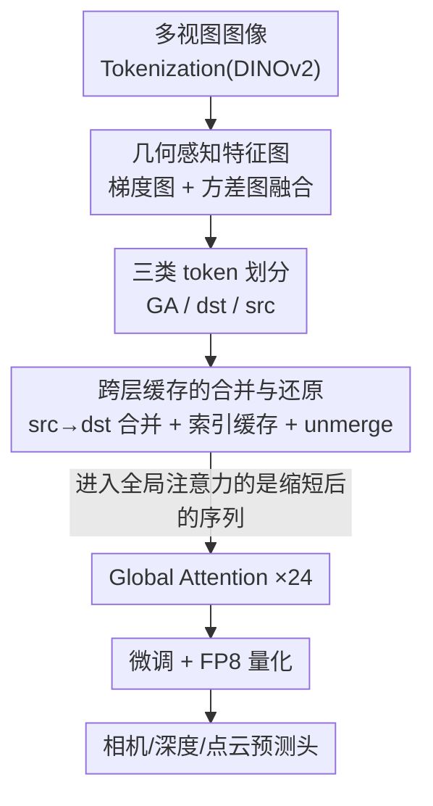

# LiteVGGT: Boosting Vanilla VGGT via Geometry-aware Cached Token Merging

**会议**: CVPR 2026  
**论文**: [CVF Open Access](https://openaccess.thecvf.com/content/CVPR2026/html/Shu_LiteVGGT_Boosting_Vanilla_VGGT_via_Geometry-aware_Cached_Token_Merging_CVPR_2026_paper.html)  
**代码**: https://garlicba.github.io/LiteVGGT/ (项目页)  
**领域**: 模型压缩 / 3D视觉  
**关键词**: VGGT 加速, token 合并, 几何感知, 缓存复用, 3D 重建

## 一句话总结
针对 3D 基础模型 VGGT 在长序列上全局注意力的二次复杂度瓶颈，LiteVGGT 提出"几何感知 + 跨层缓存"的 token 合并策略——按几何重要性挑出关键 token 不动、把冗余 token 合并到锚点、并跨层复用合并索引，配合微调与 FP8 量化，在 1000 张图输入下相比 VGGT 提速约 10× 且几乎不掉点。

## 研究背景与动机

**领域现状**：前馈式 3D 重建（DUSt3R、MASt3R、Fast3R、VGGT）用一次前向就能从多视图直接回归相机参数、深度、点云，省去了传统 MVS 的繁琐与 NeRF 的逐场景优化。其中 VGGT（1.2B 参数）能处理任意长度图像序列、一次预测全部 3D 属性，是当前的 SOTA 基础模型。

**现有痛点**：VGGT 的 frame-global attention 为保证跨帧一致性，会把所有图像的 token 拼起来做全序列自注意力，导致计算与显存随 token 数二次增长。实测 vanilla VGGT 在 500 张图就 OOM；即便去掉冗余显存操作的优化版 VGGT*，1000 张图在 H20 上仍要 20 分钟，无法用于大规模场景。

**核心矛盾**：并发工作各有取舍——StreamVGGT 改成序列输入但牺牲了单次端到端能力；QuantVGGT 靠逐场景量化标定，泛化性差；FastVGGT 用通用 token 合并（源自 LLM/VLM/扩散模型），但**忽略了 VGGT 的 token 与图像 patch、3D 点云是一一对应的几何耦合关系**，随机/定步长采样会把高信息量的几何 token（边缘、纹理）和低信息 token 合并，造成关键细节丢失与残余冗余。

**本文目标**：在保住 VGGT 单次重建质量的前提下，把全局注意力的冗余压下去，让其能高效处理上千张图的大场景。

**切入角度**：作者做了两个 3D 专属观察——其一，把纯边缘图（去掉所有纹理光度）喂给 VGGT/DepthAnything-V2，它们仍能给出合理几何结果，说明 3D 模型重度依赖结构轮廓（边缘）做几何推理，因此边缘/高梯度/高方差区域是几何骨架，合并时必须保留；其二，相邻网络层间的 token 相似度稳定，意味着合并决策可以跨层复用，不必每层重算。

**核心 idea**：用"几何感知的 token 优先级 + 跨层缓存的合并索引"代替通用随机合并，既保住几何关键 token，又省掉逐层重算合并索引的开销。

## 方法详解

### 整体框架
LiteVGGT 在 VGGT 的全局注意力两侧各插入一个 Geometry-aware Token Merging（GA-merge / unmerge）模块：进入全局注意力前，先用几何感知特征图把每帧 token 分成三类，再把冗余的 src token 合并到锚点 dst token 上、缩短序列做注意力；注意力算完后再把合并的 token 还原（unmerge）回原始布局，交给后续 frame-attention 与各预测头。合并索引每 6 层才算一次、其余层直接复用，最后用微调修复合并带来的精度损失，并叠加 FP8 量化进一步降延迟降显存。

### 关键设计

**1. 几何感知特征图：用边缘和方差量化每个 token 的几何重要性**

通用 token 合并最大的毛病是"瞎合并"——随机/定步长采样可能把边缘纹理这种高信息 token 和平滑墙面这种低信息 token 揉在一起，几何细节就丢了。作者据此先给每个 token 算一个几何重要性分。它融合两路轻量线索：用 Sobel 算子提取像素梯度图 $\boldsymbol{g}$（捕捉边缘/纹理边界，下采样到 token 粒度），以及把 token 重排成 2D 网格后做局部平均池化方差得到的 token 方差图 $\boldsymbol{v}$（区分纹理表面与平滑区域）。二者归一化后加权融合：

$$\mathcal{M}_{GA} = \omega \cdot \mathrm{norm}(\boldsymbol{g}) + \varepsilon \cdot \mathrm{norm}(\boldsymbol{v})$$

其中 $\omega, \varepsilon$ 平衡两路贡献。这张 $\mathcal{M}_{GA}$ 把高信息 token（边缘/纹理）和低冗余 token（平滑面）清晰区分开，是后面"该保谁、该合谁"的依据。这个设计直接呼应了"3D 模型靠结构轮廓做几何推理"的观察——边缘区域被显式标成高分加以保护。

**2. 三类 token 划分：在压缩率和几何保真之间分工**

有了几何分，作者把每帧 token 分成三类，让"保几何"和"提效率"各司其职：**GA Tokens** 是每帧几何分最高的前 10%，对应物体边缘、纹理等关键细节，**完全排除在合并之外**以免核心信息流失；**dst Tokens** 是合并锚点，包含全部第一帧 token（VGGT 的世界坐标锚，保跨帧一致）以及其他帧每个 $2\times2$ 网格里几何分最低的一个 token（专挑平滑低信息区当锚点，最大化合并效率）；**src Tokens** 是剩下的冗余 token，被指定去合并进最相似的 dst。这样一来，"该保的几何骨架"和"该被压的冗余"被一刀分开，避免了通用方法把两者混为一谈。

**3. 跨层缓存的合并与还原：既压冗余 token、又省重算索引**

这一步同时解决"token 冗余"和"重复计算"两个问题。合并时，src token 通过余弦相似度匹配到 dst（保证几何对齐），每个 dst 的特征用自己和分配到的 src 取平均更新：

$$x_d^{\uparrow} = \frac{x_d + \sum_{x_s \in S_d} x_s}{1 + |S_d|}$$

只有更新后的 $x_d^{\uparrow}$ 进入后续层，序列因此缩短。关键的省时招数是**索引缓存**：利用相邻层 token 相似度稳定的观察，合并索引每 6 层才计算一次（全程仅 4 次），中间层直接复用，单这一项就降低约 20% 延迟且几乎不掉精度。为支持 VGGT 的密集输出（深度图、点云），预测前用 **token unmerging** 把序列还原回原长——每个 $x_d^{\uparrow}$ 复制回它所代表的 $\{x_d\}\cup S_d$ 全部 token，局部几何差异则靠 VGGT 的 Frame Attention 重新找回，保证密集预测不退化。

### 损失函数 / 训练策略
基于 VGGT 预训练权重，仅微调 aggregator 与各预测头，在 Co3Dv2、BlendMVS、DL3DV 等混合数据上每 batch 采样 4–48 张图、8×H20 训 20K 步（约 3 天），用于补偿合并带来的精度损失。学习率采用复合调度：前 5% 从 $1\times10^{-6}$ 线性 warm-up 到 $4\times10^{-5}$，后 95% 余弦衰减到 $7\times10^{-7}$。推理阶段用 NVIDIA Transformer Engine 做 FP8 量化，靠 token 合并保住了核心特征表示，因此量化几乎不掉点。

## 实验关键数据

### 主实验
ScanNet-50 点云重建（CD 越低越好，Time 越低越好）：

| 输入图数 | 指标 | VGGT* | FastVGGT | LiteVGGT |
|----------|------|-------|----------|----------|
| 1000 | CD | 0.485 | 0.436 | **0.428** |
| 1000 | Time | 1275.1s | 258.3s | **127.2s** |
| 96 | CD | 0.418 | 0.409 | **0.329** |
| 96 | Time | 16.7s | 6.4s | **3.5s** |

vanilla VGGT 在 296 张以上即 OOM；LiteVGGT 在 1000 张图上相比 VGGT* 提速约 10× 且 CD 更低。Tanks & Temples 大场景下 LiteVGGT 在两档阈值都优于 FastVGGT，时间 29.52s vs VGGT* 的 221.45s。

### 消融实验
DTU / ScanNet-50 / 7Scenes 上逐模块叠加（Overall、CD 越低越好，Time(s)、Mem.(GiB) 越低越好）：

| 配置 | DTU Over.↓ | CD↓ | Time↓ | Mem.↓ |
|------|-----------|-----|-------|-------|
| VGGT* | 0.534 | 0.485 | 1275.1 | 58.29 |
| + GA token merging | 0.696 | 0.402 | 258.7 | 60.34 |
| + Fine-tuning | 0.642 | 0.396 | 198.3 | 57.43 |
| + Cache Merge Indices | 0.688 | 0.412 | 198.3 | 57.43 |
| + FP8 quantization | **0.716** | 0.428 | **126.2** | **45.31** |

### 关键发现
- GA token merging 一上来就把时间从 1275s 砍到约 259s，是降延迟的主力；索引缓存进一步降约 20% 延迟而精度几乎不动。
- 微调是修复合并精度损失的关键一环：去掉微调时 DTU Overall 明显偏高（0.696），加上后回到 0.642。
- FP8 量化主要贡献显存与延迟（Mem. 从 ~57 降到 45.31 GiB），靠 token 合并保住特征表示，精度代价很小。
- 在 DTU 物体级重建上 LiteVGGT 略低于 VGGT 但明显超过 FastVGGT，说明几何感知合并比通用合并更适配 3D 任务。

## 亮点与洞察
- **"喂边缘图仍能重建"是整篇方法的支点**：用一个反直觉实验（去掉纹理光度只留轮廓，模型照样输出合理几何）论证了 3D 模型靠结构轮廓推理，从而把"保边缘 token"从经验变成有据可依的设计原则。
- **跨层缓存把"合并"从一次性技巧变成省时杠杆**：观察到相邻层相似度稳定，就敢每 6 层才算一次索引，这种"决策可复用"的视角能迁移到其他带重复 token 选择的加速场景。
- **合并 + 量化是互相成全的**：token 合并保住了核心特征表示，才让 FP8 量化几乎无损——两类压缩手段叠加而非互相打架，是个可复用的工程组合。

## 局限与展望
- 几何关键 token 比例（前 10%）、$2\times2$ 锚点网格、每 6 层缓存一次都是经验设定，论文未充分探讨对不同场景密度的敏感性（⚠️ 以原文为准）。
- 微调需 8×H20 训约 3 天，复现门槛较高；且方法强绑定 VGGT 架构，迁移到其他 3D 基础模型需重新适配。
- 大场景下 F1 仍略低于 VGGT、物体级 DTU 也略逊原模型，几何细节有可见但可接受的损失。
- 融合权重 $\omega, \varepsilon$ 的具体取值与选取方式文中未细述（⚠️ 以原文为准）。

## 相关工作与启发
- **vs FastVGGT**: 同样做 token 合并，但 FastVGGT 沿用 LLM/扩散模型的通用随机采样划分，忽略 VGGT token 的几何耦合；LiteVGGT 用几何感知划分 + 跨层缓存，重建质量与速度都更优。
- **vs QuantVGGT**: QuantVGGT 靠逐场景量化标定、泛化性受限；LiteVGGT 的 FP8 量化建立在 token 合并保留的特征表示之上，作为通用后处理叠加。
- **vs StreamVGGT**: StreamVGGT 改序列输入牺牲单次端到端能力；LiteVGGT 保留 VGGT 单次前向的核心优势，只压缩内部冗余。
- **vs ToMe / ToMeSD**: 经典视觉 token 合并的源头，但面向语义 token、随机采样；LiteVGGT 把"unmerge 还原密集输出"的思路引到 3D 几何场景并加入几何先验。

## 评分
- 新颖性: ⭐⭐⭐⭐ 几何感知 + 跨层缓存针对 3D token 特性，切入点扎实但属于 token 合并范式的专门化改造。
- 实验充分度: ⭐⭐⭐⭐⭐ 覆盖 ScanNet/7Scenes/NRGBD/DTU/Tanks&Temples 多任务多尺度，逐模块消融清晰。
- 写作质量: ⭐⭐⭐⭐ 动机由观察驱动、逻辑顺，部分超参设定交代偏简。
- 价值: ⭐⭐⭐⭐⭐ 让 VGGT 能处理千图级大场景，对前馈 3D 重建落地有直接意义。

<!-- RELATED:START -->

## 相关论文

- [\[CVPR 2026\] HTTM: Head-wise Temporal Token Merging for Faster VGGT](httm_head-wise_temporal_token_merging_for_faster_vggt.md)
- [\[CVPR 2026\] Model Merging on Loss Landscape: A Geometry Perspective](model_merging_on_loss_landscape_a_geometry_perspective.md)
- [\[CVPR 2026\] Saliency-Driven Token Merging for Vision Transformers](saliency-driven_token_merging_for_vision_transformers.md)
- [\[CVPR 2026\] Bridging Domains through Subspace-Aware Model Merging](bridging_domains_through_subspace-aware_model_merging.md)
- [\[CVPR 2026\] MeToM: Metadata-Guided Token Merging for Efficient Video LLMs](metom_metadata-guided_token_merging_for_efficient_video_llms.md)

<!-- RELATED:END -->
