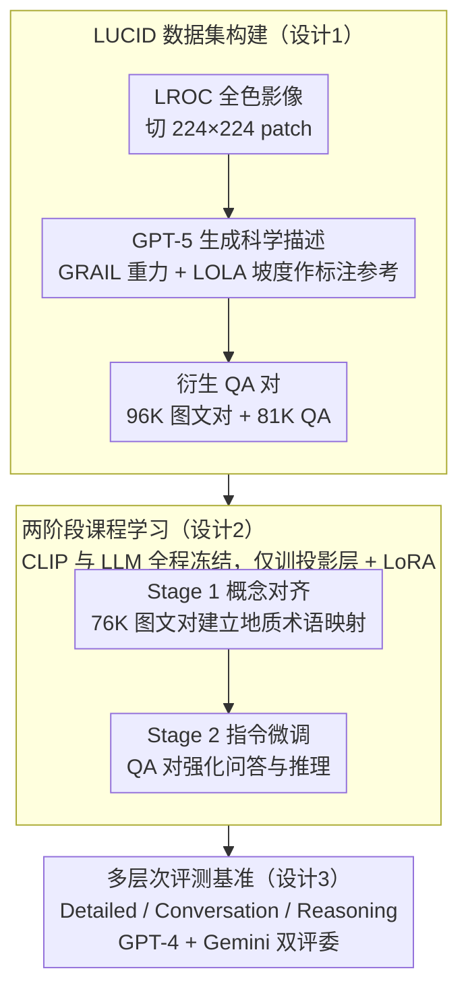

# LLaVA-LE: Large Language-and-Vision Assistant for Lunar Exploration

**会议**: CVPR 2026  
**arXiv**: [2603.24696](https://arxiv.org/abs/2603.24696)  
**代码**: [https://github.com/OSUPCVLab/LLaVA-LE](https://github.com/OSUPCVLab/LLaVA-LE)  
**领域**: 模型压缩  
**关键词**: 月球探测, 视觉语言模型, 地质理解, 多模态推理, 领域微调

## 一句话总结

LLaVA-LE 是首个面向月球探测的视觉语言模型，通过构建大规模真实月球图像-文本数据集 LUCID（96K 图像+81K QA对）和两阶段课程学习微调 LLaVA，在月球地质理解和多模态推理上实现 3.3× 基线提升。

## 研究背景与动机

VLM 在自然图像理解方面取得了巨大进展，但在行星科学领域几乎空白。主要原因是缺乏大规模高质量的行星图像-文本配对数据。现有月球数据集规模小、单模态、常包含合成数据，不适合训练现代 VLM。

**核心矛盾**：行星遥感与自然图像理解本质不同——月球地质分析需要跨物理模态（光学、重力异常、地形坡度）的联合推理，单张图像只能提供表面反射信息，不足以理解地质结构。

**本文目标**：构建首个基于真实 NASA 任务数据的大规模多模态月球数据集，并训练一个能进行月球地质描述、地质问答和多模态推理的视觉语言助手。

## 方法详解

### 整体框架

LLaVA-LE 要解决的是一个数据问题：通用 VLM 没见过月球，是因为没有大规模真实的月球图像-文本配对可学。整篇工作因此分两步走——先造数据，再做适配。数据侧从 NASA 三个任务里取原始遥感产品（LROC 的高分辨率全色影像、GRAIL 的重力异常、LOLA 的地形坡度），把全色大图切成 224×224 的小块（每块约覆盖 28×28 km），再用 GPT-5 把每块翻译成带地质解释的科学描述——值得注意的是，重力与坡度图只在标注时喂给 GPT-5 当参考、帮它把表面纹理「锚」到地下结构上，模型本身推理时只输入全色影像。有了富文本描述后再衍生出 QA，汇成 LUCID 数据集。模型侧从 LLaVA-v1.5-13B 出发，沿用其 CLIP 视觉编码器 + 投影层 + LLM 架构，但把训练拆成「先对齐领域概念、再学指令问答」两阶段，让一个原本只懂自然图像的模型逐步变成能聊月球地质的助手。

### 关键设计

**1. LUCID 数据集：用真实 NASA 影像 + GPT-5 标注，绕开行星领域无配对数据的瓶颈**

行星科学一直缺能喂给现代 VLM 的图文对，已有月球数据要么规模小、要么是合成的。LUCID 的做法是从 LROC 拉真实全色月球影像，把 1504×832 的大图切成 60 块 224×224 的 patch（保留原生分辨率，每块约覆盖 784 km²），再用一套结构化 prompt 驱动 GPT-5：不是简单描述「这里有个坑」，而是要求它写出包含地质背景、地形形态、以及对地下特征推断的详细科学描述。这里有个关键巧思——单看一张全色光学图只能读出表面反射，读不出地下结构，所以标注时把同一区域配准好的 GRAIL 重力异常图和 LOLA 地形坡度图一并喂给 GPT-5 当参考，让它把「表面纹理」锚定到「地下质量分布」上写出地球物理意义的描述；但这两路辅助模态只用于生成更高质量的文本，训练和推理时模型输入的仍只是全色影像。有了这层富文本描述之后，再从约 20K 张图衍生出 QA（每张描述生成 3-5 个问答），最终得到 96K 图像-描述对和 81K VQA 对。关键在于「真实影像 + 多模态地球物理参考 + 大模型标注」的组合：影像保证视觉信号真实、重力/坡度图把描述锚到科学事实上、GPT-5 则用可承受的成本把标注规模顶到训现代 VLM 所需的量级。

**2. 两阶段课程学习：先建领域概念基础，再学指令问答**

把一个见惯自然图像的 VLM 直接拿月球 QA 去微调，效果并不好——模型连「环形山」「月海玄武岩」这类术语和对应的视觉形态都没对齐，更谈不上推理。LLaVA-LE 因此按由浅入深排课：Stage 1（概念对齐）只用图像-描述对训练，让模型先把月球地质的专用词汇和视觉-语义映射建立起来；Stage 2（指令微调）再换上 QA 对，专门强化交互问答和推理能力。这种顺序之所以有效，是因为指令微调本质上是在已有概念之上学「怎么回答」，如果底层视觉-语义映射还没打通，QA 阶段就会在错误的概念基础上空转——消融里 Stage 1 单独就贡献了大部分提升，正印证了概念对齐是后续一切的地基。

**3. 多层次评测基准：按推理复杂度分维度衡量领域 VLM**

领域 VLM 的好坏没法用单一分数概括——能准确描述地貌、能多轮对话、能做地质推断，是三种不同难度的能力。基准因此把评测拆成 Detailed（详细描述）、Conversation（对话）、Reasoning（推理）三个维度分别打分，并用 GPT-4 和 Gemini 双评委交叉评判以降低单一裁判的偏置。这样既能看出模型整体强不强，也能定位它到底是描述准、还是推理弱，给后续诊断提供了比单一 Overall 分更有信息量的视角。

### 损失函数 / 训练策略

两阶段都用标准的因果语言建模目标（对描述/答案 token 做负对数似然 $\mathcal{L}=-\sum_{t=1}^{T}\log P(y_t\mid y_{<t}, I)$）。参数更新策略两阶段一致、也是本文容易被误读的一点：**CLIP 视觉编码器和 LLM 主干在 Stage 1、Stage 2 全程都冻结**，可训练的只有视觉-语言投影层 + 插进 Transformer 各层的轻量 LoRA 模块。Stage 2 并不解冻整个 LLM，而是继续用同样的轻量参数在已对齐的概念基础上学问答——这也是领域微调能在有限算力下跑通的原因。

## 实验关键数据

### 主实验

| 模型 | Detailed | Conversation | Reasoning | Overall | 相对Judge得分 |
|------|----------|-------------|-----------|---------|--------------|
| Base LLaVA | 低 | 低 | 低 | ~0.32 | — |
| LLaVA-LE Stage 1 | 中 | 中 | 中 | ~0.51 | — |
| LLaVA-LE Stage 2 | 高 | 高 | 1.070 | ~1.06 | 超越评委参考分 |

LLaVA-LE Stage 2 相对 Base LLaVA 实现 3.3× 整体提升，推理维度得分 1.070 甚至超过评委自身的参考答案。

### 消融实验

| 配置 | Overall | 说明 |
|------|---------|------|
| Base LLaVA (无微调) | ~0.32 | 通用模型在月球领域极弱 |
| Stage 1 only | ~0.51 | 概念对齐提供 ~60% 提升 |
| Stage 1 + Stage 2 | ~1.06 | 指令微调进一步翻倍 |

### 关键发现

- 通用 VLM 在行星科学领域几乎无法使用，领域微调至关重要
- 两阶段训练中 Stage 1 的概念对齐贡献巨大，说明领域术语和概念映射是基础
- 推理得分超越评委参考答案表明模型在数据密集训练后可以产生高质量地质分析

## 亮点与洞察

- **首个行星科学 VLM**：填补了 AI 在行星探测领域的空白，开创了新的应用方向
- **GPT-5 生成科学标注的管线**：用大模型为领域数据自动生成高质量标注的思路可迁移到其他缺乏标注的科学领域
- **完全开源**：数据集、代码、模型权重全部公开，对后续研究价值很大

## 局限与展望

- 当前仅使用全色图像，未充分利用多模态遥感数据（重力、坡度）的联合推理能力
- GPT-5 生成的标注可能存在地质学上的不准确，需要专家验证
- 评测仍依赖 LLM 评委，缺乏行星科学家的人类评估
- 未来可扩展到火星、小行星等其他天体

## 相关工作与启发

- **vs LLaVA-Med**: LLaVA-Med 将 LLaVA 适配到医学，LLaVA-LE 适配到行星科学，思路类似但领域挑战不同
- **vs Space-LLaVA**: Space-LLaVA 用合成数据，LLaVA-LE 用真实 NASA 数据，数据质量更高
- **vs AlphaEarth**: AlphaEarth 面向地球观测，LLaVA-LE 面向月球，后者的数据稀缺性挑战更大

## 评分

- 新颖性: ⭐⭐⭐⭐ 领域应用创新，但方法本身（LLaVA微调）较标准
- 实验充分度: ⭐⭐⭐ 评测设计合理但规模偏小，缺少与更多基线的对比
- 写作质量: ⭐⭐⭐⭐ 动机清晰，数据集构建描述详细
- 价值: ⭐⭐⭐⭐ 开源数据集和模型对行星科学社区有重要意义

<!-- RELATED:START -->

## 相关论文

- [\[CVPR 2026\] Quant Experts: Token-aware Adaptive Error Reconstruction with Mixture of Experts for Large Vision-Language Models Quantization](quant_experts_token_aware_vlm_quantization.md)
- [\[ACL 2025\] Pre-training Distillation for Large Language Models: A Design Space Exploration](../../ACL2025/model_compression/pre-training_distillation_for_large_language_models_a_design_space_exploration.md)
- [\[NeurIPS 2025\] Vision-centric Token Compression in Large Language Model](../../NeurIPS2025/model_compression/vision-centric_token_compression_in_large_language_model.md)
- [\[CVPR 2026\] BinaryAttention: One-Bit QK-Attention for Vision and Diffusion Transformers](binaryattention_one-bit_qk-attention_for_vision_and_diffusion_transformers.md)
- [\[ICLR 2026\] AMiD: Knowledge Distillation for LLMs with α-mixture Assistant Distribution](../../ICLR2026/model_compression/amid_knowledge_distillation_for_llms_with_α-mixture_assistant_distribution.md)

<!-- RELATED:END -->
