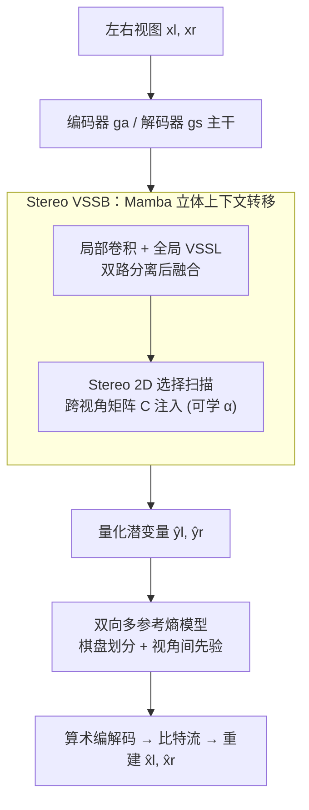

# MambaSIC: Mamba-based Stereo Image Compression with Bi-directional Multi-reference Entropy Model

**会议**: CVPR 2026  
**论文**: [CVF Open Access](https://openaccess.thecvf.com/content/CVPR2026/html/Qin_MambaSIC_Mamba-based_Stereo_Image_Compression_with_Bi-directional_Multi-reference_Entropy_Model_CVPR_2026_paper.html)  
**代码**: 无（论文未公开链接）  
**领域**: 模型压缩 / 图像压缩 / 状态空间模型  
**关键词**: 立体图像压缩、Mamba、视觉状态空间、棋盘熵模型、视角间冗余

## 一句话总结
MambaSIC 用线性复杂度的 Mamba 视觉状态空间块（Stereo VSSB）替代立体图像压缩中昂贵的交叉注意力来传递视角间上下文，并配上一个棋盘划分的双向多参考熵模型替代逐空间自回归，使得在 InStereo2K / Cityscapes 上既刷新率失真性能（BD-PSNR 提升），又把编解码延迟压到 1.26s（比 SOTA 的 BiSIC 快约 62×）。

## 研究背景与动机
**领域现状**：立体图像压缩（Stereo Image Compression, SIC）要联合压缩同一场景左右两个视角的图像对，关键是利用两视角之间强烈的内容冗余（inter-view redundancy）做到比逐视角独立压缩更高的编码效率。近期 SOTA（BiSIC、CAMSIC、LDMIC 等）走的是"**交叉注意力**消除视角间冗余 + **空间自回归熵模型**精确估计概率分布"这一路线，率失真性能很强。

**现有痛点**：这条路线慢得离谱。交叉注意力的复杂度对图像分辨率是二次的（quadratic），而空间自回归熵模型要逐空间位置串行迭代解码——两者叠加导致编解码动辄几十秒（BiSIC 总延迟 78.6s），完全无法用于实时或大规模场景。

**核心矛盾**：压缩性能与编码速度之间的尖锐 trade-off。要全局建模视角间长程依赖就得用注意力（慢），要精确熵估计就得用自回归（更慢）；现有方法是用速度换性能。

**本文目标**：拆成两个子问题——(1) 用什么算子既能高效捕获视角间长程依赖、又不付二次复杂度？(2) 用什么熵模型既能引入视角间先验、又不付逐空间自回归的串行代价？

**切入角度**：作者注意到 Mamba（视觉状态空间模型）在视觉任务上的全局建模能力比注意力更强、却保持**线性复杂度**，是天然的替代候选。但原版 Mamba 只能扫单张图像，无法捕获两视角间的相关性，局部建模也弱——所以不能直接拿来用。

**核心 idea**：把 Mamba 的状态空间扫描改造成"立体"版本——在选择性扫描的输出矩阵 $C$ 里注入另一视角的控制信息，让左右视角在 SSM 内部互相传递上下文；并用同一个立体块去生成熵模型的视角间先验，再叠加棋盘划分把熵编码并行化。

## 方法详解

### 整体框架
MambaSIC 整体仍是端到端学习式压缩器：编码器 $g_a$ 把立体图像对 $x_l, x_r \in \mathbb{R}^{3\times H\times W}$ 变换为潜变量 $y_l, y_r \in \mathbb{R}^{M\times \frac{H}{16}\times \frac{W}{16}}$，量化为 $\hat{y}_l, \hat{y}_r$，由熵模型估计分布后算术编码成比特流，解码器 $g_s$ 重建 $\hat{x}_l, \hat{x}_r$。训练时量化不可导，用混合量化（加均匀噪声估码率、round + 直通梯度做重建）。

真正的创新在两处替换：① 编/解码器主干里，在前三个下采样 / 上采样块后插入 **Stereo VSSB** 作为非线性变换，用它替代以往的 2D/3D 卷积或交叉注意力来消除视角间冗余；② 熵模型用 **双向多参考熵模型**，内部又复用 Stereo VSSB 来融合左右先验。Stereo VSSB 自身又由"局部卷积 + 全局 Stereo VSSL，而 VSSL 核心是 Stereo 2D 选择扫描"层层嵌套构成。整条 pipeline 全程双向对称，避免左右视角重建质量失衡。

### 关键设计

**1. Stereo VSSB：局部卷积与全局状态空间双路传递视角间上下文**

针对"注意力二次复杂度太慢、原版 Mamba 又无法跨视角且局部建模弱"这个痛点，作者设计了立体视觉状态空间块（Stereo VSSB）。输入立体特征 $f_l, f_r \in \mathbb{R}^{N\times H_f\times W_f}$ 先过 $1\times1$ 卷积，再沿通道劈成局部分量 $f^{Local}$ 与全局分量 $f^{Global}$ 各一半。局部分量走 CNN（卷积 + LeakyReLU 的 CLR 网络）做近邻纹理传递，并把对侧视角的局部特征 concat 进来：$\hat{f}^{Local}_l = \mathrm{CLR}(\mathrm{Cat}(f^{Local}_l, f^{Local}_r)) + f^{Local}_l$；全局分量送进 Stereo VSSL（下一个设计）。最后把局部、全局两路 concat 后 $1\times1$ 卷积融合，并对输入做残差连接。这样设计的好处是用卷积补 Mamba 不擅长的局部建模、用状态空间补卷积缺的长程依赖，二者互补且整体保持线性复杂度。Stereo VSSB 只插在编/解码器各自前三个采样块之后，保证多尺度下左右信息互补融合。

**2. Stereo 2D 选择扫描：在输出矩阵 C 中注入对侧视角控制信息**

这是把单视角 Mamba 升级为"立体"的核心机关。在选择性状态空间里，输入相关的参数矩阵 $C$ 负责把隐状态 $h_t$ 映射到输出、动态决定放大/抑制哪些特征。作者按 VMamba 的四方向扫描把全局特征展平成一维序列后，先按常规 SSM 递推得到隐状态 $h^l_t = A'_l h^l_{t-1} + B'_l w^l_t$，关键一步是输出时把**对侧视角的控制矩阵**加权进来：

$$v^l_t = (C_l + \alpha C_r)\,h^l_t + D_l w^l_t,\qquad v^r_t = (C_r + \alpha C_l)\,h^r_t + D_r w^r_t,$$

其中 $\alpha$ 是初值为 0 的可学习标量，让模型自行决定从对侧引入多少信息。把跨视角交互放在 $C$（而非 $B$、$\Delta$ 或输出 $v$）上是经过消融验证的——因为 $C$ 在状态方程里最靠近输出端、对最终结果影响最大。这一招以"可忽略的计算与存储开销"显式引入视角间信息。此外 VSSL 内还有 stereo gating 机制：主分支经 2DSS 后与门控分支（SiLU 激活当作空间重要性图）相乘，区分"本视角需强化的信息"$\hat{f}_{l\to l}$ 与"来自对侧、匹配当前视角的信息"$\hat{f}_{r\to l}$。

**3. 双向多参考熵模型：棋盘划分并行化 + Stereo VSSB 生成视角间先验**

为摆脱空间自回归的逐位置串行，作者采用棋盘（checkerboard）模式把潜变量划成锚点（anchor）/非锚点（non-anchor）两组，锚点先编、非锚点再以锚点为条件编，从而把空间维度的自回归压成两步，大幅提速。但单纯把单目棋盘熵模型搬过来只有视角内先验、忽略了 SIC 最关键的视角间依赖。作者的做法是：先用 [20] 的网络生成一系列**视角内先验**（超先验 $\Phi^h$、通道自回归先验 $\Phi^{ch}$、局部/全局空间上下文 $\Phi^{lc},\Phi^{tra},\Phi^{ter}$），再把左右两视角对应的先验 concat 后送进 **Stereo VSSB** $V$ 函数生成**视角间先验** $\Phi^{iac}, \Phi^{ina}$：$\Phi^{iac}_{l,i}, \Phi^{iac}_{r,i} = V^{ac}_i(\Phi^{ac}_{l,i}, \Phi^{ac}_{r,i})$。最终用视角内 + 视角间先验共同估计高斯分布参数 $(\mu, \sigma)$。整个流程全双向对称，使左右重建质量一致；既靠棋盘换来速度、又靠 Stereo VSSB 换来更准的概率估计。

### 损失函数 / 训练策略
标准率失真（RD）优化：$L = \frac{1}{2}\sum_{l,r}\big(\lambda\cdot D(x_i, \hat{x}_i) + R(\hat{y}_i) + R(\hat{z}_i)\big)$，$\lambda$ 控制码率-失真权衡，$D$ 用 MSE 或 MS-SSIM，$R$ 是熵估计的 bpp（锚点 + 非锚点逐 slice 求和）。通道 $N=128$、$M=320$，Stereo VSSB 数量 $(1,1,1)$；Adam 训练 2M 步（lr 1e-4）后逐步降到 1e-5、1e-6；MSE 与 MS-SSIM 各用一组 $\lambda$ 网格覆盖多码率点。

## 实验关键数据

### 主实验
数据集 InStereo2K 与 Cityscapes，对比手工标准（BPG、MV-HEVC、VVC）与学习式方法（HESIC+、SASIC、BCSIC、LDMIC、ECSIC、DispSIC、BiSIC、CAMSIC）。下表为相对 BPG 的 BD-PSNR（越高越好）与 BDBR（码率节省，越负越好），节选代表方法：

| 方法 | InStereo2K BD-PSNR↑ | InStereo2K BDBR↓ | Cityscapes BD-PSNR↑ | Cityscapes BDBR↓ |
|------|------|------|------|------|
| BiSIC | 1.63dB | -48.07% | 3.34dB | -57.49% |
| CAMSIC | 1.46dB | -45.92% | 2.28dB | -47.89% |
| ECSIC | 1.38dB | -43.71% | 2.84dB | -52.06% |
| **MambaSIC** | **1.92dB** | **-57.15%** | **3.75dB** | **-66.43%** |

> 注：BD-PSNR / BDBR 是率失真曲线积分得到的综合指标——BD-PSNR 表示同码率下平均 PSNR 增益，BDBR 表示同质量下相对基准（这里是 BPG）的平均码率节省。MambaSIC 在两数据集、PSNR 与 MS-SSIM 四个口径上均为最优；相对双向编解码器（BCSIC、BiSIC）还能再省约 9.08%~15.93% 码率。

编解码延迟（InStereo2K，单张 RTX 3090）：

| 方法 | 编码(s)↓ | 解码(s)↓ | 总计(s)↓ |
|------|------|------|------|
| BiSIC | 32.82 | 45.79 | 78.61 |
| LDMIC | 11.38 | 27.85 | 39.23 |
| ECSIC | 5.71 | 5.31 | 11.02 |
| CAMSIC | 0.94 | 0.81 | 1.75 |
| **MambaSIC** | **0.61** | **0.66** | **1.26** |

MambaSIC 是最快的，比 SOTA 的 BiSIC 快约 62×——核心来自棋盘上下文替代空间自回归，简化了潜变量内部的依赖结构。

### 消融实验
组件消融（以 Ours 为锚点，数值为 BDBR 上升即变差，InStereo2K / Cityscapes）：

| 配置 | BDBR 变化 | 说明 |
|------|---------|------|
| Ours（完整） | 0% / 0% | — |
| w/o 跨视角矩阵 αC | +3.86% / +3.19% | 去掉 Stereo 2DSS 的跨视角注入 |
| w/o stereo gating | +6.98% / +7.64% | 去掉立体门控连接 |
| w 单视角 VSSB | +10.13% / +12.67% | 整块退化为单视角 |
| w/o 视角间先验 | +11.67% / +13.01% | 熵模型退回 MLIC++（无视角间） |
| w/ BiSIC Mutual Attention | +13.59% / +15.74% | 用 BiSIC 的互注意力替换 Stereo VSSB |

跨视角矩阵选择消融（BD-PSNR，C 为锚点）：把跨视角信息注入 $C$ 最优；注入 $B$ 掉 -0.058/-0.091dB，注入 $\Delta$ 掉 -0.100/-0.114dB，注入输出 $v$ 掉 -0.107/-0.012dB——验证了把交互放在最靠近输出端的 $C$ 上最有效。

### 关键发现
- **视角间先验贡献最大**：去掉后 BDBR 上升 11.67%/13.01%，是单组件里掉点最多的之一，说明熵模型里融合左右先验是性能主来源。
- **熵模型决定速度**：把熵模型换成 BiSIC 的（V2）延迟从 1.26s 暴涨到 75.19s，证明棋盘并行化是提速的关键开关，而非 backbone。
- **C 矩阵位置敏感**：跨视角信息只有注入 $C$ 才最优，注入 $B/\Delta/v$ 均明显变差——这是一个不直观但可复用的设计经验。

## 亮点与洞察
- **把"立体"塞进 SSM 内部而非外部对齐**：以往方法靠卷积/注意力在特征层做视角对齐，MambaSIC 直接在选择性扫描的 $C$ 矩阵里加权对侧控制信息，开销可忽略却效果最好——这是一个把任务结构融进算子内部的范例。
- **一块两用**：同一个 Stereo VSSB 既当编解码主干的非线性变换、又当熵模型里生成视角间先验的融合器，复用度高、设计简洁。
- **速度和性能同时拿下**：通常压缩里两者要权衡，这里靠"线性复杂度算子 + 棋盘并行熵模型"两个正交改进同时改善，思路可迁移到视频/多视角压缩。

## 局限与展望
- 论文未公开代码链接，复现门槛较高（⚠️ 以原文为准，可能后续补充）。
- 仅在 InStereo2K、Cityscapes 两个立体数据集上验证，未涉及更一般的多视角（>2 视角）压缩；其"双视角对称"设计能否直接扩展到 N 视角并不显然。
- 可学习 $\alpha$ 初值设 0、靠训练学跨视角权重，对极端视差/弱重叠场景的鲁棒性未做专门分析。
- 延迟仍含算术编解码本身的开销，1.26s 距离严格实时（视频帧率）仍有差距。

## 相关工作与启发
- **vs BiSIC/CAMSIC（交叉注意力 + 空间自回归）**: 它们靠注意力做视角间建模、自回归做熵估计，性能强但二次复杂度 + 串行迭代导致极慢；MambaSIC 用线性 Mamba + 棋盘并行，既更准又快约 62×。
- **vs 单目棋盘熵模型（MLIC++ 等）**: 单目棋盘只有视角内先验，直接用于 SIC 会忽略视角间依赖；MambaSIC 用 Stereo VSSB 补上视角间先验，BDBR 再降约 13%。
- **vs 传统 MVC / MV-HEVC**: 手工视差补偿在复杂场景下难以捕获精细视角相关性；学习式 + SSM 全局建模显著占优。

## 评分
- 新颖性: ⭐⭐⭐⭐ 把 Mamba 改造成跨视角（C 矩阵注入）+ 棋盘熵模型融合，方向新但属于"已有组件的巧妙组合与迁移"。
- 实验充分度: ⭐⭐⭐⭐ 两数据集、四指标、延迟与多组消融齐全；但仅双视角、缺代码与更大规模验证。
- 写作质量: ⭐⭐⭐⭐ 结构清晰、公式与图配合到位，符号略密集。
- 价值: ⭐⭐⭐⭐ 在 SIC 上同时拿下性能与速度，对实时立体压缩有实际意义。

<!-- RELATED:START -->

## 相关论文

- [\[CVPR 2026\] FreqSIC: Frequency-aware Stereo Image Compression with Bi-directional Checkerboard Context Model](freqsic_frequency-aware_stereo_image_compression_with_bi-directional_checkerboar.md)
- [\[ECCV 2024\] Bidirectional Stereo Image Compression with Cross-Dimensional Entropy Model](../../ECCV2024/model_compression/bidirectional_stereo_image_compression_with_cross-dimensional_entropy_model.md)
- [\[CVPR 2026\] Parallax to Align Them All: An OmniParallax Attention Mechanism for Distributed Multi-View Image Compression](parallax_to_align_them_all_an_omniparallax_attention_mechanism_for_distributed_m.md)
- [\[CVPR 2026\] CADC: Content Adaptive Diffusion-Based Generative Image Compression](cadc_content_adaptive_diffusion-based_generative_image_compression.md)
- [\[CVPR 2026\] Block-based Learned Image Compression without Blocking Artifacts](block-based_learned_image_compression_without_blocking_artifacts.md)

<!-- RELATED:END -->
