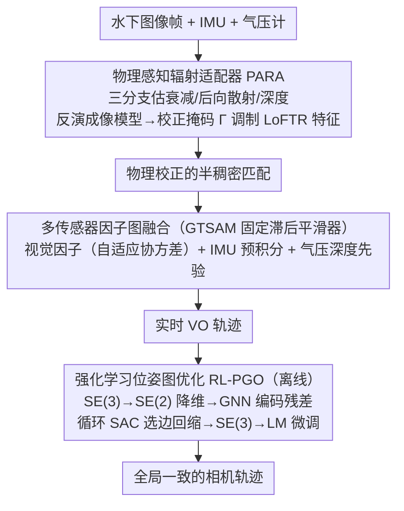

# MARVO: Marine-Adaptive Radiance-aware Visual Odometry

**会议**: CVPR 2026  
**arXiv**: [2511.22860](https://arxiv.org/abs/2511.22860)  
**代码**: 无  
**领域**: 模型压缩  
**关键词**: 水下视觉里程计, 物理感知特征匹配, 因子图优化, 强化学习位姿图优化, 多传感器融合  

## 一句话总结

提出 MARVO 水下视觉里程计框架，将物理感知辐射适配器 (PARA) 嵌入 LoFTR 特征匹配器补偿水下波长衰减、结合 GTSAM 多传感器因子图融合和强化学习位姿图优化 (RL-PGO)，在水下场景实现鲁棒定位。

## 研究背景与动机

水下视觉定位面临独特挑战：光散射、**波长依赖的衰减**和强非高斯噪声导致严重对比度损失、不稳定特征和长期位姿估计不一致。传统 VO/SLAM 在水下失败的两层原因：

**感知层面**：未校正水下图像形成的物理过程（颜色通道衰减、后向散射），特征描述子在浑浊区域失效。标准 LoFTR 在光谱退化区域匹配质量大幅下降

**优化层面**：标准最小二乘求解器（Gauss-Newton/LM）在高噪声、视觉退化轨迹上陷入局部最优，尤其回环约束稀疏时

MARVO 核心理念：鲁棒水下 VO 需同时具备 (i) 显式补偿辐射畸变的感知模块和 (ii) 能逃离局部最优的全局优化器。

## 方法详解

### 整体框架

MARVO 要在浑浊、衰减严重的水下场景里做出鲁棒的相机位姿估计，它的思路是「感知端先把水下物理退化补回来，优化端再有能力跳出局部最优」。一帧图像进入系统后走三段：前端用嵌了物理校正模块（PARA）的 LoFTR 做特征匹配，吐出物理校正过的半稠密对应点；后端把这些视觉约束连同 IMU、气压计的约束塞进 GTSAM 因子图，实时解算出 VO 轨迹；离线再用一个强化学习位姿图优化器（RL-PGO）在 SE(2) 上对整条轨迹做全局精化，纠正长期累积的漂移。三段各自针对水下 VO 失败的一个环节，前端管「特征在浑水里还认得出」，后端管「多源约束怎么融」，离线管「稀疏回环下怎么不卡在局部最优」。

### 关键设计

**1. 物理感知辐射适配器 PARA：把水下成像模型直接嵌进特征管线，而不是先美化图像再匹配**

水下图像的对比度损失来自波长相关的衰减和后向散射，标准 LoFTR 的描述子在这些光谱退化区域会大幅失效。PARA 不走「先做图像增强、再喂给匹配器」的两段式，而是在 LoFTR 的 CNN 编码器和 Transformer 层之间插一个轻量模块，让物理校正发生在特征空间，从而保持端到端可微。它依据的是修正后的水下成像模型

$$I_c(x) = J_c(x) e^{-\beta_c(x)z(x)} + B_\infty^c(x)(1 - e^{-\beta_c(x)z(x)})$$

其中 $J_c$ 是无退化的真实辐射、$\beta_c$ 是衰减系数、$B_\infty^c$ 是渐近后向散射。PARA 用一个三分支头从共享特征里逐像素估计衰减 $\hat{\boldsymbol{\beta}} \in \mathbb{R}^{H \times W \times 3}$、后向散射 $\hat{\mathbf{B}}_\infty \in \mathbb{R}^{H \times W \times 3}$ 和深度代理 $\hat{\mathbf{z}} \in \mathbb{R}^{H \times W \times 1}$，反演上面这个模型得到校正后的辐射估计 $\hat{J}_c$，再压成一张逐像素的标量校正掩码

$$\Gamma(x) = \frac{1}{3}\sum_{c \in \{R,G,B\}} \frac{\hat{J}_c(x)}{I_c(x) + \epsilon}$$

这张掩码逐元素乘回编码器特征并做层归一化：$\tilde{\mathbf{F}}(x) = \text{LN}(\Gamma(x) \odot \mathbf{F}(x))$。整个模块只增加不到 5% 参数，但描述子在浑浊区域的一致性显著改善。关键不在于「多了个 CNN 调制」，而在于这个调制受真实物理参数监督——消融里把物理监督换成纯 CNN 调制，鲁棒性就掉下来，说明起作用的是物理先验而非单纯多堆了层。

**2. 多传感器因子图融合：用自适应协方差让系统在退化帧自动改信惯性和气压**

单目水下 VO 既缺尺度、又有垂直漂移，光靠视觉撑不住。MARVO 在 GTSAM 里搭一个固定滞后平滑器，把三类约束塞进同一张因子图联合求解。IMU 预积分因子用标准 GTSAM 做法提供尺度和短期运动；MARVO 视觉因子从 PARA-LoFTR 的半稠密匹配估出相对位姿，它的协方差与内点数和空间覆盖度成反比，于是可见度高的帧权重大、自动主导优化，而视觉退化的帧权重被自动压低；气压深度先验则是一个一元因子，直接钉住每帧的深度。这里的巧思是气压传感器成本极低，却能完全消掉单目水下 VO 最头疼的垂直漂移；而自适应协方差让整套系统在某帧视觉崩坏时，无需人工切换就自动退回去依赖惯性和气压约束。

**3. 强化学习位姿图优化 RL-PGO：把位姿图优化当成 SE(2) 上的序贯决策，跳出经典最小二乘的局部最优**

水下视觉退化会让经典 PGO 拿到很差的初始化，Gauss-Newton/LM 这类最小二乘求解器一旦陷进局部最优就出不来，回环约束稀疏时尤其严重。RL-PGO 离线用一个 RL 策略来精化位姿图：先利用 AUV/ROV 的运动学先验把 SE(3) 投影到 SE(2)——横滚俯仰本就被载体稳定、深度已由气压钉死、偏航才是主要旋转自由度，于是 6-DoF 降到 3-DoF，搜索空间大幅收窄。一个 GNN 编码器聚合所有边的残差生成状态表示，循环 SAC 智能体据此选择要调整的边并输出 SE(2) 上的回缩动作，精化完再重新嵌回 SE(3)，最后用一次 LM 快速微调收尾。它优化的目标是一个对数加权的方向代价

$$OC_{\text{log}} = \sqrt{\sum_{(i,j) \in E} w_{ij} \|R_i R_{ij} - R_j\|_F^2}, \qquad w_{ij} = 1 + \beta \log\left(\frac{\|\mathbf{t}_{ij}\|}{\bar{t}} + \epsilon\right)$$

权重对平移距离取对数，这种亚线性增长让长距离约束被适度强调、却不至于被个别极长的噪声边主导整个代价；$\beta=0$ 时退化为均匀加权。

### 损失函数 / 训练策略

前端联合损失：$\mathcal{L} = \lambda_{\text{match}}\mathcal{L}_{\text{match}} + \lambda_{\text{photo}}\mathcal{L}_{\text{photo}} + \lambda_{\text{phys}}\mathcal{L}_{\text{phys}}$

- $\mathcal{L}_{\text{match}} = \|\hat{\mathbf{P}} - \mathbf{P}^*\|_1$：匹配点几何一致性
- $\mathcal{L}_{\text{photo}} = 1 - \text{SSIM}(I'_A, I'_B)$：辐射校正后视图一致性
- $\mathcal{L}_{\text{phys}} = \|\hat{\boldsymbol{\beta}} - \boldsymbol{\beta}_{\text{gt}}\|_1 + \|\hat{\mathbf{B}}_\infty - \mathbf{B}_{\infty,\text{gt}}\|_1$：物理参数 L1 监督

两阶段训练：~12 万合成水下对（ScanNet/TartanAir/Hypersim 经 SyreaNet 渲染）预训练 → ~1.2 万真实帧（10% KITTI + 内部数据）微调。4×A100 混合精度。

## 实验关键数据

### 主实验

真实水下 VO 性能（Scale Aligned）:

| 方法 | ATE (m)↓ | RPE (deg/m)↓ | Drift (%)↓ |
|------|---------|-------------|-----------|
| ORB-SLAM3 | 4.12 | 0.92 | 3.8 |
| LIBVISO2 | 3.47 | 0.85 | 3.1 |
| MAST3R-SLAM | 2.52 | 0.58 | 2.2 |
| VGGT-SLAM | 2.41 | 0.56 | 2.1 |
| **MARVO (Ours)** | **1.73** | **0.34** | **1.2** |

合成水下特征匹配 (Pose AUC):

| 方法 | @5° | @10° | @20° |
|------|-----|------|------|
| SP+SuperGlue | 25.4 | 42.2 | 59.7 |
| LoFTR | 42.9 | 59.5 | 68.2 |
| **MARVO** | **49.7** | **62.9** | **71.3** |

### 消融实验

| 配置 | AUC @10°↑ | ATE (m)↓ | Drift (%)↓ |
|------|----------|---------|-----------|
| Full MARVO | **0.92** | **1.73** | **1.2** |
| 无 PARA 模块 | 0.81 | 2.24 | 1.9 |
| 替换为原始 LoFTR | 0.76 | 2.47 | 2.3 |
| 经典 PGO 替代 RL-PGO | 0.84 | 2.05 | 1.7 |
| 无物理辐射归一化 | 0.73 | 2.68 | 2.6 |

### 关键发现

1. **物理辐射归一化是核心**：去掉后 AUC 降至 0.73 (降幅最大)，证明物理监督而非 CNN 调制是关键
2. 相比 ORB-SLAM3 ATE 降低 58%，漂移降低 68%
3. RL-PGO 将经典 PGO 的 ATE 从 2.05m 降至 1.73m，回环稀疏场景尤为有效
4. 即使对比最新 VGGT-SLAM，ATE 仍降低 28%，Drift 降低 43%

## 亮点与洞察

1. **物理模型直接嵌入深度学习管线**：PARA 在特征空间而非图像空间做物理校正，保留了端到端可微性
2. **气压深度先验**设计巧妙：成本极低的一元因子即可完全消除垂直漂移
3. **SE(2) 降维 RL-PGO** 巧妙利用 AUV/ROV 运动学约束，将 6-DoF 降为 3-DoF
4. 自适应协方差让系统在视觉退化时自动依赖惯性/气压约束

## 局限与展望

1. **缺乏标准水下 VO 数据集**：评估依赖合成渲染和 COLMAP 对齐，统计显著性不足
2. 合成到真实域差距仅靠 10% 真实数据微调，鲁棒性保证有限
3. RL-PGO 仅在 SE(2) 操作，横滚/俯仰耦合假设在某些 AUV 上不成立
4. 未集成 3D 建图（TSDF/MVS），缺少实时性指标（帧率/延迟）
5. 实验规模小，未见大规模多序列长时间评估

## 评分

- **新颖性**: ⭐⭐⭐⭐ — 物理模型与 Transformer 匹配结合是清晰创新，RL-PGO 水下适配有新意
- **实验**: ⭐⭐⭐ — 受限于水下数据集缺乏，实验规模小，缺少误差 bar 和多序列统计
- **写作**: ⭐⭐⭐⭐ — 方法描述详尽，系统设计逻辑清晰，公式推导完整
- **价值**: ⭐⭐⭐⭐ — 对水下机器人有直接应用价值，物理感知思路可推广至雾/雨/夜间定位

<!-- RELATED:START -->

## 相关论文

- [\[CVPR 2026\] One Layer's Trash is Another Layer's Treasure: Adaptive Layer-wise Visual Token Selection in LVLMs](one_layers_trash_is_another_layers_treasure_adaptive_layer-wise_visual_token_sel.md)
- [\[ICLR 2026\] AgilePruner: An Empirical Study of Attention and Diversity for Adaptive Visual Token Pruning in LVLMs](../../ICLR2026/model_compression/agilepruner_an_empirical_study_of_attention_and_diversity_for_adaptive_visual_to.md)
- [\[CVPR 2026\] Quant Experts: Token-aware Adaptive Error Reconstruction with Mixture of Experts for Large Vision-Language Models Quantization](quant_experts_token_aware_vlm_quantization.md)
- [\[CVPR 2026\] Progressive Supernet Training for Efficient Visual Autoregressive Modeling](progressive_supernet_training_for_efficient_visual_autoregressive_modeling.md)
- [\[ACL 2026\] SAMoRA: Semantic-Aware Mixture of LoRA Experts for Task-Adaptive Learning](../../ACL2026/model_compression/samora_semantic-aware_mixture_of_lora_experts_for_task-adaptive_learning.md)

<!-- RELATED:END -->
