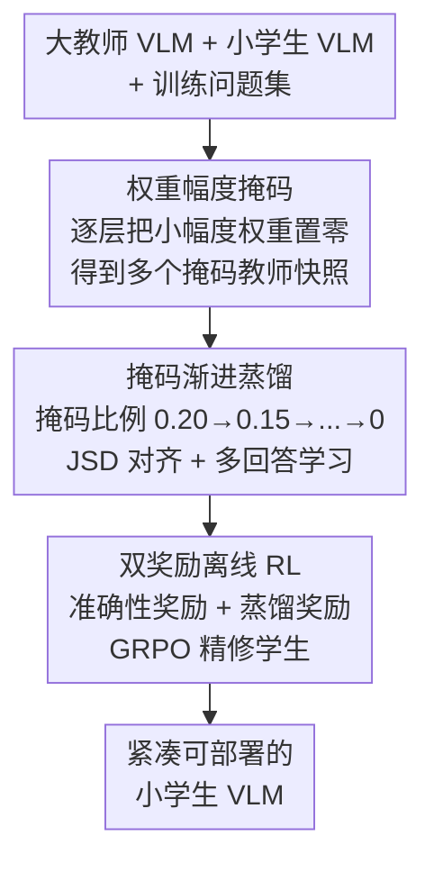

# Masking Teacher and Reinforcing Student for Distilling Vision-Language Models

**会议**: CVPR 2026  
**论文**: [CVF Open Access](https://openaccess.thecvf.com/content/CVPR2026/html/Lee_Masking_Teacher_and_Reinforcing_Student_for_Distilling_Vision-Language_Models_CVPR_2026_paper.html)  
**代码**: 待确认  
**领域**: 模型压缩 / 多模态VLM  
**关键词**: 知识蒸馏, 视觉语言模型, 权重掩码, 渐进式蒸馏, 离线强化学习

## 一句话总结
Masters 通过"先把大教师按权重幅度掩码、再随训练逐步解掩还原满血"的渐进策略缩小师生容量鸿沟，并叠加一个用准确性奖励 + 蒸馏可迁移性奖励驱动的离线 RL，让小学生 VLM 稳定吸收大教师知识，在 13 个多模态评测上超过同尺寸紧凑模型、部分超过大模型。

## 研究背景与动机
**领域现状**：大规模视觉语言模型（VLM）在多模态理解、推理、开放问答上接近人类水平，但动辄几十 B 参数，难以部署到手机 / 边缘设备。把大教师的知识蒸馏给小学生，是造"小而强"VLM 的主流路线。

**现有痛点**：师生之间存在巨大的参数 / 容量鸿沟（如 38B 教师 vs 8B 学生）。学生根本复现不了教师那套高维复杂表征，导致训练不稳、掉点严重。已有蒸馏工作大多在改训练目标、做中间层 / 注意力对齐、多步蒸馏、或上 RL，**很少有人直接去缩小"鸿沟"本身**。

**核心矛盾**：教师之所以难蒸，根本原因是它参数太多、表征太复杂，学生一口吞不下。同时常规 SFT 数据的答案标签往往由 GPT-4o / Gemini / Claude 这类超大闭源模型生成，措辞和推理风格对小学生而言"过于丰富"，超出其小词表、低隐藏维度的承载力，硬塞反而掉点；且每题只有单条答案，限制了多样性。

**本文目标**：① 直接把师生容量鸿沟降下来，让学生循序渐进地学；② 摆脱单条、过丰富的 SFT 标签约束；③ 进一步剔除生成回答里"事实错"或"语言太绕、难迁移"的样本。

**切入角度**：作者从经典网络剪枝得到启发——既然小幅度权重对教师 logits 贡献甚微，那就先把它们临时掩掉，得到一个"简化版教师"让学生先学粗粒度，再随训练把这些权重慢慢还原，逐步提升教师容量。掩码是**临时的、会被还原的**，区别于以压缩为目的的永久剪枝。

**核心 idea**：用"掩码 + 渐进解掩"动态对齐师生容量，再用"离线双奖励 RL"精修知识迁移——把权重掩码、渐进蒸馏、多回答学习、离线 RL 统一进一个训练范式。

## 方法详解

### 整体框架
Masters 输入是一对同家族的大教师 + 小学生 VLM 及训练问题集，输出是一个经过渐进蒸馏 + RL 精修的小学生模型。整条管线分三步串行：先按权重幅度对教师做**逐层掩码**得到一系列掩码比例递减的教师快照；再以**掩码比例从 0.20 递减到 0**的方式渐进还原教师、用 JSD 蒸馏让学生跟着学，并用掩码教师与学生各自预生成的多条回答替代单条 SFT 标签；最后用**离线 RL**，以准确性奖励 + 蒸馏可迁移性奖励两路信号把学生往"既正确又好迁移"的回答上推。

### 关键设计

**1. 权重幅度掩码：先把教师"瘦身"到学生学得动**

针对"教师参数太多、师生鸿沟太大"这个根因，作者对教师 $T$ 的权重 $W_T=\{w_n\}_{n=1}^N$ 构造一个二值掩码：当 $|w_n|\geq\lambda_r$ 时 $m_n=1$，否则 $m_n=0$，掩码后教师为 $W_{T_r}=M_r\odot W_T$。其中掩码比例 $r\in[0,1]$ 决定阈值 $\lambda_r$（$r=0.2$ 即把约 20% 最小幅度的权重置零，$r=0$ 是原始教师，$r=1$ 全掩）。这一步借鉴经典剪枝思路——小幅度权重对 logits 贡献小，掩掉它们既缩小了师生容量差，又滤掉了妨碍稳定迁移的噪声 / 过参数化成分。关键工程细节：若用全局阈值 $\lambda_r$，某些层会被过度剪导致推理时失效，因此作者**逐层计算 $\lambda_r$、逐层施掩**，保证整体掩码均衡。与永久剪枝最大的不同是，这里的掩码是临时的，后续会被还原。

**2. 掩码渐进蒸馏：让容量随训练"由浅入深"逐步还原**

只用固定掩码比例会限制学生接触教师的丰富表征，于是作者让掩码比例随训练单调递减、逐步还原教师满血。第 $i$ 次迭代的掩码比例为 $r[i]=r_{\max}-s\cdot\lfloor i\times M/I\rfloor$，其中 $s$ 是每阶段递减量、$M=r_{\max}/s+1$ 是掩码教师总数（如 $r_{\max}=0.2,s=0.05$ 得 $M=5$，比例依次 0.20、0.15、0.10、0.05、0）。蒸馏目标用 Jensen-Shannon 散度（JSD，经验上比 KL 更适合蒸馏）对齐师生 logit-softmax 输出：$\min_{W_S}\mathbb{E}\,[D(P_{T_{r[i]}}(y|x)\,\|\,P_S(y|x))]$。这样学生先学粗粒度模式、再随教师容量恢复细化到高层表征，优化更平滑、避免直接从大教师蒸馏的不稳定。此外，为摆脱"单条 + 过丰富"SFT 标签的约束，作者改用**掩码教师与学生各自预生成的多条回答** $\hat{y}$ 组成 Gen-Data 来蒸馏（公式同上把 $y$ 换成 $\hat{y}$）——既匹配学生当前容量，又把学生自身回答纳入训练以保持师生表征对齐，实现稳定而持续地向教师行为收敛。

**3. 双奖励离线 RL：剔除"错的"和"难迁移的"回答**

多回答里难免有事实错误或语言过于复杂、难以迁移的样本，会拖累蒸馏。作者用 RL 同时评估回答的**正确性**与**可迁移性**并据此精修学生。为避免在线 "think-answer" RL 每步反复生成长回答的高开销，采用**离线 RL**：师生对全部问题预先各生成多条回答（每题 8 条，温度 1.0），离线复用、大幅省算力并支持大规模训练。两路奖励为：准确性奖励 $R_{\text{acc}}=\text{LLM-as-a-Judge}(x,\hat{y},y)\in[0,1]$，用 LLM 评审语义保真度，避免传统 parser 在开放问答（如"about five minutes" vs "5"）上的误判；蒸馏奖励 $R_{\text{distill}}=\frac{D_{\max}-D}{D_{\max}-D_{\min}}$ 对 JSD 散度做**反向 min-max 归一化**（散度越小、与教师越对齐、奖励越高，最高 1.0），并以此放大原本方差很小的散度信号、稳定优化。总奖励为两者之和，最终目标在 GRPO 损失上叠加 Eq.5 的蒸馏项：$\min_{W_S}\mathbb{E}\,[L_{\text{GRPO}}+D(P_{T_{r[i]}}(\hat{y}|x)\|P_S(\hat{y}|x))]$，把强化与蒸馏统一进一个目标。

### 损失函数 / 训练策略
蒸馏目标统一用 JSD（优于 KL）。学生用 AdamW、固定学习率 $1\times10^{-6}$ 优化；RL 用 DeepSpeed ZeRO-3 承载大教师 + 学生。先以 $s=0.05$ 保存 5 个不同掩码比例的教师快照，再让 5 个掩码教师对 1.5M 数据集用 vLLM 快速推理、每题生成 8 条回答（温度 1.0、top-p 0.9、top-k 50、重复惩罚 1.05），同时用 LLM-as-a-Judge 评准确性奖励。训练 / 评测主要在 NVIDIA A100 80GB 上完成。

## 实验关键数据

### 主实验
覆盖 13 个多模态评测（AI2D、ChartQA、MathVista、MMB/MMB_CN、MM-Vet、MMMU、MMMU-Pro、MMStar、BLINK、SEED、SEED2+、RealWorldQA）的平均分。下表展示几个代表性学生在"逐步叠加 Masters 组件"下的平均分提升（"+Large Teacher"为朴素蒸馏，"+Mask-Progressive"为掩码渐进蒸馏，"+Reward Feedback"为再叠加双奖励 RL）：

| 学生模型 | 基线 | +大教师朴素蒸馏 | +掩码渐进蒸馏 | +双奖励 RL（完整 Masters） |
|----------|------|----------------|---------------|----------------------------|
| Qwen2.5-VL-7B | 69.8 | 70.3 | 71.6 | **74.0** |
| Qwen3-VL-8B | 75.7 | 76.9 | 78.4 | **80.4** |
| InternVL3-8B | 71.8 | 72.4 | 73.4 | **76.1** |
| InternVL3.5-8B | 75.4 | 75.8 | 76.3 | **77.1** |

完整 Masters 相对各自基线平均提升约 +1.7 ~ +4.7 个点，且每叠加一个组件都稳定涨点，验证了"掩码渐进 → 双奖励 RL"逐级有效。

### 消融实验
Table 2 进一步对比"只用大教师"与"经过中间尺寸教师过渡（+Mid Teacher）"的差异，并验证渐进式涨教师尺寸优于一次性大教师蒸馏：

| 配置（学生 InternVL3.5-2B） | 平均分 | 说明 |
|------------------------------|--------|------|
| 基线 | 68.6 | 原始学生 |
| +Large Teacher | 69.1 | 一次性从 38B 大教师朴素蒸馏 |
| +Mid Teacher | 70.0 | 经 4B/8B/14B 中间教师过渡 |
| +Mask-Progressive | 71.8 | 叠加掩码渐进蒸馏 |
| +Reward Feedback | **75.1** | 再叠加双奖励 RL（完整） |
| −Mid Teacher | 70.4 | 去掉中间教师过渡后明显回落 |

### 关键发现
- **双奖励 RL（Reward Feedback）贡献最大**：在所有学生上叠加它都带来单步最大涨幅（如 InternVL3.5-2B 从 71.8 → 75.1，+3.3），说明剔除"错 / 难迁移"回答对最终性能至关重要。
- **渐进涨教师尺寸 > 一次性大教师**：从 14B 逐步过渡到 38B 收敛更平滑、泛化更强；去掉中间教师过渡（−Mid Teacher）会让 2B 学生从 75.1 回落到 70.4，揭示了"容量对齐"是稳定蒸馏的关键。
- **ChartQA 等任务涨幅尤其显著**：如 Qwen3-VL-8B 在 ChartQA 上从 88.4 一路涨到 95.9，提示掩码渐进 + RL 对结构化图表理解收益明显。⚠️ 部分数值取自表格密集 OCR，个别小数位以原文为准。

## 亮点与洞察
- **把"剪枝"反过来用作蒸馏调度器**：掩码不是为了压缩教师，而是临时制造一个"容量可调"的教师序列，让学生由浅入深地学——这种"临时掩、渐进还原"的思路新颖且可迁移到其他师生差距大的蒸馏场景。
- **离线 RL 巧解算力瓶颈**：师生预生成多回答、离线复用，绕开在线 think-answer 每步生成长文本的高开销，使 RL 能在 1.5M 级数据上 scale up，这是把 RL 蒸馏做大的实用 trick。
- **蒸馏奖励量化"可迁移性"**：用反向归一化的师生 logit 散度当奖励，直接奖励"学生容易学会的回答"，把"好不好学"显式纳入优化目标，思路可迁移到任何需要衡量知识迁移难度的蒸馏 / 数据筛选任务。

## 局限与展望
- **依赖同家族师生**：教师和学生需来自同一模型族（如 InternVL3.5-38B → 8B），跨架构 / 跨家族蒸馏是否有效未充分验证。
- **流程偏重、超参多**：需保存多个掩码教师快照、预生成海量回答、再跑离线 RL，工程链路长、存储与推理成本不低；掩码比例调度（$r_{\max}$、$s$）等超参对结果敏感。
- **准确性奖励依赖 LLM-as-a-Judge**：评审模型本身的偏差 / 幻觉可能传导进奖励信号，作者用额外 parsing prompt 缓解但未根除。
- **改进方向**：探索跨家族蒸馏、把掩码调度做成自适应（按学生学习曲线动态调比例）、以及更轻量的在线-离线混合 RL。

## 相关工作与启发
- **vs 传统中间层 / 注意力蒸馏**：它们改训练目标或对齐中间特征，但没碰"参数鸿沟"本身；Masters 直接用掩码缩小容量差，从根上缓解学生学不动的问题。
- **vs 永久网络剪枝**：剪枝以压缩教师为目的、不可逆；Masters 的掩码是临时的、会渐进还原，目的是制造容量对齐的"教学梯度"而非压缩。
- **vs 在线 think-answer RL（如 DeepSeek-R1 系）**：它们每步生成长推理链、算力昂贵、可用样本受限；Masters 用离线预生成回答 + 双奖励，既省算力又能放大数据规模，且无需 think-answer 过程。

## 评分
- 新颖性: ⭐⭐⭐⭐⭐ "掩码 + 渐进还原"把剪枝反用作蒸馏容量调度器，配双奖励离线 RL，思路确实新。
- 实验充分度: ⭐⭐⭐⭐ 覆盖多家族学生 / 教师与 13 个评测、逐组件消融充分，但跨家族与机制深析略少。
- 写作质量: ⭐⭐⭐⭐ 动机—方法—实验逻辑清晰，公式与图配合到位。
- 价值: ⭐⭐⭐⭐ 给"造可部署小 VLM"提供了可 scale 的稳定蒸馏范式，工程参考价值高。

<!-- RELATED:START -->

## 相关论文

- [\[CVPR 2026\] Distilling Balanced Knowledge from a Biased Teacher](distilling_balanced_knowledge_from_a_biased_teacher.md)
- [\[CVPR 2026\] Teacher-Guided Routing for Sparse Vision Mixture-of-Experts](teacher-guided_routing_for_sparse_vision_mixture-of-experts.md)
- [\[CVPR 2026\] Hybrid Token Compression for Vision-Language Models](hybrid_token_compression_for_vision-language_models.md)
- [\[CVPR 2026\] Attention-aware Inference Optimizations for Large Vision-Language Models with Memory-efficient Decoding](attention-aware_inference_optimizations_for_large_vision-language_models_with_me.md)
- [\[CVPR 2026\] SCoRe: Salience-Coverage Reduction for Vision Token Pruning in Vision-Language Models](score_salience-coverage_reduction_for_vision_token_pruning_in_vision-language_mo.md)

<!-- RELATED:END -->
