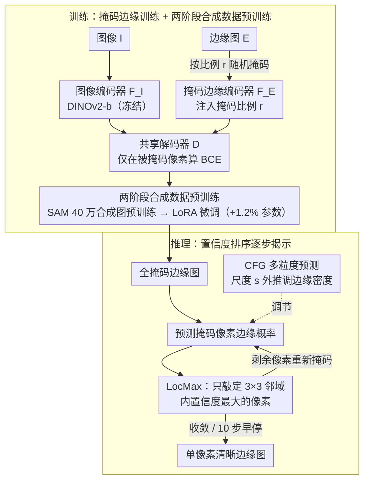

# MEMO: Human-like Crisp Edge Detection Using Masked Edge Prediction

**会议**: CVPR 2026  
**arXiv**: [2603.20782](https://arxiv.org/abs/2603.20782)  
**代码**: [https://github.com/cplusx/MEMO_Edge_Detection](https://github.com/cplusx/MEMO_Edge_Detection)  
**领域**: 模型压缩 / 边缘检测  
**关键词**: 边缘检测, 掩码预测, 置信度排序推理, 多粒度预测, 合成数据预训练

## 一句话总结

提出 MEMO 框架，通过掩码边缘训练和基于置信度排序的渐进式推理策略，仅使用交叉熵损失就能生成清晰的单像素边缘图，在 crispness-aware 评估上大幅超越现有方法（BSDS 上 CEval ODS 从 0.749 提升到 0.836）。

## 研究背景与动机

1. **领域现状**：基于深度学习的边缘检测通常将问题建模为像素级二分类任务，使用交叉熵损失进行优化。主流方法如 HED、RCF、BDCN 等已取得不错的检测精度。

2. **现有痛点**：用交叉熵训练的模型普遍产生"厚边缘"预测——预测的边缘宽度远超人工标注的单像素宽度。现有方法要么设计专门的稀疏损失（如 CATS、CED），要么使用扩散模型（如 DiffEdge），但在 BSDS 等数据集上 crispness 仍低于 50%。

3. **核心矛盾**：多标注者的标签模糊性（同一位置多个标注者给出略有偏移的边缘）导致训练信号"软化"，模型倾向于在边缘附近的多个像素上都给出高概率预测。

4. **本文目标** (a) 不修改损失函数和网络架构的前提下产生清晰边缘；(b) 小数据集上避免过拟合；(c) 推理时支持多粒度边缘预测。

5. **切入角度**：作者观察到**厚边缘预测呈现一个置信度梯度**——中心边缘像素置信度最高，向两侧逐渐衰减。这意味着可以先确定高置信度预测，再逐步处理不确定区域。

6. **核心 idea**：通过掩码训练让模型学会在部分边缘已知时预测剩余边缘，推理时按置信度从高到低逐步"揭示"边缘图，自然实现单像素宽度。

## 方法详解

### 整体框架

MEMO 要解决的核心问题是：在不改损失函数、不改网络结构的前提下，让边缘检测器输出人工标注那样的单像素清晰边缘。它的破局点是把"产生薄边缘"这件事从训练阶段挪到了推理阶段——训练时只教模型"在部分边缘已知时补全剩下的边缘"，推理时再让模型按置信度一点点把边缘图"揭示"出来，每次只敲定最有把握的那批像素，厚边缘自然就被磨成了单像素。

整条管线有三个组件：冻结的图像编码器 $F_I$（DINOv2-b）负责出图像特征，掩码边缘编码器 $F_E$ 把"已知的那部分边缘图"编码进来，共享边缘解码器 $D$ 再融合两者预测被遮挡像素的边缘概率。训练分两阶段：先在 40 万张 SAM 合成的边缘图上预训练 $F_E$ 和 $D$，再用 LoRA 适配器在下游数据集（BSDS 等）上微调，只增加约 1.2% 参数量。推理时则反复跑「预测概率 → LocMax 敲定局部最高置信像素 → 剩余像素重新掩码」这个回环，并可用 CFG 尺度 $s$ 调节边缘密度。

### 关键设计

**1. 掩码边缘训练：把"补全已知边缘"当成预训练任务**

直接用交叉熵端到端训，模型会在真边缘两侧好几个像素上一起给高概率——因为多个标注者的边缘位置略有偏移，监督信号本身就是"糊"的。MEMO 换了个训练目标：每个样本随机抽一个掩码比例 $r \in (0, 1]$，对每个像素独立做伯努利掩码，模型只看到 $1-r$ 比例的真实边缘，去预测被盖住的那部分。掩码比例 $r$ 用正弦位置编码嵌入后注入 $F_E$ 和 $D$ 的每一层，让模型知道当前"已知了多少"。损失只在被掩码的像素上算交叉熵：

$$\mathcal{L} = -\mathbb{E}\Big[\tfrac{1}{r}\sum_i \mathbf{1}[E_r[i]=\text{mask}] \cdot \text{BCE}\Big]$$

这样训出来的模型天生会处理"半成品"边缘图：当它看到附近已经有一条确定的边缘时，就学会抑制周围的冗余激活，而不是把概率摊在一片像素上。这正是推理阶段逐步揭示所需要的能力。

**2. 两阶段合成数据预训练：用 SAM 造数据扛住掩码训练的过拟合**

掩码训练要求模型在掩码比例 $r$ 从接近 0 到 1 的各种水平下都能补全边缘，这把任务难度和样本多样性需求一起抬高了；可边缘检测数据集都很小（BSDS 才 200 张训练图），在上面反复掩码训练极易过拟合。MEMO 的解法是先在大规模合成数据上预训练：用 SAM 在 LAION 图像上自动分割出实例掩码，对每个掩码做形态学腐蚀、再与原掩码相减得到单像素宽的实例边界，把一张图所有实例边界聚合成一张合成边缘图，共造 40 万对图像-边缘。预训练时冻结图像编码器 $F_I$，只训 $F_E$ 和 $D$；之后在每个下游数据集上用 LoRA 适配器微调，仅新增约 1.2% 参数。合成边缘天生是单像素的，给了模型"一条边只占一个像素"的先验偏置——消融显示去掉它会出现边缘重复伪影，所以它和 LocMax 一样，是单像素清晰边缘能成立的另一半基础。

**3. 置信度排序推理 + LocMax：每个小邻域只敲定一个像素**

有了补全能力还不够——如果推理时一口气把所有高置信像素都确认下来，空间上挨着的几个高置信像素会被同时锁定，又变回厚边缘簇。LocMax 的做法是每一步预测所有掩码像素的边缘概率后，只确认那些"在自己 $3\times 3$ 邻域里置信度最高"的像素：像素 $i$ 被敲定当且仅当 $c_i = \max(p_i, 1-p_i)$ 是其 $3\times 3$ 邻域中的最大值，剩下没敲定的像素重新掩码、进入下一轮。

这恰好利用了作者观察到的现象——厚边缘预测呈现一个置信度梯度，中心边缘像素最高、向两侧衰减。LocMax 等于在每个局部窗口里只保留那个"梯度顶点"，于是一条边在垂直方向上只会留下一个像素，单像素宽度是被这个选择规则逼出来的，而不是靠损失约束。它还天然收敛：每轮至少敲定一个像素，掩码像素数单调递减，迭代必然停止。

**4. Classifier-Free Guidance 改造的多粒度预测：一个参数调边缘密度**

边缘的"粗细/密度"本来需要多粒度标注才能控制（如 MuGE）。MEMO 借了扩散模型 classifier-free guidance 的思路：训练时以 10% 概率把图像输入换成零张量，让模型同时学会"有条件"和"无条件"预测。推理时把两者外推：

$$p(E\mid I, E_r) = \text{Sigmoid}\big(s \cdot D_{\text{cond}} + (1-s) \cdot D_{\text{uncond}}\big)$$

粒度尺度 $s \ge 1$，$s=1$ 是标准推理，$s$ 越大边缘越密。整个过程不需要任何多粒度标签，纯推理时调一个旋钮就能在"只留主体轮廓"到"连细纹理都画出来"之间平滑切换，这个手段也能迁移到语义分割等其他像素级预测任务。

### 一个完整示例：一条边缘怎么被磨成单像素

设某条真实边缘附近垂直方向有 5 个像素都被模型给了较高概率（厚边缘的典型形态），置信度从中心向两侧递减，比如 $0.62,\ 0.81,\ 0.93,\ 0.78,\ 0.55$。

- **第 1 轮**：模型对全掩码边缘图预测，这 5 个像素都进入候选。LocMax 检查各自 $3\times 3$ 邻域，发现置信度 $0.93$ 的中心像素是局部最大值——只有它被敲定为边缘，其余 4 个继续掩码。
- **第 2 轮**：已确定的中心像素作为"已知边缘"重新编码进 $F_E$，模型看到它后主动压低两侧像素的概率（这正是掩码训练教会的抑制行为），$0.81/0.78$ 等被推向更低，不再形成新的局部峰。
- **若干轮后**：候选区里再没有任何像素能在邻域内胜出，掩码集为空，迭代停止。最终这条边在垂直方向只留下 1 个像素。

在 BSDS 上,作者用 10 步迭代就能达到视觉上足够清晰的效果（推理 1.33 秒），跑满 Full 步会更 crisp（AC 0.840）但要 10.46 秒——10 步是 crispness 与速度的性价比拐点。⚠️ 上述逐像素概率数值为示意,以原文为准。

### 损失函数 / 训练策略

- 训练损失：仅使用标准二元交叉熵，作用于被掩码的像素
- 预训练：使用 SAM 从 LAION 数据集提取 40 万张合成边缘图，通过形态学腐蚀获取单像素边界
- 微调：LoRA 适配器注入边缘编码器和解码器，冻结预训练权重。AdamW 优化器，学习率 $2 \times 10^{-5}$
- 数据增强：仅水平/垂直翻转和 90° 旋转，避免破坏边缘结构

## 实验关键数据

### 主实验

**BSDS 数据集结果（单尺度预测）：**

| 方法 | SEval ODS | SEval OIS | CEval ODS | CEval OIS | AC |
|------|-----------|-----------|-----------|-----------|-----|
| HED | 0.788 | 0.808 | 0.588 | 0.608 | 0.215 |
| RCF | 0.798 | 0.815 | 0.585 | 0.604 | 0.189 |
| EDTER | 0.824 | 0.841 | 0.698 | 0.706 | 0.288 |
| UAED | 0.829 | 0.847 | 0.722 | 0.731 | 0.227 |
| MuGE | 0.831 | 0.847 | 0.721 | 0.729 | 0.296 |
| DiffEdge | 0.834 | 0.848 | 0.749 | 0.754 | 0.476 |
| **MEMO (C*)** | **0.854** | **0.861** | **0.836** | **0.841** | **0.663** |

**视觉相似度对比（与人工标注的相似性）：**

| 方法 | AC | FID↓ | LPIPS↓ |
|------|-----|------|--------|
| DiffEdge | 0.476 | 89.96 | 0.300 |
| MuGE | 0.296 | 115.89 | 0.456 |
| **MEMO (C*)** | **0.663** | **83.95** | **0.282** |
| **MEMO (AC*)** | **0.705** | **75.55** | **0.291** |

### 消融实验

| 配置 | SEval ODS | CEval ODS | AC | 说明 |
|------|-----------|-----------|-----|------|
| LocMax, 10步 | 0.854 | 0.836 | 0.663 | 完整模型 |
| Random 揭示 | 0.819 | 0.794 | 0.671 | 边缘碎裂，检测精度差 |
| TopK 揭示 | 0.825 | 0.715 | 0.510 | 边缘聚集变厚 |
| 5步推理 | 0.855 | 0.835 | 0.594 | 速度快但 crispness 低 |
| Full 步推理 | 0.846 | 0.842 | 0.840 | 最crisp但推理10.46秒 |
| 仅合成数据 | - | 较低 | 最高 | 清晰但检测精度不足 |
| 仅真实数据 | - | 较高 | 较低 | 出现边缘重复现象 |

### 关键发现

- **LocMax 是核心**：相比 TopK 和 Random，LocMax 在 CEval 上分别提升 17% 和 5%，是唯一在所有指标上均表现良好的策略
- **10 步推理是性价比最优**：视觉上已足够清晰，推理时间仅 1.33 秒 vs Full 的 10.46 秒
- **合成数据预训练至关重要**：防止边缘重复伪影，提供单边缘先验偏置
- **BSDS 上 AC 从 0.476（DiffEdge）大幅提升到 0.663/0.705**，crispness 提升接近 50%
- **多粒度预测**：$s=1.0 \sim 2.0$ 范围内的平滑过渡，M=11 时多粒度 CEval ODS 达 0.846

## 亮点与洞察

- **"不需要特殊损失函数"的哲学**：仅用交叉熵就能实现清晰边缘，颠覆了领域内"必须设计稀疏损失"的共识。关键在于将问题从"训练阶段解决"转移到"推理阶段解决"
- **LocMax 策略极其巧妙**：利用边缘置信度梯度这一自然属性，通过局部最大值选择实现逐像素的精确定位，思路简洁且有效
- **Classifier-free guidance 的跨领域迁移**：将扩散模型中的生成控制技术重定义为边缘密度控制，无需多粒度标注即可实现多粒度预测，可迁移到其他像素级预测任务（如语义分割的多粒度控制）

## 局限与展望

- **推理速度**：10 步迭代推理比单次前向慢约 10 倍（1.33s vs ~0.1s），在实时场景中受限
- **BIPED 上 SEval 略低于 DiffEdge**：在 SEval (含 NMS 后处理) 协议下 ODS 0.888 vs DiffEdge 0.899，说明在纹理丰富场景中仍有改进空间
- **合成数据质量依赖 SAM**：合成边缘质量受限于 SAM 的分割精度，可能对某些细粒度边缘覆盖不足
- **可改进方向**：(a) 蒸馏推理步数到 1-2 步加速；(b) 结合 SAM2 等更强分割模型构建更高质量合成数据；(c) 探索自适应动态步数而非固定 10 步

## 相关工作与启发

- **vs DiffEdge**: DiffEdge 使用扩散模型作为骨干实现清晰边缘，但推理更慢且在细节区域出现碎裂/模糊。MEMO 通过更轻量的掩码训练+迭代推理实现了更好的 crispness
- **vs MuGE/SAUGE**: 这些方法需要多粒度标注进行监督训练，MEMO 通过 classifier-free guidance 实现无监督多粒度控制
- **vs CATS/Refined Label**: 这些方法通过稀疏损失或标签精细化提升 crispness，但 AC 仍低于 0.5。MEMO 证明了训练/推理策略设计的重要性超过损失函数设计

## 评分

- 新颖性: ⭐⭐⭐⭐ 掩码训练+置信度排序推理的组合很新颖，但掩码训练思路与 MAE 类似
- 实验充分度: ⭐⭐⭐⭐⭐ 三个数据集、多种评估协议、详尽的消融实验、视觉相似度分析
- 写作质量: ⭐⭐⭐⭐⭐ 动机清晰，逻辑链条完整，图表设计精美
- 价值: ⭐⭐⭐⭐ 对边缘检测领域有重要贡献，LocMax 策略可推广到其他像素级预测任务

<!-- RELATED:START -->

## 相关论文

- [\[CVPR 2026\] Critical Patch-Aware Sparse Prompting with Decoupled Training for Continual Learning on the Edge](critical_patch-aware_sparse_prompting_with_decoupled_training_for_continual_lear.md)
- [\[AAAI 2026\] Lightweight Optimal-Transport Harmonization on Edge Devices](../../AAAI2026/model_compression/lightweight_optimal-transport_harmonization_on_edge_devices.md)
- [\[CVPR 2025\] QuartDepth: Post-Training Quantization for Real-Time Depth Estimation on the Edge](../../CVPR2025/model_compression/quartdepth_post-training_quantization_for_real-time_depth_estimation_on_the_edge.md)
- [\[CVPR 2026\] Memory-Efficient Transfer Learning with Fading Side Networks via Masked Dual Path Distillation](memory_efficient_transfer_learning_with_fading_side_networks.md)
- [\[CVPR 2026\] Towards Generalizable AI-Generated Image Detection via Image-Adaptive Prompt Learning](towards_generalizable_ai-generated_image_detection_via_image-adaptive_prompt_lea.md)

<!-- RELATED:END -->
