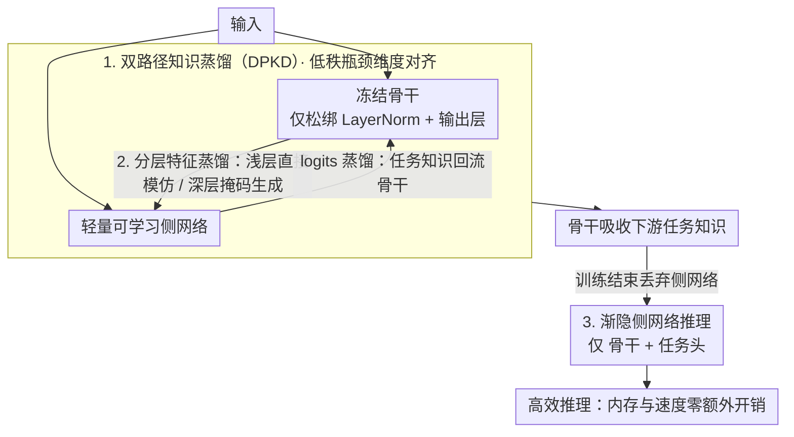

# Memory-Efficient Transfer Learning with Fading Side Networks via Masked Dual Path Distillation

**会议**: CVPR 2026  
**arXiv**: [2604.09088](https://arxiv.org/abs/2604.09088)  
**代码**: [https://github.com/Zhang-VKk/MDPD](https://github.com/Zhang-VKk/MDPD)  
**领域**: 模型压缩/高效迁移学习  
**关键词**: 记忆高效迁移学习, 知识蒸馏, 侧网络, 推理加速, 双路径蒸馏

## 一句话总结

MDPD提出通过冻结骨干网络与轻量侧网络之间的双向知识蒸馏实现高效微调，训练完成后丢弃侧网络，从而同时实现训练时的参数/内存高效和推理时的速度高效。

## 研究背景与动机

**领域现状**：记忆高效迁移学习（METL）通过构建轻量平行侧网络来避免大骨干的梯度反传，显著降低训练内存。但侧网络在推理时引入额外的内存和时间开销。

**现有痛点**：现有METL方法在训练阶段实现了参数和内存高效，但推理阶段的额外开销与高效迁移学习的终极目标相矛盾。

**核心矛盾**：侧网络在训练中不可或缺（避免大骨干的梯度存储），但在推理中是累赘（增加前向传播开销）。

**本文目标**：设计一种方法，在训练时利用侧网络实现内存高效，在推理时丢弃侧网络而不损失精度。

**切入角度**：通过双向知识蒸馏将侧网络学到的下游任务知识迁移回骨干网络。

**核心idea**：训练时骨干和侧网络互为师生进行蒸馏，推理时只用优化后的骨干，侧网络被"消融"。

## 方法详解

### 整体框架

MDPD要解决的是记忆高效迁移学习里那个绕不开的尴尬：侧网络训练时是省内存的功臣，推理时却成了拖速度的累赘。它的整体思路是让冻结的骨干和轻量的可学习侧网络在训练阶段并排跑、互相传授知识——骨干把预训练知识喂给侧网络，侧网络再把学到的下游任务知识反哺给骨干。这套双向知识流就是双路径知识蒸馏（DPKD），其中骨干→侧网络的特征蒸馏按编码器深浅分治（分层特征蒸馏 HFD）。等训练结束，骨干已经吸收了任务能力，于是侧网络被直接丢掉（渐隐侧网络），推理时只剩骨干加一个任务头，既不多花内存也不多花时间。

### 关键设计

**1. 双路径知识蒸馏（DPKD）：让骨干和侧网络互为师生，把任务知识搬回骨干**

侧网络之所以推理时不能丢，是因为下游任务知识全学在它身上、骨干一直被冻着没动。DPKD的做法是在两条路径间架起双向的知识流：特征级蒸馏里骨干当老师、侧网络当学生，把预训练得到的丰富特征传给侧网络，帮它学得更好；logits级蒸馏里角色对调，侧网络当老师、骨干当学生，把已经学到的任务判别能力迁回骨干。由于两个网络的特征维度不同（侧网络维度 $D_S$、骨干维度 $D_B$），中间用一对低秩矩阵 $M_{down} \in \mathbb{R}^{D_S \times d}$ 和 $M_{up} \in \mathbb{R}^{d \times D_B}$ 做瓶颈式维度对齐，既能跨维度对接又不引入大量参数。双向蒸馏的好处在于这是一个互相促进的循环——骨干的底子让侧网络起步更高，侧网络的任务适应又反过来把骨干"叫醒"，最终任务知识落在了那个推理时会被保留的骨干上。

**2. 分层特征蒸馏（HFD）：按编码器深浅层分别用不同的蒸馏策略**

如果对所有层用同一套蒸馏方式，效果会被深浅层的差异拖累。论文观察到：浅层里师生的注意力模式很接近，基本都是对角线式的自注意力，这种相似的层让学生直接模仿教师特征就够了；但深层不一样，师生关注的是不同的稀疏关键token，注意力模式分歧很大，硬让学生去拷贝教师特征反而学不像。于是深层改用掩码生成策略——不要求学生复制教师的特征，而是让学生去"生成"教师的特征，相当于把目标从精确对齐放松为内容重建，更契合深层那种各看各的稀疏注意力分布。这种深浅分治的做法比一刀切更有效地把骨干的知识传到侧网络。

**3. 渐隐侧网络（Fading Side Network）的推理策略：训练时只松绑骨干的少量参数，推理时整条侧路径退场**

要让推理时丢掉侧网络而不掉精度，前提是骨干在训练中确实变得"会做任务"了。MDPD并不解冻整个骨干，而是只更新骨干里LayerNorm的缩放/偏移系数和最终输出层这一小撮参数，绝大部分骨干权重保持冻结——参数效率因此得以保住。但因为有DPKD把侧网络的任务知识持续蒸馏进来，这少量可调参数加上蒸馏信号已经足够让骨干适配下游。训练结束后侧网络的使命完成，推理时直接用"骨干+任务头"，前向少了一整条侧路径，速度和内存的额外开销也就随之消失，这正是它能同时做到训练高效和推理高效的关键。

### 损失函数 / 训练策略

训练时交替优化骨干和侧网络，目标是缩小两条路径的特征分布差异。总损失由两部分组成：骨干→侧网络的特征蒸馏损失，以及侧网络→骨干的logits蒸馏损失。
> ⚠️ 损失的具体加权系数与交替优化的细节以原文为准。

## 实验关键数据

### 主实验

| 任务 | 指标 | MDPD | SOTA METL | 提升 |
|------|------|------|-----------|------|
| 视觉任务 | 推理加速 | ≥25.2% | 0% | +25.2% |
| 语言任务 | 推理加速 | ≥22.5% | 0% | +22.5% |
| 多模态任务 | 精度 | 超越SOTA | - | 提升 |

### 消融实验

| 配置 | 关键指标 | 说明 |
|------|---------|------|
| 无特征蒸馏 | 精度下降 | 缺少预训练知识传递 |
| 无logits蒸馏 | 精度下降 | 缺少任务知识迁移 |
| 不分层蒸馏 | 精度下降 | 深浅层策略不当 |
| 完整MDPD | 最优 | 双向蒸馏+分层策略 |

### 关键发现

- 推理加速至少25.2%同时保持甚至提升精度——这说明侧网络的角色可以完全通过蒸馏迁移
- 分层蒸馏策略对多层编码器至关重要，浅层直接模仿、深层掩码生成的组合最优
- 方法在视觉、语言和视觉-语言三种模态下均有效，验证了通用性

## 亮点与洞察

- **训练时用、推理时丢**：侧网络作为"一次性教练"的设计理念巧妙解决了METL的推理开销问题
- **分层蒸馏的发现**：深浅层注意力模式差异的观察及其对应的蒸馏策略设计值得借鉴
- **低秩维度对齐**：用瓶颈结构避免维度对齐引入大量参数，保持参数效率

## 局限与展望

- 训练时间可能增加（需要双路径前向和蒸馏损失计算）
- 仅更新骨干的LayerNorm参数可能限制了更极端域偏移下的适应能力
- 未讨论侧网络规模与蒸馏效果的关系

## 相关工作与启发

- **vs LoRA**: LoRA直接修改骨干权重但仍需要反传，MDPD通过侧网络间接更新骨干，内存更省
- **vs Side-Tuning**: 传统侧网络方法推理时保留侧网络，MDPD通过蒸馏实现了推理时的完全去除

## 评分

- 新颖性: ⭐⭐⭐⭐ 双向蒸馏+消融侧网络的组合设计新颖
- 实验充分度: ⭐⭐⭐⭐ 跨视觉/语言/多模态三种任务验证
- 写作质量: ⭐⭐⭐⭐ 方法描述清晰
- 价值: ⭐⭐⭐⭐ 解决了METL领域的核心矛盾

<!-- RELATED:START -->

## 相关论文

- [\[CVPR 2026\] DAGE: Dual-Stream Architecture for Efficient and Fine-Grained Geometry Estimation](dage_dual-stream_architecture_for_efficient_and_fine-grained_geometry_estimation.md)
- [\[CVPR 2026\] WPT: World-to-Policy Transfer via Online World Model Distillation](wpt_world-to-policy_transfer_via_online_world_model_distillation.md)
- [\[CVPR 2026\] MEMO: Human-like Crisp Edge Detection Using Masked Edge Prediction](memo_human-like_crisp_edge_detection_using_masked_edge_prediction.md)
- [\[CVPR 2026\] DualReg: Dual-Space Filtering and Reinforcement for Rigid Registration](dualreg_dual-space_filtering_and_reinforcement_for_rigid_registration.md)
- [\[ICLR 2026\] LightMem: Lightweight and Efficient Memory-Augmented Generation](../../ICLR2026/model_compression/lightmem_lightweight_and_efficient_memory-augmented_generation.md)

<!-- RELATED:END -->
