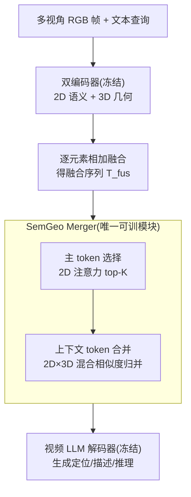

# Merge3D: Efficient 3D Multimodal LLMs via Joint 2D-3D Token Merging

**会议**: CVPR 2026  
**论文**: [CVF Open Access](https://openaccess.thecvf.com/content/CVPR2026/html/Pan_Merge3D_Efficient_3D_Multimodal_LLMs_via_Joint_2D-3D_Token_Merging_CVPR_2026_paper.html)  
**代码**: https://tianbo-pan.github.io/merge3d/ （项目主页，有 code/checkpoint）  
**领域**: 模型压缩 / 多模态VLM  
**关键词**: 3D 多模态LLM、视觉 token 合并、几何感知压缩、双编码器、推理加速

## 一句话总结
Merge3D 给"2D 语义 + 3D 几何"双编码器的 3D 视频 MLLM 设计了一个语义-几何联合 token 合并器（SemGeo Merger）：用 2D 注意力选语义显著的主 token、再用 2D×3D 混合相似度把上下文 token 并进空间邻域里的主 token，在砍掉至多 70% 视觉 token、提速约 3× 的同时，把 3D 定位/描述/空间推理性能几乎保住。

## 研究背景与动机
**领域现状**：把多视角 RGB 图当成序列喂 MLLM 来做 3D 场景理解正在流行，VGGT 这类前馈 3D 重建模型能从多视角图里抽出几何先验，于是 VG LLM、Spatial-MLLM 等用"2D 语义编码器 + 3D 几何编码器"的双编码器架构，不需要显式 3D 输入（点云/BEV）就能做 3D 视觉定位与空间推理。

**现有痛点**：双编码器对多帧视频会产出**超长的视觉 token 序列**，而 transformer 计算量随 token 数近似二次增长（FLOPs $\propto T(4nd^2+2n^2d+2ndm)$），训练和推理开销巨大；视频里视觉 token 数比文本 token 多一个数量级以上。

**核心矛盾**：视觉 token 确有大量冗余可压，但现成的 2D token 压缩方法（如 VisionZip）只看语义信号，会把"外观相似但空间上很远"的 token 合并掉，破坏 3D 结构先验和跨帧对应，导致 grounding 崩坏。

**本文目标**：在双编码器 3D MLLM 上做激进 token 压缩，同时保住 3D 空间保真度（定位、跨帧一致性、视角不变性）。

**切入角度**：作者实测发现一个**任务依赖规律**——2D 注意力引导的合并在空间推理（CV-Bench、BLINK）上更强，3D 注意力引导的合并在 3D 定位/检测（Scan2Cap）上更强；特征分布分析也显示 3D 几何 token 聚类紧（编码空间邻近与跨帧一致），2D 语义 token 更分散（编码细粒度外观）。两者互补，于是该把语义显著性和几何一致性**同时**纳入合并。

**核心 idea**：主 token 用 2D 语义选、上下文 token 用 2D×3D 混合相似度归并，只有"既语义相关又几何邻近"的 token 才会被合到一起。

## 方法详解

### 整体框架
Merge3D 建在 VG LLM 之上，保持 2D 视觉编码器、3D 几何编码器、视频 LLM 解码器全部**冻结**，只在"2D-3D 融合"之后、"喂进解码器"之前插入一个 SemGeo Merger。给定多帧 RGB $\{I_k\}$ 与文本查询：2D 编码器出语义特征 $F^{2D}_k$、3D 几何编码器出几何特征 $F^{3D}_k$（各先做 2×2 邻域下采样），逐元素相加融合成 $F^{fus}_k=F^{2D'}_k+F^{3D'}_k$，展平成长度 $n=m\cdot h\cdot w$ 的融合序列 $T^{fus}$。SemGeo Merger 直接作用在 $T^{fus}$ 上，分两步把它压短：先选主 token、再把其余上下文 token 合并进去，得到压缩序列 $\hat T^{fus}$，与文本 token 拼接后送解码器生成答案。

### 关键设计

**1. 主 token 选择：用 2D 注意力挑出语义显著的"锚点"**

压缩第一步要决定保留哪些 token 当合并锚点。作者实测 2D 注意力图在与查询相关的区域呈集中激活，最适合选主 token。具体地，取 2D 编码器某层的注意力张量 $A\in\mathbb{R}^{B\times H_a\times n\times n}$，对每个 token 在 query 维求和、再跨头平均，得到一个重要性得分，按分数选 top-K 组成主集合 $D=\{d_1,\dots,d_K\}$，其余构成上下文集合 $C=T^{fus}\setminus D$。这一步直接把序列砍短到 K，且保住了最有信息量的视觉证据。为什么用 2D 而非 3D 来选锚点？因为语义注意力更贴查询相关性，而几何相似度更适合后面的"邻域归并"——两步分工正对应作者发现的 2D/3D 互补性。

**2. 上下文 token 合并：2D×3D 混合相似度，只并"既相关又邻近"的 token**

光选主 token 会丢信息，第二步要把上下文 token 的信息回收进主 token，但又不能像纯语义合并那样把"远处但长得像"的 token 错并掉（这正是 VisionZip 在 3D 上崩 grounding 的根因）。Merge3D 把 2D 特征 $V$ 和 3D 特征 $G$ 都展平，对任意主 token $d_k$ 与上下文 token $c$ 分别算语义相似度 $s_{sem}(k,c)=\exp(v_k^\top v_c/\tau_{sem})$ 和几何相似度 $s_{geo}(k,c)=\exp(g_k^\top g_c/\tau_{geo})$，再**相乘**得到融合相似度 $s_{fuse}=s_{sem}\cdot s_{geo}$。每个上下文 token 被分配给融合相似度最高的主 token $a(c)=\arg\max_k s_{fuse}(k,c)$，同组上下文 token 取均值加回主 token：$\hat d_k=d_k+\frac{1}{|C_k|}\sum_{c\in C_k}c$（组为空则 $\hat d_k=d_k$）。**乘法**融合是关键：只有同时语义相关且几何邻近的 token 才得到大权重，从而既保住跨帧对应与视角不变性、又不丢语义显著性。

**3. 冻结骨干、只训合并器：即插即用且训练极省**

整套 2D 编码器、3D 几何编码器（VGGT）、视频 LLM 骨干（Qwen2.5-VL）全部冻结，只微调 SemGeo Merger，让模型适应被压短的 token 序列同时不破坏预训练先验。SemGeo Merger 可逐帧或对整段视频运行，不改任何骨干参数，因此能作为通用压缩模块插到双编码器 3D MLLM 上。这种"只训轻量合并器"的设定带来惊人的训练效率：8×H100 上 4B 变体仅需 1/4 epoch、2-3 小时即收敛。

### 损失函数 / 训练策略
统一用下一个 token 预测目标做多任务训练，数据沿用 VG LLM 那套：3D 场景理解用 ScanRefer（36,665 条物体描述/562 场景）做 grounding、Scan2Cap（Mask3D proposal）做密集描述；空间推理用 SPAR-7M 子集（234K，33 类任务）与 LLaVA-Video-178K（63K）。优化用 Adam、batch 64、warmup 比 0.03、峰值学习率 1e-5 后线性衰减。

## 实验关键数据

### 主实验
在三个互补 benchmark 上评测：Scan2Cap（3D 密集描述 + grounding，IoU=0.5 下报 CIDEr/BLEU-4/METEOR/ROUGE-L）、CV-Bench（2D/3D 空间推理）、BLINK（Depth/Spatial/Multi-View）。下表为 Scan2Cap 上 Merge3D 在不同 token 保留率的性能-效率折中（基线为 VG LLM-4B，不吃显式 3D 输入）。

| 配置 | 3D 输入 | C@0.5 | B-4@0.5 | M@0.5 | R@0.5 | 加速 |
|------|---------|-------|---------|-------|-------|------|
| Video-3D LLM | ✓ | 80.0 | 40.2 | 28.5 | 61.7 | — |
| LLaVA-3D | ✓ | 79.2 | 41.1 | 30.2 | 63.4 | — |
| Baseline (VG LLM-4B) | ✗ | 78.6 | 40.9 | 28.6 | 62.4 | 1× |
| Merge3D (保留 30%) | ✗ | 73.4 | 39.3 | 28.2 | 61.6 | 2.5× |
| Merge3D (保留 10%) | ✗ | 66.1 | 37.9 | 27.5 | 61.1 | 2.8× |
| Merge3D (保留 5%) | ✗ | 57.9 | 36.1 | 26.8 | 60.5 | 3.1× |

保留 30% token（砍掉 70%）时 CIDEr 仍保住基线的约 93.4%，且和需要显式 3D 输入的 Video-3D LLM/LLaVA-3D 仍有竞争力；即便 5% 极限压缩，ROUGE-L 也只从 62.4 掉到 60.5。

### 消融实验
与三种 VisionZip 式基线对比（同一保留率下，Scan2Cap CIDEr）：

| 保留率 | Randomzip | Visionzip-2D | Visionzip-3D | **Merge3D** |
|--------|-----------|--------------|--------------|-------------|
| 5% | 51.2 | 49.5 | 52.4 | **57.9** |
| 10% | 58.5 | 59.5 | 61.0 | **66.1** |
| 30% | 70.2 | 71.9 | 72.2 | **73.4** |

CV-Bench 平均准确率（5% 保留）：Merge3D 74.8% vs Visionzip-2D 68.9% / Visionzip-3D 63.6% / Randomzip 65.1%，领先 +5.9~+11.2 点；30% 保留时 Merge3D 79.6%，保住基线（82.1%）约 97%。BLINK 上 30% 保留 Merge3D 平均 67.5%（基线 68.4% 的 98.7%）。

### 关键发现
- **2D/3D 任务依赖确实存在**：Visionzip-3D 在定位敏感的 CIDEr/ROUGE 上优于 Visionzip-2D，Visionzip-2D 在 BLEU-4/METEOR（描述流畅度）和 CV-Bench 2D 子集上更好——印证几何对 grounding、语义对外观的分工。
- **混合相似度全面占优**：Merge3D 在每个保留率上 CIDEr 都最高，同时保住有竞争力的 BLEU-4/METEOR，说明"语义+几何同时建模"是重压缩下保住物体级 grounding 信号的关键。
- **压缩越激进、优势越大**：5% 极限压缩下相对各基线领先最多，验证乘法融合在 token 极稀缺时仍能挑出对的合并对。
- **Multi-View 仍是公共难点**：所有方法在 BLINK Multi-View 子集都卡在 55~57%，说明大视角变化可能需要 token 合并之外的额外机制。

## 亮点与洞察
- **把"选谁"和"并谁"拆给不同模态**：主 token 用 2D 语义选、上下文用 3D 几何归并，正好各取所长，是处理双编码器压缩的巧思。
- **乘法融合是防错并的关键**：$s_{sem}\cdot s_{geo}$ 让任一相似度低就整体压低，避免"外观像但空间远"的错误合并——一个很可迁移的相似度设计原则。
- **训练-free 友好、即插即用**：骨干全冻结、只训合并器，2-3 小时收敛，适合给已有双编码器 3D MLLM 做轻量提效改造。
- **任务依赖分析本身有价值**：2D vs 3D 主导性的系统分析，给后续 3D token 压缩工作提供了清晰的设计依据。

## 局限与展望
- **依赖双编码器架构**：方法绑定"2D 语义 + 3D 几何"双编码器（VG LLM/Spatial-MLLM 这类），对单编码器或显式点云模型不直接适用。
- **Multi-View 一致性未解**：大视角变化下所有方法都掉，token 合并解决不了，作者也承认需额外机制。
- **极限压缩仍有损**：5% 保留时 Scan2Cap CIDEr 从 78.6 掉到 57.9（约 73.7%），定位类任务在极稀疏 token 下仍有明显代价。
- **可改进**：把合并做成与解码层数自适应（逐层渐进压缩）、或为 Multi-View 引入显式跨视角对齐项，可能进一步抬高极限压缩下的下限。

## 相关工作与启发
- **vs VisionZip**：VisionZip 在 2D 上用注意力选主 token、用语义相似度合并，但完全不感知 3D 结构，会跨物体边界错并；Merge3D 用 2D 选锚 + 2D×3D 混合相似度归并，专门修了这个 3D grounding 痛点。
- **vs VG LLM / Spatial-MLLM**：它们引入 VGGT 把隐式 3D 先验灌进多视角图，但产生超长 token、开销大；Merge3D 直接建在 VG LLM 上做几何感知压缩，是效率侧的补强。
- **vs 通用 token 压缩（Dynamic-VLM / Balanced Token Pruning / PVC）**：这些主要面向全局视频 QA、把视觉 token 当纯语义处理，很少考虑 3D 几何或双编码器表征；Merge3D 是首个面向双编码器 3D 视频 MLLM 的几何感知合并框架。

## 评分
- 新颖性: ⭐⭐⭐⭐ 首个双编码器 3D MLLM 的几何感知 token 合并，2D 选锚+2D×3D 归并的分工设计清晰且有动机。
- 实验充分度: ⭐⭐⭐⭐ 三 benchmark × 多保留率 × 三种基线对比 + 定性可视化，较全面；但只在 VG LLM 一种骨干上验证。
- 写作质量: ⭐⭐⭐⭐ 动机（2D/3D 任务依赖观察）到方法的因果链很顺，公式与图示完整。
- 价值: ⭐⭐⭐⭐ 即插即用、训练极省、提速约 3×，对 3D MLLM 落地（边缘机器人等）有直接实用价值。

<!-- RELATED:START -->

## 相关论文

- [\[CVPR 2026\] MeToM: Metadata-Guided Token Merging for Efficient Video LLMs](metom_metadata-guided_token_merging_for_efficient_video_llms.md)
- [\[CVPR 2026\] Mining Attribute Subspaces for Efficient Fine-tuning of 3D Foundation Models](mining_attribute_subspaces_for_efficient_fine-tuning_of_3d_foundation_models.md)
- [\[CVPR 2026\] PlanaReLoc: Camera Relocalization in 3D Planar Primitives via Region-Based Structure Matching](planareloc_camera_relocalization_in_3d_planar_primitives_via_region-based_struct.md)
- [\[CVPR 2026\] CoIn: Coverage and Informativeness-Guided Token Reduction for Efficient Large Multimodal Models](coin_coverage_and_informativeness-guided_token_reduction_for_efficient_large_mul.md)
- [\[CVPR 2026\] Co-Me: Confidence Guided Token Merging for Visual Geometric Transformers](co-me_confidence_guided_token_merging_for_visual_geometric_transformers.md)

<!-- RELATED:END -->
