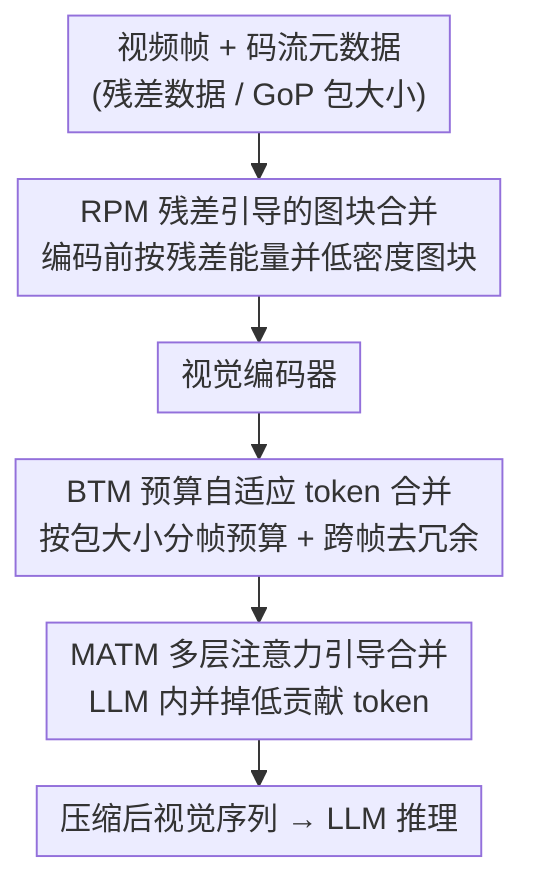

# MeToM: Metadata-Guided Token Merging for Efficient Video LLMs

**会议**: CVPR 2026  
**论文**: [CVF Open Access](https://openaccess.thecvf.com/content/CVPR2026/html/Wu_MeToM_Metadata-Guided_Token_Merging_for_Efficient_Video_LLMs_CVPR_2026_paper.html)  
**代码**: 未公布  
**领域**: 模型压缩 / 视频多模态  
**关键词**: 视频大模型, 视觉 token 压缩, 编解码元数据, 训练免费, 推理加速

## 一句话总结
MeToM 把视频编解码器里"白送"的码流元数据（残差能量、GoP 包大小）当作时空信息密度的零成本代理，用 RPM / BTM / MATM 三个模块在「tokenization 时、进 LLM 前、LLM 内部」三处分级地按内容复杂度自适应合并视觉 token，无需任何训练就在多个 Video LLM 上取得 2.65× 端到端推理加速且精度不降反升。

## 研究背景与动机
**领域现状**：主流 Video LLM 走 LLaVA 式架构——多帧画面经视觉编码器变成视觉 embedding，投影后和文本一起喂给 LLM 做多模态推理。但视频会生成数以万计的视觉 token，注意力复杂度随序列长度平方增长，prefill 延迟和显存（KV cache）都被撑爆，严重阻碍部署。

**现有痛点**：为减负，视觉 token 剪枝/合并成了常用手段，分两类——「进 LLM 前」按特征相似度或注意力分数裁剪，「LLM 内部」缩短有效上下文。但这些方法几乎都**均匀地**给每帧、每个区域分配 token 预算，而视频的时空信息密度**极不均匀**：静止背景、平滑区域信息稀薄，前景主体、纹理边界、剧烈运动段才是关键。均匀策略导致资源严重错配——宝贵预算被耗在无信息背景上，复杂动态区域反而表征不足。

**核心矛盾**：要按内容复杂度自适应分配 token，就得先**度量**每个区域/每帧的信息密度；但在视觉编码器之前直接估计密度，本身又是昂贵的特征提取，得不偿失。

**本文目标**：找到一个**零成本、训练免费**的时空信息密度信号，用它驱动内容自适应的 token 合并，同时在编码前、进 LLM 前、LLM 内三个阶段都把冗余压下去。

**切入角度**：作者从传统视频压缩里得到启发——码流（bitstream）里本就**免费携带**两类元数据：① **残差数据**（帧间/帧内预测后剩余的非冗余细节）天然反映空间纹理丰富度；② **GoP（Group of Pictures）包大小**反映该视频片段的时间复杂度（运动越剧烈、结构变化越多，包越大）。这些信号解码时白拿，几乎零开销。

**核心 idea**：用编解码元数据当"信息密度地图"，把均匀 token 压缩换成 metadata 引导的内容自适应 token 合并，且全程不训练。

## 方法详解

### 整体框架
MeToM 是一个训练免费框架，沿 Video LLM 的推理管线在**三个不同阶段**分级压缩视觉 token，每一级都用一种编解码元数据当密度线索。输入是原始视频帧及其码流元数据，输出是一段被大幅压短、却保留关键时空语义的视觉 token 序列，直接喂给 LLM。三个模块依次是：RPM 在 tokenization 阶段（视觉编码器之前）按空间残差做早期合并；BTM 在进 LLM 前用 GoP 包大小做逐帧预算分配 + 跨帧去冗余；MATM 在 LLM 内部用多层注意力把低贡献 token 并入近邻。

### 关键设计

**1. RPM 残差引导的图块合并：在编码前就用残差能量砍掉空间冗余**

针对"均匀 tokenization 在低密度背景上白白浪费算力"的痛点，RPM 把合并**前移到 tokenization 阶段、放在重型视觉编码器之前**，用码流残差当空间信息密度的零成本代理（残差与局部纹理丰富度强相关，无需任何特征提取）。给定输入帧 $I_t$ 及其残差 $r_t$，先做逐通道标准化 $\tilde r_{t,c}=(r_{t,c}-\mu_{t,c})/(\sigma_{t,c}+\epsilon)$ 统一三通道动态范围，再算像素级信息密度 $E_t(x,y)=\sum_{c=1}^{3}\tilde r_{t,c}(x,y)^2$，经 min-max 归一化和按图块网格聚合 $S_t=\text{GridAggregate}(\text{norm}(E_t))$ 得到图块级密度分数。低于阈值 $\tau$ 的图块被标为低密度掩码 $M_t$，把**空间相邻**的低密度图块抽成连通区域 $C_t$，每个连通区域用 patch embedding 平均成一个代表 token $\bar h_{t,C}=\frac{1}{|C|}\sum_{p\in C}h_{t,p}$，而高密度图块（$S_t\ge\tau$）按原分辨率保留。这种"连通感知"的合并专门压住零散的背景 token、避免冗余编码——关键是它发生在编码器之前，因此还顺带省了视觉编码器本身的开销（实测 Vision Tower 从 525ms 降到 450ms），这是只能在编码后裁剪的同类方法做不到的。

**2. BTM 预算自适应 token 合并：用 GoP 包大小给每帧分预算并跨帧去冗余**

RPM 只压了空间冗余，没管视频固有的**时间**冗余（相邻帧背景、静态区域高度重复）。BTM 用 GoP 包大小 $c_t$ 当时间密度信号——包越大说明运动/结构变化越剧烈、信息越多。**预算分配**上，给定全局视觉 token 预算 $M_v$，先给每帧保底 $m_{\min}$ 个 token，剩余预算按 $\sqrt{c_t}$ 比例分配：$m_t=m_{\min}+\text{round}\big((M_v-Tm_{\min})\frac{\sqrt{c_t}}{\sum_k\sqrt{c_k}}\big)$，于是复杂帧拿到更多 token。拿到逐帧预算后做三步收缩：① **coreset 选择**——按 RPM 给的空间密度分数 $s_{t,i}$ 取 top-$m_t$ 个 token 作核心集 $T_t$，其余进补集 $\bar T_t$；② **跨帧时间去冗余**——核心 token 两两算余弦相似度 $\text{sim}((t,i),(t',j))$，超过阈值 $\tau_{tem}$ 的从高到低相似度成对合并 $\hat h=(h_{t,i}+h_{t',j})/2$；③ **低密度 token 空间折叠**——把补集里每个低密度 token 并入**本帧内**最相似的精化核心 token。三步下来既保住空间语义、又抹掉时间重复，得到紧凑序列。

**3. MATM 多层注意力引导合并：在 LLM 内部用跨层注意力稳定地并掉低贡献 token**

进入 LLM 后视觉注意力是稀疏的，但**单层**注意力分布抖动大，已有方法只用单层注意力来剪 token，决策不稳。MATM 改为**跨多层聚合**注意力：对一组层 $L$，token $i$ 的聚合重要度 $a_i=\frac{1}{|L|}\sum_{\ell\in L}a_i^{(\ell)}$。据此把最低 $R\%$ 的视觉 token 判为冗余，并把每个冗余 token 并入与它最相似（余弦）的保留 token $v'_{r^\star}=\text{average}(v_{r^\star},v_j)$。跨层聚合让 saliency 估计更稳，从而进一步缩短视觉序列、直接降低 prefill FLOPs 和视觉 KV cache 占用（LLM backbone prefill 从 1329ms 砍到 215ms，约 6.2×）。

> ⚠️ 三模块即整体框架里点名的全部贡献组件，框架↔关键设计一一对应；视觉编码器、LLM 为脚手架节点不单列设计。

## 实验关键数据

### 主实验
在 LLaVA-OneVision-7B 上对比 5 个训练免费 SOTA（FastV / ToMe / DyCoke / STTM / HoliTom），覆盖 5 个视频 QA 基准（VideoMME、LongVideoBench、MLVU、EgoSchema、NExT-QA）。**所有精度均相对 100% 预算基线**报告，TTFT（Time-To-First-Token，即 prefill 首 token 延迟）和 NV（实际保留的视觉 token 数）越低越好。

| 配置 | 平均精度(相对100%) | 平均 TTFT(相对100%) | 说明 |
|------|------|------|------|
| 100% LLaVA-OV-7B | 100.0 | 100 | 全 token 基线 |
| 50% + ToMe | 101.2 | 50.4 | 第二梯队 |
| 50% + HoliTom | 100.4 | 46.3 | — |
| **50% + MeToM** | **102.0** | **41.5** | 精度反超基线 2.0%，TTFT 最低 |
| 30% + FastV | 98.4 | 31.5 | 掉到基线以下，丢关键信息 |
| 30% + ToMe | 100.7 | 34.1 | 略高但延迟收益有限 |
| **30% + MeToM** | **101.2** | **27.3** | 激进预算下仍精度最高、TTFT 最低 |

### 跨骨干泛化与效率分析

| 骨干 / 预算 | MeToM 表现 | 对照 |
|------|------|------|
| LLaVA-Video-7B @30% | 保留 98.4% 精度 | FastV 96.0%、HoliTom 97.4% |
| Qwen2VL-7B @30% | TTFT 23.7%（最低），精度 +1.3% | ToMe 跌到 97.9% |
| LLaVA-Video-72B @50% | 精度 +1.4%（101.4%），TTFT 41.9% | 唯一显著提精度的方法 |
| LLaVA-Video-72B @30% | 保留 99.1% | ToMe 97.1%、DyCoke 98.3% |

效率拆解（Fig. 3，TTFT 分 Vision Tower / LLM Backbone / Other 三段）：LLM backbone prefill 1329ms→215ms（**6.2×**）；Vision Tower 525ms→450ms（得益于编码前的 RPM）；预处理仅 53ms（HoliTom 92ms、DyCoke 58ms）；总 TTFT 降到 718ms，**端到端 2.65× 加速**。

### 关键发现
- **越激进越显优势**：30% 预算下 FastV、HoliTom 掉破基线，MeToM 仍保 101.2%，说明 metadata 引导的预算分配把 token 花在了刀刃上。
- **编码前合并是独有红利**：因为 RPM 在视觉编码器之前动手，MeToM 还能省 Vision Tower 时间，而所有后编码方法都得先跑完整 Vision Tower 才能压。
- **元数据近乎免费**：预处理仅比基线多 3ms（53 vs 50ms），却换来 2.65× 加速。

## 亮点与洞察
- **把"压缩域的副产品"复用到推理压缩**：残差能量和 GoP 包大小是视频编码时本就算好的量，解码即得，作者把它们当时空信息密度图，是"免费午餐"式的巧思——避开了"为测密度先做昂贵特征提取"的死循环。
- **三处分级、各取所长**：空间冗余在编码前压（RPM）、时间冗余在进 LLM 前压（BTM）、语义低贡献在 LLM 内压（MATM），三个阶段用三种不同信号，互不打架且层层递减。
- **可迁移性**：用码流元数据当廉价显著性先验这一思路，可推广到视频检索、流式视频理解等任何需要在海量帧里挑重点的任务。

## 局限与展望
- 强依赖**码流元数据可得**：若视频已被转码/重编码、或以原始帧（无压缩）形式输入，残差和 GoP 信号可能失真或缺失，方法增益会打折。
- 残差/包大小是**压缩域**的代理，与"语义重要性"并非完全等价——高纹理但语义无关的区域（如复杂背景噪声）可能被误判为高密度而保留。
- 阈值 $\tau$、$\tau_{tem}$、保底预算 $m_{\min}$、层集合 $L$、剪枝比例 $R\%$ 等超参较多，论文主文未给敏感性分析（⚠️ 模块级消融与超参扫描可能在补充材料，正文未列）。
- 作者展望引入更丰富的元数据信号，并扩展到流式与检索增强的视频理解。

## 相关工作与启发
- **vs FastV / HoliTom（注意力剪枝）**：它们均匀分配预算且仅靠 LLM 内注意力，激进预算下掉点；MeToM 用 metadata 先做内容自适应预算分配，30% 预算仍稳。
- **vs ToMe（特征相似度合并）**：ToMe 在编码后按相似度合并、延迟收益有限（TTFT 仍 34.1%）；MeToM 把合并前移到编码前并跨三阶段，TTFT 压到 27.3%。
- **vs DyCoke / STTM（时空压缩）**：同样关注视频时空冗余，但密度线索来自模型内部计算；MeToM 改用零成本码流元数据，预处理开销更低（53ms vs 58/45ms 量级）。

## 评分
- 新颖性: ⭐⭐⭐⭐⭐ 用码流元数据当时空密度先验、训练免费且编码前合并，角度新颖。
- 实验充分度: ⭐⭐⭐⭐ 跨 4 个骨干、5 个基准、双预算充分对比；但主文缺逐模块消融与超参敏感性。
- 写作质量: ⭐⭐⭐⭐ 三模块动机—机制—公式衔接清晰，图示直观。
- 价值: ⭐⭐⭐⭐⭐ 即插即用、零训练、2.65× 加速且精度不降，部署价值高。

<!-- RELATED:START -->

## 相关论文

- [\[CVPR 2026\] Merge3D: Efficient 3D Multimodal LLMs via Joint 2D-3D Token Merging](merge3d_efficient_3d_multimodal_llms_via_joint_2d-3d_token_merging.md)
- [\[CVPR 2026\] Co-Me: Confidence Guided Token Merging for Visual Geometric Transformers](co-me_confidence_guided_token_merging_for_visual_geometric_transformers.md)
- [\[CVPR 2026\] CoIn: Coverage and Informativeness-Guided Token Reduction for Efficient Large Multimodal Models](coin_coverage_and_informativeness-guided_token_reduction_for_efficient_large_mul.md)
- [\[CVPR 2026\] Rethinking Token Reduction for Large Vision-Language Models](rethinking_token_reduction_for_large_vision-language_models.md)
- [\[CVPR 2026\] IF-Prune: Information-Flow Guided Token Pruning for Efficient Vision-Language Models](if-prune_information-flow_guided_token_pruning_for_efficient_vision-language_mod.md)

<!-- RELATED:END -->
