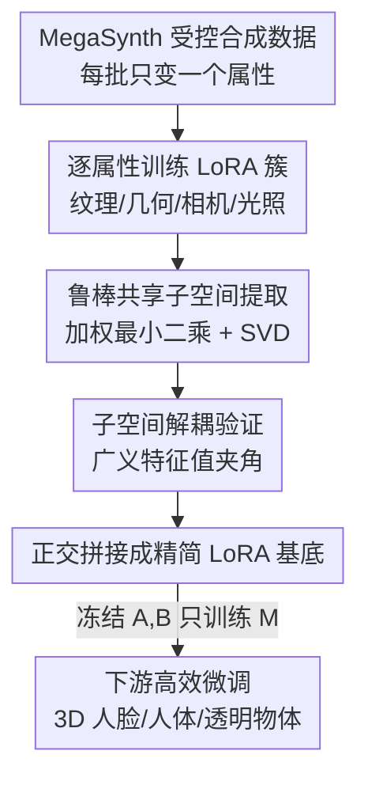

# Mining Attribute Subspaces for Efficient Fine-tuning of 3D Foundation Models

**会议**: CVPR 2026  
**论文**: [CVF Open Access](https://openaccess.thecvf.com/content/CVPR2026/html/Jiang_Mining_Attribute_Subspaces_for_Efficient_Fine-tuning_of_3D_Foundation_Models_CVPR_2026_paper.html)  
**代码**: 待确认  
**领域**: 模型压缩 / 高效微调（PEFT）  
**关键词**: LoRA子空间, 3D基础模型, VGGT, 属性解耦, 合成数据微调

## 一句话总结
针对 VGGT 这类 3D 基础模型，作者用受控合成数据为纹理、几何、相机、光照四种 3D 变化各自提炼出一个"共享 LoRA 子空间"，证明它们近似正交，把它们拼成一组精简的 LoRA 基底后只需训练一个小矩阵就能高效微调，在 3D 人脸防伪、着衣人体重建、透明物体重建上用更少参数（约 4M 对比 LoRA 16M）取得更优的下游精度。

## 研究背景与动机

**领域现状**：3D 基础模型（DUSt3R、VGGT 等）已经能用一个统一网络解决多视图重建、深度估计等多种 3D 任务，下游适配时 LoRA 是绝对主流——它把权重更新 $dW$ 约束为低秩 $dW = AB^\top$，只训练少量参数，缓解小样本与过拟合。

**现有痛点**：把 LoRA 直接搬到 3D 任务上有两个特有难处。其一，真实 3D 数据往往极难采集——典型例子是用微基线（micro-baseline，相机几乎不动）多视图区分真实人脸和打印照片做防伪取证，采视频既费力又涉及隐私；其二，3D 任务关注的是纹理、几何、相机运动、光照这些**低层视觉属性**，而通用 LoRA 把所有变化糊成一团低秩更新，既不知道每种属性各占哪块子空间，也无法判断这些更新是否可迁移。结果就是论文实验里看到的：LoRA 秩太低学不动新变化、秩太高又过拟合，PiSSA 随秩增大持续退化。

**核心矛盾**：LoRA 的低秩更新空间是"一锅端"地随机张成的，它既没有对齐到 3D 数据真实的变化因子，也没有利用"3D 变化天然可分解为几种独立属性"这一结构先验。于是参数花在了无关方向上。

**本文目标**：分解为三个被作者明确写进 abstract 的子问题——(1) 每种 3D 变化是否对应一个 LoRA 子空间？(2) 这些子空间是否解耦（彼此正交）？(3) 如何高效地把它们算出来？

**切入角度**：既然真实 3D 数据贵，那能不能反过来用**合成数据**：用图形引擎刻意只放大某一种属性的变化、把其余属性压到极小，那么在这批数据上微调得到的 LoRA 里，"被放大属性"对应的方向会在多个数据划分间反复出现（共享分量），而其余随机属性只贡献样本特有的噪声分量。把共享分量抽出来，就是该属性的子空间。

**核心 idea**：用受控合成数据为每个属性挖一个"共享 LoRA 子空间"，拼成一组精简正交基底 $A,B$，下游只训练中间的小方阵 $M$（$dW = AMB^\top$），用合成数据学到的结构去高效微调真实数据。

## 方法详解

### 整体框架
方法分两条线：**离线挖子空间**和**在线用子空间微调**。离线阶段，用 MegaSynth 图形引擎为纹理/几何/相机/光照四个属性各造一批"只变这个属性、固定其余"的合成数据集；在每个数据集上独立训练 VGGT 的 LoRA 适配器，得到一簇 LoRA 权重；再用一个鲁棒的加权最小二乘算法从这一簇 LoRA 里抽出"共享分量"作为该属性的子空间，并验证四个子空间近似正交。在线阶段，把四个属性子空间正交拼接成精简基底 $(A,B)$，下游微调时冻结 $A,B$、只训练中间方阵 $M$，从而把可训练参数从普通 LoRA 的十几 M 压到几 M。

### 关键设计

**1. 受控合成数据 + 域随机化：让每种属性的变化大过真实-合成域差**

要从 LoRA 里分离出"纹理子空间"，前提是有一批"只有纹理在变、几何相机光照都钉死"的数据。作者用 MegaSynth 生成数据：针对目标属性把变化推到极端，其余属性在不同数据集间随机但幅度很小。背后的动机是域随机化（domain randomization）——只要刻意制造的属性内变化**大于真实数据与合成数据之间的域差**，学到的子空间就会跨过合成-真实鸿沟、泛化到真实数据。这一步是整个方法成立的物理基础：正因为"目标属性变化极大、其余属性变化极小"，单个 LoRA 才能被近似拆成"共享的目标属性分量 + 样本特有的噪声分量"两块，后续算法才有东西可抽。

**2. 鲁棒共享 LoRA 子空间提取：用加权最小二乘把一簇 LoRA 的公共方向抽出来**

给定同一属性下训练出的 $k$ 对 LoRA 矩阵 $\{A_i, B_i\}$，目标是找一对维度为 $d'$ 的 $A,B$，使 $AB^\top$ 最优逼近所有个体更新 $A_iB_i^\top$。最朴素的做法是最小化 Frobenius 残差，但合成数据构造可能产生离群 LoRA，普通平方和会被离群项带偏。作者改用一个带指数 $\alpha$ 的鲁棒目标：

$$\min_{A,B}\ \sum_{i=1}^{k}\ \|AB^\top - A_iB_i^\top\|_F^{\alpha}.$$

当 $\alpha \neq 2$ 时没有闭式解，于是用**迭代重加权最小二乘**：引入权重 $w_i$ 把问题转成 $\min_{A,B}\sum_i w_i\|AB^\top - A_iB_i^\top\|_F^2$，从 $w_i=1$ 起交替优化。固定 $w_i$ 时，最优解就是对加权平均矩阵 $C=\sum_i w_i A_iB_i^\top / \sum_i w_i$ 做 SVD：取前 $d'$ 个奇异向量/奇异值，$A=U_{d'}\Sigma_{d'}^{1/2}$、$B=V_{d'}\Sigma_{d'}^{1/2}$；固定 $A,B$ 时按残差更新权重 $w_i = 1/(\varepsilon^2 + \|AB^\top - A_iB_i^\top\|_F^2)^{(2-\alpha)/2}$——残差大的 LoRA 权重被压低，离群项自动让位。$C$ 的奇异谱在第 $d'$ 个奇异值处有明显断崖（论文 Fig. 2 在第 16/17 个奇异值间出现陡降），正是"共享子空间确实存在"的实证。

**3. 子空间解耦验证 + 正交拼接成精简基底：把四个属性方向拼成一组可复用的 LoRA 基**

光抽出四个子空间还不够，必须确认它们彼此独立、拼起来不会互相抵消。比较两个子空间 $S=AB^\top$、$S'$ 并不平凡：$AB^\top$ 在 $A\to AX,\ B\to BX^{-\top}$ 下不变，且整体缩放 $aS$ 表示同一线性空间，没法直接比 $A$ 与 $A'$。作者先用 SVD 规范化（令 $A=U\Sigma^{1/2}$、$B=V\Sigma^{1/2}$），再定义一个对缩放不变的"子空间夹角"：

$$d(S,S')=\min_{x,x'}\frac{\|Sx-S'x'\|_2}{\|Sx\|_2+\|S'x'\|_2},$$

其最优解可化为一个最小广义特征值问题求解。实测六对属性子空间的最小特征值大多在 0.5 以上（1 表示完全正交），说明四个子空间近似解耦，尤其纹理-相机、几何-相机之间正交性最强。正因为解耦，最终才能把所有属性子空间**正交拼接**：$AMB=(\,\|_{i\in\Lambda}A_i\,)\cdot(\,\|_{i\in\Lambda}B_i\,)^\top$，得到一组精简且互不冗余的 LoRA 基底。下游微调时冻结这组 $A,B$、只训练中间方阵 $M$，参数量由基底维度而非全秩决定，这就是"高效"的来源。作者还从神经正切核与扩散模型泛化理论给了一个直觉：网络对属性变化的非线性响应可由其 Jacobian 的线性近似刻画，这种线性关系天然促成解耦，高阶残差才对应属性间的弱相关。

### 损失函数 / 训练策略
基模型为 VGGT（含 48 组自注意力与线性层，每个自注意力有 QKV 和投影两个矩阵参数）。下游微调时冻结 DINO 编码器、用深度头（depth head）而非点头做预测，所有实验保持相同训练步数，采用线性+余弦衰减的两段式学习率调度。属性子空间每个由 5~10 个秩 $r=16$ 的 LoRA 适配器提炼而来。

## 实验关键数据

### 主实验

3D 人脸防伪（微基线设置），合成与真实人脸数据集上对比全量微调、不同秩的 LoRA / PiSSA：

| 方法 | 可训练参数 | 合成 Acc↓ | 合成 Comp↓ | 合成 NC↑ | 真实 AbsRel↓ | 真实 δ<1.25↑ |
|------|-----------|----------|-----------|---------|-------------|-------------|
| VGGT（不微调） | - | 9.006 | 4.965 | 80.74 | 2.651 | 98.59 |
| Full 全量 | 853.6 M | 5.585 | 3.531 | 85.77 | 2.203 | 98.85 |
| LoRA (rank=16) | 16.3 M | 5.767 | 3.385 | 84.78 | 2.115 | 98.92 |
| PiSSA (rank=16) | 16.3 M | 5.729 | 3.532 | 85.30 | 2.433 | 98.81 |
| **Ours (d=16)** | **4.0 M** | **3.831** | **2.037** | **86.65** | 2.170 | 98.92 |

合成集上本文以约 1/4 的 LoRA 参数把 Accuracy 从 LoRA 的 5.767 降到 3.831、Completeness 从 3.385 降到 2.037，真实集上与最好基线相当——验证了合成数据学到的子空间能迁移到真实数据。

着衣人体重建（THuman 2.1 内域 + 2K2K 跨域，泛化测试）：

| 方法 | 可训练参数 | THuman Acc↓ | THuman NC↑ | 2K2K Acc↓ | 2K2K NC↑ |
|------|-----------|------------|-----------|-----------|----------|
| VGGT | - | 2.816 | 91.51 | 3.103 | 92.81 |
| LoRA (rank=64) | 65.3 M | 2.791 | 92.12 | 3.017 | 93.18 |
| LoRA (rank=256) | 261.4 M | 3.521 | 91.81 | 2.517 | 93.99 |
| PiSSA (rank=64) | 65.3 M | 3.931 | 89.42 | 3.730 | 91.13 |
| **Ours (d=64)** | **19.3 M** | **2.745** | 91.82 | **2.513** | 93.56 |

LoRA 加到 256 秩（261M 参数）跨域 Acc 才追到 2.517，本文用 19.3M（约 1/13 参数）跨域 Acc 做到 2.513，几乎所有指标领先。透明物体重建（ClearPose）上，本文 16.3M 参数也优于同量级 LoRA 与 AdaLoRA。

### 消融实验

| 配置 | THuman Acc↓ | 2K2K Acc↓ | 说明 |
|------|------------|-----------|------|
| PSV (d=64) | 4.066 | 3.805 | 用原权重的主奇异向量当基底 |
| **Ours (d=64)** | **2.745** | **2.513** | 用本文提炼的属性子空间 |
| r=16, d=8 | 5.839 | 5.712 | 输入 LoRA 秩 16、子空间维 8 |
| r=16, d=64 | 2.745 | 2.513 | 子空间维增大持续变好 |
| r=64, d=64 | 2.783 | 2.563 | 改变输入 LoRA 秩趋势相近 |

### 关键发现
- **子空间来源很关键**：同样维度下，用本文算法提炼的属性子空间（Ours）显著优于直接拿原模型权重的主奇异向量（PSV），说明性能来自"对齐到 3D 属性变化"而非单纯低秩结构。
- **维度 d 越大越稳**：本文方法在 $d$ 小时是次优的，但随 $d$ 增大子空间越来越鲁棒、泛化越来越好，与 LoRA"秩大就过拟合"、PiSSA"秩大就退化"的趋势相反——这正是子空间对齐带来的稳定性。
- **谱断崖随层而变**：$C$ 的奇异谱存在四种形态（深层注意力/全连接层在秩处陡降，早期层断点偏大或无断点），反映深层编码可泛化的全局模式、早期层需为合成数据的局部模式大幅调整；MLP 层不同属性的相对幅度差异巨大，意味着必须**逐属性**抽子空间，混在一起抽会丢掉有用方向。

## 亮点与洞察
- **"用合成数据反推 LoRA 结构"这个视角很巧**：不是去采更多真实 3D 数据，而是用图形引擎可控地放大单一属性，让该属性在多个 LoRA 间成为唯一的公共方向，从而把"属性子空间"变成一个可被 SVD 抽取的统计量——把昂贵的数据问题转成了便宜的算法问题。
- **鲁棒加权最小二乘 + IRLS 是可复用的 LoRA 合并工具**：对一簇 LoRA 求"抗离群的公共低秩逼近"这个子问题，在风格/内容 LoRA 融合等场景同样适用，不限于 3D。
- **缩放不变的子空间夹角度量值得借鉴**：用广义特征值问题定义两个 $AB^\top$ 之间对规范化、缩放都不变的距离，给"两个 LoRA 子空间是否正交"提供了一个干净的量化判据，比直接比较矩阵元素严谨。
- **"先离线挖结构、再在线只训小矩阵"的两段式范式**，把 PEFT 的参数预算从"随便张成的低秩"升级为"对齐到数据真实变化因子的低秩"，是一个可迁移到其他有明确变化因子领域（如可控生成）的思路。

## 局限与展望
- **只研究静态场景**：作者明确指出未涉及运动变化，扩展到 4D 基础模型需要额外引入运动属性。
- **依赖图形引擎能可控生成的属性**：方法的前提是能用 MegaSynth 把纹理/几何/相机/光照逐个解耦地造出来，对那些难以在引擎里独立控制、或合成-真实域差极大的属性（如复杂材质、真实噪声）不一定成立。
- **解耦只是"近似"且缺严格理论**：子空间夹角多在 0.5 以上但远非完全正交，论文给的神经正切核解释只是直觉，作者把严格分析留给未来工作；属性间残余相关在某些 MLP 层并不小。
- **小维度下次优**：$d$ 较小时本文反而不如基线，必须把维度/合成数据多样性加上去才显优势，提炼子空间本身还需训练一簇 LoRA，离线成本不可忽略。
- 可改进方向：作者建议研究如何结合大规模合成与小规模真实数据联合微调，以及跨不同 3D 基础模型比较子空间的异同。

## 相关工作与启发
- **vs 生成模型里的 LoRA 合并（ZipLoRA / B-LoRA / K-LoRA / LiONLoRA）**：那条线是把两个已训好的 LoRA（风格 + 内容）融合，关注"怎么组合"；本文关注的是"每种变化能否被一个共享子空间编码、怎么从合成数据算出来"，且证明不同属性子空间近似正交、可拼成统一基底并跨合成-真实泛化，问题设定不同。
- **vs LoRA 训练策略（AdaLoRA / PiSSA / LoRA-GA / GaLore）**：AdaLoRA 动态调秩、PiSSA 用主奇异向量初始化、GaLore 把梯度投到低秩子空间，这些都是"在线"地控制更新所处的低秩空间；本文是**离线预计算**一组与 3D 属性变化对齐的子空间，且专门给出从合成数据导出子空间的算法，消融里直接打败了 PiSSA 式的"主奇异向量当基底"。
- **vs 普通 LoRA**：普通 LoRA 的低秩方向随机张成、可解释性差，秩低欠拟合、秩高过拟合；本文把方向对齐到属性变化后，参数更省、随维度增大反而更稳，跨域泛化更好。

## 评分
- 新颖性: ⭐⭐⭐⭐⭐ 把"3D 变化可分解为属性"这一结构先验落到 LoRA 子空间提取上，并用合成数据反推、证明解耦，视角和算法都新。
- 实验充分度: ⭐⭐⭐⭐ 覆盖人脸防伪、人体重建、透明物体三类任务 + 内外域 + 多组消融，但只在 VGGT 一个基模型上验证，跨模型泛化未测。
- 写作质量: ⭐⭐⭐⭐ 三个核心问题驱动、谱分析与解耦度量讲得清楚；公式密集、部分谱形态分析略繁，图表编号在缓存里有错位。
- 价值: ⭐⭐⭐⭐ 给 3D 基础模型 PEFT 提供了一条"对齐属性结构"的高效微调路线，鲁棒 LoRA 合并与子空间度量工具可迁移到生成等领域。

<!-- RELATED:START -->

## 相关论文

- [\[ICLR 2026\] ABBA-Adapters: Efficient and Expressive Fine-Tuning of Foundation Models](../../ICLR2026/model_compression/abba-adapters_efficient_and_expressive_fine-tuning_of_foundation_models.md)
- [\[CVPR 2026\] Merge3D: Efficient 3D Multimodal LLMs via Joint 2D-3D Token Merging](merge3d_efficient_3d_multimodal_llms_via_joint_2d-3d_token_merging.md)
- [\[CVPR 2026\] LoPrune: Efficient Data Pruning for LoRA-Based Fine-Tuning of Vision Transformer](loprune_efficient_data_pruning_for_lora-based_fine-tuning_of_vision_transformer.md)
- [\[CVPR 2026\] ReFTA: Breaking the Weight Reconstruction Bottleneck in Tensorized Parameter-Efficient Fine-Tuning](refta_breaking_the_weight_reconstruction_bottleneck_in_tensorized_parameter-effi.md)
- [\[CVPR 2026\] TaskIT: Memory-Efficient Fine-Tuning of Multi-LoRA LLMs via Cross-Task Importance Transfer](taskit_memory-efficient_fine-tuning_of_multi-lora_llms_via_cross-task_importance.md)

<!-- RELATED:END -->
