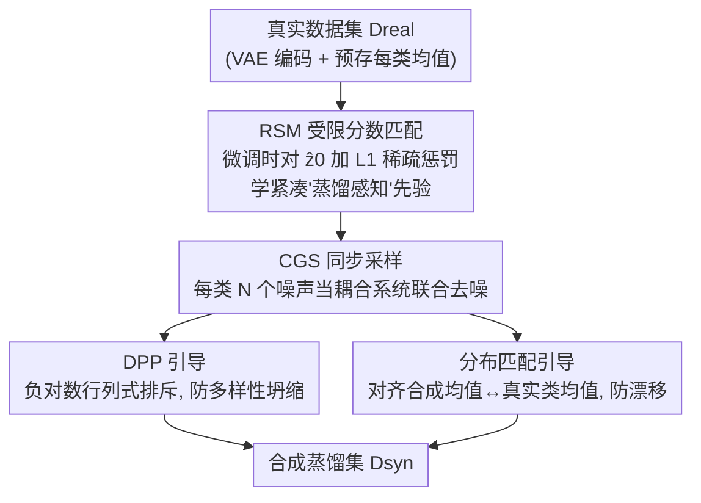

# Mitigating The Distribution Shift of Diffusion-based Dataset Distillation

**会议**: CVPR 2026  
**论文**: [CVF Open Access](https://openaccess.thecvf.com/content/CVPR2026/html/Xu_Mitigating_The_Distribution_Shift_of_Diffusion-based_Dataset_Distillation_CVPR_2026_paper.html)  
**代码**: 未公布  
**领域**: 模型压缩 / 数据集蒸馏 / 扩散模型  
**关键词**: 数据集蒸馏, 扩散模型, 分布偏移, 稀疏正则, 行列式点过程

## 一句话总结
本文指出"用扩散模型做数据集蒸馏"会同时遭遇训练期与采样期两类分布偏移，提出两阶段框架——训练时用 L1 稀疏正则（RSM）逼扩散模型学一个紧凑稀疏的"蒸馏感知"流形，采样时放弃逐个 i.i.d. 的贪心生成、改为同步去噪整批样本并加 DPP 多样性 + 分布匹配两个协同引导（CGS），在 ImageNet 子集与 ImageNet-1K 上以更低算力取得 SOTA。

## 研究背景与动机
**领域现状**：数据集蒸馏（Dataset Distillation, DD）想把大数据集压成一个很小的合成集，使在合成集上训练的模型逼近在全量数据上训练的性能。传统 DD 靠逐样本迭代优化（meta-model / 梯度匹配 / 轨迹匹配 / 分布匹配），计算昂贵；近来扩散生成模型因能高效刻画复杂数据流形，成了被看好的"现成"替代方案。

**现有痛点**：把扩散模型当 off-the-shelf 工具直接生成蒸馏数据，会在合成集上暴露一个常被忽视的问题——**分布偏移**（distribution shift），即蒸馏数据的理想属性与实际生成属性之间存在落差，抵消了扩散框架的优势。作者把它拆成两个根源：

- **训练期偏移**：标准扩散模型的目标是**完美复刻**真实分布 $p(x)$，但这对 DD 是错的目标——如果只要复刻，那普通生成模型或 coreset 选择就够了。大量带正则的 DD 工作说明：理想的蒸馏分布是一个**任务感知的压缩抽象**，只保留核心、可迁移的信息。所以扩散先验本身必须被正则化，去学一个"简化流形"。
- **采样期偏移**：蒸馏集天生低容量（$N\ll N_{real}$），大数定律不成立，$N$ 个 i.i.d. 样本的经验分布方差很高、代表不了目标先验，表现为两种失效——**多样性坍缩**（引导样本收敛到少数冗余模式，DDIM 等高级求解器下更严重）和**分布漂移**（合成集的均值/方差等统计量偏离真实流形）。

**核心矛盾**：把扩散"复刻真实分布"的天性，和 DD"要简化、要低容量却代表全局"的需求，是直接冲突的；而以往生成式 DD 把它当成 $N$ 个独立采样任务，贪心地一个一个生成，更放大了采样期偏移。

**本文目标**：在**学习**与**生成**两个阶段分别对症下药地压住两类偏移。

**核心 idea**：训练时加 L1 稀疏约束逼出"蒸馏感知"的简化先验；采样时把"找 $N$ 个各自最优样本"改写成"生成一个全局最优数据集"，用同步去噪 + 协同引导一次性管住坍缩与漂移。

## 方法详解

### 整体框架
方法是一个两阶段流程。**阶段一 RSM（Restricted Score Matching）** 在扩散模型微调期动手，给"预测的干净潜变量 $\hat z_0$"加一个 L1 稀疏惩罚，把生成先验剪成一个紧凑、语义稀疏的"蒸馏感知"流形——这一步是对采样阶段的预备，把问题空间提前收窄。**阶段二 CGS（Collaborative Guided Sampling）** 在这个被精简过的流形上采样：先把同类的 $N$ 个噪声向量当一个耦合系统**同步去噪**（而非逐个贪心生成），从而能定义两个让每个样本"感知其余 $N-1$ 个样本"的协同损失——DPP 引导防多样性坍缩、分布匹配引导防分布漂移。整体闭环见下图。

### 关键设计

**1. RSM 受限分数匹配：用 L1 稀疏正则把扩散先验剪成"蒸馏感知"的简化流形**

针对训练期偏移——"扩散想复刻全分布，但 DD 只要核心信息"。已有经验（合成数据只学得到简单样本/早期训练动态/浅层参数）都暗示蒸馏不该复刻真实分布的全部复杂度。RSM 在 $D_{real}$ 上微调扩散模型时，给标准去噪目标外加一个对**预测干净潜变量 $\hat z_0$ 的 L1 惩罚**：

$$\mathcal{L}_{\text{RSM}}=\underbrace{\mathbb{E}_{t,x_0,\epsilon}\|\epsilon-\epsilon_\theta(x_t,t)\|_2^2}_{\text{数据保真}}+\lambda\underbrace{\mathbb{E}_{t,x_0,\epsilon}\|\hat x_0(x_t,t)\|_1}_{\text{复杂度正则}}$$

其中 $\hat x_0$ 由 $\hat x_0(x_t,t)=\frac{1}{\sqrt{\bar\alpha_t}}(x_t-\sqrt{1-\bar\alpha_t}\,\epsilon_\theta(x_t,t))$ 得到，$\lambda$ 平衡两项。L1 惩罚在潜空间逼出稀疏性，等于"剪掉非本质特征"、降低学到流形的复杂度，让生成先验聚焦最显著、最可迁移的特征——这恰好对齐 DD"抽取紧凑而有力的核心信息"的本质。实验显示，**仅 RSM 一项**（不加采样引导）就已超过 Minimax 等 SOTA，证明它独立地造了个更好的先验。

**2. 同步采样：放弃逐个 i.i.d. 贪心生成，把整批样本当耦合系统联合去噪**

针对"贪心顺序采样难达全局最优、且 $n$ 小时引入有偏引导"的痛点。以往带引导/正则的扩散 DD 仍是贪心的：冻结已采样的 $Z^{(n)}$，新样本 $x^{(n+1)}=\arg\min_x \mathcal{L}(D^{(n)}\cup\{x\})$，这几乎找不到全局最优。本文把它改写成全局联合优化——初始化一组 $N$ 个噪声 $Z_T=\{z_T^{(i)}\}$，作为耦合系统**同步**去噪 $Z_T\to Z_{T-1}\to\cdots\to Z_0$。这一改写的关键价值是：它让每个样本 $z_t^{(i)}$ 的合成都能"看见"其余 $N-1$ 个样本，从而**才有可能**定义后面两个协同损失去显式管住坍缩与漂移；这是 DPP 与分布匹配能落地的前提。

**3. DPP 行列式点过程引导：用负对数行列式强制同类样本互斥，防多样性坍缩**

低容量下贪心采样易让样本语义冗余。作者的精细目标不是最大化生成分布的整体张成（那会引入 OOD 样本），而是**防止 $N$ 个样本彼此语义重复**。DPP 给一个集合赋予正比于其核矩阵行列式的概率 $P(Z)\propto\det(K_Z)$，最大化行列式等价于逼样本尽量两两正交（不相似）：完全坍缩到一点或一线会让行列式为 0。于是对每类 $c$ 在去噪过程中的潜变量构造余弦相似度核 $K_{ij}=\cos\langle\hat z_t^{c,(i)},\hat z_t^{c,(j)}\rangle$，多样性损失取负对数行列式：

$$\mathcal{L}_{dpp}(\mathcal{Z}_t^c)=-\log(\det(K_\mathcal{Z}+\epsilon I))$$

$\epsilon I$ 保数值稳定。最小化它即保证类内样本多样。

**4. 分布匹配引导：把合成集的"质心"每步拉回真实类均值，防分布漂移**

低 IPC 下合成分布会偏离真实分布。作者跟随 DM 思路对齐最基本的一阶统计量——均值。利用前向过程 $z_t=\sqrt{\bar\alpha_t}z_0+\sqrt{1-\bar\alpha_t}\epsilon$，由全期望定律可推出真实数据在第 $t$ 步的均值 $\bm\mu_{\text{real},t}^c=\sqrt{\bar\alpha_t}\,\bm\mu_{\text{real},0}^c$（$\bm\mu_{\text{real},0}^c$ 是预存的该类干净潜变量均值）。对齐损失即当前合成均值与目标真实均值的 MSE：

$$\mathcal{L}_{dm}(\mathcal{Z}_t^c)=\Big\|\tfrac{1}{N}\sum_{i=1}^N z_t^{c,(i)}-\sqrt{\bar\alpha_t}\,\bm\mu_{\text{real},0}^c\Big\|_2^2$$

它在每个去噪步把合成集合的质心拉回真实数据质心，保住分布保真度。两个引导合成一个高效的引导梯度 $g_t^c=\eta_{dpp}\nabla\mathcal{L}_{dpp}+\eta_{dm}\nabla\mathcal{L}_{dm}$，每步先用 DDPM/DDIM 出预测 $Z_{t-1}$ 再更新 $Z_{t-1}\leftarrow Z_{t-1}-g_t^c$。作者强调开销极小：MSE 梯度可忽略，$10000\times10000$ 核的对数行列式 <10ms，相对扩散过程可忽略。

> ⚠️ RSM 与 CGS（含同步采样 + DPP + DM）即整体框架的全部贡献组件，框架↔关键设计一一对应；VAE 编/解码为脚手架步骤不单列。

## 实验关键数据

### 主实验
在 ImageNet 子集（ImageNette 类间区分大、ImageWoof 为 10 种犬类细粒度）与 ImageNet-1K 上评测，把蒸馏集喂给 ConvNet-6 / ResNetAP-10 / ResNet-18 从头训练，报告验证集 top-1 准确率（IPC = images per class，每类合成图片数）。单卡 RTX 4090 即可完成。

| 数据集 / 模型 / IPC | Random | DM | DiT | Minimax | RSM(仅一阶段) | RSM+CGS(全) |
|------|------|------|------|------|------|------|
| Nette / ConvNet-6 / 10 | 46.0 | 49.8 | 56.2 | 58.2 | 62.4 | **65.5** |
| Nette / ConvNet-6 / 50 | 71.8 | 70.3 | 74.1 | 76.9 | 79.0 | **82.7** |
| Nette / ResNet-18 / 10 | 55.8 | 60.9 | 62.5 | 64.9 | 67.2 | **68.7** |
| Woof / ConvNet-6 / 10 | 25.2 | 27.6 | 32.3 | 33.5 | 35.8 | **38.2** |

### 消融实验（两阶段各自贡献）
以 Nette / ConvNet-6 / IPC10 为例，逐步加组件看增益：

| 配置 | top-1 | 说明 |
|------|------|------|
| DiT（扩散微调基线） | 56.2 | 直接用预训练扩散生成 |
| + Minimax（双层优化先验） | 58.2 | 前 SOTA 扩散 DD |
| **+ RSM（仅训练期稀疏正则）** | 62.4 | 单 RSM 已超 Minimax +4.2 |
| **+ CGS（再加采样期协同引导）** | **65.5** | 全框架，再 +3.1 |

### 关键发现
- **RSM 单独就够强**：只改训练期、加一项 L1 正则，就把 DiT 基线（56.2）提到 62.4、反超 Minimax，说明"造一个更好的蒸馏感知先验"本身贡献巨大。
- **CGS 提供叠加增益**：在已精简的流形上做同步采样 + 双引导，再涨 ~3 个点，印证"两阶段处理两类偏移"是互补而非冲突。
- **细粒度更受益**：ImageWoof（犬类细粒度）上同样稳定领先，说明多样性 + 分布对齐对难区分类别尤为重要。
- **几乎零额外开销**：对数行列式 <10ms、MSE 梯度可忽略，单卡可跑，效率优于逐样本迭代式传统 DD。

## 亮点与洞察
- **把"分布偏移"拆成训练期/采样期两类并各自对症**：训练期是"目标错了（不该复刻）"，采样期是"估计差了（低容量高方差）"，诊断清晰、解法解耦，是本文最有价值的概念贡献。
- **L1-on-$\hat z_0$ 的极简正则**：一行惩罚项就把扩散先验导向"蒸馏感知"的稀疏流形，简单却独立见效，可即插进任意扩散 DD 微调。
- **从"$N$ 个最优样本"到"一个最优数据集"的视角切换**：同步采样把贪心问题改成全局联合优化，是解锁 DPP/DM 协同损失的关键，这种"集合级而非样本级"的优化观可迁移到 coreset、主动学习等场景。

## 局限与展望
- 分布匹配只对齐**一阶矩（均值）**，对方差/高阶统计量未显式约束，复杂多模态类内分布可能对不齐（⚠️ 是否扩展到高阶矩文中未深入）。
- DPP 核为类内余弦相似度，依赖潜空间度量质量；$\lambda$、$\eta_{dpp}$、$\eta_{dm}$ 等超参的敏感性主文未充分展开（指向补充材料）。
- 方法绑定**潜空间扩散（DiT + VAE）**与预存类均值，迁到像素空间或无清晰类结构的数据时需重新设计。

## 相关工作与启发
- **vs Minimax（双层优化先验）**：Minimax 靠双层优化增强表示判别力；本文用更简单的 L1 稀疏正则造先验，单 RSM 即超过它，且再叠加采样引导。
- **vs DD-IDG / 影响力引导**：DD-IDG 等在采样时加引导但仍**贪心顺序**生成，引导有偏；本文同步去噪 + 集合级协同损失从根上避免贪心偏差。
- **vs DM（分布匹配 DD）**：传统 DM 在特征空间直接优化合成数据匹配真实分布；本文把均值匹配嵌进扩散去噪的每一步，并配 DPP 同时管多样性。

## 评分
- 新颖性: ⭐⭐⭐⭐ 两类分布偏移的诊断 + 同步采样/DPP/DM 协同，框架清晰但各组件多有来处。
- 实验充分度: ⭐⭐⭐⭐ 多数据集多架构多 IPC，逐组件消融到位；高阶统计量/超参敏感性可再补。
- 写作质量: ⭐⭐⭐⭐⭐ 偏移诊断—解法—公式—算法逻辑严密，可读性强。
- 价值: ⭐⭐⭐⭐ 单卡可跑、即插即用的训练期正则 + 采样期引导，对扩散式 DD 有实用推动。

<!-- RELATED:START -->

## 相关论文

- [\[CVPR 2026\] DMGD: Train-Free Dataset Distillation with Semantic-Distribution Matching in Diffusion Models](dmgd_train-free_dataset_distillation_with_semantic-distribution_matching_in_diff.md)
- [\[CVPR 2026\] IMS3: Breaking Distributional Aggregation in Diffusion-Based Dataset Distillation](ims3_breaking_distributional_aggregation_in_diffusion-based_dataset_distillation.md)
- [\[CVPR 2026\] Balanced Dataset Distillation via Modeling Multiple Visual Pattern Distribution](balanced_dataset_distillation_via_modeling_multiple_visual_pattern_distribution.md)
- [\[CVPR 2026\] Dataset Distillation by Influence Matching](dataset_distillation_by_influence_matching.md)
- [\[AAAI 2026\] TGDD: Trajectory Guided Dataset Distillation with Balanced Distribution](../../AAAI2026/model_compression/tgdd_trajectory_guided_dataset_distillation_with_balanced_distribution.md)

<!-- RELATED:END -->
