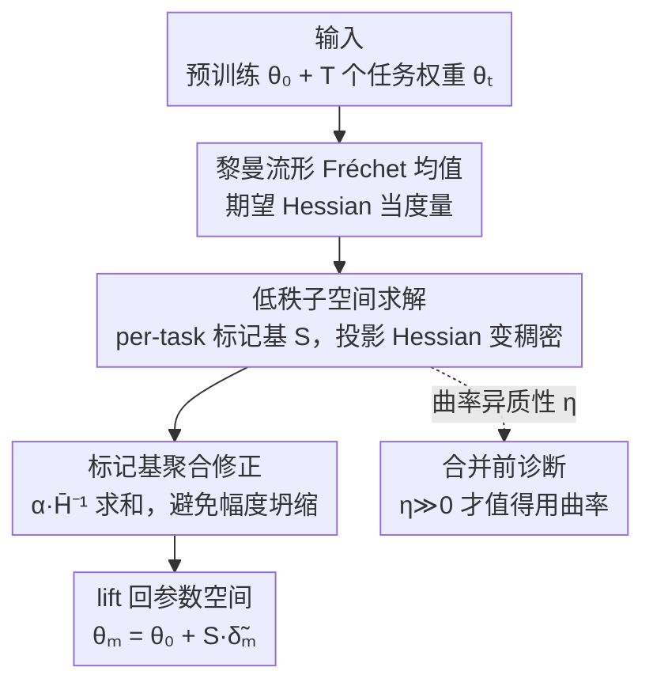

# Model Merging on Loss Landscape: A Geometry Perspective

**会议**: CVPR 2026  
**arXiv**: [2605.26693](https://arxiv.org/abs/2605.26693)  
**代码**: 无（截至笔记时未公开）  
**领域**: 模型压缩 / 模型合并  
**关键词**: 模型合并、损失曲率、黎曼流形、Fréchet 均值、Fisher 信息  

## 一句话总结
本文提出 EpiMer，把模型合并重新表述为「在以期望 Hessian 为度量的黎曼流形上求 Fréchet 均值」，并把计算限制在任务向量张成的低秩子空间里使曲率可精确求解；理论上把合并误差界拆成子空间方差与残差能量、并给出「何时曲率感知合并可证明优于平直几何合并」的闭式判据 $\eta$，实验上在三种 CLIP-ViT backbone 的八任务合并上一致超过最强平直基线 TSV-M。

## 研究背景与动机
**领域现状**：模型合并（model merging）想在不重训、不访问原始数据的前提下，把多个从同一预训练权重微调出来的专家模型「捏」成一个统一模型。主流做法都在平直的欧氏参数空间里操作——直接对任务向量做加权平均，靠性能排名（Model Soups）、任务算术（Task Arithmetic）、启发式冲突消解（TIES）等辅助信息挑权重。

**现有痛点**：这些平直几何方法有一个共同的根本缺陷——**完全忽略损失曲面的几何**。参数空间里不同方向对损失的敏感度天差地别：某个参数动一点点损失就爆炸，另一个参数动很多却几乎没影响。平直平均把所有方向一视同仁，结果合并点可能正好落在某个任务的高损失壁垒上，引发破坏性干扰甚至灾难性遗忘。

**核心矛盾**：想引入曲率（二阶信息）的方法又被另一个问题卡死——在完整参数空间里算或近似 Hessian 要么不可行，要么噪声大到抵消掉理论优势（如全空间对角 Fisher）。而最近的谱方法（TSV-M、Isotropic Merging）干脆绕开曲率、只在任务向量的 SVD 子空间里操作，效果很好却**没有几何理论解释**。于是一个根本问题悬而未决：**曲率到底什么时候真的重要，什么时候平直几何就够用？**

**本文目标**：（R1）给出一个比参数平均更一般、把损失曲面纳入进来的合并问题设定；（R2）刻画曲率感知合并何时可证明有用，并设计一个能在「曲率真正重要的子空间」里利用曲率的实用算法；（R3）能不能在合并之前就预测「这批模型好不好合」。

**切入角度**：作者注意到参数对损失的敏感度，本质上对应参数的**认知不确定性（epistemic uncertainty）**，而它正是由损失的局部曲率（Hessian）刻画的。如果把参数空间建模成一个以期望 Hessian 为度量张量的统计流形，那么「合并」就自然变成在这个弯曲流形上找几何中心。

**核心 idea**：用「黎曼流形上的 Fréchet 均值」代替「欧氏空间里的加权平均」来做模型合并，并把不可行的全空间计算**限制到任务向量张成的低秩子空间**——在那里投影后的 Hessian 既稠密又小到能精确求逆，让曲率感知合并第一次同时做到「有原理」和「可计算」。

## 方法详解

### 整体框架
EpiMer 的输入是一个预训练权重 $\bm{\theta}_0$ 和 $T$ 个从它微调出来的任务权重 $\{\bm{\theta}_t\}$，输出是单个合并权重 $\bm{\theta}_m=\bm{\theta}_0+\bm{S}\tilde{\bm{\delta}}_m^*$。整条流水线分四步：先把合并**重新定义**为损失流形上的 Fréchet 均值（用期望 Hessian 当度量），写出闭式解 $\bm{\delta}_m^*=(\sum_t\lambda_t\bm{H}_t)^{-1}\sum_t\lambda_t\bm{H}_t\bm{\delta}_t$；但这个全空间解算不动，于是**构造一组逐任务标记的低秩基** $\bm{S}$（沿用 TSV-M 的 per-task SVD 因子）把问题压进 $p\ll m$ 维子空间，在那里投影 Hessian $\tilde{\bm{H}}_t=\bm{S}^\top\bm{H}_t\bm{S}$ 变稠密、只需 $kT$ 次 Hessian-向量积就能精确求逆；接着用一个**修正的聚合公式**解出子空间里的 Fréchet 均值（避免标记基带来的幅度坍缩）；最后把解 lift 回原参数空间。整套方法还配一个**曲率异质性诊断量 $\eta$**，能在合并前预测曲率感知到底值不值得用。

### 关键设计

**1. 黎曼流形上的 Fréchet 均值：把曲率写进合并目标本身**

平直方法的痛点是「所有参数方向一视同仁」。本文把参数空间 $\Theta$ 建模成一个可微流形 $\mathcal{M}\subset\mathbb{R}^m$，度量张量取**期望 Hessian** $\bm{G}(\bm{\theta})\triangleq\mathbb{E}_{\bm{x}}[\nabla^2_{\bm{\theta}}\mathcal{L}(\bm{x},\bm{\theta})]$。在局部极小点 Hessian 半正定，是合法的黎曼度量（因过参数化可能退化，故为退化黎曼流形）。这样两点间的测地距离 $d_g^2$ 度量的就是「沿路径搬运参数所累积的总损失变化」——测地线会优先穿过认知不确定性大（损失变化小）的区域。于是合并被重写成在这个弯曲流形上找所有任务模型的几何质心：

$$\bm{\theta}_m\triangleq\underset{\bm{\theta}\in\mathcal{M},\gamma_t}{\arg\min}\sum_{t=1}^T\lambda_t\int_{\gamma_t(0)=\bm{\theta}_t}^{\gamma_t(1)=\bm{\theta}}\dot\gamma_t^\top\bm{G}_t(\gamma_t)\dot\gamma_t\,d\tau$$

作者证明（Proposition 1）：在二阶近似下，最小化多任务损失等价于求这些模型的 Fréchet 均值。把测地线近似成线性路径、度量钉在端点 $\bm{H}_t$ 后，目标退化成关于 $\bm{\delta}_m=\bm{\theta}_m-\bm{\theta}_0$ 的二次型，有闭式解 $\bm{\delta}_m^*=(\sum_t\lambda_t\bm{H}_t)^{-1}\sum_t\lambda_t\bm{H}_t\bm{\delta}_t$。和平直平均的区别在于：曲率 $\bm{H}_t$ 充当权重，让损失敏感方向被优先对齐，而不是无差别地线性叠加

**2. 低秩子空间求解：让全空间不可行的 Hessian 在子空间里变稠密可逆**

闭式解虽然漂亮却没法直接用：全空间 $\sum_t\lambda_t\bm{H}_t$ 是 $m\times m$（$m$ 是百万级参数量），求逆代价是 $\mathcal{O}(m^2)$ 起步；更糟的是，若用单次前反传就能算的**经验 Fisher 对角** $\bm{v}_t=\mathbb{E}_{\bm{x}}[(\nabla_{\bm{\theta}}\mathcal{L}_t)^2]$ 去近似 $\bm{H}_t\approx\mathrm{diag}(\bm{v}_t)$，所有任务共享坐标轴当特征基，矩阵加权解会退化成 Task Arithmetic 的简单重加权——曲率信号被抹平。

本文的解法是把合并限制到一个列正交的低秩子空间 $\bm{S}\in\mathbb{R}^{m\times p}$（$\bm{S}^\top\bm{S}=\bm{I}_p$，$p\ll m$）。**关键观察**：即便 $\bm{H}_t$ 是对角的，投影后 $\tilde{\bm{H}}_t=\bm{S}^\top\bm{H}_t\bm{S}$ 也会变成稠密的 $kT\times kT$ 矩阵，把全空间对角代理丢掉的跨参数曲率信号重新捞回来。子空间基的构造沿用 TSV-M 的 **per-task 标记基**：逐层对每个任务向量做 SVD 取 top-$k$ 三元组，跨任务拼接左右因子后做正交 Procrustes 白化，得到 $kT$ 个秩-1 外积原子 $\{\bm{U}_{\perp,i}\bm{V}_{\perp,i}^\top\}$，每个原子被打上「来自哪个任务」的标记。用 per-task 因子（而非联合正交化）是因为后者有硬秩上限 $T$，会让 EpiMer 坍回 Task Arithmetic。子空间里投影 Hessian 只需 $kT$ 次 HVP、小到能精确求逆

**3. 标记基聚合修正：用 α 缩放消掉「除以 T」带来的幅度坍缩**

标记基带来一个新麻烦：每个原子只属于唯一一个任务，而标准 Fréchet 平均会把每个块除以 $T$，导致严重「欠合并」（under-merge）——合并出来的 delta 幅度被压得太小。作者给了个简单修正，把各任务贡献当作「求和」而非「平均」，同时保留曲率重加权：

$$\tilde{\bm{\delta}}_m^{(\ell)}=\alpha\,\bar{\bm{H}}^{-1}\sum_{t=1}^T\tilde{\bm{H}}_t^{(\ell)}\tilde{\bm{\delta}}_t^{(\ell)},\qquad\bar{\bm{H}}=\tfrac{1}{T}\sum_{t=1}^T\tilde{\bm{H}}_t^{(\ell)}$$

这等于把标准 Fréchet 均值乘上 $\alpha T$ 还原掉平均。$\alpha$ 是和 TSV-M 共享的全局缩放。**为什么这样有效**：在曲率同质极限下它坍缩成 $\alpha\sum_t\tilde{\bm{\delta}}_t$，恰好复现 TSV-M；一旦曲率异质，矩阵求解就按各任务曲率重塑贡献。α-sweep 实验确认这个聚合在每个 rank、每个 backbone 上都压过标准 Fréchet 均值

**4. 曲率异质性诊断 η：合并前就能预测曲率到底值不值得用**

这是本文回答「曲率何时重要」的核心理论产物（Theorem 3）。记平直解 $\tilde{\bm{\delta}}_I=\sum_t\lambda_t\tilde{\bm{\delta}}_t$、曲率感知解 $\tilde{\bm{\delta}}_H=\bar{\bm{H}}^{-1}\sum_t\lambda_t\tilde{\bm{H}}_t\tilde{\bm{\delta}}_t$，两者在合并目标上的差恰好是

$$\mathcal{F}(\tilde{\bm{\delta}}_I)-\mathcal{F}(\tilde{\bm{\delta}}_H)=\bm{c}^\top\bar{\bm{H}}^{-1}\bm{c}=\eta\ge0,\qquad\bm{c}=\sum_t\lambda_t(\tilde{\bm{H}}_t-\bar{\bm{H}})(\tilde{\bm{\delta}}_t-\bar{\bm{\delta}})$$

$\bm{c}$ 是「曲率偏差」与「任务向量偏差」的相关量。$\eta$ 可在 $\mathcal{O}(p^3)$ 内从投影 Hessian 和任务向量算出，且恒非负——意味着曲率感知**永不变差**。当且仅当满足以下三种情况之一时 $\eta=0$、平直几何近最优：(a) 所有任务投影 Hessian 相同（曲率同质）、(b) 所有任务向量相同、(c) 曲率偏差与任务向量偏差不相关。$\eta\gg0$ 时才值得上曲率。这个诊断只有在黎曼框架下才拿得到，而既有平直方法根本无法自检「我的平直假设到底成不成立」。配套的 Theorem 2 还把合并误差界拆成**子空间 Fréchet 方差 $\mathcal{V}_S$**（任务间不可约冲突）+ **残差能量 $\mathcal{R}_S$**（投影丢失的信息）+ 三阶 Taylor 余项，并指出 TSV-M 只最小化了 $\mathcal{R}_S$（取 $\bm{H}_t=\bm{I}$）而完全忽略 $\mathcal{V}_S$，EpiMer 则在标记基上最小化 $\mathcal{V}_S$

> 统一视角（Proposition 2）：子空间 Fréchet 均值能把现有方法收编为特例——$\bm{S}=\bm{I}_m,\tilde{\bm{H}}_t=\bm{I}_m$ 是 Task Arithmetic；$\bm{S}=\bm{I}_m,\tilde{\bm{H}}_t=\mathrm{diag}(\bm{F}_t)$ 是 Fisher Averaging；$\bm{S}=\bm{I}_m,\tilde{\bm{H}}_t=\bm{H}_t$ 是 Gradient Matching；$\bm{S}=$ top-$k$ SVD、$\tilde{\bm{H}}_t=\bm{I}_p$ 是 TSV-M；只有 EpiMer 同时用了非平凡子空间 + 曲率感知度量。

## 实验关键数据

设定：合并八个图像分类任务（Stanford Cars、DTD、EuroSAT、GTSRB、MNIST、RESISC45、SUN397、SVHN）上微调的 CLIP-ViT，三种 backbone（ViT-B/32、ViT-B/16、ViT-L/14），主指标为八任务平均 top-1 准确率。EpiMer 与 TSV-M 都在 $k=32$、各自最优 $\alpha$ 下报告。

### 主实验

| Backbone | AM/TA | TIES | TSV-M | Fisher | **EpiMer** | 微调上限 |
|----------|-------|------|-------|--------|------------|---------|
| ViT-B/32 | .653 | .725 | .822 | .539 | **.833** | .909 |
| ViT-B/16 | .710 | .774 | .865 | .625 | **.870** | .929 |
| ViT-L/14 | .791 | .859 | .906 | .720 | **.906** | .943 |

EpiMer 在三个 backbone 上分别比 TSV-M 高 1.10%、0.48%、0.06%，比 TIES 高 10.8%、9.6%、4.7%。注：ViT-L/14 上 EpiMer 实为 0.9065 vs TSV-M 0.9059（差 0.06 个百分点），三位小数下都显示 .906。全空间对角 Fisher 在每个 backbone 上都崩盘（.539/.625/.720），印证「全空间对角 Fisher 太粗糙」，而子空间投影正是补救之道。

### 消融实验（全局缩放 α 敏感性，$k=32$）

| Backbone | 方法 | α=0.20 | α=0.30 | α=0.50 | α=0.70 | α=1.00 |
|----------|------|--------|--------|--------|--------|--------|
| ViT-B/32 | TSV-M | .630 | .699 | .787 | .822 | .820 |
| ViT-B/32 | EpiMer | .601 | .670 | .764 | .812 | **.833** |
| ViT-B/16 | TSV-M | .688 | .747 | .822 | .857 | .865 |
| ViT-B/16 | EpiMer | .666 | .724 | .804 | .846 | **.870** |
| ViT-L/14 | TSV-M | .772 | .816 | .870 | .895 | .906 |
| ViT-L/14 | EpiMer | .766 | .808 | .863 | .890 | **.906** |

最优 $\alpha$ 落在 $[0.7,1.0]$，远高于文献默认 $1/\sqrt{T}=1/\sqrt{8}\approx0.354$；光是调 $\alpha$ 就能补上大部分到微调上限的差距。在各自最优 $\alpha$ 处 EpiMer 在每个 backbone、每个 rank 都不落后于 TSV-M。

### 最差任务鲁棒性

EpiMer 的最差单任务 top-1 准确率比 TSV-M 高 0.8%、2.4%、0.1%，比 TIES 高 13.3%、15.1%、8.8%（三个 backbone）。说明曲率感知收紧了最差任务的下界、同时保持平均严格领先，并没有以牺牲弱任务为代价。

### 关键发现
- **子空间投影 vs 曲率感知谁更重要**：在 ViT-B/32 上，把 AM/TA 的 delta 投影到同一标记基已经从 0.653 拉到 TSV-M 的 0.822（子空间贡献），曲率感知再推到 0.833（二阶精修贡献）。即「先靠子空间拿大头，曲率做锦上添花」。
- **大 backbone 上边际收缩是饱和而非失效**：ViT-L/14 上 TSV-M 已到 0.906、距微调上限 0.943 仅 3.7%，二阶精修空间本就有限。
- **诊断 $\eta$ 是 within-backbone 信号**：每个 backbone 内 $\eta$ 随 rank $k$ 单调上升、EpiMer 始终保持正边际；但跨 backbone 的 $\eta$ 排序并不能预测跨 backbone 的边际排序（ViT-L/14 的 $\eta$ 最大、边际却最小，因为它已饱和）。
- **经验 Fisher 极度数据高效**：仅用每任务 0.5% 训练数据（batch size 64 下 1–6 个 batch），合并准确率就落在全数据值的 ~0.7% 内，$f=10\%$ 时已饱和——比测试时自适应基线的数据需求小几个数量级。

## 亮点与洞察
- **统一性是最大亮点**：一个「子空间 Fréchet 均值 + 度量选择」框架，把曲率感知传统（Fisher、Gradient Matching）和谱方法传统（TSV-M、Isotropic）收编为同一公式的特例。这种「先建大一统理论、再把自己方法定位成其中最优实例」的叙事很有说服力。
- **「合并前可诊断」这件事很巧**：$\eta=\bm{c}^\top\bar{\bm{H}}^{-1}\bm{c}$ 恒非负且可在 $\mathcal{O}(p^3)$ 算出，相当于给了从业者一个「这批模型值不值得上曲率」的免费体检指标，而平直方法连自检的能力都没有。
- **「对角 Hessian 投影后变稠密」是关键技术 trick**：全空间对角 Fisher 因为共享坐标轴而抹平曲率，但投影到非轴对齐的标记基后立刻恢复跨参数耦合——这个观察可迁移到任何「想用廉价对角近似又怕丢二阶信息」的场景。
- **误差界的两项分解（方差 + 残差能量）** 给「子空间方法为什么 work」提供了清晰解释：TSV-M 只压残差能量、EpiMer 额外压方差，定位非常清楚。

## 局限与展望
- **绝对增益偏小**：在最强基线 TSV-M 之上仅高 1.10%/0.48%/0.06%，ViT-L/14 上几乎追平（0.9065 vs 0.9059）。作者归因于饱和，但这也意味着曲率感知的实际收益高度依赖「基线离上限还有多远」。
- **依赖 Hessian 半正定与局部极小假设**（Assumption 2：微调模型梯度近零）：若微调没收敛到极小、或任务损失非凸到 Hessian 有负特征值，度量合法性存疑。
- **实验面较窄**：只验证了 CLIP-ViT 图像分类八任务，没有 LLM / 多模态 / 更大任务数的合并实验，泛化性待验证。
- **跨 backbone 诊断失灵**：$\eta$ 只能作 within-backbone 信号、不能跨 backbone 比较，限制了它作为通用「可合并性」度量的价值。
- **需要重构经验 Fisher**：公开 checkpoint 只存权重不存优化器状态，须额外前反传一遍（虽然 0.5% 数据即可），相比纯权重平均方法多一步数据访问。

## 相关工作与启发
- **vs TSV-M（最强平直基线）**：两者用**完全相同的 per-task 标记基**，只在聚合上不同——TSV-M 用各向同性度量 $\tilde{\bm{H}}_t=\bm{I}_p$（忽略曲率），EpiMer 用投影 per-task Hessian 做矩阵加权求解。EpiMer 是 TSV-M 的曲率感知超集，在同质曲率极限下严格退化为 TSV-M，故理论上永不更差。
- **vs Fisher Averaging（曲率感知前辈）**：Fisher 在**全参数空间**用对角 Fisher，因共享坐标轴而曲率信号被抹平、实验中全面崩盘；EpiMer 的核心修正就是「先投影到低秩子空间再算曲率」，让对角近似投影后变稠密。
- **vs Task Arithmetic / TIES（平直几何）**：它们在全空间做（带掩码的）线性平均，忽略损失曲面；本文证明它们都是子空间 Fréchet 均值在 $\bm{S}=\bm{I}_m$、特定度量下的特例，并用几何解释了「为什么子空间 + 曲率能更好」。
- **启发**：把「认知不确定性 ↔ 局部曲率 ↔ 黎曼度量」串起来的视角，可迁移到持续学习、迁移学习里的参数重要性加权（如 EWC / Laplace 近似）；「廉价对角近似投影到非轴对齐子空间恢复耦合」的 trick 也适用于任何二阶优化的低秩近似。

## 评分
- 新颖性: ⭐⭐⭐⭐⭐ 首次用退化黎曼流形 + Fréchet 均值统一曲率感知与谱方法，并给出闭式可合并性诊断
- 实验充分度: ⭐⭐⭐⭐ 三 backbone × 八任务 + α/rank/数据效率/最差任务多角度消融扎实，但仅限 CLIP-ViT 图像分类、绝对增益偏小
- 写作质量: ⭐⭐⭐⭐⭐ 理论推导清晰、统一表（Table 1）和特例命题让定位一目了然
- 价值: ⭐⭐⭐⭐ 理论贡献强、诊断量实用，但相对最强基线的经验增益有限，落地价值取决于基线饱和程度

<!-- RELATED:START -->

## 相关论文

- [\[CVPR 2026\] LiteVGGT: Boosting Vanilla VGGT via Geometry-aware Cached Token Merging](litevggt_boosting_vanilla_vggt_via_geometry-aware_cached_token_merging.md)
- [\[CVPR 2026\] Bridging Domains through Subspace-Aware Model Merging](bridging_domains_through_subspace-aware_model_merging.md)
- [\[CVPR 2026\] Batch Loss Score for Dynamic Data Pruning](batch_loss_score_for_dynamic_data_pruning.md)
- [\[ICCV 2025\] FREE-Merging: Fourier Transform for Efficient Model Merging](../../ICCV2025/model_compression/free-merging_fourier_transform_for_efficient_model_merging.md)
- [\[ICLR 2026\] RAIN-Merging: A Gradient-Free Method to Enhance Instruction Following Through Model Merging](../../ICLR2026/model_compression/rain-merging_a_gradient-free_method_to_enhance_instruction_following_through_mod.md)

<!-- RELATED:END -->
