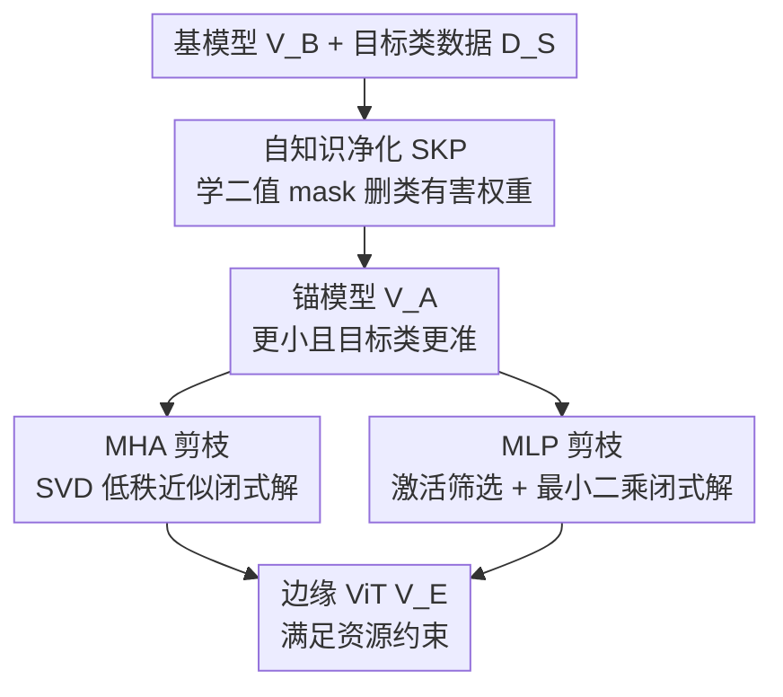

# NuWa: Deriving Lightweight Class-Specific Vision Transformers for Edge Devices

**会议**: CVPR 2026  
**arXiv**: [2504.03118](https://arxiv.org/abs/2504.03118)  
**代码**: https://github.com/CGCL-codes/NuWa (有)  
**领域**: 模型压缩  
**关键词**: 结构化剪枝、类特定模型、闭式解、免训练剪枝、边缘部署

## 一句话总结
针对「边缘设备只关心几个类别」这一被忽视的场景，NuWa 先用自知识净化（SKP）学一组二值 mask 删掉「对目标类有害的权重」，再把 MHA/MLP 的剪枝写成可求闭式解的优化问题，从而**无需重训练**就能从大 ViT 派生出比原模型在目标类上**还更准**、且推理更快的小 ViT，剪枝速度比最好的训练依赖方法快 33.69×、成本降低最多 99.83%。

## 研究背景与动机
**领域现状**：把 ViT 部署到无人机、智能车这类资源受限的边缘设备上，主流做法是模型压缩，其中结构化剪枝因为产出规整、硬件友好、可迁移基模型权重做初始化，被认为最适合边缘场景。这些剪枝方法分两类：训练免（training-free，用 magnitude/activation/gradient 等重要性指标剪权重）和训练依赖（training-dependent，剪完再重训练恢复精度）。

**现有痛点**：所有这些方法的目标都是「让小模型尽量逼近大模型在**全部类别**上的表现」，却忽略了一个现实——边缘设备往往只需要识别特定几类（智能车只关心行人、车辆、交通标志，不需要花鸟知识）。在这种「类特定派生」场景下，朴素地把校准集换成类特定数据并不够，作者发现两个根本缺陷：① **存在「类有害权重」**——随机从 DeiT-Base 的 MLP 删掉一些神经元，目标类精度反而**上升**（Fig.1），说明基模型里有一批权重专门拖累目标类，但传统重要性指标根本识别不出它们（Fig.4）；② **大规模派生成本爆炸**——不同场景类别不同、设备资源不同，要海量定制模型，而训练依赖方法每个都要搜配置 + 重训练，且中间结果不可复用，新类别/新剪枝率得从头来。

**核心矛盾**：训练免方法天生假设「剪枝必然掉精度、只能逼近不能超越基模型」，所以永远删不掉类有害权重；训练依赖方法虽能注入类特定知识，但同样识别不出类有害权重，还被重训练拖成天文级时间/成本。两类方法都在「剪枝必降精度」的框框里打转。

**本文目标**：在类特定场景下，既要**识别并删除类有害权重**（让小模型反超基模型），又要**不靠重训练**地快速、可复用地派生大量定制小 ViT。

**切入角度**：作者观察到「删某些权重反而涨精度」这一反直觉现象，把它视作 ViT 内部的「免费午餐」——与其逼近基模型，不如主动挖出并丢弃那些专门干扰目标类的权重。

**核心 idea**：用一组可学习的二值 mask 让冻结的基模型自己「招供」哪些权重是类有害的（SKP），再把剩余压缩任务写成有闭式解的低秩/最小二乘问题（OFP），全程不重训练。

## 方法详解

### 整体框架
NuWa 输入一个预训练大 ViT $\mathcal{V}_B$、一组目标类 $\mathcal{S}$ 及其类特定数据 $\mathcal{D_S}$、以及边缘设备的资源约束（用 GFLOPs 表达），输出一个专门服务这几类、且满足资源约束的小 ViT $\mathcal{V}_E$。整条流水线分两步串行：第一步 **Self-Knowledge Purification（SKP）** 冻结 $\mathcal{V}_B$，只在每个 MLP 里塞入可学习的 mask 向量与控制因子，用原任务损失驱动模型自己学出哪些神经元该删，删完得到一个**更小但在目标类上更准**的「锚模型」$\mathcal{V}_A$；第二步 **Optimization-based Fast Pruning（OFP）** 把 $\mathcal{V}_A$ 进一步压到资源约束以下——把 MHA 的剪枝写成低秩近似（SVD 闭式解）、把 MLP 的剪枝写成最小二乘（闭式解），直接算出剪枝后权重，不需要任何梯度回传重训练。

### 关键设计

**1. 自知识净化 SKP：让冻结的基模型自己交代哪些权重在害目标类**

针对「类有害权重存在、但传统重要性指标识别不出」这个痛点，SKP 不去设计新的重要性度量，而是**构造一个剪枝空间让模型自学**。具体做法：冻结 $\mathcal{V}_B$，在每个 MLP 的下采样权重 $W_2^{(l)}$ 前插入一个可学习 mask 向量 $M^{(l)}\in\mathbb{R}^{e_l}$ 和一个控制因子 $\beta^{(l)}\in\mathbb{R}^1$，再对 $M^{(l)}$ 做基于 $\beta^{(l)}$ 的二值化：

$$M^{(l)}_{\text{bin}}[i]=\begin{cases}1,&M^{(l)}[i]\ge \text{Sel}_{\lfloor e_l\cdot\sigma(\beta^{(l)})\rfloor}(M^{(l)})\\0,&\text{otherwise}\end{cases}$$

其中 $\text{Sel}_k(v)$ 取向量第 $k$ 大的值、$\sigma$ 是 sigmoid——也就是说 $\beta^{(l)}$ 通过 $\sigma(\beta^{(l)})$ 控制每层保留多少比例的神经元，mask 自己学哪些该留。二值 mask 乘进 MLP 前向（$M^{(l)}_{\text{bin}}[i]=0$ 等价于删掉 $W_1^{(l)}$ 的第 $i$ 行和 $W_2^{(l)}$ 的第 $i$ 列）。为解决二值化不可导，用直通估计器 STE：拿 $M^{(l)}_{\text{bin}}$ 的梯度当 $M^{(l)}$ 的代理梯度、用内积 $\langle M^{(l)}_{\text{bin}},G^{(l)}\rangle$ 当 $\beta^{(l)}$ 的代理梯度。训练时**只用原始视觉任务损失 $\mathcal{L}_T$ + 类特定数据 $\mathcal{D_S}$，不加任何额外正则项**，模型就会自发把那些一删反而降低 $\mathcal{L}_T$ 的权重（即类有害权重）mask 掉，最终按 $\mathcal{M}_{\text{bin}}$ 真正裁剪 MLP 得到锚模型 $\mathcal{V}_A$。为保证插入 mask 前后等价，$\beta^{(l)}$ 初始化为 5.0（$\sigma(5.0)\approx1.0$，遵循 function-preserving 原则）。SKP 只更新不到 0.05% 的参数，且小 batch（实测 batch=1）能让模型更充分探索剪枝空间，因此非常高效。与随机剪枝相比，它能拿到更高剪枝率 + 更大的目标类精度提升。作者还从可解释性上验证（Fig.8）：SKP 主要是**压低非目标类 $\mathcal{S}^c$ 的输出概率**、减少误分到非目标类，从而让模型聚焦目标类；实践中进一步给 $\mathcal{V}_A$ 分类器里非目标类加一个很大的负 bias（如 -100），彻底杜绝误分到 $\mathcal{S}^c$。

**2. OFP-MHA 剪枝：把注意力降维写成低秩近似，用 SVD 一步求最优**

锚模型往往还压不到资源约束以下，需要继续剪。SKP 只动 MLP（实验证明只在 MLP 上做 SKP 效果最好），OFP 则负责 MHA。对 MHA，NuWa 不剪整个注意力头，而是剪更细粒度的 **QK 维 $q_l$ 和 VO 维 $v_l$**——理由有二：细粒度维度比整头有更高压缩潜力；且 $W_{QK}=W_Q^\top W_K$、$W_{VO}=W_V^\top W_O^\top\in\mathbb{R}^{d\times d}$ 是两次权重相乘的中间维，**与输入特征 $\mathbf{X}$ 无关**，所以一次剪枝结果可在所有子任务间共享（这正是大规模部署省钱的关键）。把剪 QK 维写成：在 $\|W_Q^\top W_K - W_Q'^\top W_K'\|_F^2$ 最小、且秩 $q_l'<q_l$ 的约束下找最优——这就是经典低秩近似，由 Eckart-Young 定理保证 SVD 给出全局最优。于是对 $W_{QK}$ 做 SVD，取前 $q_l'$ 个奇异向量重组出 $W_Q',W_K'$（QK 路还乘上能量补偿因子 $\sqrt{q_l'/q_l}$），VO 路同理。剪多深由超参 $\rho$（保留奇异值能量占总能量的比例）自适应决定：在 $\frac{1}{H_l}\sum_h(\sum_{i=1}^{q_l'-1}\sigma_i^2/\sum_{i=1}^{q_l}\sigma_i^2)<\rho$ 下确定 $q_l'$。调 $\rho$ 即可平衡 MHA 与 MLP 之间的剪枝强度分配。这一步数据无关、可跨子任务与剪枝率复用。

**3. OFP-MLP 剪枝：用激活值选神经元，再用最小二乘闭式补偿剩余权重**

MHA 剪完后，OFP 继续剪 MLP 中间维以达到总剪枝率 $\alpha$。为避免某些 block 被剪过头、并提升推理效率，NuWa 让各层 MLP 尽量剪到相近大小：$e_l'=\min(e_l,\lfloor(\sum_i e_i - e_{\text{prune}})/L\rfloor)$。选哪些神经元留下不靠随机，而是先在 $\mathcal{D_S}$ 上前向一遍算出每个神经元跨所有 patch 的**平均激活值** $a_i^{(l)}$，保留激活最高的前 $e_l'$ 个（索引记为 $\mathcal{I}_r^{(l)}$）。但光删掉低激活神经元会丢知识，所以再用 $K=128$ 张采样图的逐块激活特征 $\mathcal{H}^{(l)}$ 求解一个最小二乘问题 $\min_{W_2'}\|\mathcal{H}^{(l)}W_2^{(l)\top}-\mathcal{H}^{(l)}[\mathcal{I}_r^{(l)}]W_2'^\top\|_F^2$，让保留下来的神经元**通过补偿后的权重去逼近原始 MLP 的整体输出**。该问题有闭式解：$W_1'=W_1[\mathcal{I}_r]$、$W_2'=W_2\mathcal{H}^\top\mathcal{H}_r(\mathcal{H}_r^\top\mathcal{H}_r)^\dagger$（$\dagger$ 为伪逆）。这样既删了神经元又把它们的「贡献」吸收进留下的权重，最大限度保住类特定知识，全程一次矩阵运算、无需重训练。

### 损失函数 / 训练策略
SKP 阶段只优化 mask $\mathcal{M}$ 与控制因子 $\mathcal{B}$（mask 学习率 0.001、$\beta$ 学习率 0.1），监督信号就是**原始视觉任务损失 $\mathcal{L}_T$**（无任何额外正则），优化器 AdamW，总步数 $10^4$，batch size = 1。OFP 阶段无梯度训练，全部是 SVD / 最小二乘闭式求解；$\rho$ 按目标剪枝率自适应、校准样本数 $K=128$，剪枝率以 GFLOPs 度量。可选地在派生后做轻量 10 epoch 微调（NuWa(FT)）进一步提升。

## 实验关键数据

### 主实验
模型：DeiT-B/S/T、ViT-L/16、Fast/Mask R-CNN(Swin-T)；数据集：ImageNet-1K、CIFAR-100/10、COCO2017。子任务 $\mathcal{S}_i/N$ 表示从数据集随机选 $N$ 个类。硬件：RTX 4090 / Jetson Orin NX。

DeiT-Base 上类特定精度（节选 25 类子任务，对比训练依赖方法，剪枝率 0.40 / 0.60）：

| 配置 | $\mathcal{S}_4$/25 (α=0.4) | Avg(25类,α=0.4) | Avg(25类,α=0.6) | 是否重训练 |
|------|------|------|------|------|
| DeiT-Base（基模型） | 79.92 | 81.05 | 81.05 | — |
| X-Pruner（最佳训练依赖） | 95.44 | 96.11 | 92.58 | 是 |
| RECAP | 95.04 | 95.71 | 90.40 | 是 |
| MDP | 93.36 | 94.61 | 92.40 | 是 |
| **NuWa**（免训练） | 94.40 | 96.05 | 91.44 | **否** |
| **NuWa (FT, 10ep)** | 96.16 | **96.64** | **95.95** | 轻微 |

要点：免训练的 NuWa 在 0.40/0.60 剪枝率下分别比基模型涨 15.37%/10.04%，达到 X-Pruner/RECAP/MDP 平均精度的 99.35%/100.03%/100.23%；加轻量 FT 后反超它们 2.00%/2.64%/2.82%。对比训练免方法（Magnitude/Wanda-sp/Numerical），NuWa 在 0.60 剪枝率下比基模型最高涨 **20.60%**、比最佳训练免方法 Numerical 最高高 **29.00%**——而后者**永远无法超越基模型**。

派生效率（$N$=50 子任务 × $M$=10 异构设备，需 $MN$ 个模型，AWS g5.48xlarge 计价）：

| 方法 | 单模型开销(GPU·h, |S|=25) | 总成本($) | 平均精度(%) |
|------|------|------|------|
| X-Pruner | 2.50 | $23074 | 93.77 |
| RECAP | 2.25 | $20767 | 93.13 |
| MDP | 5.61 | $51959 | 92.95 |
| **NuWa** | **0.08** | **$59.12** | 93.16 (↓0.61) |

NuWa 相比最佳的 X-Pruner 单模型剪枝**加速 33.69×**、仅掉 0.61% 精度；$N$=50,$M$=10 大规模部署下时间/成本最多降 **99.83%**（对其他基线降 99.70%/99.82%/99.93%）。

推理加速（九个模型平均，vs DeiT-Base）：

| 配置 | Orin NX 延迟 | RTX4090 延迟 | 显存↓(Orin) | 参数量(M) | FLOPs(G) |
|------|------|------|------|------|------|
| DeiT-Base | 45.45ms | 274.27ms | — | 86.57 | 17.57 |
| NuWa(α=0.40) | 29.70ms (1.53×) | 186.01ms (1.47×) | 38.24% | 51.75 | 10.53 |
| NuWa(α=0.60) | 22.01ms (2.07×) | 142.52ms (1.92×) | 58.82% | 34.48 | 7.00 |

### 消融实验
DeiT-Base，α=0.6，$\mathcal{S}_4$–$\mathcal{S}_6$/25 平均：

| 配置 | 平均精度 | 说明 |
|------|---------|------|
| NuWa（完整） | 91.44 | — |
| w/o SKP | 72.69 (↓18.75) | 去掉自知识净化，模型无法聚焦目标类 |
| w/o MHA pruning | 76.05 (↓15.39) | 不剪 MHA，破坏 ρ 对两模块强度的平衡 |
| w/o MLP pruning | 5.49 (↓85.95) | 不剪 MLP，几乎崩溃（MLP 占 2/3 参数） |
| w/o Activation | 86.45 (↓4.99) | 随机选神经元而非按激活值选 |
| w/o Optimization | 76.69 (↓14.75) | 直接删低激活行而非用闭式最小二乘补偿 |

### 关键发现
- **MLP 剪枝最关键**：去掉 MLP 剪枝精度暴跌 85.95%（MLP 占 ViT 约 2/3 参数）；SKP 次之（↓18.75），证明删类有害权重是「反超基模型」的根本来源。
- **闭式补偿不可替代**：用闭式最小二乘补偿 vs 直接删低激活行，差 14.75%，说明把被删神经元的贡献吸收进留存权重很重要。
- **SKP 拆解**：SKP 平均贡献 22.61% 剪枝率；α=0.60 时 OFP 再对 MHA/MLP 各贡献 14.67%/22.72%。模型越大、类有害权重比例越高（锚模型剪枝率随模型增大而上升）。
- **batch=1 最好**：SKP 时更小 batch 让模型更充分探索剪枝空间，得到更高锚模型剪枝率，同时还更快。
- **超参不敏感**：$K=128$ 张校准图就足以求出最优闭式解；$\rho$ 随 $\alpha$ 增大而最优值减小（大剪枝率应把更多比例分给 MHA）。

## 亮点与洞察
- **「剪枝反而涨精度」被正名**：本文最「啊哈」的地方是把 Fig.1 那个反直觉现象（随机删神经元目标类精度上升）提炼成「类有害权重」概念，并指出它是类特定场景独有的免费午餐——这直接打破了「剪枝必降精度、只能逼近基模型」的隐含假设。
- **让模型自己招供，而非设计新指标**：传统思路是发明更好的重要性度量去找该删的权重；NuWa 反其道，用可学 mask + STE + 纯任务损失让冻结模型自己学出该删谁，绕开了「类有害权重无法被任何已知指标捕捉」的死结。这个「构造剪枝空间让模型自学」的范式可迁移到任意需要数据驱动结构搜索的压缩任务。
- **把剪枝重新表述为有闭式解的优化**：MHA 剪枝 = 低秩近似（SVD）、MLP 剪枝 = 最小二乘补偿（伪逆），都有解析解，彻底干掉重训练。这是免训练剪枝能做到 33.69× 加速的核心。
- **可复用性是大规模部署的胜负手**：$W_{QK}/W_{VO}$ 与输入无关、SVD 结果跨子任务/剪枝率共享，$\mathcal{P}_2$ 可跨剪枝率复用——这让「海量定制模型」从每个从头算变成大部分中间结果摊销，成本降两到三个数量级。

## 局限与展望
- 作者承认 SKP 只对 MLP 有效（在 MHA 上做 SKP 反而更差），意味着「类有害权重」的可学习识别尚未推广到注意力模块，机制理解还不完整。
- 反超基模型有「剪枝率上限」：DeiT-Tiny/Small/ViT-Large 分别要剪枝率低于 0.40/0.50/0.60 才能稳超基模型，检测/分割任务更是要 backbone 剪枝率低于 0.40——大剪枝率下仍会掉到基模型以下，本质受限于类有害权重的总量。
- 评测目标类都是**随机选取**的子集，没有探讨类别语义相近（如细粒度近邻类）时类有害权重是否依然存在、SKP 是否仍奏效；现实边缘场景的类集往往是语义聚簇的。
- 给非目标类分类器加 -100 负 bias 是个工程 trick，依赖「测试时输入一定落在目标类内」的封闭世界假设，遇到开放集/分布外输入可能反受其害。

## 相关工作与启发
- **vs 训练免结构化剪枝（Magnitude / Wanda-sp / Numerical）**：它们靠重要性指标剪权重、目标是逼近基模型，因此**永远无法超越基模型**且识别不出类有害权重；NuWa 用 SKP 主动删害、闭式解补偿，在目标类上反超基模型最高 29.00%。
- **vs 训练依赖结构化剪枝（X-Pruner / DC-ViT / RECAP / MDP）**：它们能用类特定数据但靠重训练恢复精度，单模型要数 GPU·小时、大规模部署成本数万美元，且中间结果不可复用；NuWa 免训练、可复用，单模型加速 33.69×、成本降最多 99.83%，精度仅差 0.61%。
- **vs 知识蒸馏 / 量化 / 非结构化剪枝**：蒸馏难给到合适尺寸的 student、从头训昂贵；低比特量化与非结构化剪枝需要专用推理基建，限制在异构边缘设备上的通用性。NuWa 选结构化剪枝正是看中其规整产出 + 可迁移基模型权重初始化，且能与这些方法叠加进一步压缩。

## 评分
- 新颖性: ⭐⭐⭐⭐⭐ 首次提出「类特定 ViT 派生」问题与「类有害权重」概念，并给出自学 mask + 闭式解的全新解法。
- 实验充分度: ⭐⭐⭐⭐⭐ 六模型四数据集，覆盖分类/检测/分割，主对比 + 效率 + 加速 + 消融 + 超参 + 可解释性齐全。
- 写作质量: ⭐⭐⭐⭐ 动机与方法叙述清晰，Fig.1 的反直觉切入很有说服力；闭式解推导细节多放在补充材料，正文略需对照。
- 价值: ⭐⭐⭐⭐⭐ 把大规模边缘定制模型的成本压两三个数量级，工程落地价值极高。

<!-- RELATED:START -->

## 相关论文

- [\[AAAI 2026\] Lightweight Optimal-Transport Harmonization on Edge Devices](../../AAAI2026/model_compression/lightweight_optimal-transport_harmonization_on_edge_devices.md)
- [\[CVPR 2026\] BinaryAttention: One-Bit QK-Attention for Vision and Diffusion Transformers](binaryattention_one-bit_qk-attention_for_vision_and_diffusion_transformers.md)
- [\[CVPR 2026\] Saliency-Driven Token Merging for Vision Transformers](saliency-driven_token_merging_for_vision_transformers.md)
- [\[CVPR 2026\] MEMO: Human-like Crisp Edge Detection Using Masked Edge Prediction](memo_human-like_crisp_edge_detection_using_masked_edge_prediction.md)
- [\[CVPR 2026\] Vision-Oriented Lightweight Neural Architecture Search with Budget-Adaptive Evaluation](vision-oriented_lightweight_neural_architecture_search_with_budget-adaptive_eval.md)

<!-- RELATED:END -->
