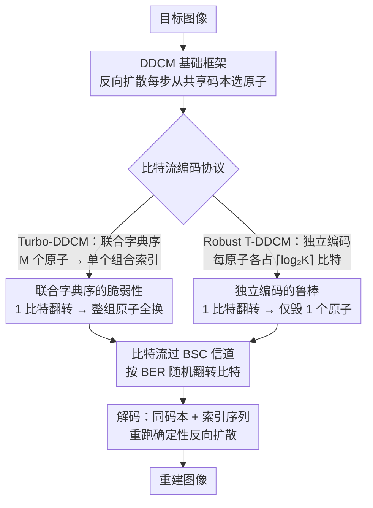

# On the Robustness of Diffusion-Based Image Compression to Bit-Flip Errors

**会议**: CVPR 2026  
**arXiv**: [2604.05743](https://arxiv.org/abs/2604.05743)  
**代码**: 无（论文提及 reference implementation 但未给出具体链接）  
**领域**: 图像压缩 / 模型鲁棒性  
**关键词**: 扩散模型, 图像压缩, 比特翻转, 信道鲁棒性, 反向信道编码

## 一句话总结

首次系统研究了扩散模型图像压缩在比特翻转错误下的鲁棒性，发现基于反向信道编码（RCC）的扩散压缩方法天然比传统和学习型编解码器更耐错，并提出 Robust Turbo-DDCM 变体通过独立编码原子索引进一步提升鲁棒性，在 BER 达 $10^{-3}$ 时仍保持良好重建质量。

## 研究背景与动机

1. **领域现状**：神经图像压缩近年取得显著进展，在极低比特率下实现了强感知质量。扩散模型已成为图像压缩的强大范式，通过端到端训练、预训练模型复用或零样本方式实现了 SOTA 的率-失真-感知权衡。代表方法包括 DDCM、Turbo-DDCM、DiffC 等基于 RCC 的零样本扩散压缩。

2. **现有痛点**：实际系统面临比特翻转错误（BFE）的挑战——传输噪声、硬件退化、甚至恶意攻击（如 rowhammer）都可能导致压缩表示中的比特翻转。少量比特翻转就可能严重降低重建质量，甚至使文件无法解码。现有实践依赖纠错码（ECC），但 ECC 会增加压缩表示的大小，恶化率-失真性能。

3. **核心矛盾**：图像压缩方法的优化通常只关注率-失真-感知权衡，而鲁棒性几乎未被考虑。传统编解码器使用变长熵编码（如 Huffman、算术编码），一个比特错误就可能导致解码失步、错误传播到后续所有符号。

4. **本文目标** 扩散压缩能否在提供更高压缩的同时也提供更强的鲁棒性？如何进一步增强其比特翻转鲁棒性？

5. **切入角度**：RCC 方法的压缩表示编码的是引导去噪轨迹的控制信号，而非直接的像素值或变换系数。这种间接表示可能天然具有对小扰动的容忍度——少量比特翻转仍可能产生相似的引导信号和重建轨迹。

6. **核心 idea**：将 Turbo-DDCM 的联合字典序编码改为独立编码每个原子索引，使单个比特翻转仅影响一个原子而非整个子集选择，以 BPP 的微小增加换取显著的鲁棒性提升。

## 方法详解

### 整体框架

这篇论文要回答两个问题：基于反向信道编码（RCC）的零样本扩散压缩为什么天然抗比特翻转，以及怎么把这种抗错能力再往上推一截。它不动模型也不重新训练，整条 pipeline 沿用 DDCM / Turbo-DDCM——编码器在反向扩散的每一步从一个固定码本里挑原子来引导去噪轨迹逼近目标图像，被挑中的原子索引序列就是压缩表示；解码器拿同一份码本和同一串索引，重跑一遍确定性的反向扩散就还原出图像。论文先把 RCC 抗错的根因讲清楚（DDCM 基础框架），再指出 Turbo-DDCM 在比特流编码协议上留了个漏洞（联合字典序编码的脆弱性），最后只改这一处编码方式（改成独立编码）就换来数量级的鲁棒性提升。下图是整条数据流，中间的「比特流编码协议」分叉正是脆弱与鲁棒两个变体的分水岭：

### 关键设计

**1. DDCM 基础框架：用确定性码本选择替代随机采样，让索引成为压缩的全部**

RCC 抗错的根源要从 DDCM 怎么做压缩说起。标准扩散采样每一步都从高斯分布里随机抽噪声，DDCM 把这一步换成从一个编码器和解码器共享、可复现的码本 $\mathcal{C}_t$ 里挑 $K$ 个候选高斯向量中的一个。编码时挑的是与当前去噪残差 $\mathbf{x}_0 - \hat{\mathbf{x}}_{0|t}$ 最相关的那个原子：

$$k_t = \arg\max_k \langle \mathbf{C}_t(k),\ \mathbf{x}_0 - \hat{\mathbf{x}}_{0|t} \rangle$$

整段轨迹走完，留下的索引序列 $\{k_t\}$ 就是全部压缩信息，比特流大小 BPP $= T\lceil\log_2 K\rceil$ / 像素数。关键在于：这串索引编码的不是像素值、也不是变换系数，而是引导去噪走向的"控制信号"。一个比特翻了，对应那一步挑了个相邻的原子，引导方向只是略微偏一点，轨迹整体仍收敛到相似的重建——这正是 RCC 抗错的物理来源，扰动作用在间接的控制量上而非直接的数据上。

**2. Turbo-DDCM 的脆弱性分析：联合字典序编码把多个原子的命运绑在了一起**

Turbo-DDCM 为了提质，把每步的单原子选择换成稀疏逼近——一次挑 $M$ 个原子，再把这个 $M$ 元子集编码成一个字典序索引，占 $\lceil\log_2\binom{K}{M}\rceil$ bits。压缩效率是上去了，但抗错的好底子被这层编码毁掉了：字典序把整个子集压成一个整数，翻转其中任意一位都会跳到一个完全不同的子集。以 $K=8, M=3$ 为例，索引 0 解码出 $\{0,1,2\}$，把最高位一翻变成索引 32，解码出的却是 $\{1,4,7\}$——一个比特错误，三个原子全换了。错误被这种耦合放大，单点扰动变成了整步去噪方向的崩坏。

**3. Robust Turbo-DDCM：独立编码每个原子索引，把错误影响锁在一个原子内**

既然脆弱性来自"把 $M$ 个原子绑成一个索引"，修法就是把它们解绑。Robust Turbo-DDCM 不再做字典序联合编码，而是把选中的每个原子各自独立编码成 $\lceil\log_2 K\rceil$ bits。这样一个比特翻转最多只能毁掉一个原子的选择，剩下 $M-1$ 个原子照常引导轨迹，单步偏差被局部化、不再级联。代价是比特流略大，BPP 变成 $(T-1-N)(M\lceil\log_2 K\rceil + MC)$ / 像素数——同等 BPP 下能塞进去的原子数比原版少。但论文观察到重建质量随 $M$ 增大本就收益递减，所以少几个原子带来的质量损失有限，换来的却是 BER 高一个量级时仍近乎无损的鲁棒性，这笔显式权衡很划算。

### 损失函数 / 训练策略

本方法是零样本的，不需要训练，直接用预训练的 Stable Diffusion 2.1 作扩散骨干。压缩和解压全是码本选择的确定性算法，唯一的改动落在比特流编码协议上（联合字典序 → 独立索引），不触碰模型架构或采样逻辑。

## 实验关键数据

### 主实验

Kodak24 数据集上 BER=$10^{-4}$ 时的重建质量：

| 方法 | 类型 | BPP | PSNR (无噪声) | PSNR (BER=1e-4) | 文件损坏率 |
|------|------|-----|-------------|-----------------|-----------|
| JPEG | 传统 | 1.0 | ~30 | 严重退化 | 高 |
| BPG | 传统 | 0.5 | ~30 | 严重退化 | 高 |
| ILLM | 学习型 | ~0.1 | ~28 | 严重退化 | 高 |
| StableCodec | 扩散 | ~0.1 | ~25 | 严重退化 | 高 |
| DDCM | RCC | ~0.1 | ~24 | 保持良好 | 0% |
| Turbo-DDCM | RCC | ~0.1 | ~25 | 轻微退化 | 0% |
| **Robust T-DDCM** | RCC | ~0.1 | ~24 | **近乎无损** | **0%** |

### 消融实验

| 配置 | BER=1e-4 PSNR | BER=1e-3 PSNR | BER=1e-2 文件损坏率 |
|------|--------------|--------------|-------------------|
| JPEG | 严重退化 | 不可用 | >80% |
| Turbo-DDCM | 轻微退化 | 明显退化 | 0% |
| Robust Turbo-DDCM | 近乎无损 | 近乎无损 | 0% |
| 无噪声下率-失真 | Turbo-DDCM 略优 | — | — |

### 关键发现

- 非 RCC 方法的 PSNR 在 BER ~$10^{-5}$ 就开始急剧下降，而 RCC 方法退化缓慢得多
- Robust Turbo-DDCM 在 BER=$10^{-3}$ 下仍保持近乎无损的重建，其他所有方法在此噪声水平下都已严重退化或不可用
- 在 "文件损坏率" 指标上，非 RCC 方法在 BER ~$10^{-2}$ 时超过 80% 文件损坏，而所有 RCC 方法在全 BER 范围内保持 0%
- RCC 的鲁棒性优势并非仅因为不使用熵编码——在使用和不使用熵编码的方法组内都能观察到鲁棒性差异
- 无噪声条件下 Robust Turbo-DDCM 的率-失真-感知性能略逊于 Turbo-DDCM，这是鲁棒性换压缩效率的预期代价

## 亮点与洞察

- **发现了扩散压缩的"附赠"属性**：RCC 方法不仅提供更高压缩率，还天然提供更好的比特翻转鲁棒性。这是因为压缩表示编码的是去噪轨迹的控制信号而非直接数据，小扰动仍可能产生相似轨迹
- **编码协议对鲁棒性至关重要**：仅修改比特流编码方式（联合→独立），不改变模型架构或算法逻辑，就能获得数量级的鲁棒性提升。这提示压缩系统设计中编码协议的重要性被低估
- **可能颠覆传统压缩-纠错分离 pipeline**：如果压缩表示本身足够鲁棒，就可以使用更弱的 ECC 甚至不用 ECC，节省带宽并简化系统设计

## 局限与展望

- 仅评估了二元对称信道（BSC）的独立比特翻转，未考虑突发错误或其他结构化信道模型
- 部分方法使用了熵编码而 DDCM/Turbo-DDCM 没有，难以完全分离表示鲁棒性和编码方案的贡献
- RCC 方法的编解码速度远慢于传统编解码器（需要完整的扩散采样），实时性是实用障碍
- 仅在 Kodak24 和 DIV2K 上评估，未测试更大规模或更多样的图像数据集
- 未与联合信源信道编码（JSCC）方法进行对比

## 相关工作与启发

- **vs JPEG/BPG**: 传统编解码器使用变长熵编码，一个比特错误可导致解码失步和级联错误传播，鲁棒性极差
- **vs Turbo-DDCM**: Robust Turbo-DDCM 仅修改编码协议，将联合字典序索引改为独立索引，以~20%的 BPP 增加换取 BER=$10^{-3}$ 下近乎无损的重建
- **vs DiffC**: DiffC 同属 RCC 方法也展现出良好鲁棒性，但 Robust Turbo-DDCM 在高 BER 下进一步领先
- 这项工作可以启发无线通信领域在设计端到端传输系统时考虑生成式压缩的天然鲁棒性

## 评分

- 新颖性: ⭐⭐⭐⭐ 首次系统研究扩散压缩的比特翻转鲁棒性，发现有趣且具有实际意义
- 实验充分度: ⭐⭐⭐⭐ 横跨多种 BER 值和压缩方法类型的系统评估，但数据集有限
- 写作质量: ⭐⭐⭐⭐⭐ 问题动机清晰，分析深入浅出，脆弱性原因的解释（字典序编码例子）非常直观
- 价值: ⭐⭐⭐⭐ 揭示了扩散压缩的新优势维度，对通信和压缩系统设计有启发价值

<!-- RELATED:START -->

## 相关论文

- [\[CVPR 2026\] CADC: Content Adaptive Diffusion-Based Generative Image Compression](cadc_content_adaptive_diffusion-based_generative_image_compression.md)
- [\[CVPR 2026\] BinaryAttention: One-Bit QK-Attention for Vision and Diffusion Transformers](binaryattention_one-bit_qk-attention_for_vision_and_diffusion_transformers.md)
- [\[NeurIPS 2025\] One-Step Diffusion-Based Image Compression with Semantic Distillation](../../NeurIPS2025/model_compression/one-step_diffusion-based_image_compression_with_semantic_distillation.md)
- [\[CVPR 2026\] Block-based Learned Image Compression without Blocking Artifacts](block-based_learned_image_compression_without_blocking_artifacts.md)
- [\[CVPR 2026\] Mitigating The Distribution Shift of Diffusion-based Dataset Distillation](mitigating_the_distribution_shift_of_diffusion-based_dataset_distillation.md)

<!-- RELATED:END -->
