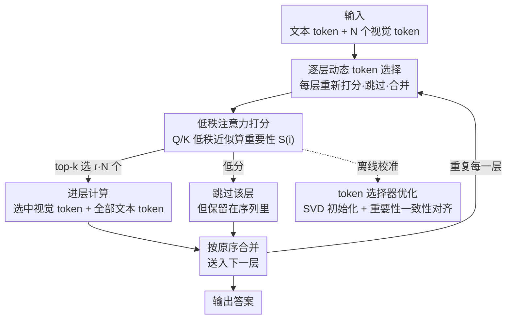

# One Layer's Trash is Another Layer's Treasure: Adaptive Layer-wise Visual Token Selection in LVLMs

**会议**: CVPR 2026  
**论文**: [CVF Open Access](https://openaccess.thecvf.com/content/CVPR2026/html/Chen_One_Layers_Trash_is_Another_Layers_Treasure_Adaptive_Layer-wise_Visual_CVPR_2026_paper.html)  
**代码**: 无  
**领域**: 模型压缩  
**关键词**: 视觉 token 压缩, LVLM 推理加速, 逐层动态选择, 低秩注意力近似, 免训练

## 一句话总结
针对大型视觉语言模型（LVLM）里视觉 token 太多拖慢推理的问题，ALVTS 不再像 FastV 那样在某一层一次性永久剪掉 token，而是在**每个解码层都重新挑一遍**——用一个低秩近似的轻量选择器给所有视觉 token 打分，重要的进层参与计算、不重要的直接跳过该层、之后再合并回完整序列，从而在压缩 89% token 的情况下保留 96.7% 的原始精度。

## 研究背景与动机
**领域现状**：LVLM 处理图像会生成大量视觉 token（LLaVA-NeXT 对一张 672×672 图能产出 2880 个 token，而文本输入通常不到 100 个），视觉模态主导了推理算力开销。视觉 token 剪枝因此成为主流加速手段，常见做法是用 ViT 里的 `[CLS]` 注意力或 LLM 里的 text-to-vision 注意力估计 token 重要性，然后在某个浅层把低分 token 剪掉（如 FastV 在 LLM 第 2 层剪枝、PyramidDrop 分阶段金字塔式丢弃）。

**现有痛点**：这些方法有一个共同的根本缺陷——**一旦某层把 token 剪掉，后续所有层都再也访问不到它**。这会造成不可恢复的信息丢失，而被丢掉的 token 可能恰恰是深层需要的关键信息。

**核心矛盾**：作者通过可视化 FastV 的逐层注意力发现明显的**跨层异质性**：同一张「Roebling 桥」图，第 2 层主要看桥的下部结构、第 10 层盯着桥名牌匾、第 20 层聚焦塔身。也就是说，**不同层的最优 token 子集是不一样的**。用单一固定子集贯穿全模型，本质上和「每层视觉关注点都在变」这一事实相冲突，必然在某些层丢掉它本该用到的区域。

**本文目标**：让每一层都能按自己的视觉关注点挑选 token，同时不付出「在每层做完整注意力计算」的昂贵代价，并且最好**不用重训练**整个 LVLM。

**核心 idea**：把「静态、一次性、不可逆」的剪枝换成「逐层、动态、可恢复」的**选择**——每层只处理它当下认为重要的 token，其余 token 跳过该层但保留在序列里随时可被后面的层重新选中（"一层的垃圾正是另一层的宝藏"）。

## 方法详解

### 整体框架
ALVTS（Adaptive Layer-wise Visual Token Selection）在 LLM 的**每个解码层前面**插入一个轻量 token 选择器。输入是 vision encoder + projector 产出的 $N$ 个视觉 token $X_V$ 和 $M$ 个文本 token $X_T$（拼成 $X=[X_T, X_V]$）。在进入第 $\ell$ 层前，选择器给每个视觉 token 算一个重要性分数 $S(i)$，用 top-k 选出比例为 $r$ 的高分 token $X_V^{(select)}$ 连同**全部文本 token**送进该层计算，剩下的 $X_V^{(skip)}$ 直接跳过这一层；层输出后，处理过的 token 和跳过的 token 按**原始位置顺序**重新合并成完整序列，喂给下一层。这个「打分 → 选 → 跳过 → 合并」的过程在每一层**独立重复**，于是不同层会选到不同的视觉子集，实现全模型范围内的自适应压缩。

整个方法围绕一个关键问题展开：**怎样不做完整注意力就判断 token 重不重要？** 答案是用注意力 Q/K 投影矩阵的低秩近似来"模拟"完整注意力的打分行为，再通过一个一致性对齐目标把这个近似器校准到几乎和原始注意力同样的选择倾向，并且**只训练这个轻量选择器、冻结原 LVLM**，因此免重训练。

### 关键设计

**1. 逐层动态 token 选择：让被跳过的 token 仍然可被后面的层捞回来**

这一设计直接针对「静态剪枝一刀切、后续层永远访问不到被剪 token」的痛点。ALVTS 不维护一个全局固定子集，而是在每层 $\ell$ 用重要性分数做 top-k 选择 $X_V^{(select)} = \mathrm{TopK}(X_V, S, k)$，其中 $k = \lfloor r \cdot N \rfloor$，$r$ 是选择比例；选中的 $k$ 个视觉 token 与全部文本 token 进层计算，补集 $X_V^{(skip)}$（剩余 $N-k$ 个）**跳过该层但不被删除**。层输出后两路 token 重新拼回完整长度，并**保持原始 token 顺序**以维护位置信息。关键在于"跳过"≠"剪掉"：一个 token 在浅层被判为不重要而跳过，到了深层只要它的注意力分数升上来，就能重新被选中参与计算。可视化（Fig. 5）显示，FastV 在剪枝层没关注到「装饰织物」就永久丢了，答错成"skirt"；ALVTS 在第 10、26 层重新捞回这些区域，答对"rug"。

**2. 低秩注意力近似打分：不做完整注意力也能估出 token 重要性**

逐层选择最大的算力风险是——如果每层都跑一遍完整自注意力来判断重要性，那压缩省下的算力又被吐回去了。ALVTS 用一个选择器 $P$ 绕开这点：把该层自注意力模块的 query/key 投影矩阵做**低秩分解**，$\tilde{W}_Q = U_Q V_Q$、$\tilde{W}_K = U_K V_K$，其中 $U_Q, U_K \in \mathbb{R}^{D \times R}$、$V_Q, V_K \in \mathbb{R}^{R \times D}$，秩 $R \ll D$。用它算出近似 query/key $\tilde{Q} = X\tilde{W}_Q^\top$、$\tilde{K} = X\tilde{W}_K^\top$，再得到近似注意力权重

$$\tilde{A} = \mathrm{softmax}\!\left(\frac{\tilde{Q}\tilde{K}^\top}{\sqrt{d_k}}\right) \in \mathbb{R}^{(M+N)\times(M+N)}.$$

把 $\tilde{A}$ 拆成 visual-to-visual 块 $\tilde{A}_{V2V} \in \mathbb{R}^{N\times N}$ 和 text-to-visual 块 $\tilde{A}_{T2V} \in \mathbb{R}^{M\times N}$，对第 $i$ 个视觉 token 分别算它收到的平均注意力：$S_{V2V}(i) = \frac{1}{N}\sum_{j=1}^{N}\tilde{A}_{V2V}(j,i)$、$S_{T2V}(i) = \frac{1}{M}\sum_{j=1}^{M}\tilde{A}_{T2V}(j,i)$。最终重要性分数取二者**乘积**：$S(i) = S_{V2V}(i)\cdot S_{T2V}(i)$。用乘法而不是加权和，是为了让 token 只有在**既被视觉上下文需要、又和文本指令相关**时才得高分——任一维度低分都会被压下去，从而过滤掉「图里显眼但和问题无关」或「和问题相关但视觉冗余」的 token。低秩让这个打分的开销远小于完整注意力（每层选择器只占基模型约 1–2% 参数，见 Tab. 4）。

**3. 选择器优化：SVD 初始化 + 重要性一致性对齐，免重训练贴近完整注意力**

低秩近似本身会引入误差，作者要保证选择器的打分行为和原始完整注意力一致，否则选错 token 等于白压。优化分两步：先用原始投影矩阵的 **SVD** 初始化低秩矩阵——对 $W_Q = U_{full}\Sigma V_{full}^\top$ 取前 $R$ 个奇异值，构造 $\Sigma_R^{1/2} = \mathrm{diag}(\sqrt{\sigma_1},\dots,\sqrt{\sigma_R})$，令 $U_Q = U_{full}[:, :R]\cdot\Sigma_R^{1/2}$、$V_Q = \Sigma_R^{1/2}\cdot V_{full}[:R, :]^\top$（$U_K, V_K$ 同理），让低秩近似在初始就尽量逼近原矩阵。之后再做**重要性一致性对齐**：对每个样本，用原模型的完整注意力算出参考分数 $S^*$，最小化低秩近似分数与之的重构误差

$$L = \frac{1}{N}\sum_{i=1}^{N}\big(S(i) - S^*(i)\big)^2.$$

每层选择器**独立优化**，且只更新选择器参数、原 LVLM 全程冻结。这一步极高效：只需从 LLaVA-655k 里随机采 256 个样本，LLaVA-1.5-7B 整个优化 15 分钟内完成。消融（Fig. 4）显示，优化后各层近似分数与 oracle 分数的 L2 距离分布显著向 0 集中，证明低秩选择器确实学到了完整注意力的打分模式。

### 损失函数 / 训练策略
唯一的训练目标就是上面的重要性一致性对齐损失 $L$（逐层、逐选择器独立优化的 MSE）。训练数据是 LLaVA-655k 里随机 256 个样本，原 LVLM 冻结，只调低秩矩阵。秩设置：LLaVA-1.5-7B / LLaVA-NeXT-7B 用 $R=256$，Qwen2.5-VL-3B 用 $R=128$，把每层参数开销控制在 2% 以内。

## 实验关键数据

### 主实验
在 LLaVA-1.5-7B 上、8 个多模态 benchmark（AI2D / POPE / TextVQA / OKVQA / VizWiz / COCO / NoCaps / RealWorldQA）平均性能对比（保留原模型百分比）：

| 压缩比 | FastV | PyramidDrop | DART | ALVTS（本文） |
|--------|-------|-------------|------|--------------|
| ↓67%（保留 192） | 97.07% | 98.19% | 98.13% | **99.60%** |
| ↓78%（保留 128） | 93.75% | 95.13% | 97.26% | **98.77%** |
| ↓89%（保留 64） | 85.13% | 88.52% | 93.27% | **96.73%** |

跨模型与高分辨率验证（89% 压缩比下的平均保留率）：

| 模型 | Vanilla token 数 | FastV | PyramidDrop | DART | ALVTS |
|------|-----------------|-------|-------------|------|-------|
| LLaVA-1.5-13B | 576 | 91.20% | 92.66% | 93.98% | **96.63%** |
| LLaVA-NeXT-7B（保留 320） | 至多 2880 | 89.70% | 94.54% | 93.84% | **96.25%** |
| Qwen2.5-VL-3B | 动态 | 80.23% | 78.43% | — | **86.39%** |

在最激进的 89% 压缩下，ALVTS 在 LLaVA-1.5-7B 上比 DART 高 3.46%、比 PyramidDrop 高 8.21%、比 FastV 高 11.60%；在 LLaVA-NeXT-7B 的 POPE 上达 87.09，甚至略超原模型，说明对高分辨率长 token 序列尤其有效。

### 消融实验
| 配置 | 关键结果 | 说明 |
|------|---------|------|
| ALVTS（完整） | COCO 95.81 / NoCaps 92.42 | 逐层动态选择 |
| w/o 动态选择（退化为静态剪枝） | COCO 88.05 / NoCaps 87.59 | 第 2 层一次性剪枝并贯穿全程（同 FastV 策略），COCO 掉 7.76%、NoCaps 掉 4.83% |
| SVD 初始化（未对齐） | L2 距离分布偏大 | 低秩近似分数与 oracle 差距明显 |
| + 重要性一致性对齐 | L2 距离向 0 集中 | 近似保真度显著提升 |

效率（LLaVA-1.5-7B，单张 4090，POPE）：

| 方法 | 端到端延迟 | Prefill | 精度 |
|------|-----------|---------|------|
| LLaVA-1.5-7B（原） | 211ms | 165ms | 100% |
| FastV（↓60%） | 179ms | 126ms | 93.2% |
| ALVTS（↓89%） | **156ms** | **103ms** | **97.7%** |

### 关键发现
- **动态选择是性能主来源**：去掉它退化成静态剪枝后，生成类任务（COCO/NoCaps）掉点最多（4.8–7.8%），直接印证「不同层最优 token 子集不同、静态剪枝过早丢信息」这一核心假设。
- **乘积式打分比单一信号稳**：同时要求视觉相关和文本相关，避免了只看 `[CLS]` 或只看 text-to-vision 各自的偏置。
- **免训练且开销极小**：每层选择器仅 ~1–2% 参数、15 分钟即可对齐完成，工程落地友好；prefill 端 1.6× 加速，正好打在 LVLM 推理最重的视觉前缀阶段。
- **越激进越占优**：压缩比从 67% 拉到 89%，ALVTS 与基线的差距越拉越大，说明"可恢复"机制在高压缩下保护关键 token 的价值更突出。

## 亮点与洞察
- **「跳过而非删除」是核心 trick**：把不可逆剪枝改成可逆选择，几乎不增加序列管理成本（只需维护原序合并），却根治了静态剪枝的信息丢失病——这个思路可迁移到任何「逐层/逐步丢弃中间状态」的高效推理场景。
- **用低秩近似"复刻"注意力打分**：不真算完整注意力，而是用 SVD 初始化 + MSE 对齐去模拟它的**排序行为**（重要的是相对排序而非精确值），在算力和保真度之间找到漂亮折中。
- **乘法门控的重要性融合**：$S = S_{V2V}\cdot S_{T2V}$ 这种"两个条件都满足才高分"的设计简单但有效，值得在其他多信号 token 评分里复用。

## 局限与展望
- 选择器虽轻量，但每层都要做一次低秩 Q/K 投影 + softmax，**层数很深时累积开销**仍存在，论文给的是 prefill 1.6×、端到端 1.35× 加速，离理论上限有差距。
- 需要为**每个模型、每一层**单独优化选择器，换 backbone 要重新对齐；虽然只要 15 分钟，但不是完全 zero-shot。
- ⚠️ 选择比例 $r$ 在不同层是否应自适应、还是全层共享，论文主要用统一比例，逐层自适应比例可能进一步提升（作者未深入探讨）。
- 评测集中在 VQA / captioning，对需要密集像素级定位（如指代分割）的任务，激进压缩是否仍安全有待验证。

## 相关工作与启发
- **vs FastV / VTW（静态剪枝）**：它们在某一浅层一次性剪掉 token 并贯穿全程，ALVTS 让每层重新选、被跳过的 token 仍可被深层捞回，从根上消除不可逆信息丢失。
- **vs PyramidDrop（分阶段金字塔剪枝）**：PDrop 仍是逐阶段单调递减地丢 token、丢了不回来；ALVTS 是逐层双向可恢复，89% 压缩下高出 8.21%。
- **vs DART / DivPrune（多样性剪枝）**：它们靠最大化 token 间多样性来减冗余，但同样是静态不可逆；ALVTS 用注意力近似打分 + 逐层动态，在高压缩比下优势更明显（89% 下高 3.46%）。

## 评分
- 新颖性: ⭐⭐⭐⭐ 「逐层可恢复选择」对静态剪枝范式是一次干净的范式转换，观察（跨层注意力异质性）也很扎实。
- 实验充分度: ⭐⭐⭐⭐ 覆盖 3 类架构、4 个基线、3 个压缩比、8 个 benchmark + 效率/可视化消融，较完整。
- 写作质量: ⭐⭐⭐⭐ 动机—方法—实验逻辑顺，标题与可视化讲故事到位。
- 价值: ⭐⭐⭐⭐ 免重训练、开销小、prefill 1.6× 加速，对 LVLM 部署有直接落地价值。

<!-- RELATED:START -->

## 相关论文

- [\[ACL 2026\] Adaptive Layer Selection for Layer-Wise Token Pruning in LLM Inference](../../ACL2026/model_compression/adaptive_layer_selection_for_layer-wise_token_pruning_in_llm_inference.md)
- [\[CVPR 2026\] HTTM: Head-wise Temporal Token Merging for Faster VGGT](httm_head-wise_temporal_token_merging_for_faster_vggt.md)
- [\[CVPR 2026\] PPCL: Pluggable Pruning with Contiguous Layer Distillation for Diffusion Transformers](ppcl_pluggable_pruning_dit_distillation.md)
- [\[CVPR 2026\] Hi-Lo Prune: Look at What You'll Lose before Pruning with Hierarchical Token Selection](hi-lo_prune_look_at_what_youll_lose_before_pruning_with_hierarchical_token_selec.md)
- [\[ACL 2026\] A Layer-wise Analysis of Supervised Fine-Tuning](../../ACL2026/model_compression/a_layer-wise_analysis_of_supervised_fine-tuning.md)

<!-- RELATED:END -->
