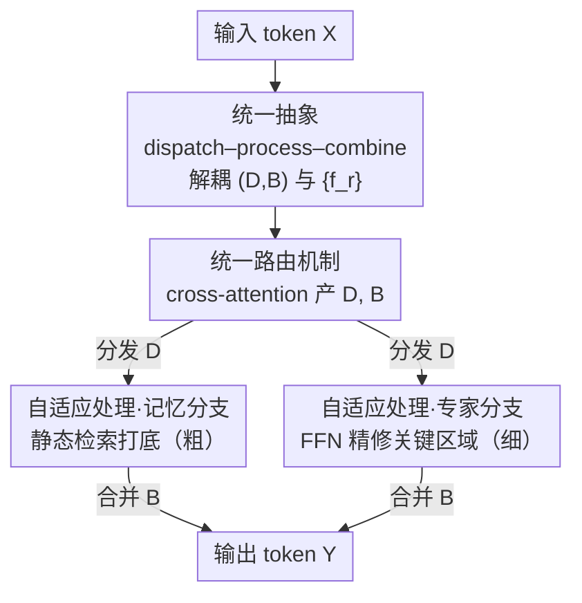

# OneSparse: A Unified Framework for Sparse Activation Layers in Vision Models

**会议**: CVPR 2026  
**论文**: [CVF Open Access](https://openaccess.thecvf.com/content/CVPR2026/html/Zhu_OneSparse_A_Unified_Framework_for_Sparse_Activation_Layers_in_Vision_CVPR_2026_paper.html)  
**代码**: https://github.com/Adlith/OneSparse  
**领域**: 模型压缩 / 稀疏激活  
**关键词**: 稀疏激活, Mixture-of-Experts, 记忆模块, 统一路由, 视觉骨干网络

## 一句话总结
OneSparse 把 MoE 和记忆模块这两类原本各走各路的稀疏激活层，统一到「dispatch–process–combine」同一套抽象里，并据此设计了混合稀疏层 Nexus Layer——用记忆单元廉价地给所有 token 打底、只让专家单元精修语义关键区域，在 ImageNet / COCO / ADE20K 上以更低算力刷出比纯 MoE、纯记忆更好的精度–效率前沿。

## 研究背景与动机
**领域现状**：大模型靠堆参数提升能力，但算力随之爆炸。稀疏激活层是解耦「容量」与「计算量」的主流手段——每个 token 只激活一小部分参数。目前有两大流派：一是 **Mixture-of-Experts（MoE）**，用路由器把 token 分给少数专家 FFN，做输入相关的动态变换；二是 **记忆模块（memory-based）**，把一个大的静态 key-value 库当查找表，token 作为 query 去检索最相似的若干 value 聚合输出。

**现有痛点**：这两条路线虽然目标都是「制造稀疏」，却各自独立演化、互不兼容。MoE 表达力强但计算昂贵（每个专家是个完整 FFN，还有路由开销），而且训练时硬路由容易负载不均，要靠额外的 load-balancing 正则才能稳。记忆模块检索极快、但本质是**静态查表**——它忽略聚合到自己头上的输入，只是返回固定的 value 向量，缺乏 MoE 那种动态变换能力；而且记忆模块大多在 NLP 里研究，在视觉里几乎没人系统验证过。

**核心矛盾**：MoE 和记忆是同一光谱的两个极端——一端是「动态但贵」，另一端是「高效但不自适应」。现有设计被迫在「效率 / 负载均衡 / 自适应性」之间三选二，没有框架能把它们放在一起比较，更没有方法把两者的长处揉到一起。

**本文目标**：(1) 提出一个能同时容纳 MoE 与记忆的统一抽象，让二者可被系统比较；(2) 在这个抽象的指导下，设计一个真正融合两者优势的混合稀疏层。

**切入角度**：作者观察到，不管是 MoE 还是记忆模块，前向计算都能拆成三步——把 token 分发到处理单元（dispatch）、各单元处理（process）、把结果加权合并（combine）。两者的唯一本质区别只在「process 这步是动态变换还是静态查表」。

**核心 idea**：把**路由逻辑**和**处理函数**彻底解耦，得到一个连续设计空间；MoE 与记忆只是这个空间里两个特例。在空间内部取「记忆打底 + 专家精修」的混合点，就是 Nexus Layer。

## 方法详解

### 整体框架
OneSparse 的贡献分两层：先是一个**统一抽象**（把已有稀疏层全部翻译成同一套数学形式），再是抽象指导下落地的**一个具体新层 Nexus Layer**。

抽象的核心是：任何稀疏激活层都由一个**路由器**和一组**处理函数** $\{f_r\}$ 组成。给定一批 $N$ 个 token $X \in \mathbb{R}^{N\times D}$、$E$ 个处理单元、每个单元 $C$ 个容量槽位，路由器一次产出两个张量——分发张量 $D \in \mathbb{R}^{N\times E\times C}$（token $i$ 投到槽位 $(r,c)$ 的权重）和合并张量 $B \in \mathbb{R}^{N\times E\times C}$（槽位 $(r,c)$ 输出在 token $j$ 最终表示里的权重）。整层前向写成一个统一式子：

$$y_j = \sum_{r=1}^{E}\sum_{c=1}^{C} B_{j,r,c}\cdot f_r\!\left(\sum_{i=1}^{N} D_{i,r,c}\, x_i\right).$$

内层求和按 $D$ 把 token 聚到每个槽位，$f_r$ 处理这个聚合输入，外层按 $B$ 把结果合回。这套 $(D, B, \{f_r\})$ 把「路由逻辑 $(D,B)$」和「计算 $\{f_r\}$」分开，露出两条正交设计轴：路由从硬分配到软分配，处理函数从动态变换到静态查表——MoE 和记忆就是这两轴上的不同取值。

Nexus Layer 就是在这个空间里取的混合点，pipeline 是三段：**统一路由器**用 cross-attention 把 token 软分配到异构槽位 → 一半槽位走**记忆分支**做廉价检索打底、一半走**专家分支**做 FFN 精修 → 按 $B$ 合并成输出。

### 关键设计

**1. dispatch–process–combine 统一抽象：把 MoE 和记忆翻译成同一套数学**

这一步解决的是「两个流派没法比较、没法融合」的根本问题。作者证明，token-choice MoE、expert-choice MoE、SoftMoE、Product Key Memory 全都能写成上面那个统一式子，差别只在如何填 $(D, B, \{f_r\})$。以 token-choice MoE 为例：$D_{i,r,c}=\mathbb{1}[r\in I_i \wedge c=c(i,r)]$ 是硬分配（把原始 token 直接送给被选中的专家），$B$ 填归一化路由权重 $g_{j,r}/\sum_{k\in I_j} g_{j,k}$，而 $f_r$ 是动态 FFN。记忆模块（PKM）则把记忆库里 $K^2$ 个 value 向量各看作一个容量为 $C=1$ 的处理单元，两级 ANN 检索 $D_{i,r,1}=\mathbb{1}[r\in S_i]$ 充当「极高效的路由器」，而处理函数是**静态查表** $f_r(\sum_i D_{i,r,1} x_i)=v_r$——它无视输入，直接返回这个单元自带的可学习 value。一边动态变换、一边静态查表，正好是处理函数轴的两端。把已有方法摆进同一坐标系，比较和混合才有可能，这是整篇论文的地基。

**2. 统一路由机制：用一套 cross-attention 路由器同时管专家和记忆，且天生负载均衡**

抽象告诉我们可以混合，但混合马上撞到一个工程难题：专家和记忆是异构单元，怎么用**同一个**路由器把 token 分给它们？Nexus 用 cross-attention 解决。它把整层切成 $E=E_{mem}+E_{exp}$ 个处理单元，并把原本 $K^2$ 个零散记忆向量**重组成 $E_{mem}=K$ 个组**、每组 $K$ 个 value——这样不论专家还是记忆组，都对外暴露 $C$ 个槽位，结构对齐。路由器给每个槽位 $(r,c)$ 配一个可学习 query $q_{r,c}$，token $x_i$ 投影成 key $k_i=W_K x_i$，亲和度 $s_{i,r,c}=k_i^\top q_{r,c}$。分发张量沿 **token 维**做 softmax（每个槽位从所有 token 里聚合输入），合并张量沿**槽位维**做 softmax（决定各槽位输出怎么合回 token）：

$$D_{i,r,c}=\frac{\exp(s_{i,r,c})}{\sum_{i'}\exp(s_{i',r,c})},\qquad B_{j,r,c}=\frac{\exp(s_{j,r,c})}{\sum_{r',c'}\exp(s_{j,r',c'})}.$$

这带来两个直接好处。一是全程可微的软路由，专家和记忆用同一机制统一处理，不用为两类单元各写一套逻辑；二是**结构性负载均衡**——因为每个单元占的槽位数相同，分发是对每个槽位独立 softmax，天然不会出现硬路由那种「热门专家挤爆、冷门专家闲置」的失衡，于是**不需要任何 load-balancing 辅助损失**就能稳定训练。消融里这套统一路由（先把 token 分到记忆组、再组内细检索的层次化方案）相比直接套 PKM 的 Product Key 路由把精度从 79.4% 提到 80.1%，而把 MoE 的 expert-choice 路由硬套到记忆上则直接 OOM（路由目标数爆炸到 $K^2$ 量级）。

**3. 自适应处理策略：记忆廉价打底、专家精修关键区域**

有了统一路由，接下来要回答「混合层里两类单元各干什么」。作者的依据是视觉的一个常识：自然图像里大片是冗余背景，语义集中在少数局部结构上。所以 Nexus 把算力按 token 重要性分配——$E_{mem}$ 个**记忆单元**给所有 token 廉价打底，$E_{exp}$ 个**专家单元**只精修语义关键区域。两类单元拿到统一路由给的输入槽 $z^{in}_{r,c}$ 后，处理函数不同。记忆分支（粗）把 $z^{in}_{r,c}$ 当 query，在自己那组可学习 key-value $\{k_{r,m},v_{r,m}\}_{m=1}^K$ 里做 top-$k$ 点积检索：

$$f_r(z^{in}_{r,c})=\sum_{m\in T_{r,c}}\frac{\exp((z^{in}_{r,c})^\top k_{r,m})}{\sum_{m'\in T_{r,c}}\exp((z^{in}_{r,c})^\top k_{r,m'})}\, v_{r,m},$$

相当于用记忆库里的原型模式拼出一个廉价的特征近似。专家分支（细）则是标准动态变换 $f_r(z^{in}_{r,c})=\mathrm{FFN}_r(z^{in}_{r,c})$，负责处理复杂、输入相关的结构。两者的输出再按 $B$ 合并。可视化（Fig. 3）显示两支确实功能分化：记忆单元覆盖大范围上下文，专家单元聚焦显著物体。计算分配消融（Fig. 4）进一步印证——纯记忆只有 80.1%、纯专家 80.8% 但算力高 1.2×，而平衡的混合配置以接近纯记忆的效率拿到 81.2%，混合点确实优于两个极端。

## 实验关键数据

### 主实验
在 ViT 与 ConvNeXt 两种骨干上，稀疏层固定插在相同位置（ViT 的 5/7/9/11 层、ConvNeXt 的 Stage 3），与 TC-MoE、EC-MoE、SoftMoE、Memory+ 公平对比。

| 任务 / 骨干 | 指标 | Dense | 最强 MoE | Memory+ | Nexus(本文) |
|------|------|------|------|------|------|
| ImageNet ViT-S | Top-1 Acc / FLOPs | 78.8% / 4.3G | 80.8% / 5.4G | 79.3% / 4.3G | **81.2% / 4.3G** |
| ImageNet ViT-T | Top-1 Acc / FLOPs | 73.9% / 1.1G | 76.9% / 1.4G | 75.9% / 1.1G | **77.1% / 1.3G** |
| COCO 检测 ViT-S | AP$^{bbox}$ | 40.2 | 42.2 | 41.5 | **42.7** |
| ADE20K 分割 ViT-S | mIoU | 44.6% | 45.3% | 44.8% | **45.8%** |
| ImageNet ConvNeXt-B | Top-1 Acc / FLOPs | 83.8% / 15.4G | 84.2% / 17.5G | 83.8% / 15.3G | **84.5% / 15.3G** |

ViT-S 上 Nexus 以和 Dense 持平的 4.3G FLOPs 把精度提了 2.4 个点；相比最强 MoE 基线，精度更高的同时算力省 20% 以上；相比 Memory+ 精度高 1.9 点且参数少约 30%。

### 消融实验

| 配置 | FLOPs(G) | Params(M) | Acc(%) | 说明 |
|------|------|------|------|------|
| Product Key 路由 | 4.4 | 78.7 | 79.4 | 纯记忆式 ANN 检索，负载不均、参数利用差 |
| Expert-Choice 路由 | 59.9 | 244 | OOM | MoE 路由硬套记忆，路由目标爆炸不可行 |
| 统一路由（本文） | 4.2 | 77.7 | **80.1** | 先分组再组内检索，均衡且高效 |
| 全记忆 (All Memory) | — | — | 80.1 | 算力最低但精度受限 |
| 全专家 (All MoE) | — | — | 80.8 | 精度higher但算力 >1.2× |
| 平衡混合 MoE:Mem (本文) | — | — | **81.2** | 兼顾精度与效率 |

### 关键发现
- **统一路由是混合得以成立的关键**：直接用记忆式路由（PK）不均衡、直接用 MoE 路由（EC）算力爆炸；只有「先分组、再组内细检索」的层次化统一路由能在可控成本下做到均衡分配。
- **混合优于两个极端**：固定参数预算下，纯记忆（80.1%）和纯专家（80.8%）都不如平衡混合（81.2%），且混合的算力接近纯记忆，说明「记忆打底 + 专家精修」不是简单折中而是更优工作点。
- **密集预测任务收益更明显**：COCO / ADE20K 上 token 复杂度随物体几何与场景布局变化更大，正好契合「冗余区交给记忆、关键区交给专家」的设计，因此增益比分类更突出。
- **跨架构通用**：在 Transformer（ViT）与卷积（ConvNeXt）上都稳定领先，抽象不依赖具体骨干。

## 亮点与洞察
- **「先统一、再创新」的研究范式**：先用一个数学抽象把两个看似无关的流派证明成同一框架的特例，再从框架空隙里读出新方法。这种「抽象驱动设计」比直接拍脑袋拼模块更有说服力，也让贡献可迁移——任何新稀疏层都能往这套 $(D,B,\{f_r\})$ 里套来比较。
- **用「重组记忆为组」换来结构性负载均衡**：把 $K^2$ 个零散记忆向量重组成 $K$ 组、每组暴露等量槽位，使得软路由天生均衡，省掉了 MoE 训练里恼人的辅助 load-balancing 损失——这是个干净利落的工程巧思。
- **把视觉先验写进算力分配**：「语义集中在局部」这一视觉常识被直接编码成「记忆打底 + 专家精修」的双分支，可视化证明两支真的学到了功能分化，这种「设计动机能在结果里被看见」的论文读起来很扎实。

## 局限与展望
- **记忆/专家配比靠经验定**：作者承认两者的算力分配是经验扫出来的（Fig. 4 网格搜索），未来应做成可学习或动态分配，而非固定 MoE:Mem 比例。
- **FLOPs 省了但 wall-clock 未必**：论文坦言 FLOPs–精度前沿的改善要落到真实延迟还需硬件感知优化，记忆检索的 top-$k$ 和 cross-attention 路由在实际部署上未必比 dense FFN 快。⚠️ 论文未给出实测推理时延对比。
- **规模偏小**：实验止步于 ViT-S/ConvNeXt-B 这一量级，统一路由在更大模型、更多专家/记忆单元下能否依旧稳定均衡，缺乏验证。
- **改进思路**：把配比交给一个轻量超网/门控按输入图像难度动态决定记忆与专家的激活比例，或许能进一步压低简单图像的算力。

## 相关工作与启发
- **vs Token-Choice / Expert-Choice MoE**：它们纯靠动态专家变换，表达力强但算力高、需辅助均衡损失；Nexus 把一部分算力换成廉价记忆检索，在更低 FLOPs 下反超其精度，本质是「不是所有 token 都值得专家精修」。
- **vs SoftMoE**：SoftMoE 用可学习 slot 做软路由解决均衡，Nexus 借鉴了软分配思想，但更进一步把记忆单元也纳入同一路由，处理函数从「全动态」扩展到「动态+静态」混合谱。
- **vs Product Key Memory / Memory+**：纯记忆模块检索高效但静态、缺均衡机制、在视觉里没系统验证；Nexus 把记忆重组成组、套上统一路由补齐均衡，再叠加少量专家补齐动态变换能力，相当于把记忆模块「升级」成可与 MoE 同台竞争的混合层。

## 评分
- 新颖性: ⭐⭐⭐⭐⭐ 把 MoE 与记忆统一进同一抽象、并据此设计混合层，视角新且贡献清晰
- 实验充分度: ⭐⭐⭐⭐ 覆盖分类/检测/分割 ×2 骨干 ×4 基线，消融到位；但缺真实延迟与更大规模验证
- 写作质量: ⭐⭐⭐⭐⭐ 抽象—实例—验证的逻辑链条干净，公式与动机对得上
- 价值: ⭐⭐⭐⭐ 为视觉混合稀疏架构提供了可复用的框架与强基线，工程落地价值待硬件优化补齐

<!-- RELATED:START -->

## 相关论文

- [\[CVPR 2026\] Teacher-Guided Routing for Sparse Vision Mixture-of-Experts](teacher-guided_routing_for_sparse_vision_mixture-of-experts.md)
- [\[CVPR 2026\] Towards Unified Human Perception and Machine Understanding: Token Flow Guided Compression Framework](towards_unified_human_perception_and_machine_understanding_token_flow_guided_com.md)
- [\[CVPR 2026\] Decompose, Mix, Adapt: A Unified Framework for Parameter-Efficient Neural Network Recombination and Compression](decompose_mix_adapt_a_unified_framework_for_parameter-efficient_neural_network_r.md)
- [\[ICLR 2026\] ODESteer: A Unified ODE-Based Steering Framework for LLM Alignment](../../ICLR2026/model_compression/odesteer_a_unified_ode-based_steering_framework_for_llm_alignment.md)
- [\[CVPR 2026\] SCoRe: Salience-Coverage Reduction for Vision Token Pruning in Vision-Language Models](score_salience-coverage_reduction_for_vision_token_pruning_in_vision-language_mo.md)

<!-- RELATED:END -->
